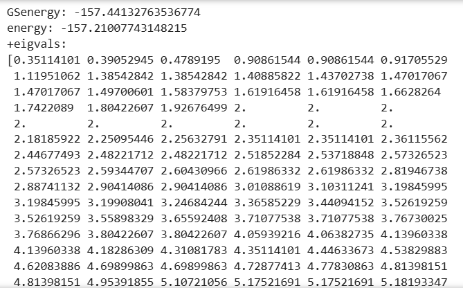
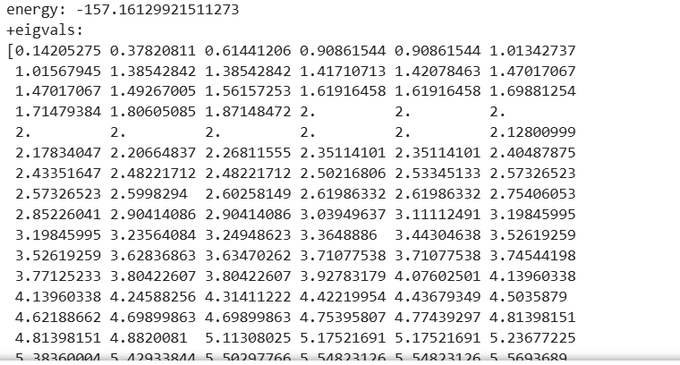
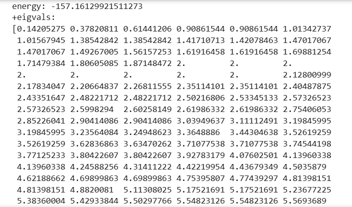
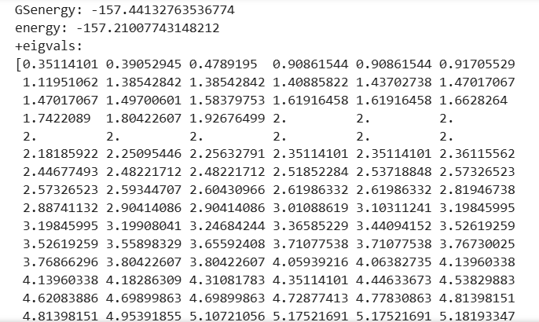
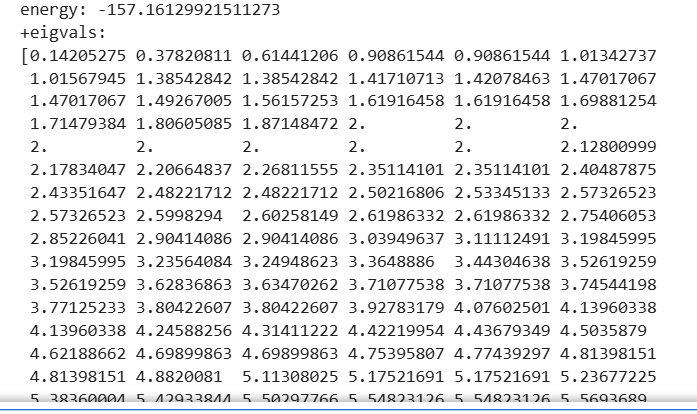
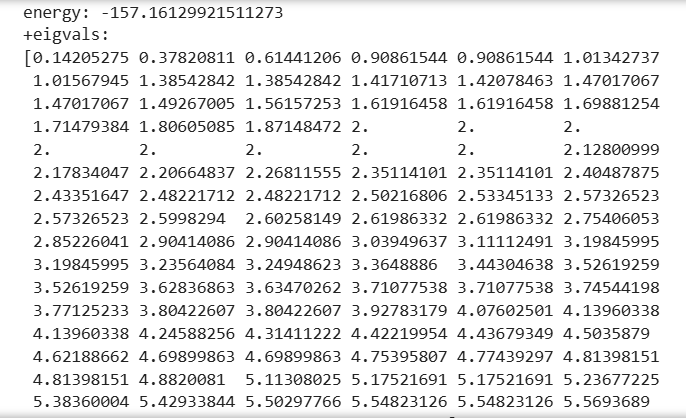
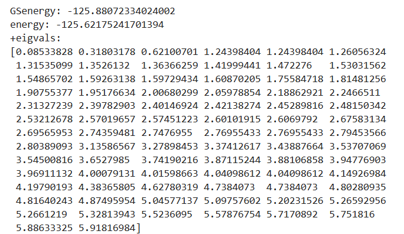
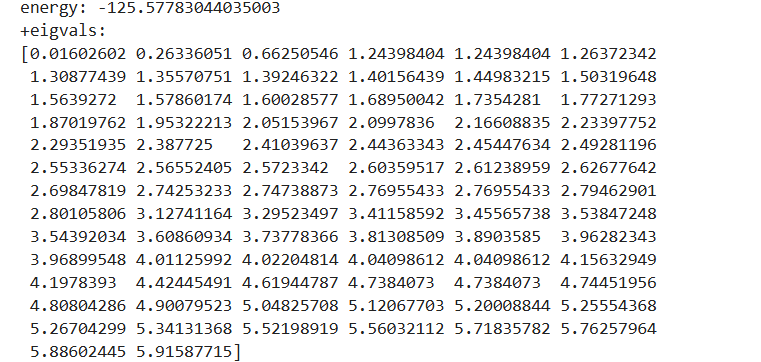
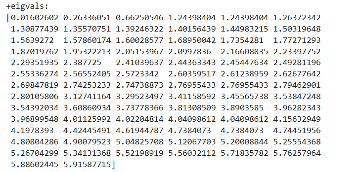
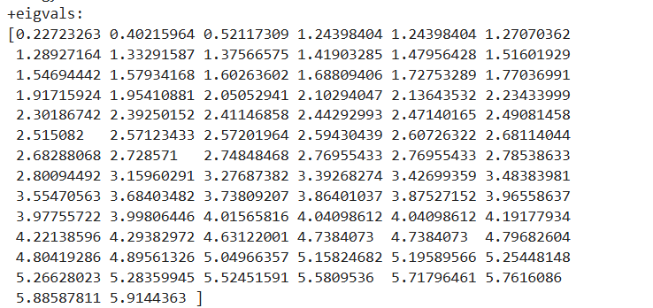

#### 本征值对比

$N_1,=10,N_2=10,n_1=N_1/2,n_2=N_2/2 $

$N_1,=10,N_2=10,n_1=N_1/2 + 1,n_2=N_2/2 + 1 $

$N_1,=8,N_2=10,n_1=N_1/2,n_2=N_2/2 $

$N_1,=8,N_2=10,n_1=N_1/2 + 1,n_2=N_2/2 + 1 $

#### 本征向量对比

