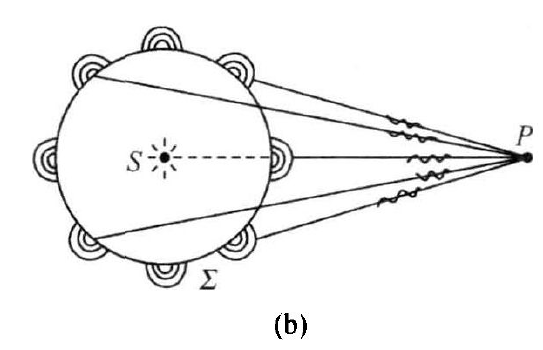
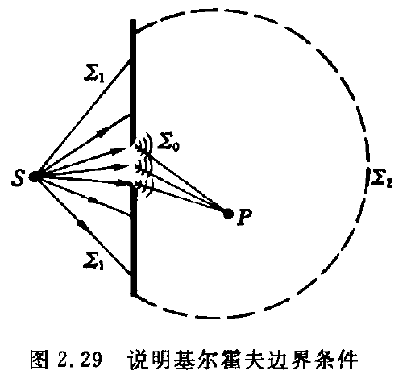

# 光的衍射

#### 衍射现象

波在传播传播过程中遇到障碍物，能够绕过障碍物的边缘前进。这种偏离直线传播的现象成文衍射现象。

波长越大，障碍物越小，衍射越明显。

#### 惠更斯-菲涅耳原理

波前上的每个面元可以看为次波源，它们向四周发射次波；波场中任一场点的扰动，是所有次波源所贡献的次级扰动的**相干叠加**。

设波前 $\Sigma $ 上任一面元 $\mathrm{d}S $ 对场点 $P $ 贡献的刺激扰动复振幅为 $\mathrm{d}\tilde{U}(P) $，则按惠更斯-菲涅耳原理，总扰动 $\tilde{U}(P) $ 应表达为：

$$
\tilde{U}(P)
=\oiint\limits_{(\Sigma)}\mathrm{d}\tilde{U}(P)
$$

#### 菲涅耳衍射积分式

决定 $\mathrm{d}\tilde{U}(P) $ 的因素：

$$
\begin{aligned}
\mathrm{d}\tilde{U}(P)
&\propto \mathrm{d}S ~~波前上作为次波源的微分面元\\
&\propto \tilde{U}_0(Q) ~~次波源自身的复振幅\\
&\propto \frac{1}{r}e^{\mathrm{i}kr} ~~次波源发射球面波到达场点\\
&\propto f(\theta_0,\theta) ~~倾斜因子用以表明次波面源的发射并非各向同性
\end{aligned}
$$

综合以上因素，$\displaystyle{\tilde{U}(P)=\oiint\limits_{(\Sigma)}\mathrm{d}\tilde{U}(P) }$ 可以进一步表达为：

$$
\boxed{
\tilde{U}(P)
=K\oiint\limits_{(\Sigma)}f(\theta_0,\theta)\tilde{U}_0(Q)\frac{e^{\mathrm{i}kr}}{r}\mathrm{d}S
}
$$

其中，$Q $ 是次波源，$\mathrm{d}S $ 是波前 $\Sigma $ 上 $Q $ 点处的一个小面元，$\tilde{U}_0(Q) $ 是 $Q $ 点复振幅，$r $ 是次波源 $Q $ 到场点 $P $ 的距离，$f(\theta_0,\theta) $ 是倾斜因子。

#### 基尔霍夫衍射积分式

基尔霍夫从定态波场的亥姆霍兹方程出发，利用矢量场论中的格林公式，在 $kr\gg 1$，即 $r\gg \lambda $ 的条件下，导出了无源空间边值定解的表达式：

$$
\tilde{U}(P)
=\frac{-\mathrm{i}}{\lambda}\oiint\limits_{(\Sigma)}\frac{1}{2}(\cos\theta_0+\cos\theta)\tilde{U}_0(Q)\frac{e^{\mathrm{i}kr}}{r}\mathrm{d}S
$$

凡是隔离实在的点光源与场点的任意闭合曲面，都可以作为衍射积分式中的积分面。

#### 基尔霍夫边界条件

取闭合面：

$$
(\Sigma)
=\Sigma_0+\Sigma_1+\Sigma_2
$$

其中，$\Sigma_0$ 是光孔面，$\Sigma_1$ 是光屏面，$\Sigma_2$ 是无穷远半球面。

基尔霍夫边界条件认为：

（1）无穷远面$\Sigma_2 $ 上的波前对场点的贡献为零

（2）光屏面 $\Sigma_1 $ 上波前函数为零，对场点也没有贡献

（3）只有光孔面 $\Sigma_0 $ 的波前对场点有贡献，且其波前函数 $\tilde{U}_0'(Q) $ 等于无屏障时自由传播的光场 $\tilde{U}_0(Q) $，即 $\tilde{U}_0'(Q)=\tilde{U}_0(Q) $

基于此，基尔霍夫衍射积分式简化为：

$$
\tilde{U}(P)
=\frac{-\mathrm{i}}{\lambda}\iint\limits_{\Sigma_0} f(\theta_0,\theta)\tilde{U}_0(Q) \frac{1}{r}e^{\mathrm{i}kr}\mathrm{d}S
$$

其中，倾斜因子为 $f(\theta_0,\theta)=\frac{1}{2}(\cos\theta_0+\cos\theta) $

#### 傍轴条件衍射积分式

傍轴条件下，

倾斜因子 $f(\theta_0,\theta)=\frac{1}{2}(\cos\theta_0+\cos\theta)\approx 1 $

球面次波函数 $\frac{1}{r}e^{\mathrm{i}kr}\approx \frac{1}{r_0}e^{\mathrm{i}kr} $

得到傍轴条件衍射积分公式：

$$
\tilde{U}(P)
=\frac{-\mathrm{i}}{\lambda r_0}\iint\limits_{\Sigma_0}\tilde{U}_0(Q)e^{\mathrm{i}kr}\mathrm{d}S
$$

### 衍射系统及其分类——菲涅耳衍射与夫琅禾费衍射

#### 菲涅耳衍射

光源到衍射屏、衍射屏到接收屏之间的距离均为有限远，或其中之一是有限远的场合；或者说，**球面波照明**时在**有限远处接收**的是菲涅耳衍射场。

#### 夫琅禾费衍射

光源到衍射屏、衍射屏到接收屏的距离都是无限远；或者说。**平面波照明**时在**无穷远处接收**的是夫琅禾费衍射场。

### 衍射巴比涅原理

设 $\Sigma_a,\Sigma_b $ 是一对透光率互补的屏面，现将它们作为衍射屏先后插置于衍射系统中，设 $\Sigma_a$ 单独存在时形成的衍射场为 $\tilde{U}_a(P) $，$\Sigma_b$ 单独存在时形成的衍射场为 $\tilde{U}_b(P)$，光波通行无阻时全波前 $\Sigma_0$ 形成的自由光场为 $\tilde{U}_0(P)$，由于：

$$
\Sigma_a+\Sigma_b
=\Sigma_0
$$

根据基尔霍夫衍射积分公式，结合二重积分的区域可加性，有：

$$
\begin{aligned}
\tilde{U}_0(P)
&=\frac{-\mathrm{i}}{\lambda}\underset{(\Sigma_0)}{\iint} f(\theta_0,\theta)\tilde{U}_0(Q)\frac{1}{r}e^{\mathrm{i}kr}\mathrm{d}S \\
&=\frac{-\mathrm{i}}{\lambda}\underset{(\Sigma_a)+(\Sigma_b)}{\iint} f(\theta_0,\theta)\tilde{U}_0(Q)\frac{1}{r}e^{\mathrm{i}kr}\mathrm{d}S \\
&=\frac{-\mathrm{i}}{\lambda}\underset{(\Sigma_a)}{\iint} f(\theta_0,\theta)\tilde{U}_0(Q)\frac{1}{r}e^{\mathrm{i}kr}\mathrm{d}S 
+\frac{-\mathrm{i}}{\lambda}\underset{(\Sigma_b)}{\iint} f(\theta_0,\theta)\tilde{U}_0(Q)\frac{1}{r}e^{\mathrm{i}kr}\mathrm{d}S\\
&=\tilde{U}_a(P)+\tilde{U}_b(P)
\end{aligned}
$$

最终结果是：

$$
\tilde{U}_0(P)
=\tilde{U}_a(P)+\tilde{U}_b(P)
$$

这一反映两个孔型互补屏产生的两个衍射场关系的方程，称为**巴比涅原理**(Babinet principle)

#### 巴比涅原理的应用

由于自由光场是容易知道的，故我们可以由单缝衍射场，直接导出细丝衍射场；由圆孔衍射场，直接导出圆屏衍射场

### 圆孔和圆屏菲涅耳衍射

#### 半波带法

#### 螺旋式曲线

效仿半波带方法，将每个半波带再细分为 $N$ 个环带；每个细环带上的次波源对场点贡献的小扰动，可由一个小矢量表示；这 $N $ 个小矢量长度相等，取向渐变以反映彼此间的相位差。这些小矢量头尾相接，形成半个正多边形，其极限过渡为半圆。于是，波前上全部次波源在轴上场点 $P_0 $ 贡献地扰动小矢量，形成一个个半径及其缓慢收缩地螺旋式曲线。借此，可以求得 $k $ 为非整数时的衍射强度 $I(P_0) $

### 单缝夫琅禾费衍射

平行光照射单缝，在透镜后焦面 $\mathscr{F}' $ 上接收夫琅禾费衍射场。

单狭缝的宽度 $\Delta x_0=a\ll  $ 长度 $\Delta y_0=b$，其衍射强度显著地沿 $x $ 轴扩展。

#### 矢量图解法

$\theta $ 是衍射角，用于标定场点 $P $ 的位置，现在分析后焦面上的衍射强度分布 $I(\theta) $：

由透镜的性质，像空间后焦面上的一个点对应于物空间的一个方向，即从单缝出发衍射角为 $\theta $ 的一系列次波线才能会聚在后焦面上的一点 $P $，发生相干叠加，从而决定了衍射强度。

为此，将单缝的宽度 $\Delta x_0=a$ 继续细分（尽管已经很细了）为一系列更细的细缝，每个细缝作为次波源对场点贡献一个小扰动，用一个小矢量；这一系列小矢量长度相等，但取向依次变动，首位相接，形成一段圆弧。

这段圆弧 $\mathop{AB}\limits^{\frown} $ 起点 $A $ 与终点 $B $ 的两条切线的夹角 $\delta $ 是确定的，因为它代表了 $A $ 边与 $B $ 边贡献的两个小扰动之间的相位差 $\delta_{AB} $，而相位差 $\delta_{AB} $ 又取决于光程差。

光程差为：

$$
\begin{aligned}
\Delta 
&=L(BP)-L(AP) \\
&=n\overline{BC} \\
&=na\sin\theta
\end{aligned}
$$

由光程差和相位差的关系，可得：

$$
\begin{aligned}
\delta_{AB}
&=\frac{2\pi}{\lambda_0}\Delta \\
&=\frac{2\pi}{\lambda }a\sin\theta
\end{aligned}
$$

$\mathop{AB}\limits^{\frown}=A_0 $，$\angle AOB=\delta$，$\displaystyle{R=\frac{\mathop{AB}\limits^{\frown}}{\delta} }$，于是可以求得相干叠加的合成振幅：

$$
\begin{aligned}
A(\theta)
&=2R\sin\frac{\delta}{2} \\
&=2\cdot\frac{\mathop{AB}\limits^{\frown}}{\delta}\cdot\sin\frac{\delta}{2} \\
&=A_0\frac{\sin \frac{\delta}{2}}{(\frac{\delta}{2})}
\end{aligned}
$$

引入宗量：

$$
\alpha
=\frac{\delta}{2}
=\frac{\pi a\sin\theta}{\lambda}
$$

得到单缝夫琅禾费衍射场的振幅分布和强度分布：

$$
A(\theta)
=A_0\frac{\sin\alpha}{\alpha},~~\alpha=\frac{\pi a\sin\theta}{\lambda}
$$

$$
I(\theta)
=I_0\bigg( \frac{\sin\alpha}{\alpha} \bigg)^2,~~I_0=A_0^2,\alpha=\frac{\pi a\sin\theta}{\lambda} 
$$

其中，$A_0$ 代表一系列振动小矢量取向一致时的合成振幅。

#### 衍射积分法

单缝夫琅禾费衍射场也可以由傍轴衍射积分公式求得：

$$
\tilde{U}(P)
=\frac{-\mathrm{i}}{\lambda r_0}\iint\tilde{U}_0(Q) e^{\mathrm{i}kr}\mathrm{d}S
$$

经透镜变换，振幅系数：

$$
\frac{1}{r_0}\to \frac{1}{f}
$$

平行光正入射：

$$
\tilde{U}_0(x_0)
=A
$$

积分面元：

$$
\mathrm{d}S
=b\mathrm{d}x_0
$$

相位因子 $e^{\mathrm{i}kr} $：

$$
\begin{aligned}
kr
&=\frac{k}{n}\cdot nr \\
&=k_0 L \\
&=k_0(L-L_0)+k_0 L_0 \\
&=-k_0 n x_0 \sin\theta+k_0 L_0 \\
&=-kx_0 \sin\theta+k_0 L_0
\end{aligned}
$$

其中，$L_0 $ 是坐标原点 $O $ 出发沿 $\theta $ 方向到达场点 $P $ 的光程 $L_0(OP) $，作为参考光程。

综上，衍射积分式可以表示为：

$$
\begin{aligned}
\tilde{U}(\theta)
&=\frac{-\mathrm{i}}{\lambda r_0}\iint\tilde{U}_0(Q) e^{\mathrm{i}kr}\mathrm{d}S \\
&=\frac{-\mathrm{i}}{\lambda f}\int_{x_0=-a/2}^{x_0=a/2} A\cdot e^{\mathrm{i}(-k x_0 \sin\theta+k_0 L_0)}\cdot b\mathrm{d}x_0 \\
&=\frac{-\mathrm{i}}{\lambda f}Abe^{\mathrm{i}k_0 L_0}\int_{x_0=-a/2}^{x_0=a/2}e^{-\mathrm{i} k x_0\sin\theta}\mathrm{d}x_0 \\
&=\frac{-\mathrm{i}}{\lambda f}Abe^{\mathrm{i}k_0 L_0}\cdot \frac{2\sin (\frac{a}{2}k\sin\theta)}{k\sin\theta} \\
&=\frac{-\mathrm{i}}{\lambda f}(ab)A e^{\mathrm{i} k_0 L_0}\cdot\frac{\sin(\frac{a}{2}k\sin\theta) }{\frac{a}{2}k\sin\theta} \\
&=\frac{-\mathrm{i}}{\lambda f}(ab)A e^{\mathrm{i} k_0 L_0}\cdot \frac{\sin (\frac{a}{2}\frac{2\pi}{\lambda }\sin\theta)}{\frac{a}{2}\frac{2\pi}{\lambda }\sin\theta} \\
&=\frac{-\mathrm{i}}{\lambda f}(ab)A e^{\mathrm{i} k_0 L_0}\cdot \frac{\sin(\frac{\pi a\sin\theta}{\lambda })}{\frac{\pi a\sin\theta}{\lambda}} \\
&=\frac{-\mathrm{i}}{\lambda f}(ab)A\cdot\frac{\sin \alpha}{\alpha},~~\alpha=\frac{\pi a\sin\theta}{\lambda} \\
&=\boxed{\tilde{c} e^{\mathrm{i}k_0 L_0}\cdot\frac{\sin\alpha}{\alpha}},~~\tilde{c}=\frac{-\mathrm{i}}{\lambda f}(ab)A,~~\alpha=\frac{\pi a\sin\theta}{\lambda}
\end{aligned} 
$$

光强分布为：

$$
\begin{aligned}
I(\theta)
&=\tilde{U}\tilde{U}^* \\
&=I_0\bigg( \frac{\sin\alpha}{\alpha} \bigg)^2 
\end{aligned}
$$

其中，

$$
\tilde{c}
=\frac{-\mathrm{i}}{\lambda f}(ab)A,~~
I_0
=\tilde{c}\tilde{c}^*
=\frac{(ab)^2}{(\lambda f)^2}A^2,~~
\alpha
=\frac{\pi a\sin\theta}{\lambda}
$$

$$
A(\theta)
=A_0\frac{\sin\alpha}{\alpha},~~
\alpha
=\frac{\pi a\sin\theta}{\lambda}
$$

#### 单缝夫琅禾费衍射的主要特征

（1）**最大值**

$$
I(\theta)
=I_0\frac{\sin(\frac{\pi a\sin\theta}{\lambda})}{\frac{\pi a\sin\theta}{\lambda}}
$$

当 $\theta=0 $ 时，$I(\theta) $ 取最大值 $I(0)=I_0 $，称为零级衍射峰。可以看出，$I_0 $ 的物理就是零级衍射峰的光强。

（2）**零点位置**

$$
I(\theta)
=I_0\frac{\sin(\frac{\pi a\sin\theta}{\lambda})}{\frac{\pi a\sin\theta}{\lambda}}
$$

当：

$$
\frac{\pi a\sin\theta}{\lambda}
=j\pi,~~j=\pm 1,\pm 2,\cdots
$$

时，即：

$$
a\sin\theta
=j\lambda,~~j=\pm 1,\pm2,\cdots
$$

时，$I(\theta)=0 $，出现暗点。上式称为单缝衍射零点条件。

（3）**次极大**

在相邻两个零点之间存在一个极大值

（4）**半角宽度** $\Delta \theta_0 $

零级衍射峰的半角宽度，记为 $\Delta \theta_0$，定义为由零级衍射峰与其邻近暗点之间的角方位之差，即：

$$
\Delta \theta_0
\equiv \theta_1-\theta_0
$$

其中，$\theta_0=0 $，$\theta $ 满足单缝衍射零点条件：

$$
a\sin\theta_1
=1\cdot\lambda
\Longrightarrow
\theta_1
\approx \sin\theta_1
=\frac{\lambda}{a}
$$

于是：

$$
\Delta\theta_0
=\frac{\lambda}{a}
$$

半角宽度也叫衍射发散角。

（5）**单缝宽度的影响**

单缝宽度 $a $ 影响半角宽度 $\Delta \theta_0 $，也影响零级衍射峰光强 $I_0 $

$$
\Delta \theta_0
=\frac{\lambda}{a}
$$

单缝宽度 $a $ 越小，半角宽度 $\Delta \theta_0 $ 越大，这意味着衍射波更加发散。

$$
I_0
=\frac{(ab)^2}{(\lambda f)^2}A^2
$$

单缝宽度 $a $ 越小，零级衍射峰光强 $I_0 $ 也越小。

（6）**波长的影响**

波长 $\lambda $ 影响半角宽度 $\Delta \theta_0 $，也影响零级衍射峰光强 $I_0 $

$$
\Delta \theta_0
=\frac{\lambda}{a}
$$

波长 $\lambda $ 越大，半角宽度 $\Delta \theta_0 $ 也越大，这就是说长波衍射效应更强烈。

$$
I_0
=\frac{(ab)^2}{(\lambda f)^2}A^2
$$

波长 $\lambda $ 越大，零级衍射峰光强 $I_0 $ 越小。

（7）**关于参考光程决定的相因子**

参考光程相因子 $e^{\mathrm{i}k_0 L_0} $ 是场点 $P $ 的函数，应当明确表示为 $e^{\mathrm{i}k_0 L_0(P)} $

#### 衍射反比律

$$
\rho\cdot\Delta\theta
\approx\lambda
$$

其中，$\rho $ 是限制波前的光孔在某方向的几何线度，$\Delta \theta $ 是衍射发散角。

### 圆孔夫琅禾费衍射

$$
\tilde{U}(\theta)
=\tilde{c}e^{\mathrm{i}k_0 L_0}\cdot 2\frac{\mathrm{J}_1(x)}{x}
$$

$$
I(\theta)
=I_0\bigg( \frac{2 \mathrm{J}_1(x)}{x} \bigg)^2 
$$

其中，

$$
x
=\frac{2\pi a\sin\theta}{\lambda},~~
I_0
=\frac{(\pi a^2)^2}{(\lambda f)^2}A^2
$$

其中，$a $ 是圆孔半径，$\mathrm{J}_1(x) $ 是一阶贝塞尔函数。

中心的那个亮斑称为**艾里斑**，$I_0 $ 是艾里斑中心强度。

一阶贝塞尔函数的第一个零点 $x_0 $ 的位置为：

$$
x_0
=1.22\pi
$$

于是第一个暗环的角方位 $\theta_{10} $ 应满足：

$$
\frac{2\pi a\sin\theta_{10}}{\lambda}
=1.22 \pi
$$

圆孔直径记为 $D $，$D=2a $，于是：

$$
\sin\theta_{10}
=1.22\frac{\lambda }{D}
$$

艾里斑的半角宽度：

$$
\Delta \theta_0
=\theta_{10}
\approx1.22\frac{\lambda}{D}
$$

或写为：

$$
\boxed{
D\Delta \theta_0
\approx 1.22\lambda
}
$$

#### 瑞利判据

两个物点反映在像面上有两个艾里斑，设这两个艾里斑中心之角间隔为  $\delta \theta,$ 每个艾里斑自身有个半角宽度 $\Delta\theta_0,$ 瑞利提出的判据为：

$$
\delta\theta>\Delta\theta_0 时，可分辨;\\
\delta\theta<\Delta\theta_0 时，不可分辨 \\
\delta =\Delta\theta_0 时，给出可分辨的最小角间隔\delta_m
$$

瑞利判据规定，当一个像斑中心恰好落在另一像斑边缘暗环时，确认两个像斑刚好可以分辨。

#### 位移-相移定理

在一个夫琅禾费衍射系统中，当一图像位移时，其夫琅禾费衍射场将响应一个相移，两者的定量关系为：

$$
位移(x_0,y_0)\leftrightharpoons 相移(\delta_1,\delta_2)
$$

$$
\delta_1=-kx_0\sin\theta_1 \\
\delta_2=-ky_0\sin\theta_2
$$

其中，$\theta_1,\theta_2 $ 标定了夫琅禾费衍射场点的位置。

#### 有序结构的夫琅禾费衍射场

设一衍射屏含 $N$ 个全同单元，它们取向有序但不一定规则排列，设其中心单元产生的夫琅禾费场为 $\tilde{u}_0(\theta_1,\theta_2) ,$ 其他单元相对中心单元的位移矢量分别为 $\vec{r}_j=(x_j,y_j)$，由位移-相移定理，相应的夫琅禾费场的相移量分别为：

$$
\delta_{1j}=-kx_j\sin\theta_1
$$

$$
\delta_{2j}=-ky_j\sin\theta_2
$$

于是这有序结构产生的夫琅禾费场的组成为：

$$
\begin{cases}
\tilde{u}_0(\theta_1,\theta_2), \\
\tilde{u}_1(\theta_1,\theta_2)=\tilde{u}_0\cdot e^{\mathrm{i}(\delta_{11}+\delta_{21})}, \\
\tilde{u}_2(\theta_1,\theta_2)=\tilde{u}_0\cdot e^{\mathrm{i}(\delta_{12}+\delta_{22})}, \\
\tilde{u}_3(\theta_1,\theta_2)=\tilde{u}_0\cdot e^{\mathrm{i}(\delta_{13}+\delta_{23})}, \\~~~~~~~~~~~~~~~~~~\vdots
\end{cases}
$$

根据波叠加原理，我们得到 $N$ 个全同单元的有序结构产生的夫琅禾费衍射场的一般表达式为：

$$
\tilde{U}(\theta_1,\theta_2)
=\sum_{i=0}^{(N-1)}\tilde{u}_i
=\tilde{u}_0\sum_{i=0}^{N-1} e^{\mathrm{i}(\delta_{1i}+\delta_{2i})}
$$

上式中规定，$\delta_{10}=\delta_{20}=0$

上式可以改写为：

$$
\tilde{U}(\theta_1,\theta_2)
=\tilde{u}_0(\theta_1,\theta_2)\cdot \tilde{S}(\theta_1,\theta_2)
$$

$$
\tilde{S}(\theta_1,\theta_2)
=\sum_{i=0}^{N-1} e^{\mathrm{i}(\delta_{1i}+\delta_{2i})}
$$

其中，$\tilde{u}_0$ 为单元衍射因子，简称其为**单元因子**或**形状因子**；$\tilde{S}(\theta_1,\theta_2)$ 为单元之间的干涉因子，简称为**结构因子**或**分布因子**。

#### 一维光栅衍射

光栅定义：凡含众多全同单元，且排列规则、取向有序的周期结构，统称为光栅（grating）

设一个一维多缝光栅透光的缝宽为 $a$，挡光的缝宽为 $b$，光栅的空间周期 $d$ 定义为 $a+b$，亦称为**光栅常数**。单元密度定义为 $\frac{1}{d}$，光栅的有效长度记为 $D$，则这块光栅含单元总数为：

$$
N
=\frac{D}{d}
$$

#### 一维光栅的单元因子

一维光栅的基本单元就是宽度为 $a $，长度为 $b $ 的狭缝，其单元因子为：

$$
\tilde{u}_0
=\tilde{c} e^{\mathrm{i}k_0 L_0}\cdot\frac{\sin\alpha}{\alpha}
$$

#### 一维光栅的结构因子

自上而下将 $N$ 个单元依次编号为 $1,2,\cdots,N.$ 对于一位光栅，单元的位移仅沿 $x$ 方向，相邻单元之间的位移量恒为 $d$，相应的夫琅禾费场的相移量依次为 $\delta=kd\sin\theta$，于是，一位光栅夫琅禾费衍射场的结构因子为：

$$
\begin{aligned}
\tilde{S}(\theta)
&=\sum_{i=1}^{N}(1+e^{\mathrm{i}\delta}+e^{\mathrm{i}(2\delta)}+e^{\mathrm{i}(3\delta)}+\cdots+e^{\mathrm{i}(N-1)\delta}) \\
&=\frac{1-e^{\mathrm{i}N\delta}}{1-e^{\mathrm{i}\delta}},~~\delta=kd\sin\theta
\end{aligned}
$$

利用公式：

$$
1-e^{\mathrm{i}\varphi}
=-2\mathrm{i}\sin(\frac{\varphi}{2})\cdot e^{\mathrm{i}(\frac{\varphi}{2})}
$$

结构因子可进一步表达为：

$$
\begin{aligned}
\tilde{S}(\theta)
&=\frac{1-e^{\mathrm{i}N\delta}}{1-e^{\mathrm{i}\delta}} \\
&=-2\mathrm{i}\sin(\frac{N\delta}{2})\cdot e^{\mathrm{i}(\frac{N \delta}{2})}\bigg/ -2\mathrm{i}\sin(\frac{\delta}{2})\cdot e^{\mathrm{i}(\frac{\delta}{2})} \\
&=e^{\mathrm{i}(N-1)\beta}\cdot\bigg( \frac{\sin N\beta}{\sin \beta} \bigg),~~\beta=\frac{\pi d\sin\theta}{\lambda}
\end{aligned}
$$

于是一维光栅的夫琅禾费场为：

$$
\begin{aligned}
\tilde{U}(\theta)
&=\tilde{u}_0(\theta)\cdot\tilde{S}(\theta) \\
&=\tilde{c} e^{\mathrm{i}k_0 L_0}\cdot\frac{\sin\alpha}{\alpha}\cdot e^{\mathrm{i}(N-1)\beta}\cdot\bigg( \frac{\sin N\beta}{\sin \beta} \bigg) \\
\end{aligned}
$$

把 $e^{\mathrm{i}k_0L_0} $ 吸收到 $\tilde{c} $ 中，得：

$$
\tilde{U}(\theta)
=\tilde{c}\bigg( \frac{\sin\alpha}{\alpha} \bigg) \cdot\bigg( \frac{\sin N\beta}{\sin \beta} \bigg) e^{\mathrm{i}(N-1)\beta}
$$

其中，

$$
\alpha
=\frac{\pi a\sin\theta}{\lambda},~~
\beta
=\frac{\pi d\sin\theta}{\lambda}
$$

衍射强度分布为：

$$
I(\theta)
=\tilde{U}\tilde{U}^*
=i_0\bigg( \frac{\sin\alpha}{\alpha} \bigg)^2\bigg( \frac{\sin N\beta}{\sin \beta} \bigg)^2
$$

上式中，$i_0 $ 是单缝衍射零级中心即几何像点处的衍射光强，$(\sin\alpha/\alpha)^2 $ 称为强度单元因子，$(\sin N\beta/\sin\beta)^2 $ 称为强度结构因子。

#### 一维光栅结构因子的主要特征

（1）主峰（主极强位置）

$$
\beta
=j\pi
\Longrightarrow
d \sin\theta_j
=j\lambda,~~j=0,\pm 1,\pm 2,\cdots
$$

此时：

$$
\bigg( \frac{\sin N\beta}{\sin \beta} \bigg)^2
=N^2
$$

$$
I(\theta_j)
=N^2\cdot (\theta_j)
$$

（2）主峰的半角宽度

第 $j $ 级主峰，其左右相邻的两个暗点的位置满足：

$$
d\sin(\theta_j\pm \Delta \theta)
=(k\pm \frac{1}{N})\lambda
\Longrightarrow
d\cos\theta_j\cdot\Delta \theta
=\frac{\lambda}{N}
$$

第 $j $ 级主峰的半角宽度：

$$
\Delta \theta_j
=\frac{\lambda}{Nd \cos\theta_j}
$$

（3）两个主峰之间

（4）单元因子作用

$$
d\sin\theta_j
=j\lambda
$$

$$
a\sin\theta_{j'}
=j'\lambda
$$

$$
\frac{j}{j'}
=\frac{d}{a}
$$

出现缺级现象