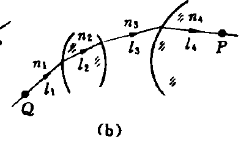
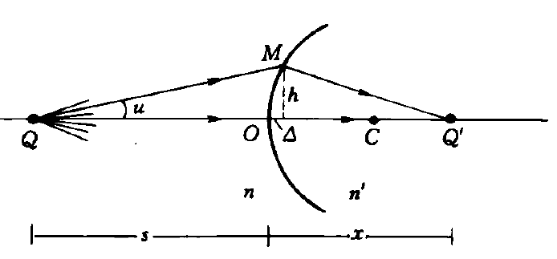
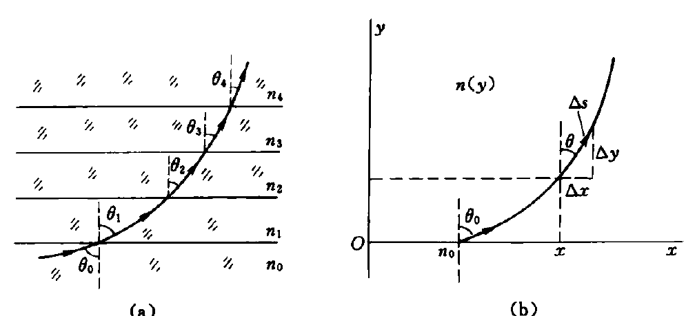

# 第0章 随便唠唠

## 关于平时分

已知：作业、笔记由研究生助教批改。

如果小班必须要给一个分数，分数的组成部分如下：

### 出勤

原则上出勤率不作为平时分组成部分。

不想来的话最好还是QQ上跟我请个假（随便找个理由）

### 作业

占大头

$80\%\sim 100\%$

## 关于换班

跟我说一声即可，不需要说明理由。

## 讲什么

#### 三不讲

简单的不讲（太简单了没必要讲）

不会的不讲（自己都不会咋讲）

不考的不讲（不考还讲啥）

## 答疑

我说的每一句话都可能是错的。（我水平不高）

讲义内容之外的我很可能答不上来（虽然讲义内容之内的可能也一样答不上来）

## 科学上网

……

## 找电子书

### zlib

https://zh.zlibrary-global.se/

小心盗版网站！凡要你先交钱后下载的都是盗版网站！

### libgen

https://libgen.is/

### annas

https://annas-archive.org/

### 算计物理群文件

## 电子笔记

### markdown 记笔记

#### 软件（vscode）

https://code.visualstudio.com/

#### markdown 基本语法

https://markdown.com.cn/

https://www.markdownguide.org/basic-syntax/

#### 数学公式

https://www.cmor-faculty.rice.edu/~heinken/latex/symbols.pdf

https://katex.org/docs/supported

#### vscode 效率工具——snippets

https://www.freecodecamp.org/news/definitive-guide-to-snippets-visual-studio-code/

README.md 里有自己配置的 snippets 供参考

### github——用于备份

https://github.com/

https://www.liaoxuefeng.com/wiki/896043488029600

## 问问题

### 知乎

### Stack Exchange

https://stackexchange.com/

英语要好

### google

维基百科

小时百科也还行

### b站？

## 怎么学光学基础1？

- 不理解不妨碍做题

> 听起来非常功利，但说实话会做题就不错了……

- 平时一点不学，只靠期末突击很可能要G

> 力学基础1这样搞可能没问题，但光学基础1真的别这样

- 不要死磕细节，作者说啥就是啥，学个大概，知道怎么运用结论做题就行

- 不要追求“严谨”“精确”，要向“近似”妥协

## 非常“物理”的数学

# 第1章 几何光学

## 惠更斯原理

### 惠更斯原理

光扰动同时到达的空间曲面被称为波面或波前，波前上的每一点可以被看作一个新的扰动中心，称其为子波源或次波源，次波源向四周激发次波；**下一时刻的波前**应当是这些大量次波面的公共切面，也称其为包络面；次波中心与其次波面上的那个切点的连线方向，给出了**该处光传播方向**，亦即光射线方向。

### 惠更斯原理导出折射定律

$$
\frac{\sin i_1}{\sin i_2}
=\frac{v_1}{v_2}
$$

其中，$i_1$ 与 $v_1$ 对应，$i_2$ 与 $v_2$ 对应

## 折射率

### 折射率的定义

介质的折射率，记为 $n$，定义为真空中的光速与光在介质中的传播速度之比，即：

$$
n
\equiv \frac{c}{v}
$$

其中，$v$ 是光在介质中的传播速度

显然，真空的折射率为 $1$；非真空介质的折射率 $n>1$

### 折射率表述的折射定律

$$
n_1\sin i_1
=n_2\sin i_2
$$

其中，$n_1$ 与 $i_1$ 对应，$n_2$ 与 $i_2$ 对应

## 色散

### 色散的定义

一种介质对不同波长的光具有不同的折射率，这被称作色散

## 介质中的波长

对于波，其波速 $v$ 时间频率 $f$ 和波长 $\lambda$ 有如下关系：

$$
v
=f\lambda
$$

在真空中：

$$
c
=f_0\lambda_0
$$

其中，$c$ 是真空中的光速，$f_0$ 是真空中的光频，$\lambda_0$ 是真空中的光波长

在介质中：

$$
v
=f\lambda
$$

其中，$v$ 是介质中的光速，$f$ 是介质中的光频，$\lambda$ 是介质中的光波长

两式相除，结合折射率的定义 $n\equiv \frac{c}{v} $ 可得：

$$
n
=\frac{f_0}{f}\cdot\frac{\lambda_0}{\lambda}
$$

特别地，在**线性介质的光场中**，光扰动的**时间频率仅由光源决定**，**与介质无关**，于是 $f_0=f$，这时得到：

$$
n
=\frac{\lambda_0}{\lambda}
$$

而之前提到，所有非真空介质的折射率 $n>1$，则上式说明**在介质中光波长变短了**（相较于真空中的光波长）。

## 光程

### 光程的定义

光程定义为**光线路径的几何长度与所经过的介质折射率的乘积**

设光沿路径 $l$ 从空间中的 $P$ 点传播到 $Q$ 点，光程，记为 $L_l(PQ)$，定义为：

$$
L_l(PQ)
\equiv \underset{(l)}{\int_{P}^{Q}}n(\vec{r})|\mathrm{d}\vec{r} |
$$

光程的离散化表达式：

$$
L_l(PQ)
\equiv \sum_{i} n_i l_i
$$

其中，$n_i$ 是第 $i $ 小段的折射率，$l_i$ 是第 $i$ 小段的长度

### 光程与相位差

>注意，这里定点振动的相位按照 $\varphi=\omega t+\varphi_0$ 的方式线性增加

设光沿路径 $l$ 从空间中的 $P$ 点传播到 $Q$ 点。考虑路径 $l$ 上的一点 $\vec{r} $，设 $t$ 时刻 $\vec{r} $ 处的波动在 $\mathrm{d}t$ 时间后传播到路径上的 $\vec{r}+\mathrm{d}\vec{r} $ 处。在无穷小传播过程中，光可看作沿直线传播，且这段线元内的介质的折射率是均匀的，即：

$$
\begin{aligned}
|\mathrm{d}\vec{r}|
&=v(\vec{r})\mathrm{d}t \\
&=\frac{c}{n(\vec{r})}\mathrm{d}t \tag{0}
\end{aligned}
$$

其中，$n(\vec{r}) $ 是 $\vec{r} $ 处介质的折射率。（注意，这里 $\mathrm{d}\vec{r} $ 一定是与 $\mathrm{d}t$ 有关的，从表述可以看出，是 $\mathrm{d}t$ 决定了 $\mathrm{d}\vec{r} $ ）

$t$ 时刻 $\vec{r} $ 处扰动的相位记为 $\varphi(\vec{r},t)$；类似地，$t+\mathrm{d}t$ 时刻 $\vec{r}+\mathrm{d}\vec{r} $ 处扰动的相位记为 $\varphi(\vec{r}+\mathrm{d}\vec{r},t+\mathrm{d}t)$

光的传播可以看作定点振动的传播，自然而然地，光的传播必定意味着相位信息的传播。**由于 $t$ 时刻 $\vec{r} $ 处的振动在 $\mathrm{d}t$ 时间后传播到路径上的 $\vec{r}+\mathrm{d}\vec{r} $ 处，于是 $t$ 时刻 $\vec{r} $ 处的相位信息在 $t+\mathrm{d}t$ 时刻传播到了 $\vec{r}+\mathrm{d}\vec{r} $ 处**，于是有：

$$
\varphi(\vec{r},t)
=\varphi(\vec{r}+\mathrm{d}\vec{r},t+\mathrm{d}t) \tag{1}
$$

在 $t\sim t+\mathrm{d}t$ 时间内，$\vec{r} $ 处的相位从 $\varphi(\vec{r},t) $ 线性地增加到 $\varphi(\vec{r},t)+\omega \mathrm{d}t $，即：

$$
\varphi(\vec{r},t+\mathrm{d}t)
=\varphi(\vec{r},t)+\omega\mathrm{d}t \tag{2}
$$ 

联立 $(1)(2) $，消去 $\varphi(\vec{r},t) $ 得：

$$
\varphi(\vec{r}+\mathrm{d}\vec{r},t+\mathrm{d}t)-\varphi(\vec{r},t+\mathrm{d}t)
=-\omega \mathrm{d}t
$$

再用前面推导得到的式子消去 $\mathrm{d}t$ 得：

$$
\varphi(\vec{r}+\mathrm{d}\vec{r},t+\mathrm{d}t)-\varphi(\vec{r},t+\mathrm{d}t)
=-\omega\frac{n(\vec{r})}{c}|\mathrm{d}\vec{r} |
$$

在同一时刻 $t+\mathrm{d}t$，对 $\vec{r} $ 从 $P$ 到 $Q$ 沿路径 $l$ 积分得：

$$
\begin{aligned}
\varphi(\vec{r}_Q,t+\mathrm{d}t)-\varphi(\vec{r}_P,t+\mathrm{d}t)
&=\underset{(l)}{\int_{P}^{Q}} -\omega \frac{n(\vec{r})}{c}|\mathrm{d}\vec{r} | \\
&=\underset{(l)}{\int_{P}^{Q}} -\frac{2\pi }{T} \frac{n(\vec{r})}{c}|\mathrm{d}\vec{r} | \\
&=\underset{(l)}{\int_{P}^{Q}} -\frac{2\pi }{T_0} \frac{n(\vec{r})}{c}|\mathrm{d}\vec{r} | \\
&=-\frac{2\pi }{T_0 c}\underset{(l)}{\int_{P}^{Q}}  n(\vec{r})|\mathrm{d}\vec{r} | \\
&\equiv -\frac{2\pi }{\lambda_0} L_l(PQ)
\end{aligned}
$$

可以看到，同一时刻 $P,Q$ 两点间的相位差与时间无关，所有上式可以简写为：

$$
\varphi(\vec{r}_Q,t)-\varphi(\vec{r}_P,t)
=-\frac{2\pi}{\lambda_0}L_l(PQ)
$$

这就是说，同一时刻空间中同一光线上两点 $P,Q$ 处光振动的相位差由光从 $P$ 出发沿光线 $l$ 到 $Q$ 的光程差决定

### 光程与时差

设某一振动在 $t_P$ 时刻传播到 $P$ 点，在 $t_Q$ 时刻传播到 $Q$ 点，则：

$$
\begin{aligned}
t_{Q}-t_{P}
&=\sum_{i} \frac{l_i}{v_i} \\
&=\sum_{i} n_il_i/c \\
&=\frac{1}{c}\sum_{i} n_i l_i \\
&=\frac{L_l(PQ)}{c}
\end{aligned}
$$

### 反射光束、折射光束的等光程性
                     
反射定律、折射定律给出的反射光束或折射光束的方向，与等光程性的要求一致。人们可以从等光程要求出发，导出反射定律和折射定律。

## 费马原理

### 费马原理的表述

光线/沿/光程为平稳值的路径/传播

光程为平稳值有四种情况：极小值、极大值和常数

在 $P,Q$ 确定的情况下，光程 $L$ 仅由路径 $l$ 这一**函数**决定。 光程 $L$ 是泛函，而**泛函为平稳值要求其变分为**零，于是根据费马原理，光线的真实传播路径应该满足：

$$
\delta L[l]
=0
$$

其中，$\delta $ 是变分算符

### 费马原理与成像

#### 物像等光程性

由物点 $P$ 发出一列球面波（或称之为同心光束），经系统变换为另一列球面波或另一个同心光束，则出射同心光束的中心称为**像点**。

成像过程是一个对同心光束实现共轭变换的过程。

从费马原理出发可以推得：从物点到像点的各光线的光程是彼此相等的。                                                          

#### 球面折射傍轴成像公式

$$
L(QOQ')
=ns+n'x
$$

> $h^2\approx 2r\Delta$ 是这么来的：
>
> 考虑三角形 由 $h,r-\Delta,r $ 构成的直角三角形，勾股定理给出：
>
>$$
h^2+(r-\Delta)^2
=r^2
\Longrightarrow
h^2-2r\Delta +\Delta^2
=0
>$$
>
>$\Delta$ 是小量，$\Delta^2$ 是二阶小量，约去二阶小量得：
>
>$$
h^2
\approx 2r\Delta
>$$

$$
\begin{aligned}
L(QMQ')
&=n\sqrt{(s+\varDelta )^2+h^2 }+n'\sqrt{(x-\varDelta)^2+h^2} \\
&=n\sqrt{s^2+h^2+2s\varDelta +\varDelta^2 }+n'\sqrt{x^2+h^2-2x\varDelta +\varDelta^2} \\
&\approx n\sqrt{s^2+h^2+2s\varDelta }+n'\sqrt{x^2+h^2-2x\varDelta } \\
(\mathrm{ps}:h^2\approx2r\Delta )&=n\sqrt{s^2+(2r+2s)\varDelta }+n'\sqrt{x^2+(2r-2x)\varDelta } \\
&=ns\sqrt{1+\frac{(2r+2s)\varDelta}{s^2} }+n'x\sqrt{1+\frac{(2r-2x)\varDelta}{x^2} } \\
&\approx ns(1+\frac{(r+s)\varDelta}{s^2})+n'x(1+\frac{(r-x)\varDelta}{x^2}) \\
&=ns+n'x+\bigg[ \frac{(r+s)}{s}n+\frac{r-x}{x}n' \bigg]\varDelta 
\end{aligned}
$$

光程差：

$$
\begin{aligned}
\Delta L
&\equiv L(QMQ')-L(QOQ') \\
&\approx \bigg[ \frac{(r+s)}{s}n+\frac{r-x}{x}n' \bigg]\varDelta 
\end{aligned}
$$

当 $\varDelta$ 前的系数为零，可近似认为满足物像等光程，此时可近似成像，并且得到球面折射傍轴成像公式：

$$
\frac{(r+s)}{s}n+\frac{r-x}{x}n'
=0
$$

或者改写为：

$$
\frac{n}{s}+\frac{n'}{x}
=\frac{n'-n}{r}
$$

这里，$s$ 是物距，$x$ 是像距，$r$ 是球面半径

若把像距记为 $s'$，则球面折射傍轴成像公式为：

$$
\frac{n}{s}+\frac{n'}{s'}
=\frac{n'-n}{r}
$$

## 光线方程

### 折射率分层均匀的情形

考虑折射率只与 $y$ 有关，而与 $x$ 无关的情况，$n=n(y)$

由折射定律，得：

$$
n_0\sin\theta_0
=n_1\sin\theta_1
=\cdots n\sin\theta
=\cdots
$$

几何关系：

$$
(\mathrm{d}s)^2
=(\mathrm{d}x)^2+(\mathrm{d}y)^2
\Longrightarrow (\frac{\mathrm{d}s}{\mathrm{d}x})^2
=1+(\frac{\mathrm{d}y}{\mathrm{d}x})^2
$$

$$
\frac{\mathrm{d}s}{\mathrm{d}x}
=\frac{1}{\sin\theta}
$$

$$
\left\{
\begin{aligned}
&n_0\sin\theta_0
=n\sin\theta \\
&(\frac{\mathrm{d}s}{\mathrm{d}x})^2
=1+(\frac{\mathrm{d}y}{\mathrm{d}x})^2 \\
&\frac{\mathrm{d}s}{\mathrm{d}x}
=\frac{1}{\sin\theta}
\end{aligned}
\right.
\Longrightarrow
\frac{\mathrm{d}y}{\mathrm{d}x}
=\sqrt{\frac{n^2(y)}{n_0^2\sin^2\theta_0}-1}
$$

# 第1章 习题选解

1.7 

1.8

期末考题

# 光在各向同性介质中的传播规律

## 麦克斯韦方程组

### 微分形式

$$
\left\{
\begin{aligned}
&\nabla\cdot\vec{B}
=0 \\
&\nabla\cdot\vec{D}
=\rho \\
&\nabla\times\vec{E}
=-\frac{\partial \vec{B}}{\partial t} \\
&\nabla\times\vec{H}
=\vec{j}+\frac{\partial \vec{D}}{\partial t}
\end{aligned}
\right.
$$

### 积分形式

$$
\left\{
\begin{aligned}
&\oiint\limits_{\partial V} \vec{B}\cdot\mathrm{d}\vec{S}
=0 \\
&\oiint\limits_{\partial V}\vec{D}\cdot\mathrm{d}\vec{S}
=Q \\
&\oint\limits_{\partial S} \vec{E}\cdot\mathrm{d}\vec{l}
=-\iint\limits_{S}\frac{\partial \vec{B}}{\partial t}\cdot\mathrm{d}\vec{S} \\
&\oint\limits_{\partial S} \vec{H}\cdot\mathrm{d}\vec{l}
=I+\oiint\limits_{S} \frac{\partial \vec{D}}{\partial t}\cdot\mathrm{d}\vec{S}
\end{aligned}
\right.
$$

## 光的电磁性质

（1）光扰动是一种电磁扰动。光扰动随时间变化和在空间的分布遵从麦克斯韦方程组：

$$
\left\{
\begin{aligned}
&\nabla\cdot\vec{B}
=0 \\
&\nabla\cdot\vec{D}
=\rho \\
&\nabla\times\vec{E}
=-\frac{\partial \vec{B}}{\partial t} \\
&\nabla\times\vec{H}
=\vec{j}+\frac{\partial \vec{D}}{\partial t}
\end{aligned}
\right.
$$

其中，$\vec{D}\equiv \varepsilon_0\vec{E}+\vec{P},\vec{H}\equiv \frac{\vec{B}}{\mu_0}-\vec{M} $；$\vec{P} $ 是电位移矢量，$\vec{M} $ 是磁化强度，$\rho$ 是自由电荷体密度，$\vec{j} $ 是传导电流

若光在各向同性线性非铁磁介质中传播，则有：

$$
\vec{P}
=\chi_{e}\varepsilon_0 \vec{E}，~~
\vec{M}
=\chi_{\mathrm{M}}\vec{H}
$$

（2）光波是一种电磁波

由矢量分析可得，光在各向同性线性非铁磁介质中传播时，$\vec{E},\vec{H} $ 满足波动方程：

$$
\nabla^2\vec{E}-\varepsilon\mu\frac{\partial^2\vec{E}}{\partial t^2}
=0
$$

$$
\nabla^2\vec{H}-\varepsilon\mu\frac{\partial^2\vec{H}}{\partial t^2}
=0
$$

其中，$\varepsilon$ 是介质的电容率（或介电常数），$\mu$ 是介质的磁导率

从中可知，光在介质中的传播速度 $v$ 为：

$$
v
=\frac{1}{\sqrt{\varepsilon\mu}}
=\frac{1}{\sqrt{\varepsilon_r\varepsilon_0\mu\mu_0}}
$$

其中，$\varepsilon=\varepsilon_r\varepsilon_0,\mu=\mu_r\mu_0$，$\varepsilon_r$ 是相对电容率（或相对介电常数），$\mu_r$ 是相对磁导率。

特别地，在真空中，$\varepsilon_r=1,\mu_r=1$，于是得到真空中的光速 $c$：

$$
c
=\frac{1}{\sqrt{\varepsilon_0\mu_0}}
$$

在后面我们会定义某种介质的折射率 $n$：

$$
n
\equiv \frac{c}{v}
$$

可得：

$$
n
\equiv \frac{c}{v}
=\sqrt{\varepsilon_r\mu_r}
$$

（3）平面电磁波是自由空间电磁波的一基元成分

可以验证，平面电磁波函数：

$$
\vec{E}(\vec{r},t)
=\vec{E}_0\cos(\omega t-\vec{k}\cdot\vec{r}+\varphi_E)
$$

$$
\vec{H}(\vec{r},t)
=\vec{H}_0\cos(\omega t-\vec{k}\cdot\vec{r}+\varphi_H)
$$

满足波动方程。其中，$\vec{k} $ 称为波矢，其方向与波的传播方向一致，也与平面等相面正交，其大小 $k$ 与波长（或称为空间周期）的关系为：

$$
k
=\frac{2\pi}{\lambda}
$$

（4）光是横波

$$
\vec{E}
\perp \vec{k},~~
\vec{H}
\perp \vec{k}
$$

（5）电场与磁场之间具有正交性和同步性

振荡着的电场与磁场，彼此在方向上是时时正交的，$\vec{E},\vec{H},\vec{k} $ 三者方向构成一个右手螺旋，即：

$$
(\vec{E}\times\vec{H})
\parallel \vec{k}
$$

（6）电磁波能流密度——坡印廷矢量

电磁波能流密度矢量：

$$
\vec{S}(\vec{r},t)
=\vec{E}(\vec{r},t)\times\vec{H}(\vec{r},t)
$$

称为坡印廷矢量

### 光强

对于光波，平均能流密度为：

$$
\begin{aligned}
\bar{S}
&=\frac{1}{T}\int_{0}^{T}|\vec{E}\times\vec{H} |\mathrm{d}t \\
&=\frac{1}{2}\sqrt{\frac{\varepsilon_r\varepsilon_0}{\mu_r\mu_0}}E_0^2 
\end{aligned}
$$

在光频段，$\mu_r\approx 1$，于是 $n\equiv \sqrt{\varepsilon_r\mu_r}\approx\sqrt{\varepsilon_r}$，于是：

$$
\begin{aligned}
\bar{S}
&=\frac{1}{2}\sqrt{\frac{\varepsilon_r\varepsilon_0}{\mu_r\mu_0}}E_0^2 \\
&\approx \frac{1}{2}\sqrt{\frac{\varepsilon_0}{\mu_0}}nE_0^2 \\
&\propto nE_0^2
\end{aligned}
$$

光强，记为 $I$，定义为：

$$
I
\equiv nE_0^2
$$

可见，光强度量的是平均电磁能流密度，但和平均电磁能流密度差一个系数

#### 定态波场

（1）空间各点的扰动是同频率的振动

（2）波场中各点扰动的振幅不随时间变化

#### 定态光波的标量表示

$\vec{E} $ 在直角坐标系下的三个分量遵从同一形式的波动方程，这就允许我们用标量 $U$ 来代表 $E_x,E_y,E_z$ 中的任意一个量，它们都遵从如下的波动方程：

$$
\nabla^2U-\frac{1}{v^2}\frac{\partial^2 U}{\partial t^2}
=0
$$

$U$ 可以理解为 $E_x,E_y,E_z$ 中的任意一个

对于某一确定场点 $\vec{r} $ 上的定态光扰动 $E_i(\vec{r},t),(i=x,y,z)$ ，其是关于时间的周期函数，在满足狄利克雷条件的情况下，此光扰动可以展开为余弦傅里叶级数，于是我们可以选取余弦函数作为定态光波的基元，定态光波可由无数不同频率的余弦波线性组合而成。这种选定的基元成分的一般形式为：

$$
U(P,t)
=A(P)\cos(\omega t+\varphi(P))
$$

其中，$A(P) $ 是振幅，$\varphi(P) $ 是初相位

### 波函数的复数表示

简谐波函数的实数形式：

$$
U(P,t)
=A(P)\cos(\omega t+\varphi(P))
$$

其中，$\varphi(P) $ 是场点 $P$ 处光扰动的初相位

复数形式：

$$
\tilde{U}(P,t)
=A(P)e^{-\mathrm{i}(\omega t+\varphi(P))}
$$

由欧拉公式 $e^{\mathrm{i}\theta}=\cos\theta+\mathrm{i}\sin\theta $，可得二者的关系为：

$$
\Re\{\tilde{U}(P,t) \}
=U(P,t)
$$

其中，$\Re\{\cdot \}$ 表示“取实部”操作

>比如：
>
>$$
\Re\{1+2\mathrm{i} \}
=1
>$$

#### 平面简谐波

$$
U(\vec{r},t)
=A\cos(\omega t-\vec{k}\cdot \vec{r} +\varphi_0)
$$

其中，$A $ 是平面波的振幅；$\vec{r} $ 是坐标原点指向场点的位矢；$\vec{k} $ 是平面波的波矢，其方向与平面波的传播方向同向平行，大小为 $k=\frac{2\pi}{\lambda} $；$\varphi_0 $ 是坐标原点的初相位，也就是坐标原点在 $t=0$ 时刻的相位；

$$
\tilde{U}(\vec{r},t)
=Ae^{\mathrm{i}(\vec{k}\cdot\vec{r}-\omega t-\varphi_0)}
$$

#### 发散球面简谐波

$$
U(\vec{r},t)
=\frac{a_1}{r}\cos(\omega t-kr+\varphi_0)
$$

其中，$r$ 是点源到场点 $\vec{r} $ 的距离；$\varphi_0 $ 是点源的初相位

$$
\tilde{U}(\vec{r},t)
=\frac{a_1}{r}e^{\mathrm{i}(kr-\omega t-\varphi_0)}
$$

#### 柱面简谐波

$$
U(r,t)
=\frac{b_1}{\sqrt{r}}\cos(\omega t-kr+\varphi_0)
$$

$$
\tilde{U}(r,t)
=\frac{b_1}{\sqrt{r}}e^{\mathrm{i}(kr-\omega t-\varphi_0)}
$$

### 复振幅

设 $U(P,t)=A(P)\cos(\omega t+\varphi(P)) $，其中，$\varphi(P) $ 是 $P$ 点的初相位，则 $P$ 点的复振幅，记为 $\tilde{U}(P) $，定义为：

$$
\tilde{U}(P)
\equiv A(P)e^{-\mathrm{i}\varphi(P)}
$$

复振幅与时间无关，其关注的是光扰动在空间中的分布规律。

#### 平面简谐波复振幅

$$
U(\vec{r},t)
=A\cos(\omega t-\vec{k}\cdot \vec{r} +\varphi_0)
$$

$$
\varphi(\vec{r})
=-\vec{k}\cdot\vec{r}+\varphi_0
$$

$$
\begin{aligned}
\tilde{U}(\vec{r})
&\equiv A(\vec{r})e^{-\mathrm{i}\varphi(\vec{r})} \\
&=A e^{-\mathrm{i}(-\vec{k}\cdot\vec{r}+\varphi_0)} \\
&=Ae^{\mathrm{i}(\vec{k}\cdot\vec{r}-\varphi_0)}
\end{aligned}
$$

#### 球面发散简谐波复振幅

$$
U(\vec{r},t)
=\frac{a_1}{r}\cos(\omega t-kr+\varphi_0)
$$

$$
\varphi(\vec{r})
=-kr+\varphi_0
$$

$$
\begin{aligned}
\tilde{U}(\vec{r})
&\equiv A(\vec{r})e^{-\mathrm{i}\varphi(\vec{r})} \\
&=\frac{a_1}{r}e^{-\mathrm{i}(-kr+\varphi_0)} \\
&=\frac{a_1}{r}e^{\mathrm{i}(kr-\varphi_0)}
\end{aligned}
$$

#### 柱面简谐波复振幅

$$
U(r,t)
=\frac{b_1}{\sqrt{r}}\cos(\omega t-kr+\varphi_0)
$$

$$
\varphi(\vec{r})
=-kr+\varphi_0
$$

$$
\begin{aligned}
\tilde{U}(\vec{r})
&\equiv A(\vec{r}) e^{-\mathrm{i}\varphi(\vec{r})} \\
&=\frac{b_1}{\sqrt{r}}e^{-\mathrm{i}(-kr+\varphi_0)} \\
&=\frac{b_1}{\sqrt{r}}e^{\mathrm{i}(kr-\varphi_0)}
\end{aligned}
$$

### 波前函数

观察平面上某点的复振幅称为波前函数。

一般用 $z=\mathrm{const}$ 来表示这个观察平面。由于 $z$ 坐标是个常数，于是波前函数只是观察平面上的两个直角坐标分量 $x,y$ 的函数，用 $\tilde{U}(x,y) $ 来表示（波前函数）。

### 球面波向平面波的转化

#### 傍轴条件（振幅条件）—— $z^2\gg \rho^2 $

源面 $x_0-y_0$ 平面上有一点源 $(x_0, y_0)$ 发射球面波，场面 $x-y$ 平面距源面的距离为 $z$，则场面上 $(x,y)$ 场点的波前函数精确表达是：

$$
\begin{aligned}
\tilde{U}(x,y)
&\equiv \frac{a_1}{r}e^{\mathrm{i}(kr-\varphi_0)} \\
&=\frac{a_1}{\sqrt{(x-x_0)^2+(y-y_0)^2+z^2}}e^{\mathrm{i}(k\sqrt{(x-x_0)^2+(y-y_0)^2+z^2}-\varphi_0)}
\end{aligned}
$$

傍轴条件下，波前函数的近似表达是：

$$
\begin{aligned}
\tilde{U}(x,y)
&\approx \frac{a_1}{z}e^{\mathrm{i}(kz+k\frac{(x-x_0)^2+(y-y_0)^2}{2z}-\varphi_0)} \\
&=\frac{a_1}{z}e^{\mathrm{i}kz}\cdot e^{\mathrm{i}k\frac{(x-x_0)^2+(y-y_0)^2}{2z}}\cdot e^{-\mathrm{i}\varphi_0}
\end{aligned}
$$

#### 远场条件（相位条件）—— $z\lambda\gg \rho^2 $

源面 $x_0-y_0$ 平面上有一点源 $(x_0, y_0)$ 发射球面波，场面 $x-y$ 平面距源面的距离为 $z$，则场面上 $(x,y)$ 场点的波前函数精确表达是：

$$
\begin{aligned}
\tilde{U}(x,y)
&\equiv \frac{a_1}{r}e^{\mathrm{i}(kr-\varphi_0)} \\
&=\frac{a_1}{\sqrt{(x-x_0)^2+(y-y_0)^2+z^2}}e^{\mathrm{i}(k\sqrt{(x-x_0)^2+(y-y_0)^2+z^2}-\varphi_0)}
\end{aligned}
$$

仅远场条件下，波前函数的近似表达是：

$$
\begin{aligned}
\tilde{U}(x,y)
\approx \frac{a_1}{z+\frac{x^2+y^2}{2z}}e^{\mathrm{i}kz}\cdot e^{-\mathrm{i}\varphi_0}
\end{aligned}
$$

对于光波，远场条件更加苛刻。若满足了远场条件，则傍轴条件也必定满足。

于是对于光波，波前函数可进一步近似为：

$$
\tilde{U}(x,y)
\approx \frac{a_1}{z}e^{\mathrm{i}kz}\cdot e^{-\mathrm{i}\varphi_0}
$$

由此可见，对于光波，在远场条件下，球面波可近似为平面波。

### 波叠加原理

在通常介质与通常光强条件下，波叠加原理成立，即总扰动等于各分扰动的叠加。

### 波叠加的两种情况

在波叠加原理成立的情况下，考察交叠区中的光强分布，存在两种情况：

#### 非相干叠加

在观测时间中，总光强是各分光强的直接相加：

$$
I(P)
=I_1(P)+I_2(P)
$$

#### 相干叠加

在观测时间中，总光强**不等于**各分光强的直接相加：

$$
I(P)
=I_1(P)+I_2(P)+\Delta I(P)
$$

### 光波叠加的相干条件

（1）光振动方向一致或有方向一致的平行振动分量。

（2）两列波的频率相同。

**证明**：

设交叠区中场点 $P$ 处的两个扰动的实值表示分别为：

$$
U_1(P,t)
=A_1\cos(\omega_1 t+\varphi_1(P))
$$

$$
U_2(P,t)
=A_2\cos(\omega_2 t+\varphi_1(P))
$$

总扰动 $U(P,t)$ 遵从波叠加原理：

$$
U(P,t)
=U_1(P,t)+U_2(P,t)
$$

在光的矢量理论中，光强正比于平均电磁能流密度。这里我们讨论的是光的标量理论，用标量 $U$ 代表电场 $\vec{E} $ 在直角坐标系下的任一分量。

类比矢量理论，可定义标量理论中的“光强” ：

$$
I'(P)
\equiv \braket{U^2(P,t)}
\equiv \frac{1}{T} \int_{0}^{T} U^2(P,t)\mathrm{d}t
$$

其中，$T$ 是观察时间，$\braket{\cdot} $ 表示对尖括号内的物理量取观察时间的平均值。

基于此，总扰动的“光强”为：

$$
\begin{aligned}
I(P)
&\equiv \braket{U^2(P,t)} \\
&=\bigg\langle \bigg( U_1(P,t)+U_2(P,t) \bigg)^2\bigg\rangle \\
&=\braket{U_1^2(P,t)+U_2^2(P,t)+2U_1(P,t)U_2(P,t)} \\
&=\braket{U_1^2(P)}+\braket{U_2^2(P,t)}+2\braket{U_1(P,t)U_2(P,t)} \\
&=I_1(P)+I_2(P)+2\braket{U_1(P,t)U_2(P,t)} \\
\end{aligned}
$$

观察交叉项：

$$
\begin{aligned}
\Delta I(P)
&\equiv 2\braket{U_1(P,t)U_2(P,t)} \\
&=2\braket{A_1A_2\cos(\omega_1 t+\varphi_1)\cos(\omega_2 t+\varphi_2)} \\
&=A_1A_2\braket{\cos[(\omega_1+\omega_2)t+\varphi_1+\varphi_2]}+A_1A_2\braket{\cos[(\omega_1-\omega_2)t+(\varphi_1-\varphi_2)]}
\end{aligned}
$$

注意到，光的频率很大，时间周期很短，因此在相对很长的观察时间 $T$ 内，有：

$$
\braket{\cos[(\omega_1+\omega_2)t+\varphi_1+\varphi_2]}
\approx 0
$$

于是进一步有：

$$
\begin{aligned}
\Delta I'(P)
&=A_1A_2\braket{\cos[(\omega_1+\omega_2)t+\varphi_1+\varphi_2]}+A_1A_2\braket{\cos[(\omega_1-\omega_2)t+(\varphi_1-\varphi_2)]} \\
&\approx A_1A_2\braket{\cos[(\omega_1-\omega_2)t+(\varphi_1-\varphi_2)]}
\end{aligned}
$$

当 $\omega_1\ne \omega_2$，且 $\omega_1$ 和 $\omega_2$ 相差不太小时，同样有：

$$
\braket{\cos[(\omega_1-\omega_2)t+(\varphi_1-\varphi_2)]}
\approx 0
$$

此时，

$$
\Delta I(P)
\approx 0
$$

也就是说，当 $\omega_1\ne \omega_2$，且 $\omega_1$ 和 $\omega_2$ 相差不太小时， 交叉项为零，不发生干涉。

当 $\omega_1=\omega_2$ 时，

$$
\begin{aligned}
\Delta I(P)
&\approx A_1A_2\braket{\cos[(\omega_1-\omega_2)t+(\varphi_1-\varphi_2)]} \\
&\ne 0,~~(\mathrm{ps}:\varphi_1-\varphi_2~的值合适的情况下)
\end{aligned}
$$

此时，干涉项不为零。也就是说，当满足同频条件 $\omega_1=\omega_2$ 时，才能发生干涉。

（3）场点有稳定的相位差。

#### 双光束干涉强度公式

注意到：

$$
\begin{aligned}
I_1(P)
&\equiv \braket{U_1(P,t)} \\
&\approx \frac{1}{2}A_1^2
\end{aligned}
$$

$$
I_2(P)
\approx \frac{1}{2}A_2^2
$$

上面推导给出，当 $\omega_1=\omega_2$ 时，有：

$$
\begin{aligned}
\Delta I(P)
&\approx A_1A_2\braket{\cos[(\omega_1-\omega_2)t+(\varphi_1-\varphi_2)]} \\
&=A_1A_2\braket{\cos(\varphi_1-\varphi_2)} \\
&=A_1A_2\cos(\varphi_1-\varphi_2)
\end{aligned}
$$

令：

$$
\delta(P)
=\varphi_1-\varphi_2
$$

则得到双光束干涉强度公式：

$$
\begin{aligned}
I(P)
&=I_1+I_2+A_1A_2\cos\delta(P) \\
&=I_1+I_2+ 2\sqrt{I_1I_2}\cos\delta(P)
\end{aligned}
$$

或者：

$$
I(P)
=\frac{1}{2}A_1^2+\frac{1}{2}A_2^2+\sqrt{A_1A_2}\cos\delta(P)
$$

由于上式中很多 $\frac{1}{2} $，不好看，而光强又只是一“相对度量手段”，不妨将光强写为：

$$
I(P)
=A_1^2+A_2^2+2A_1A_2\cos\delta(P)
$$

再注意到复振幅：

$$
\tilde{U}_1(P)
=A_1e^{-\mathrm{i}\varphi_1(P)}
$$

$$
\tilde{U}_2(P)
=A_2e^{-\mathrm{i}\varphi_2(P)}
$$

注意到：

$$
\begin{aligned}
[\tilde{U}_1(P)+\tilde{U}_2(P)][\tilde{U}_1(P)+\tilde{U}_2(P)]^*
&=[A_1e^{-\mathrm{i}\varphi_1(P)}+A_2e^{-\mathrm{i}\varphi_2(P)}][A_1e^{\mathrm{i}\varphi_1(P)}+A_2e^{\mathrm{i}\varphi_2(P)}] \\
&=A_1^2+A_2^2+A_1A_2e^{\mathrm{i}(\varphi_2(P)-\varphi_1(P))}+A_1A_2e^{\mathrm{i}(\varphi_1(P)-\varphi_2(P))} \\
&=A_1^2+A_2^2+A_1A_2\cos\bigg[ \varphi_2(P)-\varphi_1(P) \bigg]+\mathrm{i}\sin\bigg[ \varphi_2(P)-\varphi_1(P) \bigg] +A_1A_2\cos\bigg[ \varphi_1(P)-\varphi_2(P) \bigg]+\mathrm{i}\sin\bigg[ \varphi_1(P)-\varphi_2(P) \bigg] \\
&=A_1^2+A_2^2+2A_1A_2\cos\delta(P)
\end{aligned}
$$

#### 干涉场的衬比度

$$
\gamma
\equiv \frac{I_{\max}-I_{\min}}{I_{\max}+I_{\min}}
$$

$$
0
\leqslant \gamma
\leqslant 1
$$

衬比度越大，干涉条纹清晰度越好。

当衬比度 $\gamma=0$ ，即 $I_{\max}=I_{\min}$，此时干涉场中光强处处相等，不出现干涉条纹。

对于双光束干涉，

$$
I
=I_1+I_2+2\sqrt{I_1I_2}\cos\delta(P)
$$

得到：

$$
I_{\max}
=I_1+I_2+2\sqrt{I_1I_2}
$$

$$
I_{\min}
=I_1+I_2-2\sqrt{I_1I_2}
$$

于是：

$$
\begin{aligned}
\gamma
&\equiv \frac{I_{\max}-I_{\min}}{I_{\max}+I_{\min}} \\
&=\frac{4\sqrt{I_1I_2}}{2(I_1+I_2)} \\
&=\frac{2\sqrt{I_1I_2}}{I_1+I_2}
\end{aligned}
$$

考虑到 $I_1/I_2 =(A_1/A_2)^2$

于是双光束干涉的衬比度也可以用振幅比表达：

$$
\gamma
=\frac{2\frac{A_1}{A_2}}{1+(\frac{A_1}{A_2})^2}
$$

#### 利用衬比度表达双光束干涉强度公式

$$
\begin{aligned}
I
&=I_1+I_2+2\sqrt{I_1I_2}\cos\delta(P) \\
&=(I_1+I_2)(1+\frac{2\sqrt{I_1I_2}}{I_1+I_2}\cos\delta(P)) \\
&=(I_1+I_2)(1+\gamma\cos\delta(P)) \\
&=I_0(1+\gamma\cos\delta(P)),~~I_0=I_1+I_2
\end{aligned}
$$

#### 两束自然光交叠场中衬比度 $\gamma$ 与光束夹角 $\alpha$ 的关系

$$
\gamma
=\frac{1}{2}(1+\cos\alpha)
$$

#### 相干叠加的五个条件

（1）光振动方向一致或有方向一致的平行振动分量。

（2）两列波的频率相同。

（3）场点有稳定的相位差。

（4）参与相干叠加的两束光的振幅尽可能接近。

（5）参与相干叠加的两束光的传播方向的夹角不要太大。

#### 双光束干涉强度公式汇总

$$
\boxed{
I(P)
=I_1+I_2+2\sqrt{I_1I_2}\cos\delta(P)
}
$$

$$
\boxed{
I(P)
=A_1^2+A_2^2+2A_1A_2\cos\delta(P)
}
$$

$$
\boxed{
I(P)
=(\tilde{U}_1+\tilde{U}_2)(\tilde{U}_1+\tilde{U}_2)^*
}
$$

$$
\boxed{
I(P)
=I_0(1+\gamma\cos\delta(P))
},~~I_0=I_1+I_2
$$

# 光的干涉

### 杨氏双孔干涉

#### 杨氏双孔干涉强度分布公式

$$
I(x,y)
=I_0[1+\cos (k\frac{d}{D}x)]
$$

其中，$k$ 是波矢大小，$d$ 是双孔间距，$D$ 是双孔到屏幕的距离

#### 杨氏双孔干涉干涉条纹间距公式

$$
\Delta x
=\frac{\lambda D}{d}
$$

其中，$\Delta x $ 是条纹间距，$\lambda $ 是光波长，$D$ 是双孔到屏幕距离，$d$ 是双孔间距

#### 杨氏双孔干涉点源位移导致条纹移动

$$
\delta x
=\frac{D}{R}x_0
$$

其中，$\delta x$ 是零级条纹的位移，$D$ 是双孔到接收面的距离，$R$ 是源面到双孔的距离，$x_0$ 是点源相对中心轴的位移

#### 两个分离点源照明时的部分相干场

$$
I(x,y)
=2I_0[1+\cos\frac{\varphi_0}{2}\cdot \cos(2\pi fx+\frac{\varphi_0}{2})]
$$

$$
\varphi_0
=2\pi f_0 x_0,~~f_0=\frac{d}{R\lambda}
$$

衬比度：

$$
\gamma
=|\cos\frac{\varphi_0}{2} |,~~\varphi_0=2\pi f_0x_0
$$

#### 线光源照明时的部分相干场

$$
I(x,y)
=I_0\bigg( 1+\frac{\sin\pi f_0 b}{\pi f_0 b}\cdot\cos (2\pi fx) \bigg) 
$$

衬比度：

$$
\gamma
=\bigg|\frac{\sin \pi f_0 b}{\pi f_0 b} \bigg|,~~f_0=\frac{d}{R\lambda }
$$

其中，$b$ 是线光源的宽度，$R $ 是源面到双孔面的距离，$d $ 是双孔间距，$\lambda $ 是单色线光源的波长

#### 光源极限宽度或双孔极限间隔

**光源极限宽度**，记为 $b_0$，定义为使得衬比度 $\gamma$ 第一次降为 $0 $ 时 $b$ 的取值。

注意到，杨氏双孔模型中，若采用线光源照明，有：

$$
\begin{aligned}
\gamma
&=\bigg|\frac{\sin \pi f_0 b}{\pi f_0 b} \bigg|,~~f_0=\frac{d}{R\lambda } \\
&=\bigg|\frac{\sin (\frac{\pi}{R\lambda} \cdot bd) }{\frac{\pi}{R\lambda}\cdot bd} \bigg|
\end{aligned}
$$

让线光源宽度 $b$ 改变，而保持其他量不变，则由光源极限宽度的定义，有：

$$
\frac{\pi}{R\lambda} \cdot b_0 d
=\pi
\Longrightarrow
b_0
=\frac{R\lambda}{d}
$$

$$
\boxed{
b_0
=\frac{R\lambda}{d}
}
$$

**双孔极限间隔**，记为 $d_0$，定义为使得衬比度 $\gamma$ 第一次降为 $0 $ 时 $d$ 的取值。

让双孔间隔 $d$ 改变，而保持其他量不变，则由双孔极限间隔的定义，有：

$$
\frac{\pi}{R\lambda} \cdot bd_0
=\pi
\Longrightarrow
d_0
=\frac{R\lambda}{b}
$$

$$
\boxed{
d_0
=\frac{R\lambda}{b}
}
$$

#### 三种光源的光源极限宽度

$$
b_0
=K\frac{R\lambda}{d}
$$

线光源，$K=1.0$

环状光源，$K=0.78$

圆盘光源，$K=1.2$

任何形状的面光源均可被压缩为沿 $x $ 轴的一个等效线光源，相应地，等效线光源有一个非均匀的亮度分布 $B(x_0)$

### 光场的空间相干性

光场的空间相干性是指，在非相干扩展光源照明空间中，横向两点光扰动之间一般是部分相干的，或者说，这两个光扰动相位随机量之间是部分相关的，部分相干程度由观测平面上干涉场的衬比度 $\gamma $ 来反映。

#### 空间相干性反比公式——相干孔径角和相干面积

上面给出了当光源宽度 $b $ 给定时，双孔的极限间隔：

$$
d_0
=\frac{R\lambda}{b}
$$

其中，$R$ 是源面到双孔面的间距，$\lambda$ 是光波长

上式可改写为：

$$
b\cdot\frac{d_0}{R}
=\lambda
$$

注意到，当 $R\gg d_0$ 时，有：

$$
\frac{d_0}{R}
\approx \Delta \theta_0
$$

其中，$\Delta \theta_0$ 是双孔对**线光源**中心张开的孔径角，称为**相干孔径角**，于是进一步有：

$$
b\cdot\Delta \theta_0
\approx \lambda
$$

上式就是空间相干性反比公式。

$\Delta \theta_0 $ 的物理意义是，若两点源 $S_1,S_2$ 对线光源中心的实际张角 $\Delta\theta\approx \Delta\theta_0$，则这两个点源几乎非相干；若 $\Delta\theta<\Delta\theta_0$，则 $\gamma>0$，两点源部分相干；比值 $\Delta\theta/\Delta\theta_0$ 越小，两点源的相干程度越高。

前面给出了杨氏双孔干涉在线光源照明时的衬比度公式：

$$
\gamma
=\bigg|\frac{\sin (\frac{\pi}{R\lambda} \cdot bd) }{\frac{\pi}{R\lambda}\cdot bd} \bigg|
$$

也给出了空间相干性反比公式：

$$
b\cdot\Delta\theta_0
\approx \lambda
\Longrightarrow \frac{b}{\lambda} \approx \frac{1}{\Delta\theta_0}
$$

而双孔对线光源中心的实际张角 $\Delta \theta $ 可近似为：

$$
\Delta \theta
\approx \frac{d}{R}
$$

于是杨氏双孔干涉在线光源照明时的衬比度可改写为关于 $\Delta \theta/\Delta\theta_0$ 的函数：

$$
\gamma(\frac{\Delta\theta}{\Delta \theta_0})
=\bigg|\frac{\sin \pi \frac{\Delta \theta}{\Delta \theta_0}}{\pi \frac{\Delta \theta}{\Delta \theta_0}} \bigg|
$$

---

若面光源在相互垂直的两个方向上均有宽度 $b$，则空间相干范围应该是一个由 $\Delta\theta_0$ 旋转而成的立体角 $\Delta \Omega_0$，与光源距离 $R$ 处的相应面积 $\Delta S_0$ 称为相干面积。在相干面积之内的两个点源之间是部分相干的。

在球面上 $\theta\sim \theta+\mathrm{d}\theta,\varphi\sim \varphi+\mathrm{d}\varphi$ 范围内的立体角微元为

$$
\mathrm{d}\Omega 
=\frac{R\mathrm{d}\theta\cdot R\sin\theta\mathrm{d}\varphi}{R^2}
=\sin\theta\mathrm{d}\theta\mathrm{d}\varphi
$$

建立球坐标，使得 $z$ 轴穿过相干面积的中心，积分得：

$$
\begin{aligned}
\Delta \Omega_0
&=\int_{\varphi=0}^{\varphi=2\pi}\int_{\theta=0}^{\theta=\Delta\theta_0/2}\sin\theta\mathrm{d}\theta\mathrm{d}\varphi \\
&=2\pi (1-\cos\frac{\Delta\theta_0}{2}) \\
&=4\pi \sin^2\frac{\Delta\theta_0}{4} \\
&\approx 4\pi (\frac{\Delta\theta_0}{4})^2 \\
&=\frac{\pi}{4} (\Delta\theta_0)^2
\end{aligned}
$$

于是相干面积为：

$$
\begin{aligned}
\Delta S_0
&\approx R^2\Delta\Omega_0 \\
&\approx \frac{\pi}{4}(R\Delta \theta_0)^2
\end{aligned}
$$

利用空间相干性反比公式 $b\cdot \Delta\theta_0\approx \lambda $ 以及极限间隔 $d_0=\frac{R\lambda}{b}$ 得到：

$$
\begin{aligned}
\Delta S_0
&\approx \frac{\pi}{4}(R\Delta \theta_0)^2\\
&\approx \frac{\pi}{4}(\frac{R\lambda}{b})^2 \\
&\approx \frac{\pi}{4}d_0^2
\end{aligned}
$$

其中，$d_0$ 是光源宽度 $b$ 对应的 $S_1,S_2$ 极限间隔。

## 光场的时间相干性

### 非单色性对干涉衬比度的影响

### 光谱双线结构导致衬比度周期性变化

$$
\gamma
=\bigg|\cos(\frac{\Delta k}{2}\cdot\Delta L) \bigg|
$$

干涉场中衬比度随光程差作周期性变化，半周期为：

$$
\Delta L_0
=\frac{\pi}{\Delta k}
\approx \frac{\bar{\lambda}^2}{2\Delta \lambda}
$$

### 准单色线宽导致衬比度$\gamma(\Delta L) $ 下降

采用方垒形谱函数，可以得到：

$$
\gamma(\Delta L)
=\bigg|\frac{\sin (\frac{\Delta k}{2}\Delta L)}{\frac{\Delta k}{2}\Delta L} \bigg| 
$$

#### 最大光程差 $\Delta L_M $

最大光程差，记为 $\Delta L_M$，定义为使得 $\gamma $ 第一次等于 $0$ 的光程差 $\Delta L$ 的取值

$$
\frac{\Delta k}{2}\Delta L_M
=\pi
\Longrightarrow
L_M
=\frac{2\pi}{\Delta k}
$$

借助公式 $\frac{\Delta \lambda}{\lambda}\approx \frac{\Delta k}{k} $，也可将上式写为：

$$
\Delta L_M
=\frac{\lambda^2}{\Delta \lambda}
$$

上面两式可写成反比形式：

$$
\Delta L_M\cdot\Delta k
=2\pi,~~
\Delta L_M\cdot\frac{\Delta \lambda}{\lambda}
=\lambda
$$

利用最大光程差 $\Delta L_M$，可将衬比度函数改写为：

$$
\gamma(\Delta L)
=\bigg|\frac{\sin(\pi\frac{\Delta L}{\Delta L_M})}{\pi \frac{\Delta L}{\Delta L_M}} \bigg| 
$$

#### 时间相干性的突出表现——长程差干涉

可以证明，由谱线宽度 $\Delta \lambda$ 决定的最大光程差 $\Delta L_M$ 与由波列长度 $L_0$ 决定的最大光程差 $\Delta L_M'$ 是一致的。

#### 时间相干性反比公式

$$
L_0\cdot\frac{\Delta \lambda}{\lambda}
\approx \lambda
$$

利用 $\Delta \nu/\nu\approx \Delta \lambda/\lambda $，可将上式改写为：

$$
\tau_0\cdot\Delta \nu
\approx 1
$$

其中，$\tau_0$ 是相干时间。

## 两种典型薄膜干涉

### 等倾干涉

**膜层厚度均匀**、点光源照明条件下**无穷远处的干涉场**（借助透镜来实现）

#### 表观光程差公式

$$
\Delta L_0(P)
=2nh\cos i
$$

其中，$n$ 是薄膜折射率，$h$ 是薄膜厚度，$i$ 是入射角

表观光程差唯一地确定于倾角 $i$，于是等倾角的场点轨迹就是条纹形状。等倾干涉的干涉条纹是一系列**圆环**。

#### 等倾干涉条纹的性质

（1）扩展光源有利于观察等倾干涉条纹

（2）等倾干涉条纹为一系列圆环

（3）中心处的级次最高（中心，$i=0$，表观光程差最大，级次最高），外围的级次逐渐降低。

（4）中心条纹稀疏，外围条纹密集

（5）膜厚度改变半个波长时，从中心冒出或缩进一个条纹。

考虑中心条纹，$i=0,\cos i=1$，假设原来薄膜厚度为 $h$ 时中心处是亮条纹/暗条纹，有：

$$
\begin{aligned}
\frac{2\pi}{\lambda_0}\cdot 2nh
=\Delta \varphi_0
\end{aligned}
$$

当薄膜厚度从 $h$ 增加到 $h+\Delta h$ 时（$\Delta h>0$）恰好冒出一个亮条纹/暗条纹，有：

$$
\frac{2\pi }{\lambda_0}\cdot 2n(h+\Delta h)
=\Delta\varphi_0+2\pi
$$

作差得：

$$
\frac{2\pi}{\lambda_0}\cdot 2n\Delta h
=2\pi
$$

得到：

$$
\Delta h
=\frac{\lambda_0}{2n}
=\frac{\lambda}{2}
$$

其中，$\lambda$ 是介质中的波长

根据冒出的条纹数，可以测定长度的微小变化。

### 等厚干涉

定域在薄膜表面上的干涉条纹

厚度相同的地方，是同一级亮条纹，故称等厚干涉。

# 光的衍射

#### 菲涅耳衍射积分式

$$
\tilde{U}(P)
=K\oiint\limits_{\Sigma}f(\theta_0,\theta)\tilde{U}_0(Q)\frac{e^{\mathrm{i}kr}}{r}\mathrm{d}S
$$

#### 基尔霍夫衍射积分式

$$
\tilde{U}(P)
=\frac{-\mathrm{i}}{\lambda}\oiint\limits_{\Sigma}\frac{1}{2}(\cos\theta_0+\cos\theta)\tilde{U}_0(Q)\frac{e^{\mathrm{i}kr}}{r}\mathrm{d}S
$$

傍轴条件：

$$
\tilde{U}(P)
=\frac{-\mathrm{i}}{\lambda r_0}\iint\limits_{\Sigma_0}\tilde{U}_0(Q)e^{\mathrm{i}kr}\mathrm{d}S
$$

#### 半波带法

#### 螺旋式曲线

### 单缝夫琅禾费衍射

#### 矢量图解法

#### 衍射巴比涅原理

#### 衍射积分法

$$
A(\theta)
=A_0\frac{\sin\alpha}{\alpha},~~
\alpha
=\frac{\pi a\sin\theta}{\lambda}
$$

#### 位移-相移定理

# 光的偏振

#### 马吕斯定律

#### 偏振度

# 吸收、色散和散射

