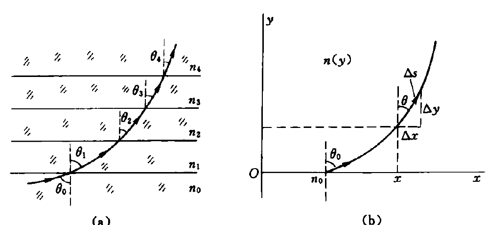
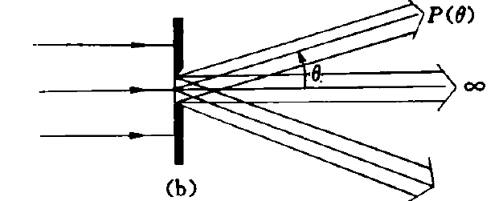
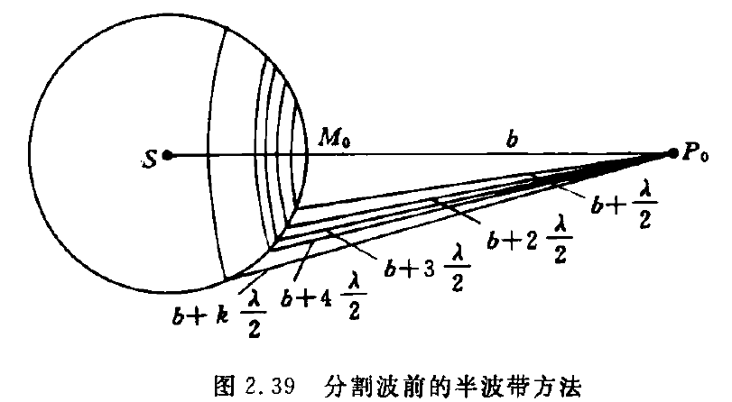
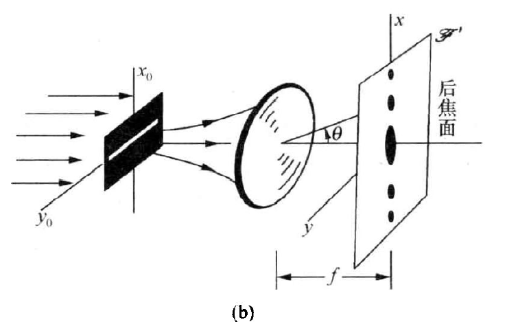
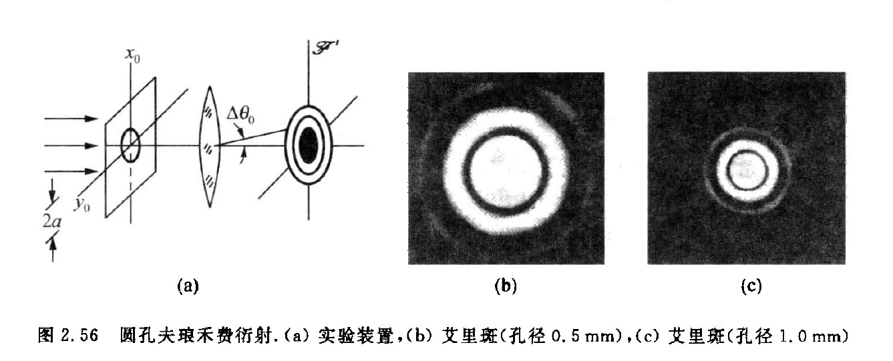

> 本文档的 .md 源文件请见：

>https://github.com/BeiHai0/Surviving-LZU-Physics/tree/master/%E5%B0%8F%E7%8F%AD%E8%AE%B2%E4%B9%89/%E5%85%89%E5%AD%A6%E5%9F%BA%E7%A1%801%E5%B0%8F%E7%8F%AD%E8%AE%B2%E4%B9%89

# 第0章 随便唠唠

## 找电子书

### zlib

https://zh.zlibrary-global.se/

> 很遗憾，上面的网站被 FBI 干掉了。下面的网站目前还能用：

https://zh.1lib.sk/?ref=www.tboxn.com

小心盗版网站！凡要你先交钱后下载的都是盗版网站！

### libgen

https://libgen.is/

### annas

https://annas-archive.org/

### 算计物理群文件

## 电子笔记

### markdown 记笔记

#### 软件（vscode）

> 不同软件的 markdown 标准可能不同。如果你想接着我的 md 文件继续写，还是用 vscode 吧！

https://code.visualstudio.com/

#### markdown 基本语法

https://markdown.com.cn/

https://www.markdownguide.org/basic-syntax/

#### 数学公式

https://www.cmor-faculty.rice.edu/~heinken/latex/symbols.pdf

https://katex.org/docs/supported

#### vscode 效率工具——snippets

https://www.freecodecamp.org/news/definitive-guide-to-snippets-visual-studio-code/

欢迎关注 my github：

https://github.com/BeiHai0/Surviving-LZU-Physics

README.md 里有自己配置的 snippets 供参考

### Github——用于备份

https://github.com/

廖雪峰老师的 Git 教程：

https://www.liaoxuefeng.com/wiki/896043488029600

## 问问题

### 知乎

### Stack Exchange

https://stackexchange.com/

英语要好

### google

维基百科

小时百科也还行

### AI

ChatGPT

Gemini

文心一言之类的

# 第1章 几何光学

## 惠更斯原理

### 惠更斯原理

光扰动同时到达的空间曲面被称为波面或波前，波前上的每一点可以被看作一个新的扰动中心，称其为子波源或次波源，次波源向四周激发次波；**下一时刻的波前**应当是这些大量次波面的公共切面，也称其为包络面；次波中心与其次波面上的那个切点的连线方向，给出了**该处光传播方向**，亦即光射线方向。

### 惠更斯原理导出折射定律

$$
\frac{\sin i_1}{\sin i_2}
=\frac{v_1}{v_2}
$$

其中，$i_1$ 与 $v_1$ 对应，$i_2$ 与 $v_2$ 对应

## 折射率

### 折射率的定义

介质的折射率，记为 $n$，定义为真空中的光速与光在介质中的传播速度之比，即：

$$
n
\equiv \frac{c}{v}
$$

其中，$v$ 是光在介质中的传播速度

显然，真空的折射率为 $1$；非真空介质的折射率 $n>1$

### 折射率表述的折射定律

$$
n_1\sin i_1
=n_2\sin i_2
$$

其中，$n_1$ 与 $i_1$ 对应，$n_2$ 与 $i_2$ 对应

## 色散

### 色散的定义

一种介质对不同波长的光具有不同的折射率，这被称作色散

## 介质中的波长

对于波，其波速 $v$ 时间频率 $f$ 和波长 $\lambda$ 有如下关系：

$$
v
=f\lambda
$$

在真空中：

$$
c
=f_0\lambda_0
$$

其中，$c$ 是真空中的光速，$f_0$ 是真空中的光频，$\lambda_0$ 是真空中的光波长

在介质中：

$$
v
=f\lambda
$$

其中，$v$ 是介质中的光速，$f$ 是介质中的光频，$\lambda$ 是介质中的光波长

两式相除，结合折射率的定义 $n\equiv \frac{c}{v} $ 可得：

$$
n
=\frac{f_0}{f}\cdot\frac{\lambda_0}{\lambda}
$$

特别地，在**线性介质的光场中**，光扰动的**时间频率仅由光源决定**，**与介质无关**，于是 $f_0=f$，这时得到：

$$
n
=\frac{\lambda_0}{\lambda}
$$

而之前提到，所有非真空介质的折射率 $n>1$，则上式说明**在介质中光波长变短了**（相较于真空中的光波长）。

## 光程

### 光程的定义

光程定义为**光线路径的几何长度与所经过的介质折射率的乘积**

设光沿路径 $l$ 从空间中的 $P$ 点传播到 $Q$ 点，光程，记为 $L_l(PQ)$，定义为：

$$
L_l(PQ)
\equiv \underset{(l)}{\int_{P}^{Q}}n(\vec{r})|\mathrm{d}\vec{r} |
$$

光程的离散化表达式：

$$
L_l(PQ)
\equiv \sum_{i} n_i l_i
$$

其中，$n_i$ 是第 $i $ 小段的折射率，$l_i$ 是第 $i$ 小段的长度

### 光程与相位差

>注意，这里定点振动的相位按照 $\varphi=\omega t+\varphi_0$ 的方式线性增加

设光沿路径 $l$ 从空间中的 $P$ 点传播到 $Q$ 点。考虑路径 $l$ 上的一点 $\vec{r} $，设 $t$ 时刻 $\vec{r} $ 处的波动在 $\mathrm{d}t$ 时间后传播到路径上的 $\vec{r}+\mathrm{d}\vec{r} $ 处。在无穷小传播过程中，光可看作沿直线传播，且这段线元内的介质的折射率是均匀的，即：

$$
\begin{aligned}
|\mathrm{d}\vec{r}|
&=v(\vec{r})\mathrm{d}t \\
&=\frac{c}{n(\vec{r})}\mathrm{d}t \tag{0}
\end{aligned}
$$

其中，$n(\vec{r}) $ 是 $\vec{r} $ 处介质的折射率。（注意，这里 $\mathrm{d}\vec{r} $ 一定是与 $\mathrm{d}t$ 有关的，从表述可以看出，是 $\mathrm{d}t$ 决定了 $\mathrm{d}\vec{r} $ ）

$t$ 时刻 $\vec{r} $ 处扰动的相位记为 $\varphi(\vec{r},t)$；类似地，$t+\mathrm{d}t$ 时刻 $\vec{r}+\mathrm{d}\vec{r} $ 处扰动的相位记为 $\varphi(\vec{r}+\mathrm{d}\vec{r},t+\mathrm{d}t)$

光的传播可以看作定点振动的传播，自然而然地，光的传播必定意味着相位信息的传播。**由于 $t$ 时刻 $\vec{r} $ 处的振动在 $\mathrm{d}t$ 时间后传播到路径上的 $\vec{r}+\mathrm{d}\vec{r} $ 处，于是 $t$ 时刻 $\vec{r} $ 处的相位信息在 $t+\mathrm{d}t$ 时刻传播到了 $\vec{r}+\mathrm{d}\vec{r} $ 处**，于是有：

$$
\varphi(\vec{r},t)
=\varphi(\vec{r}+\mathrm{d}\vec{r},t+\mathrm{d}t) \tag{1}
$$

在 $t\sim t+\mathrm{d}t$ 时间内，$\vec{r} $ 处的相位从 $\varphi(\vec{r},t) $ 线性地增加到 $\varphi(\vec{r},t)+\omega \mathrm{d}t $，即：

$$
\varphi(\vec{r},t+\mathrm{d}t)
=\varphi(\vec{r},t)+\omega\mathrm{d}t \tag{2}
$$ 

联立 $(1)(2) $，消去 $\varphi(\vec{r},t) $ 得：

$$
\varphi(\vec{r}+\mathrm{d}\vec{r},t+\mathrm{d}t)-\varphi(\vec{r},t+\mathrm{d}t)
=-\omega \mathrm{d}t
$$

再用前面推导得到的式子消去 $\mathrm{d}t$ 得：

$$
\varphi(\vec{r}+\mathrm{d}\vec{r},t+\mathrm{d}t)-\varphi(\vec{r},t+\mathrm{d}t)
=-\omega\frac{n(\vec{r})}{c}|\mathrm{d}\vec{r} |
$$

在同一时刻 $t+\mathrm{d}t$，对 $\vec{r} $ 从 $P$ 到 $Q$ 沿路径 $l$ 积分得：

$$
\begin{aligned}
\varphi(\vec{r}_Q,t+\mathrm{d}t)-\varphi(\vec{r}_P,t+\mathrm{d}t)
&=\underset{(l)}{\int_{P}^{Q}} -\omega \frac{n(\vec{r})}{c}|\mathrm{d}\vec{r} | \\
&=\underset{(l)}{\int_{P}^{Q}} -\frac{2\pi }{T} \frac{n(\vec{r})}{c}|\mathrm{d}\vec{r} | \\
&=\underset{(l)}{\int_{P}^{Q}} -\frac{2\pi }{T_0} \frac{n(\vec{r})}{c}|\mathrm{d}\vec{r} | \\
&=-\frac{2\pi }{T_0 c}\underset{(l)}{\int_{P}^{Q}}  n(\vec{r})|\mathrm{d}\vec{r} | \\
&\equiv -\frac{2\pi }{\lambda_0} L_l(PQ)
\end{aligned}
$$

可以看到，同一时刻 $P,Q$ 两点间的相位差与时间无关，所有上式可以简写为：

$$
\varphi(\vec{r}_Q,t)-\varphi(\vec{r}_P,t)
=-\frac{2\pi}{\lambda_0}L_l(PQ)
$$

这就是说，同一时刻空间中同一光线上两点 $P,Q$ 处光振动的相位差由光从 $P$ 出发沿光线 $l$ 到 $Q$ 的光程差决定

### 光程与时差

设某一振动在 $t_P$ 时刻传播到 $P$ 点，在 $t_Q$ 时刻传播到 $Q$ 点，则：

$$
\begin{aligned}
t_{Q}-t_{P}
&=\sum_{i} \frac{l_i}{v_i} \\
&=\sum_{i} n_il_i/c \\
&=\frac{1}{c}\sum_{i} n_i l_i \\
&=\frac{L_l(PQ)}{c}
\end{aligned}
$$

### 反射光束、折射光束的等光程性
                     
反射定律、折射定律给出的反射光束或折射光束的方向，与等光程性的要求一致。人们可以从等光程要求出发，导出反射定律和折射定律。

## 费马原理

### 费马原理的表述

光线/沿/光程为平稳值的路径/传播

光程为平稳值有四种情况：极小值、极大值和常数

在 $P,Q$ 确定的情况下，光程 $L$ 仅由路径 $l$ 这一**函数**决定。 光程 $L$ 是泛函，而**泛函为平稳值要求其变分为**零，于是根据费马原理，光线的真实传播路径应该满足：

$$
\delta L[l]
=0
$$

其中，$\delta $ 是变分算符

### 费马原理与成像

#### 物像等光程性

由物点 $P$ 发出一列球面波（或称之为同心光束），经系统变换为另一列球面波或另一个同心光束，则出射同心光束的中心称为**像点**。

成像过程是一个对同心光束实现共轭变换的过程。

从费马原理出发可以推得：从物点到像点的各光线的光程是彼此相等的。                                                          

#### 球面折射傍轴成像公式

$$
L(QOQ')
=ns+n'x
$$

> $h^2\approx 2r\Delta$ 是这么来的：
>
> 考虑三角形 由 $h,r-\Delta,r $ 构成的直角三角形，勾股定理给出：
>
>$$
h^2+(r-\Delta)^2
=r^2
\Longrightarrow
h^2-2r\Delta +\Delta^2
=0
>$$
>
>$\Delta$ 是小量，$\Delta^2$ 是二阶小量，约去二阶小量得：
>
>$$
h^2
\approx 2r\Delta
>$$

$$
\begin{aligned}
L(QMQ')
&=n\sqrt{(s+\varDelta )^2+h^2 }+n'\sqrt{(x-\varDelta)^2+h^2} \\
&=n\sqrt{s^2+h^2+2s\varDelta +\varDelta^2 }+n'\sqrt{x^2+h^2-2x\varDelta +\varDelta^2} \\
&\approx n\sqrt{s^2+h^2+2s\varDelta }+n'\sqrt{x^2+h^2-2x\varDelta } \\
(\mathrm{ps}:h^2\approx2r\Delta )&=n\sqrt{s^2+(2r+2s)\varDelta }+n'\sqrt{x^2+(2r-2x)\varDelta } \\
&=ns\sqrt{1+\frac{(2r+2s)\varDelta}{s^2} }+n'x\sqrt{1+\frac{(2r-2x)\varDelta}{x^2} } \\
&\approx ns(1+\frac{(r+s)\varDelta}{s^2})+n'x(1+\frac{(r-x)\varDelta}{x^2}) \\
&=ns+n'x+\bigg[ \frac{(r+s)}{s}n+\frac{r-x}{x}n' \bigg]\varDelta 
\end{aligned}
$$

光程差：

$$
\begin{aligned}
\Delta L
&\equiv L(QMQ')-L(QOQ') \\
&\approx \bigg[ \frac{(r+s)}{s}n+\frac{r-x}{x}n' \bigg]\varDelta 
\end{aligned}
$$

当 $\varDelta$ 前的系数为零，可近似认为满足物像等光程，此时可近似成像，并且得到球面折射傍轴成像公式：

$$
\frac{(r+s)}{s}n+\frac{r-x}{x}n'
=0
$$

或者改写为：

$$
\frac{n}{s}+\frac{n'}{x}
=\frac{n'-n}{r}
$$

这里，$s$ 是物距，$x$ 是像距，$r$ 是球面半径

若把像距记为 $s'$，则球面折射傍轴成像公式为：

$$
\frac{n}{s}+\frac{n'}{s'}
=\frac{n'-n}{r}
$$

## 光线方程

### 折射率分层均匀的情形

考虑折射率只与 $y$ 有关，而与 $x$ 无关的情况，$n=n(y)$

由折射定律，得：

$$
n_0\sin\theta_0
=n_1\sin\theta_1
=\cdots n\sin\theta
=\cdots
$$

几何关系：

$$
(\mathrm{d}s)^2
=(\mathrm{d}x)^2+(\mathrm{d}y)^2
\Longrightarrow (\frac{\mathrm{d}s}{\mathrm{d}x})^2
=1+(\frac{\mathrm{d}y}{\mathrm{d}x})^2
$$

$$
\frac{\mathrm{d}s}{\mathrm{d}x}
=\frac{1}{\sin\theta}
$$

$$
\left\{
\begin{aligned}
&n_0\sin\theta_0
=n\sin\theta \\
&(\frac{\mathrm{d}s}{\mathrm{d}x})^2
=1+(\frac{\mathrm{d}y}{\mathrm{d}x})^2 \\
&\frac{\mathrm{d}s}{\mathrm{d}x}
=\frac{1}{\sin\theta}
\end{aligned}
\right.
\Longrightarrow
\frac{\mathrm{d}y}{\mathrm{d}x}
=\sqrt{\frac{n^2(y)}{n_0^2\sin^2\theta_0}-1}
$$

# 第1章 习题选解

1.7 

1.8

期末考题

# 光在各向同性介质中的传播规律

## 麦克斯韦方程组

### 微分形式

$$
\left\{
\begin{aligned}
&\nabla\cdot\vec{B}
=0 \\
&\nabla\cdot\vec{D}
=\rho \\
&\nabla\times\vec{E}
=-\frac{\partial \vec{B}}{\partial t} \\
&\nabla\times\vec{H}
=\vec{j}+\frac{\partial \vec{D}}{\partial t}
\end{aligned}
\right.
$$

### 积分形式

$$
\left\{
\begin{aligned}
&\oiint\limits_{\partial V} \vec{B}\cdot\mathrm{d}\vec{S}
=0 \\
&\oiint\limits_{\partial V}\vec{D}\cdot\mathrm{d}\vec{S}
=Q \\
&\oint\limits_{\partial S} \vec{E}\cdot\mathrm{d}\vec{l}
=-\iint\limits_{S}\frac{\partial \vec{B}}{\partial t}\cdot\mathrm{d}\vec{S} \\
&\oint\limits_{\partial S} \vec{H}\cdot\mathrm{d}\vec{l}
=I+\oiint\limits_{S} \frac{\partial \vec{D}}{\partial t}\cdot\mathrm{d}\vec{S}
\end{aligned}
\right.
$$

## 光的电磁性质

（1）光扰动是一种电磁扰动。光扰动随时间变化和在空间的分布遵从麦克斯韦方程组：

$$
\left\{
\begin{aligned}
&\nabla\cdot\vec{B}
=0 \\
&\nabla\cdot\vec{D}
=\rho \\
&\nabla\times\vec{E}
=-\frac{\partial \vec{B}}{\partial t} \\
&\nabla\times\vec{H}
=\vec{j}+\frac{\partial \vec{D}}{\partial t}
\end{aligned}
\right.
$$

其中，$\vec{D}\equiv \varepsilon_0\vec{E}+\vec{P},\vec{H}\equiv \frac{\vec{B}}{\mu_0}-\vec{M} $；$\vec{P} $ 是电位移矢量，$\vec{M} $ 是磁化强度，$\rho$ 是自由电荷体密度，$\vec{j} $ 是传导电流

若光在各向同性线性非铁磁介质中传播，则有：

$$
\vec{P}
=\chi_{e}\varepsilon_0 \vec{E}，~~
\vec{M}
=\chi_{\mathrm{M}}\vec{H}
$$

（2）光波是一种电磁波

由矢量分析可得，光在各向同性线性非铁磁介质中传播时，$\vec{E},\vec{H} $ 满足波动方程：

$$
\nabla^2\vec{E}-\varepsilon\mu\frac{\partial^2\vec{E}}{\partial t^2}
=0
$$

$$
\nabla^2\vec{H}-\varepsilon\mu\frac{\partial^2\vec{H}}{\partial t^2}
=0
$$

其中，$\varepsilon$ 是介质的电容率（或介电常数），$\mu$ 是介质的磁导率

从中可知，光在介质中的传播速度 $v$ 为：

$$
v
=\frac{1}{\sqrt{\varepsilon\mu}}
=\frac{1}{\sqrt{\varepsilon_r\varepsilon_0\mu\mu_0}}
$$

其中，$\varepsilon=\varepsilon_r\varepsilon_0,\mu=\mu_r\mu_0$，$\varepsilon_r$ 是相对电容率（或相对介电常数），$\mu_r$ 是相对磁导率。

特别地，在真空中，$\varepsilon_r=1,\mu_r=1$，于是得到真空中的光速 $c$：

$$
c
=\frac{1}{\sqrt{\varepsilon_0\mu_0}}
$$

在后面我们会定义某种介质的折射率 $n$：

$$
n
\equiv \frac{c}{v}
$$

可得：

$$
n
\equiv \frac{c}{v}
=\sqrt{\varepsilon_r\mu_r}
$$

（3）平面电磁波是自由空间电磁波的一基元成分

可以验证，平面电磁波函数：

$$
\vec{E}(\vec{r},t)
=\vec{E}_0\cos(\omega t-\vec{k}\cdot\vec{r}+\varphi_E)
$$

$$
\vec{H}(\vec{r},t)
=\vec{H}_0\cos(\omega t-\vec{k}\cdot\vec{r}+\varphi_H)
$$

满足波动方程。其中，$\vec{k} $ 称为波矢，其方向与波的传播方向一致，也与平面等相面正交，其大小 $k$ 与波长（或称为空间周期）的关系为：

$$
k
=\frac{2\pi}{\lambda}
$$

（4）光是横波

$$
\vec{E}
\perp \vec{k},~~
\vec{H}
\perp \vec{k}
$$

（5）电场与磁场之间具有正交性和同步性

振荡着的电场与磁场，彼此在方向上是时时正交的，$\vec{E},\vec{H},\vec{k} $ 三者方向构成一个右手螺旋，即：

$$
(\vec{E}\times\vec{H})
\parallel \vec{k}
$$

（6）电磁波能流密度——坡印廷矢量

电磁波能流密度矢量：

$$
\vec{S}(\vec{r},t)
=\vec{E}(\vec{r},t)\times\vec{H}(\vec{r},t)
$$

称为坡印廷矢量

### 光强

对于光波，平均能流密度为：

$$
\begin{aligned}
\bar{S}
&=\frac{1}{T}\int_{0}^{T}|\vec{E}\times\vec{H} |\mathrm{d}t \\
&=\frac{1}{2}\sqrt{\frac{\varepsilon_r\varepsilon_0}{\mu_r\mu_0}}E_0^2 
\end{aligned}
$$

在光频段，$\mu_r\approx 1$，于是 $n\equiv \sqrt{\varepsilon_r\mu_r}\approx\sqrt{\varepsilon_r}$，于是：

$$
\begin{aligned}
\bar{S}
&=\frac{1}{2}\sqrt{\frac{\varepsilon_r\varepsilon_0}{\mu_r\mu_0}}E_0^2 \\
&\approx \frac{1}{2}\sqrt{\frac{\varepsilon_0}{\mu_0}}nE_0^2 \\
&\propto nE_0^2
\end{aligned}
$$

光强，记为 $I$，定义为：

$$
I
\equiv nE_0^2
$$

可见，光强度量的是平均电磁能流密度，但和平均电磁能流密度差一个系数

#### 定态波场

（1）空间各点的扰动是同频率的振动

（2）波场中各点扰动的振幅不随时间变化

#### 定态光波的标量表示

$\vec{E} $ 在直角坐标系下的三个分量遵从同一形式的波动方程，这就允许我们用标量 $U$ 来代表 $E_x,E_y,E_z$ 中的任意一个量，它们都遵从如下的波动方程：

$$
\nabla^2U-\frac{1}{v^2}\frac{\partial^2 U}{\partial t^2}
=0
$$

$U$ 可以理解为 $E_x,E_y,E_z$ 中的任意一个

对于某一确定场点 $\vec{r} $ 上的定态光扰动 $E_i(\vec{r},t),(i=x,y,z)$ ，其是关于时间的周期函数，在满足狄利克雷条件的情况下，此光扰动可以展开为余弦傅里叶级数，于是我们可以选取余弦函数作为定态光波的基元，定态光波可由无数不同频率的余弦波线性组合而成。这种选定的基元成分的一般形式为：

$$
U(P,t)
=A(P)\cos(\omega t+\varphi(P))
$$

其中，$A(P) $ 是振幅，$\varphi(P) $ 是初相位

### 波函数的复数表示

简谐波函数的实数形式：

$$
U(P,t)
=A(P)\cos(\omega t+\varphi(P))
$$

其中，$\varphi(P) $ 是场点 $P$ 处光扰动的初相位

复数形式：

$$
\tilde{U}(P,t)
=A(P)e^{-\mathrm{i}(\omega t+\varphi(P))}
$$

由欧拉公式 $e^{\mathrm{i}\theta}=\cos\theta+\mathrm{i}\sin\theta $，可得二者的关系为：

$$
\Re\{\tilde{U}(P,t) \}
=U(P,t)
$$

其中，$\Re\{\cdot \}$ 表示“取实部”操作

>比如：
>
>$$
\Re\{1+2\mathrm{i} \}
=1
>$$

#### 平面简谐波

$$
U(\vec{r},t)
=A\cos(\omega t-\vec{k}\cdot \vec{r} +\varphi_0)
$$

其中，$A $ 是平面波的振幅；$\vec{r} $ 是坐标原点指向场点的位矢；$\vec{k} $ 是平面波的波矢，其方向与平面波的传播方向同向平行，大小为 $k=\frac{2\pi}{\lambda} $；$\varphi_0 $ 是坐标原点的初相位，也就是坐标原点在 $t=0$ 时刻的相位；

$$
\tilde{U}(\vec{r},t)
=Ae^{\mathrm{i}(\vec{k}\cdot\vec{r}-\omega t-\varphi_0)}
$$

#### 发散球面简谐波

$$
U(\vec{r},t)
=\frac{a_1}{r}\cos(\omega t-kr+\varphi_0)
$$

其中，$r$ 是点源到场点 $\vec{r} $ 的距离；$\varphi_0 $ 是点源的初相位

$$
\tilde{U}(\vec{r},t)
=\frac{a_1}{r}e^{\mathrm{i}(kr-\omega t-\varphi_0)}
$$

#### 柱面简谐波

$$
U(r,t)
=\frac{b_1}{\sqrt{r}}\cos(\omega t-kr+\varphi_0)
$$

$$
\tilde{U}(r,t)
=\frac{b_1}{\sqrt{r}}e^{\mathrm{i}(kr-\omega t-\varphi_0)}
$$

### 复振幅

设 $U(P,t)=A(P)\cos(\omega t+\varphi(P)) $，其中，$\varphi(P) $ 是 $P$ 点的初相位，则 $P$ 点的复振幅，记为 $\tilde{U}(P) $，定义为：

$$
\tilde{U}(P)
\equiv A(P)e^{-\mathrm{i}\varphi(P)}
$$

复振幅与时间无关，其关注的是光扰动在空间中的分布规律。

#### 平面简谐波复振幅

$$
U(\vec{r},t)
=A\cos(\omega t-\vec{k}\cdot \vec{r} +\varphi_0)
$$

$$
\varphi(\vec{r})
=-\vec{k}\cdot\vec{r}+\varphi_0
$$

$$
\begin{aligned}
\tilde{U}(\vec{r})
&\equiv A(\vec{r})e^{-\mathrm{i}\varphi(\vec{r})} \\
&=A e^{-\mathrm{i}(-\vec{k}\cdot\vec{r}+\varphi_0)} \\
&=Ae^{\mathrm{i}(\vec{k}\cdot\vec{r}-\varphi_0)}
\end{aligned}
$$

#### 球面发散简谐波复振幅

$$
U(\vec{r},t)
=\frac{a_1}{r}\cos(\omega t-kr+\varphi_0)
$$

$$
\varphi(\vec{r})
=-kr+\varphi_0
$$

$$
\begin{aligned}
\tilde{U}(\vec{r})
&\equiv A(\vec{r})e^{-\mathrm{i}\varphi(\vec{r})} \\
&=\frac{a_1}{r}e^{-\mathrm{i}(-kr+\varphi_0)} \\
&=\frac{a_1}{r}e^{\mathrm{i}(kr-\varphi_0)}
\end{aligned}
$$

#### 柱面简谐波复振幅

$$
U(r,t)
=\frac{b_1}{\sqrt{r}}\cos(\omega t-kr+\varphi_0)
$$

$$
\varphi(\vec{r})
=-kr+\varphi_0
$$

$$
\begin{aligned}
\tilde{U}(\vec{r})
&\equiv A(\vec{r}) e^{-\mathrm{i}\varphi(\vec{r})} \\
&=\frac{b_1}{\sqrt{r}}e^{-\mathrm{i}(-kr+\varphi_0)} \\
&=\frac{b_1}{\sqrt{r}}e^{\mathrm{i}(kr-\varphi_0)}
\end{aligned}
$$

### 波前函数

观察平面上某点的复振幅称为波前函数。

一般用 $z=\mathrm{const}$ 来表示这个观察平面。由于 $z$ 坐标是个常数，于是波前函数只是观察平面上的两个直角坐标分量 $x,y$ 的函数，用 $\tilde{U}(x,y) $ 来表示（波前函数）。

### 球面波向平面波的转化

#### 傍轴条件（振幅条件）—— $z^2\gg \rho^2 $

源面 $x_0-y_0$ 平面上有一点源 $(x_0, y_0)$ 发射球面波，场面 $x-y$ 平面距源面的距离为 $z$，则场面上 $(x,y)$ 场点的波前函数精确表达是：

$$
\begin{aligned}
\tilde{U}(x,y)
&\equiv \frac{a_1}{r}e^{\mathrm{i}(kr-\varphi_0)} \\
&=\frac{a_1}{\sqrt{(x-x_0)^2+(y-y_0)^2+z^2}}e^{\mathrm{i}(k\sqrt{(x-x_0)^2+(y-y_0)^2+z^2}-\varphi_0)}
\end{aligned}
$$

傍轴条件下，波前函数的近似表达是：

$$
\begin{aligned}
\tilde{U}(x,y)
&\approx \frac{a_1}{z}e^{\mathrm{i}(kz+k\frac{(x-x_0)^2+(y-y_0)^2}{2z}-\varphi_0)} \\
&=\frac{a_1}{z}e^{\mathrm{i}kz}\cdot e^{\mathrm{i}k\frac{(x-x_0)^2+(y-y_0)^2}{2z}}\cdot e^{-\mathrm{i}\varphi_0}
\end{aligned}
$$

#### 远场条件（相位条件）—— $z\lambda\gg \rho^2 $

> 做题的话，远场条件可认为是 $z\lambda\approx 50\rho^2 $

源面 $x_0-y_0$ 平面上有一点源 $(x_0, y_0)$ 发射球面波，场面 $x-y$ 平面距源面的距离为 $z$，则场面上 $(x,y)$ 场点的波前函数精确表达是：

$$
\begin{aligned}
\tilde{U}(x,y)
&\equiv \frac{a_1}{r}e^{\mathrm{i}(kr-\varphi_0)} \\
&=\frac{a_1}{\sqrt{(x-x_0)^2+(y-y_0)^2+z^2}}e^{\mathrm{i}(k\sqrt{(x-x_0)^2+(y-y_0)^2+z^2}-\varphi_0)}
\end{aligned}
$$

仅远场条件下，波前函数的近似表达是：

$$
\begin{aligned}
\tilde{U}(x,y)
\approx \frac{a_1}{z+\frac{x^2+y^2}{2z}}e^{\mathrm{i}kz}\cdot e^{-\mathrm{i}\varphi_0}
\end{aligned}
$$

对于光波，远场条件更加苛刻。若满足了远场条件，则傍轴条件也必定满足。

于是对于光波，波前函数可进一步近似为：

$$
\tilde{U}(x,y)
\approx \frac{a_1}{z}e^{\mathrm{i}kz}\cdot e^{-\mathrm{i}\varphi_0}
$$

由此可见，对于光波，在远场条件下，球面波可近似为平面波。

### 波叠加原理

在通常介质与通常光强条件下，波叠加原理成立，即总扰动等于各分扰动的叠加。

### 波叠加的两种情况

在波叠加原理成立的情况下，考察交叠区中的光强分布，存在两种情况：

#### 非相干叠加

在观测时间中，总光强是各分光强的直接相加：

$$
I(P)
=I_1(P)+I_2(P)
$$

#### 相干叠加

在观测时间中，总光强**不等于**各分光强的直接相加：

$$
I(P)
=I_1(P)+I_2(P)+\Delta I(P)
$$

### 光波叠加的相干条件

（1）光振动方向一致或有方向一致的平行振动分量。

（2）两列波的频率相同。

**证明**：

设交叠区中场点 $P$ 处的两个扰动的实值表示分别为：

$$
U_1(P,t)
=A_1\cos(\omega_1 t+\varphi_1(P))
$$

$$
U_2(P,t)
=A_2\cos(\omega_2 t+\varphi_1(P))
$$

总扰动 $U(P,t)$ 遵从波叠加原理：

$$
U(P,t)
=U_1(P,t)+U_2(P,t)
$$

在光的矢量理论中，光强正比于平均电磁能流密度。这里我们讨论的是光的标量理论，用标量 $U$ 代表电场 $\vec{E} $ 在直角坐标系下的任一分量。

类比矢量理论，可定义标量理论中的“光强” ：

$$
I(P)
\equiv \braket{U^2(P,t)}
\equiv \frac{1}{T} \int_{0}^{T} U^2(P,t)\mathrm{d}t
$$

其中，$T$ 是观察时间，$\braket{\cdot} $ 表示对尖括号内的物理量取观察时间的平均值。

基于此，总扰动的“光强”为：

$$
\begin{aligned}
I(P)
&\equiv \braket{U^2(P,t)} \\
&=\bigg\langle \bigg( U_1(P,t)+U_2(P,t) \bigg)^2\bigg\rangle \\
&=\braket{U_1^2(P,t)+U_2^2(P,t)+2U_1(P,t)U_2(P,t)} \\
&=\braket{U_1^2(P)}+\braket{U_2^2(P,t)}+2\braket{U_1(P,t)U_2(P,t)} \\
&=I_1(P)+I_2(P)+2\braket{U_1(P,t)U_2(P,t)} \\
\end{aligned}
$$

观察交叉项：

$$
\begin{aligned}
\Delta I(P)
&\equiv 2\braket{U_1(P,t)U_2(P,t)} \\
&=2\braket{A_1A_2\cos(\omega_1 t+\varphi_1)\cos(\omega_2 t+\varphi_2)} \\
&=A_1A_2\braket{\cos[(\omega_1+\omega_2)t+\varphi_1+\varphi_2]}+A_1A_2\braket{\cos[(\omega_1-\omega_2)t+(\varphi_1-\varphi_2)]}
\end{aligned}
$$

注意到，光的频率很大，时间周期很短，因此在相对很长的观察时间 $T$ 内，有：

$$
\braket{\cos[(\omega_1+\omega_2)t+\varphi_1+\varphi_2]}
\approx 0
$$

于是进一步有：

$$
\begin{aligned}
\Delta I(P)
&=A_1A_2\braket{\cos[(\omega_1+\omega_2)t+\varphi_1+\varphi_2]}+A_1A_2\braket{\cos[(\omega_1-\omega_2)t+(\varphi_1-\varphi_2)]} \\
&\approx A_1A_2\braket{\cos[(\omega_1-\omega_2)t+(\varphi_1-\varphi_2)]}
\end{aligned}
$$

当 $\omega_1\ne \omega_2$，且 $\omega_1$ 和 $\omega_2$ 相差不太小时，同样有：

$$
\braket{\cos[(\omega_1-\omega_2)t+(\varphi_1-\varphi_2)]}
\approx 0
$$

此时，

$$
\Delta I(P)
\approx 0
$$

也就是说，当 $\omega_1\ne \omega_2$，且 $\omega_1$ 和 $\omega_2$ 相差不太小时， 交叉项为零，不发生干涉。

当 $\omega_1=\omega_2$ 时，

$$
\begin{aligned}
\Delta I(P)
&\approx A_1A_2\braket{\cos[(\omega_1-\omega_2)t+(\varphi_1-\varphi_2)]} \\
&\ne 0,~~(\mathrm{ps}:\varphi_1-\varphi_2~的值合适的情况下)
\end{aligned}
$$

此时，干涉项不为零。也就是说，当满足同频条件 $\omega_1=\omega_2$ 时，才能发生干涉。

（3）场点有稳定的相位差。

#### 双光束干涉强度公式

注意到：

$$
\begin{aligned}
I_1(P)
&\equiv \braket{U_1(P,t)} \\
&\approx \frac{1}{2}A_1^2
\end{aligned}
$$

$$
I_2(P)
\approx \frac{1}{2}A_2^2
$$

上面推导给出，当 $\omega_1=\omega_2$ 时，有：

$$
\begin{aligned}
\Delta I(P)
&\approx A_1A_2\braket{\cos[(\omega_1-\omega_2)t+(\varphi_1-\varphi_2)]} \\
&=A_1A_2\braket{\cos(\varphi_1-\varphi_2)} \\
&=A_1A_2\cos(\varphi_1-\varphi_2)
\end{aligned}
$$

令：

$$
\delta(P)
=\varphi_1-\varphi_2
$$

则得到双光束干涉强度公式：

$$
\begin{aligned}
I(P)
&=I_1+I_2+A_1A_2\cos\delta(P) \\
&=I_1+I_2+ 2\sqrt{I_1I_2}\cos\delta(P)
\end{aligned}
$$

或者：

$$
I(P)
=\frac{1}{2}A_1^2+\frac{1}{2}A_2^2+\sqrt{A_1A_2}\cos\delta(P)
$$

由于上式中很多 $\frac{1}{2} $，不好看，而光强又只是一“相对度量手段”，不妨将光强写为：

$$
I(P)
=A_1^2+A_2^2+2A_1A_2\cos\delta(P)
$$

再注意到复振幅：

$$
\tilde{U}_1(P)
=A_1e^{-\mathrm{i}\varphi_1(P)}
$$

$$
\tilde{U}_2(P)
=A_2e^{-\mathrm{i}\varphi_2(P)}
$$

注意到：

$$
\begin{aligned}
[\tilde{U}_1(P)+\tilde{U}_2(P)][\tilde{U}_1(P)+\tilde{U}_2(P)]^*
&=[A_1e^{-\mathrm{i}\varphi_1(P)}+A_2e^{-\mathrm{i}\varphi_2(P)}][A_1e^{\mathrm{i}\varphi_1(P)}+A_2e^{\mathrm{i}\varphi_2(P)}] \\
&=A_1^2+A_2^2+A_1A_2e^{\mathrm{i}(\varphi_2(P)-\varphi_1(P))}+A_1A_2e^{\mathrm{i}(\varphi_1(P)-\varphi_2(P))} \\
&=A_1^2+A_2^2+A_1A_2\cos\bigg[ \varphi_2(P)-\varphi_1(P) \bigg]+\mathrm{i}\sin\bigg[ \varphi_2(P)-\varphi_1(P) \bigg] +A_1A_2\cos\bigg[ \varphi_1(P)-\varphi_2(P) \bigg]+\mathrm{i}\sin\bigg[ \varphi_1(P)-\varphi_2(P) \bigg] \\
&=A_1^2+A_2^2+2A_1A_2\cos\delta(P)
\end{aligned}
$$

#### 干涉场的衬比度

$$
\gamma
\equiv \frac{I_{\max}-I_{\min}}{I_{\max}+I_{\min}}
$$

$$
0
\leqslant \gamma
\leqslant 1
$$

衬比度越大，干涉条纹清晰度越好。

当衬比度 $\gamma=0$ ，即 $I_{\max}=I_{\min}$，此时干涉场中光强处处相等，不出现干涉条纹。

对于双光束干涉，

$$
I
=I_1+I_2+2\sqrt{I_1I_2}\cos\delta(P)
$$

得到：

$$
I_{\max}
=I_1+I_2+2\sqrt{I_1I_2}
$$

$$
I_{\min}
=I_1+I_2-2\sqrt{I_1I_2}
$$

于是：

$$
\begin{aligned}
\gamma
&\equiv \frac{I_{\max}-I_{\min}}{I_{\max}+I_{\min}} \\
&=\frac{4\sqrt{I_1I_2}}{2(I_1+I_2)} \\
&=\frac{2\sqrt{I_1I_2}}{I_1+I_2}
\end{aligned}
$$

考虑到 $I_1/I_2 =(A_1/A_2)^2$

于是双光束干涉的衬比度也可以用振幅比表达：

$$
\gamma
=\frac{2\frac{A_1}{A_2}}{1+(\frac{A_1}{A_2})^2}
$$

#### 利用衬比度表达双光束干涉强度公式

$$
\begin{aligned}
I
&=I_1+I_2+2\sqrt{I_1I_2}\cos\delta(P) \\
&=(I_1+I_2)(1+\frac{2\sqrt{I_1I_2}}{I_1+I_2}\cos\delta(P)) \\
&=(I_1+I_2)(1+\gamma\cos\delta(P)) \\
&=I_0(1+\gamma\cos\delta(P)),~~I_0=I_1+I_2
\end{aligned}
$$

#### 两束自然光交叠场中衬比度 $\gamma$ 与光束夹角 $\alpha$ 的关系

$$
\gamma
=\frac{1}{2}(1+\cos\alpha)
$$

#### 相干叠加的五个条件

（1）光振动方向一致或有方向一致的平行振动分量。

（2）两列波的频率相同。

（3）场点有稳定的相位差。

（4）参与相干叠加的两束光的振幅尽可能接近。

（5）参与相干叠加的两束光的传播方向的夹角不要太大。

#### 双光束干涉强度公式汇总

$$
\boxed{
I(P)
=I_1+I_2+2\sqrt{I_1I_2}\cos\delta(P)
}
$$

$$
\boxed{
I(P)
=A_1^2+A_2^2+2A_1A_2\cos\delta(P)
}
$$

$$
\boxed{
I(P)
=(\tilde{U}_1+\tilde{U}_2)(\tilde{U}_1+\tilde{U}_2)^*
}
$$

$$
\boxed{
I(P)
=I_0(1+\gamma\cos\delta(P))
},~~I_0=I_1+I_2
$$

# 光的干涉

### 杨氏双孔干涉

#### 杨氏双孔干涉强度分布公式

$$
I(x,y)
=I_0[1+\cos (k\frac{d}{D}x)]
$$

其中，$k$ 是波矢大小，$d$ 是双孔间距，$D$ 是双孔到屏幕的距离

#### 杨氏双孔干涉干涉条纹间距公式

$$
\Delta x
=\frac{\lambda D}{d}
$$

其中，$\Delta x $ 是条纹间距，$\lambda $ 是光波长，$D$ 是双孔到接收屏距离，$d$ 是双孔间距

#### 杨氏双孔干涉点源位移导致条纹移动

$$
\delta x
=\frac{D}{R}x_0
$$

其中，$\delta x$ 是零级条纹的位移，$D$ 是双孔到接收面的距离，$R$ 是源面到双孔的距离，$x_0$ 是点源相对中心轴的位移

#### 两个分离点源照明时的部分相干场

$$
I(x,y)
=2I_0[1+\cos\frac{\varphi_0}{2}\cdot \cos(2\pi fx+\frac{\varphi_0}{2})]
$$

$$
\varphi_0
=2\pi f_0 x_0,~~f_0=\frac{d}{R\lambda}
$$

衬比度：

$$
\gamma
=|\cos\frac{\varphi_0}{2} |,~~\varphi_0=2\pi f_0x_0
$$

#### 线光源照明时的部分相干场

$$
I(x,y)
=I_0\bigg( 1+\frac{\sin\pi f_0 b}{\pi f_0 b}\cdot\cos (2\pi fx) \bigg) 
$$

衬比度：

$$
\gamma
=\bigg|\frac{\sin \pi f_0 b}{\pi f_0 b} \bigg|,~~f_0=\frac{d}{R\lambda }
$$

其中，$b$ 是线光源的宽度，$R $ 是源面到双孔的距离，$d $ 是双孔间距，$\lambda $ 是单色线光源的波长。

注意，接收屏上各场点处的衬比度都相等。

整套干涉条纹的衬比度由实验装置的参数决定，具体来说，$\gamma$ 由双孔间距 $d $，源面到双孔的距离 $R $，线光源的宽度 $b $，单色线光源的波长 $\lambda $ 决定。

衬比度 $\gamma$ 与双孔到接收屏的距离无关。

#### 光源极限宽度或双孔极限间隔

**光源极限宽度**，记为 $b_0$，定义为使得衬比度 $\gamma$ 第一次降为 $0 $ 时 $b$ 的取值。

注意到，杨氏双孔模型中，若采用线光源照明，有：

$$
\begin{aligned}
\gamma
&=\bigg|\frac{\sin \pi f_0 b}{\pi f_0 b} \bigg|,~~f_0=\frac{d}{R\lambda } \\
&=\bigg|\frac{\sin (\frac{\pi}{R\lambda} \cdot bd) }{\frac{\pi}{R\lambda}\cdot bd} \bigg|
\end{aligned}
$$

让线光源宽度 $b$ 改变，而保持其他量不变，则由光源极限宽度的定义，有：

$$
\frac{\pi}{R\lambda} \cdot b_0 d
=\pi
\Longrightarrow
b_0
=\frac{R\lambda}{d}
$$

$$
\boxed{
b_0
=\frac{R\lambda}{d}
}
$$

若线光源的宽度大于光源极限宽度 $b_0 $，则认为接收屏上的干涉条纹的衬比度为零。

**双孔极限间隔**，记为 $d_0$，定义为使得衬比度 $\gamma$ 第一次降为 $0 $ 时 $d$ 的取值。

让双孔间隔 $d$ 改变，而保持其他量不变，则由双孔极限间隔的定义，有：

$$
\frac{\pi}{R\lambda} \cdot bd_0
=\pi
\Longrightarrow
d_0
=\frac{R\lambda}{b}
$$

$$
\boxed{
d_0
=\frac{R\lambda}{b}
}
$$

若双孔的间隔 $d $ 大于双孔极限间隔 $d_0 $，则认为接收屏上的干涉条纹的衬比度为零。

#### 三种光源的光源极限宽度

$$
b_0
=K\frac{R\lambda}{d}
$$

线光源，$K=1.0$

环状光源，$K=0.78$

圆盘光源，$K=1.2$

任何形状的面光源均可被压缩为沿 $x $ 轴的一个等效线光源。相应地，等效线光源有一个非均匀的亮度分布 $B(x_0)$

### 光场的空间相干性

光场的空间相干性是指，在非相干扩展光源照明空间中，横向两点光扰动之间一般是部分相干的，或者说，这两个光扰动相位随机量之间是部分相关的，部分相干程度由观测平面上干涉场的衬比度 $\gamma $ 来反映。

#### 空间相干性反比公式——相干孔径角和相干面积

上面给出了当光源宽度 $b $ 给定时，双孔的极限间隔：

$$
d_0
=\frac{R\lambda}{b}
$$

其中，$R$ 是源面到双孔面的间距，$\lambda$ 是光波长

上式可改写为：

$$
b\cdot\frac{d_0}{R}
=\lambda
$$

注意到，当 $R\gg d_0$ 时，有：

$$
\frac{d_0}{R}
\approx \Delta \theta_0
$$

其中，$\Delta \theta_0$ 是双孔间隔等于双孔极限间隔 $d_0 $ 时双孔对**线光源**中心张开的孔径角，称为**相干孔径角**，于是进一步有：

$$
b\cdot\Delta \theta_0
\approx \lambda
$$

上式就是**空间相干性反比公式**。

若双孔对线光源中心所张开的孔径角 $\Delta \theta$ 大于相干孔径角 $\Delta \theta_0 $，则认为接收屏上干涉条纹的衬比度为零。

$\Delta \theta_0 $ 的物理意义是，若两点源 $S_1,S_2$ 对线光源中心的实际张角 $\Delta\theta\approx \Delta\theta_0$，则这两个点源几乎非相干；若 $\Delta\theta<\Delta\theta_0$，则 $\gamma>0$，两点源部分相干；比值 $\Delta\theta/\Delta\theta_0$ 越小，两点源的相干程度越高。

前面给出了杨氏双孔干涉在线光源照明时的衬比度公式：

$$
\gamma
=\bigg|\frac{\sin (\frac{\pi}{R\lambda} \cdot bd) }{\frac{\pi}{R\lambda}\cdot bd} \bigg|
$$

也给出了空间相干性反比公式：

$$
b\cdot\Delta\theta_0
\approx \lambda
\Longrightarrow \frac{b}{\lambda} \approx \frac{1}{\Delta\theta_0}
$$

而双孔对线光源中心的实际张角 $\Delta \theta $ 可近似为：

$$
\Delta \theta
\approx \frac{d}{R}
$$

于是杨氏双孔干涉在线光源照明时的衬比度可改写为关于 $\Delta \theta/\Delta\theta_0$ 的函数：

$$
\gamma(\frac{\Delta\theta}{\Delta \theta_0})
=\bigg|\frac{\sin \pi \frac{\Delta \theta}{\Delta \theta_0}}{\pi \frac{\Delta \theta}{\Delta \theta_0}} \bigg|
$$

---

若面光源在相互垂直的两个方向上均有宽度 $b$，则空间相干范围应该是一个由 $\Delta\theta_0$ 旋转而成的立体角 $\Delta \Omega_0$，与光源距离 $R$ 处的相应面积 $\Delta S_0$ 称为相干面积。在相干面积之内的两个点源之间是部分相干的。

在球面上 $\theta\sim \theta+\mathrm{d}\theta,\varphi\sim \varphi+\mathrm{d}\varphi$ 范围内的立体角微元为

$$
\mathrm{d}\Omega 
=\frac{R\mathrm{d}\theta\cdot R\sin\theta\mathrm{d}\varphi}{R^2}
=\sin\theta\mathrm{d}\theta\mathrm{d}\varphi
$$

建立球坐标，使得 $z$ 轴穿过相干面积的中心，积分得：

$$
\begin{aligned}
\Delta \Omega_0
&=\int_{\varphi=0}^{\varphi=2\pi}\int_{\theta=0}^{\theta=\Delta\theta_0/2}\sin\theta\mathrm{d}\theta\mathrm{d}\varphi \\
&=2\pi (1-\cos\frac{\Delta\theta_0}{2}) \\
&=4\pi \sin^2\frac{\Delta\theta_0}{4} \\
&\approx 4\pi (\frac{\Delta\theta_0}{4})^2 \\
&=\frac{\pi}{4} (\Delta\theta_0)^2
\end{aligned}
$$

于是相干面积为：

$$
\begin{aligned}
\Delta S_0
&\approx R^2\Delta\Omega_0 \\
&\approx \frac{\pi}{4}(R\Delta \theta_0)^2
\end{aligned}
$$

利用空间相干性反比公式 $b\cdot \Delta\theta_0\approx \lambda $ 以及极限间隔 $d_0=\frac{R\lambda}{b}$ 得到：

$$
\begin{aligned}
\Delta S_0
&\approx \frac{\pi}{4}(R\Delta \theta_0)^2\\
&\approx \frac{\pi}{4}(\frac{R\lambda}{b})^2 \\
&\approx \frac{\pi}{4}d_0^2
\end{aligned}
$$

其中，$d_0$ 是光源宽度 $b$ 对应的 $S_1,S_2$ 极限间隔。

## 光场的时间相干性

### 非单色性对干涉衬比度的影响

### 光谱双线结构导致衬比度周期性变化

$$
\gamma
=\bigg|\cos(\frac{\Delta k}{2}\cdot\Delta L) \bigg|
$$

干涉场中衬比度随光程差作周期性变化，半周期为：

$$
\Delta L_0
=\frac{\pi}{\Delta k}
\approx \frac{\bar{\lambda}^2}{2\Delta \lambda}
$$

### 准单色线宽导致衬比度$\gamma(\Delta L) $ 下降

采用方垒形谱函数，可以得到：

$$
\gamma(\Delta L)
=\bigg|\frac{\sin (\frac{\Delta k}{2}\Delta L)}{\frac{\Delta k}{2}\Delta L} \bigg| 
$$

#### 最大光程差 $\Delta L_M $

最大光程差，记为 $\Delta L_M$，定义为使得 $\gamma $ 第一次等于 $0$ 的光程差 $\Delta L$ 的取值

$$
\frac{\Delta k}{2}\Delta L_M
=\pi
\Longrightarrow
L_M
=\frac{2\pi}{\Delta k}
$$

借助公式 $\frac{\Delta \lambda}{\lambda}\approx \frac{\Delta k}{k} $，也可将上式写为：

$$
\Delta L_M
=\frac{\lambda^2}{\Delta \lambda}
$$

上面两式可写成反比形式：

$$
\Delta L_M\cdot\Delta k
=2\pi,~~
\Delta L_M\cdot\frac{\Delta \lambda}{\lambda}
=\lambda
$$

利用最大光程差 $\Delta L_M$，可将衬比度函数改写为：

$$
\gamma(\Delta L)
=\bigg|\frac{\sin(\pi\frac{\Delta L}{\Delta L_M})}{\pi \frac{\Delta L}{\Delta L_M}} \bigg| 
$$

#### 时间相干性的突出表现——长程差干涉

可以证明，由谱线宽度 $\Delta \lambda$ 决定的最大光程差 $\Delta L_M$ 与由波列长度 $L_0$ 决定的最大光程差 $\Delta L_M'$ 是一致的。

#### 时间相干性反比公式

$$
L_0\cdot\frac{\Delta \lambda}{\lambda}
\approx \lambda
$$

利用 $\Delta \nu/\nu\approx \Delta \lambda/\lambda $，可将上式改写为：

$$
\tau_0\cdot\Delta \nu
\approx 1
$$

其中，$\tau_0$ 是相干时间。

## 两种典型薄膜干涉

### 等倾干涉

**膜层厚度均匀**、点光源照明条件下**无穷远处的干涉场**（借助透镜来实现）

#### 表观光程差公式

$$
\Delta L_0(P)
=2nh\cos i
$$

其中，$n$ 是薄膜折射率，$h$ 是薄膜厚度，$i$ 是入射角

表观光程差唯一地确定于倾角 $i$，于是等倾角的场点轨迹就是条纹形状。等倾干涉的干涉条纹是一系列**圆环**。

#### 等倾干涉条纹的性质

（1）扩展光源有利于观察等倾干涉条纹

（2）等倾干涉条纹为一系列圆环

（3）中心处的级次最高（中心，$i=0$，表观光程差最大，级次最高），外围的级次逐渐降低。

（4）中心条纹稀疏，外围条纹密集

（5）膜厚度改变半个波长时，从中心冒出或缩进一个条纹。

考虑中心条纹，$i=0,\cos i=1$，假设原来薄膜厚度为 $h$ 时中心处是亮条纹/暗条纹，有：

$$
\begin{aligned}
\frac{2\pi}{\lambda_0}\cdot 2nh
=\Delta \varphi_0
\end{aligned}
$$

当薄膜厚度从 $h$ 增加到 $h+\Delta h$ 时（$\Delta h>0$）恰好冒出一个亮条纹/暗条纹，有：

$$
\frac{2\pi }{\lambda_0}\cdot 2n(h+\Delta h)
=\Delta\varphi_0+2\pi
$$

作差得：

$$
\frac{2\pi}{\lambda_0}\cdot 2n\Delta h
=2\pi
$$

得到：

$$
\Delta h
=\frac{\lambda_0}{2n}
=\frac{\lambda}{2}
$$

其中，$\lambda$ 是介质中的波长

根据冒出的条纹数，可以测定长度的微小变化。

> 一般地，设膜厚度改变 $\Delta x$ 的过程中冒出或缩进了 $N $ 个条纹，则有：
>
>$$
\Delta x
=N\frac{\lambda}{2}
>$$

### 等厚干涉

定域在薄膜表面上的干涉条纹

厚度相同的地方，是同一级亮条纹，故称等厚干涉。

# 光的衍射

#### 衍射现象

波在传播传播过程中遇到障碍物，能够绕过障碍物的边缘前进。这种偏离直线传播的现象成文衍射现象。

波长越大，障碍物越小，衍射越明显。

#### 惠更斯-菲涅耳原理

波前上的每个面元可以看为次波源，它们向四周发射次波；波场中任一场点的扰动，是所有次波源所贡献的次级扰动的**相干叠加**。

设波前 $\Sigma $ 上任一面元 $\mathrm{d}S $ 对场点 $P $ 贡献的刺激扰动复振幅为 $\mathrm{d}\tilde{U}(P) $，则按惠更斯-菲涅耳原理，总扰动 $\tilde{U}(P) $ 应表达为：

$$
\tilde{U}(P)
=\oiint\limits_{(\Sigma)}\mathrm{d}\tilde{U}(P)
$$

#### 菲涅耳衍射积分式

决定 $\mathrm{d}\tilde{U}(P) $ 的因素：

$$
\begin{aligned}
\mathrm{d}\tilde{U}(P)
&\propto \mathrm{d}S ~~波前上作为次波源的微分面元\\
&\propto \tilde{U}_0(Q) ~~次波源自身的复振幅\\
&\propto \frac{1}{r}e^{\mathrm{i}kr} ~~次波源发射球面波到达场点\\
&\propto f(\theta_0,\theta) ~~倾斜因子用以表明次波面源的发射并非各向同性
\end{aligned}
$$

综合以上因素，$\displaystyle{\tilde{U}(P)=\oiint\limits_{(\Sigma)}\mathrm{d}\tilde{U}(P) }$ 可以进一步表达为：

$$
\boxed{
\tilde{U}(P)
=K\oiint\limits_{(\Sigma)}f(\theta_0,\theta)\tilde{U}_0(Q)\frac{e^{\mathrm{i}kr}}{r}\mathrm{d}S
}
$$

其中，$Q $ 是次波源，$\mathrm{d}S $ 是波前 $\Sigma $ 上 $Q $ 点处的一个小面元，$\tilde{U}_0(Q) $ 是 $Q $ 点复振幅，$r $ 是次波源 $Q $ 到场点 $P $ 的距离，$f(\theta_0,\theta) $ 是倾斜因子。

#### 基尔霍夫衍射积分式

基尔霍夫从定态波场的亥姆霍兹方程出发，利用矢量场论中的格林公式，在 $kr\gg 1$，即 $r\gg \lambda $ 的条件下，导出了无源空间边值定解的表达式：

$$
\tilde{U}(P)
=\frac{-\mathrm{i}}{\lambda}\oiint\limits_{(\Sigma)}\frac{1}{2}(\cos\theta_0+\cos\theta)\tilde{U}_0(Q)\frac{e^{\mathrm{i}kr}}{r}\mathrm{d}S
$$

凡是隔离实在的点光源与场点的任意闭合曲面，都可以作为衍射积分式中的积分面。

#### 基尔霍夫边界条件

取闭合面：

$$
(\Sigma)
=\Sigma_0+\Sigma_1+\Sigma_2
$$

其中，$\Sigma_0$ 是光孔面，$\Sigma_1$ 是光屏面，$\Sigma_2$ 是无穷远半球面。

基尔霍夫边界条件认为：

（1）无穷远面$\Sigma_2 $ 上的波前对场点的贡献为零

（2）光屏面 $\Sigma_1 $ 上波前函数为零，对场点也没有贡献

（3）只有光孔面 $\Sigma_0 $ 的波前对场点有贡献，且其波前函数 $\tilde{U}_0'(Q) $ 等于无屏障时自由传播的光场 $\tilde{U}_0(Q) $，即 $\tilde{U}_0'(Q)=\tilde{U}_0(Q) $

基于此，基尔霍夫衍射积分式简化为：

$$
\tilde{U}(P)
=\frac{-\mathrm{i}}{\lambda}\iint\limits_{\Sigma_0} f(\theta_0,\theta)\tilde{U}_0(Q) \frac{1}{r}e^{\mathrm{i}kr}\mathrm{d}S
$$

其中，倾斜因子为 $f(\theta_0,\theta)=\frac{1}{2}(\cos\theta_0+\cos\theta) $

#### 傍轴条件衍射积分式

傍轴条件下，

倾斜因子 $f(\theta_0,\theta)=\frac{1}{2}(\cos\theta_0+\cos\theta)\approx 1 $

球面次波函数 $\frac{1}{r}e^{\mathrm{i}kr}\approx \frac{1}{r_0}e^{\mathrm{i}kr} $

得到傍轴条件衍射积分公式：

$$
\tilde{U}(P)
=\frac{-\mathrm{i}}{\lambda r_0}\iint\limits_{\Sigma_0}\tilde{U}_0(Q)e^{\mathrm{i}kr}\mathrm{d}S
$$

### 衍射系统及其分类——菲涅耳衍射与夫琅禾费衍射

#### 菲涅耳衍射

光源到衍射屏、衍射屏到接收屏之间的距离均为有限远，或其中之一是有限远的场合；或者说，**球面波照明**时在**有限远处接收**的是菲涅耳衍射场。

#### 夫琅禾费衍射

光源到衍射屏、衍射屏到接收屏的距离都是无限远；或者说。**平面波照明**时在**无穷远处接收**的是夫琅禾费衍射场。

### 衍射巴比涅原理

设 $\Sigma_a,\Sigma_b $ 是一对透光率互补的屏面，现将它们作为衍射屏先后插置于衍射系统中，设 $\Sigma_a$ 单独存在时形成的衍射场为 $\tilde{U}_a(P) $，$\Sigma_b$ 单独存在时形成的衍射场为 $\tilde{U}_b(P)$，光波通行无阻时全波前 $\Sigma_0$ 形成的自由光场为 $\tilde{U}_0(P)$，由于：

$$
\Sigma_a+\Sigma_b
=\Sigma_0
$$

根据基尔霍夫衍射积分公式，结合二重积分的区域可加性，有：

$$
\begin{aligned}
\tilde{U}_0(P)
&=\frac{-\mathrm{i}}{\lambda}\underset{(\Sigma_0)}{\iint} f(\theta_0,\theta)\tilde{U}_0(Q)\frac{1}{r}e^{\mathrm{i}kr}\mathrm{d}S \\
&=\frac{-\mathrm{i}}{\lambda}\underset{(\Sigma_a)+(\Sigma_b)}{\iint} f(\theta_0,\theta)\tilde{U}_0(Q)\frac{1}{r}e^{\mathrm{i}kr}\mathrm{d}S \\
&=\frac{-\mathrm{i}}{\lambda}\underset{(\Sigma_a)}{\iint} f(\theta_0,\theta)\tilde{U}_0(Q)\frac{1}{r}e^{\mathrm{i}kr}\mathrm{d}S 
+\frac{-\mathrm{i}}{\lambda}\underset{(\Sigma_b)}{\iint} f(\theta_0,\theta)\tilde{U}_0(Q)\frac{1}{r}e^{\mathrm{i}kr}\mathrm{d}S\\
&=\tilde{U}_a(P)+\tilde{U}_b(P)
\end{aligned}
$$

最终结果是：

$$
\tilde{U}_0(P)
=\tilde{U}_a(P)+\tilde{U}_b(P)
$$

这一反映两个孔型互补屏产生的两个衍射场关系的方程，称为**巴比涅原理**(Babinet principle)

#### 巴比涅原理的应用

由于自由光场是容易知道的，故我们可以由单缝衍射场，直接导出细丝衍射场；由圆孔衍射场，直接导出圆屏衍射场

### 圆孔和圆屏菲涅耳衍射

#### 半波带法

#### 螺旋式曲线

效仿半波带方法，将每个半波带再细分为 $N$ 个环带；每个细环带上的次波源对场点贡献的小扰动，可由一个小矢量表示；这 $N $ 个小矢量长度相等，取向渐变以反映彼此间的相位差。这些小矢量头尾相接，形成半个正多边形，其极限过渡为半圆。于是，波前上全部次波源在轴上场点 $P_0 $ 贡献地扰动小矢量，形成一个个半径及其缓慢收缩地螺旋式曲线。借此，可以求得 $k $ 为非整数时的衍射强度 $I(P_0) $

### 单缝夫琅禾费衍射

平行光照射单缝，在透镜后焦面 $\mathscr{F}' $ 上接收夫琅禾费衍射场。

单狭缝的宽度 $\Delta x_0=a\ll  $ 长度 $\Delta y_0=b$，其衍射强度显著地沿 $x $ 轴扩展。

#### 矢量图解法

$\theta $ 是衍射角，用于标定场点 $P $ 的位置，现在分析后焦面上的衍射强度分布 $I(\theta) $：

由透镜的性质，像空间后焦面上的一个点对应于物空间的一个方向，即从单缝出发衍射角为 $\theta $ 的一系列次波线才能会聚在后焦面上的一点 $P $，发生相干叠加，从而决定了衍射强度。

为此，将单缝的宽度 $\Delta x_0=a$ 继续细分（尽管已经很细了）为一系列更细的细缝，每个细缝作为次波源对场点贡献一个小扰动，用一个小矢量；这一系列小矢量长度相等，但取向依次变动，首位相接，形成一段圆弧。

这段圆弧 $\mathop{AB}\limits^{\frown} $ 起点 $A $ 与终点 $B $ 的两条切线的夹角 $\delta $ 是确定的，因为它代表了 $A $ 边与 $B $ 边贡献的两个小扰动之间的相位差 $\delta_{AB} $，而相位差 $\delta_{AB} $ 又取决于光程差。

光程差为：

$$
\begin{aligned}
\Delta 
&=L(BP)-L(AP) \\
&=n\overline{BC} \\
&=na\sin\theta
\end{aligned}
$$

由光程差和相位差的关系，可得：

$$
\begin{aligned}
\delta_{AB}
&=\frac{2\pi}{\lambda_0}\Delta \\
&=\frac{2\pi}{\lambda }a\sin\theta
\end{aligned}
$$

$\mathop{AB}\limits^{\frown}=A_0 $，$\angle AOB=\delta$，$\displaystyle{R=\frac{\mathop{AB}\limits^{\frown}}{\delta} }$，于是可以求得相干叠加的合成振幅：

$$
\begin{aligned}
A(\theta)
&=2R\sin\frac{\delta}{2} \\
&=2\cdot\frac{\mathop{AB}\limits^{\frown}}{\delta}\cdot\sin\frac{\delta}{2} \\
&=A_0\frac{\sin \frac{\delta}{2}}{(\frac{\delta}{2})}
\end{aligned}
$$

引入宗量：

$$
\alpha
=\frac{\delta}{2}
=\frac{\pi a\sin\theta}{\lambda}
$$

得到单缝夫琅禾费衍射场的振幅分布和强度分布：

$$
A(\theta)
=A_0\frac{\sin\alpha}{\alpha},~~\alpha=\frac{\pi a\sin\theta}{\lambda}
$$

$$
I(\theta)
=I_0\bigg( \frac{\sin\alpha}{\alpha} \bigg)^2,~~I_0=A_0^2,\alpha=\frac{\pi a\sin\theta}{\lambda} 
$$

其中，$A_0$ 代表一系列振动小矢量取向一致时的合成振幅。

#### 衍射积分法

单缝夫琅禾费衍射场也可以由傍轴衍射积分公式求得：

$$
\tilde{U}(P)
=\frac{-\mathrm{i}}{\lambda r_0}\iint\tilde{U}_0(Q) e^{\mathrm{i}kr}\mathrm{d}S
$$

经透镜变换，振幅系数：

$$
\frac{1}{r_0}\to \frac{1}{f}
$$

平行光正入射：

$$
\tilde{U}_0(x_0)
=A
$$

积分面元：

$$
\mathrm{d}S
=b\mathrm{d}x_0
$$

相位因子 $e^{\mathrm{i}kr} $：

$$
\begin{aligned}
kr
&=\frac{k}{n}\cdot nr \\
&=k_0 L \\
&=k_0(L-L_0)+k_0 L_0 \\
&=-k_0 n x_0 \sin\theta+k_0 L_0 \\
&=-kx_0 \sin\theta+k_0 L_0
\end{aligned}
$$

其中，$L_0 $ 是坐标原点 $O $ 出发沿 $\theta $ 方向到达场点 $P $ 的光程 $L_0(OP) $，作为参考光程。

综上，衍射积分式可以表示为：

$$
\begin{aligned}
\tilde{U}(\theta)
&=\frac{-\mathrm{i}}{\lambda r_0}\iint\tilde{U}_0(Q) e^{\mathrm{i}kr}\mathrm{d}S \\
&=\frac{-\mathrm{i}}{\lambda f}\int_{x_0=-a/2}^{x_0=a/2} A\cdot e^{\mathrm{i}(-k x_0 \sin\theta+k_0 L_0)}\cdot b\mathrm{d}x_0 \\
&=\frac{-\mathrm{i}}{\lambda f}Abe^{\mathrm{i}k_0 L_0}\int_{x_0=-a/2}^{x_0=a/2}e^{-\mathrm{i} k x_0\sin\theta}\mathrm{d}x_0 \\
&=\frac{-\mathrm{i}}{\lambda f}Abe^{\mathrm{i}k_0 L_0}\cdot \frac{2\sin (\frac{a}{2}k\sin\theta)}{k\sin\theta} \\
&=\frac{-\mathrm{i}}{\lambda f}(ab)A e^{\mathrm{i} k_0 L_0}\cdot\frac{\sin(\frac{a}{2}k\sin\theta) }{\frac{a}{2}k\sin\theta} \\
&=\frac{-\mathrm{i}}{\lambda f}(ab)A e^{\mathrm{i} k_0 L_0}\cdot \frac{\sin (\frac{a}{2}\frac{2\pi}{\lambda }\sin\theta)}{\frac{a}{2}\frac{2\pi}{\lambda }\sin\theta} \\
&=\frac{-\mathrm{i}}{\lambda f}(ab)A e^{\mathrm{i} k_0 L_0}\cdot \frac{\sin(\frac{\pi a\sin\theta}{\lambda })}{\frac{\pi a\sin\theta}{\lambda}} \\
&=\frac{-\mathrm{i}}{\lambda f}(ab)A\cdot\frac{\sin \alpha}{\alpha},~~\alpha=\frac{\pi a\sin\theta}{\lambda} \\
&=\boxed{\tilde{c} e^{\mathrm{i}k_0 L_0}\cdot\frac{\sin\alpha}{\alpha}},~~\tilde{c}=\frac{-\mathrm{i}}{\lambda f}(ab)A,~~\alpha=\frac{\pi a\sin\theta}{\lambda}
\end{aligned} 
$$

光强分布为：

$$
\begin{aligned}
I(\theta)
&=\tilde{U}\tilde{U}^* \\
&=I_0\bigg( \frac{\sin\alpha}{\alpha} \bigg)^2 
\end{aligned}
$$

其中，

$$
\tilde{c}
=\frac{-\mathrm{i}}{\lambda f}(ab)A,~~
I_0
=\tilde{c}\tilde{c}^*
=\frac{(ab)^2}{(\lambda f)^2}A^2,~~
\alpha
=\frac{\pi a\sin\theta}{\lambda}
$$

$$
A(\theta)
=A_0\frac{\sin\alpha}{\alpha},~~
\alpha
=\frac{\pi a\sin\theta}{\lambda}
$$

#### 单缝夫琅禾费衍射的主要特征

（1）**最大值**

$$
I(\theta)
=I_0\frac{\sin(\frac{\pi a\sin\theta}{\lambda})}{\frac{\pi a\sin\theta}{\lambda}}
$$

当 $\theta=0 $ 时，$I(\theta) $ 取最大值 $I(0)=I_0 $，称为零级衍射峰。可以看出，$I_0 $ 的物理就是零级衍射峰的光强。

（2）**零点位置**

$$
I(\theta)
=I_0\frac{\sin(\frac{\pi a\sin\theta}{\lambda})}{\frac{\pi a\sin\theta}{\lambda}}
$$

当：

$$
\frac{\pi a\sin\theta}{\lambda}
=j\pi,~~j=\pm 1,\pm 2,\cdots
$$

时，即：

$$
a\sin\theta
=j\lambda,~~j=\pm 1,\pm2,\cdots
$$

时，$I(\theta)=0 $，出现暗点。上式称为单缝衍射零点条件。

（3）**次极大**

在相邻两个零点之间存在一个极大值

（4）**半角宽度** $\Delta \theta_0 $

零级衍射峰的半角宽度，记为 $\Delta \theta_0$，定义为由零级衍射峰与其邻近暗点之间的角方位之差，即：

$$
\Delta \theta_0
\equiv \theta_1-\theta_0
$$

其中，$\theta_0=0 $，$\theta $ 满足单缝衍射零点条件：

$$
a\sin\theta_1
=1\cdot\lambda
\Longrightarrow
\theta_1
\approx \sin\theta_1
=\frac{\lambda}{a}
$$

于是：

$$
\Delta\theta_0
=\frac{\lambda}{a}
$$

半角宽度也叫衍射发散角。

（5）**单缝宽度的影响**

单缝宽度 $a $ 影响半角宽度 $\Delta \theta_0 $，也影响零级衍射峰光强 $I_0 $

$$
\Delta \theta_0
=\frac{\lambda}{a}
$$

单缝宽度 $a $ 越小，半角宽度 $\Delta \theta_0 $ 越大，这意味着衍射波更加发散。

$$
I_0
=\frac{(ab)^2}{(\lambda f)^2}A^2
$$

单缝宽度 $a $ 越小，零级衍射峰光强 $I_0 $ 也越小。

（6）**波长的影响**

波长 $\lambda $ 影响半角宽度 $\Delta \theta_0 $，也影响零级衍射峰光强 $I_0 $

$$
\Delta \theta_0
=\frac{\lambda}{a}
$$

波长 $\lambda $ 越大，半角宽度 $\Delta \theta_0 $ 也越大，这就是说长波衍射效应更强烈。

$$
I_0
=\frac{(ab)^2}{(\lambda f)^2}A^2
$$

波长 $\lambda $ 越大，零级衍射峰光强 $I_0 $ 越小。

（7）**关于参考光程决定的相因子**

参考光程相因子 $e^{\mathrm{i}k_0 L_0} $ 是场点 $P $ 的函数，应当明确表示为 $e^{\mathrm{i}k_0 L_0(P)} $

#### 衍射反比律

$$
\rho\cdot\Delta\theta
\approx\lambda
$$

其中，$\rho $ 是限制波前的光孔在某方向的几何线度，$\Delta \theta $ 是衍射发散角。

### 圆孔夫琅禾费衍射

$$
\tilde{U}(\theta)
=\tilde{c}e^{\mathrm{i}k_0 L_0}\cdot 2\frac{\mathrm{J}_1(x)}{x}
$$

$$
I(\theta)
=I_0\bigg( \frac{2 \mathrm{J}_1(x)}{x} \bigg)^2 
$$

其中，

$$
x
=\frac{2\pi a\sin\theta}{\lambda},~~
I_0
=\frac{(\pi a^2)^2}{(\lambda f)^2}A^2
$$

其中，$a $ 是圆孔半径，$\mathrm{J}_1(x) $ 是一阶贝塞尔函数。

中心的那个亮斑称为**艾里斑**，$I_0 $ 是艾里斑中心强度。

一阶贝塞尔函数的第一个零点 $x_0 $ 的位置为：

$$
x_0
=1.22\pi
$$

于是第一个暗环的角方位 $\theta_{10} $ 应满足：

$$
\frac{2\pi a\sin\theta_{10}}{\lambda}
=1.22 \pi
$$

圆孔直径记为 $D $，$D=2a $，于是：

$$
\sin\theta_{10}
=1.22\frac{\lambda }{D}
$$

艾里斑的半角宽度：

$$
\Delta \theta_0
=\theta_{10}
\approx1.22\frac{\lambda}{D}
$$

或写为：

$$
\boxed{
D\Delta \theta_0
\approx 1.22\lambda
}
$$

#### 瑞利判据

两个物点反映在像面上有两个艾里斑，设这两个艾里斑中心之角间隔为  $\delta \theta,$ 每个艾里斑自身有个半角宽度 $\Delta\theta_0,$ 瑞利提出的判据为：

$$
\delta\theta>\Delta\theta_0 时，可分辨;\\
\delta\theta<\Delta\theta_0 时，不可分辨 \\
\delta =\Delta\theta_0 时，给出可分辨的最小角间隔\delta_m
$$

瑞利判据规定，当一个像斑中心恰好落在另一像斑边缘暗环时，确认两个像斑刚好可以分辨。

#### 位移-相移定理

在一个夫琅禾费衍射系统中，当一图像位移时，其夫琅禾费衍射场将响应一个相移，两者的定量关系为：

$$
位移(x_0,y_0)\leftrightharpoons 相移(\delta_1,\delta_2)
$$

$$
\delta_1=-kx_0\sin\theta_1 \\
\delta_2=-ky_0\sin\theta_2
$$

其中，$\theta_1,\theta_2 $ 标定了夫琅禾费衍射场点的位置。

#### 有序结构的夫琅禾费衍射场

设一衍射屏含 $N$ 个全同单元，它们取向有序但不一定规则排列，设其中心单元产生的夫琅禾费场为 $\tilde{u}_0(\theta_1,\theta_2) ,$ 其他单元相对中心单元的位移矢量分别为 $\vec{r}_j=(x_j,y_j)$，由位移-相移定理，相应的夫琅禾费场的相移量分别为：

$$
\delta_{1j}=-kx_j\sin\theta_1
$$

$$
\delta_{2j}=-ky_j\sin\theta_2
$$

于是这有序结构产生的夫琅禾费场的组成为：

$$
\begin{cases}
\tilde{u}_0(\theta_1,\theta_2), \\
\tilde{u}_1(\theta_1,\theta_2)=\tilde{u}_0\cdot e^{\mathrm{i}(\delta_{11}+\delta_{21})}, \\
\tilde{u}_2(\theta_1,\theta_2)=\tilde{u}_0\cdot e^{\mathrm{i}(\delta_{12}+\delta_{22})}, \\
\tilde{u}_3(\theta_1,\theta_2)=\tilde{u}_0\cdot e^{\mathrm{i}(\delta_{13}+\delta_{23})}, \\~~~~~~~~~~~~~~~~~~\vdots
\end{cases}
$$

根据波叠加原理，我们得到 $N$ 个全同单元的有序结构产生的夫琅禾费衍射场的一般表达式为：

$$
\tilde{U}(\theta_1,\theta_2)
=\sum_{i=0}^{(N-1)}\tilde{u}_i
=\tilde{u}_0\sum_{i=0}^{N-1} e^{\mathrm{i}(\delta_{1i}+\delta_{2i})}
$$

上式中规定，$\delta_{10}=\delta_{20}=0$

上式可以改写为：

$$
\tilde{U}(\theta_1,\theta_2)
=\tilde{u}_0(\theta_1,\theta_2)\cdot \tilde{S}(\theta_1,\theta_2)
$$

$$
\tilde{S}(\theta_1,\theta_2)
=\sum_{i=0}^{N-1} e^{\mathrm{i}(\delta_{1i}+\delta_{2i})}
$$

其中，$\tilde{u}_0$ 为单元衍射因子，简称其为**单元因子**或**形状因子**；$\tilde{S}(\theta_1,\theta_2)$ 为单元之间的干涉因子，简称为**结构因子**或**分布因子**。

#### 一维光栅衍射

光栅定义：凡含众多全同单元，且排列规则、取向有序的周期结构，统称为光栅（grating）

设一个一维多缝光栅透光的缝宽为 $a$，挡光的缝宽为 $b$，光栅的空间周期 $d$ 定义为 $a+b$，亦称为**光栅常数**。单元密度定义为 $\frac{1}{d}$，光栅的有效长度记为 $D$，则这块光栅含单元总数为：

$$
N
=\frac{D}{d}
$$

#### 一维光栅的单元因子

一维光栅的基本单元就是宽度为 $a $，长度为 $b $ 的狭缝，其单元因子为：

$$
\tilde{u}_0
=\tilde{c} e^{\mathrm{i}k_0 L_0}\cdot\frac{\sin\alpha}{\alpha}
$$

#### 一维光栅的结构因子

自上而下将 $N$ 个单元依次编号为 $1,2,\cdots,N.$ 对于一位光栅，单元的位移仅沿 $x$ 方向，相邻单元之间的位移量恒为 $d$，相应的夫琅禾费场的相移量依次为 $\delta=kd\sin\theta$，于是，一位光栅夫琅禾费衍射场的结构因子为：

$$
\begin{aligned}
\tilde{S}(\theta)
&=\sum_{i=1}^{N}(1+e^{\mathrm{i}\delta}+e^{\mathrm{i}(2\delta)}+e^{\mathrm{i}(3\delta)}+\cdots+e^{\mathrm{i}(N-1)\delta}) \\
&=\frac{1-e^{\mathrm{i}N\delta}}{1-e^{\mathrm{i}\delta}},~~\delta=kd\sin\theta
\end{aligned}
$$

利用公式：

$$
1-e^{\mathrm{i}\varphi}
=-2\mathrm{i}\sin(\frac{\varphi}{2})\cdot e^{\mathrm{i}(\frac{\varphi}{2})}
$$

结构因子可进一步表达为：

$$
\begin{aligned}
\tilde{S}(\theta)
&=\frac{1-e^{\mathrm{i}N\delta}}{1-e^{\mathrm{i}\delta}} \\
&=-2\mathrm{i}\sin(\frac{N\delta}{2})\cdot e^{\mathrm{i}(\frac{N \delta}{2})}\bigg/ -2\mathrm{i}\sin(\frac{\delta}{2})\cdot e^{\mathrm{i}(\frac{\delta}{2})} \\
&=e^{\mathrm{i}(N-1)\beta}\cdot\bigg( \frac{\sin N\beta}{\sin \beta} \bigg),~~\beta=\frac{\pi d\sin\theta}{\lambda}
\end{aligned}
$$

于是一维光栅的夫琅禾费场为：

$$
\begin{aligned}
\tilde{U}(\theta)
&=\tilde{u}_0(\theta)\cdot\tilde{S}(\theta) \\
&=\tilde{c} e^{\mathrm{i}k_0 L_0}\cdot\frac{\sin\alpha}{\alpha}\cdot e^{\mathrm{i}(N-1)\beta}\cdot\bigg( \frac{\sin N\beta}{\sin \beta} \bigg) \\
\end{aligned}
$$

把 $e^{\mathrm{i}k_0L_0} $ 吸收到 $\tilde{c} $ 中，得：

$$
\tilde{U}(\theta)
=\tilde{c}\bigg(\frac{\sin\alpha}{\alpha} \bigg) \cdot\bigg( \frac{\sin N\beta}{\sin \beta} \bigg) e^{\mathrm{i}(N-1)\beta}
$$

其中，

$$
\alpha
=\frac{\pi a\sin\theta}{\lambda},~~
\beta
=\frac{\pi d\sin\theta}{\lambda}
$$

衍射强度分布为：

$$
I(\theta)
=\tilde{U}\tilde{U}^*
=i_0\bigg( \frac{\sin\alpha}{\alpha} \bigg)^2\bigg( \frac{\sin N\beta}{\sin \beta} \bigg)^2
$$

上式中，$i_0 $ 是单缝衍射零级中心即几何像点处的衍射光强，$(\sin\alpha/\alpha)^2 $ 称为**强度单元因子**，$(\sin N\beta/\sin\beta)^2 $ 称为**强度结构因子**。

#### 一维光栅结构因子的主要特征

（1）主峰（主极强位置）

$$
\beta
=j\pi
\Longrightarrow
d \sin\theta_j
=j\lambda,~~j=0,\pm 1,\pm 2,\cdots
$$

此时：

$$
\bigg( \frac{\sin N\beta}{\sin \beta} \bigg)^2
=N^2
$$

$$
I(\theta_j)
=N^2\cdot (\theta_j)
$$

（2）主峰的半角宽度

第 $j $ 级主峰，其左右相邻的两个暗点的位置满足：

$$
d\sin(\theta_j\pm \Delta \theta)
=(k\pm \frac{1}{N})\lambda
\Longrightarrow
d\cos\theta_j\cdot\Delta \theta
=\frac{\lambda}{N}
$$

第 $j $ 级主峰的半角宽度：

$$
\Delta \theta_j
=\frac{\lambda}{Nd \cos\theta_j}
$$

（3）两个主峰之间

（4）单元因子作用

$$
d\sin\theta_j
=j\lambda
$$

$$
a\sin\theta_{j'}
=j'\lambda
$$

$$
\frac{j}{j'}
=\frac{d}{a}
$$

出现缺级现象

# 第5章 光的偏振

## 基本概念

### 光的宏观偏振态

光的宏观偏振态分为五种：线偏振光、自然光、部分偏振光、圆偏振光和椭圆偏振光

#### 线偏振光

光矢量 $\vec{E}(t)=\vec{A}\cos\omega t $

分量表示为：

$$
E_x
=A_x\cos\omega t,~~
E_y
=A_y\sin\omega t
$$

若两个正交振动之间的相位差 $\delta=0 $，则线偏振于一、三象限；

若两个正交振动之间的相位差 $\delta=\pm \pi $，则线偏振于二、四象限

#### 自然光

自然光是大量的、不同取向的、彼此无关的、无特殊优越取向的线偏振光的集合。

#### 部分偏振光

部分偏振光与自然光的区别仅在于部分偏振光不具有轴对称性，存在一优越方向。

#### 圆偏振光

圆偏振光的光矢量 $\vec{E}(t) $ 随时间仅改变方向而不改变大小，即光矢量端点的轨迹是一圆周。

圆偏振光可表示为：

$$
\vec{E}(t)
=E_x(t)\vec{e}_x+E_y(t)\vec{e}_y
$$

其中，

$$
E_x(t)
=A\cos\omega t,~~
E_y(t)
=A\cos(\omega t\pm \frac{\pi}{2})
$$

当相位差 $\delta=\frac{\pi}{2} $，合成结果为右旋偏振光（顺时针）；

当相位差 $\delta=-\frac{\pi}{2} $，合成结果为左旋偏振光（逆时针）；

#### 正椭圆偏振光

正椭圆偏振光与圆偏振光的区别在于，椭圆偏振光光矢量的两个正交振动分量的振幅不同。

$$
\vec{E}(t)
=E_x(t)\vec{e}_x+E_y(t)\vec{e}_y
$$

其中，

$$
E_x(t)
=A_x\cos\omega t,~~
E_y(t)
=A_y\cos(\omega t\pm \frac{\pi}{2}),~~
A_x\ne A_y
$$

#### 斜椭圆偏振光

斜椭圆偏振光与正椭圆偏振光的区别在于，斜椭圆偏振光两个正交振动的相位差 $\delta\ne \pm\frac{\pi}{2} $

$$
\vec{E}(t)
=E_x(t)\vec{e}_x+E_y(t)\vec{e}_y
$$

其中，

$$
E_x(t)
=A_x\cos\omega t,~~
E_y(t)
=A_y\cos(\omega t+\delta),~~
A_x\ne A_y,~~
\delta\ne \pm \frac{\pi}{2}
$$

#### 一条公式概括三种偏振光

设光矢量的两个正交振动为：

$$
\begin{cases}
E_x(t)
=A_x\cos\omega t \\
E_y(t)
=A_y\cos(\omega t\pm\delta)
\end{cases}
$$

当 $\delta=0,\pi$ 时，$\to$ 线偏振光

当 $\delta=\pm\frac{\pi}{2},A_x=A_y$ 时，$\to$ 圆偏振光

当 $\delta=\pm\frac{\pi}{2},A_x\ne A_y$， $\to$ 正椭圆偏振光

#### 马吕斯定律

$$
I_P(\alpha)
=I_0\cos^2\alpha
$$

其中，$I_0=A_0^2$ 为入射光强，$\alpha$ 是入射线偏振光的偏振方向与偏振片透振方向的夹角，$I_p(\alpha) $ 是透射光强。

#### 偏振度

|偏振态|直接通过偏振片，旋转偏振片观察光强|先通过1/4波片，再通过偏振片，旋转偏振片观察光强|
|---|---|---|
|自然光|光强不变|光强不变|
|圆偏振光|圆偏振光|光强改变，出现消光|
|线偏振光|光强改变，出现消光||
|部分偏振光|光强改变，不消光|光强改变，不消光|
|椭圆偏振光|光强改变，不消光|光强改变，出现消光|

### 菲涅耳公式

#### 菲涅尔公式成立条件

绝缘介质、各向同性介质、弱场或线性介质、光频段

#### 菲涅尔公式

$p$ 振动：平行入射面

$s$ 振动：垂直入射面

$$
\begin{aligned}
\tilde{E}_{1p}'&=\frac{n_2\cos i_1-n_1\cos i_2}{n_2\cos i_1+n_1\cos i_2} \tilde{E}_{1p} =\frac{\tan(i_1-i_2)}{\tan(i_1+i_2)}\tilde{E}_{1p} \\[2mm]
\tilde{E}_{2p}&=\frac{2n_1\cos i_1}{n_2\cos i_1+n_1\cos i_2}  \tilde{E}_{1p} \\[2mm]
\tilde{E}_{1s}'&=\frac{n_1\cos i_1-n_2\cos i_2}{n_1\cos i_1+n_2\cos i_2}  \tilde{E}_{1s}=\frac{\sin(i_2-i_1)}{\sin(i_2+i_1)} \tilde{E}_{1s} \\[2mm]
\tilde{E}_{2s}&=\frac{2n_1\cos i_1}{n_1\cos i_1+n_2\cos i_2}  \tilde{E}_{1s} =\frac{2\cos i_1\sin i_2}{\sin(i_1 +i_2)} \tilde{E}_{1s}
\end{aligned}
$$

#### 布儒斯特角

布儒斯特角：使 $p$ 光的光强反射率 $R_p=0$ 的特殊角入射 $i_B$ 称为布儒斯特角。此时反射光只有 $s $ 分量，是线偏振光。

$$
\tan i_B=\frac{n_2}{n_1}
$$

### 光在晶体中的传播

#### 晶体的分类

若按光学性质分类，晶体可分为：

（1）单轴晶体：只有一个光轴方向

（2）双轴晶体：有两个光轴方向

（3）立方晶系：各向同性

#### 双折射基本物理量

满足通常各向同性介质中折射定律的光称为**寻常光**，简称为 $o$ 光。 

不服从通常折射定律的光称为**非常光**，简称为 $e$ 光。

若入射光为自然光，则两束透射光是线偏振光，且偏振方向不同。

**光轴**：晶体中存在一个特殊方向，光沿这个方向在晶体中传播时不发生双折射，此特殊方向称为晶体的**光轴**.

**主截面**：由晶体表面的法线 $\vec{N}_s$ 和晶体内部的光轴 $\vec{z}$ 组成的平面称为晶体**主截面**

**入射面**：由入射光线方向 $\vec{r}_1$ 和晶体表面法线 $\vec{N}_s$ 组成的平面称为入射面

**主平面**：晶体中**光线**与**光轴**组成的平面称为**主平面**.

实验发现，当入射面与主截面重合时，$e$ 光偏折仍在入射面内；当入射面与主截面不重合时，$e$ 光射线就可能不在入射面内。

#### $o $ 光和 $e $ 光的判断方法

o 振动的光矢量 $\vec{E}_o(t)\perp$ 主平面$(\vec{r},\vec{z});$

e 振动的光矢量 $\vec{E}_e(t)\parallel$ 主平面 $(\vec{r},\vec{z})$

#### $o $ 光和 $e $ 光波面的传播性质

o 振动的传播具有各向同性，o 光波面为球面 $\Sigma_o(t)$，传播速度为 $v_o,$ 与传播角度无关。

e 振动的传播具有各向异性，e 光波面为旋转椭球面，其转轴为光轴。

o 光和 e 光的波面相切于光轴

传播方向角：光在晶体中的传播方向与光轴的夹角，常记为 $\xi$

e 光波面传播速度 $v_e(\xi)$ 与方向角 $\xi$ 有关：

$$
v_e(\xi)=
\begin{cases}
v_o &,当\xi=0\\
v_e &,当\xi=\frac{\pi}{2}
\end{cases}
$$

$$
n_o
=\frac{c}{v_o},~~n_e
=\frac{c}{v_e}
$$

对于其他传播方向，e 光速度介于 $v_o$ 和 $v_e$ 之间，即 $e$ 光的折射率介于 $n_o$ 和 $n_e$ 之间.

负晶体：$v_o\leqslant v_e(\xi)\leqslant v_e,~~~n_e\leqslant n_e(\xi)\leqslant n_o$

正晶体：$v_e\leqslant v_e(\xi)\leqslant v_o,~~~n_o\leqslant n_e(\xi)\leqslant n_e$

负晶体，e 光为快光，o 光为慢光

正晶体，e 光为慢光，o 光为快光

#### 晶体中的惠更斯作图法

见教材

#### 三个棱镜双折射作图

尼科尔棱镜、罗雄棱镜、沃拉斯顿棱镜和期末双折射那道题

### 波晶片

波晶片：厚度均匀且光轴平行入射表面的薄片，用于产生和检验圆偏振光或椭圆偏振光

设一束平行光正入射，表观上不出现双折射，但两个特征振动 $\vec{E}_o(t) $ 和 $\vec{E}_e(t) $ 的传播速度分别为 $v_o$ 和 $v_e$，相应的折射率分别为 $n_o$ 和 $n_e$。虽然两者通过的路程相等，但光程却不等，$\vec{E}_o(t) $ 与 $\vec{E}_e(t) $ 之间将产生一附加相位差 $\delta' $

若入射的是一束偏振光，其真空中的波长为 $\lambda_0$，设在波晶片入射点 $A$ 处 $\vec{E}_o(t),\vec{E}_e(t) $ 的相位分别为 $\varphi_o(A)$ 和 $\varphi_e(A)$，而到达出射点 $B$ 处这两个正交振动的相位为：

$$
\varphi_o(B)
=\varphi_o(A)-\frac{2\pi}{\lambda_0}n_o d
$$

$$
\varphi_e(B)
=\varphi_e(A)-\frac{2\pi}{\lambda_0}n_e d
$$

这两个正交振动在波晶片出射点 $B$ 处的相位差为：

$$
\varphi_o(B)-\varphi_e(B)
=\varphi_o(A)-\varphi_e(A)+\frac{2\pi}{\lambda_0} (n_e-n_o)d
$$

简写为：

$$
\delta_{oe}(B)
=\delta_{oe}(A)+\delta_{oe}'
$$

其中，$\delta_{oe}'=\frac{2\pi}{\lambda_0}(n_e-n_o)d$

#### （1）四分之一波晶片

$$
\delta_{oe}'
=\pm (2k+1)\frac{\pi}{2},~~~k=0,1,2\cdots
$$

对于正晶体制成的 $\frac{\lambda}{4} $ 片，因为 $n_e>n_o$，故有：

$$
\delta_{oe}'
=\frac{1}{2}\pi,\frac{3}{2}\pi,\frac{5}{2}\pi,\cdots
$$

对于负晶体制成的 $\frac{\lambda}{4} $ 片，因为 $n_e<n_o$，故有：

$$
\delta_{oe}'
=-\frac{1}{2}\pi,-\frac{3}{2}\pi,-\frac{5}{2}\pi,\cdots
$$

$\frac{\lambda}{4} $ 片所提供的有效相位差为：

$$
\delta_{oe}'
=\pm\frac{\pi}{2}
$$

$\frac{\lambda}{4} $ 片的厚度应该满足以下条件：

$$
d=(2k+1)\frac{\lambda_0}{4\Delta n}
$$

其中，$\Delta n=|n_e-n_o|$

其厚度最小值为：

$$
d_m
=\frac{\lambda_0}{4\Delta n}
$$

#### （2）二分之一波晶片

产生的附加相位差满足：

$$
\delta_{oe}'=\pm(2k+1)\pi
$$

有效相位差为：

$$
\delta_{oe}'=\pi
$$

对正负晶体均为此值

$\frac{\lambda}{2} $ 片的厚度 $d$ 满足：

$$
d=(2k+1)\frac{\lambda_0}{2\Delta n}
$$

其中，$\Delta n=|n_e-n_o| $

厚度最小值为：

$$
d_m
=\frac{\lambda_0}{2\Delta n}
$$

#### （3）全波晶片（$\lambda$ 片）：

附加相位差满足：

$$
\delta_{oe}'
=\pm 2k\pi,~~~k=1,2,3,\cdots
$$

厚度满足：

$$
d
=k\frac{\lambda_0}{\Delta n}
$$

其中，$\Delta n=|n_e-n_o|$

厚度最小值为：

$$
d_m
=\frac{\lambda_0}{\Delta n}
$$

#### 通过波晶片后的偏振态分析程序

（1）以波晶片光轴方向为基准，在光束的横平面上取定坐标架$(xy)$，$x$ 轴表示 $e$ 振动而 $y$ 轴表示 $o$ 振动

（2）以此坐标架为参考，确定光束在晶片入射点的相位差 $\delta_{oe}(A)$，并根据波晶片的种类确定附加相位差 $\delta_{oe}'=\frac{2\pi}{\lambda_0}(n_e-n_o)d$ 

（3）根据 $\delta_{oe}(B)=\delta_{oe}(A)+\delta_{oe}'$ 计算出光在波晶片出射点的相位差 $\delta_{oe}(B)$，再借助解析几何知识判定出射光的偏振态

线偏振光入射于 $\frac{\lambda}{4} $ 片时，其出射光一般为正椭圆偏振光

当入射光的线偏振方位与 $\frac{\lambda}{4} $ 片光轴的夹角为 $\frac{\pi}{4} $ 时，出射光为圆偏振光，因为此时两个正交振动的振幅相等。

当入射光的线偏振方位平行或垂直波晶片光轴时，出射光依然为线偏振光且偏振方向不变，这时波晶片提。供的附加相位差不起作用，因为两个正交振动之一的振幅为零

# 第6章 吸收、色散和散射

介质对光的吸收：光的强度随传播距离而减少的现象

光的散射：介质的不均匀性将导致光的散射

色散：介质中光速与光频或光波长有关

## 吸收

## 色散

## 散射

