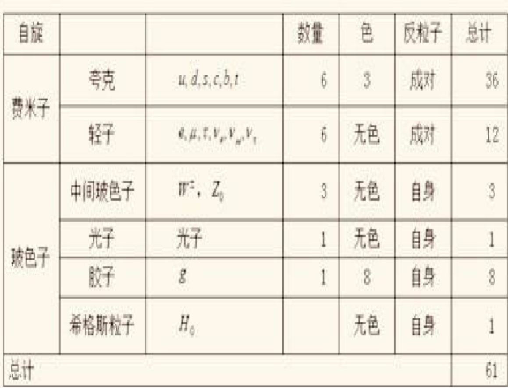

# 1 粒子物理与量纲分析

## 粒子物理

### 61种基本粒子

  

只参与弱相互作用和电磁相互作用，不参与强相互作用的费米子称为**轻子**（Lepton）。

|Lepton name| Symbol | $M$ | $Q$ | $J$ | $L_e$ | $L_\mu$ | $L_\tau$ |
|:---:|:---:|:---:|:---:|:---:|:---:|:---:|:---:|
|Electron|$e^-$|$0.511 $|$-1$|$1/2$|$+1 $|$0 $|$0 $|
|anti-Electron|$e^+ $|$0.511$|$+1 $|$1/2 $|$-1 $|$0 $|$0 $|
|Electron neutrino|$\nu_e $|$<2\times 10^{-6} $|$0 $|$1/2 $|$+1 $|$0 $|$0 $|
|anti-Electron neutrino |$\tilde{\nu}_e $|$<2\times 10^{-6} $|$0 $|$1/2 $|$-1 $|$0 $|$0 $|
|muon|$\mu^- $|$105.66 $|$-1 $|$1/2 $|$0 $|$+1 $|$0 $|
|anti-muon|$\mu^+ $|$105.66 $|$+1 $|$1/2 $|$0 $|$-1 $|$0 $|
|muon neutrino|$\nu_\mu $|$<2\times 10^{-6} $|$0 $|$1/2 $|$0 $|$+1 $|$0 $|
|anti muon neutrino|$\tilde{\nu}_\mu $|$<2\times 10^{-6} $|$0 $|$1/2 $|$0 $|$-1 $|$0 $|
|tau|$\tau^- $|$1776.86 $|$-1 $|$1/2 $|$0 $|$0 $|$+1 $|
|anti-tau|$\tau^+ $|$1776.86 $|$+1 $|$1/2 $|$0 $|$0 $|$-1 $|
|tau neutrino|$\nu_\tau $|$<2\times 10^{-6} $|$0 $|$1/2 $|$0 $|$0 $|$+1 $|
|anti tau neutrino|$\tilde{\nu}_\tau $|$<2\times 10^{-6} $|$0 $|$1/2 $|$0 $|$0 $|$-1 $|

在轻子参与的各类反应中，各类轻子数守恒。

参与强相互作用的粒子称为**强子**。质子和中子都是强子。

自旋为零和整数的强子称为**介子**（Meson），自旋为半整数的强子称为**重子**（Baryon）。

具有奇异量子数的重子称为**超子**（Hyperon）。

重子由三个夸克组成，介子由夸克和反夸克组成。

每种夸克具有色量子数（红、绿、蓝），每种反夸克具有另外三种色量子数（青、洋红、黄）

| Quark flavour | $M$ (MeV) | $Q$ | $J$ | $B$ | $I_3$ | $C$ | $S$ | $T$ | $B'$ |
|:-------------:|:---------:|:---:|:---:|:---:|:-----:|:---:|:---:|:---:|:----:|
| $u$           | $2.2$     | $+\frac{2}{3}$ | $\frac{1}{2}$ | $+\frac{1}{3}$ | $+\frac{1}{2}$ | $0$ | $0$ | $0$ | $0$ |
| $d$           | $4.7$     | $-\frac{1}{3}$ | $\frac{1}{2}$ | $+\frac{1}{3}$ | $-\frac{1}{2}$ | $0$ | $0$ | $0$ | $0$ |
| $c$           | $1270$    | $+\frac{2}{3}$ | $\frac{1}{2}$ | $+\frac{1}{3}$ | $0$ | $+1$ | $0$ | $0$ | $0$ |
| $s$           | $96$      | $-\frac{1}{3}$ | $\frac{1}{2}$ | $+\frac{1}{3}$ | $0$ | $0$ | $-1$ | $0$ | $0$ |
| $t$           | $172760$  | $+\frac{2}{3}$ | $\frac{1}{2}$ | $+\frac{1}{3}$ | $0$ | $0$ | $0$ | $+1$ | $0$ |
| $b$           | $4180$    | $-\frac{1}{3}$ | $\frac{1}{2}$ | $+\frac{1}{3}$ | $0$ | $0$ | $0$ | $0$ | $-1$ |

| Quark flavour | $M$ (MeV) | $Q$ | $J$ | $B$ | $I_3$ | $C$ | $S$ | $T$ | $B'$ |
|:-------------:|:---------:|:---:|:---:|:---:|:-----:|:---:|:---:|:---:|:----:|
| $\bar{u}$     | $2.2$     | $-\frac{2}{3}$ | $\frac{1}{2}$ | $-\frac{1}{3}$ | $-\frac{1}{2}$ | $0$ | $0$ | $0$ | $0$ |
| $\bar{d}$     | $4.7$     | $+\frac{1}{3}$ | $\frac{1}{2}$ | $-\frac{1}{3}$ | $+\frac{1}{2}$ | $0$ | $0$ | $0$ | $0$ |
| $\bar{c}$     | $1270$    | $-\frac{2}{3}$ | $\frac{1}{2}$ | $-\frac{1}{3}$ | $0$ | $-1$ | $0$ | $0$ | $0$ |
| $\bar{s}$     | $96$      | $+\frac{1}{3}$ | $\frac{1}{2}$ | $-\frac{1}{3}$ | $0$ | $0$ | $+1$ | $0$ | $0$ |
| $\bar{t}$     | $172760$  | $-\frac{2}{3}$ | $\frac{1}{2}$ | $-\frac{1}{3}$ | $0$ | $0$ | $0$ | $-1$ | $0$ |
| $\bar{b}$     | $4180$    | $+\frac{1}{3}$ | $\frac{1}{2}$ | $-\frac{1}{3}$ | $0$ | $0$ | $0$ | $0$ | $+1$ |

### 守恒定律

存在 $\ell_e,\ell_\mu,\ell_\tau $ 三种轻子数。在轻子参与的各种反应中，各类轻子数分别守恒。

在强子的粒子反应中，电荷 $Q $ 和重子数 $B $ 守恒。

在各种反应中，能量、动量、电荷、角动量守恒。

强相互作用中，能量、动量、电荷、角动量守恒、**同位旋、奇异数、宇称、重子数**守恒。

电磁相互作用中，能量、动量、电荷、角动量守恒、**奇异数、宇称、重子数守恒**；**同位旋不守恒**。

弱相互作用中，电荷、轻子数、重子数、角动量守恒；同位旋不守恒、宇称不守恒、奇异数不守恒、CP不守恒。

### $\mathrm{U}(1) $ 规范理论

QED 是关于带电粒子、光子 $\gamma $ 及其相互作用的量子场论，是 $\mathrm{U}(1) $ 规范场理论，即阿贝尔规范场理论。光子是传递电磁相互作用的规范玻色子。

### $\mathrm{SU}(2)\times\mathrm{U}(1) $ 规范理论

基本粒子衰变是一种弱相互作用。电弱统一理论是 $\mathrm{SU}(2)\times\mathrm{U}(1) $ 规范理论。

电弱统一理论包括：QED 中传递电磁相互作用的光子 $\gamma $；传递弱相互作用的 $W^{\pm},Z^0 $ 三类规范玻色子，称为中间玻色子。

电弱统一理论克服了费米理论（四个费米子直接相互作用）不能重整化的困难，预言了与 $Z^0 $ 对应的中性流，与实验符合得很好。

电弱统一理论中，规范玻色子 $W^{\pm},Z^0 $ 的质量由 Higgs 场真空自发破缺导致。

### $\mathrm{SU}(3) $ 规范理论

QCD 是 $\mathrm{SU(3)_C} $ 非阿贝尔规范理论。

$\mathrm{SU(3)} $ 群的作用以夸克三种颜色为变换对象，并以 $8 $ 种 $J=1 $ 的规范玻色子传递相互作用。在色夸克间传递强相互作用的规范玻色子称为**胶子**。

**夸克禁闭**：自然界不存在自由夸克。

### 标准模型

标准模型是以三代轻子和三代夸克作为基本粒子、以强子的夸克模型和电弱统一理论和 QCD 为基础建立起来的。

## 量纲分析与自然单位制

$$
[\hbar]
=\frac{[M] [L]^2 }{[t] } ,\quad
[c]
=\frac{[L] }{[t] } ,\quad
[k_B]
=\frac{[M] [L]^2}{[t]^2 [T] } ,\quad
[G]
=\frac{[L]^3 }{[t]^2 [M] } 
$$

自然单位制取 $\hbar=c=k_B=1 $，此时：

$$
[L] = [t] = [M]^{-1} = [T]^{-1}
$$

## 实标量场量子化

$$
\hat{\phi}(x)
=\hat{\phi}^{(+)}(x) + \hat{\phi}^{(-)}(x)
$$

$$
\hat{\phi}^{(+)}(x)
=\left(\frac{1 }{2\pi }  \right)^{3/2} \int \mathrm{e}^{-\mathrm{i}k x}\frac{1 }{\sqrt{2\varepsilon_{\vec{k}}} } \hat{a}^{(+)}\left(\vec{k} \right) \mathrm{d}^3\vec{k}
$$

$$
\hat{\phi}^{(-)}(x)
=\left(\frac{1 }{2\pi }  \right)^{3/2} \int \mathrm{e}^{+\mathrm{i}k x}\frac{1 }{\sqrt{2\varepsilon_{\vec{k}}} } \hat{a}^{(-)}\left(\vec{k} \right) \mathrm{d}^3\vec{k}
$$

### 哈密顿算符表达式

实标量场的能量密度

$$
W
=\frac{1 }{2 } \left[\left(\nabla\phi \right)\cdot\left(\nabla\phi \right) + \left(\partial_t \phi \right)\left(\partial_t \phi \right) + m^2 \phi^2 \right]
$$

哈密顿算符：

$$
\hat{H}
=\frac{1 }{2 } \int\left[\left(\nabla\hat{\phi} \right)^2 + \left(\frac{\partial\hat{\phi} }{\partial t }  \right)^2 + m^2 \hat{\phi}^2 \right] \mathrm{d}V
$$

最终可得

$$
\begin{aligned}
\hat{H}
=\frac{1 }{2 } \int \varepsilon_{\vec{k}} \left\{\hat{a}^{(+)}\left(\vec{k} \right) , \hat{a}^{(-)}\left(\vec{k} \right) \right\} \mathrm{d}^3\vec{k}
\end{aligned}
$$

分立形式

$$
\hat{H}
=\frac{1 }{2 } \sum_{\vec{k}} \varepsilon_{\vec{k}} \left\{\hat{a}^{(+)}_{\vec{k}} , \hat{a}^{(-)}_{\vec{k}} \right\}
$$

$$
\varepsilon_{\vec{k}}
=\sqrt{\vec{k}^2+m^2}
$$

### 动量算符表达式

$$
\vec{p}
=-\int \nabla\phi \frac{\partial\phi }{\partial t } \mathrm{d}^3\vec{r}
$$

$$
\hat{\vec{p}}
=-\int \left[\nabla \hat{\phi}^{(+)}\left(\vec{k} \right) + \nabla \hat{\phi}^{(-)}\left(\vec{k} \right) \right]\left[\partial_t \hat{\phi}^{(+)}\left(\vec{k} \right) + \partial_t \hat{\phi}^{(-)}\left(\vec{k} \right) \right] \mathrm{d}^3\vec{r}
$$

最终可得

$$
\hat{\vec{p}}
=\frac{1 }{2 } \int \vec{k} \left\{\hat{a}^{(+)}\left(\vec{k} \right) , \hat{a}^{(-)}\left(\vec{k} \right) \right\} \mathrm{d}^3\vec{k}
$$

分立形式

$$
\hat{\vec{p}}
=\frac{1 }{2 } \sum_{\vec{k}} \vec{k} \left\{\hat{a}^{(+)}_{\vec{k}} , \hat{a}^{(-)}_{\vec{k}} \right\}
$$

### 实标量场二次量子化算符的性质

$$
\left[\hat{H} , \hat{a}^{(-)}\left(\vec{k} \right) \right]
=-\varepsilon_k\hat{a}^{(-)}\left(\vec{k} \right)
$$

$$
\left[\hat{H} , \hat{a}^{(+)}\left(\vec{k} \right) \right]
=\varepsilon_k\hat{a}^{(+)}\left(\vec{k} \right)
$$

$$
\left[\hat{a}^{(-)}\left(\vec{k}' \right) , \hat{a}^{(+)}\left(\vec{k} \right) \right]
=\delta\left(\vec{k}-\vec{k}' \right)
$$

$$
\left[\hat{a}^{(-)}\left(\vec{k} \right) , \hat{a}^{(-)}\left(\vec{k}' \right) \right]
=\left[\hat{a}^{(+)}\left(\vec{k} \right) , \hat{a}^{(+)}\left(\vec{k}' \right) \right]
=0
$$

$$
\left[\hat{a}^{(-)}_{\vec{k}} , \hat{a}^{(+)}_{\vec{k}'} \right]
=\delta_{\vec{k},\vec{k}'}
$$

$$
\left[\hat{a}^{(-)}_{\vec{k}} , \hat{a}^{(-)}_{\vec{k}'} \right]
=\left[\hat{a}^{(+)}_{\vec{k}} , \hat{a}^{(+)}_{\vec{k}'} \right]
=0
$$

$$
\left[\hat{\vec{p}} , \hat{a}^{(+)}\left(\vec{k} \right) \right]
=\vec{k} \hat{a}^{(+)}\left(\vec{k} \right)
$$

$$
\left[\hat{\vec{p}} , \hat{a}^{(-)}\left(\vec{k} \right) \right]
=-\vec{k} \hat{a}^{(-)}\left(\vec{k} \right)
$$

$$
\left[\hat{H} , \hat{\vec{p}} \right]
=0
$$

二者有共同本征函数，设为 $\Psi_p $

$$
\hat{H} \left(\hat{a}^{(\pm)}\left(\vec{k} \right) \Psi_p \right)
=\left(E \pm \varepsilon_{\vec{k}} \right) \left(\hat{a}^{(\pm)}\left(\vec{k} \right) \Psi_p \right)
$$

$$
\hat{\vec{p}} \left(\hat{a}^{(\pm)}\left(\vec{k} \right) \Psi_p \right)
=\left(\vec{p} \pm \vec{k} \right) \left(\hat{a}^{(\pm)}\left(\vec{k} \right) \Psi_p \right)
$$

$\hat{a}^{(\pm)}\left(\vec{k} \right) \Psi_p $ 仍是能量算符和动量算符的本征态。

$\hat{a}^{(+)}\left(\vec{k} \right) \Psi_p $ 是产生了一个动量为 $\vec{k} $，能量为 $\varepsilon_{\vec{k}} $ 的自由粒子的态。

$\hat{a}^{(-)}\left(\vec{k} \right) \Psi_p $ 是消灭了一个动量为 $\vec{k} $，能量为 $\varepsilon_{\vec{k}} $ 的自由粒子的态。

$\hat{a}^{(\pm)}\left(\vec{k} \right) $ 是标量粒子的产生、消灭算符。

### 真空态

场论中的真空态，一般指每种场算符的量子化状态中能量最低的那个量子态，通常记为 $\ket{0} .$

$\hat{a}^{(-)}\left(\vec{k} \right) $ 不是态矢量，其退缩成点。

$$
\Braket{0|\hat{a}^{(+)}_{\vec{k}} \hat{a}^{(-)}_{\vec{k}}|0}
=0
$$

$$
\Braket{0|\hat{a}^{(-)}_{\vec{k}} \hat{a}^{(+)}_{\vec{k}}|0}
=1
$$

#### 归一化的态矢量

$$
\ket{n_k}
\equiv \frac{1 }{\sqrt{n_k !} } \left(\hat{a}^{(+)}_{\vec{k}} \right)^{n_k} \ket{0}
$$

上式描述的状态是 $n_k $ 个动量为 $\vec{k} $ 的自由粒子。

$$
\left(\prod_{k_i} \frac{1 }{\sqrt{n_{k_i}} }  \right)
$$

上式描述的状态是动量为 $\vec{k}_i $ 的粒子有 $n_{k_i} $ 个的状态。

### 粒子数算符

$$
\ket{n_k}
\equiv \frac{1 }{\sqrt{n_k !} } \left(\hat{a}^{(+)}_{\vec{k}} \right)^{n_k} \ket{0}
$$

$$
\hat{a}^{(-)}_{\vec{k}} \hat{a}^{(+)}_{\vec{k}} \ket{n_k - 1}
=n_k\ket{n_k - 1}
$$

$$
\hat{a}^{(+)}_{\vec{k}} \ket{n_k}
=\sqrt{n_k+1} \ket{n_k+1}
$$

$$
\hat{a}^{(-)}_{\vec{k}} \ket{n_k}
=\sqrt{n_k} \ket{n_k-1}
$$

$$
\hat{a}^{(+)}_{\vec{k}} \hat{a}^{(-)}_{\vec{k}} \ket{n_k}
=n_k \ket{n_k}
$$

定义粒子数算符

$$
\hat{N}_k
\equiv \hat{a}^{(+)}_{\vec{k}} \hat{a}^{(-)}_{\vec{k}}
$$

$$
\hat{N}_k^\dag
=\hat{N}_k
$$

$$
\hat{N}_k\ket{n_k}
=n_k\ket{n_k}
$$

$\ket{n_k} $ 是粒子数算符的本征态，也是 $\hat{\vec{p}},\hat{H} $ 的共同本征态。

$\ket{n_{k_i}} $ 组成一组正交完备基。自由标量场的任意量子态可由 $\ket{n_{k_i}} $ 展开，这种描述称为粒子数表象。

#### $\hat{\vec{p}},\hat{H} $ 粒子数算符表达式

$$
\left\{\hat{a}^{(+)}_{\vec{k}} , \hat{a}^{(+)}_{\vec{k}} \right\}
=2\hat{N}_k + 1
$$

$$
\hat{H}
=\frac{1 }{2 } \sum_{\vec{k}} \varepsilon_{\vec{k}} \left\{\hat{a}^{(+)}_{\vec{k}} , \hat{a}^{(-)}_{\vec{k}} \right\}
$$

$$
\hat{\vec{p}}
=\frac{1 }{2 } \sum_{\vec{k}} \vec{k} \left\{\hat{a}^{(+)}_{\vec{k}} , \hat{a}^{(-)}_{\vec{k}} \right\}
$$

$$
\hat{H}
=\sum_{\vec{k}} \varepsilon_{\vec{k}} \left(\hat{N}_k + \frac{1 }{2 }  \right)
$$

$$
\hat{\vec{p}}
=\sum_{\vec{k}} \vec{k} \left(\hat{N}_k + \frac{1 }{2 }  \right)
$$

#### 粒子数表象中

### $\Delta(x) $ 和 $\Delta^{(1)}(x) $ 函数

$$
\Delta^{(+)}(x-x')
\equiv \frac{\mathrm{i} }{\left(2\pi \right)^3 } \int \mathrm{e}^{-\mathrm{i}k\cdot\left(x-x' \right)} \delta\left(k^2+m^2 \right)\theta_+(k_0) \mathrm{d}k
$$

$$
\Delta^{(-)}(x-x')
\equiv -\frac{\mathrm{i} }{\left(2\pi \right)^3 } \int \mathrm{e}^{\mathrm{i}k\cdot\left(x-x' \right)} \delta\left(k^2+m^2 \right)\theta_+(k_0) \mathrm{d}k
$$

$$
\left[\hat{\phi}^{(+)}(x) , \hat{\phi}^{(-)}(x') \right]
=\mathrm{i} \Delta^{(+)}(x-x')
$$

$$
\left[\hat{\phi}^{(-)}(x) , \hat{\phi}^{(+)}(x') \right]
=\mathrm{i} \Delta^{(-)}(x-x')
$$

$$
\Delta^{(-)}(x-x')
=-\Delta^{(+)}(x'-x)
$$

$$
\left[\hat{\phi}^{(\pm)}(x) , \hat{\phi}^{(\pm)}(x') \right]
=0
$$

$$
\Delta(x-x')
\equiv \Delta^{(+)}(x-x') + \Delta^{(-)}(x-x')
$$

$$
\left[\hat{\phi}(x) , \hat{\phi}(x') \right]
=\mathrm{i} \Delta(x-x')
$$

$$
\Delta^{(1)}(x-x')
\equiv \mathrm{i}\left[\Delta^{(-)}(x-x') - \Delta^{(+)}(x-x') \right]
$$

## 3.6 矢量场量子化

$$
\hat{A}_\mu(x)
=\hat{A}^{(+)}_\mu(x) + \hat{A}^{(-)}_\mu(x)
$$

傅里叶积分展开

$$
\hat{A}^{(+)}_\mu(x)
=\frac{1 }{\left(2\pi \right)^{3/2} } \int\limits_{k_0=\varepsilon_{\vec{k}}} \mathrm{e}^{-\mathrm{i}kx} \frac{1 }{\sqrt{2\varepsilon_{\vec{k}}} } \hat{C}_\mu^{(+)}\left(\vec{k} \right)\mathrm{d}^3\vec{k}
$$

$$
\hat{A}^{(-)}_\mu(x)
=\frac{1 }{\left(2\pi \right)^{3/2} } \int\limits_{k_0=\varepsilon_{\vec{k}}} \mathrm{e}^{+\mathrm{i}kx} \frac{1 }{\sqrt{2\varepsilon_{\vec{k}}} } \hat{C}_\mu^{(-)}\left(\vec{k} \right)\mathrm{d}^3\vec{k}
$$

分立形式

$$
\hat{A}^{(+)}_\mu(x)
=\frac{1 }{\sqrt{V} } \sum_{\vec{k}} \frac{1 }{\sqrt{2\varepsilon_{\vec{k}}} } \hat{C}_{\mu\vec{k}}^{(+)} \mathrm{e}^{-\mathrm{i}kx}\bigg|_{k_0=\varepsilon_{\vec{k}}}
$$

$$
\hat{A}^{(-)}_\mu(x)
=\frac{1 }{\sqrt{V} } \sum_{\vec{k}} \frac{1 }{\sqrt{2\varepsilon_{\vec{k}}} } \hat{C}_{\mu\vec{k}}^{(-)} \mathrm{e}^{-\mathrm{i}kx}\bigg|_{k_0=\varepsilon_{\vec{k}}}
$$

其中

$$
\varepsilon_{\vec{k}}
\equiv \sqrt{\vec{k}^2}
=\left|\vec{k} \right|
$$

### 算符化

$$
\hat{H}
=\frac{1 }{2 } \int \left[\left(\nabla\hat{A}_\mu \right)\cdot\left(\nabla\hat{A}_\mu \right) + \left(\partial_t\hat{A}_\mu \right)\left(\partial_t\hat{A}_\mu \right) \right]\mathrm{d}^3\vec{x}
$$

$$
\hat{\vec{p}}
=-\int \left(\nabla\hat{A}_\mu \right)\left(\partial_t \hat{A}_\mu \right)\mathrm{d}^3\vec{x}
$$

$$
\hat{\vec{S}}
=\int \hat{\vec{A}}\times\partial_t \hat{\vec{A}} \mathrm{d}^3\vec{x}
$$

最终可得

$$
\hat{H}
=\frac{1 }{2 } \int \varepsilon_{\vec{k}} \left[\hat{C}_\mu^{(+)}\left(\vec{k} \right) \hat{C}_\mu^{(-)}\left(\vec{k} \right) + \hat{C}_\mu^{(-)}\left(\vec{k} \right) \hat{C}_\mu^{(+)}\left(\vec{k} \right) \right] \mathrm{d}^3\vec{k}
$$

$$
\hat{\vec{p}}
=\frac{1 }{2 } \int \vec{k} \left[\hat{C}_\mu^{(+)}\left(\vec{k} \right) \hat{C}_\mu^{(-)}\left(\vec{k} \right) + \hat{C}_\mu^{(-)}\left(\vec{k} \right) \hat{C}_\mu^{(+)}\left(\vec{k} \right) \right] \mathrm{d}^3\vec{k}
$$

$$
\hat{\vec{S}}
=\frac{\mathrm{i} }{2 } \int \left[\hat{\vec{C}}^{(-)}\left(\vec{k} \right) \times \hat{\vec{C}}^{(+)}\left(\vec{k} \right) - \hat{\vec{C}}^{(+)}\left(\vec{k} \right) \times \hat{\vec{C}}^{(-)}\left(\vec{k} \right) \right] \mathrm{d}^3\vec{k}
$$

其中

$$
\hat{\vec{C}}^{(\pm)}\left(\vec{k} \right)
\equiv \left(\hat{C}_1^{(\pm)} , \hat{C}_2^{(\pm)} , \hat{C}_3^{(\pm)} \right)
$$

分立形式

$$
\hat{H}
=\frac{1 }{2 } \sum_{\vec{k}} \varepsilon_{\vec{k}} \left[\hat{C}_{\mu\vec{k}}^{(+)} \hat{C}_{\mu\vec{k}}^{(-)} + \hat{C}_{\mu\vec{k}}^{(-)} \hat{C}_{\mu\vec{k}}^{(+)} \right]
$$

$$
\hat{\vec{p}}
=\frac{1 }{2 } \sum_{\vec{k}} \vec{k} \left[\hat{C}_{\mu\vec{k}}^{(+)} \hat{C}_{\mu\vec{k}}^{(-)} + \hat{C}_{\mu\vec{k}}^{(-)} \hat{C}_{\mu\vec{k}}^{(+)} \right]
$$

$$
\hat{\vec{\vec{S}}}
=\frac{\mathrm{i} }{2 } \sum_{\vec{k}} \vec{k} \left[\hat{\vec{C}}_{\vec{k}}^{(-)} \times \hat{\vec{C}}_{\vec{k}}^{(+)} - \hat{\vec{C}}_{\vec{k}}^{(+)} \times \hat{\vec{C}}_{\vec{k}}^{(-)}\right]
$$

### 算符对易关系

由海森堡运动方程可得

$$
\left[\hat{H} , \hat{C}^{(\pm)}_{\mu}\left(\vec{k} \right) \right]
=\pm \varepsilon_{\vec{k}} \hat{C}^{(\pm)}_{\mu}\left(\vec{k} \right)
$$

$$
\left[\hat{C}_\mu^{(-)}\left(\vec{k} \right) , \hat{C}_\nu^{(+)}\left(\vec{k}' \right) \right]
=\delta_{\mu\nu} \delta\left(\vec{k}-\vec{k}' \right)
$$

$$
\left[\hat{C}_\mu^{(\pm) }\left(\vec{k} \right) , \hat{C}_\nu^{(\pm)}\left(\vec{k}' \right) \right]
=0
$$

分立情况

$$
\left[\hat{C}_{\mu\vec{k}}^{(-)} , \hat{C}_{\nu\vec{k}'}^{(+)} \right]
=\delta_{\mu\nu} \delta_{\vec{k},\vec{k}'}
$$

$$
\left[\hat{C}_{\mu\vec{k}}^{(\pm)} , \hat{C}_{\nu\vec{k}'}^{(\pm)} \right]
=0
$$

以及

$$
\left[\hat{\vec{p}} , \hat{C}_\nu^{(\pm)}\left(\vec{k} \right) \right]
=\pm\vec{k} \hat{C}_\nu^{(\pm)}\left(\vec{k} \right)
$$

$$
\left[\hat{\vec{p}} , \hat{H} \right]
=0
$$

### 光子极化坐标中物理量算符表达式

设四维闵氏时空基矢为 $\vec{e}_i,\vec{e}_4 $，基矢用下标标记。

设光子动量为 $\vec{k} $，设光子极化坐标的空间基矢为

$$
\vec{e}^3 = \vec{k}/\left|\vec{k} \right|,\quad
\mathrm{such} \quad \vec{e}^1,\vec{e}^2 \quad \mathrm{that} \quad \vec{e}^3 = \vec{e}^1 \times \vec{e}^2,\quad
\vec{e}^4 = \vec{e}_4
$$

在原来在坐标下，矢量场写为 $\hat{A}_\mu $；在极化坐标下，矢量场写为 $\hat{A}^\mu .$

极化坐标下 $\hat{A}^1,\hat{A}^2 $ 称为横分量，$\hat{A}^3 $ 称为纵分量，$\hat{A}^4 $ 称为时间分量。

### 场量子化后的 Lorenz 规范条件

> Lorenz 和 Lorentz 是两个人。。。

经典电动力学中，广义 Lorenz 规范条件为：

$$
\partial_\mu A_\mu = 0
$$

把场算符化，并把 $\hat{A}_\mu $ 的 Fourier 展式代入上式，就得到场量子化后的 Lorenz 规范条件：

$$
k_\mu \hat{C}_\mu^{(\pm)}\left(\vec{k} \right)
=0
$$

在光子极化坐标中写为：

$$
k^\mu \hat{C}^{(\pm)\mu}\left(\vec{k} \right)
=0
$$

又在光子极化坐标中，光子四维动量为

$$
\left(k^\mu \right)
=\left(0,0,\left|\vec{k} \right| , \mathrm{i} \left|\vec{k} \right| \right)
$$

因此有：

$$
\left|\vec{k} \right| \hat{C}^{(\pm)3}\left(\vec{k} \right) + \mathrm{i}\left|\vec{k} \right| \hat{C}^{(\pm)4}\left(\vec{k} \right)
=0
$$

即：

$$
\boxed{
\hat{C}^{(\pm)4}\left(\vec{k} \right)
=\mathrm{i} \hat{C}^{(\pm)3}\left(\vec{k} \right)
}
$$

把上式代入光子极化坐标下算符的 Fourier 展式

$$
\hat{H}
=\frac{1 }{2 } \int \varepsilon_{\vec{k}} \left[\hat{C}^{(+)\mu}\left(\vec{k} \right) \hat{C}^{(-)\mu}\left(\vec{k} \right) + \hat{C}^{(-)\mu}\left(\vec{k} \right) \hat{C}^{(+)\mu}\left(\vec{k} \right) \right] \mathrm{d}^3\vec{k}
$$

$$
\hat{\vec{p}}
=\frac{1 }{2 } \int \vec{k} \left[\hat{C}^{(+)\mu}\left(\vec{k} \right) \hat{C}^{(-)\mu}\left(\vec{k} \right) + \hat{C}^{(-)\mu}\left(\vec{k} \right) \hat{C}^{(+)\mu}\left(\vec{k} \right) \right] \mathrm{d}^3\vec{k}
$$

容易发现，$\mu=3 $ 和 $\mu=4 $ 项抵消。因此光子极化坐标下，只有横分量 $1,2 $ 有贡献。此时有

$$
\hat{H}
=\frac{1 }{2 } \int \varepsilon_{\vec{k}} \sum_{i=1}^{2} \left\{\hat{C}^{(+)i}\left(\vec{k} \right) , \hat{C}^{(-)i}\left(\vec{k} \right) \right\} \mathrm{d}^3\vec{k}
$$

$$
\hat{\vec{p}}
=\frac{1 }{2 } \int \vec{k} \sum_{i=1}^{2} \left\{\hat{C}^{(+)i}\left(\vec{k} \right) , \hat{C}^{(-)i}\left(\vec{k} \right) \right\} \mathrm{d}^3\vec{k}
$$

自旋的表达式为：

$$
\hat{S}_3
=\mathrm{i}\left[\hat{C}^{(-)1}\left(\vec{k} \right) \hat{C}^{(-)2}\left(\vec{k} \right) - \hat{C}^{(+)1}\left(\vec{k} \right) \hat{C}^{(-)2}\left(\vec{k} \right) \right]
$$

### 粒子数表象

> 怎么写着写着记号还变了呢！这必须坚持使用 R 语言啊！

横光子粒子数算符：

$$
\hat{N}^1_{\vec{k}}
\equiv \hat{C}_{\vec{k}}^{(+)1} \hat{C}_{\vec{k}}^{(-)1},\quad
\hat{N}^2_{\vec{k}}
\equiv \hat{C}_{\vec{k}}^{(+)2} \hat{C}_{\vec{k}}^{(-)2}
$$

利用

$$
\left[\hat{C}^{(-)\mu}\left(\vec{k} \right) , \hat{C}^{(+)\nu}\left(\vec{k}' \right) \right]
=\delta^{\mu\nu}\delta\left(\vec{k}-\vec{k}' \right)
$$

$$
\left[\hat{C}_{\vec{k}}^{(-)\mu} , \hat{C}_{\vec{k}}^{(+)\nu} \right]
=\delta^{\mu\nu} \delta_{\vec{k},\vec{k}'}
$$

可得

$$
\hat{H}
=\sum_{\vec{k}} \varepsilon_{\vec{k}} \left(\hat{N}^1_{\vec{k}} + \hat{N}^2_{\vec{k}} + 1 \right)
$$

$$
\hat{\vec{p}}
=\sum_{\vec{k}} \vec{k} \left(\hat{N}^1_{\vec{k}} + \hat{N}^2_{\vec{k}} + 1 \right)
$$

$$
\hat{S}^3
=\sum_{\vec{k}} \left(\hat{N}^1_{\vec{k}} - \hat{N}^2_{\vec{k}} \right)
$$

$\hat{N}^1_{\vec{k}} $ 为自旋 $S^3=+1 $，动量为 $\vec{k} $ 的光子数算符。

$\hat{N}^2_{\vec{k}} $ 为自旋 $S^3=-1 $，动量为 $\vec{k} $ 的光子数算符。

光子极化坐标中 $\hat{C}_{\vec{k}}^\nu $ 的 $\nu $ 表征自旋，$\nu=3,4 $ 无贡献。

### 矢量场算符的对易关系

定义

$$
D^{(\pm)}(x-x')
\equiv \Delta^{(\pm)}(x-x')\bigg|_{m=0}
=
$$

$$
D(x-x')
\equiv \Delta(x-x')\bigg|_{m=0}
=
$$

对易关系为

$$
\left[\hat{A}^{(+)}_\mu(x) , \hat{A}^{(-)}_\nu(x') \right]
=\mathrm{i}\delta_{\mu\nu} D^{(+)}(x-x')
$$

$$
\left[\hat{A}^{(-)}_\mu(x) , \hat{A}^{(+)}_\nu(x') \right]
=\mathrm{i}\delta_{\mu\nu} D^{(-)}(x-x')
$$

$$
\left[\hat{A}^{(\pm)}_\mu(x) , \hat{A}^{(\pm)}_\nu(x') \right]
=0
$$

$$
\left[\hat{A}_\mu(x) , \hat{A}_\nu(x') \right]
=\mathrm{i}\delta_{\mu\nu} D(x-x')
$$

$D(x) $ 满足

$$
\square D(x) = 0
$$

$$
D^{(1)}(x)
\equiv \mathrm{i}\left[D^{(-)}(x) - D^{(+)}(x) \right]
$$

## 3.7 旋量场量子化

$$
\hat{\psi}(x)
=\left(\frac{1 }{2\pi }  \right)^{3/2} \int \mathrm{e}^{\mathrm{i}p x} \hat{f}(p) \mathrm{d}^4p
$$

$$
\left(\gamma_\mu \partial_\mu + m \right)\hat{\psi}(x)
=0
$$

$$
\left(\mathrm{i}\hat{p} + m \right)\hat{f}(p)
=0
$$

$\hat{f}(p) $ 形式上可写为

$$
\hat{f}(p)
=\Lambda_-(p) \delta\left(p^2+m^2 \right)\hat{\psi}(p)
$$

$$
\begin{aligned}
\hat{\psi}^{(+)}(x)
&=\left(\frac{1 }{2\pi }  \right)^{3/2} \int \mathrm{e}^{\mathrm{i} p x} \Lambda_-(p) \hat{\psi}(p) \theta_-(p_0) \delta\left(p^2+m^2 \right)\mathrm{d}p \\
&=\left(\frac{1 }{2\pi }  \right)^{3/2} \int \mathrm{e}^{-\mathrm{i} p x} \Lambda_+(p) \hat{\psi}(-p) \theta_+(p_0) \delta\left(p^2+m^2 \right)\mathrm{d}p \\
\end{aligned}
$$

$$
\hat{\psi}^{(-)}(x)
=\left(\frac{1 }{2\pi }  \right)^{3/2} \int \mathrm{e}^{\mathrm{i} p x} \Lambda_-(p) \hat{\psi}(p) \theta_+(p_0) \delta\left(p^2+m^2 \right)\mathrm{d}p 
$$

$$
\hat{\psi}(x)
=\hat{\psi}^{(+)}(x) + \hat{\psi}^{(-)}(x)
$$

$$
\hat{\psi}^{(+)}(x)
=\left(\frac{1 }{2\pi } \right)^{3/2} \int\limits_{p_0=E_{\vec{p}}} \mathrm{e}^{-\mathrm{i}p x} \hat{b}_i^{(+)}(\vec{p}) v_i(\vec{p}) \mathrm{d}^3\vec{p}
$$

$$
\hat{\psi}^{(-)}(x)
=\left(\frac{1 }{2\pi }  \right)^{3/2} \int\limits_{p_0=E_{\vec{p}}} \mathrm{e}^{+\mathrm{i}p x} \hat{a}_i^{(-)}(\vec{p}) u_i(\vec{p}) \mathrm{d}^3\vec{p}
$$

$$
\hat{\bar{\psi}}(x)
=\hat{\psi}^\dag \gamma_4,\quad
\hat{\bar{\psi}}(x)
=\hat{\bar{\psi}}^{(+)}(x) + \hat{\bar{\psi}}^{(-)}(x)
$$

$$
\hat{\bar{\psi}}^{(+)}(x)
=\left(\frac{1 }{2\pi } \right)^{3/2} \int\limits_{p_0=E_{\vec{p}}} \mathrm{e}^{-\mathrm{i}p x} \hat{a}_i^{(+)}(\vec{p}) \bar{u}_i(\vec{p}) \mathrm{d}^3\vec{p}
$$

$$
\hat{\bar{\psi}}^{(-)}(x)
=\left(\frac{1 }{2\pi }  \right)^{3/2} \int\limits_{p_0=E_{\vec{p}}} \mathrm{e}^{+\mathrm{i}p x} \hat{b}_i^{(-)}(\vec{p}) \bar{v}_i(\vec{p}) \mathrm{d}^3\vec{p}
$$

定义

$$
\hat{a}_{\vec{p} i}^{(-)}
=\frac{\left(2\pi \right)^{3/2} }{\sqrt{V} } \hat{a}_i^{(-)}(\vec{p}),\quad
\hat{b}_{\vec{p} i}^{(-)}
=\frac{\left(2\pi \right)^{3/2} }{\sqrt{V} } \hat{b}_i^{(-)}(\vec{p})
$$

则有分立表示

$$
\hat{\psi}(x)
=\frac{1 }{\sqrt{V} } \sum_{\vec{p}} \left[ \mathrm{e}^{\mathrm{i}p x} \hat{a}_{\vec{p}i}^{(-)} u_i(\vec{p}) + \mathrm{e}^{-\mathrm{i}p x}\hat{b}_{\vec{p} i}^{(+)} v_i(\vec{p}) \right]
$$

$$
\hat{\bar{\psi}}(x)
=\frac{1 }{\sqrt{V} } \sum_{\vec{p}} \left[ \mathrm{e}^{\mathrm{i}p x} \hat{b}_{\vec{p}i}^{(-)} \bar{v}_i(\vec{p}) + \mathrm{e}^{-\mathrm{i}p x}\hat{a}_{\vec{p} i}^{(+)} \bar{u}_i(\vec{p}) \right]
$$

### 旋量场的二次量子化

$$
\hat{H}
=\int E_{\vec{p}} \left[\hat{a}^{(+)}_i\left(\vec{p} \right) \hat{a}^{(-)}_i\left(\vec{p} \right) - \hat{b}^{(-)}_i\left(\vec{p} \right) \hat{b}^{(+)}_i\left(\vec{p} \right) \right] \mathrm{d}^3\vec{p}
$$

$$
\hat{\vec{p}}
=\int \vec{p} \left[\hat{a}^{(+)}_i\left(\vec{p} \right) \hat{a}^{(-)}_i\left(\vec{p} \right) - \hat{b}^{(-)}_i\left(\vec{p} \right) \hat{b}^{(+)}_i\left(\vec{p} \right) \right] \mathrm{d}^3\vec{p}
$$

$$
\hat{Q}
=-e \int \left[\hat{a}^{(+)}_i\left(\vec{p} \right) \hat{a}^{(-)}_i\left(\vec{p} \right) + \hat{b}^{(-)}_i\left(\vec{p} \right) \hat{b}^{(+)}_i\left(\vec{p} \right) \right] \mathrm{d}^3\vec{p}
$$

$$
\hat{S}_n
=\frac{1 }{2 } \int \left\{\left[\hat{a}_1^{(+)}(\vec{p}) \hat{a}_1^{(-)}(\vec{p}) - \hat{a}_2^{(+)}(\vec{p}) \hat{a}_2^{(-)}(\vec{p}) \right] - \left[\hat{b}_1^{(-)}(\vec{p}) \hat{b}_1^{(+)}(\vec{p}) - \hat{b}_2^{(-)}(\vec{p}) \hat{b}_2^{(+)}(\vec{p}) \right] \right\} \mathrm{d}^3\vec{p}
$$

### 动量表象海森堡方程

$$
\left[\hat{H} , \hat{b}_i^{(\pm)}(\vec{p}) \right]
=\pm E_{\vec{p}} \hat{b}_i^{(\pm)}(\vec{p})
$$

$$
\left[\hat{H} , \hat{a}_i^{(\pm)}(\vec{p}) \right]
=\pm E_{\vec{p}} \hat{a}_i^{(\pm)}(\vec{p})
$$

### 产生、消灭算符反对易关系

$$
\left\{\hat{a}_i^{(-)}\left(\vec{p} \right) , \hat{a}_j^{(+)}\left(\vec{p}' \right) \right\}
=\delta_{ij} \delta\left(\vec{p}-\vec{p}' \right)
$$

$$
\left\{\hat{b}_i^{(-)}\left(\vec{p} \right) , \hat{b}_j^{(+)}\left(\vec{p}' \right) \right\}
=\delta_{ij} \delta\left(\vec{p}-\vec{p}' \right)
$$

其余反对易关系为零。

分立形式

$$
\left\{\hat{a}_{\vec{p}i}^{(-)} , \hat{a}_{\vec{p}'j}^{(+)} \right\}
=\delta_{ij} \delta_{\vec{p},\vec{p}'}
$$

$$
\left\{\hat{b}_{\vec{p}i}^{(-)} , \hat{b}_{\vec{p}'j}^{(+)} \right\}
=\delta_{ij}\delta_{\vec{p},\vec{p'}}
$$

对于自由旋量场 $\hat{\psi},\hat{\bar{\psi}} $，算符 $\hat{H},\hat{\vec{p}},\hat{Q},\hat{S}_n $ 具有共同本征态。

$\hat{a}_1^{(+)}(\vec{p}) $ 代表产生一个 $\vec{p},E_{\vec{p}},-e $，自旋 $1/2 $ 的粒子；

$\hat{a}_1^{(-)}(\vec{p}) $ 代表消灭一个 $\vec{p},E_{\vec{p}},-e $，自旋 $1/2 $ 的粒子；

$\hat{a}_2^{(+)}(\vec{p}) $ 代表产生一个 $\vec{p},E_{\vec{p}},-e $，自旋 $-1/2 $ 的粒子；

$\hat{a}_2^{(-)}(\vec{p}) $ 代表消灭一个 $\vec{p},E_{\vec{p}},-e $，自旋 $-1/2 $ 的粒子；

$\hat{b}_1^{(+)}(\vec{p}) $ 代表产生一个 $\vec{p},E_{\vec{p}},+e $，自旋 $1/2 $ 的反粒子；

$\hat{b}_1^{(-)}(\vec{p}) $ 代表消灭一个 $\vec{p},E_{\vec{p}},+e $，自旋 $1/2 $ 的反粒子；

$\hat{b}_2^{(+)}(\vec{p}) $ 代表产生一个 $\vec{p},E_{\vec{p}},+e $，自旋 $-1/2 $ 的反粒子；

$\hat{b}_2^{(-)}(\vec{p}) $ 代表消灭一个 $\vec{p},E_{\vec{p}},+e $，自旋 $-1/2 $ 的反粒子。

总之：$a,b $ 区分正反粒子（电荷），数字 $1,2 $ 区别自旋 $1/2,-1/2 $，$(\pm) $ 区分产生、消灭。

### 粒子数表象

$$
\hat{N}_{\vec{p}i}^{(+)}
\equiv \hat{a}_{\vec{p}i}^{(+)} \hat{a}_{\vec{p}i}^{(-)},\quad 正粒子
$$

$$
\hat{N}_{\vec{p}i}^{(-)}
\equiv \hat{b}_{\vec{p}i}^{(+)} \hat{b}_{\vec{p}i}^{(-)},\quad 反粒子
$$

以上 $i $ 不求和。

$$
\left(\hat{N}_{\vec{p}i}^{(\pm)} \right)^2
=\hat{N}_{\vec{p}i}^{(\pm)}
$$

因此 $\hat{N}_{\vec{p}i}^{(\pm)} $ 的本征值取 $0,1 $，这对应于费米子要遵循的 Pauli 不相容原理。

$$
\hat{H}
=\sum_{\vec{p}} \sum_{i=1}^{2} E_{\vec{p}} \left(\hat{N}_{\vec{p}i}^{(+)} + \hat{N}_{\vec{p}i}^{(-)} - 1 \right)
$$

$$
\hat{\vec{p}}
=\sum_{\vec{p}} \sum_{i=1}^{2} \vec{p} \left(\hat{N}_{\vec{p}i}^{(+)} + \hat{N}_{\vec{p}i}^{(-)} - 1 \right)
$$

$$
Q
=\sum_{\vec{p}} \sum_{i=1}^{2} (-e) \left(\hat{N}_{\vec{p}i}^{(+)} + \hat{N}_{\vec{p}i}^{(-)} - 1 \right)
$$

$$
\hat{S}_n
=\frac{1 }{2 } \sum_{\vec{p}} \left(\hat{N}_{\vec{p}1}^{(+)} + \hat{N}_{\vec{p}1}^{(-)} - \hat{N}_{\vec{p}2}^{(+)} - \hat{N}_{\vec{p}2}^{(-)} \right)
$$

$\hat{N}_{\vec{p}1}^{(+)} $ 代表电荷 $-e $，自旋 $1/2 $，动量 $\vec{p} $ 的正粒子数算符；

$\hat{N}_{\vec{p}2}^{(+)} $ 代表电荷 $-e $，自旋 $-1/2 $，动量 $\vec{p} $ 的正粒子数算符；

$\hat{N}_{\vec{p}1}^{(-)} $ 代表电荷 $+e $，自旋 $1/2 $，动量 $\vec{p} $ 的反粒子数算符；

$\hat{N}_{\vec{p}2}^{(-)} $ 代表电荷 $+e $，自旋 $-1/2 $，动量 $\vec{p} $ 的反粒子数算符。

### 旋量场算符反对易关系

$$
\left\{\hat{\psi}_\alpha^{(-)}(x) , \hat{\bar{\psi}}_\beta^{(+)}(x') \right\}
=\frac{1 }{\mathrm{i} } \left(\hat{\partial} - m \right)_{\alpha\beta} \Delta^{(-)}(x-x')
\equiv \frac{1 }{\mathrm{i} } S_{\alpha\beta}^{(-)}(x-x')
$$

$$
\left\{\hat{\psi}_\alpha^{(+)}(x) , \hat{\bar{\psi}}_\beta^{(-)}(x') \right\}
=\frac{1 }{\mathrm{i} } \left(\hat{\partial} - m \right)_{\alpha\beta} \Delta^{(+)}(x-x')
\equiv \frac{1 }{\mathrm{i} } S_{\alpha\beta}^{(+)}(x-x')
$$

$$
\left\{\hat{\psi}_\alpha(x) , \hat{\bar{\psi}}(x') \right\}
=\frac{1 }{\mathrm{i} } S_{\alpha\beta}(x-x')
$$

矩阵形式

$$
\left\{\hat{\psi}(x) , \hat{\bar{\psi}}(x') \right\}
=\frac{1 }{\mathrm{i} } S(x-x')
$$

$S^{(\pm)}(x) $ 满足 Dirac 方程。

$$
S^{(1)}
\equiv \mathrm{i}\left[S^{(-)}(x) - S^{(+)}(x) \right]
$$

## 3.8 场方程的 Green 函数和 Feynman 函数

### 线性偏微分方程的 Green 函数

$$
\hat{L}(x)
=a_0 + a_\mu\partial_\mu + a_{\mu\nu}\partial_\mu\partial_\nu + \cdots
$$

齐次线性微分方程：

$$
\hat{L}(x) \phi(x)
=0
$$

非齐次线性微分方程：

$$
\hat{L}(x) \phi(x)
=-\rho(x)
$$

形式特解：

$$
\phi(x)
=-\hat{L}^{-1}(x) \rho(x)
$$

$\delta $ 函数筛选性质：

$$
\rho(x)
=\int \rho(x') \delta(x-x')\mathrm{d}x'
$$

特解

$$
\phi(x)
=-\int \rho(x') \hat{L}^{-1}(x) \delta(x-x')\mathrm{d}x'
$$

Green 函数：

$$
G(x-x')
\equiv -\hat{L}^{-1}(x) \delta(x-x')
$$

$$
\hat{L}(x) G(x-x')
=-\delta(x-x')
$$

$$
\phi(x)
=\int \rho(x') G(x-x')\mathrm{d}x'
$$

$\hat{L}(x) $ 对 $\mathrm{e}^{\mathrm{i}k(x-x')} $ 的作用：

$$
\hat{L}(x) \mathrm{e}^{\mathrm{i}k(x-x')} 
=\left(a_0 + \mathrm{i}a_\mu k_\mu + \mathrm{i}^2 a_{\mu\nu} k_\mu k_\nu + \cdots \right)\mathrm{e}^{\mathrm{i}k(x-x')}
$$

则

$$
\hat{L}^{-1}(x) \mathrm{e}^{\mathrm{i}k(x-x')}
=\frac{\mathrm{e}^{\mathrm{i}k(x-x')} }{a_0 + \mathrm{i}a_\mu k_\mu + \mathrm{i}^2 a_{\mu\nu} k_\mu k_\nu + \cdots } 
$$

于是：

$$
\begin{aligned}
G(x-x')
&\equiv -\hat{L}^{-1}(x) \delta(x-x') \\
&=-\hat{L}^{-1}(x) \left(\frac{1 }{2\pi }  \right)^n \int \mathrm{e}^{\mathrm{i}k(x-x')} \mathrm{d}^n k \\
&=\frac{-1 }{\left(2\pi \right)^n } \int \mathrm{d}^n k \frac{\mathrm{e}^{\mathrm{i}k(x-x')} }{a_0 + \mathrm{i}a_\mu k_\mu + \mathrm{i}^2 a_{\mu\nu} k_\mu k_\nu + \cdots } 
\end{aligned}
$$

即对于方程 $\hat{L}(x) \phi(x)=-\rho(x) $ 来说，算符 $\hat{L}(x)=a_0 + a_\mu\partial_\mu + a_{\mu\nu}\partial_\mu\partial_\nu + \cdots $ 对应的 Green 函数 $G(x-x') $ 由下式计算：

$$
\boxed{
G(x-x')
\equiv -\hat{L}^{-1}(x) \delta(x-x')
=\frac{-1 }{\left(2\pi \right)^n } \int \mathrm{d}^n k \frac{\mathrm{e}^{\mathrm{i}k(x-x')} }{a_0 + \mathrm{i}a_\mu k_\mu + \mathrm{i}^2 a_{\mu\nu} k_\mu k_\nu + \cdots } 
}
$$

### 各种场的 Green 函数

#### 标量场

非齐次方程

$$
\left(\square - m^2 \right)\phi(x)
=-\rho(x)
$$

$$
\hat{L}
=-m^2 + \partial_\mu \partial_\mu
$$

$$
a_0 = -m^2,\quad
a_\mu = 0,\quad
a_{\mu\nu} = \delta_{\mu\nu},\quad
a_{\mu\nu\lambda} = \cdots = 0
$$

Green 函数：

$$
\begin{aligned}
\Delta^G(x-x')
&=\frac{-1 }{\left(2\pi \right)^n } \int \mathrm{d}^n k \frac{\mathrm{e}^{\mathrm{i}k(x-x')} }{a_0 + \mathrm{i}a_\mu k_\mu + \mathrm{i}^2 a_{\mu\nu} k_\mu k_\nu + \cdots } \\
&=\frac{-1 }{\left(2\pi \right)^4 } \int \mathrm{d}^4 k \frac{\mathrm{e}^{\mathrm{i}k(x-x')} }{-m^2 + \mathrm{i}^2 \delta_{\mu\nu} k_\mu k_\nu } \\
&=\frac{1 }{\left(2\pi \right)^4 } \int \mathrm{d}^4 k \frac{\mathrm{e}^{\mathrm{i}k(x-x')} }{k^2 + m^2 } \\
&\equiv \left(\frac{1 }{2\pi }  \right)^4 \int \Delta^G(k) \mathrm{e}^{\mathrm{i}k(x-x')} \mathrm{d}^4 k
\end{aligned}
$$

其中，

$$
\Delta^G(k)
\equiv \frac{1 }{k^2 + m^2 } 
$$

#### 矢量场

非齐次方程：

$$
\square A_\mu = -j_\mu(x)
$$

$$
\hat{L}
=\partial_\mu \partial_\mu
$$

$$
a_0 = 0,\quad
a_\mu = 0,\quad
a_{\mu\nu} = \delta_{\mu\nu},\quad
a_{\mu\nu\lambda} = \cdots = 0
$$

Green 函数：

$$
\begin{aligned}
D^G(x-x')
&=\frac{-1 }{\left(2\pi \right)^n } \int \mathrm{d}^n k \frac{\mathrm{e}^{\mathrm{i}k(x-x')} }{a_0 + \mathrm{i}a_\mu k_\mu + \mathrm{i}^2 a_{\mu\nu} k_\mu k_\nu + \cdots } \\
&=\frac{-1 }{\left(2\pi \right)^4 } \int \mathrm{d}^4 k \frac{\mathrm{e}^{\mathrm{i}k(x-x')} }{ \mathrm{i}^2 \delta_{\mu\nu} k_\mu k_\nu } \\
&=\frac{1 }{\left(2\pi \right)^4 } \int \mathrm{d}^4 k \frac{\mathrm{e}^{\mathrm{i}k(x-x')} }{k^2} \\
&\equiv \left(\frac{1 }{2\pi }  \right)^4 \int D^G(k) \mathrm{e}^{\mathrm{i}k(x-x')} \mathrm{d}^4 k
\end{aligned}
$$

其中，

$$
D^G(k)
\equiv \frac{1 }{k^2 } 
$$

#### 旋量场

非齐次方程

$$
\left(\gamma_\mu \partial_\mu + m \right)\psi(x)
=-\rho(x)
$$

$$
\hat{L}
=m + \gamma_\mu \partial_\mu
$$

$$
a_0 = m,\quad
a_\mu = \gamma_\mu,\quad
a_{\mu\nu} = \cdots = 0
$$

Green 函数：

$$
\begin{aligned}
S^G(x-x')
&=\frac{-1 }{\left(2\pi \right)^n } \int \mathrm{d}^n p \frac{\mathrm{e}^{\mathrm{i}p(x-x')} }{a_0 + \mathrm{i}a_\mu p_\mu + \mathrm{i}^2 a_{\mu\nu} p_\mu p_\nu + \cdots } \\
&=\frac{-1 }{\left(2\pi \right)^4 } \int \mathrm{d}^4 p \frac{\mathrm{e}^{\mathrm{i}p(x-x')} }{m + \mathrm{i}\gamma_\mu p_\mu } \\
&=\frac{-1 }{\left(2\pi \right)^4 } \int \mathrm{d}^4 p \mathrm{e}^{\mathrm{i}p(x-x')} \frac{m-\mathrm{i}\gamma_\mu p_\mu }{m^2 + \left(\gamma_\mu p_\mu \right)^2 } \\
&=\frac{1 }{\left(2\pi \right)^4 } \int \frac{\mathrm{i}\gamma_\mu p_\mu - m }{ \left(\gamma_\mu p_\mu \right)^2 + m^2 } \mathrm{e}^{\mathrm{i}p(x-x')} \mathrm{d}^4 p \\
&\equiv \left(\frac{1 }{2\pi }  \right)^4 \int S^G(p) \mathrm{e}^{\mathrm{i}p(x-x')} \mathrm{d}^4 p
\end{aligned}
$$

其中，

$$
S^G(k)
\equiv \frac{\mathrm{i}\hat{p} - m }{\hat{p}^2 + m^2 } 
=\frac{\mathrm{i}\gamma_\mu p_\mu - m }{ \left(\gamma_\mu p_\mu \right)^2 + m^2 },\quad
\hat{p}
\equiv \gamma_\mu p_\mu
$$

### Feynman（Green函数）与对易函数的关系

Green 函数 $G(x-x') $ 乘 $-2\mathrm{i} $ 就得到 Feynman 函数 $F(x-x') $：

$$
F(x-x')
=-2\mathrm{i} G(x-x')
$$

$$
\Delta^F(x)
=-2\mathrm{i} \Delta^G(x)
$$

$$
D^F(x)
=-2\mathrm{i} D^G(x)
$$

$$
S^F(x)
=-2\mathrm{i} S^G(x)
$$

Green 函数定义：

$$
G(x-x')
\equiv -\hat{L}(x) \delta(x-x')
$$

$$
\hat{L}(x) G(x)
=-\delta(x)
$$

$$
\hat{L}(x) \left[-2\mathrm{i}G(x) \right]
=2\mathrm{i}\delta(x)
$$

$$
\hat{L}(x) F(x)
=2\mathrm{i}\delta(x)
$$

标量场、矢量场和旋量场的 Feynman 函数分别满足：

$$
\left(\square - m^2 \right)\Delta^F(x) = 2\mathrm{i}\delta(x)
$$

$$
\square D^F(x) = 2\mathrm{i}\delta(x)
$$

$$
\left(\gamma_\mu \partial_\mu + m \right) S^F(x) = 2\mathrm{i}\delta(x)
$$

$$
\Delta^F(x)
=\frac{2\mathrm{i} }{\left(2\pi \right)^4 } \int \mathrm{d}^3\vec{k} \mathrm{e}^{\mathrm{i}\vec{k}\cdot\vec{x}}\int\mathrm{d}k_0 \frac{\mathrm{e}^{-\mathrm{i}k_0 t} }{k_0^2-\varepsilon_{\vec{k}}^2 } 
$$

定义反常积分：

$$
I\left(\vec{k} \right)
\equiv \int \frac{\mathrm{e}^{-\mathrm{i}k_0 t} }{k_0^2-\varepsilon_{\vec{k}}^2 } \mathrm{d}k_0
$$

当 $t>0 $，

$$
\Delta^F(x)
=\frac{1 }{\left(2\pi \right)^2 } \int \mathrm{d}^3\vec{k} \mathrm{e}^{\mathrm{i}\vec{k}\cdot\vec{x}} \frac{\mathrm{e}^{-\mathrm{i}\varepsilon_{\vec{k}} t} }{\varepsilon_{\vec{k}} } 
$$

当 $t<0 $，

$$
\Delta^F(x)
=\frac{1 }{\left(2\pi \right)^2 } \int \mathrm{d}^3\vec{k} \mathrm{e}^{\mathrm{i}\vec{k}\cdot\vec{x}} \frac{\mathrm{e}^{\mathrm{i}\varepsilon_{\vec{k}} t} }{\varepsilon_{\vec{k}} } 
$$

当 $t>0 $，

$$
\Delta^F(x)
=\Delta^{(1)}(x) + \mathrm{i}\Delta(x)
$$

当 $t<0 $，

$$
\Delta^F(x)
=\Delta^{(1)}(x) - \mathrm{i}\Delta(x)
$$

合写为

$$
\Delta^F(x)
=\Delta^{(1)}(x) + \mathrm{i}\varepsilon(t)\Delta(x)
$$

$$
\Delta^F(x)
=2\mathrm{i}\left[\Delta^{(-)}(x)\theta_+(t) - \Delta^{(+)}(x)\theta_-(t) \right]
$$

$$
D^F(x)
=2\mathrm{i}\left[D^{(-)}(x)\theta_+(t) - D^{(+)}(x)\theta_-(t) \right]
$$

$$
S^F(x)
=2\mathrm{i}\left[S^{(-)}(x)\theta_+(t) - S^{(-)}(x)\theta_-(t) \right]
$$

## 3.9 $N $ 乘积，$P $ 乘积和 $T $ 乘积

用 $\hat{U}_\alpha^{(\pm)}(x) $ 代表广义场算符

用 $\hat{\bar{U}}_\alpha^{(\pm)}(x) $ 代表广义场算符的共轭

用 $Q_{\alpha\beta}^{(\pm)}(x) $ 代表 $\Delta^{(\pm)}(x),D^{(\pm)}(x)\delta_{\alpha\beta},-S^{(\pm)}_{\alpha\beta}(x) $

用 $Q_{\alpha\beta}(x) $ 代表 $\Delta(x),D(x)\delta_{\alpha\beta}(x),-S_{\alpha\beta}(x) $

用 $Q^{(1)}_{\alpha\beta}(x) $ 代表 $\Delta^{(1)}(x),D^{(1)}(x)\delta_{\alpha\beta},-S^{(1)}_{\alpha\beta}(x) $

用 $Q^F_{\alpha\beta} $ 代表 $\Delta^F(x),D^F(x)\delta_{\alpha\beta},-S^F_{\alpha\beta}(x) $

对易关系：

### $N $ 乘积

产生算符在左，消灭算符在右，再乘系数 $(-1)^p $，其中 $p $ 为原序到 $N $ 乘积顺序所需的费米算符置换次数。

$$
N\left[\hat{U}^{(-)}(x) \hat{U}^{(+)}(x') \right]
=\mp \hat{U}^{(+)}(x') \hat{U}^{(-)}(x)
$$

当 $\hat{U} $ 为费米子场算符时取负号，当 $\hat{U} $ 为玻色子场算符时取正号。

例如：

$$
N\left[\hat{\phi}^{(-)}(x) \hat{\phi}^{(+)}(x') \right]
=\hat{\phi}^{(+)}(x') \hat{\phi}^{(-)}(x)
$$

$$
N\left[\hat{\psi}^{(-)}(x) \hat{\psi}^{(+)}(x') \right]
=-\hat{\psi}^{(+)}(x') \hat{\psi}^{(-)}(x)
$$

$N $ 乘积又称为正规乘积，记为 $:~~ : $

场算符 $N $ 乘积的真空期望值为零，即：

$$
\Braket{0|N\left[\hat{U}(x_1) \cdots \hat{U}(x_n) \right]|0}
=0
$$

若把量子场论中的算符定义为相应经典物理算符化后再取 $N $ 乘积，则可消除所有真空发散项。

### $P $ 乘积

$P $ 乘积又称为编时乘积，算符经其作用后时间 $t $ 小的排在右边，$t $ 大的排在左边。

$$
P\left[\hat{U}\left(x^1 \right) \hat{U}\left(x^2 \right) \cdots \hat{U}\left(x^n \right) \right]
=\hat{U}\left(x^{i_1} \right) \hat{U}\left(x^{i_2} \right) \cdots \hat{U}\left(x^{i_n} \right)
$$

其中 $t^{i_1}\geqslant t^{i_2}\geqslant \cdots t^{i_n} .$

### $T $ 乘积

$T $ 乘积的定义为：

$$
T\left[\hat{U}\left(x^1 \right) \cdots \hat{U}\left(x^n \right) \right]
=(-1)^p P\left[\hat{U}\left(x^1 \right) \hat{U}\left(x^2 \right) \cdots \hat{U}\left(x^n \right) \right]
$$

其中，$p $ 为费米置换次数（玻色场函数的置换不计入 $p $）。

### 各类乘积关系

$$
T\left[\hat{U}_\alpha(x^1) \hat{\bar{U}}_\beta(x^2) \right]
=(-1)^p P\left[\hat{U}_\alpha(x^1) \hat{\bar{U}}_\beta(x^2) \right]
=\left\{
\begin{aligned}
&\hat{U}_\alpha(x^1) \hat{\bar{U}}_\beta(x^2),\quad t^1>t^2 \\
&(-1)^p \hat{\bar{U}}_\beta(x^2) \hat{U}_\alpha(x^1) ,\quad t^1>t^2\end{aligned}
\right.
$$

$$
N\left[\hat{U}_\alpha(x^1) \hat{\bar{U}}_\beta(x^2) \right]
=\hat{U}_\alpha(x^1) \hat{\bar{U}}_\beta(x^2) - \left[\hat{U}^{(-)}_\alpha(x^1) , \hat{\bar{U}}^{(+)}_\beta(x^2) \right]_{\pm}
$$

$$
\left[\hat{U}^{(-)}_\alpha(x) , \hat{\bar{U}}^{(+)}_\beta(x') \right]_{\pm}
=\mathrm{i}Q^{(-)}_{\alpha\beta}(x-x')
$$

$$
N\left[\hat{U}_\alpha(x^1) \hat{\bar{U}}_\beta(x^2) \right]
=\hat{U}_\alpha(x^1) \hat{\bar{U}}_\beta(x^2) - \mathrm{i}Q^{(-)}_{\alpha\beta}\left(x^1-x^2\right)
$$

定义 $T $ 乘积与 $N $ 乘积之差为收缩（耦合）：

$$
\dot{\hat{U}}_\alpha\left(x^1 \right) \dot{\hat{\bar{U}}}_\beta\left(x^2 \right)
\equiv (T-N) \left[\hat{U}_\alpha\left(x^1 \right) \hat{\bar{U}}\left(x^2 \right) \right]
$$

当 $t^1>t^2 $，

$$
\dot{\hat{U}}_\alpha\left(x^1 \right)\dot{\hat{\bar{U}}}_\beta\left(x^2 \right)
=\left(T-N \right)\left[\hat{U}_\alpha\left(x^1 \right)\hat{\bar{U}}_\beta\left(x^2 \right) \right]
=+\mathrm{i}Q_{\alpha\beta}^{(-)}\left(x^1-x^2 \right),\quad
t^1>t^2
$$

当 $t^1<t^2 $，

$$
\dot{\hat{U}}_\alpha\left(x^1 \right)\dot{\hat{\bar{U}}}_\beta\left(x^2 \right)
=\left(T-N \right)\left[\hat{U}_\alpha\left(x^1 \right)\hat{\bar{U}}_\beta\left(x^2 \right) \right]
=-\mathrm{i}Q_{\alpha\beta}^{(+)}\left(x^1-x^2 \right),\quad
t^1<t^2
$$

统一写为：

$$
\dot{\hat{U}}_\alpha\left(x^1 \right)\dot{\hat{\bar{U}}}_\beta\left(x^2 \right)
=\frac{1 }{2 } Q_{\alpha\beta}^F\left(x^1-x^2 \right)
$$

# -1 速查速记

## 场的相互作用和 $\hat{S} $ 矩阵

### 场的相互作用拉格朗日函数

在场的相互作用情况下，总拉格朗日函数 $\mathcal{L} $ 应是自由场拉格朗日函数 $\mathcal{L}_0 $ 与相互作用拉格朗日函数 $\mathcal{L}_i $ 之和：

$$
\hat{\mathcal{L}}
=\hat{\mathcal{L}}_0 + \hat{\mathcal{L}_i}
$$

场的相互作用拉格朗日函数 $\mathcal{L}_i $ 也必须是 Lorentz 变换的不变量。因此有场的相互作用的拉格朗日函数广义形式：

$$
\hat{\mathcal{L}}_i
=g \hat{T}^1_{\mu\nu\cdots\lambda}(x) \hat{T}^2_{\mu\nu\cdots\lambda}(x)
$$

常数 $g $ 称为作用常数，代表两种场相互作用的大小。

$\hat{T}^1_{\mu\nu\cdots\lambda}(x) $ 和 $\hat{T}^2_{\mu\nu\cdots\lambda}(x) $ 为两种不同的场函数组成的同级张量。

### 场的相互作用运动方程荷相互作用哈密顿量

场相互作用情况下总拉格朗日函数：

$$
\hat{\mathcal{L}}
=\hat{\mathcal{L}}_0 + \hat{\mathcal{L}}_i
$$

把 $\hat{\mathcal{L}} $ 代入 E-L 方程就得到场的运动方程：

$$
\frac{\partial \hat{\mathcal{L}} }{\partial \hat{\phi}_A(x) } - \partial_\mu \frac{\partial \hat{\mathcal{L}} }{\partial \left(\partial_\mu \hat{\phi}_A(x) \right) } 
=0
$$

#### 电子与电磁场作用的运动方程

总拉格朗日函数：

$$
\begin{aligned}
\mathcal{L}
&=-\frac{1 }{4 } F_{\mu\nu} F_{\mu\nu} \\
&- \frac{1 }{2 } \left[\hat{\bar{\psi}}(x) \gamma_\mu \partial_\mu \hat{\psi}(x) - \partial_\mu \hat{\bar{\psi}}(x) \gamma_\mu \hat{\psi}(x) \right] - m \hat{\bar{\psi}}(x) \hat{\psi}(x) \\
&+ \mathrm{i} e \hat{\bar{\psi}}(x) \gamma_\mu \hat{\psi}(x) \hat{A}_\mu(x)
\end{aligned}
$$

对 $\hat{A}_\mu(x),\hat{\bar{\psi}}(x),\hat{\psi}(x) $ 变分，得场方程：

$$
\partial_\nu F_{\mu\nu} = \mathrm{i} e\hat{\bar{\psi}}(x) \gamma_\mu \hat{\psi}(x)
$$

$$
\left(\gamma_\mu \partial_\mu + m \right) \hat{\psi}(x)
=\mathrm{i} e \hat{A}_\mu(x) \gamma_\mu \hat{\psi}(x)
$$

$$
\partial_\mu(x) \hat{\bar{\psi}} \gamma_\mu - m \hat{\bar{\psi}}(x)
=-\mathrm{i} e \hat{A}_\mu(x) \hat{\bar{\psi}}(x) \gamma_\mu 
$$

四维电流矢量：

$$
j_\mu
=\mathrm{i} e \hat{\bar{\psi}}(x) \gamma_\mu \hat{\psi}(x)
$$

### 场相互作用的哈密顿量

#### 电子旋量场与电磁场相互作用哈密顿算符

$$
\boxed{
\hat{H}_i
=-\mathrm{i} e \int \hat{\bar{\psi}}(x) \gamma_\mu \hat{\psi}(x) \hat{A}_\mu(x) \mathrm{d}V
}
$$

### 相互作用绘景

#### 薛定谔绘景

$$
\mathrm{i} \frac{\partial }{\partial t } \Psi_S
=\hat{H}_S \Psi_S
$$

$$
\hat{H}_S
=\hat{H}_{S0} + \hat{H}_{Si}
$$

### 海森堡绘景

$$
\Psi_H
=\Psi_S(0),\quad
\hat{F}_H
\equiv \mathrm{e}^{\mathrm{i}\hat{H}_S t} \hat{F}_S \mathrm{e}^{-\mathrm{i}\hat{H}_S t}
$$

$$
\hat{H}_H
=\hat{H}_S
\equiv \hat{H}
$$

$$
\frac{\partial \Psi_H }{\partial t } = 0
$$

$$
\frac{\partial \hat{F}_H }{\partial t } = \mathrm{i}\left[\hat{H} , \hat{F}_H \right]
$$

### 相互作用绘景

$$
\Phi_I(t)
\equiv \mathrm{e}^{\mathrm{i}\hat{H}_{S0}t} \Psi_S
$$

$$
\hat{F}_I(t)
\equiv \mathrm{e}^{\mathrm{i} \hat{H}_{S0} t} \hat{F}_S \mathrm{e}^{-\mathrm{i} \hat{H}_{S0} t}
$$

$$
\mathrm{i} \frac{\partial  }{\partial t } \Phi_I(t)
=\hat{H}_{Ii}(t) \Phi_I(t)
$$

$$
\frac{\partial \hat{F}_I }{\partial t } 
=\mathrm{i}\left[\hat{H}_{I0}(t) , \hat{F}_I(t) \right]
$$

### $\hat{U}(t,t_0) $ 矩阵及其性质

$$
\Phi_I(t)
=\hat{U}(t,t_0) \Phi_I(t_0)
$$

$$
\boxed{
\mathrm{i} \frac{\partial \hat{U}(t,t_0) }{\partial t } 
=\hat{H}_{Ii}(t) \hat{U}(t,t_0)
}
$$

#### $\hat{U}(t,t_0) $ 的性质

$$
\hat{U}(t,t) = \hat{U}(t_0,t_0) = I
$$

$$
\hat{U}^{-1}(t_1,t_2)
=\hat{U}(t_2,t_1)
$$

$$
\hat{U}^\dag(t_1,t_2) \hat{U}(t_1,t_2)
=\hat{U}(t_1,t_2) \hat{U}^\dag(t_1,t_2)
=I
$$

$$
\hat{U}(t_1,t_3)
=\hat{U}(t_1,t_2) \hat{U}(t_2,t_3)
$$

#### $\hat{U}(t,t_0) $ 矩阵级数解

$$
\begin{aligned}
\hat{U}(t,t_0)
&=I \\
&+\frac{\left(-\mathrm{i} \right) }{1! } \int_{t_0}^{t} \mathrm{d}t_1 P\left[\hat{H}_{Ii}(t_1) \right] \\
&+\frac{\left(-\mathrm{i} \right)^2 }{2! } \int_{t_0}^{t} \mathrm{d}t_1 \int_{t_0}^{t} \mathrm{d}t_2 P\left[\hat{H}_{Ii}(t_1) \hat{H}_{Ii}(t_2) \right] \\
&+\cdots \\
\end{aligned}
$$

或简写为：

$$
\hat{U}(t,t_0)
=P\left[\mathrm{e}^{-\mathrm{i} \int_{t_0}^{t} \mathrm{d}t' \hat{H}_{Ii}(t')} \right]
$$

## $S $ 矩阵及其在 QED 中的形式

$$
\boxed{
\hat{S}
\equiv \hat{U}(+\infty,-\infty)
}
$$

$$
\boxed{
\Phi_f
=\hat{S} \Phi_i
}
$$

$$
\hat{S}^\dag \hat{S} = \hat{S} \hat{S}^\dag = I
$$

$$
\begin{aligned}
\hat{S}
&=I \\
&+\frac{\left(-\mathrm{i} \right) }{1! } \int_{-\infty}^{+\infty} \mathrm{d}t_1 P\left[\hat{H}_{Ii}(t_1) \right] \\
&+\frac{\left(-\mathrm{i} \right)^2 }{2! } \int_{-\infty}^{+\infty} \mathrm{d}t_1 \int_{-\infty}^{+\infty} \mathrm{d}t_2 P\left[\hat{H}_{Ii}(t_1) \hat{H}_{Ii}(t_2) \right] \\
&+\cdots \\
\end{aligned}
$$

或简写为：

$$
\hat{S}
=P\left[\mathrm{e}^{-\mathrm{i} \int_{-\infty}^{+\infty} \mathrm{d}t' \hat{H}_{Ii}(t')} \right]
$$

$$
\hat{S}
=\sum_{n=0}^{\infty} \hat{S}_n
$$

$$
\hat{S}_0
\equiv I
$$

$$
\boxed{
\hat{S}_n
\equiv \frac{(-\mathrm{i})^n }{n! } \int_{-\infty}^{+\infty} \mathrm{d}t_1 \mathrm{d}t_2 \cdots \mathrm{d}t_n P\left[\hat{H}_{Ii}(t_1) \hat{H}_{Ii}(t_2) \cdots \hat{H}_{Ii}(t_n) \right]
}
$$

### 量子电动力学中的 $S $ 矩阵

电子或正电子与光子相互作用哈密顿算符：

$$
\hat{H}_{Ii}(t)
=-\mathrm{i} e \int \hat{\bar{\psi}}(x) \gamma_\mu \hat{\psi}(x) \hat{A}_\mu(x) \mathrm{d}V
$$

$$
\begin{aligned}
\hat{S}_n
&=\frac{\left(-\mathrm{i} \right)^n }{n! } \int_{-\infty}^{+\infty} \mathrm{d}t_1 \cdots \int_{-\infty}^{+\infty} \mathrm{d}t_n P\left[\hat{H}_{Ii}(t_1) \cdots \hat{H}_{Ii}(t_n) \right] \\
&=\frac{\left(-e \right)^n }{n! } \int_{-\infty}^{+\infty} \mathrm{d}x^1 \cdots \int_{-\infty}^{+\infty} \mathrm{d}x^n P\left[\hat{\bar{\psi}}\left(x^1\right) \hat{A}\left(x^1\right) \hat{\psi}\left(x^1\right) \cdots \hat{\bar{\psi}}\left(x^n\right) \hat{A}\left(x^n\right) \hat{\psi}\left(x^n\right) \right]
\end{aligned}
$$

$$
\boxed{
\begin{aligned}
\hat{S}_n
=\frac{\left(-e \right)^n }{n! } \int_{-\infty}^{+\infty} \mathrm{d}x^1 \cdots \int_{-\infty}^{+\infty} \mathrm{d}x^n T\left[\hat{\bar{\psi}}\left(x^1\right) \hat{A}\left(x^1\right) \hat{\psi}\left(x^1\right) \cdots \hat{\bar{\psi}}\left(x^n\right) \hat{A}\left(x^n\right) \hat{\psi}\left(x^n\right) \right]
\end{aligned}
}
$$

### $T $ 乘积展开的 Wick 定理

$n $ 个场算符的 $T $ 乘积，等于这 $n $ 个场算符的 $N $ 乘积与包括了所有可能的各种耦合的 $N $ 乘积之和。

$$
\begin{aligned}
T\left[\hat{U}_1 \hat{U}_2 \cdots \hat{U}_n \right]
&=N\left[\hat{U}_1 \hat{U}_2 \cdots \hat{U}_n \right] \\
&+\sum_{i\ne j} N\left[\hat{U}_1 \cdots \dot{\hat{U}}_i \cdots \dot{\hat{U}}_j \cdots \hat{U}_n \right] \\
&+\sum_{i,j,l,m\ne} N\left[\hat{U}_1 \cdots \dot{\hat{U}}_i \cdots \dot{\hat{U}}_j \cdots \ddot{\hat{U}}_l \cdots \ddot{\hat{U}}_m \cdots \hat{U}_n \right] \\
&+\cdots
\end{aligned}
$$

其中，$\hat{U} $ 代表任何一种场函数的产生或消灭算符。

$\varepsilon_{ij} $ 表示将算符 $\hat{U}_i,\hat{U}_j $ 依次置换到所有算符最左边时，所需的费米置换次数。

### QED中的 $\hat{S} $ 矩阵和耦合式

$$
\dot{\hat{A}}_\mu\left(x^1 \right) \dot{\hat{A}}_\nu\left(x^2 \right)
=\frac{1 }{2 } D^F\left(x^1-x^2 \right) \delta_{\mu\nu}
$$

$$
\dot{\hat{\psi}}_\alpha\left(x^1 \right) \dot{\hat{\bar{\psi}}}_\beta\left(x^2 \right)
=-\frac{1 }{2 } S^F_{\alpha\beta} \left(x^1-x^2 \right)
$$

$$
\dot{\hat{\bar{\psi}}}_\alpha\left(x^1 \right) \dot{\hat{\psi}}_\beta\left(x^2 \right)
=\frac{1 }{2 } S^F_{\beta\alpha} \left(x^2-x^1 \right)
$$

$$
\dot{\hat{\psi}}_\alpha\left(x^1 \right) \dot{\hat{\psi}}_\beta\left(x^2 \right)
=\dot{\hat{\bar{\psi}}}_\alpha\left(x^1 \right) \dot{\hat{\bar{\psi}}}_\beta\left(x^2 \right)
=0
$$

$$
\dot{\hat{\psi}}_\alpha\left(x^1 \right) \dot{A}_\mu\left(x^2 \right)
=\dot{\hat{\bar{\psi}}}_\alpha.\left(x^1 \right) \dot{\hat{A}}_\mu\left(x^2 \right)
=0
$$

### QED中 $\hat{S} $ 矩阵的 Wick 展开式

$$
\hat{S}_n
=\frac{\left(-e \right)^n }{n! } \int_{-\infty}^{+\infty} \mathrm{d}x^1 \cdots \int_{-\infty}^{+\infty} \mathrm{d}x^n T\left[\hat{\bar{\psi}}\left(x^1 \right) \hat{A}\left(x^1 \right) \hat{\psi}\left(x^1 \right) \cdots \hat{\bar{\psi}}\left(x^n \right) \hat{A}\left(x^n \right) \hat{\psi}\left(x^n \right) \right]
$$

#### 计算 $\hat{S}_0 $

$$
\hat{S}_0
=I
$$

#### 计算 $\hat{S}_1 $

$$
\begin{aligned}
T\left[\hat{\bar{\psi}}\left(x^1 \right) \hat{A}\left(x^1 \right) \hat{\psi}\left(x^1 \right) \right]
&=N\left[\hat{\bar{\psi}}\left(x^1 \right) \hat{A}\left(x^1 \right) \hat{\psi}\left(x^1 \right) \right] \\
&+\left(-1 \right)^{\varepsilon_{12}} \dot{\hat{\bar{\psi}}}\left(x^1 \right)\dot{\hat{A}}\left(x^1 \right) N\left[\hat{\psi}\left(x^1 \right) \right] \\
&+\left(-1 \right)^{\varepsilon_{13}} \dot{\hat{\bar{\psi}}}\left(x^1 \right)\dot{\hat{\psi}}\left(x^1 \right) N\left[\hat{A}\left(x^1 \right) \right] \\
&+\left(-1 \right)^{\varepsilon_{13}} \dot{\hat{A}}\left(x^1 \right)\dot{\hat{\psi}}\left(x^1 \right) N\left[\hat{\bar{\psi}}\left(x^1 \right) \right] \\
&=N\left[\hat{\bar{\psi}}\left(x^1 \right) \hat{A}\left(x^1 \right) \hat{\psi}\left(x^1 \right) \right]
\end{aligned}
$$

$$
\begin{aligned}
\hat{S}_1
&=-e\int_{-\infty}^{+\infty} \mathrm{d}x^1 T\left[\hat{\bar{\psi}}\left(x^1 \right) \hat{A}\left(x^1 \right) \hat{\psi}\left(x^1 \right) \right] \\
&=-e\int_{-\infty}^{+\infty} \mathrm{d}x^1 N\left[\hat{\bar{\psi}}\left(x^1 \right) \hat{A}\left(x^1 \right) \hat{\psi}\left(x^1 \right) \right]
\end{aligned}
$$

#### 计算 $\hat{S}_2 $

$$
\hat{S}_2
=\frac{e^2 }{2 } \int_{-\infty}^{+\infty} \mathrm{d}x^1 \int_{-\infty}^{+\infty} \mathrm{d}x^2 T\left[\hat{\bar{\psi}}\left(x^1 \right) \hat{A}\left(x^1 \right) \hat{\psi}\left(x^1 \right) \hat{\bar{\psi}}\left(x^2 \right) \hat{A}\left(x^2 \right) \hat{\psi}\left(x^2 \right) \right]
$$

> QED Wick 定理不考虑同一时空点的耦合 and 旋量旋量耦合、共轭旋量共轭旋量耦合为零。下面用 Wick 定理计算 $T $ 乘积时就不写耦合为零的项了。

$$
\begin{aligned}
&T\left[\hat{\bar{\psi}}\left(x^1 \right) \hat{A}\left(x^1 \right) \hat{\psi}\left(x^1 \right) \hat{\bar{\psi}}\left(x^2 \right) \hat{A}\left(x^2 \right) \hat{\psi}\left(x^2 \right) \right] \\
=&T\left[\hat{\bar{\psi}}_\alpha\left(x^1 \right) \left(\gamma_\mu \right)_{\alpha\beta} \hat{\psi}_\beta\left(x^1 \right) \hat{A}_\mu\left(x_1 \right) \hat{\bar{\psi}}_\rho\left(x^2 \right) \left(\gamma_\nu \right)_{\rho\lambda} \hat{\psi}_\lambda\left(x^2 \right) \hat{A}_\nu\left(x_2 \right) \right] \\
=&N\left[\hat{\bar{\psi}}_\alpha\left(x^1 \right) \left(\gamma_\mu \right)_{\alpha\beta} \hat{\psi}_\beta\left(x^1 \right) \hat{A}_\mu\left(x_1 \right) \hat{\bar{\psi}}_\rho\left(x^2 \right) \left(\gamma_\nu \right)_{\rho\lambda} \hat{\psi}_\lambda\left(x^2 \right) \hat{A}_\nu\left(x_2 \right) \right] \\
+&N\left[\hat{\bar{\psi}}_\alpha\left(x^1 \right) \left(\gamma_\mu \right)_{\alpha\beta} \hat{\psi}_\beta\left(x^1 \right) \dot{\hat{A}}_\mu\left(x_1 \right) \hat{\bar{\psi}}_\rho\left(x^2 \right) \left(\gamma_\nu \right)_{\rho\lambda} \hat{\psi}_\lambda\left(x^2 \right) \dot{\hat{A}}_\nu\left(x_2 \right) \right] \\
+&N\left[\hat{\bar{\psi}}_\alpha\left(x^1 \right) \left(\gamma_\mu \right)_{\alpha\beta} \dot{\hat{\psi}}_\beta\left(x^1 \right) \hat{A}_\mu\left(x_1 \right) \dot{\hat{\bar{\psi}}}_\rho\left(x^2 \right) \left(\gamma_\nu \right)_{\rho\lambda} \hat{\psi}_\lambda\left(x^2 \right) \hat{A}_\nu\left(x_2 \right) \right] \\
+&N\left[\dot{\hat{\bar{\psi}}}_\alpha\left(x^1 \right) \left(\gamma_\mu \right)_{\alpha\beta} \hat{\psi}_\beta\left(x^1 \right) \hat{A}_\mu\left(x_1 \right) \hat{\bar{\psi}}_\rho\left(x^2 \right) \left(\gamma_\nu \right)_{\rho\lambda} \dot{\hat{\psi}}_\lambda\left(x^2 \right) \hat{A}_\nu\left(x_2 \right) \right] \\
+&N\left[\dot{\hat{\bar{\psi}}}_\alpha\left(x^1 \right) \left(\gamma_\mu \right)_{\alpha\beta} \ddot{\hat{\psi}}_\beta\left(x^1 \right) \hat{A}_\mu\left(x_1 \right) \ddot{\hat{\bar{\psi}}}_\rho\left(x^2 \right) \left(\gamma_\nu \right)_{\rho\lambda} \dot{\hat{\psi}}_\lambda\left(x^2 \right) \hat{A}_\nu\left(x_2 \right) \right] \\
+&N\left[\hat{\bar{\psi}}_\alpha\left(x^1 \right) \left(\gamma_\mu \right)_{\alpha\beta} \dot{\hat{\psi}}_\beta\left(x^1 \right) \ddot{\hat{A}}_\mu\left(x_1 \right) \dot{\hat{\bar{\psi}}}_\rho\left(x^2 \right) \left(\gamma_\nu \right)_{\rho\lambda} \hat{\psi}_\lambda\left(x^2 \right) \ddot{\hat{A}}_\nu\left(x_2 \right) \right] \\
+&N\left[\dot{\hat{\bar{\psi}}}_\alpha\left(x^1 \right) \left(\gamma_\mu \right)_{\alpha\beta} \hat{\psi}_\beta\left(x^1 \right) \ddot{\hat{A}}_\mu\left(x_1 \right) \hat{\bar{\psi}}_\rho\left(x^2 \right) \left(\gamma_\nu \right)_{\rho\lambda} \dot{\hat{\psi}}_\lambda\left(x^2 \right) \ddot{\hat{A}}_\nu\left(x_2 \right) \right] \\
+&N\left[\dot{\hat{\bar{\psi}}}_\alpha\left(x^1 \right) \left(\gamma_\mu \right)_{\alpha\beta} \dddot{\hat{\psi}}_\beta\left(x^1 \right) \ddot{\hat{A}}_\mu\left(x_1 \right) \dddot{\hat{\bar{\psi}}}_\rho\left(x^2 \right) \left(\gamma_\nu \right)_{\rho\lambda} \dot{\hat{\psi}}_\lambda\left(x^2 \right) \ddot{\hat{A}}_\nu\left(x_2 \right) \right] \\
\end{aligned}
$$

接下来利用

$$
N\left[\hat{U}_1 \cdots \dot{\hat{U}}_i \cdots \dot{\hat{U}}_j \cdots \hat{U}_n \right]
\equiv \left(-1 \right)^{\varepsilon_{ij}} \dot{\hat{U}}_i \dot{\hat{U}}_j N\left[\hat{U}_1 \cdots \hat{U}_{i-1} \hat{U}_{i+1} \cdots \hat{U}_{j-1} \hat{U}_{j+1} \cdots \hat{U}_n \right]
$$

$$
\dot{\hat{A}}_\mu\left(x^1 \right) \dot{\hat{A}}_\nu\left(x^2 \right)
=\frac{1 }{2 } D^F\left(x^1-x^2 \right) \delta_{\mu\nu}
$$

$$
\dot{\hat{\psi}}_\alpha\left(x^1 \right) \dot{\hat{\bar{\psi}}}_\beta\left(x^2 \right)
=-\frac{1 }{2 } S^F_{\alpha\beta} \left(x^1-x^2 \right)
$$

$$
\dot{\hat{\bar{\psi}}}_\alpha\left(x^1 \right) \dot{\hat{\psi}}_\beta\left(x^2 \right)
=\frac{1 }{2 } S^F_{\beta\alpha} \left(x^2-x^1 \right)
$$

可进一步计算 $T $ 乘积：

$$
\begin{aligned}
&T\left[\hat{\bar{\psi}}\left(x^1 \right) \hat{A}\left(x^1 \right) \hat{\psi}\left(x^1 \right) \hat{\bar{\psi}}\left(x^2 \right) \hat{A}\left(x^2 \right) \hat{\psi}\left(x^2 \right) \right] \\
=&N\left[\hat{\bar{\psi}}_\alpha\left(x^1 \right) \left(\gamma_\mu \right)_{\alpha\beta} \hat{\psi}_\beta\left(x^1 \right) \hat{A}_\mu\left(x_1 \right) \hat{\bar{\psi}}_\rho\left(x^2 \right) \left(\gamma_\nu \right)_{\rho\lambda} \hat{\psi}_\lambda\left(x^2 \right) \hat{A}_\nu\left(x_2 \right) \right] \\
+&\frac{1 }{2 } D^F\left(x^1-x^2 \right) \delta_{\mu\nu} N\left[\hat{\bar{\psi}}_\alpha\left(x^1 \right) \left(\gamma_\mu \right)_{\alpha\beta} \hat{\psi}_\beta\left(x^1 \right) \hat{\bar{\psi}}_\rho\left(x^2 \right) \left(\gamma_\nu \right)_{\rho\lambda} \hat{\psi}_\lambda\left(x^2 \right) \right] \\
-&\frac{1 }{2 } S_{\beta\rho}^F\left(x^1-x^2 \right) N\left[\hat{\bar{\psi}}_\alpha\left(x^1 \right) \left(\gamma_\mu \right)_{\alpha\beta} \hat{A}_\mu\left(x_1 \right) \left(\gamma_\nu \right)_{\rho\lambda} \hat{\psi}_\lambda\left(x^2 \right) \hat{A}_\nu\left(x_2 \right) \right] \\
+&\cdots
\end{aligned}
$$

### $S $ 矩阵的 Feynman 图解

#### QED Feynman 图形规则

$\hat{\psi}^{(+)}(x) $ 对应 $\hat{b}_i^{(+)}(\vec{p}) $，即对应产生正电子算符；

$\hat{\psi}^{(-)}(x) $ 对应 $\hat{a}_i^{(-)}(\vec{p}) $，即对应消灭负电子算符；

$\hat{\bar{\psi}}^{(+)}(x) $ 对应 $\hat{a}_i^{(+)}(\vec{p}) $，即对应产生负电子算符；

$\hat{\bar{\psi}}^{(-)}(x) $ 对应 $\hat{b}_i^{(-)}(\vec{p}) $，即对应消灭正电子算符。

用实线代表电子或正电子的运动；

用虚线代表光子的运动；

$\hat{\psi}(x_1) $ 即 $\hat{\psi}^{(+)}(x) $ 或 $\hat{\psi}^{(-)}(x) $ 代表产生正电子或消灭负电子，用入向电子外线表示；

$\hat{\bar{\psi}}(x_1) $ 即 $\hat{\bar{\psi}}^{(+)}(x) $ 或 $\hat{\bar{\psi}}^{(-)}(x) $ 代表产生负电子或消灭正电子，用出向电子外线表示；

$A_\mu(x_1) $ 代表光子的放出或吸收，用光子外线表示；

耦合式 $\dot{\hat{\psi}}_\alpha(x_1) \dot{\hat{\bar{\psi}}}_\beta(x_2) = -\frac{1 }{2 } \hat{S}_{\alpha\beta}^F (x_1-x_2) $ 代表中间态的正负电子，用电子内线表示；

耦合式 $\dot{\hat{A}}_\alpha(x_1) \dot{\hat{A}}_\beta(x_2)=\frac{1 }{2 } D^(x_1-x_2)\delta_{\alpha\beta} $ 代表中间态的光子或虚光子，用光子内线表示；

$\gamma_i $ 矩阵代表正负电子和光子有一次作用，用顶点图形表示。

#### QED 中的 Feynman 图

一般在 Wick 定理展开式中，有两种或两种以上展开项对应同一种 Feynman 图解。

用 $r $ 代表同一 Feynman 图解所对应的不同形式的 $\hat{S}_n $ 矩阵的展开式的数目。$r $ 称为 Feynman 图解的等值数。

#### $\hat{S}_1 $ 的 Feynman 图解

$$
\hat{S}_1
=
$$

#### $\hat{S}_2 $ 的 Feynman 图解

$\hat{S}_2 $

### $\hat{S}_3 $ 的 Feynman 图解

## Furry 关于电子封闭内线的定理

奇数个电子封闭内线的 Feynman 图对 $\hat{S} $ 矩阵没有任何贡献。

### 粒子数表象下 $\hat{S} $ 矩阵的矩阵元

#### 产生、消灭粒子算符对状态幅度的作用

$$
\hat{a}_{\vec{p}i}^{(-)} \Phi_{\vec{p}'i'}
=\delta_{\vec{p}\vec{p}'}\delta_{i i'} \Phi_0
$$

$$
\hat{b}_{\vec{p} i}^{(-)} \Phi_{\vec{p}' i'}
=\delta_{\vec{p}\vec{p}'}\delta_{i i'} \Phi_0
$$

$$
\hat{C}_{\vec{k}}^{\mu(-)} \Phi_{\vec{k}' \mu'}
=\delta_{\vec{k} \vec{k}'} \delta_{\mu \mu'} \Phi_0
$$

取厄米共轭有：

$$
\Phi_{\vec{p}' i'}^\dag \hat{a}_{\vec{p} i}^{(+)} 
=\delta_{\vec{p}\vec{p}'}\delta_{i i'} \Phi_0^\dag
$$

$$
\Phi_{\vec{p}' i'}^\dag \hat{b}_{\vec{p} i}^{(+)} 
=\delta_{\vec{p}\vec{p}'}\delta_{i i'} \Phi_0^\dag
$$

$$
\Phi_{\vec{k}' \mu'}^\dag \hat{C}_{\vec{k}}^{\mu(+)} 
=\delta_{\vec{k}\vec{k}'}\delta_{\mu \mu'} \Phi_0^\dag
$$

### $M_{i-f} $ 作为粒子数表象 $\hat{S} $ 矩阵矩阵元

总而言之，$M_{i-f} $ 就是粒子数表象 $\hat{S} $ 矩阵元。

### 动量表象 S 矩阵元

假设所研究的正负电子和光子反应的 Feynman 图中有：$n $ 个顶点（即 $n $ 阶 S 矩阵）、$E_e $ 个正负电子外线、$E_\gamma $ 个光子外线、$I_e $ 个正负电子内线、$I_\gamma $ 个光子外线、$S $ 个电磁场外线，则：

外线总数 $E=E_e+E_\gamma $

内线总数 $I=I_e+I_\gamma $

#### 动量表象 Feynman 图解规则

$n $ 个顶点对应 $\displaystyle{ \left(2\pi \right)^4 \prod_{i=1}^{n} \delta\left(\sum p \right)_i}$ 

$E_e $ 个正负电子外线对应 $E_e $ 个 $u_i(\vec{p}),\bar{u}_i(\vec{p}),v_i(\vec{p}),\bar{v}_i(\vec{p}) $，系数为 $\displaystyle{\left(\frac{1 }{\sqrt{V} }  \right)^{E_e} }$ 

$E_\gamma $ 个光子外线对应着 $E_\gamma $ 个 $\displaystyle{\frac{1 }{\sqrt{2\varepsilon_{\vec{k}}} } \hat{e}^\nu = \frac{1 }{\sqrt{2\varepsilon_{\vec{k}}} } e^\nu_\mu \gamma_\mu }$，系数为 $\displaystyle{\left(\frac{1 }{\sqrt{V} }  \right)^{E_\gamma} }$ 

$I_e $ 个正负电子内线对应着 $I_e $ 个 $\displaystyle{\frac{\mathrm{i}\hat{p } - m }{p^2 + m^2 }  }$，系数为 $\displaystyle{\left[\frac{\mathrm{i} }{(2\pi)^4 }  \right]^{I_e} }$，对 $\displaystyle{\prod_{I_e} \mathrm{d}p }$ 积分

$I_\gamma $ 个光子内线对应着 $I_\gamma $ 个 $\displaystyle{\gamma_\mu \frac{1 }{k^2 } \gamma_\mu  }$，系数为 $\displaystyle{\left[\frac{-\mathrm{i} }{(2\pi)^4 }  \right]^{I_\gamma} }$，对 $\displaystyle{\prod_{I_\gamma} \mathrm{d}k }$ 积分

$l $ 个电子封闭内线贡献一个因子 $(-1)^l $

$S $ 个外场线对应着 $S $ 个 $\hat{a}=a_\mu(q) \gamma_\mu $，系数为 $\displaystyle{\left[\frac{1 }{(2\pi)^4 }  \right]^{S} }$，对 $\displaystyle{\prod_{S} \mathrm{d}q }$ 积分

|Feynman图解中的要素|Feynman图|$M_{i-f}^n $矩阵元中的因子|
|:---:|:---:|:---:|
|自旋为 $i $ 的电子初态外线||$u_i(\vec{p}) $|
|自旋为 $i $ 的电子终态外线||$\bar{u}_i(\vec{p}) $|
|自旋为 $i $ 的正电子初态外线||$\bar{v}_i(\vec{p}) $|
|自旋为 $i $ 的正电子终态外线||$v_i(\vec{p}) $|
|积化为 $\hat{e}^\nu $ 的光子初态终态外线||$\hat{e}^\nu/\sqrt{2\varepsilon_{\vec{k}}}=e^\nu_\mu\gamma_\mu/\sqrt{2\varepsilon_{\vec{k}}}  $|
|电子或正电子内线||$\frac{\mathrm{i}\hat{p}-m }{p^2+m^2 }  $|
|光子内线||$\gamma_\mu\cdots \frac{1 }{k^2 } \cdots \gamma_\mu $|
|每个顶点有两根正负电子线和一根光子线||$\delta(p_2\pm k - p_1) $ 出向粒子动量为正，入向粒子动量为负|
|电子或正电子封闭内线||$\frac{\mathrm{i}\hat{p}-m }{p^2+m^2 }  $ 与 $\hat{e}^\nu $ 间隔乘积之迹|
|外场线||$\hat{a}(q)=a_\mu(q)\gamma_\mu $|

规定 Feynman 图解中时间坐标方向为从左到右。

#### Compton 效应

Compton 效应：电子先吸收一个光子，变为中间态，然后又放出一个光子；或电子先放出一个光子，变为中间态，又吸收一个光子。

$$
e^- + \gamma \to e^- + \gamma
$$

用 $(k_1,\sigma),(k_2,\lambda) $ 表征光子动量和极化，用 $(\vec{p}_1,i),(\vec{p}_2,j) $ 表征电子的动量和自旋。

最低阶 Feynman 图（$n=2 $）有两张。

$n=2,r=2,I_e=1,I_\gamma=0,I=I_e+I_\gamma=1,S=0,l=0,E=E_e+E_\gamma=4 $

$$
M_{i-f}^n
=B_{i-f}^n \underbrace{\int \cdots \int }_{I_e+I_\gamma+S} \prod_{I_e} \mathrm{d}p \prod_{I_\gamma} \mathrm{d}k \prod_{S}\mathrm{d}q \left\{\cdots \right\}
$$

$$
\begin{aligned}
B_{i-f}^n
&=\left(\frac{1 }{\sqrt{V} }  \right)^E \frac{r }{n! } (-e)^n (-1)^l (\mathrm{i})^{I_e-I_\gamma} (2\pi)^{4(n-I-S)} \\
&=\mathrm{i}\frac{e^2 }{V^2 } (2\pi)^4
\end{aligned}
$$

可以写出图一的贡献：

$$
\begin{aligned}
\hat{M}_{i-f}^2
&=\mathrm{i}\frac{e^2 }{V^2 } (2\pi)^4 \int \left(\mathrm{d}p \right) \delta\left(p-p_1-k_1 \right) \delta\left(p_2+k_2-p \right) \bar{u}_j(\vec{p}_2)  \frac{\hat{e}^\lambda }{\sqrt{2\varepsilon_{\vec{k}_2}} }  \frac{\mathrm{i}\hat{p} - m }{\hat{p}^2 + m^2 } \frac{\hat{e}^\sigma }{\sqrt{2\varepsilon_{\vec{k}_1}} }  u_i(\vec{p}_1) \\
&=\mathrm{i}\frac{e^2 }{V^2 } (2\pi)^4 \delta\left(p_2+k_2-p_1-k_1 \right) \bar{u}_j(\vec{p}_2)  \frac{\hat{e}^\lambda }{\sqrt{2\varepsilon_{\vec{k}_2}} }  \frac{\mathrm{i}\left(\hat{p}_1 + \hat{k}_1 \right) - m }{\left(p_1+k_1 \right)^2 + m^2 } \frac{\hat{e}^\sigma }{\sqrt{2\varepsilon_{\vec{k}_1}} }  u_i(\vec{p}_1) \\
\end{aligned}
$$

可以写出图二的贡献：

$$
\begin{aligned}
\hat{M}_{i-f}^{'2}
&=\mathrm{i}\frac{e^2 }{V^2 } (2\pi)^4 \int \left(\mathrm{d}p \right) \delta\left(p+k_2-p_1 \right) \delta\left(p_2-p-k_1 \right) \bar{u}_j(\vec{p}_2)  \frac{\hat{e}^\sigma }{\sqrt{2\varepsilon_{\vec{k}_1}} }  \frac{\mathrm{i}\hat{p} - m }{\hat{p}^2 + m^2 } \frac{\hat{e}^\lambda }{\sqrt{2\varepsilon_{\vec{k}_2}} }  u_i(\vec{p}_1) \\
&=\mathrm{i}\frac{e^2 }{V^2 } (2\pi)^4 \delta\left(p_2-k_1+k_2-p_1 \right) \bar{u}_j(\vec{p}_2)  \frac{\hat{e}^\sigma }{\sqrt{2\varepsilon_{\vec{k}_1}} }  \frac{\mathrm{i}\left(\hat{p}_1-\hat{k}_2 \right) - m }{\left(p_1-k_2 \right)^2 + m^2 } \frac{\hat{e}^\lambda }{\sqrt{2\varepsilon_{\vec{k}_2}} }  u_i(\vec{p}_1) \\
\end{aligned}
$$

总的 $M_{i-f}^2 $ 矩阵元是二者之和。

### 基本粒子反应几率和截面

#### 单位时间、单位空间基本粒子反应跃迁几率

$M_{i-f} $ 矩阵一般可写成如下形式：

$$
M_{i-f}
=\left(\frac{1 }{\sqrt{V} }  \right)^E \delta\left(p^f-p^i \right) M\left(p^f,p^i \right)
$$

其中 $p^f $ 是末态总动量，$p^i $ 是初态总动量，$E=E_e+E_\gamma=E_i+E_f $

用 $\Gamma $ 表示单位时间单位空间反应的几率，设 $\Omega=T V $ 为基本粒子进行反应的四维空间体积，则

$$
\Gamma
\equiv \lim_{\Omega\to\infty} \frac{\left|M_{i-f} \right|^2_{\Omega} }{\Omega }
= \left(\frac{1 }{2\pi }  \right)^4 \left(\frac{1 }{V }  \right)^{E_i+E_f} \left|M\left(p^f,p^i \right) \right|^2 \delta\left(p^f-p^i \right)
$$

单位时空体积初终态跃迁几率为：

$$
\mathrm{d}\omega
=\left(\frac{1 }{2\pi }  \right)^4 \left(\prod_i n_i \right) \left|M\left(p^i , p^f \right) \right|^2 \delta\left(p^f - p^i \right) \prod_f \frac{\mathrm{d}^3\vec{p}_f }{\left(2\pi \right)^3 } 
$$

其中，$n_i $ 为某一种初态粒子单位体积的粒子数 $n_i\equiv N_i/V $

#### 基本粒子的反应截面

基本粒子的反应**微分**截面 $\mathrm{d}\sigma$ 定义为单位时间单位体积基本粒子（群）反应的几率除以初态粒子流的强度。

$$
\mathrm{d}\sigma
\equiv \frac{\mathrm{d}\omega }{J } 
$$

初态有两种基本粒子反应的微分截面公式：

$$
\mathrm{d}\sigma
=\left(\frac{1 }{2\pi }  \right)^4 \frac{\varepsilon_1 \varepsilon_2 }{F }  \left|M\left(p^i , p^f \right) \right|^2 \delta\left(p^f - p^i \right) \prod_f \frac{\mathrm{d}^3\vec{p}_f }{\left(2\pi \right)^3 } ,\quad
F
\equiv \sqrt{\left(p^1_\mu p^2_\mu \right)^2 - m_1^2m_2^2}
$$

总反应截面公式：

$$
\begin{aligned}
\sigma
=\int \mathrm{d}\sigma
=\left(\frac{1 }{2\pi }  \right)^4 \int \cdots \int \frac{\varepsilon_1 \varepsilon_2 }{F }  \left|M\left(p^i , p^f \right) \right|^2 \delta\left(p^f - p^i \right) \prod_f \frac{\mathrm{d}^3\vec{p}_f }{\left(2\pi \right)^3 }
\end{aligned}
$$

反应的微分截面 $\mathrm{d}\sigma $ 的两个特点：

- $\mathrm{d}\sigma $ 和 $\sigma $ 的量纲为面积；

- $\mathrm{d}\sigma $ 表达式与初态粒子数密度无关。

- 总截面 $\sigma $ 代表反应几率。

### 不稳定基本粒子衰变的平均寿命

单位时间 $1 $ 个基本粒子衰变几率为：

$$
\lambda
=\left(\frac{1 }{2\pi }  \right)^4 \left|M\left(p^i , p^f \right) \right|^2 \delta\left(p^f - p^i \right) \prod_f \frac{\mathrm{d}^3\vec{p}_f }{\left(2\pi \right)^3 }
$$

$\lambda $ 又称为基本粒子的衰变宽度，其倒数称为衰变寿命 $\tau $，即：

$$
\tau
\equiv \frac{1 }{\lambda } 
$$

## 4.12 光子或电子的自旋状态的求和与平均的公式

一般的基本粒子反应中，初态或终态同类的基本粒子的自旋是平均分布的，称为非极化的。

若终态基本粒子非极化，则反应几率或截面要对**终态**基本粒子自旋求**和**；

若初态基本粒子非极化，则反应几率或截面要对**初态**基本粒子自旋求**平均**。

### 对电子和正电子终态的自旋求和

初态有两种基本粒子反应的微分截面公式：

$$
\mathrm{d}\sigma
=\left(\frac{1 }{2\pi }  \right)^4 \frac{\varepsilon_1 \varepsilon_2 }{F }  \left|M\left(p^i , p^f \right) \right|^2 \delta\left(p^f - p^i \right) \prod_f \frac{\mathrm{d}^3\vec{p}_f }{\left(2\pi \right)^3 } ,\quad
F
\equiv \sqrt{\left(p^1_\mu p^2_\mu \right)^2 - m_1^2m_2^2}
$$

总反应截面公式：

$$
\begin{aligned}
\sigma
=\int \mathrm{d}\sigma
=\left(\frac{1 }{2\pi }  \right)^4 \int \cdots \int \frac{\varepsilon_1 \varepsilon_2 }{F }  \left|M\left(p^i , p^f \right) \right|^2 \delta\left(p^f - p^i \right) \prod_f \frac{\mathrm{d}^3\vec{p}_f }{\left(2\pi \right)^3 }
\end{aligned}
$$

通常反应中，首先以初、终态各为一电子的情形为例，此时

$$
M\left(p^i , p^f \right)
=\bar{u}_f\left(\vec{p}_1 \right) \hat{O} u_i\left(\vec{p}_2 \right)
$$

其中 $\hat{O} $ 是矩阵函数。

$$
\begin{aligned}
M^\dag\left(p^i,p^f \right)
&=M^*\left(p^i,p^f \right)
\end{aligned}
$$

设

$$
\hat{\bar{O}}
=\gamma_4 \hat{O}^\dag \gamma_4
$$

则

$$
\begin{aligned}
\left|M\left(p^i,p^f \right) \right|^2
&=\bar{u}_i\left(\vec{p}_2 \right) \hat{\bar{O}} u_f\left(\vec{p}_1 \right) \bar{u}_f\left(\vec{p}_1 \right) \hat{O} u_i\left(\vec{p}_2 \right),\quad i,f 不求和
\end{aligned}
$$

对终态自旋求和

$$
\sum_{f=1}^{2} \left|M\left(p^i,p^f \right) \right|^2
=\sum_{f=1}^{2} \bar{u}_i\left(\vec{p}_2 \right) \hat{\bar{O}} u_f\left(\vec{p}_1 \right) \bar{u}_f\left(\vec{p}_1 \right) \hat{O} u_i\left(\vec{p}_2 \right)
$$

又由

$$
\sum_{f=1}^{2} u_f\left(\vec{p}_1 \right) \bar{u}_f\left(\vec{p}_1 \right)
=\frac{m }{E_1 } \Lambda_-\left(p_1 \right) 
=-\frac{1 }{2E_1 } \left(\mathrm{i}\hat{p}_1 - m \right)
$$

则终态求和为

$$
\boxed{
\sum_{f=1}^{2} \left|M\left(p^i,p^f \right) \right|^2
=\frac{m }{E_1 } \bar{u}_i \left(\vec{p}_2 \right) \hat{\bar{O}} \Lambda_-\left(p_1 \right) \hat{O} u_i\left(\vec{p}_2 \right)
}
$$

### 对电子或正电子终态自旋求和并对初态自旋平均

接着对初态自旋求平均。

$$
\begin{aligned}
\frac{1 }{2 } \sum_{i=1}^{2} \left(\sum_{f=1}^{2} \left|M\left(p^i,p^f \right) \right|^2 \right)
&=\frac{1 }{2 } \sum_{i=1}^{2} \frac{m }{E_1 } \bar{u}_i \left(\vec{p}_2 \right) \hat{\bar{O}} \Lambda_-\left(p_1 \right) \hat{O} u_i\left(\vec{p}_2 \right) \\
&=\frac{1 }{2 } \frac{m^2 }{E_1 E_2 } \mathrm{Tr}\left[\Lambda_-(p_2) \hat{\bar{O}} \Lambda-(p_1) \hat{O} \right]
\end{aligned}
$$

总之，要利用

$$
\sum_i u_i(\vec{p}) \bar{u}_i(\vec{p})
=\frac{m }{E } \Lambda_-(p)
=-\frac{1 }{2E } \left(\mathrm{i}\hat{p} - m \right)
$$

$$
\sum_i v_i(\vec{p}) \bar{v}_i(\vec{p})
=-\frac{m }{E } \Lambda_+(p)
=-\frac{1 }{2E } \left(\mathrm{i}\hat{p} + m \right)
$$

最后把旋量场粒子非极化态问题转化为 $\gamma_\mu $ 矩阵求迹问题。

### 常用 $\gamma_\mu $ 矩阵求迹公式

### 对光子的极化求和

### 例子

求 $B\to f + \tilde{f} $ 寿命。已知：$B $ 是自旋为零、质量为 $M $ 的玻色子；$f,\tilde{f} $ 是自旋为 $1/2 $、质量为 $m $ 的正反费米子。相互作用哈密顿量为

$$
\hat{\mathcal{H}}_i
=\mathrm{i} g \hat{\phi}(x) \hat{\bar{\psi}}(x) \hat{\psi}(x)
$$

求 $B $ 粒子衰变为正反费米子 $f,\tilde{f} $ 的寿命。

（1）根据反应式画出相应费曼图（仅考虑一阶图），写出 $\lambda $ 表达式。

$$
\hat{S}_1
=-\mathrm{i}\int \mathrm{d}^4 x N\left[\hat{\mathcal{H}}_I(x) \right]
=g \int \mathrm{d}^4 x N\left[\hat{\bar{\psi}}(x) \hat{\psi}(x) \phi(x) \right]
$$

衰变初、终态

$$
\Ket{B }
=\Ket{\vec{k} },\quad
\Ket{f,\tilde{f} }
=\Ket{\vec{p}_1 , i ; \vec{p}_2 , j }
$$

相应 $\hat{M}_{i-f}^{(1)} $ 为

$$
\hat{M}_{i-f}^{(1)}
=g \int \mathrm{d}^4 x \Braket{f , \tilde{f} | \hat{\bar{\psi}}^{(+)}(x) \hat{\psi}^{(+)}(x) \hat{\phi}^{(-)}(x) | B }
$$

$$
\hat{\phi}^{(-)}(x)
\to \frac{1 }{\sqrt{V} } \frac{1 }{\sqrt{2 \varepsilon_{\vec{k}}} } \mathrm{e}^{\mathrm{i}kx},\quad
\hat{\bar{\psi}}^{(+)}(x)
\to \frac{1 }{\sqrt{V} } \bar{u}_i\left(\vec{p}_1 \right) \mathrm{e}^{-\mathrm{i}p_1 x},\quad
\hat{\psi}^{(+)}(x)
\to \frac{1 }{\sqrt{V} } v_j\left(\vec{p}_2 \right) \mathrm{e}^{-\mathrm{i}p_2 x}
$$

代入得

$$
\begin{aligned}
\hat{M}_{i-f}^{(1)}
=g \left(2\pi \right)^4 \delta\left(p_1+p_2-k \right) \left(\frac{1 }{\sqrt{V} }  \right)^3 \frac{1 }{\sqrt{2 \varepsilon_{\vec{k}}} } \bar{u}_i(\vec{p}_1) v_j(\vec{p}_2)
\end{aligned}
$$

$$
M\left(p^i , p^f \right)
=\left(2\pi \right)^4 g \frac{1 }{\sqrt{2\varepsilon_{\vec{k}}} } \bar{u}_i(\vec{p}_1) v_j(\vec{p}_2)
$$

代入

$$
\lambda
=\left(\frac{1 }{2\pi }  \right)^4 \left|M\left(p^i , p^f \right) \right|^2 \delta\left(p^f - p^i \right) \prod_f \frac{\mathrm{d}^3\vec{p}_f }{\left(2\pi \right)^3 }
$$

得到极化态衰变宽度

$$
\begin{aligned}
\lambda
=\left(\frac{g }{2\pi }  \right)^2 \int \frac{1 }{2\varepsilon_{\vec{k}} } \left|\bar{u}_i(\vec{p}_1) v_j(\vec{p}_2) \right|^2 \delta(p_1+p_2-k) \mathrm{d}^3\vec{p}_1 \mathrm{d}^3\vec{p}_2
\end{aligned}
$$

（2）终态自旋求和

$$
\begin{aligned}
\sum_{i=1}^{2} \sum_{j=1}^{2} \left|\bar{u}_i(\vec{p}_1) v_j(\vec{p}_2) \right|^2
&=\sum_{i,j} \mathrm{Tr}\left[u_i(\vec{p}_1) \bar{u}_i(\vec{p}_1) v_j(\vec{p}_2) \bar{v}_j(\vec{p}_2) \right] \\
&=-\frac{1 }{E_1 E_2 } \left[\left(p_1 p_2 \right) + m^2 \right]
\end{aligned}
$$

$$
\begin{aligned}
\lambda
=-\left(\frac{g }{2\pi }  \right)^2 \int \frac{m^2 + \left(p_1 p_2 \right) }{2 \varepsilon_{\vec{k}} E_1 E_2 } \delta(p_1+p_2-k) \mathrm{d}^3\vec{p}_1 \mathrm{d}^3\vec{p}_2
\end{aligned}
$$

（3）对终态动量积分

取初态为质心系

$$
\vec{k} = 0,\quad \varepsilon_{\vec{k}} = M
$$

$$
\delta(p_1 + p_2 - k)
=\delta(\vec{p}_1 + \vec{p}_2) \delta(E_1+E_2-M)
$$

对 $\vec{p}_1 $ 积分，考虑到 $\delta(\vec{p}_1+\vec{p}_2) $ 函数，只需要把被积函数中除 $\delta(\vec{p}_1+\vec{p}_2) $ 函数外的项中 $\vec{p}_1 $ 全替换成 $-\vec{p}_2 $ 即可：

$$
\vec{p}_1 \to -\vec{p}_2,\quad
E_1 = \sqrt{\vec{p}_1^2 + m^2} \to \sqrt{\vec{p}_2^2 + m^2} = E_2 \equiv E,\quad
\left(p_1 p_2 \right) = \vec{p}_1 \cdot \vec{p}_2 - E_1 E_2 \to -\vec{p}_2^2 - E^2 = m^2 - 2E^2
$$

$$
\begin{aligned}
\lambda
&=-\left(\frac{g }{2\pi }  \right)^2 \int \frac{m^2 + \left(p_1 p_2 \right) }{2 \varepsilon_{\vec{k}} E_1 E_2 } \delta(p_1+p_2-k) \mathrm{d}^3\vec{p}_1 \mathrm{d}^3\vec{p}_2 \\
&=-\left(\frac{g }{2\pi }  \right)^2 \int \frac{m^2 - E^2 }{M E^2 } \delta(2E-M) \mathrm{d}^3\vec{p}_2 \\
\end{aligned}
$$

再考虑对 $\vec{p}_2 $ 的积分，利用球坐标

$$
E^2 = \left|\vec{p}_2 \right|^2 + m^2\quad
2 E \mathrm{d}E = 2\left|\vec{p}_2 \right|\mathrm{d}\left|\vec{p}_2 \right|,\quad
\left|\vec{p}_2 \right|^2\mathrm{d}\left|\vec{p}_2 \right|
=\left|\vec{p}_2 \right| E \mathrm{d}E
=\sqrt{E^2-m^2} E\mathrm{d}E
$$

$$
\begin{aligned}
\mathrm{d}^3\vec{p}_2
=\left|\vec{p}_2  \right|^2 \mathrm{d}\left|\vec{p}_2 \right|\mathrm{d}\Omega
=\sqrt{E^2-m^2} E \mathrm{d}E \mathrm{d}\Omega
\end{aligned}
$$

$$
\begin{aligned}
\lambda
&=-\left(\frac{g }{2\pi }  \right)^2 \int \frac{m^2 - E^2 }{M E^2 } \delta(2E-M) \mathrm{d}^3\vec{p}_2 \\
&=-\left(\frac{g }{2\pi }  \right)^2 \int \frac{m^2 - E^2 }{M E^2 } \cdot \frac{1 }{2 }  \delta(E-M/2) \sqrt{E^2-m^2} E\mathrm{d}E \\
&=\frac{g^2 }{8\pi M^2 } \left(M^2 - 4m^2 \right)^{3/2}
\end{aligned}
$$

对应衰变寿命为

$$
\tau
=\frac{8\pi M^2 }{g^2 } \left(M^2-4m^2 \right)^{-3/2}
$$

## 4.13 非相对论情况下 Rutherford 散射问题

## 4.14 光子和电子的散射（Compton 效应）

设动量为 $h\nu_0/c $ 的光子与质量为 $m $ 的静止于 $O $ 点质量为 $m $ 的电子相撞，其结果：电子以速度 $v $ 向 $\varphi $ 角方向运动，光子以动量 $h\nu/c $ 向 $\theta $ 方向偏转。

### Compton 效应的 $M_{i-f}^{(2)} $ 矩阵元素

反应式：

$$
e^- + \gamma \to e^- + \gamma
$$

最低阶费曼图有两张。

## 4.15 正负电子对湮灭为两个光子

$$
e^+ + e^- \to \gamma + \gamma'
$$

## 4.16 高能电子对撞

$$
e^- + e^+ \to f + \tilde{f}
$$

其中 $f,\tilde{f} $ 是正反费米子对。

### 夸克禁闭

单个夸克和胶子无法被孤立观测，只能被束缚在强子的复合态。实验中迄今未发现独立夸克态的存在。

### 渐进自由

按照 QCD，当强子中夸克能量很高时，夸克之间的强作用很小，可以认为是自由的，这种现象称为**渐进自由**。

## 4.17 $\mu $ 粒子衰变

$$
\mu^- \to e^- + \nu_\mu + \bar{\nu}_e,\quad
\mu^+ \to e^+ + \nu_e + \bar{\nu}_\mu
$$

按 Weinberg-Salam 理论，对 $\mu $ 粒子衰变有贡献的相互作用项是轻子-$W $ 耦合项。

在低能近似下，四费米子直接相互作用，即 $V-A $ 型相互作用与 W-S 理论在计算 $\mu $ 粒子衰变上没差别。

