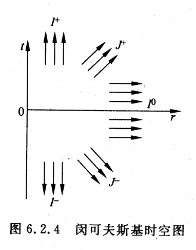
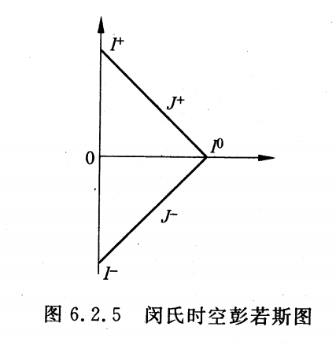
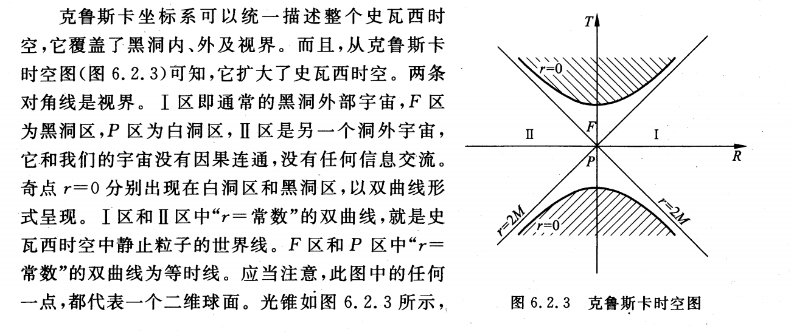
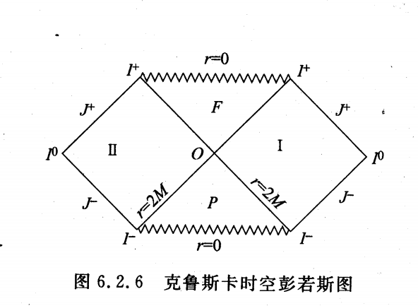

# 基本概念与公式

## 黎曼几何基本物理量

### 张量

#### 标量

$$
\begin{align}
\phi'(x') = \phi(x)
\end{align}
$$

#### 逆变矢量

$$
\begin{align}
\phi'^\mu(x')
=A^\mu_\nu \phi^\nu(x)
\end{align}
$$

#### 协变矢量

$$
\begin{align}
\phi'_\mu(x')
=\bar{A}_\mu^\nu \phi_\nu(x)
\end{align}
$$

#### 张量

$$
\begin{align}
\phi'^{\mu_1\cdots \mu_n}_{\nu_1\cdots \nu_m}(x')
=A^{\mu_1}_{\alpha_1} \cdots A^{\mu_n}_{\alpha_n} \bar{A}_{\nu_1}^{\beta_1} \cdots \bar{A}_{\nu_m}^{\beta_m} \phi^{\alpha_1 \cdots \alpha_n}_{\beta_1\cdots \beta_m}(x)
\end{align}
$$

## 协变微商

### 逆变矢量的协变微商

$$
\begin{align}
\nabla_\mu \phi^\nu(x)
\equiv \partial_\mu \phi^\nu(x) + \Gamma^\nu_{\mu \lambda} \phi^\lambda(x)
\end{align}
$$

### 协变矢量的协变微商

$$
\begin{align}
\nabla_\mu \phi_\nu(x)
=\partial_\mu \phi_\nu(x) - \Gamma^\lambda_{\mu\nu} \phi_\lambda(x)
\end{align}
$$

### 二阶张量的协变微商

### 二阶张量的协变微商

二阶张量的协变微商的具体形式分别为

$$
\begin{align}
\nabla_\mu \phi^{\nu\lambda}
=\partial_\mu \phi^{\nu\lambda} + \Gamma^\nu_{\mu \rho} \phi^{\rho\lambda} + \Gamma^\lambda_{\mu\rho} \phi^{\nu\rho}
\end{align}
$$

$$
\begin{align}
\nabla_\mu \phi_{\nu\lambda}
=\partial_\mu \phi_{\nu\lambda} - \Gamma_{\mu \nu}^\rho \phi_{\rho\lambda} - \Gamma_{\mu\lambda}^\rho \phi_{\nu\rho}
\end{align}
$$

$$
\begin{align}
\nabla_\mu \phi^\nu_\lambda
=\partial_\mu \phi^\nu_\lambda + \Gamma^\nu_{\mu\rho} \phi^\rho_\lambda - \Gamma_{\mu\lambda}^\rho \phi^\nu_\rho
\end{align}
$$

### 联络在坐标变换下的变换规律

联络的变换规律

$$
\begin{align}
\Gamma'^\mu_{\nu\lambda}
=A^\mu_{\alpha} \bar{A}_\nu^{\beta} \bar{A}_\lambda^\gamma \Gamma^\alpha_{\beta\gamma} + A^\mu_\alpha \bar{A}_\nu^\beta \partial_\beta \bar{A}^\alpha_\lambda
\end{align}
$$

### 曲率张量

$$
\begin{align}
R_{\alpha\mu\nu}^\lambda
\equiv \partial_\mu \Gamma^\lambda_{\nu \alpha}  - \partial_\nu \Gamma^\lambda_{\mu \alpha}  + \Gamma^\lambda_{\mu{\beta}} \Gamma^{{\beta}}_{\nu{\alpha}} - \Gamma^\lambda_{\nu{\beta}} \Gamma^{{\beta}}_{\mu{\alpha}}
\end{align}
$$

### 挠率张量

$$
\begin{align}
T^\alpha_{\mu\nu}
\equiv \Gamma_{\mu\nu}^\alpha - \Gamma_{\nu\mu}^\alpha 
\end{align}
$$

### 黎曼联络（克氏符）

由 $\nabla_\lambda g_{\mu\nu}=0 $ 和 $\Gamma_{\mu\nu}^\lambda = \Gamma_{\nu\mu}^\lambda $ 求得的联络 $\Gamma_{\mu\nu}^\lambda $ 称为黎曼联络，也称为克氏符。

可以证明，克氏符的具体表达式为：

$$
\begin{equation}
\Gamma_{\mu\nu}^\sigma
=\frac{1 }{2 } g^{\sigma \lambda}\left(\partial_\mu g_{\lambda \nu} + \partial_\nu g_{\lambda \mu} - \partial_\lambda g_{\mu\nu} \right)
\end{equation}
$$

### 黎曼曲率张量

当曲率张量

$$
\begin{equation}
R^{\lambda}{}_{\sigma\mu\nu}
\end{equation}
$$

中的联络为黎曼联络（克氏符）时，其称为黎曼曲率张量。

$$
\begin{equation}
R^\lambda{}_{\sigma\mu\nu}
=-R^\lambda{}_{\sigma\nu\mu}
\end{equation}
$$

全部协变指标的黎曼曲率张量：

$$
\begin{equation}
R_{\tau\sigma\mu\nu}
\equiv g_{\tau\lambda} R^\lambda{}_{\sigma\mu\nu}
\end{equation}
$$

其满足：

$$
\begin{equation}
R_{\lambda\sigma\mu\nu} = R_{\mu\nu\lambda\sigma}
\end{equation}
$$

$$
\begin{equation}
R_{\lambda\sigma\mu\nu} = -R_{\lambda\sigma\nu\mu}
\end{equation}
$$

$$
\begin{equation}
R_{\lambda\sigma\mu\nu} = -R_{\sigma\lambda\mu\nu}
\end{equation}
$$

$$
\begin{equation}
R_{\lambda\sigma\mu\nu} + R_{\lambda\mu\nu\sigma} + R_{\lambda\nu\sigma\mu} = 0
\end{equation}
$$

### 比安基恒等式

$$
\begin{equation}
\nabla_\lambda R^\rho{}_{\sigma\mu\nu} + \nabla_\mu R^\rho{}_{\sigma\nu\lambda} + \nabla_\nu R^\rho{}_{\sigma\lambda\mu} = 0
\end{equation}
$$

### 里奇张量

$$
\begin{equation}
R_{\sigma\nu}
\equiv R^\lambda{}_{\sigma\lambda\nu}
\end{equation}
$$

### 标曲率

$$
\begin{equation}
R
\equiv g^{\mu\nu} R_{\mu\nu}
\end{equation}
$$

### 爱因斯坦张量

$$
\begin{equation}
G^\mu_\nu
\equiv R^\mu_\nu - \frac{1 }{2 } \delta^\mu_\nu R
\end{equation}
$$

可以证明，混合指标的爱因斯坦张量的协变散度为零：

$$
\begin{equation}
\nabla_\mu G^\mu{}_\nu = 0
\end{equation}
$$

也可以证明：

$$
\begin{equation}
\nabla^\mu G_{\mu\nu} = 0
\end{equation}
$$

$$
\begin{equation}
\nabla_\mu G^{\mu\nu} = 0
\end{equation}
$$

## 解题必背物理量

### 牛顿近似

### 弱场线性近似

### 引力场作用量、拉式密度以及变分

$$
\begin{equation}
I_g
=\int\limits_M L_g \sqrt{-g} \mathrm{d}^4x
=\frac{c^3 }{16\pi G } \int\limits_M R \sqrt{-g} \mathrm{d}^4 x,\quad L_g = \frac{c^3 }{16\pi G } R
\end{equation}
$$

想算 $I_g $ 对度规的变分，要先算 $R\sqrt{-g} $ 对度规的变分。

$$
\begin{equation}
\begin{aligned}
\delta(R \sqrt{-g})
&=\delta\left(g^{\mu\nu} R_{\mu\nu} \sqrt{-g} \right) \\
&=\left(\delta g^{\mu\nu} \right) R_{\mu\nu} \sqrt{-g} + g^{\mu\nu} \left(\delta R_{\mu\nu} \right) \sqrt{-g} + g^{\mu\nu} R_{\mu\nu} \delta\left(\sqrt{-g} \right)
\end{aligned}
\end{equation}
$$

利用Palatini.II公式

$$
\begin{equation}
\sqrt{-g} g^{\mu\nu} \delta R_{\mu\nu}
=\partial_\mu\left(\sqrt{-g}\phi^\mu \right),\quad
\phi^\mu
\equiv g^{\lambda\nu} \delta \Gamma_{\lambda\nu}^\mu - g^{\mu\nu} \delta \Gamma_{\lambda\nu}^\lambda
\end{equation}
$$

以及

$$
\begin{equation}
\delta g 
=g g^{\mu\nu} \delta g_{\mu\nu}
=-g g_{\mu\nu} \delta g^{\mu\nu}
\end{equation}
$$

$$
\begin{equation}
\begin{aligned}
\delta\left(\sqrt{-g} \right)
=-\frac{1 }{2 } \frac{\delta g }{\sqrt{-g} } 
=-\frac{1 }{2 } \frac{-g g_{\mu\nu} \delta g^{\mu\nu} }{\sqrt{-g} } 
=-\frac{1 }{2 } \sqrt{-g} g_{\mu\nu} \delta g^{\mu\nu}
\end{aligned}
\end{equation}
$$

于是有

$$
\begin{equation}
\begin{aligned}
\delta(R \sqrt{-g})
&=\left(\delta g^{\mu\nu} \right) R_{\mu\nu} \sqrt{-g} + g^{\mu\nu} \left(\delta R_{\mu\nu} \right) \sqrt{-g} + g^{\mu\nu} R_{\mu\nu} \delta\left(\sqrt{-g} \right) \\
&=R_{\mu\nu} \sqrt{-g} \delta g^{\mu\nu} + \partial_\mu \left(\sqrt{-g} \phi^\mu \right) - \frac{1 }{2 } \sqrt{-g} R g_{\mu\nu} \delta g^{\mu\nu}
\end{aligned}
\end{equation}
$$

因此引力场作用量对度规的变分为

$$
\begin{equation}
\begin{aligned}
\delta I_g
&=\frac{c^3 }{16\pi G } \int\limits_M \delta\left(R \sqrt{-g} \right) \mathrm{d}^4 x \\
&=\frac{c^3 }{16\pi G } \int\limits_M \left(R_{\mu\nu} \sqrt{-g} \delta g^{\mu\nu} + \partial_\mu \left(\sqrt{-g} \phi^\mu \right) - \frac{1 }{2 } \sqrt{-g} R g_{\mu\nu} \delta g^{\mu\nu} \right) \mathrm{d}^4 x \\
&=\frac{c^3 }{16\pi G } \int\limits_M \left(R_{\mu\nu} - \frac{1 }{2 } g_{\mu\nu} R \right) \left(\delta g^{\mu\nu} \right) \sqrt{-g} \mathrm{d}^4 x \\
\end{aligned}
\end{equation}
$$

### 引力源物质作用量的变分

$$
\begin{equation}
\begin{aligned}
I_m
=\frac{1 }{c } \int\limits_M L_m \sqrt{-g} \mathrm{d}^4 x
\end{aligned}
\end{equation}
$$

假定引力源物质拉式密度 $L_m $ 只含 $g^{\mu\nu} $，而不含 $\partial_\lambda g^{\mu\nu} $，则

$$
\begin{equation}
\begin{aligned}
\delta I_m
&=\frac{1 }{c } \int\limits_M \delta \left(L_m \sqrt{-g} \right) \mathrm{d}^4 x \\
&=\frac{1 }{c } \int\limits_M \frac{\partial \left(L_m \sqrt{-g} \right) }{\partial g^{\mu\nu} } \delta g^{\mu\nu} \mathrm{d}^4 x \\
\end{aligned}
\end{equation}
$$

定义

$$
\begin{equation}
T_{\mu\nu}
\equiv -\frac{2 }{\sqrt{-g} } \frac{\partial \left(L_m \sqrt{-g} \right) }{\partial g^{\mu\nu} },\quad
\frac{\partial \left(L_m \sqrt{-g} \right) }{\partial g^{\mu\nu} }
=-\frac{1 }{2 } \sqrt{-g} T_{\mu\nu}
\end{equation}
$$

则

$$
\begin{equation}
\begin{aligned}
\delta I_m
&=\frac{1 }{c } \int\limits_M \frac{\partial \left(L_m \sqrt{-g} \right) }{\partial g^{\mu\nu} } \delta g^{\mu\nu} \mathrm{d}^4 x \\
&=-\frac{1 }{2c } \int\limits_M T_{\mu\nu} \left(\delta g^{\mu\nu} \right) \sqrt{-g} \mathrm{d}^4 x
\end{aligned}
\end{equation}
$$

## 史瓦西时空类时 $\theta=\pi/2 $ 平面类时测地线方程

以线长 $s $ 为参数，在 $\theta=\pi/2 $ 平面内

$$
\begin{equation}
\frac{\mathrm{d}^2 t }{\mathrm{d}s^2 } + \nu' \frac{\mathrm{d}t }{\mathrm{d}s } \frac{\mathrm{d}r }{\mathrm{d}s } 
=0,\quad \mathrm{or} \quad 
\mathrm{d}s^2 = -c^2\mathrm{e}^\nu \mathrm{d}t^2 + \mathrm{e}^{-\nu}\mathrm{d}r^2 + r^2\mathrm{d}\phi^2
\end{equation}
$$

$$
\begin{equation}
\frac{\mathrm{d}^2 r }{\mathrm{d}s^2 } + \frac{c^2 \nu'}{2 } \mathrm{e}^{2\nu} \left(\frac{\mathrm{d}t }{\mathrm{d}s } \right)^2 - \frac{\nu' }{2 } \left(\frac{\mathrm{d}r }{\mathrm{d}s }  \right)^2 - r\mathrm{e}^\nu \left(\frac{\mathrm{d}\phi }{\mathrm{d}s }  \right)^2
=0
\end{equation}
$$

$$
\begin{equation}
\frac{\mathrm{d}^2 \phi }{\mathrm{d}s^2 } + \frac{2 }{r } \frac{\mathrm{d}r }{\mathrm{d}s } \frac{\mathrm{d}\phi }{\mathrm{d}s } 
=0
\end{equation}
$$

## 史瓦西时空类光 $\theta=\pi/2 $ 平面类光测地线方程

以 $\lambda $ 为参数，在$\theta=\pi/2 $ 平面内

$$
\begin{equation}
\frac{\mathrm{d}^2 t }{\mathrm{d}\lambda^2 } + \nu' \frac{\mathrm{d}t }{\mathrm{d}\lambda } \frac{\mathrm{d}r }{\mathrm{d}\lambda } 
=0,\quad \mathrm{or}\quad
\mathrm{d}s^2
=0
=-c^2\mathrm{e}^\nu \mathrm{d}t^2 + \mathrm{e}^{-\nu}\mathrm{d}r^2 + r^2\mathrm{d}\phi^2
\end{equation}
$$

$$
\begin{equation}
\frac{\mathrm{d}^2 r }{\mathrm{d}\lambda^2 } + \frac{c^2 \nu'}{2 } \mathrm{e}^{2\nu} \left(\frac{\mathrm{d}t }{\mathrm{d}\lambda } \right)^2 - \frac{\nu' }{2 } \left(\frac{\mathrm{d}r }{\mathrm{d}\lambda }  \right)^2 - r\mathrm{e}^\nu \left(\frac{\mathrm{d}\phi }{\mathrm{d}\lambda }  \right)^2
=0
\end{equation}
$$

$$
\begin{equation}
\frac{\mathrm{d}^2 \phi }{\mathrm{d}\lambda^2 } + \frac{2 }{r } \frac{\mathrm{d}r }{\mathrm{d}\lambda } \frac{\mathrm{d}\phi }{\mathrm{d}\lambda } 
=0
\end{equation}
$$

## 方程特解与形式解

### 水星近日点进动

#### $u $ 的方程

$$
\begin{equation}
\frac{\mathrm{d}^2 u }{\mathrm{d}\phi^2 } + u
=\frac{3GM }{c^2 } u^2 + \frac{GM }{h^2 } 
\end{equation}
$$

#### $u_0 $ 的方程

$$
\begin{equation}
\frac{\mathrm{d}^2 u_0 }{\mathrm{d}\phi^2 } +u_0
=\frac{GM }{h^2 } 
\end{equation}
$$

其解为

$$
\begin{equation}
u_0
=\frac{1 }{p } \left(1+e\cos\phi \right),\quad
p
=\frac{h^2 }{GM }
\end{equation}
$$

#### $u_1 $ 的方程

令 $\alpha=3GM/c^2 $，则

$$
\begin{equation}
\frac{\mathrm{d}^2 u }{\mathrm{d}\phi^2 } + u
=\alpha u^2 + \frac{GM }{h^2 } 
\end{equation}
$$

设 $u=u_0+\alpha u_1 $，则

$$
\begin{equation}
\frac{\mathrm{d}^2u_0 }{\mathrm{d}\phi^2 } +u_0 + \alpha \frac{\mathrm{d}^2u_1 }{\mathrm{d}\phi^2 } +\alpha u_1
=\alpha\left(u_0+\alpha u_1 \right)^2 + \frac{GM }{h^2 } 
\end{equation}
$$

利用 $u_0 $ 满足的方程就得到

$$
\begin{equation}
\alpha \frac{\mathrm{d}^2u_1 }{\mathrm{d}\phi^2 } +\alpha u_1
=\alpha\left(u_0+\alpha u_1 \right)^2
\end{equation}
$$

由于 $\alpha $ 是个小量，约去右边括号内的高阶小量，再利用 $u_0 $ 的表达式，就得到

$$
\begin{equation}
\frac{\mathrm{d}^2u_1 }{\mathrm{d}\phi^2 } + u_1
=u_0^2
=\frac{\left(1+e\cos\phi \right)^2 }{p^2 } 
=\frac{1 }{p^2 } \left[\left(1+\frac{e^2 }{2 }  \right) + 2e\cos\phi + \frac{e^2 }{2 } \cos 2\phi \right]
\end{equation}
$$

#### $u $ 的解

设 $u_1 $ 的形式解为

$$
\begin{equation}
u_1 = A + B \phi\sin\phi + C \cos 2\phi
\end{equation}
$$

$$
\begin{equation}
u_1
=\frac{1 }{p^2 } \left(1+\frac{e^2 }{2 }  \right) + \frac{e }{p^2 } \phi\sin\phi - \frac{e^2 }{6p^2 } \cos2\phi
\end{equation}
$$

$$
\begin{equation}
u
=u_0 + \alpha u_1
=\frac{1 }{p } \left[\left(1+e\cos\phi \right) + \frac{\alpha }{p } \left(1+\frac{e^2 }{2 }  \right) + \frac{\alpha e }{p } \phi\sin\phi - \frac{1 }{6 } \frac{\alpha e^2 }{p^2 } \cos2\phi \right]
\end{equation}
$$

上面只有 $\phi\sin\phi $ 项是累加的，只保留对轨道有长期影响的项：

$$
\begin{equation}
u
=\frac{1 }{p } \left[\left(1+e\cos\phi \right) + \frac{\alpha e }{p } \phi\sin\phi \right]
\end{equation}
$$

由于 $\alpha $ 是小量，则

$$
\begin{equation}
1 \approx \cos\left(\frac{\alpha }{p } \phi \right),\quad
\frac{\alpha }{p } \phi \approx \sin \left(\frac{\alpha }{p } \phi \right)
\end{equation}
$$

于是

$$
\begin{equation}
\begin{aligned}
u
&=\frac{1 }{p } \left[\left(1+e\cos\phi \right) + \frac{\alpha e }{p } \phi\sin\phi \right] \\
&=\frac{1 }{p } \left[1 + e\left(1\cdot \cos \phi + \frac{\alpha }{p } \phi \sin\phi \right) \right] \\
&\approx \frac{1 }{p } \left[1 + e\left(\cos\left(\frac{\alpha }{p } \phi \right) \cos \phi + \sin\left(\frac{\alpha }{p } \phi \right) \sin\phi \right) \right] \\
&=\frac{1 }{p } \left[1 + \cos\left(\left(1-\frac{\alpha }{p } \right)\phi \right) \right] \\
&\equiv \frac{1 }{p } \left(1 + e\cos \Phi \right)
\end{aligned}
\end{equation}
$$

### 光线偏折

#### $u $ 的方程

$$
\begin{equation}
\frac{\mathrm{d}^2 u }{\mathrm{d}\phi^2 } + u
=\frac{3GM }{c^2 } u^2
=\alpha u^2
\end{equation}
$$

设

$$
\begin{equation}
u = u_0 + \alpha u_1
\end{equation}
$$

#### $u_0 $ 的方程

$$
\begin{equation}
\frac{\mathrm{d}^2 u_0 }{\mathrm{d}\phi^2 } + u_0
=0 \Longrightarrow
u_0 = \frac{1 }{b } \sin\phi
\end{equation}
$$

#### $u_1 $ 的方程

$$
\begin{equation}
\frac{\mathrm{d}^2 u_0 }{\mathrm{d}\phi^2 } + u_0 + \alpha \left(\frac{\mathrm{d}^2 u_1 }{\mathrm{d}\phi^2 } + u_1 \right)
=\alpha \left(u_0 + \alpha u_1 \right)^2
\end{equation}
$$

也即

$$
\begin{equation}
\frac{\mathrm{d}^2 u_1 }{\mathrm{d}\phi^2 } + u_1
=\left(u_0 + \alpha u_1 \right)^2
\approx u_0^2
=\frac{1 }{b^2 } \sin^2\phi
\end{equation}
$$

设 $u_1 $ 的形式解为

$$
\begin{equation}
u_1
=A \sin^2\phi + B
\end{equation}
$$

#### $u $ 的解

$$
\begin{equation}
u_1
=A \sin^2\phi + B
=-\frac{1 }{3b^2 } \left(\sin^2\phi - 2 \right)
=\frac{1 }{3b^2 } \left(\cos^2\phi + 1 \right)
\end{equation}
$$

$$
\begin{equation}
\begin{aligned}
u
&=u_0 + \alpha u_1
=\frac{1 }{b } \sin\phi + \frac{\alpha }{3b^2 } \left(\cos^2\phi + 1 \right) \\
&=\frac{1 }{b } \sin\phi + \frac{GM }{c^2 b^2 } \left(\cos^2\phi + 1 \right)
\end{aligned}
\end{equation}
$$

# 重点题目

## 张量在坐标变换下的变换规律

## 最小作用量原理推导场方程

总作用量

$$
\begin{equation}
I = I_g + I_m
\end{equation}
$$

其中 $I_g $ 是引力场作用量，$I_m $ 是引力源物质作用量。

$$
\begin{equation}
I_g
=\int\limits_M L_g \sqrt{-g} \mathrm{d}^4x
=\frac{c^3 }{16\pi G } \int\limits_M R \sqrt{-g} \mathrm{d}^4 x,\quad L_g = \frac{c^3 }{16\pi G } R
\end{equation}
$$

想算 $I_g $ 对度规的变分，要先算 $R\sqrt{-g} $ 对度规的变分。

$$
\begin{equation}
\begin{aligned}
\delta(R \sqrt{-g})
&=\delta\left(g^{\mu\nu} R_{\mu\nu} \sqrt{-g} \right) \\
&=\left(\delta g^{\mu\nu} \right) R_{\mu\nu} \sqrt{-g} + g^{\mu\nu} \left(\delta R_{\mu\nu} \right) \sqrt{-g} + g^{\mu\nu} R_{\mu\nu} \delta\left(\sqrt{-g} \right)
\end{aligned}
\end{equation}
$$

利用Palatini.II公式

$$
\begin{equation}
\sqrt{-g} g^{\mu\nu} \delta R_{\mu\nu}
=\partial_\mu\left(\sqrt{-g}\phi^\mu \right),\quad
\phi^\mu
\equiv g^{\lambda\nu} \delta \Gamma_{\lambda\nu}^\mu - g^{\mu\nu} \delta \Gamma_{\lambda\nu}^\lambda
\end{equation}
$$

以及

$$
\begin{equation}
\delta g 
=g g^{\mu\nu} \delta g_{\mu\nu}
=-g g_{\mu\nu} \delta g^{\mu\nu}
\end{equation}
$$

$$
\begin{equation}
\begin{aligned}
\delta\left(\sqrt{-g} \right)
=-\frac{1 }{2 } \frac{\delta g }{\sqrt{-g} } 
=-\frac{1 }{2 } \frac{-g g_{\mu\nu} \delta g^{\mu\nu} }{\sqrt{-g} } 
=-\frac{1 }{2 } \sqrt{-g} g_{\mu\nu} \delta g^{\mu\nu}
\end{aligned}
\end{equation}
$$

于是有

$$
\begin{equation}
\begin{aligned}
\delta(R \sqrt{-g})
&=\left(\delta g^{\mu\nu} \right) R_{\mu\nu} \sqrt{-g} + g^{\mu\nu} \left(\delta R_{\mu\nu} \right) \sqrt{-g} + g^{\mu\nu} R_{\mu\nu} \delta\left(\sqrt{-g} \right) \\
&=R_{\mu\nu} \sqrt{-g} \delta g^{\mu\nu} + \partial_\mu \left(\sqrt{-g} \phi^\mu \right) - \frac{1 }{2 } \sqrt{-g} R g_{\mu\nu} \delta g^{\mu\nu}
\end{aligned}
\end{equation}
$$

因此引力场作用量对度规的变分为

$$
\begin{equation}
\begin{aligned}
\delta I_g
&=\frac{c^3 }{16\pi G } \int\limits_M \delta\left(R \sqrt{-g} \right) \mathrm{d}^4 x \\
&=\frac{c^3 }{16\pi G } \int\limits_M \left(R_{\mu\nu} \sqrt{-g} \delta g^{\mu\nu} + \partial_\mu \left(\sqrt{-g} \phi^\mu \right) - \frac{1 }{2 } \sqrt{-g} R g_{\mu\nu} \delta g^{\mu\nu} \right) \mathrm{d}^4 x \\
&=\frac{c^3 }{16\pi G } \int\limits_M \left(R_{\mu\nu} - \frac{1 }{2 } g_{\mu\nu} R \right) \left(\delta g^{\mu\nu} \right) \sqrt{-g} \mathrm{d}^4 x \\
\end{aligned}
\end{equation}
$$

接下来还需要引力源物质作用量对度规的变分。

$$
\begin{equation}
\begin{aligned}
I_m
=\frac{1 }{c } \int\limits_M L_m \sqrt{-g} \mathrm{d}^4 x
\end{aligned}
\end{equation}
$$

假定引力源物质拉式密度 $L_m $ 只含 $g^{\mu\nu} $，而不含 $\partial_\lambda g^{\mu\nu} $，则

$$
\begin{equation}
\begin{aligned}
\delta I_m
&=\frac{1 }{c } \int\limits_M \delta \left(L_m \sqrt{-g} \right) \mathrm{d}^4 x \\
&=\frac{1 }{c } \int\limits_M \frac{\partial \left(L_m \sqrt{-g} \right) }{\partial g^{\mu\nu} } \delta g^{\mu\nu} \mathrm{d}^4 x \\
\end{aligned}
\end{equation}
$$

定义

$$
\begin{equation}
T_{\mu\nu}
\equiv -\frac{2 }{\sqrt{-g} } \frac{\partial \left(L_m \sqrt{-g} \right) }{\partial g^{\mu\nu} },\quad
\frac{\partial \left(L_m \sqrt{-g} \right) }{\partial g^{\mu\nu} }
=-\frac{1 }{2 } \sqrt{-g} T_{\mu\nu}
\end{equation}
$$

则

$$
\begin{equation}
\begin{aligned}
\delta I_m
&=\frac{1 }{c } \int\limits_M \frac{\partial \left(L_m \sqrt{-g} \right) }{\partial g^{\mu\nu} } \delta g^{\mu\nu} \mathrm{d}^4 x \\
&=-\frac{1 }{2c } \int\limits_M T_{\mu\nu} \left(\delta g^{\mu\nu} \right) \sqrt{-g} \mathrm{d}^4 x
\end{aligned}
\end{equation}
$$

最小作用量原理说，$\delta I=0 $ 给出体系的运动方程，也即

$$
\begin{equation}
\begin{aligned}
0
&=\delta I
=\delta I_g + \delta I_m
=\frac{c^3 }{16\pi G } \int\limits_M \left(R_{\mu\nu} - \frac{1 }{2 } g_{\mu\nu} R \right) \left(\delta g^{\mu\nu} \right) \sqrt{-g} \mathrm{d}^4 x -\frac{1 }{2c } \int\limits_M T_{\mu\nu} \left(\delta g^{\mu\nu} \right) \sqrt{-g} \mathrm{d}^4 x \\
&=\frac{c^3 }{16\pi G } \int\limits_M \left(R_{\mu\nu} - \frac{1 }{2 } g_{\mu\nu} R - \frac{8\pi G }{c^4 } T_{\mu\nu} \right) \left(\delta g^{\mu\nu} \right) \sqrt{-g} \mathrm{d}^4 x
\end{aligned}
\end{equation}
$$

最终得到爱因斯坦引力场方程：

$$
\begin{equation}
R_{\mu\nu} - \frac{1 }{2 } g_{\mu\nu} R = \frac{8\pi G }{c^4 } T_{\mu\nu}
\end{equation}
$$

## Kruskal图与Penrose图

闵氏时空线元

$$
\begin{equation}
\mathrm{d}s^2
=-c^2\mathrm{d}t^2 + \mathrm{d}r^2 + r^2\left(\mathrm{d}\theta^2 + \sin^2\theta\mathrm{d}\phi^2 \right)
\end{equation}
$$

类光测地线满足

$$
\begin{equation}
\mathrm{d}s^2 = 0
\end{equation}
$$

如果只考虑径向，则

$$
\begin{equation}
-c^2 \mathrm{d}t^2 + \mathrm{d}r^2 = 0
\end{equation}
$$

取 $c=1 $，则

$$
\begin{equation}
\left(\frac{\mathrm{d}t }{\mathrm{d}r }  \right)^2
=1,\quad
\frac{\mathrm{d}t }{\mathrm{d}r } = \pm 1,
\end{equation}
$$

径向类光测地线为

$$
\begin{equation}
t = \pm r + \mathrm{const}
\end{equation}
$$

史瓦西时空线元

$$
\begin{equation}
\mathrm{d}s^2
=-c^2 \left(1-\frac{2GM }{c^2 r }  \right)\mathrm{d}t^2 + \left(1-\frac{2GM }{c^2 r}  \right)^{-1} \mathrm{d}r^2 + r^2\left(\mathrm{d}\theta^2 + \sin^2\theta\mathrm{d}\phi^2 \right)
\end{equation}
$$

如果只考虑径向，并取 $c=G=1 $，则

$$
\begin{equation}
\mathrm{d}s^2
=-\left(1-\frac{2M }{r }  \right)\mathrm{d}t^2 + \left(1-\frac{2M }{r }  \right)^{-1} \mathrm{d}r^2
\end{equation}
$$

类光测地线满足

$$
\begin{equation}
\mathrm{d}s^2 = 0
\end{equation}
$$

即

$$
\begin{equation}
\left(\frac{\mathrm{d}t }{\mathrm{d}r }  \right)^2
=\left(1-\frac{2M }{r }  \right)^{-2},\quad
\frac{\mathrm{d}t }{\mathrm{d}r }
=\pm \left(1-\frac{2M }{r }  \right)^{-1}
\end{equation}
$$

$$
\begin{equation}
\mathrm{d}t
=\pm \frac{1 }{1-2M/r } \mathrm{d}r
=\pm \frac{r }{r-2M } \mathrm{d}r
=\pm \frac{r-2M + 2M }{r-2M } \mathrm{d}r
=\pm\left(1 + \frac{2M }{r-2M }  \right)\mathrm{d}(r-2M)
\end{equation}
$$

两边积分得

$$
\begin{equation}
t = \pm \left(r + 2M\ln\left|r-2M \right| \right) + \mathrm{const}
\end{equation}
$$

史瓦西时空径向线元：

$$
\begin{equation}
\mathrm{d}s^2
=-\left(1-2M/r \right) \mathrm{d}t^2 + \left(1-2M/r \right)^{-1} \mathrm{d}r^2
\end{equation}
$$

考虑坐标变换

$$
\left\{
\begin{aligned}
&T = 4M\left(\frac{r }{2M } -1 \right)^{1/2} \mathrm{e}^{\frac{r }{4M } } \sinh\left(\frac{t }{4M }  \right) \\
&R = 4M\left(\frac{r }{2M } -1 \right)^{1/2} \mathrm{e}^{\frac{r }{4M } } \cosh\left(\frac{t }{4M }  \right)
\end{aligned}
\right.,r>2M,\mathrm{I}
$$

$$
\left\{
\begin{aligned}
&T = -4M\left(\frac{r }{2M } -1 \right)^{1/2} \mathrm{e}^{\frac{r }{4M } } \sinh\left(\frac{t }{4M }  \right) \\
&R = -4M\left(\frac{r }{2M } -1 \right)^{1/2} \mathrm{e}^{\frac{r }{4M } } \cosh\left(\frac{t }{4M }  \right)
\end{aligned}
\right.,r>2M,\mathrm{II}
$$

$$
\left\{
\begin{aligned}
&T = 4M\left(1 - \frac{r }{2M } \right)^{1/2} \mathrm{e}^{\frac{r }{4M } } \cosh\left(\frac{t }{4M }  \right) \\
&R = 4M\left(1 - \frac{r }{2M } \right)^{1/2} \mathrm{e}^{\frac{r }{4M } } \sinh\left(\frac{t }{4M }  \right)
\end{aligned}
\right.,r<2M,F
$$

$$
\left\{
\begin{aligned}
&T = -4M\left(1 - \frac{r }{2M } \right)^{1/2} \mathrm{e}^{\frac{r }{4M } } \cosh\left(\frac{t }{4M }  \right) \\
&R = -4M\left(1 - \frac{r }{2M } \right)^{1/2} \mathrm{e}^{\frac{r }{4M } } \sinh\left(\frac{t }{4M }  \right)
\end{aligned}
\right.,r<2M,P
$$

Kruskal坐标下的线元：

$$
\begin{equation}
\mathrm{d}s^2
=\frac{2M }{r } \mathrm{e}^{-r/2M} \left(-\mathrm{d}T^2 + \mathrm{d}R^2 \right) + r^2\left(\mathrm{d}\theta^2 + \sin^2\theta\mathrm{d}\phi^2 \right)
\end{equation}
$$

$r $ 与 $R,T $ 的关系：

$$
\begin{equation}
R^2 - T^2 = 16 M^2 \left(\frac{r }{2M } -1 \right) \mathrm{e}^{r/2M}
\end{equation}
$$

> 上式对四个区域都成立。

Kruskal坐标消除了度规分量在引力半径处的奇异性，但无法消除 $r=0 $ 的奇点。

Kruskal度规具有最大解析区和最高完备性。

- 类时未来无穷远 $I^+: $ $r $ 有限，$t\to +\infty $

- 类时过去无穷远 $I^-: $ $r $ 有限，$t\to -\infty $

- 类空无穷远 $I^0: $ $t $ 有限，$r\to +\infty $

- 类光未来无穷远 $J^+: $ $(t-r) $ 有限，$(t+r)\to +\infty $

- 类光过去无穷远 $J^-: $ $(t+r) $ 有限，$(t-r)\to +\infty $ 

  

  

  

  

## 水星近日点进动

考虑史瓦西时空，以线长 $s $ 为参数，在 $\theta=\pi/2 $ 平面内

$$
\begin{equation}
\frac{\mathrm{d}^2 t }{\mathrm{d}s^2 } + \nu' \frac{\mathrm{d}t }{\mathrm{d}s } \frac{\mathrm{d}r }{\mathrm{d}s } 
=0,\quad \mathrm{or} \quad 
\mathrm{d}s^2 = -c^2\mathrm{e}^\nu \mathrm{d}t^2 + \mathrm{e}^{-\nu}\mathrm{d}r^2 + r^2\mathrm{d}\phi^2
\end{equation}
$$

$$
\begin{equation}
\frac{\mathrm{d}^2 r }{\mathrm{d}s^2 } + \frac{c^2 \nu'}{2 } \mathrm{e}^{2\nu} \left(\frac{\mathrm{d}t }{\mathrm{d}s } \right)^2 - \frac{\nu' }{2 } \left(\frac{\mathrm{d}r }{\mathrm{d}s }  \right)^2 - r\mathrm{e}^\nu \left(\frac{\mathrm{d}\phi }{\mathrm{d}s }  \right)^2
=0
\end{equation}
$$

$$
\begin{equation}
\frac{\mathrm{d}^2 \phi }{\mathrm{d}s^2 } + \frac{2 }{r } \frac{\mathrm{d}r }{\mathrm{d}s } \frac{\mathrm{d}\phi }{\mathrm{d}s } 
=0
\end{equation}
$$

注意到上面第三条方程

$$
\begin{equation}
\frac{\mathrm{d}^2 \phi }{\mathrm{d}s^2 } + \frac{2 }{r } \frac{\mathrm{d}r }{\mathrm{d}s } \frac{\mathrm{d}\phi }{\mathrm{d}s } 
=0,\quad
r^2\frac{\mathrm{d}^2 \phi }{\mathrm{d}s^2 } + 2r \frac{\mathrm{d}r }{\mathrm{d}s } \frac{\mathrm{d}\phi }{\mathrm{d}s } 
=0,\quad
r^2 \frac{\mathrm{d} }{\mathrm{d}s }  \frac{\mathrm{d} \phi }{\mathrm{d}s } + \frac{\mathrm{d}\left(r^2 \right) }{\mathrm{d}s } \frac{\mathrm{d}\phi }{\mathrm{d}s } 
=0
\end{equation}
$$

也即

$$
\begin{equation}
\frac{\mathrm{d} }{\mathrm{d}s } \left(r^2 \frac{\mathrm{d}\phi }{\mathrm{d}s }  \right)
=0
\end{equation}
$$

因此

$$
\begin{equation}
r^2 \frac{\mathrm{d}\phi }{\mathrm{d}s } = \mathrm{const} \equiv \frac{h }{c } 
\end{equation}
$$

这是 GR 中的角动量守恒。

我们要找轨道方程，因此需要找到 $r,\phi $ 的微分方程。

由于 $\theta=\pi/2 $，则线元

$$
\begin{equation}
\mathrm{d}s^2
=-c^2 \mathrm{e}^\nu \mathrm{d}t^2 + \mathrm{e}^{-\nu}\mathrm{d}r^2 + r^2\left(\mathrm{d}\theta^2 +\sin^2\theta\mathrm{d}\phi^2 \right),\quad
\mathrm{e}^\nu
=1-\frac{2GM }{c^2 r } 
\end{equation}
$$

可化简为

$$
\begin{equation}
\mathrm{d}s^2
=-c^2 \mathrm{e}^\nu \mathrm{d}t^2 + \mathrm{e}^{-\nu}\mathrm{d}r^2 + r^2\mathrm{d}\phi^2
\end{equation}
$$

利用线元 $\mathrm{d}s^2 $ 与线长 $\mathrm{d}s $ 的关系

$$
\begin{equation}
\mathrm{d}s
=\sqrt{-\mathrm{d}s^2},\quad
\left(\mathrm{d}s \right)^2
=-\mathrm{d}s^2
=c^2 \mathrm{e}^\nu \mathrm{d}t^2 - \mathrm{e}^{-\nu}\mathrm{d}r^2 - r^2\mathrm{d}\phi^2
\end{equation}
$$

两边同除 $\left(\mathrm{d}s \right)^2 $，再同乘 $\mathrm{e}^\nu $，得到

$$
\begin{equation}
\left(\frac{\mathrm{d}r }{\mathrm{d}s }  \right)^2
=c^2 \mathrm{e}^{2\nu} \left(\frac{\mathrm{d}t }{\mathrm{d}s }  \right)^2 - r^2 \mathrm{e}^\nu \left(\frac{\mathrm{d}\phi }{\mathrm{d}s }  \right)^2 - \mathrm{e}^\nu
\end{equation}
$$

上式代入 $r $ 关于 $s $ 的二阶偏微分方程，就消去 $t $：

$$
\begin{equation}
\frac{\mathrm{d}^2 r }{\mathrm{d}s^2 } + \frac{\nu' }{2 } \mathrm{e}^\nu r^2 \left(\frac{\mathrm{d} \phi}{\mathrm{d}s }  \right)^2 - r\mathrm{e}^\nu \left(\frac{\mathrm{d}\phi }{\mathrm{d}s }  \right)^2 + \frac{1 }{2 } \nu' \mathrm{e}^\nu
=0
\end{equation}
$$

$$
\begin{equation}
\frac{\mathrm{d}^2 r }{\mathrm{d}s^2 } + \left(\frac{1 }{2 } r^2 \nu' \mathrm{e}^\nu - r \mathrm{e}^\nu  \right) \left(\frac{\mathrm{d} \phi}{\mathrm{d}s }  \right)^2 + \frac{1 }{2 } \nu' \mathrm{e}^\nu
=0
\end{equation}
$$

这就是GR中参数形式的行星轨道方程。

利用 GR 中的角动量守恒

$$
\begin{equation}
r^2 \frac{\mathrm{d}\phi }{\mathrm{d}s } 
=\frac{h }{c } ,\quad
\frac{\mathrm{d}\phi }{\mathrm{d}s } = \frac{h }{cr^2 } 
\end{equation}
$$

进一步化简为

$$
\begin{equation}
\frac{\mathrm{d}^2 r }{\mathrm{d}s^2 } + \left(\frac{\nu' }{2 } r^2 - r \right)\mathrm{e}^\nu \left(\frac{h }{c r^2 }  \right)^2 + \frac{1 }{2 } \nu' \mathrm{e}^\nu
=0
\end{equation}
$$

$$
\begin{equation}
\frac{\mathrm{d}^2 r }{\mathrm{d}s^2 } + \frac{1 }{2 } \nu' \mathrm{e}^\nu \left(\frac{h^2 }{c^2 r^2}  + 1 \right) - r\mathrm{e}^\nu \left(\frac{h }{c r^2 } \right)^2
=0
\end{equation}
$$

令 $u=\frac{1 }{r }  $，注意到

$$
\begin{equation}
\mathrm{e}^\nu = 1 - \frac{2GM }{c^2 r } = 1 - \frac{2GM }{c^2 } u
\end{equation}
$$

$$
\begin{equation}
\nu' \mathrm{e}^\nu = \left(\mathrm{e}^\nu \right)'
=\frac{2GM }{c^2 r^2}
=\frac{2GM }{c^2 } u^2 
\end{equation}
$$

$$
\begin{equation}
\frac{\mathrm{d}\phi }{\mathrm{d}s } 
=\frac{h }{cr^2 }
=\frac{h }{c } u^2
\end{equation}
$$

$$
\begin{equation}
\frac{\mathrm{d} }{\mathrm{d}s } 
=\frac{\mathrm{d}\phi }{\mathrm{d}s } \frac{\mathrm{d} }{\mathrm{d}\phi } 
=\frac{h }{c } u^2 \frac{\mathrm{d} }{\mathrm{d}\phi } 
\end{equation}
$$

$$
\begin{equation}
\begin{aligned}
\frac{\mathrm{d}^2 r }{\mathrm{d}s } 
&=\frac{\mathrm{d} }{\mathrm{d}s } \left(\frac{\mathrm{d}(1/u) }{\mathrm{d}s }  \right)
=\frac{\mathrm{d} }{\mathrm{d}s } \left(-\frac{1 }{u^2 } \frac{\mathrm{d}u }{\mathrm{d}s }  \right)
=\frac{\mathrm{d} }{\mathrm{d}s } \left[-\frac{1 }{u^2 } \cdot \left(\frac{h }{c } u^2 \frac{\mathrm{d} u}{\mathrm{d}\phi }  \right) \right] \\
&=-\frac{h }{c } \frac{\mathrm{d} }{\mathrm{d}s } \left(\frac{\mathrm{d}u }{\mathrm{d}\phi }  \right) 
=-\frac{h }{c } \cdot \frac{h }{c } u^2 \frac{\mathrm{d} }{\mathrm{d}\phi } \left(\frac{\mathrm{d}u }{\mathrm{d}\phi }  \right) \\
&=-\frac{h^2 }{c^2 } u^2 \frac{\mathrm{d}^2 u }{\mathrm{d}\phi^2 } 
\end{aligned}
\end{equation}
$$

于是轨道的参数方程就化为如下的轨道方程：

$$
\begin{equation}
\frac{\mathrm{d}^2 u }{\mathrm{d}\phi^2 } + u
=\frac{3GM }{c^2 } u^2 + \frac{GM }{h^2 } 
\end{equation}
$$

上式就是GR中的Binet方程。

设 $u_0 $ 满足牛顿力学中的Binet方程

$$
\begin{equation}
\frac{\mathrm{d}^2 u_0 }{\mathrm{d}\phi^2 } +u_0
=\frac{GM }{h^2 } 
\end{equation}
$$

其解为

$$
\begin{equation}
u_0
=\frac{1 }{p } \left(1+e\cos\phi \right),\quad
p
=\frac{h^2 }{GM }
\end{equation}
$$

令 $\alpha=3GM/c^2 $，则

$$
\begin{equation}
\frac{\mathrm{d}^2 u }{\mathrm{d}\phi^2 } + u
=\alpha u^2 + \frac{GM }{h^2 } 
\end{equation}
$$

设 $u=u_0+\alpha u_1 $，则

$$
\begin{equation}
\frac{\mathrm{d}^2u_0 }{\mathrm{d}\phi^2 } +u_0 + \alpha \frac{\mathrm{d}^2u_1 }{\mathrm{d}\phi^2 } +\alpha u_1
=\alpha\left(u_0+\alpha u_1 \right)^2 + \frac{GM }{h^2 } 
\end{equation}
$$

利用 $u_0 $ 满足的方程就得到

$$
\begin{equation}
\alpha \frac{\mathrm{d}^2u_1 }{\mathrm{d}\phi^2 } +\alpha u_1
=\alpha\left(u_0+\alpha u_1 \right)^2
\end{equation}
$$

由于 $\alpha $ 是个小量，约去右边括号内的高阶小量，再利用 $u_0 $ 的表达式，就得到

$$
\begin{equation}
\frac{\mathrm{d}^2u_1 }{\mathrm{d}\phi^2 } + u_1
=u_0^2
=\frac{\left(1+e\cos\phi \right)^2 }{p^2 } 
=\frac{1 }{p^2 } \left[\left(1+\frac{e^2 }{2 }  \right) + 2e\cos\phi + \frac{e^2 }{2 } \cos 2\phi \right]
\end{equation}
$$

设 $u_1 $ 的形式解为

$$
\begin{equation}
u_1 = A + B \phi\sin\phi + C \cos 2\phi
\end{equation}
$$

$$
\begin{equation}
\frac{\mathrm{d}u_1 }{\mathrm{d}\phi } 
=B\left(\sin\phi + \phi\cos\phi \right) - 2C\sin2\phi
\end{equation}
$$

$$
\begin{equation}
\frac{\mathrm{d}^2u_1 }{\mathrm{d}\phi^2 } 
=B\left(2\cos\phi - \phi\sin\phi \right) - 4C\cos2\phi
\end{equation}
$$

代回方程得到

$$
\begin{equation}
B\left(2\cos\phi - \phi\sin\phi \right) -4C\cos2\phi + A + B\phi\sin\phi + C\cos2\phi
=\frac{1 }{p^2 } \left[\left(1+\frac{e^2 }{2 }  \right) + 2e\cos\phi + \frac{e^2 }{2 } \cos 2\phi \right]
\end{equation}
$$

对比各项前的系数就得到

$$
\begin{equation}
A = \frac{1 }{p^2 } \left(1+\frac{e^2 }{2 }  \right),\quad
B = \frac{e }{p^2 } ,\quad
C = -\frac{e^2 }{6p^2 } 
\end{equation}
$$

因此

$$
\begin{equation}
u_1
=\frac{1 }{p^2 } \left(1+\frac{e^2 }{2 }  \right) + \frac{e }{p^2 } \phi\sin\phi - \frac{e^2 }{6p^2 } \cos2\phi
\end{equation}
$$

$$
\begin{equation}
u
=u_0 + \alpha u_1
=\frac{1 }{p } \left[\left(1+e\cos\phi \right) + \frac{\alpha }{p } \left(1+\frac{e^2 }{2 }  \right) + \frac{\alpha e }{p } \phi\sin\phi - \frac{1 }{6 } \frac{\alpha e^2 }{p^2 } \cos2\phi \right]
\end{equation}
$$

上面只有 $\phi\sin\phi $ 项是累加的，只保留对轨道有长期影响的项：

$$
\begin{equation}
u
=\frac{1 }{p } \left[\left(1+e\cos\phi \right) + \frac{\alpha e }{p } \phi\sin\phi \right]
\end{equation}
$$

由于 $\alpha $ 是小量，则

$$
\begin{equation}
1 \approx \cos\left(\frac{\alpha }{p } \phi \right),\quad
\frac{\alpha }{p } \phi \approx \sin \left(\frac{\alpha }{p } \phi \right)
\end{equation}
$$

于是

$$
\begin{equation}
\begin{aligned}
u
&=\frac{1 }{p } \left[\left(1+e\cos\phi \right) + \frac{\alpha e }{p } \phi\sin\phi \right] \\
&=\frac{1 }{p } \left[1 + e\left(1\cdot \cos \phi + \frac{\alpha }{p } \phi \sin\phi \right) \right] \\
&\approx \frac{1 }{p } \left[1 + e\left(\cos\left(\frac{\alpha }{p } \phi \right) \cos \phi + \sin\left(\frac{\alpha }{p } \phi \right) \sin\phi \right) \right] \\
&=\frac{1 }{p } \left[1 + \cos\left(\left(1-\frac{\alpha }{p } \right)\phi \right) \right] \\
&\equiv \frac{1 }{p } \left(1 + e\cos \Phi \right)
\end{aligned}
\end{equation}
$$

$$
\begin{equation}
\Phi
\equiv \left(1-\frac{\alpha }{p }  \right) \phi
\end{equation}
$$

当 $\Phi=\Phi_n=(2n+1)\pi $ 时，$\cos\Phi=-1 $，此时 $u $ 最小，$r $ 最大，相应 $\phi_n $ 为

$$
\begin{equation}
\phi_n
=\frac{\Phi_n }{1-\alpha/p } 
\approx \Phi_n \left(1 + \frac{\alpha }{p }  \right)
\end{equation}
$$

$$
\begin{equation}
\phi_{n+1} 
\approx \Phi_{n+1}\left(1+\frac{\alpha }{p }  \right)
\end{equation}
$$

于是

$$
\begin{equation}
\phi_{n+1} - \phi_n
=2\pi \left(1+\frac{\alpha }{p }  \right)
\end{equation}
$$

一周期进动角为

$$
\begin{equation}
\Delta
=\phi_{n+1} - \phi_n - 2\pi
=2\pi \frac{\alpha }{p } 
=\frac{6\pi GM }{c^2 p } 
\end{equation}
$$

由

$$
\begin{equation}
T^2
=\frac{4\pi^2 }{GM } a^3,\quad
GM
=4\pi^2 \frac{a^3 }{T^2 } ,\quad
p
=a\left(1-e^2 \right)
\end{equation}
$$

可得

$$
\begin{equation}
\Delta
=\frac{24\pi^3 a^2}{c^2 T^2\left(1-e^2 \right) } 
\end{equation}
$$

对于水星，其世纪进动角为

$$
\begin{equation}
\Delta_c\approx 43''
\end{equation}
$$

## 光线偏折

对于光有 $\mathrm{d}s^2=0 $，因此测地线方程不能以线长 $s $ 为参数。但可引入参数 $\lambda $ 来定义光线的切矢：

$$
\begin{equation}
K^\mu
\equiv \frac{\mathrm{d}x^\mu }{\mathrm{d}\lambda } 
\end{equation}
$$

由于 $\mathrm{d}s^2=0 $ 可得

$$
\begin{equation}
g_{\mu\nu} K^\mu K^\nu = 0
\end{equation}
$$

假设切矢 $K^\mu $ 在光的传播路线上是平行的，即

$$
\begin{equation}
\nabla_\mu K^\sigma = 0,\quad
K^\mu \nabla_\mu K^\sigma = 0
\end{equation}
$$

也即

$$
\begin{equation}
K^\mu \left(\partial_\mu K^\sigma + \Gamma^\sigma_{\mu \nu} K^\nu \right)
=0
\end{equation}
$$

又

$$
\begin{equation}
K^\mu \partial_\mu K^\sigma
=\frac{\mathrm{d}x^\mu }{\mathrm{d}\lambda } \frac{\partial K^\sigma}{\partial x^\mu } 
=\frac{\mathrm{d}K^\sigma }{\mathrm{d}\lambda } 
\end{equation}
$$

因此有

$$
\begin{equation}
\frac{\mathrm{d}K^\sigma }{\mathrm{d}\lambda } + \Gamma^\sigma_{\mu\nu} K^\mu K^\nu
=0,\quad K^\sigma \equiv \frac{\mathrm{d}x^\sigma }{\mathrm{d}\lambda } 
\end{equation}
$$

也即

$$
\begin{equation}
\frac{\mathrm{d}^2x^\sigma }{\mathrm{d}\lambda^2 } + \Gamma^\sigma_{\mu\nu} \frac{\mathrm{d}x^\mu }{\mathrm{d}\lambda } \frac{\mathrm{d}x^\nu }{\mathrm{d}\lambda } 
=0
\end{equation}
$$

这就是光线传播的路径方程。相比有质量粒子的测地线方程，只是把线长 $s $ 替换成参数 $\lambda $ 而已。

我们知道，Schwarzschild解情况下有质量粒子在 $\theta=\pi/2 $ 平面内的测地线方程有三条：

$$
\begin{equation}
\frac{\mathrm{d}^2 t }{\mathrm{d}s^2 } + \nu' \frac{\mathrm{d}t }{\mathrm{d}s } \frac{\mathrm{d}r }{\mathrm{d}s } 
=0
\end{equation}
$$

$$
\begin{equation}
\frac{\mathrm{d}^2 r }{\mathrm{d}s^2 } + \frac{c^2 \nu'}{2 } \mathrm{e}^{2\nu} \left(\frac{\mathrm{d}t }{\mathrm{d}s } \right)^2 - \frac{\nu' }{2 } \left(\frac{\mathrm{d}r }{\mathrm{d}s }  \right)^2 - r\mathrm{e}^\nu \left(\frac{\mathrm{d}\phi }{\mathrm{d}s }  \right)^2
=0
\end{equation}
$$

$$
\begin{equation}
\frac{\mathrm{d}^2 \phi }{\mathrm{d}s^2 } + \frac{2 }{r } \frac{\mathrm{d}r }{\mathrm{d}s } \frac{\mathrm{d}\phi }{\mathrm{d}s } 
=0
\end{equation}
$$

对于光子，同样考虑Schwarzschild解，由于二者的联络都是一样，因此只需要把 $s $ 替换成 $\lambda $ 就得到条Schwarzschild解下光传播路径的参数方程：

$$
\begin{equation}
\frac{\mathrm{d}^2 t }{\mathrm{d}\lambda^2 } + \nu' \frac{\mathrm{d}t }{\mathrm{d}\lambda } \frac{\mathrm{d}r }{\mathrm{d}\lambda } 
=0
\end{equation}
$$

$$
\begin{equation}
\frac{\mathrm{d}^2 r }{\mathrm{d}\lambda^2 } + \frac{c^2 \nu'}{2 } \mathrm{e}^{2\nu} \left(\frac{\mathrm{d}t }{\mathrm{d}\lambda } \right)^2 - \frac{\nu' }{2 } \left(\frac{\mathrm{d}r }{\mathrm{d}\lambda }  \right)^2 - r\mathrm{e}^\nu \left(\frac{\mathrm{d}\phi }{\mathrm{d}\lambda }  \right)^2
=0
\end{equation}
$$

$$
\begin{equation}
\frac{\mathrm{d}^2 \phi }{\mathrm{d}\lambda^2 } + \frac{2 }{r } \frac{\mathrm{d}r }{\mathrm{d}\lambda } \frac{\mathrm{d}\phi }{\mathrm{d}\lambda } 
=0
\end{equation}
$$

对于第三条方程，同样有

$$
\begin{equation}
\frac{\mathrm{d} }{\mathrm{d}\lambda } \left(r^2 \frac{\mathrm{d}\phi }{\mathrm{d}\lambda }  \right)
=0,\quad
r^2\frac{\mathrm{d}\phi }{\mathrm{d}\lambda } = k
\end{equation}
$$

在 $\theta=\pi/2 $ 平面上，线元

$$
\begin{equation}
\mathrm{d}s^2
=0
=-c^2 \mathrm{e}^\nu \mathrm{d}t^2 + \mathrm{e}^{-\nu} \mathrm{d}r^2 + r^2 \mathrm{d}\phi^2
\end{equation}
$$

可以证明，可以从上式和第三条方程推导出第一条方程。上式两边同除 $\left(\mathrm{d}\lambda \right)^2 $，并移项，就得到

$$
\begin{equation}
c^2 \mathrm{e}^\nu \left(\frac{\mathrm{d}t }{\mathrm{d}\lambda }  \right)^2
=\mathrm{e}^{-\nu} \left(\frac{\mathrm{d}r }{\mathrm{d}\lambda }  \right)^2 + r^2 \left(\frac{\mathrm{d}\phi }{\mathrm{d}\lambda }  \right)^2
\end{equation}
$$

上式代回 $r $ 关于 $\lambda $ 二阶导式子，就得到

$$
\begin{equation}
\frac{\mathrm{d}^2 r }{\mathrm{d}\lambda^2 } + \left(\frac{r^2 }{2 } \nu' \mathrm{e}^\nu - r\mathrm{e}^\nu \right) \left(\frac{\mathrm{d}\phi }{\mathrm{d}\lambda }  \right)^2
=0
\end{equation}
$$

令 $u=\frac{1 }{r }  $，注意到

$$
\begin{equation}
\mathrm{e}^\nu = 1-\frac{2GM }{c^2 r } = 1-\frac{2GM }{c^2 } u
\end{equation}
$$

$$
\begin{equation}
\nu'\mathrm{e}^\nu
=\left(\mathrm{e}^\nu \right)'
=\frac{2GM }{c^2 r^2}
=\frac{2GM }{c^2 } u^2
\end{equation}
$$

$$
\begin{equation}
\frac{\mathrm{d}\phi }{\mathrm{d}\lambda } 
=\frac{k }{r^2 } 
=ku^2
\end{equation}
$$

$$
\begin{equation}
\frac{\mathrm{d} }{\mathrm{d}\lambda } 
=\frac{\mathrm{d}\phi }{\mathrm{d}\lambda } \frac{\mathrm{d} }{\mathrm{d}\phi } 
=ku^2 \frac{\mathrm{d} }{\mathrm{d}\phi } 
\end{equation}
$$

$$
\begin{equation}
\begin{aligned}
\frac{\mathrm{d}^2 r }{\mathrm{d}\lambda^2 }
&=\frac{\mathrm{d} }{\mathrm{d}\lambda } \frac{\mathrm{d} (1/u)}{\mathrm{d}\lambda } 
=\frac{\mathrm{d} }{\mathrm{d}\lambda } \left( -\frac{1 }{u^2 }  \frac{\mathrm{d} u}{\mathrm{d}\lambda }  \right)
=\frac{\mathrm{d} }{\mathrm{d}\lambda } \left( -\frac{1 }{u^2 } \cdot ku^2 \frac{\mathrm{d} u}{\mathrm{d}\phi }  \right) \\
&=-k\frac{\mathrm{d} }{\mathrm{d}\lambda } \frac{\mathrm{d}u }{\mathrm{d}\phi } 
=-k\cdot k u^2 \frac{\mathrm{d} }{\mathrm{d}\phi } \frac{\mathrm{d}u }{\mathrm{d}\phi } \\
&=-k^2 u^2 \frac{\mathrm{d}^2 u }{\mathrm{d}\phi^2 } 
\end{aligned}
\end{equation}
$$

于是可以消去参数 $\lambda $，得到轨道微分方程

$$
\begin{equation}
\frac{\mathrm{d}^2 u }{\mathrm{d}\phi^2 } + u
=\frac{3GM }{c^2 } u^2
\end{equation}
$$

定义小量

$$
\begin{equation}
\alpha\equiv \frac{3GM }{c^2 } 
\end{equation}
$$

则

$$
\begin{equation}
\frac{\mathrm{d}^2 u }{\mathrm{d}\phi^2 } + u
=\alpha u^2
\end{equation}
$$

设 $u_0 $ 满足

$$
\begin{equation}
\frac{\mathrm{d}^2 u_0 }{\mathrm{d}\phi^2 } + u_0
=0
\end{equation}
$$

其解为

$$
\begin{equation}
u_0
=\frac{1 }{b } \sin\phi
\end{equation}
$$

设

$$
\begin{equation}
u = u_0 + \alpha u_1
\end{equation}
$$

则

$$
\begin{equation}
\frac{\mathrm{d}^2 u_0 }{\mathrm{d}\phi^2 } + u_0 + \alpha \left(\frac{\mathrm{d}^2 u_1 }{\mathrm{d}\phi^2 } + u_1 \right)
=\alpha \left(u_0 + \alpha u_1 \right)^2
\end{equation}
$$

也即

$$
\begin{equation}
\frac{\mathrm{d}^2 u_1 }{\mathrm{d}\phi^2 } + u_1
=\left(u_0 + \alpha u_1 \right)^2
\approx u_0^2
=\frac{1 }{b^2 } \sin^2\phi
\end{equation}
$$

设 $u_1 $ 的形式解为

$$
\begin{equation}
u_1
=A \sin^2\phi + B
\end{equation}
$$

$$
\begin{equation}
\frac{\mathrm{d}u_1 }{\mathrm{d}\phi } 
=2A\sin\phi\cos\phi
=A\sin 2\phi
\end{equation}
$$

$$
\begin{equation}
\frac{\mathrm{d}^2 u_1 }{\mathrm{d}\phi^2 } 
=2A\cos 2\phi
=2A\left(1-2\sin^2\phi \right)
=2A - 4A\sin^2\phi
\end{equation}
$$

代回 $u_1 $ 满足的微分方程，得到

$$
\begin{equation}
2A -4A\sin^2\phi + A\sin^2\phi + B
=\frac{1 }{b^2 } \sin^2\phi
\end{equation}
$$

对比可得

$$
\begin{equation}
3A = -\frac{1 }{b^2 } ,\quad
2A + B = 0
\end{equation}
$$

解得

$$
\begin{equation}
A = -\frac{1 }{3b^2 } ,\quad
B = \frac{2 }{3b^2 } 
\end{equation}
$$

$$
\begin{equation}
u_1
=A \sin^2\phi + B
=-\frac{1 }{3b^2 } \left(\sin^2\phi - 2 \right)
=\frac{1 }{3b^2 } \left(\cos^2\phi + 1 \right)
\end{equation}
$$

$$
\begin{equation}
\begin{aligned}
u
&=u_0 + \alpha u_1
=\frac{1 }{b } \sin\phi + \frac{\alpha }{3b^2 } \left(\cos^2\phi + 1 \right) \\
&=\frac{1 }{b } \sin\phi + \frac{GM }{c^2 b^2 } \left(\cos^2\phi + 1 \right)
\end{aligned}
\end{equation}
$$

定义小量 $a\equiv GM/c^2 b $，当 $r\to +\infty,u=0 $，此时

$$
\begin{equation}
\sin\phi + a\left(2-\sin^2\phi \right)
=0
\end{equation}
$$

$$
\begin{equation}
\sin\phi
=\frac{1\pm \sqrt{1+8a^2} }{2a } 
\approx \frac{1\pm \left(1+4a^2 \right) }{2a } 
=-2a\quad \mathrm{or} \quad \frac{1+2a^2 }{a } 
\end{equation}
$$

舍去 $\sin\phi = \frac{1+2a^2 }{a } >1 $ 的解，考虑 $\phi\to 0 $ 的那侧，则

$$
\begin{equation}
\phi\approx \sin\phi = -2a,\quad r\to +\infty
\end{equation}
$$

偏折角为

$$
\begin{equation}
\delta
=4a
=\frac{4GM }{c^2 b } 
\end{equation}
$$

## 雷达回波延迟

## 牛顿近似克氏符

## 弱场线性近似与场方程

## 一些公式的推导

