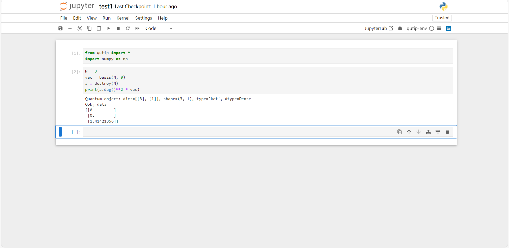

# Windows 上安装 QuTiP

## 安装 Anaconda

- 安装 Anaconda：https://www.anaconda.com/download/success

- 添加环境变量（Win10，假设 Anaconda 安装在 D 盘）：

此电脑 $\to $ 属性 $\to $ 高级系统设置 $\to $ 环境变量 $\to $ 双击 Path $\to $ 弹出 “编辑环境变量”窗口，新建，依次键入：

```
D:\Anaconda
D:\Anaconda\Scripts
D:\Anaconda\Library\mingw-w64\bin
D:\Anaconda\Library\bin
```

“编辑环境变量”窗口确定 $\to $ “环境”窗口确定

## qutip 环境配置

> 问你要不要下载的，一律 yes

- 打开 Anaconda Powershell Prompt

- 依次键入：

```
conda create -n qutip-env python=3.12
```

```
conda activate qutip-env
```

```
conda install conda-forge::qutip
```

> ps：官网上的 conda create -n qutip-env python qutip 可能不行

> pps：若需要其他库可通过 conda install 下载

> ppps：别用中国电信的 WIFI


```
conda install ipykernel
```

```
python -m ipykernel install --user --name qutip-env --display-name "qutip-env"
```

- 打开 Jupyter Notebook，将 Kernel 选为我们配置好的环境 qutip-env

## 写代码

现在可以在 Jupyter Notebook 中写代码了。写完后 Shift+Enter 运行代码，效果如下：

