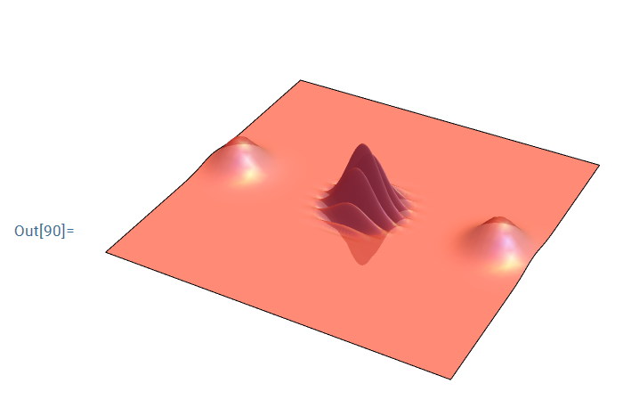
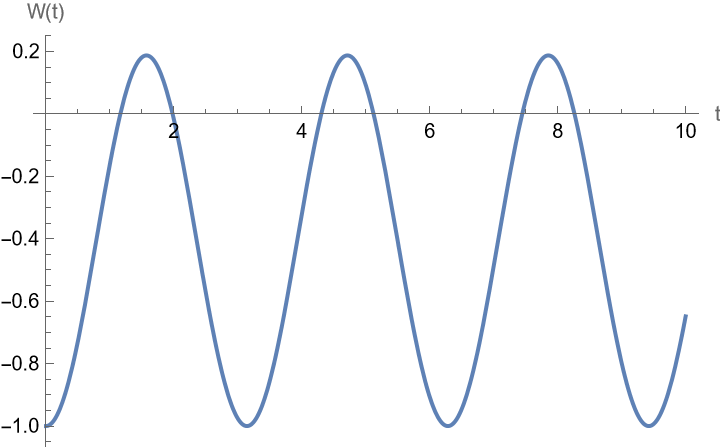
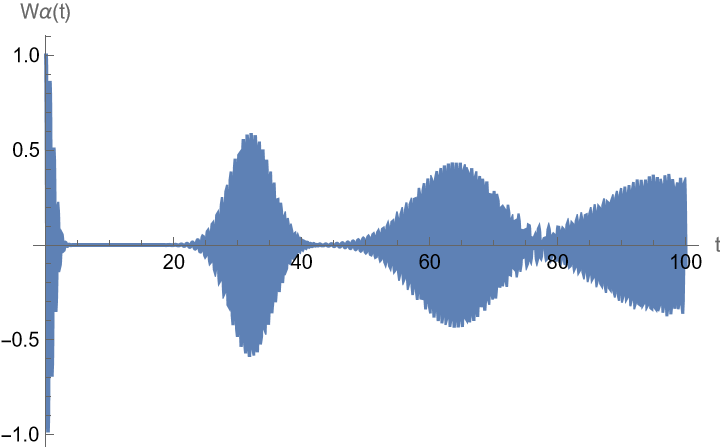
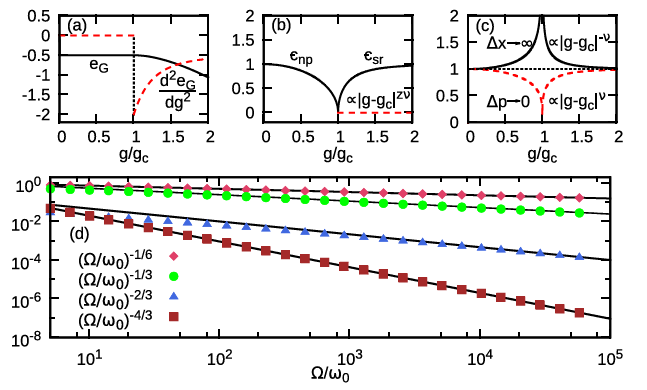

# 2-1

> 推导 $\displaystyle{\hat{H}=\hbar\omega\left(\hat{a}^\dag\hat{a}+\frac{1 }{2 } \right) }$  ，完成腔内单模电磁场的量子化。

腔内电场满足波动方程：

$$
\nabla^2\vec{E}-\frac{1 }{c^2 } \frac{\partial^2\vec{E} }{\partial t^2 } 
=\vec{0}
$$

考虑沿 $z $ 轴传播的 $x $ 方向偏振的线偏振光，波动方程化为：

$$
\frac{\partial^2 E_x(z,t) }{\partial z^2 } - \frac{1 }{c^2 } \frac{\partial E_x(z,t) }{\partial t^2 } 
=0 
$$

设 $E_x(z,t)=E_x(z)q(t) $，分离变量得：

$$
\frac{\mathrm{d}^2 E_x(z) }{\mathrm{d}z^2 } + k^2 E_x(z)
=0 
$$

$$
\frac{\mathrm{d}^2 q(t) }{\mathrm{d}t^2 } + \omega^2 q(t)
=0 ,~~\omega=ck
$$

可以解得通解：

$$
E_x(z)
=A\sin(kz+\alpha)
$$

$$
q(t)
=c_1\mathrm{e}^{-\mathrm{i}\omega t} + c_2\mathrm{e}^{\mathrm{i}\omega t}
$$

边界条件：

$$
E_x(0) = E_x(L) = 0
$$

得到：

$$
\alpha=0,~~k=\frac{n\pi }{L } 
$$

因此：

$$
\vec{E}
=\vec{\mathrm{e}}_x A q(t)\sin(kz),~~k=\frac{n\pi }{L } 
$$

由 $\displaystyle{\nabla\times \vec{B}=\mu_0\varepsilon_0\frac{\partial \vec{E} }{\partial t }  }$ 可得：

$$
\vec{B}
=\vec{\mathrm{e}}_y\left(\frac{\mu_0\varepsilon_0 }{k }  \right) A\dot{q}(t)\cos(kz)
$$

取基模 $n=1 $，电磁场的能量为：

$$
\begin{aligned}
H
&=\frac{1 }{2 } \int\mathrm{d}^3\vec{r} \left[\varepsilon_0 \left|E_x(z,t) \right|^2 + \frac{1 }{\mu_0 } \left|B_y(z,t) \right|^2 \right] \\
&=\frac{\varepsilon_0 V A^2 }{4}\left[q^2(t)+\frac{\dot{q}^2(t) }{c^2k^2 }  \right] \\
&=\frac{\varepsilon_0 V A^2 }{2m\omega^2 }\left[\frac{m\omega^2 q^2(t) }{2 } + \frac{p^2(t) }{2m }  \right] \\
&=\frac{p^2(t) }{2m } + \frac{m\omega^2 q^2(t) }{2 },~~A=\left(\frac{2m\omega^2 }{V \varepsilon_0 }  \right)^{1/2}   
\end{aligned}
$$

$q\to \hat{q},p\to\hat{p},\left[\hat{q}(t),\hat{p}(t') \right]=\mathrm{i}\hbar\delta_{t,t'} $

$$
\hat{H}
=\frac{\hat{p}^2(t) }{2m } + \frac{m\omega^2\hat{q}^2(t) }{2 } 
$$

$$
\hat{a}\mathrm{e}^{-\mathrm{i}\omega t}
=\frac{1 }{\sqrt{2m\hbar\omega} } \left[m\omega\hat{q}(t)+\mathrm{i}\hat{p}(t) \right]
$$

则：

$$
\hat{H}
=\hbar\omega\left(\hat{a}^\dag\hat{a}+\frac{1 }{2 }  \right)
$$

$$
\hat{\vec{E}}(z,t)
=\vec{\mathrm{e}}_x \mathcal{E}\left(\hat{a}\mathrm{e}^{-\mathrm{i}\omega t} + \hat{a}^\dag \mathrm{e}^{\mathrm{i}\omega t} \right)\sin(kz)
$$

# 2-2

> 推导 $\displaystyle{\hat{H}=\sum_{\vec{k}s} \hbar\omega_k\left(\hat{a}_{\vec{k}s}^\dag\hat{a}_{\vec{k}s}+\frac{1 }{2 }  \right) }$  ，完成自由空间多模电磁场的量子化。

光场由矢势确定：

$$
\vec{E}(\vec{r},t) = -\frac{\partial \vec{A}(\vec{r},t) }{\partial t } 
$$

$$
\vec{B}(\vec{r},t) = \nabla\times\vec{A}(\vec{r},t) 
$$

麦克斯韦方程：

$$
\nabla\times\vec{H} = \vec{J}+\frac{\partial \vec{D} }{\partial t } 
$$

自由空间中 $\vec{J}=\vec{0},\vec{D}=\varepsilon_0\vec{E},\vec{H}=\vec{B}/\mu_0 $，代入上式得：

$$
\nabla\times \vec{B}
=\varepsilon_0\mu_0\frac{\partial \vec{E} }{\partial t } 
=\frac{1 }{c^2 } \frac{\partial \vec{E} }{\partial t }
$$

将上式可化为关于矢势 $\vec{A} $ 的方程：

$$
\nabla\times(\nabla\times \vec{A})
=-\frac{1 }{c^2 } \frac{\partial^2 \vec{A} }{\partial t^2 } 
$$

利用公式 $\nabla\times(\nabla\times \vec{A})=\nabla(\nabla\cdot\vec{A})-\nabla^2\vec{A} $，并采用库伦规范 $\nabla\cdot\vec{A}=0 $ 可得：

$$
\nabla^2 \vec{A}(\vec{r},t) - \frac{1 }{c^2 } \frac{\partial^2 \vec{A}(\vec{r},t) }{\partial t^2 } 
=0
$$

设 $\vec{A}(\vec{r},t)=\vec{A}(\vec{r})A(t) $，分离变量可得：

$$
\left\{
\begin{aligned}
&\nabla^2 \vec{A}(\vec{r}) + k^2\vec{A}(\vec{r}) = \vec{0} \\
&\ddot{A}(t) + \omega^2 A(t) = 0 \\
&\omega^2 = c^2k^2
\end{aligned}
\right.
$$

把自由空间看作边长为 $L $ 的立方腔，可得通解：

$$
\vec{A}(\vec{r},t)
=\sum_{\vec{k},s}\vec{\mathrm{e}}_{\vec{k}s}\left[A_{\vec{k}s}\mathrm{e}^{\mathrm{i}(\vec{k}\cdot\vec{r}-\omega_k t)} +  A_{\vec{k}s}^*\mathrm{e}^{-\mathrm{i}(\vec{k}\cdot\vec{r}-\omega_k t)} \right]
$$

采用周期性边界条件可得：

$$
\vec{k}
=\frac{2\pi }{L } (m_x,m_y,m_z),~~m_x,m_y,m_z为整数
$$

由于 $\nabla\cdot\vec{A}=0 $，因此 $\vec{k}\cdot\vec{\mathrm{e}}_{\vec{k}s}=0 $，于是电磁波为横波，有两个独立的偏振方向，$s=1,2 $

电场：

$$
\begin{aligned}
\vec{E}(\vec{r},t)
&=-\frac{\partial \vec{A}(\vec{r},t) }{\partial t } \\
&=-\frac{\partial }{\partial t } \left\{\sum_{\vec{k},s}\vec{\mathrm{e}}_{\vec{k}s}\left[A_{\vec{k}s}\mathrm{e}^{\mathrm{i}(\vec{k}\cdot\vec{r}-\omega_k t)} +  A_{\vec{k}s}^*\mathrm{e}^{-\mathrm{i}(\vec{k}\cdot\vec{r}-\omega_k t)} \right] \right\} \\
&=\mathrm{i}\sum_{\vec{k},s}\omega_k\vec{\mathrm{e}}_{\vec{k}s}\left[A_{\vec{k}s}\mathrm{e}^{\mathrm{i}(\vec{k}\cdot\vec{r}-\omega_k t)} -  A_{\vec{k}s}^*\mathrm{e}^{-\mathrm{i}(\vec{k}\cdot\vec{r}-\omega_k t)} \right]
\end{aligned}
$$

结合 $\nabla\times(\varphi\vec{A})=(\nabla\varphi)\times\vec{A} + \varphi(\nabla\times \vec{A}) $，可得磁场：

$$
\begin{aligned}
\vec{B}(\vec{r},t)
&=\nabla\times\vec{A}(\vec{r},t) \\
&=\nabla\times\left\{\sum_{\vec{k},s}\vec{\mathrm{e}}_{\vec{k}s}\left[A_{\vec{k}s}\mathrm{e}^{\mathrm{i}(\vec{k}\cdot\vec{r}-\omega_k t)} +  A_{\vec{k}s}^*\mathrm{e}^{-\mathrm{i}(\vec{k}\cdot\vec{r}-\omega_k t)} \right] \right\} \\
&=\sum_{\vec{k},s}\left[\left(A_{\vec{k}s}\nabla \mathrm{e}^{\mathrm{i}(\vec{k}\cdot\vec{r}-\omega_k t)} \right)\times \vec{\mathrm{e}}_{\vec{k}s} + \left(A_{\vec{k}s}^*\nabla\mathrm{e}^{-\mathrm{i}(\vec{k}\cdot\vec{r}-\omega_k t)}\right)\times\vec{\mathrm{e}}_{\vec{k}s} \right] \\
&=\sum_{\vec{k},s}\left[\left(\mathrm{i} A_{\vec{k}s} \mathrm{e}^{\mathrm{i}(\vec{k}\cdot\vec{r}-\omega_k t)} \right)\vec{k}\times \vec{\mathrm{e}}_{\vec{k}s} - \left(\mathrm{i} A_{\vec{k}s}^* \mathrm{e}^{\mathrm{i}(\vec{k}\cdot\vec{r}-\omega_k t)} \right)\vec{k}\times \vec{\mathrm{e}}_{\vec{k}s} \right] \\
&=\mathrm{i}\sum_{\vec{k},s} \left(\vec{k}\times\vec{\mathrm{e}}_{\vec{k}s} \right)\left[A_{\vec{k}s} \mathrm{e}^{\mathrm{i}(\vec{k}\cdot\vec{r}-\omega_k t)} - A_{\vec{k}s}^* \mathrm{e}^{\mathrm{i}(\vec{k}\cdot\vec{r}-\omega_k t)} \right] \\
&=\frac{\mathrm{i} }{c } \sum_{\vec{k},s} \omega_k\left(\hat{k}\times\vec{\mathrm{e}}_{\vec{k}s} \right)\left[A_{\vec{k}s} \mathrm{e}^{\mathrm{i}(\vec{k}\cdot\vec{r}-\omega_k t)} - A_{\vec{k}s}^* \mathrm{e}^{\mathrm{i}(\vec{k}\cdot\vec{r}-\omega_k t)} \right] \\
\end{aligned}
$$

哈密顿量为：

$$
\begin{aligned}
H
&=\frac{1 }{2 } \int\limits_{V} \left(\varepsilon_0 \vec{E}\cdot\vec{E} + \frac{1 }{\mu_0 } \vec{B}\cdot\vec{B} \right)\mathrm{d}V \\
&=2\varepsilon_0 V\sum_{\vec{k},s} \omega_k^2 A_{\vec{k}s}^*A_{\vec{k}s}
\end{aligned}
$$

引入 $p_{\vec{k}s},q_{\vec{k}s} $ 使得：

$$
A_{\vec{k}s}
=\frac{1 }{2\omega_k \left(\varepsilon_0 V \right)^{1/2} }\left[\omega_k q_{\vec{k}s} + \mathrm{i}p_{\vec{k}s} \right] 
$$

则：

$$
H
=\frac{1 }{2 } \sum_{\vec{k},s} \left(p_{\vec{k}s}^2+\omega_k q_{\vec{k}s}^2 \right)
$$

量子化：

$$
\left[\hat{q}_{\vec{k}s},\hat{p}_{\vec{k}'s'} \right]
=\mathrm{i}\hbar\delta_{\vec{k}\vec{k}'}\delta_{ss'}
$$

令：

$$
\hat{a}_{\vec{k}s}
=\frac{1 }{\left(2\hbar\omega_k \right)^{1/2} } \left(\omega_k \hat{q}_{\vec{k}s} + \mathrm{i}\hat{p}_{\vec{k}s} \right) 
$$

则：

$$
\hat{H}
=\sum_{\vec{k},s} \hbar\omega_k \left(\hat{a}_{\vec{k}s}^\dag \hat{a}_{\vec{k}s}+\frac{1 }{2 }  \right)
$$

$$
\hat{\vec{E}}(\vec{r},t)
=\mathrm{i}\sum_{\vec{k},s}\left(\frac{\hbar\omega_k }{2\varepsilon_0 V }  \right)^{1/2} \vec{\mathrm{e}}_{\vec{k}s}\left[\hat{a}_{\vec{k}s}\mathrm{e}^{\mathrm{i}(\vec{k}\cdot\vec{r} -\omega_k t)} - \hat{a}_{\vec{ks}}^\dag \mathrm{e}^{-\mathrm{i}(\vec{k}\cdot\vec{r}-\omega_k t)} \right]
$$

$$
\hat{\vec{B}}(\vec{r},t)
=\frac{\mathrm{i} }{c } \sum_{\vec{k},s}\left(\frac{\hbar\omega_k }{2\varepsilon_0 V }  \right)^{1/2} \left(\hat{k}\times \vec{\mathrm{e}}_{\vec{k}s} \right) \left[\hat{a}_{\vec{k}s}\mathrm{e}^{\mathrm{i}(\vec{k}\cdot\vec{r} -\omega_k t)} - \hat{a}_{\vec{ks}}^\dag \mathrm{e}^{-\mathrm{i}(\vec{k}\cdot\vec{r}-\omega_k t)} \right]
$$

# 2-3

> 求证，对单模自由光场 $\displaystyle{\hat{H}=\hbar\omega\left(\hat{a}^\dag \hat{a}+1/2 \right) }$，其本征态满足：（1）$\displaystyle{\ket{n}=\frac{\left(\hat{a}^\dag \right)^n }{\sqrt{n!} } \ket{0} }$（2）$\displaystyle{\hat{U}(t)=\exp\left(-\frac{\mathrm{i} }{\hbar } \hat{H}t \right) = \sum_{n} \exp\left(-\frac{\mathrm{i} }{\hbar } E_n t  \right)\ket{n}\bra{n} }$，其中 $E_n=\hbar\omega\left(n+1/2 \right) $

## (1)

$$
\hat{a}^\dag \ket{n} = \sqrt{n+1}\ket{n+1}
\Longrightarrow \ket{n+1} = \frac{\hat{a}^\dag }{\sqrt{n+1} }\ket{n} 
$$

于是：

$$
\begin{aligned}
\ket{n}
&=\frac{\hat{a}^\dag }{\sqrt{n} }\ket{n-1} \\
&=\frac{\left(\hat{a}^\dag \right)^2 }{\sqrt{n}\sqrt{n-1} } \ket{n-2} \\
&=\vdots \\
&=\frac{\left(\hat{a}^\dag \right)^n }{\sqrt{n!} } \ket{0}
\end{aligned}
$$

## (2)

$$
\hat{H}\ket{n} = E_n\ket{n} = \hbar\omega\left(n+1/2 \right)\ket{n}
$$

完备性：

$$
\ket{n}\bra{n} = I
$$

$$
\begin{aligned}
\hat{U}(t)
&=\exp\left(-\frac{\mathrm{i} }{\hbar } \hat{H}t \right) \\
&=\exp\left(-\frac{\mathrm{i} }{\hbar } \hat{H}t \right)\sum_{n} \ket{n}\bra{n} \\
&=\sum_{n} \exp\left(-\frac{\mathrm{i} }{\hbar } \hat{H}t \right)\ket{n}\bra{n} \\
&=\sum_{n} \exp\left(-\frac{\mathrm{i} }{\hbar } E_n t \right)\ket{n}\bra{n} \\
\end{aligned}
$$

# 2-4

> 推导方程：$\displaystyle{\rho=\frac{\mathrm{e}^{-\beta\hat{H}} }{Z }=\sum_{n=0}^{\infty} \frac{\bar{n}^n }{\left(1+\bar{n} \right)^{n+1} }\ket{n}\bra{n},~~Z=\mathrm{Tr}\left(\mathrm{e}^{-\beta\hat{H}} \right)   }$

$$
\beta = \frac{1 }{k_{\mathrm{B}}T },~~\hat{H} = \hbar\omega(\hat{a}^\dag\hat{a}+1/2)  
$$

热场的密度矩阵：

$$
\rho
=\frac{\exp\left(-\hat{H}/k_{\mathrm{B}}T\right) }{\mathrm{Tr}\left[\exp \left(-\hat{H}/k_{\mathrm{B}}T \right)\right] },~~\hat{H} = \hbar\omega\left(\hat{a}^\dag\hat{a}+1/2 \right)
$$

$$
\begin{aligned}
\mathrm{Tr}\left[\exp \left(-\hat{H}/k_{\mathrm{B}}T \right)\right]
&=\sum_{n=0}^{\infty} \Braket{n|\exp\left(-\hat{H}/k_{\mathrm{B}}T\right)|n} \\
&=\sum_{n=0}^{\infty}\exp\left(-E_n/k_{\mathrm{B}}T \right) \\
&\equiv Z
\end{aligned}
$$

其中 $Z\equiv \sum\limits_{n=0}^{\infty}\exp\left(-E_n/k_{\mathrm{B}}T \right) $ 称为配分函数。

$$
\begin{aligned}
Z
&\equiv \sum\limits_{n=0}^{\infty}\exp\left(-E_n/k_{\mathrm{B}}T \right) \\
&=\exp\left(-\hbar\omega/2k_{\mathrm{B}}T \right)\sum_{n=0}^{\infty} \exp\left(-\hbar\omega n/k_{\mathrm{B}}T \right) \\
&=\exp\left(-\hbar\omega/2k_{\mathrm{B}}T \right)\cdot \frac{1 }{1-\exp\left(-\hbar\omega/k_{\mathrm{B}}T \right) } \\
&=\frac{\exp\left(-\hbar\omega/2k_{\mathrm{B}}T \right) }{1-\exp\left(-\hbar\omega/k_{\mathrm{B}}T \right) } \\
\end{aligned}
$$

设：

$$
\rho
=\sum_{n=0}^{\infty} P_n\ket{n}\bra{n}
$$

则：

$$
\begin{aligned}
P_n
&=\Braket{n|\rho|n} \\
&=\frac{1 }{Z }\exp\left(-E_n/k_{\mathrm{B}}T \right) \\
\end{aligned}
$$

注意到：

$$
\begin{aligned}
\sum_{n=0}^{\infty} n\mathrm{e}^{-nx}
&=-\sum_{n=0}^{\infty} \frac{\partial  }{\partial x } \left(\mathrm{e}^{-nx} \right) \\
&=-\frac{\mathrm{d} }{\mathrm{d}x } \sum_{n=0}^{\infty} \mathrm{e}^{-nx} \\
&=\frac{\mathrm{e}^{-x} }{\left(1-\mathrm{e}^{-x} \right)^2 } 
\end{aligned}
$$

热场的平均光子数：

$$
\begin{aligned}
\bar{n}
&=\Braket{\hat{n}} \\
&=\mathrm{Tr}\left(\hat{n}\rho \right) \\
&=\sum_{n=0}^{\infty} \Braket{n|\hat{n}\rho|n} \\
&=\sum_{n=0}^{\infty} n P_n \\
&=\frac{\exp\left(-\hbar\omega/2k_{\mathrm{B}}T \right) }{Z } \sum_{n=0}^{\infty} n\exp\left(-\hbar\omega n / k_{\mathrm{B}}T \right) \\
&=\frac{1 }{\exp\left(\hbar\omega/k_{\mathrm{B}}T \right) - 1 } 
\end{aligned}
$$

因此：

$$
\exp\left(-\hbar\omega/k_{\mathrm{B}}T \right) = \frac{\bar{n} }{\bar{n}+1 } 
$$

于是：

$$
\begin{aligned}
\rho
&=\sum_{n=0}^{\infty} P_n \ket{n}\bra{n} \\
&=\sum_{n=0}^{\infty} \frac{1 }{Z }\exp\left(-E_n/k_{\mathrm{B}}T \right) \ket{n}\bra{n} \\
&=\sum_{n=0}^{\infty}\frac{\left(\frac{\bar{n} }{\bar{n}+1 }  \right)^{1/2}\left(\frac{\bar{n} }{\bar{n}+1 }  \right)^{n} }{\left(\frac{\bar{n} }{\bar{n}+1 }  \right)^{1/2}\big/ \left(1-\frac{\bar{n} }{\bar{n}+1 }  \right)  } \ket{n}\bra{n} \\
&=\sum_{n=0}^{\infty} \frac{\bar{n}^n }{\left(1+\bar{n} \right)^{n+1} }\ket{n}\bra{n}
\end{aligned}
$$

# 2-5

> 推导黑体辐射公式：$\displaystyle{\bar{U}(\omega)=\hbar\omega\bar{n}\rho(\omega)=\frac{\hbar\omega^3 }{\pi^2c^3 } \frac{1 }{\mathrm{e}^{\beta\hbar\omega}-1 }  }$ 

由 $\displaystyle{\vec{k}=\frac{2\pi }{L }(m_x\vec{\mathrm{e}}_x+ m_y \vec{\mathrm{e}}_y +m_z\vec{\mathrm{e}}_z),~~m_x,m_y,m_z\in \N  }$ 可得：

动量空间中 $k\sim k+\mathrm{d}k $ 动量范围内的电磁模式数：

$$
\frac{2\times 4\pi k^2\mathrm{d}k }{\left(2\pi/L \right)^3 }
=\frac{V k^2  }{\pi^2 }\mathrm{d}k 
$$

由色散关系 $\omega_k = ck,\mathrm{d}\omega_k = c\mathrm{d}k $，$\omega_k \sim \omega_k+\mathrm{d}\omega_k $ 圆频率范围内的电磁模式数：

$$
\frac{V\omega_k^2 }{\pi^2 c^3 } \mathrm{d}\omega_k
$$

模密度（单位体积内 $\omega $ 附近单位圆频率区间内的电磁模式数 ）：

$$
\rho(\omega)
=\frac{\omega^2 }{\pi^2 c^3 } 
$$

$$
\begin{aligned}
\bar{U}(\omega)
&=\hbar\omega\bar{n}\rho(\omega) \\
&=\frac{\hbar\omega }{\exp\left(\hbar\omega/k_{\mathrm{B}}T \right) - 1 }\cdot \frac{\omega^2 }{\pi^2 c^3 } \\
&=\frac{\hbar\omega^3 }{\pi^2c^3 } \frac{1 }{\mathrm{e}^{\beta\hbar\omega}-1 }
\end{aligned}
$$

# 2-6

> 对相干态，求证：（1）$\displaystyle{\hat{a}^\dag \ket{\alpha}\bra{\alpha}=\left(\alpha^*+\partial_\alpha \right)\ket{\alpha}\bra{\alpha} }$（2）$\displaystyle{\ket{\alpha}\bra{\alpha}\hat{a}=\left(\alpha+\partial_{\alpha^*} \right)\ket{\alpha}\bra{\alpha} }$ 

## (1) 

$$
\begin{aligned}
\ket{\alpha}\bra{\alpha}
=\mathrm{e}^{-\alpha\alpha^*}\sum_{n,m=0}^{\infty} \frac{\alpha^n }{\sqrt{n!} } \frac{\alpha^{*m} }{\sqrt{m!} } \ket{n}\bra{m}
\end{aligned}
$$

一方面：

$$
\begin{aligned}
\hat{a}^\dag \ket{\alpha}\bra{\alpha}
&=\hat{a}^\dag \left(\mathrm{e}^{-\alpha\alpha^*}\sum_{n,m=0}^{\infty} \frac{\alpha^n }{\sqrt{n!} } \frac{\alpha^{*m} }{\sqrt{m!} } \ket{n}\bra{m} \right) \\
&=\mathrm{e}^{-\alpha\alpha^*}\sum_{n,m=0}^{\infty} \frac{\alpha^n }{\sqrt{n!} } \frac{\alpha^{*m} }{\sqrt{m!} } \hat{a}^\dag \ket{n}\bra{m} \\
&=\mathrm{e}^{-\alpha\alpha^*}\sum_{n,m=0}^{\infty} \frac{\alpha^n }{\sqrt{n!} } \frac{\alpha^{*m} }{\sqrt{m!} } \sqrt{n+1} \ket{n+1}\bra{m} \\
&=\mathrm{e}^{-\alpha\alpha^*}\sum_{n,m=0}^{\infty} \frac{\alpha^n }{\sqrt{(n+1)!} } \frac{\alpha^{*m} }{\sqrt{m!} } (n+1) \ket{n+1}\bra{m} \\
&=\mathrm{e}^{-\alpha\alpha^*}\sum_{n=1}^{\infty} \sum_{m=0}^{\infty} \frac{\alpha^{n-1} }{\sqrt{n!} } \frac{\alpha^{*m} }{\sqrt{m!} } (n) \ket{n}\bra{m} \\
\end{aligned}
$$

另一方面：

$$
\begin{aligned}
\left(\alpha^*+\partial_\alpha \right) \ket{\alpha}\bra{\alpha}
&=\left(\alpha^*+\partial_\alpha \right)\left(\mathrm{e}^{-\alpha\alpha^*}\sum_{n,m=0}^{\infty} \frac{\alpha^n }{\sqrt{n!} } \frac{\alpha^{*m} }{\sqrt{m!} } \ket{n}\bra{m} \right) \\
&=\alpha^* \left(\mathrm{e}^{-\alpha\alpha^*}\sum_{n,m=0}^{\infty} \frac{\alpha^n }{\sqrt{n!} } \frac{\alpha^{*m} }{\sqrt{m!} } \ket{n}\bra{m} \right) - \alpha^*\left(\mathrm{e}^{-\alpha\alpha^*}\sum_{n,m=0}^{\infty} \frac{\alpha^n }{\sqrt{n!} } \frac{\alpha^{*m} }{\sqrt{m!} } \ket{n}\bra{m} \right) + \left(\mathrm{e}^{-\alpha\alpha^*}\sum_{n,m=0}^{\infty} \frac{n\alpha^{n-1} }{\sqrt{n!} } \frac{\alpha^{*m} }{\sqrt{m!} } \ket{n}\bra{m} \right) \\
&=\mathrm{e}^{-\alpha\alpha^*}\sum_{n,m=0}^{\infty} \frac{\alpha^{n-1} }{\sqrt{n!} } \frac{\alpha^{*m} }{\sqrt{m!} } (n) \ket{n}\bra{m} \\
&=\mathrm{e}^{-\alpha\alpha^*}\sum_{n=1}^{\infty} \sum_{m=0}^{\infty} \frac{\alpha^{n-1} }{\sqrt{n!} } \frac{\alpha^{*m} }{\sqrt{m!} } (n) \ket{n}\bra{m} \\
\end{aligned}
$$

对比可得：

$$
\hat{a}^\dag \ket{\alpha}\bra{\alpha}
=\left(\alpha^*+\partial_\alpha \right) \ket{\alpha}\bra{\alpha}
$$

## (2)

$$
\begin{aligned}
\ket{\alpha}\bra{\alpha}
=\mathrm{e}^{-\alpha\alpha^*}\sum_{n,m=0}^{\infty} \frac{\alpha^n }{\sqrt{n!} } \frac{\alpha^{*m} }{\sqrt{m!} } \ket{n}\bra{m}
\end{aligned}
$$

产生算符作用于 Fock 态：

$$
\hat{a}^\dag \ket{m} = \sqrt{m+1}\ket{m+1}
$$

取厄米共轭得：

$$
\bra{m}\hat{a} = \sqrt{m+1}\bra{m+1}
$$

一方面：

$$
\begin{aligned}
\ket{\alpha}\bra{\alpha} \hat{a}
&=\left(\mathrm{e}^{-\alpha\alpha^*}\sum_{n,m=0}^{\infty} \frac{\alpha^n }{\sqrt{n!} } \frac{\alpha^{*m} }{\sqrt{m!} } \ket{n}\bra{m} \right)\hat{a} \\
&=\mathrm{e}^{-\alpha\alpha^*}\sum_{n,m=0}^{\infty} \frac{\alpha^n }{\sqrt{n!} } \frac{\alpha^{*m} }{\sqrt{m!} } \ket{n}\bra{m} \hat{a} \\
&=\mathrm{e}^{-\alpha\alpha^*}\sum_{n,m=0}^{\infty} \frac{\alpha^n }{\sqrt{n!} } \frac{\alpha^{*m} }{\sqrt{m!} } \sqrt{m+1} \ket{n}\bra{m+1} \\
&=\mathrm{e}^{-\alpha\alpha^*}\sum_{n,m=0}^{\infty} \frac{\alpha^n }{\sqrt{n!} } \frac{\alpha^{*m} }{\sqrt{(m+1)!} } (m+1) \ket{n}\bra{m+1} \\
&=\mathrm{e}^{-\alpha\alpha^*}\sum_{n=0}^{\infty} \sum_{m=1}^{\infty} \frac{\alpha^{n} }{\sqrt{n!} } \frac{\alpha^{*(m-1)} }{\sqrt{m!} } (m) \ket{n}\bra{m} \\
\end{aligned}
$$

另一方面：

$$
\begin{aligned}
\left(\alpha+\partial_{\alpha^*} \right) \ket{\alpha}\bra{\alpha}
&=\left(\alpha+\partial_{\alpha^*} \right)\left(\mathrm{e}^{-\alpha\alpha^*}\sum_{n,m=0}^{\infty} \frac{\alpha^n }{\sqrt{n!} } \frac{\alpha^{*m} }{\sqrt{m!} } \ket{n}\bra{m} \right) \\
&=\alpha \left(\mathrm{e}^{-\alpha\alpha^*}\sum_{n,m=0}^{\infty} \frac{\alpha^n }{\sqrt{n!} } \frac{\alpha^{*m} }{\sqrt{m!} } \ket{n}\bra{m} \right) - \alpha\left(\mathrm{e}^{-\alpha\alpha^*}\sum_{n,m=0}^{\infty} \frac{\alpha^n }{\sqrt{n!} } \frac{\alpha^{*m} }{\sqrt{m!} } \ket{n}\bra{m} \right) + \left(\mathrm{e}^{-\alpha\alpha^*}\sum_{n,m=0}^{\infty} \frac{\alpha^{n} }{\sqrt{n!} } \frac{m\alpha^{*(m-1)} }{\sqrt{m!} } \ket{n}\bra{m} \right) \\
&=\mathrm{e}^{-\alpha\alpha^*}\sum_{n,m=0}^{\infty} \frac{\alpha^{n} }{\sqrt{n!} } \frac{m\alpha^{*(m-1)} }{\sqrt{m!} } \ket{n}\bra{m} \\
&=\mathrm{e}^{-\alpha\alpha^*}\sum_{n=0}^{\infty}\sum_{m=1}^{\infty} \frac{\alpha^{n} }{\sqrt{n!} } \frac{m\alpha^{*(m-1)} }{\sqrt{m!} } \ket{n}\bra{m} \\
&=\mathrm{e}^{-\alpha\alpha^*}\sum_{n=0}^{\infty}\sum_{m=1}^{\infty} \frac{\alpha^{n} }{\sqrt{n!} } \frac{\alpha^{*(m-1)} }{\sqrt{m!} }(m) \ket{n}\bra{m} \\
\end{aligned}
$$

对比可得：

$$
\ket{\alpha}\bra{\alpha} \hat{a}
=\left(\alpha+\partial_{\alpha^*} \right) \ket{\alpha}\bra{\alpha}
$$

# 2-7

> 若单模自由光场初态为 $\ket{\psi(0)} $ 为相干态，求证 $\ket{\psi(t)} $ 也是相干态。

单模光场哈密顿量：

$$
\hat{H}
=\hbar\omega\left(\hat{a}^\dag \hat{a} + \frac{1 }{2 }  \right)
=\hbar\omega\left(\hat{n} + \frac{1 }{2 }  \right)
$$

其中，$\hat{n}\equiv \hat{a}^\dag \hat{a} $ 是粒子数算符。Fock 态是 $\hat{n} $ 的本征态：

$$
\hat{n}\ket{n} = n\ket{n}
$$

设 $\ket{\psi(0)}=\ket{\alpha} $，则：

$$
\begin{aligned}
\ket{\psi(t)}
&=\mathrm{e}^{-\mathrm{i}\hat{H}t/\hbar}\ket{\psi(0)} \\
&=\mathrm{e}^{-\mathrm{i}(\hat{n}+1/2)\omega t}\ket{\alpha} \\
&=\mathrm{e}^{-\mathrm{i}\omega t/2} \mathrm{e}^{-\mathrm{i}\omega t\hat{n}} \mathrm{e}^{-|\alpha|^2/2} \sum_{n=0}^{\infty} \frac{\alpha^n }{\sqrt{n!} } \ket{n} \\
&=\mathrm{e}^{-\mathrm{i}\omega t/2} \mathrm{e}^{-|\alpha|^2/2} \sum_{n=0}^{\infty} \frac{\alpha^n }{\sqrt{n!} } \mathrm{e}^{-\mathrm{i}\omega t\hat{n}} \ket{n} \\
&=\mathrm{e}^{-\mathrm{i}\omega t/2} \mathrm{e}^{-|\alpha|^2/2} \sum_{n=0}^{\infty} \frac{\alpha^n }{\sqrt{n!} } \mathrm{e}^{-\mathrm{i}\omega tn} \ket{n} \\
&=\mathrm{e}^{-\mathrm{i}\omega t/2} \mathrm{e}^{-|\alpha|^2/2} \sum_{n=0}^{\infty} \frac{\left(\alpha\mathrm{e}^{-\mathrm{i}\omega t}\right)^n }{\sqrt{n!} } \ket{n} \\
&=\mathrm{e}^{-\mathrm{i}\omega t/2} \mathrm{e}^{-|\alpha\mathrm{e}^{-\mathrm{i}\omega t}|^2/2} \sum_{n=0}^{\infty} \frac{\left(\alpha\mathrm{e}^{-\mathrm{i}\omega t}\right)^n }{\sqrt{n!} } \ket{n} \\
&=\mathrm{e}^{-\mathrm{i}\omega t/2} \Ket{\alpha\mathrm{e}^{-\mathrm{i}\omega t}}
\end{aligned}
$$

相位因子的冗余是允许的，因此 $\ket{\psi(t)} $ 也是相干态。

# 2-8

> 推导压缩态不确定关系 $\Delta Y_1=\mathrm{e}^{-r}/2,\Delta Y_2=\mathrm{e}^r/2 $

$$
\ket{\xi,\alpha}
=\hat{S}(\xi)\hat{D}(\alpha)\ket{0},~~
\hat{S}(\xi)
=\exp\left[\frac{1 }{2 } \left(\xi^*\hat{a}^2-\xi\hat{a}^{\dag ^2} \right) \right],~~
\xi
=r\mathrm{e}^{\mathrm{i}\theta}
$$

$$
\hat{Y}_1
=\exp\left(\frac{\mathrm{i}\theta\hat{a}^\dag \hat{a} }{2 }  \right)\hat{X}_1\exp\left(\frac{-\mathrm{i}\theta\hat{a}^\dag \hat{a} }{2 }  \right)
=\frac{1 }{2 } \left[\exp\left(-\frac{\mathrm{i}\theta }{2 }  \right)\hat{a} + \exp\left(\frac{\mathrm{i}\theta }{2 }  \right)\hat{a}^\dag \right]
$$

$$
\hat{Y}_2
=\exp\left(\frac{\mathrm{i}\theta\hat{a}^\dag \hat{a} }{2 }  \right)\hat{X}_2\exp\left(\frac{-\mathrm{i}\theta\hat{a}^\dag \hat{a} }{2 }  \right)
=\frac{1 }{2\mathrm{i} } \left[\exp\left(-\frac{\mathrm{i}\theta }{2 }  \right)\hat{a} - \exp\left(\frac{\mathrm{i}\theta }{2 }  \right)\hat{a}^\dag \right]
$$

$$
\begin{aligned}
\hat{S}^\dag(\xi) \hat{a} \hat{S}(\xi)
&=\hat{a}\cosh r - \hat{a}^\dag\mathrm{e}^{\mathrm{i}\theta}\sinh r
\end{aligned}
$$

$$
\begin{aligned}
\hat{S}^\dag(\xi) \hat{a}^\dag \hat{S}(\xi)
&=\left[\left(\hat{S}^\dag(\xi) \hat{a}^\dag \hat{S}(\xi) \right)^\dag \right]^\dag \\
&=\left(\hat{S}^\dag(\xi) \hat{a} \hat{S}(\xi) \right)^\dag \\
&=-\hat{a}\mathrm{e}^{-\mathrm{i}\theta}\sinh r + \hat{a}^\dag\cosh r
\end{aligned}
$$

$$
\begin{aligned}
\hat{S}^\dag(\xi) \hat{a}^\dag \hat{a} \hat{S}(\xi)
&=\hat{a}^\dag\hat{a}\left(\cosh^2 r + \sinh^2 r \right) + \sinh^2 r-\left(\hat{a}^{\dag 2}\mathrm{e}^{\mathrm{i}\theta} + \hat{a}^2\mathrm{e}^{-\mathrm{i}\theta} \right)\cosh r\sinh r
\end{aligned}
$$

$$
\begin{aligned}
\Braket{\xi,\alpha|\hat{Y}_1|\xi,\alpha}
&=\mathrm{e}^{-r}\left(\alpha \mathrm{e}^{-\mathrm{i}\theta/2} + \alpha^*\mathrm{e}^{\mathrm{i}\theta/2} \right)/2
\end{aligned}
$$

$$
\begin{aligned}
\Braket{\xi,\alpha|\hat{Y}_1^2|\xi,\alpha}
&=\mathrm{e}^{-2r}\left[1+\left(\alpha \mathrm{e}^{-\mathrm{i}\theta/2} + \alpha^*\mathrm{e}^{\mathrm{i}\theta/2} \right)^2\right]\bigg/4
\end{aligned}
$$

$$
\begin{aligned}
\Braket{\xi,\alpha|\hat{Y}_2|\xi,\alpha}
&=\mathrm{e}^{r}\left(\alpha \mathrm{e}^{-\mathrm{i}\theta/2} - \alpha^*\mathrm{e}^{\mathrm{i}\theta/2} \right)/(2\mathrm{i})
\end{aligned}
$$

$$
\begin{aligned}
\Braket{\xi,\alpha|\hat{Y}_2^2|\xi,\alpha}
&=\mathrm{e}^{2r}\left[1-\left(\alpha \mathrm{e}^{-\mathrm{i}\theta/2} - \alpha^*\mathrm{e}^{\mathrm{i}\theta/2} \right)^2\right]\bigg/4
\end{aligned}
$$

于是：

$$
\begin{aligned}
\Delta \hat{Y}_1
&=\sqrt{\Braket{\xi,\alpha|\hat{Y}_1^2|\xi,\alpha} - \Braket{\xi,\alpha|\hat{Y}_1|\xi,\alpha}^2} \\
&=\frac{\mathrm{e}^{-r} }{2 } 
\end{aligned}
$$

$$
\begin{aligned}
\Delta \hat{Y}_2
&=\sqrt{\Braket{\xi,\alpha|\hat{Y}_2^2|\xi,\alpha} - \Braket{\xi,\alpha|\hat{Y}_2|\xi,\alpha}^2} \\
&=\frac{\mathrm{e}^{r} }{2 } 
\end{aligned}
$$

# 2-9

> 求证：$\displaystyle{\exp\left(\xi^*\hat{a}_A\hat{a}_B-\xi\hat{a}_A^\dag\hat{a}_B^\dag \right) = \frac{1 }{\cosh r }\exp\left(-\Omega \hat{a}_A^\dag\hat{a}_B^\dag \right)\exp\left[\ln\cosh r\left(\hat{a}_A^\dag\hat{a}_A+\hat{a}_B^\dag\hat{a}_B \right) \right]\exp\left(\Omega^*\hat{a}_A\hat{a}_B \right)  }$ 

$$
\begin{aligned}
\left[\xi^*\hat{a}_A\hat{a}_B , -\xi\hat{a}_A^\dag\hat{a}_B^\dag \right]
&=-\left|\xi \right|^2\left[\hat{a}_A\hat{a}_B , \hat{a}_A^\dag\hat{a}_B^\dag \right] \\
&=-\left|\xi \right|^2\left(\hat{a}_A\hat{a}_A^\dag + \hat{a}_B^\dag \hat{a}_B \right)
\end{aligned}
$$

$$
\begin{aligned}
\left[\xi^*\hat{a}_A\hat{a}_B , \hat{a}_A\hat{a}_A^\dag + \hat{a}_B^\dag \hat{a}_B \right]
=0
\end{aligned}
$$

$$
\begin{aligned}
\left[-\xi\hat{a}_A^\dag\hat{a}_B^\dag , \hat{a}_A\hat{a}_A^\dag + \hat{a}_B^\dag \hat{a}_B \right]
=0
\end{aligned}
$$

因此由 BCH 公式：

$$
\begin{aligned}
\exp\left(\xi^*\hat{a}_A\hat{a}_B - \xi\hat{a}_A^\dag\hat{a}_B^\dag \right)
&=\exp\left(\xi^*\hat{a}_A\hat{a}_B \right)\exp\left(\left|\xi \right|^2\left(\hat{a}_A\hat{a}_A^\dag + \hat{a}_B^\dag \hat{a}_B \right)/2 \right)\exp\left(- \xi\hat{a}_A^\dag\hat{a}_B^\dag \right) \\
&=\frac{1 }{\cosh r }\exp\left(-\Omega \hat{a}_A^\dag\hat{a}_B^\dag \right)\exp\left[\ln\cosh r\left(\hat{a}_A^\dag\hat{a}_A+\hat{a}_B^\dag\hat{a}_B \right) \right]\exp\left(\Omega^*\hat{a}_A\hat{a}_B \right)
\end{aligned}
$$

# 2-10

> 求薛定谔猫态 $\displaystyle{\ket{\Psi}=\frac{1 }{\sqrt{N} } \left(\ket{\alpha_0}+\ket{-\alpha_0} \right) }$，其中 $N=2\left(1+\mathrm{e}^{-2|\alpha_0|^2} \right) $ 的 $W(\alpha,\alpha^*) $ 函数，并以 $\mathrm{Re}[\alpha] $ 和 $\mathrm{Im}[\alpha] $ 为两个水平轴，所得的 $W(\alpha,\alpha^*) $ 函数为竖直轴画出其三维图。

$$
\begin{aligned}
\rho
&=\ket{\Psi}\bra{\Psi} \\
&=\frac{1 }{N } \left(\ket{\alpha_0}+\ket{-\alpha_0} \right)\left(\bra{\alpha_0}+\bra{-\alpha_0} \right)
\end{aligned}
$$

$$
\begin{aligned}
C_{\mathrm{W}}(\lambda)
&=\mathrm{Tr}\left(\rho\hat{D}(\lambda) \right) \\
&=\mathrm{Tr}\left[\frac{1 }{N } \left(\ket{\alpha_0}+\ket{-\alpha_0} \right)\left(\bra{\alpha_0}+\bra{-\alpha_0} \right) \hat{D}(\lambda) \right] \\
&=\frac{1 }{N } \mathrm{Tr}\left[\left(\bra{\alpha_0}+\bra{-\alpha_0} \right) \hat{D}(\lambda) \left(\ket{\alpha_0}+\ket{-\alpha_0} \right) \right] \\
&=\frac{1 }{N }\left(\bra{\alpha_0}+\bra{-\alpha_0} \right) \hat{D}(\lambda) \left(\ket{\alpha_0}+\ket{-\alpha_0} \right) \\
&=\frac{1 }{N } \left\{\left(\bra{\alpha_0}+\bra{-\alpha_0} \right) \left(\mathrm{e}^{\mathrm{i}\Im(\lambda\alpha_0^*)}\ket{\lambda+\alpha_0} + \mathrm{e}^{-\mathrm{i}\Im(\lambda \alpha_0^*)}\ket{\lambda-\alpha_0} \right) \right\}\\
&=\frac{1 }{N } \mathrm{e}^{-\left|\alpha_0 \right|^2}\mathrm{e}^{-\left|\lambda \right|^2/2}\left[\mathrm{e}^{-\lambda^*\alpha_0}\left(\mathrm{e}^{-\left|\alpha_0 \right|^2-\alpha_0^*\lambda} + \mathrm{e}^{\left|\alpha_0 \right|^2+\alpha_0^*\lambda} \right) + \mathrm{e}^{\lambda^*\alpha_0}\left(\mathrm{e}^{\left|\alpha_0 \right|^2-\alpha_0^*\lambda} + \mathrm{e}^{-\left|\alpha_0 \right|^2+\alpha_0^*\lambda} \right) \right]
\end{aligned}
$$

$$
\begin{aligned}
W(\alpha)
&=\frac{1 }{\pi^2 } \int C_{\mathrm{W}}(\lambda)\mathrm{e}^{\lambda^*\alpha-\lambda\alpha^*}\mathrm{d}^2\lambda \\
&=\frac{2 }{\pi } \left[\mathrm{e}^{-2\left|\alpha-\alpha_0 \right|^2} + \mathrm{e}^{-2\left|\alpha+\alpha_0 \right|^2}\mathrm{e}^{-2\left|\alpha \right|^2}\left(\mathrm{e}^{-2\left(\alpha_0\alpha^*-\alpha\alpha_0^* \right)} + \mathrm{e}^{-2\left(-\alpha_0\alpha^*+\alpha\alpha_0^* \right)} \right) \right]
\end{aligned}
$$

# 2-11

> 求相干压缩态 $\ket{\Psi}=\hat{S}(\xi)\hat{D}(\alpha_0)\ket{0} $ 的 $W(\alpha,\alpha^*) $ 函数，并以 $\mathrm{Re}[\alpha] $ 和 $\mathrm{Im}[\alpha] $ 为两个水平轴，所得的 $W(\alpha,\alpha^*) $ 函数为竖直轴画出其三维图。

$$
\begin{aligned}
\rho
&=\hat{S}(\xi)\hat{D}(\alpha_0)\ket{0}\bra{0}\hat{D}^\dag(\alpha_0)\hat{S}^\dag(\xi)
\end{aligned}
$$

$$
\begin{aligned}
W(\alpha,\alpha^*)
&=\frac{1 }{\pi^2 } \int\mathrm{d}^2\lambda \mathrm{Tr}\left[\rho \hat{D}(\lambda) \right]\mathrm{e}^{-\lambda\alpha^*+\lambda^*\alpha} \\
&=\frac{1 }{\pi^2 } \int\mathrm{d}^2\lambda \Braket{0|\hat{D}^\dag(\alpha_0)\hat{S}^\dag(\xi)\hat{D}(\lambda)\hat{S}(\xi)\hat{D}(\alpha_0)|0} \mathrm{e}^{-\lambda\alpha^*+\lambda^*\alpha} \\
\end{aligned}
$$

利用公式：

$$
\hat{D}^\dag (\alpha_0)\hat{D}(\lambda)\hat{D}(\alpha_0)
=\hat{D}(\lambda)\mathrm{e}^{\lambda \alpha_0^*-\lambda^*\alpha_0}
$$

$$
\hat{S}^\dag(\xi)\hat{D}(\lambda)\hat{S}(\xi)
=\hat{D}\left(\lambda\cosh r + \lambda^*\mathrm{e}^{\mathrm{i}\theta}\sinh r \right)
$$

可得：

$$
\begin{aligned}
W(\alpha,\alpha^*)
&=\frac{1 }{\pi^2 } \int\mathrm{d}^2\lambda \Braket{0|\hat{D}^\dag(\alpha_0)\hat{S}^\dag(\xi)\hat{D}(\lambda)\hat{S}(\xi)\hat{D}(\alpha_0)|0} \mathrm{e}^{-\lambda\alpha^*+\lambda^*\alpha} \\
&=\frac{1 }{\pi^2 } \int\mathrm{d}^2\lambda \Braket{0|\hat{D}\left(\lambda\cosh r + \lambda^*\mathrm{e}^{\mathrm{i}\theta}\sinh r \right)|0} \mathrm{e}^{-\lambda(\alpha^*-\alpha_0^*)+\lambda^*(\alpha-\alpha_0)}
\end{aligned}
$$

作变量代换：

$$
\chi
=\lambda\cosh r + \lambda^*\mathrm{e}^{\mathrm{i}\theta} \sinh r
$$

积分可化为：

$$
\begin{aligned}
W(\alpha,\alpha^*)
&=\frac{1 }{\pi^2 } \int\mathrm{d}^2\lambda \Braket{0|\hat{D}\left(\lambda\cosh r + \lambda^*\mathrm{e}^{\mathrm{i}\theta}\sinh r \right)|0} \mathrm{e}^{-\lambda(\alpha^*-\alpha_0^*)+\lambda^*(\alpha-\alpha_0)} \\
&=\frac{1 }{\pi^2 } \int \mathrm{d}^2\chi \Braket{0|\hat{D}(\chi)|0}\mathrm{e}^{-\chi A^* + \chi^* A} \\
&=\frac{2 }{\pi } \mathrm{e}^{-2\left|A \right|^2} \\
&=\frac{2 }{\pi } \mathrm{e}^{-2\left|\left(\alpha^*-\alpha_0^* \right)\mathrm{e}^{\mathrm{i}\theta}\sinh r + \left(\alpha-\alpha_0 \right)\cosh r \right|^2}
\end{aligned}
$$

其中，

$$
A \equiv \left(\alpha^*-\alpha_0^* \right)\mathrm{e}^{\mathrm{i}\theta}\sinh r + \left(\alpha-\alpha_0 \right)\cosh r
$$

# 2-12

> 从方程 $\displaystyle{\hat{H}=\frac{1 }{2m } \left[\hat{\vec{p}}-\frac{e }{c } \vec{A}(\vec{r},t) \right]^2 + eU(\vec{r}) + V(r) }$ 出发，（1）推导偶极近似、二能级近似和旋波近似哈密顿量 $\displaystyle{\hat{H}(t)=\frac{\hbar\omega_0 }{2 } \hat{\sigma}_z + \frac{\hbar\Omega }{2 } \left(\mathrm{e}^{\mathrm{i}\phi}\mathrm{e}^{-\mathrm{i}\omega t}\hat{\sigma}_+ + \mathrm{H}.\mathrm{c}. \right) }$（2）求二能级原子的布居反转的 Rabi 振荡，并用 Mathematica 软件画出结果。

$$
\begin{aligned}
\hat{H}
=\frac{1 }{2m } \left[\hat{\vec{p}}-\frac{e }{c } \vec{A}(\vec{r},t) \right]^2 + eU(\vec{r}) + V(r)
\end{aligned}
$$

$$
\hat{\mathcal{U}}
\equiv \exp\left(\frac{\mathrm{i}e }{\hbar c } \int_{\vec{r}_0}^{\vec{r}} \vec{A}(\vec{r}',t)\cdot\mathrm{d}\vec{r}'  \right)
$$

$$
\begin{aligned}
\hat{\tilde{H}}
&\equiv \hat{\mathcal{U}}^\dag \hat{H} \hat{\mathcal{U}} - \mathrm{i}\hbar \hat{\mathcal{U}}^\dag \dot{\hat{\mathcal{U}}} \\
&=\frac{\hat{\vec{p}}^2 }{2m }  + eU(\vec{r}) + V(r) - \frac{e }{c } \int_{\vec{r}_0}^{\vec{r}}\vec{E}(\vec{r}',t)\cdot\mathrm{d}\vec{r}' 
\end{aligned}
$$

偶极近似：

$$
\vec{A}(\vec{r},t)
\approx \vec{A}(\vec{r}_0,t)
$$

二能级近似：

$$
\hat{\vec{p}}^2/2m + V(r)
\approx E_e\ket{e}\bra{e} + E_g\ket{g}\bra{g}
=\frac{\hbar\omega_0 }{2 } \hat{\sigma}_z,~~\hbar\omega_0 = E_e-E_g,\hat{\sigma_z} = \ket{e}\bra{e} - \ket{g}\bra{g}
$$

$$
\hat{H}
\approx \frac{\hbar\omega_0 }{2 } \hat{\sigma_z} - \frac{e }{c } \vec{r}\cdot\vec{E}(t)
=\frac{\hbar\omega_0 }{2 } \hat{\sigma_z} - \frac{e }{c } \vec{1}_r\cdot\vec{E}(t)\left(r_{ge}\hat{\sigma}_++\mathrm{H.c.} \right)
$$

$$
\vec{E}(t) = \vec{1}_{E} E_0 \cos(\omega t)
$$

$$
\begin{aligned}
\hat{H}
&=\frac{\hbar\omega_0 }{2 } \hat{\sigma_z} - \frac{e }{c } \vec{1}_r\cdot\vec{E}(t)\left(r_{ge}\hat{\sigma}_++\mathrm{H.c.} \right) \\
&=\frac{\hbar\omega_0 }{2 } \hat{\sigma_z} + \frac{\hbar\Omega }{2 }\left(\mathrm{e}^{\mathrm{i}\omega t}+\mathrm{e}^{-\mathrm{i}\omega t} \right)\left(\mathrm{e}^{\mathrm{i}\phi}\hat{\sigma}_++  \mathrm{H.c.} \right) 
\end{aligned}
$$

其中，

$$
r_{ge} = \left|r_{ge} \right|\mathrm{e}^{\mathrm{i}\phi},~~
\Omega = -\frac{e\vec{1}_r\cdot\vec{1}_E E_0 \left|r_{ge} \right| }{\hbar c } 
$$

定义：

$$
\hat{H}_0 = \frac{\hbar\omega_0 }{2 } \hat{\sigma}_z,~~
\hat{H}_I = \hat{H}-\hat{H}_0
$$

相互作用绘景：

$$
\begin{aligned}
\hat{H}_I^{(I)}(t)
=\frac{\hbar\Omega }{2 }\left(\mathrm{e}^{\mathrm{i}\omega t}+\mathrm{e}^{-\mathrm{i}\omega t} \right)\left(\mathrm{e}^{\mathrm{i}\phi}\mathrm{e}^{\mathrm{i}\omega_0 t}\hat{\sigma}_+ +  \mathrm{H.c.} \right) 
\end{aligned}
$$

旋波近似，忽略快速振荡项 $\mathrm{e}^{\pm \mathrm{i}(\omega_0+\omega)t} $，

$$
\begin{aligned}
\hat{H}_I^{(I)}(t)
&=\frac{\hbar\Omega }{2 }\left(\mathrm{e}^{\mathrm{i}\omega t}+\mathrm{e}^{-\mathrm{i}\omega t} \right)\left(\mathrm{e}^{\mathrm{i}\phi}\mathrm{e}^{\mathrm{i}\omega_0 t}\hat{\sigma}_+ +  \mathrm{H.c.} \right) \\
&\approx \frac{\bar\Omega }{2 }\left[\mathrm{e}^{\mathrm{i}\phi}\mathrm{e}^{\mathrm{i}\omega_0 t}\hat{\sigma}_+ +  \mathrm{H.c.} \right] 
\end{aligned}
$$

回到薛定谔绘景：

$$
\hat{H}
=\frac{\hbar\omega_0 }{2 } \hat{\sigma}_z + \frac{\hbar\Omega }{2 } \left(\mathrm{e}^{\mathrm{i}\phi}\mathrm{e}^{-\mathrm{i}\omega t}\hat{\sigma}_+ + \mathrm{H}.\mathrm{c}\right)
$$

设 $t $ 时刻体系的状态可展开为：

$$
\ket{\Psi(t)}
=c_g(t)\mathrm{e}^{\mathrm{i}\omega t/2}\ket{g} + c_e(t)\mathrm{e}^{-\mathrm{i}\omega_0 t/2}\ket{e}
$$

由薛定谔方程可得：

$$
\mathrm{i}\dot{c}_e(t)
=\frac{\Omega }{2 } c_g(t)\mathrm{e}^{-\mathrm{i}\varDelta t},~~
\mathrm{i}\dot{c}_g(t)
=\frac{\Omega }{2 } c_e(t)\mathrm{e}^{\mathrm{i}\varDelta t}
$$

可以解得：

$$
c_e(t)
=\mathrm{e}^{-\mathrm{i}\varDelta t/2}\left[c_e(0)\left(\cos\frac{\mu t }{2 } + \frac{\mathrm{i}\varDelta }{\mu } \sin\frac{\mu t }{2 }  \right) - \mathrm{i}c_g(0)\frac{\Omega }{\mu } \sin\frac{\mu t }{2 }  \right]
$$

$$
c_g(t)
=\mathrm{e}^{\mathrm{i}\varDelta t/2}\left[c_g(0)\left(\cos\frac{\mu t }{2 } - \frac{\mathrm{i}\varDelta }{\mu } \sin\frac{\mu t }{2 }  \right) - \mathrm{i}c_e(0)\frac{\Omega }{\mu } \sin\frac{\mu t }{2 } \right]
$$

选择初始条件 $c_g(0)=1,c_e(0)=1 $，布居反转为：

$$
\begin{aligned}
W(t)
&=\Braket{\hat{\sigma}_z} \\
&=\frac{\Omega^2-\varDelta^2 }{\mu^2 } \sin^2\frac{\mu t }{2 } - \cos^2\frac{\mu t }{2 } 
\end{aligned}
$$

# 2-13

> 在光与物质相互作用的全量子描述中，光的初态为相干态时，（1）求二能级原子布居反转的动力学演化；（2）用 Mathematica 画出你的结果；（3）与问题 12 得到的 Rabi 振荡相对比，体会量子光-物质相互作用的效应。

设体系状态可展为：

$$
\ket{\tilde{\Psi}_{n+1}(t)}
=c_{n+1,g}(t)\mathrm{e}^{-\mathrm{i}\left[(n+1)\omega-\omega_0/2 \right]t}\ket{n+1,g} + c_{n,e}(t)\mathrm{e}^{-\mathrm{i}\left[n\omega+\omega_0/2 \right]}\ket{n,e}
$$

代入薛定谔方程可得：

$$
\mathrm{i}\dot{c}_{n+1,g}(t)
=g\sqrt{n+1}\mathrm{e}^{-\mathrm{i}\varDelta t}c_{n,e}(t)
$$

$$
\mathrm{i}\dot{c}_{n,e}(t)
=g\sqrt{n+1}\mathrm{e}^{\mathrm{i}\varDelta t}c_{n+1,g}(t)
$$

解得：

$$
c_{n+1,g}(t)
=\mathrm{e}^{-\mathrm{i}\varDelta t/2}\left[c_{n+1,g}(0) \left(\cos\frac{\Omega_n(\varDelta )t }{2 } + \mathrm{i}\frac{\varDelta \sin\frac{\Omega_n(\varDelta )t }{2 }  }{\Omega_n(\varDelta) }   \right) + c_{n,e}(0)\frac{-2\mathrm{i}g\sqrt{n+1}\sin\frac{\Omega_n(\varDelta t) }{2 }  }{\Omega_n(\varDelta) }  \right]
$$

$$
c_{n,e}(t)
=\mathrm{e}^{\mathrm{i}\varDelta t/2}\left[c_{n+1,g}(0)\frac{-2\mathrm{i}g\sqrt{n+1}\sin\frac{\Omega_n(\varDelta t) }{2 }  }{\Omega_n(\varDelta) }  + c_{n,e}(0)\left(\cos\frac{\Omega_n(\varDelta )t }{2 } - \mathrm{i}\frac{\varDelta \sin\frac{\Omega_n(\varDelta )t }{2 }  }{\Omega_n(\varDelta) }   \right)  \right]
$$

布居反转：

$$
W(t)
=\Braket{\Psi_{n+1}(t)|\hat{\sigma}_z|\Psi_{n+1}(t)}
=\left|c_{n,e}(t) \right|^2 - \left|c_{n+1,g}(t) \right|^2
$$

当初态为相干态，即：

$$
\ket{\Psi(0)}
=\ket{\alpha,e}
=\mathrm{e}^{-\left|\alpha \right|^2/2}\sum_{n=0}^{\infty} \frac{\alpha^n }{\sqrt{n!} } \ket{n,e}
$$

$$
\begin{aligned}
\Psi(t)
&=\mathrm{e}^{-\left|\alpha \right|^2/2}\sum_{n=0}^{\infty} \frac{\alpha^n }{\sqrt{n!} } \ket{\tilde{\Psi}_{n+1}(t)}
\end{aligned}
$$

布居反转：

$$
\begin{aligned}
W_\alpha(t)
&=\mathrm{e}^{-\left|\alpha \right|^2}\sum_{n=0}^{\infty} \frac{\left|\alpha \right|^{2n} W_n(t) }{n! } \\
&=\mathrm{e}^{-\left|\alpha \right|^2}\sum_{n=0}^{\infty} \frac{\left|\alpha \right|^{2n} }{n! }\left[\frac{\varDelta^2 }{\Omega_n^2(\varDelta) } + \frac{4g^2(n+1) }{\Omega_n^2(\varDelta) } \cos\left[\Omega_n(\varDelta)t \right] \right],~~\Omega_n(\varDelta)=\sqrt{\varDelta^2+4g^2(n+1)}
\end{aligned}
$$

# 2-14

> 在大 $\omega_0/\omega $ 极限下研究量子 Rabi 模型，并用 Mathematica 画出你的结果（1）数值求解其本征能量随 $g/\omega $ 的变化；（2）数值求解基态能量 $\displaystyle{E_g,\frac{\mathrm{d}E_g }{\mathrm{d}g },\frac{\mathrm{d}^2E_g }{\mathrm{d}g^2 }   }$ 随 $g/\omega $ 的变化，揭示在 $g=\sqrt{\omega\omega_0}/2 $ 处发生量子相变。

量子 Rabi 模型哈密顿量：

$$
\hat{H}
=\omega\hat{a}^\dag \hat{a} + \frac{\omega_0 }{2 } \hat{\sigma}_z - g\left(\hat{a}+\hat{a}^\dag \right)\hat{\sigma}_x
$$

其中，$\omega $ 是光场圆频率，$\omega_0 $ 是跃迁圆频率，$g $ 是耦合强度。 

当：

$$
\frac{2g }{\sqrt{\omega\omega_0} }
=1 
$$

时，发生量子相变，即：

$$
g
=\frac{\sqrt{\omega\omega_0} }{2 } 
$$

