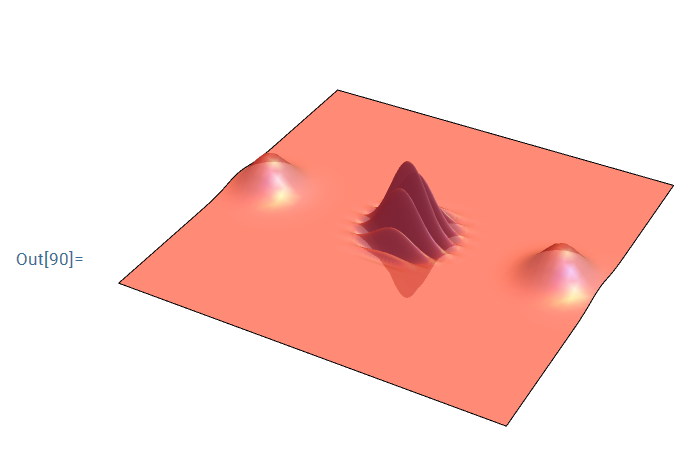
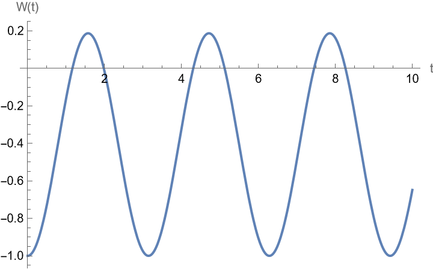
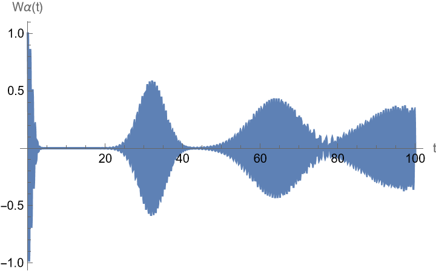
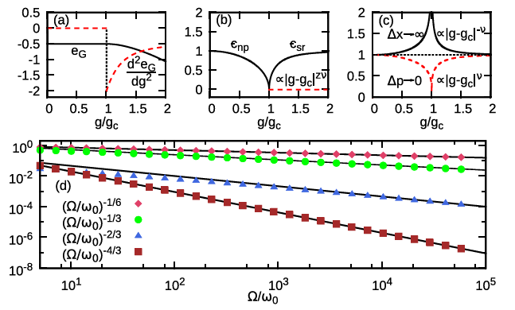

# 1-1

> 求 $\ket{\Psi_{AB}}=x_1\ket{0_A,0_B}+x_2\ket{0_A,1_B}+x_3\ket{1_A,0_B}+x_4\ket{1_A,1_B} $ 的约化密度矩阵 $\rho_A $ 和 $\rho_B $

$$
\rho_{AB}
=\ket{\Psi_{AB}}\bra{\Psi_{AB}}
$$

$$
\begin{aligned}
\rho_A
&=\mathrm{Tr}_B(\rho_{AB}) \\
&=\braket{0_B|\rho_{AB}|0_B} + \braket{1_B|\rho_{AB}|1_B} \\
&=(|x_1|^2+|x_2|^2)\ket{0_A}\bra{0_A} + (|x_3|^2+|x_4|^2)\ket{1_A}\bra{1_A} + (x_1x_3^*+x_2x_4^*)\ket{0_A}\bra{1_A} + (x_3x_1^*+x_4x_2^*)\ket{1_A}\bra{0_A}
\end{aligned}
$$

$$
\begin{aligned}
\rho_B
&=\mathrm{Tr}_A(\rho_{AB}) \\
&=\braket{0_A|\rho_{AB}|0_A} + \braket{1_A|\rho_{AB}|1_A} \\
&=(|x_1|^2+|x_3|^2)\ket{0_B}\bra{0_B} + (|x_2|^2+|x_4|^2)\ket{1_B}\bra{1_B} + (x_1x_2^*+x_3x_4^*)\ket{0_B}\bra{1_B} + (x_2x_1^*+x_4x_3^*)\ket{1_B}\bra{0_B}
\end{aligned}
$$

# 1-2

> 设双电子自旋态为：
>
>$$
\rho_{AB}
=\alpha\ket{+_A^z,+_B^z}\bra{+_A^z,+_B^z}+(1-\alpha)\ket{-_A^z,-_B^z}\bra{-_A^z,-_B^z} + \gamma \ket{+_A^z,+_B^z}\bra{-_A^z,-_B^z} + \gamma^*\ket{-_A^z,-_B^z}\bra{+_A^z,+_B^z}
>$$
>
>求 $\hat{\sigma}_A^z $ 和 $\hat{\sigma}_A^x $ 在此态的平均值。

$$
\begin{aligned}
\rho_{A}
&=\mathrm{Tr}_B\left(\rho_{AB} \right) \\
&=\braket{+_B^z|\rho_{AB}|+_B^z} + \braket{-_B^z|\rho_{AB}|-_B^z} \\
&=\alpha\ket{+_A^z}\bra{+_A^z} + (1-\alpha)\ket{-_A^z}\bra{-_A^z}
\end{aligned}
$$

由于 $\hat{\sigma}_A^z\ket{+_A^z}=+1\ket{+_A^z},\hat{\sigma}_A^z\ket{-_A^z}=-\ket{-_A^z} $，于是：

$$
\begin{aligned}
\hat{\sigma}_A^z \rho_{A}
&=\alpha\ket{+_A^z}\bra{+_A^z} - (1-\alpha)\ket{-_A^z}\bra{-_A^z} \\
\end{aligned}
$$

$\hat{\sigma}_A^z $ 在 $\rho_{AB} $ 态的平均值为：

$$
\begin{aligned}
\braket{\hat{\sigma}_A^z}
&=\mathrm{Tr}_A\left(\hat{\sigma}_A^z \rho_{A} \right) \\
&=\braket{+_A^z|\hat{\sigma}_A^z\rho_A|+_A^z} + \braket{-_A^z|\hat{\sigma}_A^z\rho_A|-_A^z} \\
&=2\alpha-1
\end{aligned}
$$

由于：

$$
\hat{\sigma}_A^x
=\begin{bmatrix}
0 &1 \\
1 &0
\end{bmatrix},~~
\rho_A
=\alpha\ket{+_A^z}\bra{+_A^z} + (1-\alpha)\ket{-_A^z}\bra{-_A^z}
=\begin{bmatrix}
\alpha &0 \\
0 &1-\alpha
\end{bmatrix}
$$

$$
\hat{\sigma}_A^x \rho_A
\doteq\begin{bmatrix}
0 &1-\alpha \\
\alpha &0
\end{bmatrix}
$$

于是 $\hat{\sigma}_A^x $ 在 $\rho_{AB} $ 的平均值为：

$$
\braket{\hat{\sigma}_A^x}
=\mathrm{Tr}_A\left(\hat{\sigma}_A^x\rho_A \right)
=0
$$

# 1-3

> 求哈密顿量 $\displaystyle{\hat{H}=\frac{\hbar\omega_0 }{2 }\hat{\sigma}_z+\frac{\hbar\Omega }{2 }[\hat{\sigma}_+\exp(-\mathrm{i}\omega_L t) + \mathrm{h.c.} ]   }$ 在 $\displaystyle{\hat{H}_0=\frac{\hbar\omega_L }{2 } \hat{\sigma}_z } $ 的相互作用绘景的形式。 

$$
\begin{aligned}
\hat{H}
&=\frac{\hbar\omega_0 }{2 }\hat{\sigma}_z + \frac{\hbar\Omega }{2 }\left[\hat{\sigma}_+\exp(-\mathrm{i}\omega_L t) + \hat{\sigma}_-\exp(\mathrm{i}\omega_L t) \right] \\
&=\frac{\hbar\omega_L }{2 } \hat{\sigma}_z + \frac{\hbar(\omega_0-\omega_L) }{2 }\hat{\sigma}_z + \frac{\hbar\Omega }{2 }\left[\hat{\sigma}_+\exp(-\mathrm{i}\omega_L t) + \hat{\sigma}_-\exp(\mathrm{i}\omega_L t) \right] \\
&=\hat{H}_0 + \hat{V}(t)
\end{aligned}
$$

其中，

$$
\hat{H}_0
=\frac{\hbar\omega_L }{2 } \hat{\sigma}_z 
$$

$$
\hat{V}(t)
=\frac{\hbar(\omega_0-\omega_L) }{2 }\hat{\sigma}_z + \frac{\hbar\Omega }{2 }\left[\hat{\sigma}_+\exp(-\mathrm{i}\omega_L t) + \hat{\sigma}_-\exp(\mathrm{i}\omega_L t) \right]
$$

$\hat{H}_0 $ 的相互作用绘景形式：

$$
\begin{aligned}
\hat{H}_{0,\mathcal{I}}
&=\exp(\mathrm{i}\hat{H}_0t/\hbar) \hat{H}_0 \exp(-\mathrm{i}\hat{H}_0 t/\hbar) \\
&=\hat{H}_0 + \frac{1 }{1! } \left[\mathrm{i}\hat{H}_0t/\hbar , \hat{H}_0 \right] +\cdots \\
&=\hat{H}_0 \\
&=\frac{\hbar\omega_L }{2 } \hat{\sigma}_z 
\end{aligned}
$$

注意到：

$$
\begin{aligned}
\exp(\mathrm{i}\omega_L t\hat{\sigma}_z/2) \hat{\sigma}_z \exp(-\mathrm{i}\omega_L t\hat{\sigma}_z/2)
=\hat{\sigma}_z
\end{aligned}
$$

$$
\begin{aligned}
\exp(\mathrm{i}\omega_L t\hat{\sigma}_z/2) \hat{\sigma}_+ \exp(-\mathrm{i}\omega_L t\hat{\sigma}_z/2)
&=\hat{\sigma}_+ + [\mathrm{i}\omega_L t\hat{\sigma}_z/2,\hat{\sigma}_+] + \frac{1 }{2! } [\mathrm{i}\omega_Lt\hat{\sigma}_z/2,[\mathrm{i}\omega_L t\hat{\sigma}_z/2,\hat{\sigma}_+]] + \cdots \\
&=\hat{\sigma}_+ + (\mathrm{i}\omega_L t/2) \hat{\sigma}_+ + \frac{(\mathrm{i}\omega_L t/2)^2 }{2! }\hat{\sigma}_+ + \cdots \\
&=[1+(\mathrm{i}\omega_L t/2) + \frac{(\mathrm{i}\omega_L t/2)^2 }{2! } +\cdots  ]\hat{\sigma}_+ \\
&=\exp(\mathrm{i}\omega_L t/2)\hat{\sigma}_+
\end{aligned}
$$

同理，

$$
\begin{aligned}
\exp(\mathrm{i}\omega_L t\hat{\sigma}_z/2) \hat{\sigma}_- \exp(-\mathrm{i}\omega_L t\hat{\sigma}_z/2)
&=\hat{\sigma}_- + [\mathrm{i}\omega_L t\hat{\sigma}_z/2,\hat{\sigma}_-] + \frac{1 }{2! } [\mathrm{i}\omega_Lt\hat{\sigma}_z/2,[\mathrm{i}\omega_L t\hat{\sigma}_z/2,\hat{\sigma}_-]] + \cdots \\
&=\hat{\sigma}_- + (-\mathrm{i}\omega_L t/2) \hat{\sigma}_- + \frac{(-\mathrm{i}\omega_L t/2)^2 }{2! }\hat{\sigma}_- + \cdots \\
&=[1+(-\mathrm{i}\omega_L t/2) + \frac{(-\mathrm{i}\omega_L t/2)^2 }{2! } +\cdots  ]\hat{\sigma}_- \\
&=\exp(-\mathrm{i}\omega_L t/2)\hat{\sigma}_-
\end{aligned}
$$

于是可得 $\hat{V}(t) $ 的相互作用绘景形式：

$$
\begin{aligned}
\hat{V}_{\mathcal{I}}(t)
&=\exp(\mathrm{i}\hat{H}_0t/\hbar) \hat{V}(t) \exp(-\mathrm{i}\hat{H}_0 t/\hbar) \\
&=\exp(\mathrm{i}\omega_L t\hat{\sigma}_z/2) \hat{V}(t) \exp(-\mathrm{i}\omega_L t\hat{\sigma}_z/2) \\
&=\exp(\mathrm{i}\omega_L t\hat{\sigma}_z/2) \left\{\frac{\hbar(\omega_0-\omega_L) }{2 }\hat{\sigma}_z + \frac{\hbar\Omega }{2 }\left[\hat{\sigma}_+\exp(-\mathrm{i}\omega_L t) + \hat{\sigma}_-\exp(\mathrm{i}\omega_L t) \right] \right\} \exp(-\mathrm{i}\omega_L t\hat{\sigma}_z/2) \\
&=\frac{\hbar(\omega_0-\omega_L) }{2 }\hat{\sigma}_z + \frac{\hbar\Omega }{2 }\left[\exp(\mathrm{i}\omega_Lt/2)\hat{\sigma}_+ \exp(-\mathrm{i}\omega_L t) + \exp(\mathrm{-\mathrm{i}}\omega_L t/2)\hat{\sigma}_-\exp(\mathrm{i}\omega_L t)  \right] \\
&=\frac{\hbar(\omega_0-\omega_L) }{2 }\hat{\sigma}_z + \frac{\hbar\Omega }{2 }\left[\exp(-\mathrm{i}\omega_L t/2)\hat{\sigma}_+ + \exp(\mathrm{i}\omega_L t/2)\hat{\sigma}_- \right] \\
&=\frac{\hbar(\omega_0-\omega_L) }{2 }\hat{\sigma}_z + \hbar\Omega\left[\cos(\omega_L t/2)\hat{\sigma}_x + \sin(\omega_L t/2)\hat{\sigma}_y \right] 
\end{aligned}
$$

综上，

$$
\begin{aligned}
H_{\mathcal{I}}
&=H_{0,\mathcal{I}} + V_{\mathcal{I}}(t) \\
&=\frac{\hbar\omega_L }{2 } \hat{\sigma}_z + \frac{\hbar(\omega_0-\omega_L) }{2 }\hat{\sigma}_z + \hbar\Omega\left[\cos(\omega_L t/2)\hat{\sigma}_x + \sin(\omega_L t/2)\hat{\sigma}_y \right] \\
&=\frac{\hbar \omega_0 }{2 }\hat{\sigma}_z + \hbar\Omega\left[\cos(\omega_L t/2)\hat{\sigma}_x + \sin(\omega_L t/2)\hat{\sigma}_y \right] 
\end{aligned}
$$

# 1-4

> 求哈密顿量 $\displaystyle{\hat{H}=\frac{\hbar\omega_0 }{2 } \hat{\sigma}_z + \hbar\omega\hat{a}^\dag\hat{a} + \hbar g\hat{\sigma}_x\left(\hat{a} + \hat{a}^\dag \right) }$ 在 $\displaystyle{\hat{H}_0 = \frac{\hbar\omega_0 }{2 } \hat{\sigma}_z + \hbar\omega\hat{a}\hat{a}^\dag }$ 的相互作用绘景的形式。

$$
\hat{V}
=\hbar g\hat{\sigma}_x\left(\hat{a} + \hat{a}^\dag \right)
$$

$$
\begin{aligned}
\hat{H}_{0,\mathcal{I}}
=\hat{H}_0
=\frac{\hbar\omega_0 }{2 } \hat{\sigma}_z + \hbar\omega\hat{a}\hat{a}^\dag 
\end{aligned}
$$

由于：

$$
\left[\frac{\omega_0 }{2 }\hat{\sigma}_z , \omega\hat{a}\hat{a}^\dag \right] = 0
$$

于是：

$$
\begin{aligned}
\exp(\mathrm{i}\hat{H}_0t/\hbar)
&=\exp\left[\mathrm{i}t\left(\frac{\omega_0 }{2 } \hat{\sigma}_z + \omega\hat{a}\hat{a}^\dag \right) \right] \\
&=\exp\left[\mathrm{i}t\left(\frac{\omega_0 }{2 } \hat{\sigma}_z \right) \right] \exp\left[\mathrm{i}t\left(\omega\hat{a}\hat{a}^\dag \right) \right]
\end{aligned}
$$

于是：

$$
\begin{aligned}
\frac{\hat{V}_{\mathcal{I}}(t) }{\hbar g } 
&=\exp(\mathrm{i}\hat{H}_0t/\hbar) \frac{\hat{V} }{\hbar g } \exp(-\mathrm{i}\hat{H}_0t/\hbar) \\
&=\exp\left[\mathrm{i}t\left(\frac{\omega_0 }{2 } \hat{\sigma}_z + \omega\hat{a}\hat{a}^\dag \right) \right] \left[\hat{\sigma}_x\left(\hat{a} + \hat{a}^\dag \right) \right] \exp\left[-\mathrm{i}t\left(\frac{\omega_0 }{2 } \hat{\sigma}_z + \omega\hat{a}\hat{a}^\dag \right) \right] \\
&=\exp\left[\mathrm{i}t\left(\frac{\omega_0 }{2 } \hat{\sigma}_z \right) \right] \exp\left[\mathrm{i}t\left(\omega\hat{a}\hat{a}^\dag \right) \right] \left[\hat{\sigma}_x\left(\hat{a} + \hat{a}^\dag \right) \right] \exp\left[-\mathrm{i}t\left(\omega\hat{a}\hat{a}^\dag \right) \right] \exp\left[-\mathrm{i}t\left(\frac{\omega_0 }{2 } \hat{\sigma}_z \right) \right] \\
&=\exp\left[\mathrm{i}t\left(\frac{\omega_0 }{2 } \hat{\sigma}_z \right) \right]\hat{\sigma}_x \exp\left[-\mathrm{i}t\left(\frac{\omega_0 }{2 } \hat{\sigma}_z \right) \right] \exp\left[\mathrm{i}t\left(\omega\hat{a}\hat{a}^\dag \right) \right] \left(\hat{a} + \hat{a}^\dag \right) \exp\left[-\mathrm{i}t\left(\omega\hat{a}\hat{a}^\dag \right) \right] \\
&=\frac{1 }{0! } \hat{\sigma}_x + \frac{1 }{1! } \left[\mathrm{i}t\left(\frac{\omega_0 }{2 } \hat{\sigma}_z \right) , \hat{\sigma}_x \right] + \cdots +\frac{1 }{0! } \left(\hat{a}+\hat{a}^\dag \right) + \frac{1 }{1! }  \left[\mathrm{i}t\left(\omega\hat{a}\hat{a}^\dag \right), \left(\hat{a}+\hat{a}^\dag \right) \right] + \cdots \\
&=\frac{1 }{0! } \hat{\sigma}_x + \frac{1 }{1! } \left(-t\omega_0\hat{\sigma}_y \right) + \frac{1 }{2! }  \left[\mathrm{i}t\left(\frac{\omega_0 }{2 } \hat{\sigma}_z \right) , \left(-t\omega_0\hat{\sigma}_y \right) \right] + \cdots +\frac{1 }{0! } \left(\hat{a}+\hat{a}^\dag \right) + \frac{1 }{1! } \mathrm{i}t\omega\left(\hat{a}^\dag-\hat{a} \right) + \frac{1 }{2! }  \left[\mathrm{i}t\left(\omega\hat{a}\hat{a}^\dag \right) , \mathrm{i}t\omega\left(\hat{a}^\dag-\hat{a} \right) \right] + \cdots \\
&=\frac{1 }{0! } \hat{\sigma}_x + \frac{1 }{1! } \left(-t\omega_0\hat{\sigma}_y \right) + \frac{1 }{2! } \left(-t^2\omega_0^2\hat{\sigma}_x \right) + \frac{1 }{3! }  \left[\mathrm{i}t\left(\frac{\omega_0 }{2 } \hat{\sigma}_z \right) , \left(-t^2\omega_0^2\hat{\sigma}_x \right) \right] + \cdots +\frac{1 }{0! } \left(\hat{a}+\hat{a}^\dag \right) + \frac{1 }{1! } \mathrm{i}t\omega\left(\hat{a}^\dag-\hat{a} \right) + \frac{1 }{2! } \mathrm{i}^2\omega^2t^2 \left(\hat{a}+\hat{a}^\dag \right) + \frac{1 }{3! }  \left[\mathrm{i}t\left(\omega\hat{a}\hat{a}^\dag \right) , \mathrm{i}^2\omega^2t^2 \left(\hat{a}+\hat{a}^\dag \right) \right] + \cdots \\
&=\frac{1 }{0! } \hat{\sigma}_x + \frac{1 }{1! } \left(-t\omega_0\hat{\sigma}_y \right) + \frac{1 }{2! } \left(-t^2\omega_0^2\hat{\sigma}_x \right) + \frac{1 }{3! } t^3\omega_0^3\hat{\sigma}_y+ \cdots +\frac{1 }{0! } \left(\hat{a}+\hat{a}^\dag \right) + \frac{1 }{1! } \mathrm{i}t\omega\left(\hat{a}^\dag-\hat{a} \right) + \frac{1 }{2! } \mathrm{i}^2\omega^2t^2 \left(\hat{a}+\hat{a}^\dag \right) + \frac{1 }{3! }\mathrm{i}^3\omega^3 t^3\left(\hat{a}^\dag-\hat{a} \right)  + \cdots \\
&=\left[\frac{1 }{0! } + \frac{1 }{2! } \left(-t^2\omega_0^2 \right) +\cdots \right]\hat{\sigma}_x + \left[\frac{1 }{1! } \left(-t\omega_0 \right) + \frac{1 }{3! }\left(t^3\omega_0^3 \right) +\cdots \right]\hat{\sigma}_y + \left[\frac{1 }{0! } + \frac{1 }{2! } \left(-\omega^2t^2\right)+\cdots \right]\left(\hat{a}+\hat{a}^\dag \right) + \left[\frac{1 }{1! }\mathrm{i}\omega t + \frac{1 }{3! } \left(-\mathrm{i}\omega^3t^3\right) + \cdots \right]\left(\hat{a}^\dag-\hat{a} \right) \\
&=\cos\left(\omega_0 t \right)\hat{\sigma}_x - \sin\left(\omega_0 t \right)\hat{\sigma}_y + \cos\left(\omega t \right)\left(\hat{a}+\hat{a}^\dag \right) + \mathrm{i}\sin\left(\omega t \right)\left(\hat{a}^\dag-\hat{a} \right) \\
&=\cos\left(\omega_0 t \right)\hat{\sigma}_x - \sin\left(\omega_0 t \right)\hat{\sigma}_y + \mathrm{e}^{-\mathrm{i}\omega t}\hat{a} + \mathrm{e}^{\mathrm{i}\omega t}\hat{a}^\dag \\
\end{aligned}
$$

于是：

$$
\begin{aligned}
\hat{H}_{\mathcal{I}}
&=\hat{H}_{0,\mathcal{I}} + \hat{V}_{\mathcal{I}}(t) \\
&=\frac{\hbar\omega_0 }{2 } \hat{\sigma}_z + \hbar\omega\hat{a}\hat{a}^\dag + \hbar g\left[\cos\left(\omega_0 t \right)\hat{\sigma}_x - \sin\left(\omega_0 t \right)\hat{\sigma}_y + \mathrm{e}^{-\mathrm{i}\omega t}\hat{a} + \mathrm{e}^{\mathrm{i}\omega t}\hat{a}^\dag \right]
\end{aligned}
$$

# 1-5

> 设仅存两种中微子 $\nu_\mu $ 和 $\nu_\tau $，其哈密顿量为 $\displaystyle{\hat{H}=\sum_{j=1}^{2} E_j \ket{\nu_j}\bra{\nu_j} }$，其中 $\displaystyle{E_j=\sqrt{c^2p^2+m_j^2c^4} }$。已知两种中微子的状态可表示为 $\ket{\nu_\mu}=\cos\theta\ket{\nu_1} + \sin\theta\ket{\nu_2} $ 和 $\ket{\nu_\tau}=-\sin\theta\ket{\nu_1} + \cos\theta \ket{\nu_2} $，设 $t=0 $ 时刻体系产生一个 $\nu_\mu $，求 $t $ 时刻探测到 $\nu_\tau $ 的概率。

采用薛定谔绘景，态矢随时间演化，哈密顿量不随时间演化。

时间演化算符为：

$$
\hat{U}(t,0)
=\exp(-\mathrm{i}\hat{H}t/\hbar)
$$

初态：

$$
\ket{\psi(0)}
=\ket{\nu_\mu}
=\cos\theta\ket{\nu_1} + \sin\theta\ket{\nu_2}
$$

演化到 $t $ 时刻的态矢：

$$
\begin{aligned}
\ket{\psi(t)}
&=\hat{U}(t,0)\ket{\psi(0)} \\
&=\exp(-\mathrm{i}\hat{H}t/\hbar)\left(\cos\theta\ket{\nu_1} + \sin\theta\ket{\nu_2} \right) \\
&=\exp\left(-\mathrm{i}E_1t/\hbar \right)\cos\theta \ket{\nu_1} + \exp\left(-\mathrm{i}E_2 t / \hbar \right)\sin\theta\ket{\nu_2}
\end{aligned}
$$

$t $ 时刻探测到 $\ket{\nu_\tau} = -\sin\theta\ket{\nu_1} + \cos\theta \ket{\nu_2} $ 的概率：

$$
\begin{aligned}
P
&=\left|\braket{\nu_\tau|\psi(t)} \right|^2 \\
&=\left|\left(-\sin\theta\bra{\nu_1} + \cos\theta\bra{\nu_2} \right) \left(\exp\left(-\mathrm{i}E_1t/\hbar \right)\cos\theta \ket{\nu_1} + \exp\left(-\mathrm{i}E_2 t / \hbar \right)\sin\theta\ket{\nu_2} \right) \right|^2 \\
&=\sin^2\theta\cos^2\theta\left[2-2\cos\left(\frac{E_1-E_2 }{\hbar } t \right) \right] \\
&=\sin^2(2\theta)\sin^2\left(\frac{E_1-E_2 }{2\hbar } t \right)
\end{aligned}
$$

# 1-6

> 体系哈密顿量 $\hat{H} $ 不含时且具有非简并本征值 $\hbar\nu_n $ 和本征态 $\ket{\nu_n} $ ，物理量 $\hat{A} $ 的本征解 $\hat{A}\ket{a_m}=a_m\ket{a_m} $。设 $\ket{\Psi(0)}=\ket{\nu_1} $，此时测 $\hat{A} $ 得 $a_m $ 的概率和总平均值为多少？；若测得 $a_m $，经 $t $ 时间后再重复测量，再次得到 $a_m $ 的概率为多少？

$\ket{\Psi(0)}=\ket{\nu_1} $，测 $\hat{A} $ 得 $a_m $ 的概率：

$$
\begin{aligned}
P
&=|\braket{a_m|\Psi(0)}|^2 \\
&=|\braket{a_m|\nu_1}|^2 \\
\end{aligned}
$$

总平均值：

$$
\begin{aligned}
\bar{A}
&=\braket{\Psi(0)|\hat{A}|\Psi(0)} \\
&=\braket{\nu_1|\hat{A}|\nu_1}
\end{aligned}
$$

若测得 $a_m $，则 $\Psi(0)=\ket{\nu_1} $ 塌缩到 $\Psi(0)=\ket{a_m} $，经时间 $t $ 后，由于哈密顿量不含时，于是态矢演化到：

$$
\begin{aligned}
\ket{\Psi(t)}
&=\hat{U}(t,0)\ket{\Psi(0)} \\
&=\exp\left(-\mathrm{i}\hat{H}t/\hbar\right) \ket{a_m} \\
&=\sum_{n} \braket{\nu_n|a_m} \exp\left(-\mathrm{i}\hat{H}t/\hbar \right) \ket{\nu_n} \\
&=\sum_{n} c_{nm} \exp(-\mathrm{i}\nu_n t) \ket{\nu_n},~~c_{nm} = \braket{\nu_n|a_m}
\end{aligned}
$$

再次对 $\hat{A} $ 进行测量，再次测得 $a_m $ 的概率为：

$$
\begin{aligned}
P'
&=|\braket{a_m|\Psi(t)}|^2 \\
&=\left| \sum_{n} c_{nm} \braket{a_m|\nu_n} \exp(-\mathrm{i}\nu_n t) \right|^2 \\ 
&=\left| \sum_{n} |c_{nm}|^2  \exp(-\mathrm{i}\nu_n t) \right|^2 \\ 
&=\sum_{n,l} |c_{nm}|^2 |c_{lm}|^2\exp\left[\mathrm{i}\left(\nu_l-\nu_n \right) t \right]
\end{aligned}
$$

# 1-7

> 求状态 $\ket{\Psi} = \cos\frac{\theta }{2 }\ket{+} + \sin\frac{\theta }{2 } \ket{-} $ 的 Bloch 矢量 $\vec{r} $

$\sigma_z $ 表象下，

$$
\begin{aligned}
\ket{\Psi}
=\begin{bmatrix}
\cos \frac{\theta }{2 } \\[1mm]
\sin \frac{\theta }{2 } 
\end{bmatrix}
\end{aligned} 
$$

$$
\rho
=\ket{\Psi}\bra{\Psi}
=\begin{bmatrix}
\cos^2\frac{\theta }{2 } &\sin\frac{\theta }{2 } \cos\frac{\theta }{2 } \\
\sin\frac{\theta }{2 } \cos\frac{\theta }{2 } &\sin^2\frac{\theta }{2 } 
\end{bmatrix}
$$

$$
\begin{aligned}
\vec{r}
&=\mathrm{Tr}\left(\rho\vec{\sigma} \right) \\
&=\mathrm{Tr}\left(
    \begin{bmatrix}
    \cos^2\frac{\theta }{2 } &\sin\frac{\theta }{2 } \cos\frac{\theta }{2 } \\
    \sin\frac{\theta }{2 } \cos\frac{\theta }{2 } &\sin^2\frac{\theta }{2 } 
    \end{bmatrix}
    \begin{bmatrix}
    0 &1 \\
    1 &0
    \end{bmatrix} \vec{\mathrm{e}}_x + 
    \begin{bmatrix}
    \cos^2\frac{\theta }{2 } &\sin\frac{\theta }{2 } \cos\frac{\theta }{2 } \\
    \sin\frac{\theta }{2 } \cos\frac{\theta }{2 } &\sin^2\frac{\theta }{2 } 
    \end{bmatrix}
    \begin{bmatrix}
    0 &-\mathrm{i} \\
    \mathrm{i} &0
    \end{bmatrix} \vec{\mathrm{e}}_y + 
    \begin{bmatrix}
    \cos^2\frac{\theta }{2 } &\sin\frac{\theta }{2 } \cos\frac{\theta }{2 } \\
    \sin\frac{\theta }{2 } \cos\frac{\theta }{2 } &\sin^2\frac{\theta }{2 } 
    \end{bmatrix}
    \begin{bmatrix}
    1 &0 \\
    0 &-1
    \end{bmatrix} \vec{\mathrm{e}}_z
\right) \\
&=\sin\theta\vec{\mathrm{e}}_x + \cos\theta \vec{\mathrm{e}}_z
\end{aligned}
$$

# 1-8

> 设某二能级系统的哈密顿量为 $\displaystyle{\hat{H} = \hbar\vec{\omega}\cdot\hat{\vec{\sigma}} = \hbar \sum_{j=x,y,z} \omega_j\hat{\sigma}_j }$，求其 Bloch 矢量 $\vec{r}(t) $ 满足的动力学方程。

薛定谔绘景下密度矩阵的动力学方程为：

$$
\mathrm{i}\hbar\frac{\mathrm{d}\rho }{\mathrm{d}t }
=[\hat{H},\rho] 
$$

在 $\hat{\sigma}_z $ 表象下，二能级系统的密度矩阵 $\rho $ 可写为：

$$
\rho
=\frac{1 }{2 } \left(I+\vec{r}(t)\cdot\vec{\sigma} \right)
$$

计算对易关系（采用爱因斯坦求和约定）：

$$
\begin{aligned}
[\hat{H},\rho]
&=\left[\hbar \omega_i\hat{\sigma}_i, \frac{1 }{2 } \left(I+\vec{r}(t)\cdot\hat{\vec{\sigma}} \right) \right] \\
&=\frac{\hbar }{2 } \left[\omega_i\hat{\sigma}_i, r_j(t) \hat{\sigma}_j \right] \\
&=\frac{\hbar }{2 } \omega_ir_j(t) \left[\hat{\sigma}_i,\hat{\sigma_j} \right] \\
&=\frac{\hbar }{2 } \omega_ir_j(t) \cdot 2\mathrm{i}\varepsilon_{ijk} \hat{\sigma}_k \\
&=\mathrm{i}\hbar \varepsilon_{ijk} \omega_i r_j(t) \hat{\sigma}_k \\
&=\mathrm{i}\hbar \left\{\omega_x\left[y(t)\hat{\sigma}_z - z(t)\hat{\sigma}_y \right] + \omega_y\left[z(t)\hat{\omega}_x - x(t)\hat{\sigma}_z \right] + \omega_z\left[x(t)\hat{\sigma}_y-y(t)\hat{\sigma}_x \right] \right\}
\end{aligned}
$$

代入密度矩阵动力学方程可得 Bloch 矢量 $\vec{r}(t) = x(t) \vec{\mathrm{e}}_x + y(t) \vec{\mathrm{e}}_y + z(t)\vec{\mathrm{e}}_z $ 动力学方程：

$$
\frac{\mathrm{d}\vec{r}(t) }{\mathrm{d}t }\cdot\vec{\sigma}
=2 \left\{\omega_x\left[y(t)\hat{\sigma}_z - z(t)\hat{\sigma}_y \right] + \omega_y\left[z(t)\hat{\omega}_x - x(t)\hat{\sigma}_z \right] + \omega_z\left[x(t)\hat{\sigma}_y-y(t)\hat{\sigma}_x \right] \right\}
$$

# 1-9

> 求 $\hat{S}\hat{J}_z\hat{S}^\dag $，其中 $\hat{S}=\exp\left(-\mathrm{i} \phi\hat{J}_z/\hbar \right)\exp\left(-\mathrm{i}\theta\hat{J}_y/\hbar \right) $

$$
\begin{aligned}
\exp\left(-\mathrm{i}\theta\hat{J}_y/\hbar \right) \hat{J}_z \exp\left(\mathrm{i}\theta\hat{J}_y/\hbar \right)
&=\hat{J}_z + \frac{1 }{1! } \left[-\mathrm{i}\theta\hat{J}_y/\hbar,\hat{J}_z \right] + \cdots \\
&=\hat{J}_z + \frac{1 }{1! } \left(\theta\hat{J}_x \right) +\frac{1 }{2! } \left[-\mathrm{i}\theta\hat{J}_y/\hbar, \theta\hat{J}_x \right] + \cdots \\ 
&=\hat{J}_z + \frac{1 }{1! } \left(\theta\hat{J}_x \right) +\frac{1 }{2! } \left(-\theta^2\hat{J}_z \right) + \frac{1 }{3! }  \left[-\mathrm{i}\theta\hat{J}_y/\hbar, -\theta^2\hat{J}_z \right] + \cdots \\ 
&=\hat{J}_z + \frac{1 }{1! } \left(\theta\hat{J}_x \right) +\frac{1 }{2! } \left(-\theta^2\hat{J}_z \right) + \frac{1 }{3! }  \left(-\theta^3\hat{J}_x \right) + \frac{1 }{4! }  \left[-\mathrm{i}\theta\hat{J}_y/\hbar, -\theta^3\hat{J}_x \right] + \cdots \\ 
&=\hat{J}_z + \frac{1 }{1! } \left(\theta\hat{J}_x \right) +\frac{1 }{2! } \left(-\theta^2\hat{J}_z \right) + \frac{1 }{3! }  \left(-\theta^3\hat{J}_x \right) + \frac{1 }{4! }\left(\theta^4\hat{J}_z \right)  + \cdots \\ 
&=\left[1 + \frac{-\theta^2 }{2! } + \frac{\theta^4 }{4! } + \cdots \right] \hat{J}_z + \left[\frac{\theta }{1! } + \frac{-\theta^3 }{3! } + \cdots  \right] \hat{J}_x \\
&=\cos\theta \hat{J}_z + \sin\theta\hat{J}_x
\end{aligned}
$$

$$
\begin{aligned}
\exp\left(-\mathrm{i} \phi\hat{J}_z/\hbar \right) \hat{J}_z \exp\left(\mathrm{i} \phi\hat{J}_z/\hbar \right)
&=\hat{J}_z
\end{aligned}
$$

$$
\begin{aligned}
\exp\left(-\mathrm{i} \phi\hat{J}_z/\hbar \right) \hat{J}_x \exp\left(\mathrm{i} \phi\hat{J}_z/\hbar \right)
&=\hat{J}_x + \frac{1 }{1! } \left[-\mathrm{i} \phi\hat{J}_z/\hbar, \hat{J}_x \right] + \cdots \\
&=\hat{J}_x + \frac{1 }{1! } \left(\phi \hat{J}_y \right) + \frac{1 }{2! } \left[-\mathrm{i} \phi\hat{J}_z/\hbar, \phi\hat{J}_y \right] + \cdots \\
&=\hat{J}_x + \frac{1 }{1! } \left(\phi \hat{J}_y \right) + \frac{1 }{2! } \left(-\phi^2 \hat{J}_x \right) + \frac{1 }{3! } \left[-\mathrm{i} \phi\hat{J}_z/\hbar, -\phi^2\hat{J}_x \right] + \cdots \\
&=\hat{J}_x + \frac{1 }{1! } \left(\phi \hat{J}_y \right) + \frac{1 }{2! } \left(-\phi^2 \hat{J}_x \right) + \frac{1 }{3! } \left(-\phi^3 \hat{J}_y \right) + \cdots \\
&=\left[1+\frac{1 }{2! } \left(-\phi^2 \right) + \cdots \right] \hat{J}_x + \left[\frac{1 }{1! }\left(\phi \right) + \frac{1 }{3! }\left(-\phi^3 \right) + \cdots \right] \hat{J}_y \\
&=\cos\phi\hat{J}_x + \sin\phi\hat{J}_y
\end{aligned}
$$

于是：

$$
\begin{aligned}
\hat{S}\hat{J}_z\hat{S}^\dag
&=\exp\left(-\mathrm{i} \phi\hat{J}_z/\hbar \right)\exp\left(-\mathrm{i}\theta\hat{J}_y/\hbar \right) \hat{J}_z \exp\left(\mathrm{i} \theta\hat{J}_y/\hbar \right)\exp\left(\mathrm{i}\phi\hat{J}_z/\hbar \right) \\
&=\exp\left(-\mathrm{i} \phi\hat{J}_z/\hbar \right) \left(\cos\theta \hat{J}_z + \sin\theta\hat{J}_x \right) \exp\left(\mathrm{i}\phi\hat{J}_z/\hbar \right) \\
&=\cos\theta\left(\hat{J}_z \right) + \sin\theta\left(\cos\phi\hat{J}_x + \sin\phi\hat{J}_y \right) \\
&=\sin\theta\cos\phi\hat{J}_x + \sin\theta\sin\phi\hat{J}_z + \cos\theta\hat{J}_z
\end{aligned}
$$

# 1-10

> 在 Ramsey 谱学中，需要测量如下二能级系统哈密顿量中的频率 $\varDelta:\hat{H}=-\varDelta\hat{\sigma}_z $。为此制备系统初态 $\displaystyle{\ket{\Psi(0)}=\frac{1 }{\sqrt{2} } \left(\ket{+_z} + \ket{-_z} \right) }$，并让它在 $\hat{H} $ 支配下演化固定时间 $T $，然后测量 $\hat{\sigma}_x $，求测得 $+_x $ 的概率，从中解出 $\varDelta $；如果重复该实验 $N $ 次，计算得到 $n $ 次 $+_x $ 的概率。

$\hat{\sigma}_z $ 表象下，

$$
\ket{\Psi(0)}
=\frac{1 }{\sqrt{2} } 
\begin{bmatrix}
1 \\
1
\end{bmatrix},~~
\hat{H}
=-\varDelta \begin{bmatrix}
1 &0 \\
0 &-1
\end{bmatrix}
$$

让 $\ket{\Psi(0)} $ 在 $\hat{H} $ 支配下演化时间 $T $，态矢演化到：

$$
\begin{aligned}
\ket{\Psi(T)}
&=\exp(-\mathrm{i}\hat{H}T/\hbar)\ket{\Psi(0)} \\
&=\exp\left(\mathrm{i}T\varDelta \hat{\sigma}_z/\hbar \right) \frac{1 }{\sqrt{2} } \left(\ket{+_z} + \ket{-_z} \right) \\
&=\frac{1 }{\sqrt{2} } \left[\exp\left(\mathrm{i}T\varDelta/\hbar \right)\ket{+_z} + \exp\left(-\mathrm{i}T\varDelta/\hbar  \right)\ket{-_z} \right]
\end{aligned}
$$

$\hat{\sigma}_z $ 表象下，

$$
\ket{+_z}
=\begin{bmatrix}
1 \\
0
\end{bmatrix},~~
\ket{-_z}
=\begin{bmatrix}
0 \\
1
\end{bmatrix},~~
\ket{+_x}
=\frac{1 }{\sqrt{2} }  \begin{bmatrix}
1 \\
1
\end{bmatrix}
$$

$$
\braket{+_x|+_z}
=\frac{1 }{\sqrt{2} },~~
\braket{+_x|-_z}
=\frac{1 }{\sqrt{2} } 
$$

对 $\hat{\sigma}_x $ 测量，测得 $+_x $ 的概率为：

$$
\begin{aligned}
P
&=\left|\braket{+_x|\Psi(T)} \right|^2 \\
&=\left|\frac{1 }{\sqrt{2} } \left[\exp\left(\mathrm{i}T\varDelta/\hbar \right)\braket{+_x|+_z} + \exp\left(-\mathrm{i}T\varDelta/\hbar \right)\braket{+_x|-_z} \right] \right|^2 \\
&=\cos^2\left(\frac{T\varDelta }{\hbar }  \right)
\end{aligned}
$$

将该实验重复 $N $ 次，$n $ 次得到 $+_x $ 的概率为：

$$
\begin{aligned}
P'
&=\mathrm{C}_N^n P^n(1-P)^{N-n} \\
&=\frac{N! }{n!(N-n)! } \cos^{2n}\left(\frac{T\varDelta }{\hbar } \right) \sin^{2(N-n)}\left(\frac{T\varDelta }{\hbar } \right)
\end{aligned}
$$

# 1-11

> 求量子谐振子降算符 $\hat{a} $ 的本征解 $\hat{a}\ket{\alpha}=\alpha\ket{\alpha} $

$\hat{a} $ 的本征方程：

$$
\hat{a}\ket{\alpha} = \alpha\ket{\alpha}
$$

设 $\ket{\alpha} $ 可展为：

$$
\ket{\alpha} = \sum_n C_n\ket{n}
$$

代入 $\hat{a} $ 的本征方程得：

$$
\sum_{n=1}^{\infty} C_n \sqrt{n}\ket{n-1} = \sum_{m=0}^{\infty} \alpha C_m \ket{m}
$$

对比得：

$$
\frac{C_{n} }{C_{n-1} }
=\frac{\alpha }{\sqrt{n} } 
$$

于是：

$$
C_n
=\frac{C_n }{C_{n-1} } \frac{C_{n-1} }{C_{n-2} } \cdots\frac{C_2 }{C_1 } \frac{C_1 }{C_0 } C_0 
=\frac{\alpha^n }{\sqrt{n!} }  C_0
$$

由归一化条件 $\braket{\alpha|\alpha}=1 $ 可得：

$$
|C_0|^2 \sum_{n=0}^{\infty} \frac{\left|\alpha^2 \right|^n }{n! }
=1
$$

即：

$$
|C_0|^2 \mathrm{e}^{|\alpha|^2}
=1
$$

实数解为：

$$
C_0
=\mathrm{e}^{-|\alpha|^2/2}
$$

综上，$\alpha $ 可表达为：

$$
\ket{\alpha}
=\mathrm{e}^{-|\alpha|^2/2} \sum_{n=0}^{\infty} \frac{\alpha^n }{\sqrt{n!} }\ket{n}
$$

# 1-12

> 证明量子谐振子降算符 $\hat{a} $ 的本征态 $\ket{\alpha} $ 可以写为 $\ket{\alpha}=\hat{D}(\alpha)\ket{0} $，其中 $\hat{D}(\alpha)=\exp(\alpha\hat{a}^\dag - \alpha^*\hat{a}) $ 

注意到 $\hat{D}^\dag(\alpha) $ 是幺正的：

$$
\begin{aligned}
\hat{D}^\dag(\alpha) \hat{D}(\alpha)
&=\exp\left(\alpha^*\hat{a} - \alpha \hat{a}^\dag \right) \exp\left(\alpha\hat{a}^\dag - \alpha^*\hat{a} \right) \\
&=\exp\left(\left[\alpha^*\hat{a} - \alpha \hat{a}^\dag \right] + \left[\alpha\hat{a}^\dag - \alpha^*\hat{a} \right] + \frac{1 }{2 }  \left[\alpha^*\hat{a} - \alpha \hat{a}^\dag , \alpha\hat{a}^\dag - \alpha^*\hat{a} \right] + \cdots \right) \\
&=\hat{I}
\end{aligned}
$$

$$
\begin{aligned}
\hat{D}^\dag (\alpha) \hat{a} \hat{D}(\alpha) 
&=\exp\left(\alpha^*\hat{a} - \alpha \hat{a}^\dag \right) \hat{a} \exp\left(\alpha\hat{a}^\dag - \alpha^*\hat{a} \right) \\
&=\hat{a} + \frac{1 }{1! } \left[\alpha^*\hat{a} - \alpha \hat{a}^\dag , \hat{a} \right] + \cdots \\
&=\hat{a} + \frac{1 }{1! }  \alpha + \frac{1 }{2! } \left[\alpha^*\hat{a} - \alpha \hat{a}^\dag , \alpha \right] + \cdots \\
&=\hat{a} + \alpha
\end{aligned}
$$

两边左乘 $\hat{D}(\alpha) $ 得：

$$
\hat{a}\hat{D}(\alpha) = \hat{D}(\alpha)\left(\hat{a} + \alpha \right)
$$

同时作用在真空态上：

$$
\hat{a} \hat{D}(\alpha)\ket{0}
=\hat{D}(\alpha)\left(\hat{a} + \alpha \right) \ket{0} 
=\alpha \hat{D}(\alpha) \ket{0}
$$

即：

$$
\hat{a}\left(\hat{D}(\alpha)\ket{0} \right)
=\alpha \left(\hat{D}(\alpha)\ket{0} \right)
$$

与 $\hat{a} $ 的本征方程 $\hat{a}\ket{\alpha} = \alpha \ket{\alpha} $ 比较，结合归一化条件，得：

$$
\hat{D}(\alpha)\ket{0}
=\ket{\alpha}
$$

# 1-13

> 求 $\hat{S}^\dag \hat{a}\hat{S} $，其中 $\displaystyle{\hat{S}=\exp\left[\frac{1 }{2 } \left(\xi^*\hat{a}^2-\xi\hat{a}^{\dag 2} \right) \right] }$ 与 $\displaystyle{\xi=r\mathrm{e}^{\mathrm{i}\theta} }$

$$
\begin{aligned}
\hat{S}^\dag \hat{a} \hat{S}
&=\exp\left[\frac{1 }{2 } \left(\xi\hat{a}^{\dag 2} - \xi^* \hat{a}^2 \right) \right] \hat{a} \exp\left[\frac{1 }{2 } \left(\xi^*\hat{a}^2-\xi\hat{a}^{\dag 2} \right) \right] \\
&=\frac{1 }{0! }  \hat{a} + \frac{1 }{1! } \left[\frac{1 }{2 } \left(\xi\hat{a}^{\dag 2} - \xi^* \hat{a}^2 \right) , \hat{a} \right] + \cdots \\
&=\frac{1 }{0! } \hat{a} + \frac{1 }{1! }\left(-\xi \hat{a}^\dag \right) + \frac{1 }{2! } \left[\frac{1 }{2 } \left(\xi\hat{a}^{\dag 2} - \xi^* \hat{a}^2 \right) , -\xi\hat{a}^\dag \right] + \cdots \\ 
&=\frac{1 }{0! } \hat{a} + \frac{1 }{1! }\left(-\xi \hat{a}^\dag \right) + \frac{1 }{2! } \left(\xi^*\xi\hat{a} \right)  + \frac{1 }{3! } \left[\frac{1 }{2 } \left(\xi\hat{a}^{\dag 2} - \xi^* \hat{a}^2 \right) , \xi^*\xi\hat{a} \right] + \cdots \\ 
&=\frac{1 }{0! } \hat{a} + \frac{1 }{1! }\left(-\xi \hat{a}^\dag \right) + \frac{1 }{2! } \left(\xi^*\xi\hat{a} \right)  + \frac{1 }{3! } \left(-\xi\xi^*\xi\hat{a}^\dag \right) + \frac{1 }{4! } \left[\frac{1 }{2 } \left(\xi\hat{a}^{\dag 2} - \xi^* \hat{a}^2 \right) , -\xi\xi^*\xi\hat{a}^\dag \right] + \cdots \\ 
&=\frac{1 }{0! } \hat{a} + \frac{1 }{1! }\left(-\xi \hat{a}^\dag \right) + \frac{1 }{2! } \left(\xi^*\xi\hat{a} \right)  + \frac{1 }{3! } \left(-\xi\xi^*\xi\hat{a}^\dag \right) + \frac{1 }{4! } \left(\xi^*\xi\xi^*\xi\hat{a} \right)  + \frac{1 }{5! } \left[\frac{1 }{2 } \left(\xi\hat{a}^{\dag 2} - \xi^* \hat{a}^2 \right) , \xi^*\xi\xi^*\xi\hat{a} \right] + \cdots \\ 
&=\frac{1 }{0! } \hat{a} + \frac{1 }{1! }\left(-\xi \hat{a}^\dag \right) + \frac{1 }{2! } \left(\xi^*\xi\hat{a} \right)  + \frac{1 }{3! } \left(-\xi\xi^*\xi\hat{a}^\dag \right) + \frac{1 }{4! } \left(\xi^*\xi\xi^*\xi\hat{a} \right)  + \frac{1 }{5! } \left(-\xi\xi^*\xi\xi^*\xi\hat{a}^\dag \right) + \cdots \\ 
&=\left[\frac{1 }{0! }|\xi|^0 + \frac{1 }{2! } |\xi|^2  + \frac{1 }{4! } |\xi|^4 + \cdots \right]\hat{a} + \left[ \frac{1 }{1! } |\xi|^0 + \frac{1 }{3! } |\xi|^2 + \frac{1 }{5! } |\xi|^4 + \cdots \right] \left(-\xi\hat{a}^\dag \right) \\
&=\left[\frac{1 }{0! }|\xi|^0 + \frac{1 }{2! } |\xi|^2  + \frac{1 }{4! } |\xi|^4 + \cdots \right]\hat{a} + \left[ \frac{1 }{1! } |\xi|^1 + \frac{1 }{3! } |\xi|^3 + \frac{1 }{5! } |\xi|^5 + \cdots \right] \left(-\frac{\xi }{|\xi| } \hat{a}^\dag \right) \\
&=\left(\cosh |\xi| \right)\hat{a} + \left(\sinh|\xi|\right) \left(-\frac{\xi }{|\xi| }\hat{a}^\dag  \right) \\
&=\left(\cosh r \right) \hat{a } - \left(\sinh r \right) \mathrm{e}^{\mathrm{i}\theta} \hat{a}^\dag
\end{aligned}
$$

# 1-14

> 用 Peres-Horodecki 判据判断如下态是纠缠态的条件，其中 $0\leqslant \lambda\leqslant 1 $，$\displaystyle{\ket{\Psi_\pm}=\frac{\ket{01}\pm\ket{10} }{\sqrt{2} },\ket{\Phi_\pm}=\frac{\ket{00}\pm\ket{11} }{\sqrt{2} } }$

> $\rho_1=\lambda\ket{\Phi_+}\bra{\Phi_+}+(1-\lambda)\ket{\Psi_+}\bra{\Psi_+} $

> $\rho_2=(1-\lambda)\ket{\Psi_-}\bra{\Psi_-}+\lambda\ket{11}\bra{11} $

> $\displaystyle{\rho_3=\lambda\ket{\Psi_-}\bra{\Psi_-}+\frac{1-\lambda }{3 } (\ket{\Psi_+}\bra{\Psi_+}+\ket{\Phi_+}\bra{\Phi_+}+\ket{\Phi_-}\bra{\Phi_-}) }$ 

以 $\{\ket{00},\ket{01},\ket{10},\ket{11} \} $ 为基，

$$
\begin{aligned}
\ket{\Psi_+}\bra{\Psi_+}
&=\frac{1 }{2 }
\begin{bmatrix}
0 &0 &0 &0 \\
0 &1 &1 &0 \\
0 &1 &1 &0 \\
0 &0 &0 &0
\end{bmatrix},~~
\ket{\Psi_-}\bra{\Psi_-}
&=\frac{1 }{2 }
\begin{bmatrix}
0 &0 &0 &0 \\
0 &1 &-1 &0 \\
0 &-1 &1 &0 \\
0 &0 &0 &0
\end{bmatrix},~~
\end{aligned}
$$

$$
\begin{aligned}
\ket{\Phi_+}\bra{\Phi_+}
&=\frac{1 }{2 }
\begin{bmatrix}
1 &0 &0 &1 \\
0 &0 &0 &0 \\
0 &0 &0 &0 \\
1 &0 &0 &1
\end{bmatrix},~~
\ket{\Phi_-}\bra{\Phi_-}
&=\frac{1 }{2 }
\begin{bmatrix}
1 &0 &0 &-1 \\
0 &0 &0 &0 \\
0 &0 &0 &0 \\
-1 &0 &0 &1
\end{bmatrix},~~
\end{aligned}
$$

$$
\begin{aligned}
\rho_{1}
&=\lambda\ket{\Phi_+}\bra{\Phi_+}+(1-\lambda)\ket{\Psi_+}\bra{\Psi_+} \\
&=\begin{bmatrix}
\frac{\lambda }{2 }  &0 &0 &\frac{\lambda }{2 } \\
0 &\frac{1-\lambda }{2 } &\frac{1-\lambda }{2 } &0 \\
0 &\frac{1-\lambda }{2 } &\frac{1-\lambda }{2 } &0 \\
\frac{\lambda }{2 } &0 &0 &\frac{\lambda }{2 }
\end{bmatrix}
\end{aligned}
$$

部分转置：

$$
\begin{aligned}
\rho_{1}^{T_B}
&=\begin{bmatrix}
\frac{\lambda }{2 }  &0 &0 &\frac{1-\lambda }{2 } \\
0 &\frac{1-\lambda }{2 } &\frac{\lambda }{2 } &0 \\
0 &\frac{\lambda }{2 } &\frac{1-\lambda }{2 } &0 \\
\frac{1-\lambda }{2 } &0 &0 &\frac{\lambda }{2 }
\end{bmatrix}
\end{aligned}
$$

利用 Mathematica，可以解得 $\rho_1^{T_B} $ 的本征值为：

$$
\lambda'_{1,2,3,4}=\frac{1 }{2 }, \frac{1 }{2 },\frac{1-2\lambda }{2 },\frac{-1+2\lambda }{2 } 
$$

当 $\lambda=\frac{1 }{2 }  $，$\rho_1 $ 不是纠缠态；当 $0\leqslant \lambda\leqslant 1,\lambda\ne \frac{1 }{2 }  $，$\rho_1 $ 是纠缠态。

$$
\begin{aligned}
\rho_2
&=(1-\lambda)\ket{\Psi_-}\bra{\Psi_-}+\lambda\ket{11}\bra{11} \\
&=\begin{bmatrix}
0 &0 &0 &0 \\
0 &\frac{1-\lambda }{2 }  &\frac{\lambda-1 }{2 }  &0 \\
0 &\frac{\lambda-1 }{2 }  &\frac{1-\lambda }{2 }  &0 \\
0 &0 &0 &\lambda
\end{bmatrix}
\end{aligned}
$$

部分转置：

$$
\begin{aligned}
\rho_2^{T_B}
&=\begin{bmatrix}
0 &0 &0 &\frac{\lambda-1 }{2 } \\
0 &\frac{1-\lambda }{2 }  &0  &0 \\
0 &0  &\frac{1-\lambda }{2 }  &0 \\
\frac{\lambda-1 }{2 } &0 &0 &\lambda
\end{bmatrix}
\end{aligned}
$$

利用 Mathematica，可以解得 $\rho_2^{T_B} $ 的特征值为：

$$
\lambda_{1,2,3,4}'=\frac{1-\lambda }{2 } , \frac{1-\lambda }{2 } , \frac{\lambda-\sqrt{1-2\lambda+2\lambda^2} }{2 } , \frac{\lambda+\sqrt{1-2\lambda+2\lambda^2} }{2 } 
$$

当 $0\leqslant \lambda\leqslant 1 $，四个本征值 $\lambda_{1,2,3,4}'\geqslant 0 $，因此 $\rho_2 $ 不是纠缠态。

$$
\begin{aligned}
\rho_3
&=\lambda\ket{\Psi_-}\bra{\Psi_-}+\frac{1-\lambda }{3 } (\ket{\Psi_+}\bra{\Psi_+}+\ket{\Phi_+}\bra{\Phi_+}+\ket{\Phi_-}\bra{\Phi_-}) \\
&=\begin{bmatrix}
\frac{1-\lambda }{3 } &0 &0 &0 \\
0 &\frac{1+2\lambda }{6 } &\frac{1-4\lambda }{6 } &0 \\
0 &\frac{1-4\lambda }{6 } &\frac{1+2\lambda }{6 } &0 \\
0 &0 &0 &\frac{1-\lambda }{3 }
\end{bmatrix}
\end{aligned}
$$

部分转置 $\rho_3^{T_B} $ 为：

$$
\begin{aligned}
\rho_3^{T_B}
&=\begin{bmatrix}
\frac{1-\lambda }{3 } &0 &0 &\frac{1-4\lambda }{6 } \\
0 &\frac{1+2\lambda }{6 } &0 &0 \\
0 &0 &\frac{1+2\lambda }{6 } &0 \\
\frac{1-4\lambda }{6 } &0 &0 &\frac{1-\lambda }{3 }
\end{bmatrix}
\end{aligned}
$$

利用 Mathematica，可以解得本征值为：

$$
\lambda_{1,2,3,4}'=\frac{1-2\lambda }{2 } , \frac{1+2\lambda }{6 } , \frac{1+2\lambda }{6 } , \frac{1+2\lambda }{6 } 
$$

当 $0\leqslant \lambda\leqslant \frac{1 }{2 }  $，$\rho_3 $ 不是纠缠态；当 $\frac{1 }{2 } <\lambda\leqslant 1 $，$\rho_3 $ 是纠缠态。

# 1-15

> 定义量子谐振子的两个正交分量 $\displaystyle{\hat{X}_1 = \frac{\hat{a}+\hat{a}^\dag }{2 }  }$ 和 $\displaystyle{\hat{X}_2=\frac{\hat{a}-\hat{a} ^\dag}{2\mathrm{i} } }$，求在降算符本征态 $\ket{\alpha} $ 的 $\Delta\hat{X}_\theta $，其中 $\hat{X}_\theta=\cos\theta\hat{X}_1+\sin\theta\hat{X}_2 $

$$
\begin{aligned}
\hat{X}_\theta
&=\cos\theta\hat{X}_1+\sin\theta\hat{X}_2 \\
&=\cos\theta\frac{\hat{a}+\hat{a}^\dag }{2 } + \sin\theta\frac{\hat{a}-\hat{a} ^\dag}{2\mathrm{i} } \\
&=\left(\frac{\cos\theta }{2 } + \frac{\sin\theta }{2\mathrm{i} } \right)\hat{a} + \left(\frac{\cos\theta }{2 } - \frac{\sin\theta }{2\mathrm{i} } \right)\hat{a}^\dag \\
&=\frac{\cos\theta-\mathrm{i}\sin\theta }{2 }\hat{a} + \frac{\cos\theta+\mathrm{i}\sin\theta }{2 }\hat{a}^\dag \\  
&=\frac{1 }{2 }\mathrm{e}^{-\mathrm{i}\theta}\hat{a} + \frac{1 }{2 }\mathrm{e}^{\mathrm{i}\theta}\hat{a}^\dag \\
\end{aligned}
$$

$$
\begin{aligned}
\hat{X}_\theta^2
&=\left(\frac{1 }{2 }\mathrm{e}^{-\mathrm{i}\theta}\hat{a} + \frac{1 }{2 }\mathrm{e}^{\mathrm{i}\theta}\hat{a}^\dag \right)^2 \\
&=\frac{1 }{4 } \mathrm{e}^{-\mathrm{i}2\theta}\hat{a}^2 + \frac{1 }{4 } \mathrm{e}^{\mathrm{i}2\theta}\hat{a}^{\dag 2} + \frac{1 }{4 } \left(\hat{a}\hat{a}^\dag + \hat{a}^\dag \hat{a} \right)
\end{aligned}
$$

$$
\hat{a}\ket{\alpha} = \alpha\ket{\alpha},~~
\bra{\alpha}\hat{a}^\dag = \alpha^*\bra{\alpha},~~
\left[\hat{a},\hat{a}^\dag \right] = 1 \Longrightarrow \hat{a}\hat{a}^\dag = \hat{a}^\dag \hat{a} + 1
$$

在 $\ket{\alpha} $ 态下 $\hat{X}_\theta $ 的平均值：

$$
\begin{aligned}
\Braket{\hat{X}_\theta}
&=\Braket{\alpha|\hat{X}_\theta|\alpha} \\
&=\Braket{\alpha|\frac{1 }{2 }\mathrm{e}^{-\mathrm{i}\theta}\hat{a} + \frac{1 }{2 }\mathrm{e}^{\mathrm{i}\theta}\hat{a}^\dag|\alpha } \\
&=\frac{1 }{2 } \mathrm{e}^{-\mathrm{i}\theta} \alpha + \frac{1 }{2 } \mathrm{e}^{\mathrm{i}\theta} \alpha^*
\end{aligned}
$$

在 $\ket{\alpha} $ 态下 $\hat{X}_\theta^2 $ 的平均值：

$$
\begin{aligned}
\Braket{\hat{X}_\theta^2}
&=\Braket{\alpha|\frac{1 }{4 } \mathrm{e}^{-\mathrm{i}2\theta}\hat{a}^2 + \frac{1 }{4 } \mathrm{e}^{\mathrm{i}2\theta}\hat{a}^{\dag 2} + \frac{1 }{4 } \left(\hat{a}\hat{a}^\dag + \hat{a}^\dag \hat{a} \right) |\alpha} \\
&=\Braket{\alpha|\frac{1 }{4 } \mathrm{e}^{-\mathrm{i}2\theta}\hat{a}^2 + \frac{1 }{4 } \mathrm{e}^{\mathrm{i}2\theta}\hat{a}^{\dag 2} + \frac{1 }{4 } \left(\hat{a}^\dag \hat{a} + 1 + \hat{a}^\dag \hat{a} \right) |\alpha} \\
&=\frac{1 }{4 } \mathrm{e}^{-\mathrm{i}2\theta}\alpha^2 + \frac{1 }{4 } \mathrm{e}^{\mathrm{i}2\theta}\alpha^{*2} + \frac{1 }{2 }|\alpha|^2 + \frac{1 }{4 }  
\end{aligned}
$$

在 $\ket{\alpha} $ 态下 $\hat{X}_\theta $ 的不确定度：

$$
\begin{aligned}
\Delta \hat{X}_\theta
&=\sqrt{\Braket{\hat{X}_\theta^2} - \Braket{\hat{X}_\theta}^2} \\
&=\sqrt{\frac{1 }{4 } \mathrm{e}^{-\mathrm{i}2\theta}\alpha^2 + \frac{1 }{4 } \mathrm{e}^{\mathrm{i}2\theta}\alpha^{*2} + \frac{1 }{2 }|\alpha|^2 + \frac{1 }{4 } - \left(\frac{1 }{2 } \mathrm{e}^{-\mathrm{i}\theta} \alpha + \frac{1 }{2 } \mathrm{e}^{\mathrm{i}\theta} \alpha^* \right)^2 } \\
&=\frac{1 }{2 } 
\end{aligned}
$$

# 1-16

> 求 $\displaystyle{\ket{\Psi}=\sum_{i,j=0}^{1} a_{ij}\ket{ij} }$ 的 von Neumann 熵，其中 $\displaystyle{\sum_{i,j=0}^{1} |a_{ij}|^2=1 }$

以 $\{\ket{00},\ket{01},\ket{10},\ket{11} \} $ 为基，密度矩阵可写为：

$$
\begin{aligned}
\rho
&=\ket{\Psi}\bra{\Psi} \\
&=\begin{bmatrix}
|a_{00}|^2 &a_{00} a_{01}^* &a_{00}a_{10}^* &a_{00}a_{11}^* \\
a_{01}a_{00}^* &|a_{01}|^2 &a_{01}a_{10}^* &a_{01}a_{11}^* \\
a_{10}a_{00}^* &a_{10}a_{01}^* &|a_{10}|^2 &a_{10}a_{11}^* \\
a_{11}a_{00}^* &a_{11}a_{01}^* &a_{11}a_{10}^* &|a_{11}|^2
\end{bmatrix}
\end{aligned}
$$

利用 Mathematica，可以解得其本征值分别为：

$$
\lambda_1=\lambda_2=\lambda_3=0,~~\lambda_4=|a_{00}|^2+|a_{01}|^2+|a_{10}|^2+|a_{11}|^2=1
$$

因此 $\rho $ 可化为：

$$
\rho
=P D P^{-1}
$$

其中，

$$
D = \mathrm{diag}\left(0,0,0,1 \right)
$$

von Neumann 熵 为：

$$
\begin{aligned}
S
&=-\mathrm{Tr}\left(\rho\ln\rho \right) \\
&=-\mathrm{Tr}\left(P D P^{-1} P\ln D P^{-1} \right) \\
&=-\mathrm{Tr}\left(PD\ln D P^{-1} \right) \\
&=-\mathrm{Tr}\left(D\ln D P^{-1} P \right) \\
&=-\mathrm{Tr}\left(D\ln D \right) \\
&=-\mathrm{Tr}\left[\mathrm{diag\left(0,0,0,1 \right) \mathrm{diag}\left(-\infty,-\infty,-\infty,0 \right) } \right] \\
&=-\mathrm{Tr}\left[\mathrm{diag}\left(0,0,0,0 \right) \right] \\
&=0
\end{aligned}
$$

# 1-17

> 求以下状态的 Concurrence：(1) Bell 态 ：$\displaystyle{\ket{\Psi_+}=\frac{\ket{01}+\ket{10} }{\sqrt{2} }  }$；(2) Werner 态：$\displaystyle{\rho_\mathrm{W}=p\ket{\Psi_+}\bra{\Psi_+}+(1-p)\frac{I_{4\times 4} }{4 }  }$，其中 $I_{4\times 4} $ 为四维单位矩阵。

（1）

$\{\ket{00},\ket{01},\ket{10},\ket{11} \} $ 基矢下，

$$
\begin{aligned}
\rho_{AB}
&=\Ket{\Psi_+}\Bra{\Psi_+}
&=\frac{1 }{2 }
\begin{bmatrix}
0 &0 &0 &0 \\
0 &1 &1 &0 \\
0 &1 &1 &0 \\
0 &0 &0 &0
\end{bmatrix}
\end{aligned}
$$

$$
\begin{aligned}
\sigma_y\otimes\sigma_y
&=\begin{bmatrix}
0 &-\mathrm{i} \\
\mathrm{i} &0
\end{bmatrix}
\otimes \sigma_y \\
&=\begin{bmatrix}
0\sigma_y &-\mathrm{i}\sigma_y \\
\mathrm{i}\sigma_y &0\sigma_y \\
\end{bmatrix} \\
&=\begin{bmatrix}
0 &0 &0 &-1 \\
0 &0 &1 &0 \\
0 &1 &0 &0 \\
-1 &0 &0 &0
\end{bmatrix}
\end{aligned}
$$

利用 Mathematica 计算可得，$\rho_{AB}\left(\sigma_y\otimes\sigma_y\rho_{AB}^*\sigma_y\otimes\sigma_y \right) $ 的本征值为：

$$
\lambda'_{1,2,3,4}=1,0,0,0
$$

本征值的平方根为：

$$
\lambda_{1,2,3,4}
=\sqrt{\lambda_{1,2,3,4}'}
=1,0,0,0
$$

Concurrence 为：

$$
C
=\max\{0,\lambda_1-\lambda_2-\lambda_3-\lambda_4 \}
=1
$$

（2）

$\{\ket{00},\ket{01},\ket{10},\ket{11} \} $ 基矢下，

$$
\begin{aligned}
\rho_\mathrm{W}
&=p\ket{\Psi_+}\bra{\Psi_+}+(1-p)\frac{I_{4\times 4} }{4 } \\
&=\begin{bmatrix}
\frac{1-p }{4 } &0 &0 &0 \\
0 &\frac{1+p }{4 } &\frac{p }{2 } &0 \\
0 &\frac{p }{2 } &\frac{1+p }{4 } &0 \\
0 &0 &0 &\frac{1-p }{4 } 
\end{bmatrix}
\end{aligned}
$$

利用 Mathematica 计算可得，$\rho_{\mathrm{W}}\left(\sigma_y\otimes\sigma_y\rho_{\mathrm{W}}^*\sigma_y\otimes\sigma_y \right) $ 的本征值为：

$$
\lambda'_{1,2,3,4}=\frac{(3p+1)^2 }{16 } , \frac{(p-1)^2 }{16 } ,\frac{(p-1)^2 }{16 } ,\frac{(p-1)^2 }{16 }
$$

本征值的平方根为：

$$
\lambda_{1,2,3,4}
=\sqrt{\lambda_{1,2,3,4}'}
=\frac{3p+1 }{4 } , \frac{1-p }{4 }, \frac{1-p }{4 } , \frac{1-p }{4 }
$$

$$
\begin{aligned}
C
&=\max\left\{0,\frac{3p+1 }{4 } - 3\times \frac{1-p }{4 } \right\} \\
&=\max\left\{0,\frac{3p-1 }{2 }  \right\} \\
&=\begin{cases}
0&,~~0\leqslant p \leqslant \frac{1 }{3 } \\
\frac{3p-1 }{2 }&,~~\frac{1 }{3 } <p\leqslant 1
\end{cases}
\end{aligned}
$$

# 1-18

> 两种电子自旋处于 $\displaystyle{\Ket{\Psi^{AB}} = \frac{1 }{\sqrt{2} } \left(\Ket{+_z^A -_z^B}-\Ket{-_z^A +_z^B}\right) }$

> （1）先后测量 $\hat{S}_z^A $ 和 $\hat{S}_z^B $，测值和概率为多少？

先测量 $\hat{S}_z^A $，测得 $+\hbar/2 $ 的概率为 $1/2 $，测得 $-\hbar/2 $ 的概率为 $1/2 $。

若测得 $\hat{S}_z^A $ 测值为 $+\hbar/2 $ 后对 $\hat{S}_z^B $ 进行测量，测得 $\hat{S}_z^B $ 测值 $-\hbar/2 $ 的概率为 $1 $

若测得 $\hat{S}_z^A $ 测值为 $-\hbar/2 $ 后对 $\hat{S}_z^B $ 进行测量，测得 $\hat{S}_z^B $ 测值 $+\hbar/2 $ 的概率为 $1 $

> （2）先后测量 $\hat{S}_x^A $ 和 $\hat{S}_x^B $，测值和概率为多少？

由于：

$$
\begin{aligned}
\Ket{+_z^A} = \frac{1 }{\sqrt{2} } \left(\Ket{+_x^A} + \Ket{-_x^A} \right),~~
\Ket{-_z^A} = \frac{1 }{\sqrt{2} } \left(\Ket{+_x^A} - \Ket{-_x^A} \right)
\end{aligned}
$$

$$
\begin{aligned}
\Ket{+_z^B} = \frac{1 }{\sqrt{2} } \left(\Ket{+_x^B} + \Ket{-_x^B} \right),~~
\Ket{-_z^B} = \frac{1 }{\sqrt{2} } \left(\Ket{+_x^B} - \Ket{-_x^B} \right)
\end{aligned}
$$

于是：

$$
\begin{aligned}
\Ket{\Psi^{AB}}
&=\frac{1 }{\sqrt{2} } \left(\Ket{+_z^A -_z^B}-\Ket{-_z^A +_z^B}\right) \\
&=\frac{1 }{\sqrt{2} }\left[\frac{1 }{\sqrt{2} } \left(\Ket{+_x^A} + \Ket{-_x^A} \right) \otimes \frac{1 }{\sqrt{2} } \left(\Ket{+_x^B} - \Ket{-_x^B} \right) - \frac{1 }{\sqrt{2} } \left(\Ket{+_x^A} - \Ket{-_x^A} \right) \otimes \frac{1 }{\sqrt{2} } \left(\Ket{+_x^B} + \Ket{-_x^B} \right) \right] \\
&=\frac{1 }{\sqrt{2} } \left(\Ket{-_x^A +_x^B } - \Ket{+_x^A -_x^B} \right) 
\end{aligned}
$$

先测量 $\hat{S}_x^A $，测得 $+\hbar/2 $ 的概率为 $1/2 $，测得 $-\hbar/2 $ 的概率为 $1/2 $。

若测得 $\hat{S}_x^A $ 测值为 $+\hbar/2 $ 后对 $\hat{S}_x^B $ 进行测量，测得 $\hat{S}_x^B $ 测值 $-\hbar/2 $ 的概率为 $1 $

若测得 $\hat{S}_x^A $ 测值为 $-\hbar/2 $ 后对 $\hat{S}_x^B $ 进行测量，测得 $\hat{S}_x^B $ 测值 $+\hbar/2 $ 的概率为 $1 $

> （3）先后测量 $\hat{S}_n^A $ 和 $\hat{S}_n^B $，测值和概率为多少？其中，$\hat{S}_n = \vec{n}\cdot\hat{\vec{S}},\vec{n}=\sin\theta\cos\varphi\vec{\mathrm{e}}_x+\sin\theta\sin\varphi\vec{\mathrm{e}}_y+\cos\theta\vec{\mathrm{e}}_z $

在 $\hat{\sigma}_z $ 表象下，

$$
\begin{aligned}
\hat{\sigma}_n
&=\vec{n}\cdot \hat{\vec{\sigma}} \\
&=\sin\theta\cos\varphi\hat{\sigma}_x + \sin\theta\sin\varphi\hat{\sigma}_y + \cos\theta\hat{\sigma}_z \\
&=\begin{bmatrix}
\cos\theta &\sin\theta\mathrm{e}^{-\mathrm{i}\varphi} \\
\sin\theta\mathrm{e}^{\mathrm{i}\varphi} &-\cos\theta
\end{bmatrix}
\end{aligned}
$$

$\hat{\sigma}_n $ 的两个本征态 $\Ket{+_n} $ 和 $\Ket{-_n} $ 在 $\hat{\sigma}_z $ 表象下的表示为：

$$
\Ket{+_n}
=\begin{bmatrix}
\cos\frac{\theta }{2 } \\[1mm]
\sin\frac{\theta }{2 } \mathrm{e}^{\mathrm{i}\varphi}
\end{bmatrix},~~
\Ket{-_n}
=\begin{bmatrix}
\sin\frac{\theta }{2 } \\[1mm]
-\cos\frac{\theta }{2 } \mathrm{e}^{\mathrm{i}\varphi}
\end{bmatrix}
$$

即：

$$
\left\{
\begin{aligned}
&\Ket{+_n} = \cos\frac{\theta }{2 } \Ket{+_z} + \sin\frac{\theta }{2 } \mathrm{e}^{\mathrm{i}\varphi}\Ket{-_z} \\
&\Ket{-_n} = \sin\frac{\theta }{2 } \Ket{+_z} - \cos\frac{\theta }{2 } \mathrm{e}^{\mathrm{i}\varphi} \Ket{-_z}
\end{aligned}
\right.
\Longrightarrow
\left\{
\begin{aligned}
&\Ket{+_z} = \cos\frac{\theta }{2 } \Ket{+_n} + \sin\frac{\theta }{2 } \Ket{-_n} \\
&\Ket{-_z} = \sin\frac{\theta }{2 } \mathrm{e}^{-\mathrm{i}\varphi} \Ket{+_n} - \cos\frac{\theta }{2 } \mathrm{e}^{-\mathrm{i}\varphi} \Ket{-_n}
\end{aligned}
\right.
$$

于是：

$$
\begin{aligned}
\Ket{\Psi^{AB}}
&=\frac{1 }{\sqrt{2} } \left(\Ket{+_z^A -_z^B}-\Ket{-_z^A +_z^B}\right) \\
&=\frac{1 }{\sqrt{2} }\left[\left(\cos\frac{\theta }{2 } \Ket{+_n^A} + \sin\frac{\theta }{2 } \Ket{-_n^A} \right) \otimes \left(\sin\frac{\theta }{2 } \mathrm{e}^{-\mathrm{i}\varphi} \Ket{+_n^B} - \cos\frac{\theta }{2 } \mathrm{e}^{-\mathrm{i}\varphi} \Ket{-_n^B} \right) - \left(\sin\frac{\theta }{2 } \mathrm{e}^{-\mathrm{i}\varphi} \Ket{+_n^A} - \cos\frac{\theta }{2 } \mathrm{e}^{-\mathrm{i}\varphi} \Ket{-_n^A} \right) \otimes \left(\cos\frac{\theta }{2 } \Ket{+_n^B} + \sin\frac{\theta }{2 } \Ket{-_n^B} \right) \right] \\
&=\frac{\mathrm{e}^{-\mathrm{i}\varphi} }{\sqrt{2} }  \left(\Ket{-_n^A +_n^B } - \Ket{+_n^A -_n^B} \right) 
\end{aligned}
$$

先测量 $\hat{S}_n^A $，测得 $+\hbar/2 $ 的概率为 $1/2 $，测得 $-\hbar/2 $ 的概率为 $1/2 $。

若测得 $\hat{S}_n^A $ 测值为 $+\hbar/2 $ 后对 $\hat{S}_n^B $ 进行测量，测得 $\hat{S}_n^B $ 测值 $-\hbar/2 $ 的概率为 $1 $

若测得 $\hat{S}_n^A $ 测值为 $-\hbar/2 $ 后对 $\hat{S}_n^B $ 进行测量，测得 $\hat{S}_n^B $ 测值 $+\hbar/2 $ 的概率为 $1 $

# 1-19

> 求证三粒子自旋态 $\displaystyle{\ket{W}=\frac{1 }{\sqrt{3} } (\ket{+_z -_z -_z} + \ket{-_z +_z -_z} + \ket{-_z -_z +_z}) }$ 是总自旋算符平方及其第三分量的共同本征态 $\Ket{\frac{3 }{2 },-\frac{1 }{2 } }$ 

$\ket{+_z -_z -_z}\equiv \ket{a}, \ket{-_z +_z -_z}\equiv \ket{b}, \ket{-_z -_z +_z}\equiv \ket{c} $

由于：

$$
\begin{aligned}
\hat{S}_z\Ket{W}
&=\left(\hat{S}_{1z} + \hat{S}_{2z} + \hat{S}_{3z} \right)\frac{1 }{\sqrt{3} } \left(\ket{a} + \ket{b} + \ket{c} \right) \\
&=\frac{1 }{\sqrt{3} } \cdot \frac{\hbar }{2 }  \left(\ket{a} - \ket{b} - \ket{c} -\ket{a} + \ket{b} - \ket{c} - \ket{a} - \ket{b} + \ket{c} \right) \\
&=\frac{-\hbar }{2\sqrt{3} } \left(\ket{a} + \ket{b} + \ket{c} \right) \\
&=-\frac{\hbar }{2 } \ket{W}
\end{aligned}
$$

$$
\begin{aligned}
\hat{S}^2
&=\left(\hat{\vec{S}}_1+\hat{\vec{S}}_2+\hat{\vec{S}}_3 \right)\cdot\left(\hat{\vec{S}}_1+\hat{\vec{S}}_2+\hat{\vec{S}}_3 \right) \\
&=\hat{S}_1^2+\hat{S}_2^2+\hat{S}_3^2+2\left(\hat{\vec{S}_1}\cdot\hat{\vec{S}}_2+\hat{\vec{S}_2}\cdot\hat{\vec{S}}_3+\hat{\vec{S}_3}\cdot\hat{\vec{S}}_1 \right)
\end{aligned}
$$

$$
\begin{aligned}
\hat{S}_1^2\ket{W}
&=\frac{1 }{\sqrt{3} }\hat{S}_1^2 (\ket{+_z -_z -_z} + \ket{-_z +_z -_z} + \ket{-_z -_z +_z}) \\
&=\frac{3\hbar^2 }{4 } \frac{1 }{\sqrt{3} } (\ket{+_z -_z -_z} + \ket{-_z +_z -_z} + \ket{-_z -_z +_z}) \\
&=\frac{3\hbar^2 }{4 } \ket{W}
\end{aligned}
$$

$$
\begin{aligned}
\hat{\vec{S}_1}\cdot\hat{\vec{S}}_2
&=\hat{S}_{1x}\hat{S}_{2x}+\hat{S}_{1y}\hat{S}_{2y}+\hat{S}_{1z}\hat{S}_{2z} \\
&=\frac{\hat{S}_{1+}+\hat{S}_{1-} }{2 }\frac{\hat{S}_{2+}+\hat{S}_{2-} }{2 } + \frac{\hat{S}_{1+}-\hat{S}_{1-} }{2\mathrm{i} }\frac{\hat{S}_{2+}-\hat{S}_{2-} }{2\mathrm{i} } + \hat{S}_{1z}\hat{S}_{2z} \\
&=\frac{1 }{2 } \left(\hat{S}_{1+}\hat{S}_{2-} + \hat{S}_{1-}\hat{S}_{2+} \right) + \hat{S}_{1z}\hat{S}_{2z}
\end{aligned}
$$

$$
\begin{aligned}
\hat{\vec{S}_1}\cdot\hat{\vec{S}}_2\Ket{W}
&=\left(\frac{1 }{2 } \left(\hat{S}_{1+}\hat{S}_{2-} + \hat{S}_{1-}\hat{S}_{2+} \right) + \hat{S}_{1z}\hat{S}_{2z} \right)\frac{1 }{\sqrt{3} } (\ket{+_z -_z -_z} + \ket{-_z +_z -_z} + \ket{-_z -_z +_z})  \\
&=\frac{1 }{\sqrt{3} }\left[\frac{1 }{2 } \left(\hbar^2\ket{+_z-_z-_z} + \hbar^2\ket{-_z+_z-_z} \right) + \frac{\hbar^2 }{4 } \left(-\ket{+_z-_z-_z}-\ket{-_z+_z-_z}+\ket{-_z-_z+_z} \right) \right] \\
&=\frac{\hbar^2 }{4\sqrt{3} }\left(\ket{a}+\ket{b}+\ket{c} \right) \\
&=\frac{\hbar^2 }{4} \ket{W}
\end{aligned}
$$

$$
\begin{aligned}
\left(\hat{S}_1^2+2\hat{\vec{S}_1}\cdot\hat{\vec{S}}_2 \right)\ket{W}
&=\frac{3\hbar^2 }{4 } \ket{W}+2\cdot \frac{\hbar^2 }{4 } \ket{W} \\
&=\frac{5\hbar^2 }{4 } \ket{W}
\end{aligned}
$$

由轮换对称性可知：

$$
\left(\hat{S}_1^2+2\hat{\vec{S}_1}\cdot\hat{\vec{S}}_2 \right)\ket{W}
=\left(\hat{S}_2^2+2\hat{\vec{S}_2}\cdot\hat{\vec{S}}_3 \right)\ket{W}
=\left(\hat{S}_3^2+2\hat{\vec{S}_3}\cdot\hat{\vec{S}}_1 \right)\ket{W}
=\frac{5\hbar^2 }{4 } \ket{W}
$$

$$
\begin{aligned}
\hat{S}^2\ket{W}
&=\left[\hat{S}_1^2+\hat{S}_2^2+\hat{S}_3^2+2\left(\hat{\vec{S}_1}\cdot\hat{\vec{S}}_2+\hat{\vec{S}_2}\cdot\hat{\vec{S}}_3+\hat{\vec{S}_3}\cdot\hat{\vec{S}}_1 \right) \right]\Ket{W} \\
&=\frac{15\hbar^2 }{4 } \ket{W}
\end{aligned}
$$

$$
\boxed{
    \hat{S}_z\ket{W} = -\frac{\hbar }{2 }\ket{W} =\red{-\frac{1 }{2 }} \hbar\ket{W} ,~~
     \hat{S}^2\ket{W} = \frac{15\hbar^2 }{4 } = \red{\frac{3 }{2 }}\left(\red{\frac{3 }{2 }} +1 \right) \hbar^2  \ket{W}
}
$$

综上，$\ket{W} $ 是总自旋算符平方 $\hat{S}^2 $ 及其第三分量 $\hat{S}_z $ 的共同本征态 $\Ket{\frac{3 }{2 },-\frac{1 }{2 } }$ 

# 1-20

> 考虑一个处于 $\ket{+_z} $ 的粒子，执行 $N $ 次关于算符 $\hat{\sigma}_k=\vec{n}_k\cdot\hat{\vec{\sigma}} $ 的测量，其中 $\vec{n}_k = \sin \frac{k\pi }{2N } \vec{\mathrm{e}}_x + \cos\frac{k\pi }{2N } \vec{\mathrm{e}}_z(k=1,2,\cdots,N) $ ，求：

> （1）全部测量结果都是 $+1 $ 的概率。当 $N\to\infty $ 时出现什么？

在 $\hat{\sigma}_z $ 表象下，

$$
\begin{aligned}
\hat{\sigma}_k
=\vec{n}_k\cdot\hat{\vec{\sigma}}
=\sin\frac{k\pi }{2N } \hat{\sigma}_x + \cos\frac{k\pi }{2N } \hat{\sigma}_z
=\begin{bmatrix}
\cos\frac{k\pi }{2N } &\sin\frac{k\pi }{2N } \\
\sin\frac{k\pi }{2N } &-\cos\frac{k\pi }{2N }
\end{bmatrix}
\end{aligned}
$$

$\hat{\sigma}_k $ 的本征方程：

$$
\hat{\sigma}_k\ket{\lambda} = \lambda\ket{\lambda}
$$

解得：

$$
\lambda=\pm 1
$$

当 $\lambda=+1 $，对应的本征态记为 $\Ket{+_k} $，在 $\hat{\sigma}_z $ 表象下，

$$
\ket{+_k}
=\begin{bmatrix}
\cos\frac{k\pi }{4N } \\[1mm]
\sin\frac{k\pi }{4N } 
\end{bmatrix}
$$

当 $\lambda=-1 $，对应的本征态记为 $\ket{-_k} $，在 $\hat{\sigma}_z $ 表象下，

$$
\ket{-_k}
=\begin{bmatrix}
\sin\frac{k\pi }{4N } \\[1mm]
-\cos\frac{k\pi }{4N } 
\end{bmatrix}
$$

第一次测量 $\hat{\sigma}_1 $ ，$k=1 $，测量前系统处于 $\ket{+_z} $，测得 $+1 $ 的概率为：

$$
\begin{aligned}
P_1
&=\left|\Braket{+_z|+_1} \right|^2 \\
&=\cos^2\frac{\pi }{4N } 
\end{aligned}
$$

第一次测量 $\hat{\sigma}_1 $ 得到 $+1 $ 后系统塌缩到 $\ket{+_1} $，第二次测量 $\hat{\sigma}_2 $，$k=2 $，显然，第二次测量测得 $+1 $ 的概率与第一次相同，即：

$$
P_2 = P_1 = \cos^2\frac{\pi }{4N }
$$

以此类推，

$$
P_3 = P_4 =\cdots= P_n = \cos^2\frac{\pi }{4N }
$$

全部测量结果都是 $+1 $ 的概率为：

$$
P
=P_1P_2\cdots P_N
=\cos^{2N}\frac{\pi }{4N } 
$$

当 $N\to \infty $，

$$
P
=\lim_{N\to \infty} \cos^{2N}\frac{\pi }{4N } 
=1
$$

> （2）若初态为 $\ket{-_z} $，全部测量结果都是 $+1 $ 的概率。当 $N\to\infty $ 时 出现什么？

第一次测量 $\hat{\sigma}_1 $ ，$k=1 $，测量前系统处于 $\ket{-_z} $，测得 $+1 $ 的概率为：

$$
\begin{aligned}
P_1'
&=\left|\Braket{-_z|+_1} \right|^2 \\
&=\sin^2\frac{\pi }{4N } 
\end{aligned}
$$

第一次测量 $\hat{\sigma}_1 $ 得到 $+1 $ 后系统塌缩到 $\ket{+_1} $，从第二次测量开始的结果应与（1）中一致，即:

$$
P_2' = P_1 = \cos^2\frac{\pi }{4N }
$$

以此类推，

$$
P_3' = P_4' =\cdots= P_N' = \cos^2\frac{\pi }{4N }
$$

全部测量结果都是 $+1 $ 的概率为：

$$
P'
=P_1'P_2'\cdots P_N'
=\sin^2\frac{\pi }{4N } \cos^{2N-2}\frac{\pi }{4N } 
$$

当 $N\to \infty $，

$$
P'
=\lim_{N\to \infty}\sin^2\frac{\pi }{4N } \cos^{2N-2}\frac{\pi }{4N }
=0
$$

# 2-1

> 推导 $\displaystyle{\hat{H}=\hbar\omega\left(\hat{a}^\dag\hat{a}+\frac{1 }{2 } \right) }$  ，完成腔内单模电磁场的量子化。

腔内电场满足波动方程：

$$
\nabla^2\vec{E}-\frac{1 }{c^2 } \frac{\partial^2\vec{E} }{\partial t^2 } 
=\vec{0}
$$

考虑沿 $z $ 轴传播的 $x $ 方向偏振的线偏振光，波动方程化为：

$$
\frac{\partial^2 E_x(z,t) }{\partial z^2 } - \frac{1 }{c^2 } \frac{\partial E_x(z,t) }{\partial t^2 } 
=0 
$$

设 $E_x(z,t)=E_x(z)q(t) $，分离变量得：

$$
\frac{\mathrm{d}^2 E_x(z) }{\mathrm{d}z^2 } + k^2 E_x(z)
=0 
$$

$$
\frac{\mathrm{d}^2 q(t) }{\mathrm{d}t^2 } + \omega^2 q(t)
=0 ,~~\omega=ck
$$

可以解得通解：

$$
E_x(z)
=A\sin(kz+\alpha)
$$

$$
q(t)
=c_1\mathrm{e}^{-\mathrm{i}\omega t} + c_2\mathrm{e}^{\mathrm{i}\omega t}
$$

边界条件：

$$
E_x(0) = E_x(L) = 0
$$

得到：

$$
\alpha=0,~~k=\frac{n\pi }{L } 
$$

因此：

$$
\vec{E}
=\vec{\mathrm{e}}_x A q(t)\sin(kz),~~k=\frac{n\pi }{L } 
$$

由 $\displaystyle{\nabla\times \vec{B}=\mu_0\varepsilon_0\frac{\partial \vec{E} }{\partial t }  }$ 可得：

$$
\vec{B}
=\vec{\mathrm{e}}_y\left(\frac{\mu_0\varepsilon_0 }{k }  \right) A\dot{q}(t)\cos(kz)
$$

取基模 $n=1 $，电磁场的能量为：

$$
\begin{aligned}
H
&=\frac{1 }{2 } \int\mathrm{d}^3\vec{r} \left[\varepsilon_0 \left|E_x(z,t) \right|^2 + \frac{1 }{\mu_0 } \left|B_y(z,t) \right|^2 \right] \\
&=\frac{\varepsilon_0 V A^2 }{4}\left[q^2(t)+\frac{\dot{q}^2(t) }{c^2k^2 }  \right] \\
&=\frac{\varepsilon_0 V A^2 }{2m\omega^2 }\left[\frac{m\omega^2 q^2(t) }{2 } + \frac{p^2(t) }{2m }  \right] \\
&=\frac{p^2(t) }{2m } + \frac{m\omega^2 q^2(t) }{2 },~~A=\left(\frac{2m\omega^2 }{V \varepsilon_0 }  \right)^{1/2}   
\end{aligned}
$$

$q\to \hat{q},p\to\hat{p},\left[\hat{q}(t),\hat{p}(t') \right]=\mathrm{i}\hbar\delta_{t,t'} $

$$
\hat{H}
=\frac{\hat{p}^2(t) }{2m } + \frac{m\omega^2\hat{q}^2(t) }{2 } 
$$

$$
\hat{a}\mathrm{e}^{-\mathrm{i}\omega t}
=\frac{1 }{\sqrt{2m\hbar\omega} } \left[m\omega\hat{q}(t)+\mathrm{i}\hat{p}(t) \right]
$$

则：

$$
\hat{H}
=\hbar\omega\left(\hat{a}^\dag\hat{a}+\frac{1 }{2 }  \right)
$$

$$
\hat{\vec{E}}(z,t)
=\vec{\mathrm{e}}_x \mathcal{E}\left(\hat{a}\mathrm{e}^{-\mathrm{i}\omega t} + \hat{a}^\dag \mathrm{e}^{\mathrm{i}\omega t} \right)\sin(kz)
$$

# 2-2

> 推导 $\displaystyle{\hat{H}=\sum_{\vec{k}s} \hbar\omega_k\left(\hat{a}_{\vec{k}s}^\dag\hat{a}_{\vec{k}s}+\frac{1 }{2 }  \right) }$  ，完成自由空间多模电磁场的量子化。

光场由矢势确定：

$$
\vec{E}(\vec{r},t) = -\frac{\partial \vec{A}(\vec{r},t) }{\partial t } 
$$

$$
\vec{B}(\vec{r},t) = \nabla\times\vec{A}(\vec{r},t) 
$$

麦克斯韦方程：

$$
\nabla\times\vec{H} = \vec{J}+\frac{\partial \vec{D} }{\partial t } 
$$

自由空间中 $\vec{J}=\vec{0},\vec{D}=\varepsilon_0\vec{E},\vec{H}=\vec{B}/\mu_0 $，代入上式得：

$$
\nabla\times \vec{B}
=\varepsilon_0\mu_0\frac{\partial \vec{E} }{\partial t } 
=\frac{1 }{c^2 } \frac{\partial \vec{E} }{\partial t }
$$

将上式可化为关于矢势 $\vec{A} $ 的方程：

$$
\nabla\times(\nabla\times \vec{A})
=-\frac{1 }{c^2 } \frac{\partial^2 \vec{A} }{\partial t^2 } 
$$

利用公式 $\nabla\times(\nabla\times \vec{A})=\nabla(\nabla\cdot\vec{A})-\nabla^2\vec{A} $，并采用库伦规范 $\nabla\cdot\vec{A}=0 $ 可得：

$$
\nabla^2 \vec{A}(\vec{r},t) - \frac{1 }{c^2 } \frac{\partial^2 \vec{A}(\vec{r},t) }{\partial t^2 } 
=0
$$

设 $\vec{A}(\vec{r},t)=\vec{A}(\vec{r})A(t) $，分离变量可得：

$$
\left\{
\begin{aligned}
&\nabla^2 \vec{A}(\vec{r}) + k^2\vec{A}(\vec{r}) = \vec{0} \\
&\ddot{A}(t) + \omega^2 A(t) = 0 \\
&\omega^2 = c^2k^2
\end{aligned}
\right.
$$

把自由空间看作边长为 $L $ 的立方腔，可得通解：

$$
\vec{A}(\vec{r},t)
=\sum_{\vec{k},s}\vec{\mathrm{e}}_{\vec{k}s}\left[A_{\vec{k}s}\mathrm{e}^{\mathrm{i}(\vec{k}\cdot\vec{r}-\omega_k t)} +  A_{\vec{k}s}^*\mathrm{e}^{-\mathrm{i}(\vec{k}\cdot\vec{r}-\omega_k t)} \right]
$$

采用周期性边界条件可得：

$$
\vec{k}
=\frac{2\pi }{L } (m_x,m_y,m_z),~~m_x,m_y,m_z为整数
$$

由于 $\nabla\cdot\vec{A}=0 $，因此 $\vec{k}\cdot\vec{\mathrm{e}}_{\vec{k}s}=0 $，于是电磁波为横波，有两个独立的偏振方向，$s=1,2 $

电场：

$$
\begin{aligned}
\vec{E}(\vec{r},t)
&=-\frac{\partial \vec{A}(\vec{r},t) }{\partial t } \\
&=-\frac{\partial }{\partial t } \left\{\sum_{\vec{k},s}\vec{\mathrm{e}}_{\vec{k}s}\left[A_{\vec{k}s}\mathrm{e}^{\mathrm{i}(\vec{k}\cdot\vec{r}-\omega_k t)} +  A_{\vec{k}s}^*\mathrm{e}^{-\mathrm{i}(\vec{k}\cdot\vec{r}-\omega_k t)} \right] \right\} \\
&=\mathrm{i}\sum_{\vec{k},s}\omega_k\vec{\mathrm{e}}_{\vec{k}s}\left[A_{\vec{k}s}\mathrm{e}^{\mathrm{i}(\vec{k}\cdot\vec{r}-\omega_k t)} -  A_{\vec{k}s}^*\mathrm{e}^{-\mathrm{i}(\vec{k}\cdot\vec{r}-\omega_k t)} \right]
\end{aligned}
$$

结合 $\nabla\times(\varphi\vec{A})=(\nabla\varphi)\times\vec{A} + \varphi(\nabla\times \vec{A}) $，可得磁场：

$$
\begin{aligned}
\vec{B}(\vec{r},t)
&=\nabla\times\vec{A}(\vec{r},t) \\
&=\nabla\times\left\{\sum_{\vec{k},s}\vec{\mathrm{e}}_{\vec{k}s}\left[A_{\vec{k}s}\mathrm{e}^{\mathrm{i}(\vec{k}\cdot\vec{r}-\omega_k t)} +  A_{\vec{k}s}^*\mathrm{e}^{-\mathrm{i}(\vec{k}\cdot\vec{r}-\omega_k t)} \right] \right\} \\
&=\sum_{\vec{k},s}\left[\left(A_{\vec{k}s}\nabla \mathrm{e}^{\mathrm{i}(\vec{k}\cdot\vec{r}-\omega_k t)} \right)\times \vec{\mathrm{e}}_{\vec{k}s} + \left(A_{\vec{k}s}^*\nabla\mathrm{e}^{-\mathrm{i}(\vec{k}\cdot\vec{r}-\omega_k t)}\right)\times\vec{\mathrm{e}}_{\vec{k}s} \right] \\
&=\sum_{\vec{k},s}\left[\left(\mathrm{i} A_{\vec{k}s} \mathrm{e}^{\mathrm{i}(\vec{k}\cdot\vec{r}-\omega_k t)} \right)\vec{k}\times \vec{\mathrm{e}}_{\vec{k}s} - \left(\mathrm{i} A_{\vec{k}s}^* \mathrm{e}^{\mathrm{i}(\vec{k}\cdot\vec{r}-\omega_k t)} \right)\vec{k}\times \vec{\mathrm{e}}_{\vec{k}s} \right] \\
&=\mathrm{i}\sum_{\vec{k},s} \left(\vec{k}\times\vec{\mathrm{e}}_{\vec{k}s} \right)\left[A_{\vec{k}s} \mathrm{e}^{\mathrm{i}(\vec{k}\cdot\vec{r}-\omega_k t)} - A_{\vec{k}s}^* \mathrm{e}^{\mathrm{i}(\vec{k}\cdot\vec{r}-\omega_k t)} \right] \\
&=\frac{\mathrm{i} }{c } \sum_{\vec{k},s} \omega_k\left(\hat{k}\times\vec{\mathrm{e}}_{\vec{k}s} \right)\left[A_{\vec{k}s} \mathrm{e}^{\mathrm{i}(\vec{k}\cdot\vec{r}-\omega_k t)} - A_{\vec{k}s}^* \mathrm{e}^{\mathrm{i}(\vec{k}\cdot\vec{r}-\omega_k t)} \right] \\
\end{aligned}
$$

哈密顿量为：

$$
\begin{aligned}
H
&=\frac{1 }{2 } \int\limits_{V} \left(\varepsilon_0 \vec{E}\cdot\vec{E} + \frac{1 }{\mu_0 } \vec{B}\cdot\vec{B} \right)\mathrm{d}V \\
&=2\varepsilon_0 V\sum_{\vec{k},s} \omega_k^2 A_{\vec{k}s}^*A_{\vec{k}s}
\end{aligned}
$$

引入 $p_{\vec{k}s},q_{\vec{k}s} $ 使得：

$$
A_{\vec{k}s}
=\frac{1 }{2\omega_k \left(\varepsilon_0 V \right)^{1/2} }\left[\omega_k q_{\vec{k}s} + \mathrm{i}p_{\vec{k}s} \right] 
$$

则：

$$
H
=\frac{1 }{2 } \sum_{\vec{k},s} \left(p_{\vec{k}s}^2+\omega_k q_{\vec{k}s}^2 \right)
$$

量子化：

$$
\left[\hat{q}_{\vec{k}s},\hat{p}_{\vec{k}'s'} \right]
=\mathrm{i}\hbar\delta_{\vec{k}\vec{k}'}\delta_{ss'}
$$

令：

$$
\hat{a}_{\vec{k}s}
=\frac{1 }{\left(2\hbar\omega_k \right)^{1/2} } \left(\omega_k \hat{q}_{\vec{k}s} + \mathrm{i}\hat{p}_{\vec{k}s} \right) 
$$

则：

$$
\hat{H}
=\sum_{\vec{k},s} \hbar\omega_k \left(\hat{a}_{\vec{k}s}^\dag \hat{a}_{\vec{k}s}+\frac{1 }{2 }  \right)
$$

$$
\hat{\vec{E}}(\vec{r},t)
=\mathrm{i}\sum_{\vec{k},s}\left(\frac{\hbar\omega_k }{2\varepsilon_0 V }  \right)^{1/2} \vec{\mathrm{e}}_{\vec{k}s}\left[\hat{a}_{\vec{k}s}\mathrm{e}^{\mathrm{i}(\vec{k}\cdot\vec{r} -\omega_k t)} - \hat{a}_{\vec{ks}}^\dag \mathrm{e}^{-\mathrm{i}(\vec{k}\cdot\vec{r}-\omega_k t)} \right]
$$

$$
\hat{\vec{B}}(\vec{r},t)
=\frac{\mathrm{i} }{c } \sum_{\vec{k},s}\left(\frac{\hbar\omega_k }{2\varepsilon_0 V }  \right)^{1/2} \left(\hat{k}\times \vec{\mathrm{e}}_{\vec{k}s} \right) \left[\hat{a}_{\vec{k}s}\mathrm{e}^{\mathrm{i}(\vec{k}\cdot\vec{r} -\omega_k t)} - \hat{a}_{\vec{ks}}^\dag \mathrm{e}^{-\mathrm{i}(\vec{k}\cdot\vec{r}-\omega_k t)} \right]
$$

# 2-3

> 求证，对单模自由光场 $\displaystyle{\hat{H}=\hbar\omega\left(\hat{a}^\dag \hat{a}+1/2 \right) }$，其本征态满足：（1）$\displaystyle{\ket{n}=\frac{\left(\hat{a}^\dag \right)^n }{\sqrt{n!} } \ket{0} }$（2）$\displaystyle{\hat{U}(t)=\exp\left(-\frac{\mathrm{i} }{\hbar } \hat{H}t \right) = \sum_{n} \exp\left(-\frac{\mathrm{i} }{\hbar } E_n t  \right)\ket{n}\bra{n} }$，其中 $E_n=\hbar\omega\left(n+1/2 \right) $

## (1)

$$
\hat{a}^\dag \ket{n} = \sqrt{n+1}\ket{n+1}
\Longrightarrow \ket{n+1} = \frac{\hat{a}^\dag }{\sqrt{n+1} }\ket{n} 
$$

于是：

$$
\begin{aligned}
\ket{n}
&=\frac{\hat{a}^\dag }{\sqrt{n} }\ket{n-1} \\
&=\frac{\left(\hat{a}^\dag \right)^2 }{\sqrt{n}\sqrt{n-1} } \ket{n-2} \\
&=\vdots \\
&=\frac{\left(\hat{a}^\dag \right)^n }{\sqrt{n!} } \ket{0}
\end{aligned}
$$

## (2)

$$
\hat{H}\ket{n} = E_n\ket{n} = \hbar\omega\left(n+1/2 \right)\ket{n}
$$

完备性：

$$
\ket{n}\bra{n} = I
$$

$$
\begin{aligned}
\hat{U}(t)
&=\exp\left(-\frac{\mathrm{i} }{\hbar } \hat{H}t \right) \\
&=\exp\left(-\frac{\mathrm{i} }{\hbar } \hat{H}t \right)\sum_{n} \ket{n}\bra{n} \\
&=\sum_{n} \exp\left(-\frac{\mathrm{i} }{\hbar } \hat{H}t \right)\ket{n}\bra{n} \\
&=\sum_{n} \exp\left(-\frac{\mathrm{i} }{\hbar } E_n t \right)\ket{n}\bra{n} \\
\end{aligned}
$$

# 2-4

> 推导方程：$\displaystyle{\rho=\frac{\mathrm{e}^{-\beta\hat{H}} }{Z }=\sum_{n=0}^{\infty} \frac{\bar{n}^n }{\left(1+\bar{n} \right)^{n+1} }\ket{n}\bra{n},~~Z=\mathrm{Tr}\left(\mathrm{e}^{-\beta\hat{H}} \right)   }$

$$
\beta = \frac{1 }{k_{\mathrm{B}}T },~~\hat{H} = \hbar\omega(\hat{a}^\dag\hat{a}+1/2)  
$$

热场的密度矩阵：

$$
\rho
=\frac{\exp\left(-\hat{H}/k_{\mathrm{B}}T\right) }{\mathrm{Tr}\left[\exp \left(-\hat{H}/k_{\mathrm{B}}T \right)\right] },~~\hat{H} = \hbar\omega\left(\hat{a}^\dag\hat{a}+1/2 \right)
$$

$$
\begin{aligned}
\mathrm{Tr}\left[\exp \left(-\hat{H}/k_{\mathrm{B}}T \right)\right]
&=\sum_{n=0}^{\infty} \Braket{n|\exp\left(-\hat{H}/k_{\mathrm{B}}T\right)|n} \\
&=\sum_{n=0}^{\infty}\exp\left(-E_n/k_{\mathrm{B}}T \right) \\
&\equiv Z
\end{aligned}
$$

其中 $Z\equiv \sum\limits_{n=0}^{\infty}\exp\left(-E_n/k_{\mathrm{B}}T \right) $ 称为配分函数。

$$
\begin{aligned}
Z
&\equiv \sum\limits_{n=0}^{\infty}\exp\left(-E_n/k_{\mathrm{B}}T \right) \\
&=\exp\left(-\hbar\omega/2k_{\mathrm{B}}T \right)\sum_{n=0}^{\infty} \exp\left(-\hbar\omega n/k_{\mathrm{B}}T \right) \\
&=\exp\left(-\hbar\omega/2k_{\mathrm{B}}T \right)\cdot \frac{1 }{1-\exp\left(-\hbar\omega/k_{\mathrm{B}}T \right) } \\
&=\frac{\exp\left(-\hbar\omega/2k_{\mathrm{B}}T \right) }{1-\exp\left(-\hbar\omega/k_{\mathrm{B}}T \right) } \\
\end{aligned}
$$

设：

$$
\rho
=\sum_{n=0}^{\infty} P_n\ket{n}\bra{n}
$$

则：

$$
\begin{aligned}
P_n
&=\Braket{n|\rho|n} \\
&=\frac{1 }{Z }\exp\left(-E_n/k_{\mathrm{B}}T \right) \\
\end{aligned}
$$

注意到：

$$
\begin{aligned}
\sum_{n=0}^{\infty} n\mathrm{e}^{-nx}
&=-\sum_{n=0}^{\infty} \frac{\partial  }{\partial x } \left(\mathrm{e}^{-nx} \right) \\
&=-\frac{\mathrm{d} }{\mathrm{d}x } \sum_{n=0}^{\infty} \mathrm{e}^{-nx} \\
&=\frac{\mathrm{e}^{-x} }{\left(1-\mathrm{e}^{-x} \right)^2 } 
\end{aligned}
$$

热场的平均光子数：

$$
\begin{aligned}
\bar{n}
&=\Braket{\hat{n}} \\
&=\mathrm{Tr}\left(\hat{n}\rho \right) \\
&=\sum_{n=0}^{\infty} \Braket{n|\hat{n}\rho|n} \\
&=\sum_{n=0}^{\infty} n P_n \\
&=\frac{\exp\left(-\hbar\omega/2k_{\mathrm{B}}T \right) }{Z } \sum_{n=0}^{\infty} n\exp\left(-\hbar\omega n / k_{\mathrm{B}}T \right) \\
&=\frac{1 }{\exp\left(\hbar\omega/k_{\mathrm{B}}T \right) - 1 } 
\end{aligned}
$$

因此：

$$
\exp\left(-\hbar\omega/k_{\mathrm{B}}T \right) = \frac{\bar{n} }{\bar{n}+1 } 
$$

于是：

$$
\begin{aligned}
\rho
&=\sum_{n=0}^{\infty} P_n \ket{n}\bra{n} \\
&=\sum_{n=0}^{\infty} \frac{1 }{Z }\exp\left(-E_n/k_{\mathrm{B}}T \right) \ket{n}\bra{n} \\
&=\sum_{n=0}^{\infty}\frac{\left(\frac{\bar{n} }{\bar{n}+1 }  \right)^{1/2}\left(\frac{\bar{n} }{\bar{n}+1 }  \right)^{n} }{\left(\frac{\bar{n} }{\bar{n}+1 }  \right)^{1/2}\big/ \left(1-\frac{\bar{n} }{\bar{n}+1 }  \right)  } \ket{n}\bra{n} \\
&=\sum_{n=0}^{\infty} \frac{\bar{n}^n }{\left(1+\bar{n} \right)^{n+1} }\ket{n}\bra{n}
\end{aligned}
$$

# 2-5

> 推导黑体辐射公式：$\displaystyle{\bar{U}(\omega)=\hbar\omega\bar{n}\rho(\omega)=\frac{\hbar\omega^3 }{\pi^2c^3 } \frac{1 }{\mathrm{e}^{\beta\hbar\omega}-1 }  }$ 

由 $\displaystyle{\vec{k}=\frac{2\pi }{L }(m_x\vec{\mathrm{e}}_x+ m_y \vec{\mathrm{e}}_y +m_z\vec{\mathrm{e}}_z),~~m_x,m_y,m_z\in \N  }$ 可得：

动量空间中 $k\sim k+\mathrm{d}k $ 动量范围内的电磁模式数：

$$
\frac{2\times 4\pi k^2\mathrm{d}k }{\left(2\pi/L \right)^3 }
=\frac{V k^2  }{\pi^2 }\mathrm{d}k 
$$

由色散关系 $\omega_k = ck,\mathrm{d}\omega_k = c\mathrm{d}k $，$\omega_k \sim \omega_k+\mathrm{d}\omega_k $ 圆频率范围内的电磁模式数：

$$
\frac{V\omega_k^2 }{\pi^2 c^3 } \mathrm{d}\omega_k
$$

模密度（单位体积内 $\omega $ 附近单位圆频率区间内的电磁模式数 ）：

$$
\rho(\omega)
=\frac{\omega^2 }{\pi^2 c^3 } 
$$

$$
\begin{aligned}
\bar{U}(\omega)
&=\hbar\omega\bar{n}\rho(\omega) \\
&=\frac{\hbar\omega }{\exp\left(\hbar\omega/k_{\mathrm{B}}T \right) - 1 }\cdot \frac{\omega^2 }{\pi^2 c^3 } \\
&=\frac{\hbar\omega^3 }{\pi^2c^3 } \frac{1 }{\mathrm{e}^{\beta\hbar\omega}-1 }
\end{aligned}
$$

# 2-6

> 对相干态，求证：（1）$\displaystyle{\hat{a}^\dag \ket{\alpha}\bra{\alpha}=\left(\alpha^*+\partial_\alpha \right)\ket{\alpha}\bra{\alpha} }$（2）$\displaystyle{\ket{\alpha}\bra{\alpha}\hat{a}=\left(\alpha+\partial_{\alpha^*} \right)\ket{\alpha}\bra{\alpha} }$ 

## (1) 

$$
\begin{aligned}
\ket{\alpha}\bra{\alpha}
=\mathrm{e}^{-\alpha\alpha^*}\sum_{n,m=0}^{\infty} \frac{\alpha^n }{\sqrt{n!} } \frac{\alpha^{*m} }{\sqrt{m!} } \ket{n}\bra{m}
\end{aligned}
$$

一方面：

$$
\begin{aligned}
\hat{a}^\dag \ket{\alpha}\bra{\alpha}
&=\hat{a}^\dag \left(\mathrm{e}^{-\alpha\alpha^*}\sum_{n,m=0}^{\infty} \frac{\alpha^n }{\sqrt{n!} } \frac{\alpha^{*m} }{\sqrt{m!} } \ket{n}\bra{m} \right) \\
&=\mathrm{e}^{-\alpha\alpha^*}\sum_{n,m=0}^{\infty} \frac{\alpha^n }{\sqrt{n!} } \frac{\alpha^{*m} }{\sqrt{m!} } \hat{a}^\dag \ket{n}\bra{m} \\
&=\mathrm{e}^{-\alpha\alpha^*}\sum_{n,m=0}^{\infty} \frac{\alpha^n }{\sqrt{n!} } \frac{\alpha^{*m} }{\sqrt{m!} } \sqrt{n+1} \ket{n+1}\bra{m} \\
&=\mathrm{e}^{-\alpha\alpha^*}\sum_{n,m=0}^{\infty} \frac{\alpha^n }{\sqrt{(n+1)!} } \frac{\alpha^{*m} }{\sqrt{m!} } (n+1) \ket{n+1}\bra{m} \\
&=\mathrm{e}^{-\alpha\alpha^*}\sum_{n=1}^{\infty} \sum_{m=0}^{\infty} \frac{\alpha^{n-1} }{\sqrt{n!} } \frac{\alpha^{*m} }{\sqrt{m!} } (n) \ket{n}\bra{m} \\
\end{aligned}
$$

另一方面：

$$
\begin{aligned}
\left(\alpha^*+\partial_\alpha \right) \ket{\alpha}\bra{\alpha}
&=\left(\alpha^*+\partial_\alpha \right)\left(\mathrm{e}^{-\alpha\alpha^*}\sum_{n,m=0}^{\infty} \frac{\alpha^n }{\sqrt{n!} } \frac{\alpha^{*m} }{\sqrt{m!} } \ket{n}\bra{m} \right) \\
&=\alpha^* \left(\mathrm{e}^{-\alpha\alpha^*}\sum_{n,m=0}^{\infty} \frac{\alpha^n }{\sqrt{n!} } \frac{\alpha^{*m} }{\sqrt{m!} } \ket{n}\bra{m} \right) - \alpha^*\left(\mathrm{e}^{-\alpha\alpha^*}\sum_{n,m=0}^{\infty} \frac{\alpha^n }{\sqrt{n!} } \frac{\alpha^{*m} }{\sqrt{m!} } \ket{n}\bra{m} \right) + \left(\mathrm{e}^{-\alpha\alpha^*}\sum_{n,m=0}^{\infty} \frac{n\alpha^{n-1} }{\sqrt{n!} } \frac{\alpha^{*m} }{\sqrt{m!} } \ket{n}\bra{m} \right) \\
&=\mathrm{e}^{-\alpha\alpha^*}\sum_{n,m=0}^{\infty} \frac{\alpha^{n-1} }{\sqrt{n!} } \frac{\alpha^{*m} }{\sqrt{m!} } (n) \ket{n}\bra{m} \\
&=\mathrm{e}^{-\alpha\alpha^*}\sum_{n=1}^{\infty} \sum_{m=0}^{\infty} \frac{\alpha^{n-1} }{\sqrt{n!} } \frac{\alpha^{*m} }{\sqrt{m!} } (n) \ket{n}\bra{m} \\
\end{aligned}
$$

对比可得：

$$
\hat{a}^\dag \ket{\alpha}\bra{\alpha}
=\left(\alpha^*+\partial_\alpha \right) \ket{\alpha}\bra{\alpha}
$$

## (2)

$$
\begin{aligned}
\ket{\alpha}\bra{\alpha}
=\mathrm{e}^{-\alpha\alpha^*}\sum_{n,m=0}^{\infty} \frac{\alpha^n }{\sqrt{n!} } \frac{\alpha^{*m} }{\sqrt{m!} } \ket{n}\bra{m}
\end{aligned}
$$

产生算符作用于 Fock 态：

$$
\hat{a}^\dag \ket{m} = \sqrt{m+1}\ket{m+1}
$$

取厄米共轭得：

$$
\bra{m}\hat{a} = \sqrt{m+1}\bra{m+1}
$$

一方面：

$$
\begin{aligned}
\ket{\alpha}\bra{\alpha} \hat{a}
&=\left(\mathrm{e}^{-\alpha\alpha^*}\sum_{n,m=0}^{\infty} \frac{\alpha^n }{\sqrt{n!} } \frac{\alpha^{*m} }{\sqrt{m!} } \ket{n}\bra{m} \right)\hat{a} \\
&=\mathrm{e}^{-\alpha\alpha^*}\sum_{n,m=0}^{\infty} \frac{\alpha^n }{\sqrt{n!} } \frac{\alpha^{*m} }{\sqrt{m!} } \ket{n}\bra{m} \hat{a} \\
&=\mathrm{e}^{-\alpha\alpha^*}\sum_{n,m=0}^{\infty} \frac{\alpha^n }{\sqrt{n!} } \frac{\alpha^{*m} }{\sqrt{m!} } \sqrt{m+1} \ket{n}\bra{m+1} \\
&=\mathrm{e}^{-\alpha\alpha^*}\sum_{n,m=0}^{\infty} \frac{\alpha^n }{\sqrt{n!} } \frac{\alpha^{*m} }{\sqrt{(m+1)!} } (m+1) \ket{n}\bra{m+1} \\
&=\mathrm{e}^{-\alpha\alpha^*}\sum_{n=0}^{\infty} \sum_{m=1}^{\infty} \frac{\alpha^{n} }{\sqrt{n!} } \frac{\alpha^{*(m-1)} }{\sqrt{m!} } (m) \ket{n}\bra{m} \\
\end{aligned}
$$

另一方面：

$$
\begin{aligned}
\left(\alpha+\partial_{\alpha^*} \right) \ket{\alpha}\bra{\alpha}
&=\left(\alpha+\partial_{\alpha^*} \right)\left(\mathrm{e}^{-\alpha\alpha^*}\sum_{n,m=0}^{\infty} \frac{\alpha^n }{\sqrt{n!} } \frac{\alpha^{*m} }{\sqrt{m!} } \ket{n}\bra{m} \right) \\
&=\alpha \left(\mathrm{e}^{-\alpha\alpha^*}\sum_{n,m=0}^{\infty} \frac{\alpha^n }{\sqrt{n!} } \frac{\alpha^{*m} }{\sqrt{m!} } \ket{n}\bra{m} \right) - \alpha\left(\mathrm{e}^{-\alpha\alpha^*}\sum_{n,m=0}^{\infty} \frac{\alpha^n }{\sqrt{n!} } \frac{\alpha^{*m} }{\sqrt{m!} } \ket{n}\bra{m} \right) + \left(\mathrm{e}^{-\alpha\alpha^*}\sum_{n,m=0}^{\infty} \frac{\alpha^{n} }{\sqrt{n!} } \frac{m\alpha^{*(m-1)} }{\sqrt{m!} } \ket{n}\bra{m} \right) \\
&=\mathrm{e}^{-\alpha\alpha^*}\sum_{n,m=0}^{\infty} \frac{\alpha^{n} }{\sqrt{n!} } \frac{m\alpha^{*(m-1)} }{\sqrt{m!} } \ket{n}\bra{m} \\
&=\mathrm{e}^{-\alpha\alpha^*}\sum_{n=0}^{\infty}\sum_{m=1}^{\infty} \frac{\alpha^{n} }{\sqrt{n!} } \frac{m\alpha^{*(m-1)} }{\sqrt{m!} } \ket{n}\bra{m} \\
&=\mathrm{e}^{-\alpha\alpha^*}\sum_{n=0}^{\infty}\sum_{m=1}^{\infty} \frac{\alpha^{n} }{\sqrt{n!} } \frac{\alpha^{*(m-1)} }{\sqrt{m!} }(m) \ket{n}\bra{m} \\
\end{aligned}
$$

对比可得：

$$
\ket{\alpha}\bra{\alpha} \hat{a}
=\left(\alpha+\partial_{\alpha^*} \right) \ket{\alpha}\bra{\alpha}
$$

# 2-7

> 若单模自由光场初态为 $\ket{\psi(0)} $ 为相干态，求证 $\ket{\psi(t)} $ 也是相干态。

单模光场哈密顿量：

$$
\hat{H}
=\hbar\omega\left(\hat{a}^\dag \hat{a} + \frac{1 }{2 }  \right)
=\hbar\omega\left(\hat{n} + \frac{1 }{2 }  \right)
$$

其中，$\hat{n}\equiv \hat{a}^\dag \hat{a} $ 是粒子数算符。Fock 态是 $\hat{n} $ 的本征态：

$$
\hat{n}\ket{n} = n\ket{n}
$$

设 $\ket{\psi(0)}=\ket{\alpha} $，则：

$$
\begin{aligned}
\ket{\psi(t)}
&=\mathrm{e}^{-\mathrm{i}\hat{H}t/\hbar}\ket{\psi(0)} \\
&=\mathrm{e}^{-\mathrm{i}(\hat{n}+1/2)\omega t}\ket{\alpha} \\
&=\mathrm{e}^{-\mathrm{i}\omega t/2} \mathrm{e}^{-\mathrm{i}\omega t\hat{n}} \mathrm{e}^{-|\alpha|^2/2} \sum_{n=0}^{\infty} \frac{\alpha^n }{\sqrt{n!} } \ket{n} \\
&=\mathrm{e}^{-\mathrm{i}\omega t/2} \mathrm{e}^{-|\alpha|^2/2} \sum_{n=0}^{\infty} \frac{\alpha^n }{\sqrt{n!} } \mathrm{e}^{-\mathrm{i}\omega t\hat{n}} \ket{n} \\
&=\mathrm{e}^{-\mathrm{i}\omega t/2} \mathrm{e}^{-|\alpha|^2/2} \sum_{n=0}^{\infty} \frac{\alpha^n }{\sqrt{n!} } \mathrm{e}^{-\mathrm{i}\omega tn} \ket{n} \\
&=\mathrm{e}^{-\mathrm{i}\omega t/2} \mathrm{e}^{-|\alpha|^2/2} \sum_{n=0}^{\infty} \frac{\left(\alpha\mathrm{e}^{-\mathrm{i}\omega t}\right)^n }{\sqrt{n!} } \ket{n} \\
&=\mathrm{e}^{-\mathrm{i}\omega t/2} \mathrm{e}^{-|\alpha\mathrm{e}^{-\mathrm{i}\omega t}|^2/2} \sum_{n=0}^{\infty} \frac{\left(\alpha\mathrm{e}^{-\mathrm{i}\omega t}\right)^n }{\sqrt{n!} } \ket{n} \\
&=\mathrm{e}^{-\mathrm{i}\omega t/2} \Ket{\alpha\mathrm{e}^{-\mathrm{i}\omega t}}
\end{aligned}
$$

相位因子的冗余是允许的，因此 $\ket{\psi(t)} $ 也是相干态。

# 2-8

> 推导压缩态不确定关系 $\Delta Y_1=\mathrm{e}^{-r}/2,\Delta Y_2=\mathrm{e}^r/2 $

$$
\ket{\xi,\alpha}
=\hat{S}(\xi)\hat{D}(\alpha)\ket{0},~~
\hat{S}(\xi)
=\exp\left[\frac{1 }{2 } \left(\xi^*\hat{a}^2-\xi\hat{a}^{\dag ^2} \right) \right],~~
\xi
=r\mathrm{e}^{\mathrm{i}\theta}
$$

$$
\hat{Y}_1
=\exp\left(\frac{\mathrm{i}\theta\hat{a}^\dag \hat{a} }{2 }  \right)\hat{X}_1\exp\left(\frac{-\mathrm{i}\theta\hat{a}^\dag \hat{a} }{2 }  \right)
=\frac{1 }{2 } \left[\exp\left(-\frac{\mathrm{i}\theta }{2 }  \right)\hat{a} + \exp\left(\frac{\mathrm{i}\theta }{2 }  \right)\hat{a}^\dag \right]
$$

$$
\hat{Y}_2
=\exp\left(\frac{\mathrm{i}\theta\hat{a}^\dag \hat{a} }{2 }  \right)\hat{X}_2\exp\left(\frac{-\mathrm{i}\theta\hat{a}^\dag \hat{a} }{2 }  \right)
=\frac{1 }{2\mathrm{i} } \left[\exp\left(-\frac{\mathrm{i}\theta }{2 }  \right)\hat{a} - \exp\left(\frac{\mathrm{i}\theta }{2 }  \right)\hat{a}^\dag \right]
$$

$$
\begin{aligned}
\hat{S}^\dag(\xi) \hat{a} \hat{S}(\xi)
&=\hat{a}\cosh r - \hat{a}^\dag\mathrm{e}^{\mathrm{i}\theta}\sinh r
\end{aligned}
$$

$$
\begin{aligned}
\hat{S}^\dag(\xi) \hat{a}^\dag \hat{S}(\xi)
&=\left[\left(\hat{S}^\dag(\xi) \hat{a}^\dag \hat{S}(\xi) \right)^\dag \right]^\dag \\
&=\left(\hat{S}^\dag(\xi) \hat{a} \hat{S}(\xi) \right)^\dag \\
&=-\hat{a}\mathrm{e}^{-\mathrm{i}\theta}\sinh r + \hat{a}^\dag\cosh r
\end{aligned}
$$

$$
\begin{aligned}
\hat{S}^\dag(\xi) \hat{a}^\dag \hat{a} \hat{S}(\xi)
&=\hat{a}^\dag\hat{a}\left(\cosh^2 r + \sinh^2 r \right) + \sinh^2 r-\left(\hat{a}^{\dag 2}\mathrm{e}^{\mathrm{i}\theta} + \hat{a}^2\mathrm{e}^{-\mathrm{i}\theta} \right)\cosh r\sinh r
\end{aligned}
$$

$$
\begin{aligned}
\Braket{\xi,\alpha|\hat{Y}_1|\xi,\alpha}
&=\mathrm{e}^{-r}\left(\alpha \mathrm{e}^{-\mathrm{i}\theta/2} + \alpha^*\mathrm{e}^{\mathrm{i}\theta/2} \right)/2
\end{aligned}
$$

$$
\begin{aligned}
\Braket{\xi,\alpha|\hat{Y}_1^2|\xi,\alpha}
&=\mathrm{e}^{-2r}\left[1+\left(\alpha \mathrm{e}^{-\mathrm{i}\theta/2} + \alpha^*\mathrm{e}^{\mathrm{i}\theta/2} \right)^2\right]\bigg/4
\end{aligned}
$$

$$
\begin{aligned}
\Braket{\xi,\alpha|\hat{Y}_2|\xi,\alpha}
&=\mathrm{e}^{r}\left(\alpha \mathrm{e}^{-\mathrm{i}\theta/2} - \alpha^*\mathrm{e}^{\mathrm{i}\theta/2} \right)/(2\mathrm{i})
\end{aligned}
$$

$$
\begin{aligned}
\Braket{\xi,\alpha|\hat{Y}_2^2|\xi,\alpha}
&=\mathrm{e}^{2r}\left[1-\left(\alpha \mathrm{e}^{-\mathrm{i}\theta/2} - \alpha^*\mathrm{e}^{\mathrm{i}\theta/2} \right)^2\right]\bigg/4
\end{aligned}
$$

于是：

$$
\begin{aligned}
\Delta \hat{Y}_1
&=\sqrt{\Braket{\xi,\alpha|\hat{Y}_1^2|\xi,\alpha} - \Braket{\xi,\alpha|\hat{Y}_1|\xi,\alpha}^2} \\
&=\frac{\mathrm{e}^{-r} }{2 } 
\end{aligned}
$$

$$
\begin{aligned}
\Delta \hat{Y}_2
&=\sqrt{\Braket{\xi,\alpha|\hat{Y}_2^2|\xi,\alpha} - \Braket{\xi,\alpha|\hat{Y}_2|\xi,\alpha}^2} \\
&=\frac{\mathrm{e}^{r} }{2 } 
\end{aligned}
$$

# 2-9

> 求证：$\displaystyle{\exp\left(\xi^*\hat{a}_A\hat{a}_B-\xi\hat{a}_A^\dag\hat{a}_B^\dag \right) = \frac{1 }{\cosh r }\exp\left(-\Omega \hat{a}_A^\dag\hat{a}_B^\dag \right)\exp\left[\ln\cosh r\left(\hat{a}_A^\dag\hat{a}_A+\hat{a}_B^\dag\hat{a}_B \right) \right]\exp\left(\Omega^*\hat{a}_A\hat{a}_B \right)  }$ 

$$
\begin{aligned}
\left[\xi^*\hat{a}_A\hat{a}_B , -\xi\hat{a}_A^\dag\hat{a}_B^\dag \right]
&=-\left|\xi \right|^2\left[\hat{a}_A\hat{a}_B , \hat{a}_A^\dag\hat{a}_B^\dag \right] \\
&=-\left|\xi \right|^2\left(\hat{a}_A\hat{a}_A^\dag + \hat{a}_B^\dag \hat{a}_B \right)
\end{aligned}
$$

$$
\begin{aligned}
\left[\xi^*\hat{a}_A\hat{a}_B , \hat{a}_A\hat{a}_A^\dag + \hat{a}_B^\dag \hat{a}_B \right]
=0
\end{aligned}
$$

$$
\begin{aligned}
\left[-\xi\hat{a}_A^\dag\hat{a}_B^\dag , \hat{a}_A\hat{a}_A^\dag + \hat{a}_B^\dag \hat{a}_B \right]
=0
\end{aligned}
$$

因此由 BCH 公式：

$$
\begin{aligned}
\exp\left(\xi^*\hat{a}_A\hat{a}_B - \xi\hat{a}_A^\dag\hat{a}_B^\dag \right)
&=\exp\left(\xi^*\hat{a}_A\hat{a}_B \right)\exp\left(\left|\xi \right|^2\left(\hat{a}_A\hat{a}_A^\dag + \hat{a}_B^\dag \hat{a}_B \right)/2 \right)\exp\left(- \xi\hat{a}_A^\dag\hat{a}_B^\dag \right) \\
&=\frac{1 }{\cosh r }\exp\left(-\Omega \hat{a}_A^\dag\hat{a}_B^\dag \right)\exp\left[\ln\cosh r\left(\hat{a}_A^\dag\hat{a}_A+\hat{a}_B^\dag\hat{a}_B \right) \right]\exp\left(\Omega^*\hat{a}_A\hat{a}_B \right)
\end{aligned}
$$

# 2-10

> 求薛定谔猫态 $\displaystyle{\ket{\Psi}=\frac{1 }{\sqrt{N} } \left(\ket{\alpha_0}+\ket{-\alpha_0} \right) }$，其中 $N=2\left(1+\mathrm{e}^{-2|\alpha_0|^2} \right) $ 的 $W(\alpha,\alpha^*) $ 函数，并以 $\mathrm{Re}[\alpha] $ 和 $\mathrm{Im}[\alpha] $ 为两个水平轴，所得的 $W(\alpha,\alpha^*) $ 函数为竖直轴画出其三维图。

$$
\begin{aligned}
\rho
&=\ket{\Psi}\bra{\Psi} \\
&=\frac{1 }{N } \left(\ket{\alpha_0}+\ket{-\alpha_0} \right)\left(\bra{\alpha_0}+\bra{-\alpha_0} \right)
\end{aligned}
$$

$$
\begin{aligned}
C_{\mathrm{W}}(\lambda)
&=\mathrm{Tr}\left(\rho\hat{D}(\lambda) \right) \\
&=\mathrm{Tr}\left[\frac{1 }{N } \left(\ket{\alpha_0}+\ket{-\alpha_0} \right)\left(\bra{\alpha_0}+\bra{-\alpha_0} \right) \hat{D}(\lambda) \right] \\
&=\frac{1 }{N } \mathrm{Tr}\left[\left(\bra{\alpha_0}+\bra{-\alpha_0} \right) \hat{D}(\lambda) \left(\ket{\alpha_0}+\ket{-\alpha_0} \right) \right] \\
&=\frac{1 }{N }\left(\bra{\alpha_0}+\bra{-\alpha_0} \right) \hat{D}(\lambda) \left(\ket{\alpha_0}+\ket{-\alpha_0} \right) \\
&=\frac{1 }{N } \left\{\left(\bra{\alpha_0}+\bra{-\alpha_0} \right) \left(\mathrm{e}^{\mathrm{i}\Im(\lambda\alpha_0^*)}\ket{\lambda+\alpha_0} + \mathrm{e}^{-\mathrm{i}\Im(\lambda \alpha_0^*)}\ket{\lambda-\alpha_0} \right) \right\}\\
&=\frac{1 }{N } \mathrm{e}^{-\left|\alpha_0 \right|^2}\mathrm{e}^{-\left|\lambda \right|^2/2}\left[\mathrm{e}^{-\lambda^*\alpha_0}\left(\mathrm{e}^{-\left|\alpha_0 \right|^2-\alpha_0^*\lambda} + \mathrm{e}^{\left|\alpha_0 \right|^2+\alpha_0^*\lambda} \right) + \mathrm{e}^{\lambda^*\alpha_0}\left(\mathrm{e}^{\left|\alpha_0 \right|^2-\alpha_0^*\lambda} + \mathrm{e}^{-\left|\alpha_0 \right|^2+\alpha_0^*\lambda} \right) \right]
\end{aligned}
$$

$$
\begin{aligned}
W(\alpha)
&=\frac{1 }{\pi^2 } \int C_{\mathrm{W}}(\lambda)\mathrm{e}^{\lambda^*\alpha-\lambda\alpha^*}\mathrm{d}^2\lambda \\
&=\frac{2 }{\pi } \left[\mathrm{e}^{-2\left|\alpha-\alpha_0 \right|^2} + \mathrm{e}^{-2\left|\alpha+\alpha_0 \right|^2}\mathrm{e}^{-2\left|\alpha \right|^2}\left(\mathrm{e}^{-2\left(\alpha_0\alpha^*-\alpha\alpha_0^* \right)} + \mathrm{e}^{-2\left(-\alpha_0\alpha^*+\alpha\alpha_0^* \right)} \right) \right]
\end{aligned}
$$

# 2-11

> 求相干压缩态 $\ket{\Psi}=\hat{S}(\xi)\hat{D}(\alpha_0)\ket{0} $ 的 $W(\alpha,\alpha^*) $ 函数，并以 $\mathrm{Re}[\alpha] $ 和 $\mathrm{Im}[\alpha] $ 为两个水平轴，所得的 $W(\alpha,\alpha^*) $ 函数为竖直轴画出其三维图。

$$
\begin{aligned}
\rho
&=\hat{S}(\xi)\hat{D}(\alpha_0)\ket{0}\bra{0}\hat{D}^\dag(\alpha_0)\hat{S}^\dag(\xi)
\end{aligned}
$$

$$
\begin{aligned}
W(\alpha,\alpha^*)
&=\frac{1 }{\pi^2 } \int\mathrm{d}^2\lambda \mathrm{Tr}\left[\rho \hat{D}(\lambda) \right]\mathrm{e}^{-\lambda\alpha^*+\lambda^*\alpha} \\
&=\frac{1 }{\pi^2 } \int\mathrm{d}^2\lambda \Braket{0|\hat{D}^\dag(\alpha_0)\hat{S}^\dag(\xi)\hat{D}(\lambda)\hat{S}(\xi)\hat{D}(\alpha_0)|0} \mathrm{e}^{-\lambda\alpha^*+\lambda^*\alpha} \\
\end{aligned}
$$

利用公式：

$$
\hat{D}^\dag (\alpha_0)\hat{D}(\lambda)\hat{D}(\alpha_0)
=\hat{D}(\lambda)\mathrm{e}^{\lambda \alpha_0^*-\lambda^*\alpha_0}
$$

$$
\hat{S}^\dag(\xi)\hat{D}(\lambda)\hat{S}(\xi)
=\hat{D}\left(\lambda\cosh r + \lambda^*\mathrm{e}^{\mathrm{i}\theta}\sinh r \right)
$$

可得：

$$
\begin{aligned}
W(\alpha,\alpha^*)
&=\frac{1 }{\pi^2 } \int\mathrm{d}^2\lambda \Braket{0|\hat{D}^\dag(\alpha_0)\hat{S}^\dag(\xi)\hat{D}(\lambda)\hat{S}(\xi)\hat{D}(\alpha_0)|0} \mathrm{e}^{-\lambda\alpha^*+\lambda^*\alpha} \\
&=\frac{1 }{\pi^2 } \int\mathrm{d}^2\lambda \Braket{0|\hat{D}\left(\lambda\cosh r + \lambda^*\mathrm{e}^{\mathrm{i}\theta}\sinh r \right)|0} \mathrm{e}^{-\lambda(\alpha^*-\alpha_0^*)+\lambda^*(\alpha-\alpha_0)}
\end{aligned}
$$

作变量代换：

$$
\chi
=\lambda\cosh r + \lambda^*\mathrm{e}^{\mathrm{i}\theta} \sinh r
$$

积分可化为：

$$
\begin{aligned}
W(\alpha,\alpha^*)
&=\frac{1 }{\pi^2 } \int\mathrm{d}^2\lambda \Braket{0|\hat{D}\left(\lambda\cosh r + \lambda^*\mathrm{e}^{\mathrm{i}\theta}\sinh r \right)|0} \mathrm{e}^{-\lambda(\alpha^*-\alpha_0^*)+\lambda^*(\alpha-\alpha_0)} \\
&=\frac{1 }{\pi^2 } \int \mathrm{d}^2\chi \Braket{0|\hat{D}(\chi)|0}\mathrm{e}^{-\chi A^* + \chi^* A} \\
&=\frac{2 }{\pi } \mathrm{e}^{-2\left|A \right|^2} \\
&=\frac{2 }{\pi } \mathrm{e}^{-2\left|\left(\alpha^*-\alpha_0^* \right)\mathrm{e}^{\mathrm{i}\theta}\sinh r + \left(\alpha-\alpha_0 \right)\cosh r \right|^2}
\end{aligned}
$$

其中，

$$
A \equiv \left(\alpha^*-\alpha_0^* \right)\mathrm{e}^{\mathrm{i}\theta}\sinh r + \left(\alpha-\alpha_0 \right)\cosh r
$$

# 2-12

> 从方程 $\displaystyle{\hat{H}=\frac{1 }{2m } \left[\hat{\vec{p}}-\frac{e }{c } \vec{A}(\vec{r},t) \right]^2 + eU(\vec{r}) + V(r) }$ 出发，（1）推导偶极近似、二能级近似和旋波近似哈密顿量 $\displaystyle{\hat{H}(t)=\frac{\hbar\omega_0 }{2 } \hat{\sigma}_z + \frac{\hbar\Omega }{2 } \left(\mathrm{e}^{\mathrm{i}\phi}\mathrm{e}^{-\mathrm{i}\omega t}\hat{\sigma}_+ + \mathrm{H}.\mathrm{c}. \right) }$（2）求二能级原子的布居反转的 Rabi 振荡，并用 Mathematica 软件画出结果。

$$
\begin{aligned}
\hat{H}
=\frac{1 }{2m } \left[\hat{\vec{p}}-\frac{e }{c } \vec{A}(\vec{r},t) \right]^2 + eU(\vec{r}) + V(r)
\end{aligned}
$$

$$
\hat{\mathcal{U}}
\equiv \exp\left(\frac{\mathrm{i}e }{\hbar c } \int_{\vec{r}_0}^{\vec{r}} \vec{A}(\vec{r}',t)\cdot\mathrm{d}\vec{r}'  \right)
$$

$$
\begin{aligned}
\hat{\tilde{H}}
&\equiv \hat{\mathcal{U}}^\dag \hat{H} \hat{\mathcal{U}} - \mathrm{i}\hbar \hat{\mathcal{U}}^\dag \dot{\hat{\mathcal{U}}} \\
&=\frac{\hat{\vec{p}}^2 }{2m }  + eU(\vec{r}) + V(r) - \frac{e }{c } \int_{\vec{r}_0}^{\vec{r}}\vec{E}(\vec{r}',t)\cdot\mathrm{d}\vec{r}' 
\end{aligned}
$$

偶极近似：

$$
\vec{A}(\vec{r},t)
\approx \vec{A}(\vec{r}_0,t)
$$

二能级近似：

$$
\hat{\vec{p}}^2/2m + V(r)
\approx E_e\ket{e}\bra{e} + E_g\ket{g}\bra{g}
=\frac{\hbar\omega_0 }{2 } \hat{\sigma}_z,~~\hbar\omega_0 = E_e-E_g,\hat{\sigma_z} = \ket{e}\bra{e} - \ket{g}\bra{g}
$$

$$
\hat{H}
\approx \frac{\hbar\omega_0 }{2 } \hat{\sigma_z} - \frac{e }{c } \vec{r}\cdot\vec{E}(t)
=\frac{\hbar\omega_0 }{2 } \hat{\sigma_z} - \frac{e }{c } \vec{1}_r\cdot\vec{E}(t)\left(r_{ge}\hat{\sigma}_++\mathrm{H.c.} \right)
$$

$$
\vec{E}(t) = \vec{1}_{E} E_0 \cos(\omega t)
$$

$$
\begin{aligned}
\hat{H}
&=\frac{\hbar\omega_0 }{2 } \hat{\sigma_z} - \frac{e }{c } \vec{1}_r\cdot\vec{E}(t)\left(r_{ge}\hat{\sigma}_++\mathrm{H.c.} \right) \\
&=\frac{\hbar\omega_0 }{2 } \hat{\sigma_z} + \frac{\hbar\Omega }{2 }\left(\mathrm{e}^{\mathrm{i}\omega t}+\mathrm{e}^{-\mathrm{i}\omega t} \right)\left(\mathrm{e}^{\mathrm{i}\phi}\hat{\sigma}_++  \mathrm{H.c.} \right) 
\end{aligned}
$$

其中，

$$
r_{ge} = \left|r_{ge} \right|\mathrm{e}^{\mathrm{i}\phi},~~
\Omega = -\frac{e\vec{1}_r\cdot\vec{1}_E E_0 \left|r_{ge} \right| }{\hbar c } 
$$

定义：

$$
\hat{H}_0 = \frac{\hbar\omega_0 }{2 } \hat{\sigma}_z,~~
\hat{H}_I = \hat{H}-\hat{H}_0
$$

相互作用绘景：

$$
\begin{aligned}
\hat{H}_I^{(I)}(t)
=\frac{\hbar\Omega }{2 }\left(\mathrm{e}^{\mathrm{i}\omega t}+\mathrm{e}^{-\mathrm{i}\omega t} \right)\left(\mathrm{e}^{\mathrm{i}\phi}\mathrm{e}^{\mathrm{i}\omega_0 t}\hat{\sigma}_+ +  \mathrm{H.c.} \right) 
\end{aligned}
$$

旋波近似，忽略快速振荡项 $\mathrm{e}^{\pm \mathrm{i}(\omega_0+\omega)t} $，

$$
\begin{aligned}
\hat{H}_I^{(I)}(t)
&=\frac{\hbar\Omega }{2 }\left(\mathrm{e}^{\mathrm{i}\omega t}+\mathrm{e}^{-\mathrm{i}\omega t} \right)\left(\mathrm{e}^{\mathrm{i}\phi}\mathrm{e}^{\mathrm{i}\omega_0 t}\hat{\sigma}_+ +  \mathrm{H.c.} \right) \\
&\approx \frac{\bar\Omega }{2 }\left[\mathrm{e}^{\mathrm{i}\phi}\mathrm{e}^{\mathrm{i}\omega_0 t}\hat{\sigma}_+ +  \mathrm{H.c.} \right] 
\end{aligned}
$$

回到薛定谔绘景：

$$
\hat{H}
=\frac{\hbar\omega_0 }{2 } \hat{\sigma}_z + \frac{\hbar\Omega }{2 } \left(\mathrm{e}^{\mathrm{i}\phi}\mathrm{e}^{-\mathrm{i}\omega t}\hat{\sigma}_+ + \mathrm{H}.\mathrm{c}\right)
$$

设 $t $ 时刻体系的状态可展开为：

$$
\ket{\Psi(t)}
=c_g(t)\mathrm{e}^{\mathrm{i}\omega t/2}\ket{g} + c_e(t)\mathrm{e}^{-\mathrm{i}\omega_0 t/2}\ket{e}
$$

由薛定谔方程可得：

$$
\mathrm{i}\dot{c}_e(t)
=\frac{\Omega }{2 } c_g(t)\mathrm{e}^{-\mathrm{i}\varDelta t},~~
\mathrm{i}\dot{c}_g(t)
=\frac{\Omega }{2 } c_e(t)\mathrm{e}^{\mathrm{i}\varDelta t}
$$

可以解得：

$$
c_e(t)
=\mathrm{e}^{-\mathrm{i}\varDelta t/2}\left[c_e(0)\left(\cos\frac{\mu t }{2 } + \frac{\mathrm{i}\varDelta }{\mu } \sin\frac{\mu t }{2 }  \right) - \mathrm{i}c_g(0)\frac{\Omega }{\mu } \sin\frac{\mu t }{2 }  \right]
$$

$$
c_g(t)
=\mathrm{e}^{\mathrm{i}\varDelta t/2}\left[c_g(0)\left(\cos\frac{\mu t }{2 } - \frac{\mathrm{i}\varDelta }{\mu } \sin\frac{\mu t }{2 }  \right) - \mathrm{i}c_e(0)\frac{\Omega }{\mu } \sin\frac{\mu t }{2 } \right]
$$

选择初始条件 $c_g(0)=1,c_e(0)=1 $，布居反转为：

$$
\begin{aligned}
W(t)
&=\Braket{\hat{\sigma}_z} \\
&=\frac{\Omega^2-\varDelta^2 }{\mu^2 } \sin^2\frac{\mu t }{2 } - \cos^2\frac{\mu t }{2 } 
\end{aligned}
$$

# 2-13

> 在光与物质相互作用的全量子描述中，光的初态为相干态时，（1）求二能级原子布居反转的动力学演化；（2）用 Mathematica 画出你的结果；（3）与问题 12 得到的 Rabi 振荡相对比，体会量子光-物质相互作用的效应。

设体系状态可展为：

$$
\ket{\tilde{\Psi}_{n+1}(t)}
=c_{n+1,g}(t)\mathrm{e}^{-\mathrm{i}\left[(n+1)\omega-\omega_0/2 \right]t}\ket{n+1,g} + c_{n,e}(t)\mathrm{e}^{-\mathrm{i}\left[n\omega+\omega_0/2 \right]}\ket{n,e}
$$

代入薛定谔方程可得：

$$
\mathrm{i}\dot{c}_{n+1,g}(t)
=g\sqrt{n+1}\mathrm{e}^{-\mathrm{i}\varDelta t}c_{n,e}(t)
$$

$$
\mathrm{i}\dot{c}_{n,e}(t)
=g\sqrt{n+1}\mathrm{e}^{\mathrm{i}\varDelta t}c_{n+1,g}(t)
$$

解得：

$$
c_{n+1,g}(t)
=\mathrm{e}^{-\mathrm{i}\varDelta t/2}\left[c_{n+1,g}(0) \left(\cos\frac{\Omega_n(\varDelta )t }{2 } + \mathrm{i}\frac{\varDelta \sin\frac{\Omega_n(\varDelta )t }{2 }  }{\Omega_n(\varDelta) }   \right) + c_{n,e}(0)\frac{-2\mathrm{i}g\sqrt{n+1}\sin\frac{\Omega_n(\varDelta t) }{2 }  }{\Omega_n(\varDelta) }  \right]
$$

$$
c_{n,e}(t)
=\mathrm{e}^{\mathrm{i}\varDelta t/2}\left[c_{n+1,g}(0)\frac{-2\mathrm{i}g\sqrt{n+1}\sin\frac{\Omega_n(\varDelta t) }{2 }  }{\Omega_n(\varDelta) }  + c_{n,e}(0)\left(\cos\frac{\Omega_n(\varDelta )t }{2 } - \mathrm{i}\frac{\varDelta \sin\frac{\Omega_n(\varDelta )t }{2 }  }{\Omega_n(\varDelta) }   \right)  \right]
$$

布居反转：

$$
W(t)
=\Braket{\Psi_{n+1}(t)|\hat{\sigma}_z|\Psi_{n+1}(t)}
=\left|c_{n,e}(t) \right|^2 - \left|c_{n+1,g}(t) \right|^2
$$

当初态为相干态，即：

$$
\ket{\Psi(0)}
=\ket{\alpha,e}
=\mathrm{e}^{-\left|\alpha \right|^2/2}\sum_{n=0}^{\infty} \frac{\alpha^n }{\sqrt{n!} } \ket{n,e}
$$

$$
\begin{aligned}
\Psi(t)
&=\mathrm{e}^{-\left|\alpha \right|^2/2}\sum_{n=0}^{\infty} \frac{\alpha^n }{\sqrt{n!} } \ket{\tilde{\Psi}_{n+1}(t)}
\end{aligned}
$$

布居反转：

$$
\begin{aligned}
W_\alpha(t)
&=\mathrm{e}^{-\left|\alpha \right|^2}\sum_{n=0}^{\infty} \frac{\left|\alpha \right|^{2n} W_n(t) }{n! } \\
&=\mathrm{e}^{-\left|\alpha \right|^2}\sum_{n=0}^{\infty} \frac{\left|\alpha \right|^{2n} }{n! }\left[\frac{\varDelta^2 }{\Omega_n^2(\varDelta) } + \frac{4g^2(n+1) }{\Omega_n^2(\varDelta) } \cos\left[\Omega_n(\varDelta)t \right] \right],~~\Omega_n(\varDelta)=\sqrt{\varDelta^2+4g^2(n+1)}
\end{aligned}
$$

# 2-14

> 在大 $\omega_0/\omega $ 极限下研究量子 Rabi 模型，并用 Mathematica 画出你的结果（1）数值求解其本征能量随 $g/\omega $ 的变化；（2）数值求解基态能量 $\displaystyle{E_g,\frac{\mathrm{d}E_g }{\mathrm{d}g },\frac{\mathrm{d}^2E_g }{\mathrm{d}g^2 }   }$ 随 $g/\omega $ 的变化，揭示在 $g=\sqrt{\omega\omega_0}/2 $ 处发生量子相变。

量子 Rabi 模型哈密顿量：

$$
\hat{H}
=\omega\hat{a}^\dag \hat{a} + \frac{\omega_0 }{2 } \hat{\sigma}_z - g\left(\hat{a}+\hat{a}^\dag \right)\hat{\sigma}_x
$$

其中，$\omega $ 是光场圆频率，$\omega_0 $ 是跃迁圆频率，$g $ 是耦合强度。 

当：

$$
\frac{2g }{\sqrt{\omega\omega_0} }
=1 
$$

时，发生量子相变，即：

$$
g
=\frac{\sqrt{\omega\omega_0} }{2 } 
$$

# 3-1

> 重复量子密集编码的过程。

## 分立变量系统

四个 Bell 态：

$$
\ket{\Phi^\pm}
=\frac{1 }{\sqrt{2} } \left(\ket{00}\pm\ket{11} \right)
$$

$$
\ket{\Psi^\pm}
=\frac{1 }{\sqrt{2} } \left(\ket{01}\pm\ket{10} \right) 
$$

假设 Alice 和 Bob 共享一对光子纠缠态 $\Ket{\Phi^+}=\left(\ket{00}+\ket{11} \right)/\sqrt{2} $

注意到：

$$
\hat{I}^A \ket{\Phi^+}
=\ket{\Phi^+}
$$

$$
\hat{\sigma}_x^A \ket{\Phi^+}
=\hat{\sigma}_x^A \frac{1 }{\sqrt{2} } \left(\ket{00}+\ket{11} \right)
=\frac{1 }{\sqrt{2} } \left(\ket{10}+\ket{01} \right)
=\ket{\Psi^+}
$$

$$
\hat{\sigma}_z^A \ket{\Phi^+}
=\hat{\sigma}_z^A \frac{1 }{\sqrt{2} } \left(\ket{00}+\ket{11} \right)
=\frac{1 }{\sqrt{2} } \left(\ket{00}-\ket{11} \right)
=\ket{\Phi^-}
$$

$$
\mathrm{i}\hat{\sigma}_y^A \ket{\Phi^+}
=\mathrm{i}\hat{\sigma}_y^A \frac{1 }{\sqrt{2} } \left(\ket{00}+\ket{11} \right)
=\frac{1 }{\sqrt{2} } \left(-\ket{10}+\ket{01} \right)
=\ket{\Psi^-}
$$

|Alice 想告诉 Bob 的信息|Alice 让 Bob 对他手上的光子进行的操作|操作后整个系统的状态|
|:---:|:---:|:---:|
|$00 $|$\hat{I}^A $|$\ket{\Phi^+} $|
|$10 $|$\hat{\sigma}_x^A $|$\ket{\Psi^+} $|
|$01 $|$\hat{\sigma}_z^A $|$\ket{\Phi^-} $|
|$11 $|$\mathrm{i}\hat{\sigma}_y^A $|$\ket{\Psi^-} $|

- Alice 将她的光子发送给 Bob

- Bob 通过如下的 Bell 态测量读取 Alice 想传递给他的信息：

- - 施加控制非门：

$$
\hat{C}_{\mathrm{NOT}}\ket{\Phi^\pm}
=\hat{C}_{\mathrm{NOT}} \frac{1 }{\sqrt{2} } \left(\ket{00}\pm\ket{11} \right)
=\frac{1 }{\sqrt{2} } \left(\ket{00}\pm\ket{10} \right)
=\frac{1 }{\sqrt{2} } \left(\ket{0}\pm\ket{1} \right)\ket{0}
$$

$$
\hat{C}_{\mathrm{NOT}}\ket{\Psi^\pm}
=\hat{C}_{\mathrm{NOT}}\frac{1 }{\sqrt{2} } \left(\ket{01}\pm\ket{10} \right)
=\frac{1 }{\sqrt{2} } \left(\ket{01}\pm\ket{11} \right)
=\frac{1 }{\sqrt{2} } \left(\ket{0}\pm\ket{1} \right)\ket{1}
$$

- - 对 $\hat{\sigma}_z^B $ 测量可区分 $\ket{\Phi} $ 和 $\ket{\Psi} $：测得 $+1 $ 对应 $\ket{\Phi^\pm} $，测得 $-1 $ 对应 $\ket{\Psi^\pm} $

- - 对 $A $ 施加 Hadmard 门：

$$
H^A \frac{1 }{\sqrt{2} } \left(\ket{0}+\ket{1} \right)
=\frac{1 }{\sqrt{2} } \left(\frac{\ket{0}+\ket{1} }{\sqrt{2} } + \frac{\ket{0}-\ket{1} }{\sqrt{2} }  \right)
=\ket{0}
$$

$$
H^A \frac{1 }{\sqrt{2} } \left(\ket{0}-\ket{1} \right)
=\frac{1 }{\sqrt{2} } \left(\frac{\ket{0}+\ket{1} }{\sqrt{2} } - \frac{\ket{0}-\ket{1} }{\sqrt{2} }  \right)
=\ket{1}
$$

- - 对 $\hat{\sigma}_z^A $ 测量可区分 $\pm $ 分量。

## 连续变量系统

- 制备双模压缩真空态并传递给 Alice 和 Bob

$$
\ket{\Psi_{AB}}
=\frac{\exp\left(\tanh r\hat{a}^\dag\hat{b}^\dag \right) }{\cosh r } \ket{00}
$$

- 假设要传递的信息是一个复数 $\mu_0=\left(x_0+\mathrm{i}p_0 \right)/\sqrt{2} $，那么 Alice 对她手上的光场进行幺正操作 $\hat{D}(\mu_0) $：

$$
\hat{D}(\mu_0)
=\mathrm{e}^{\mu_0\hat{a}^\dag-\mu_0^*\hat{a}}
$$

$$
\mu_0
=\frac{x_0+\mathrm{i}p_0 }{\sqrt{2 } }
$$

$$
\ket{\tilde{\Psi}_{AB}}
=\hat{D}(\mu_0)\ket{\Psi_{AB}}
$$

- Alice 将她的光场传递给 Bob

- Bob 对双模态测 $\hat{x}^A-\hat{x}^B $ 与 $\hat{p}^A+\hat{p}^B $，其中：

$$
\hat{x}^A
=\frac{\hat{a}+\hat{a}^\dag }{\sqrt{2} },~~ 
\hat{x}^B
=\frac{\hat{b}+\hat{b}^\dag }{\sqrt{2} } 
$$

$$
\hat{p}^A
=\frac{\hat{a}-\hat{a}^\dag }{\mathrm{i}\sqrt{2} },~~
\hat{p}^B
=\frac{\hat{b}-\hat{b}^\dag }{\mathrm{i}\sqrt{2} }
$$

$\hat{x}^A-\hat{x}^B $ 和 $\hat{p}^A+\hat{p}^B $ 的共同本征态 $\Ket{\Phi_{x,p}^{AB}} $ ：

$$
\Ket{\Phi_{x,p}^{AB}}
=\frac{1 }{\sqrt{2\pi} } \exp\left(-\frac{|\mu|^2 }{2 } - \frac{\mathrm{i}px }{2  } + \mu\hat{a} - \mu^*\hat{b}^\dag + \hat{a}^\dag\hat{b}^\dag  \right)\ket{00}
$$

其中，

$$
\mu
=\frac{x+\mathrm{i}p }{\sqrt{2} } 
$$

- 测得 $\mu=(x+\mathrm{i}p)/\sqrt{2} $ 的概率：

$$
P_{x,p}
=\frac{\mathrm{e}^{2r} }{2\pi } \exp\left[-\frac{\mathrm{e}^{2r} }{2 }\left[(x-x_0)^2+(y-y_0)^2 \right]  \right] 
$$

当 $r\to +\infty $ 时，

$$
\lim_{r\to+\infty} P_{x,p}
=\delta(x-x_0)\delta(p-p_0)
$$

只有 $r\to +\infty $ 信息的传递才准确。

# 3-2

> 重复理想情况下分立变量量子隐形传态的过程并推导其平均保真度 $\bar{F}=1 $

## 分立变量量子隐形传态

四个 Bell 态：

$$
\ket{\Phi^\pm}
=\frac{1 }{\sqrt{2} } \left(\ket{00}\pm\ket{11} \right)
$$

$$
\ket{\Psi^\pm}
=\frac{1 }{\sqrt{2} } \left(\ket{01}\pm\ket{10} \right) 
$$

可以反解出：

$$
\ket{00}
=\frac{1 }{\sqrt{2} } \left(\ket{\Phi^+}+\ket{\Phi^-} \right)
$$

$$
\ket{11}
=\frac{1 }{\sqrt{2} } \left(\ket{\Phi^+}-\ket{\Phi^-} \right)
$$

$$
\ket{01}
=\frac{1 }{\sqrt{2} } \left(\ket{\Psi^+}+\ket{\Psi^-} \right)
$$

$$
\ket{10}
=\frac{1 }{\sqrt{2} } \left(\ket{\Psi^+}-\ket{\Psi^-} \right)
$$

Alice 手里有粒子 $1,2 $，Bob 手里有粒子 $3 $，Alice 想把未知状态 $1 $ 传给 Bob.

- Alice 和 Bob 共享处于 $\ket{\Phi^+}_{23} $ 的纠缠粒子对，他们与粒子 $1 $ 形成的总系统态：

$$
\begin{aligned}
\ket{\varphi}_1\otimes\ket{\Phi^+}_{23}
&=\left(a\ket{0}_1+b\ket{1}_1 \right)\otimes\frac{1 }{\sqrt{2} } \left(\ket{00}_{23}+\ket{11}_{23} \right) \\
&=\frac{1 }{\sqrt{2} } \left(a\ket{00}_{12}\ket{0}_3+a\ket{01}_{12}\ket{1}_3+b\ket{10}_{12}\ket{0}_3+b\ket{11}_{12}\ket{1}_3 \right) \\
&=\frac{1 }{2 } \left[a\left(\ket{\Phi^+}_{12}+\ket{\Phi^-}_{12} \right)\ket{0}_3 + a\left(\ket{\Psi^+}_{12}+\ket{\Psi^-}_{12} \right)\ket{1}_3 + b\left(\ket{\Psi^+}_{12}-\ket{\Psi^-}_{12} \right)\ket{0}_3 + b\left(\ket{\Phi^+}_{12}-\ket{\Phi^-}_{12} \right)\ket{1}_3  \right] \\
&=\frac{1 }{2 } \left[\ket{\Phi^+}_{12}\otimes\left(a\ket{0}_3+b\ket{1}_3 \right) + \ket{\Phi^-}_{12}\otimes\left(a\ket{0}_3 - b\ket{1}_3 \right) + \ket{\Psi^+}_{12}\otimes\left(b\ket{0}_3 + a\ket{1}_3 \right) + \ket{\Psi^-}\left(-b\ket{0}_3+a\ket{1}_3 \right) \right]
\end{aligned}
$$

- Alice 对 $1,2 $ 粒子 Bell 态测量，使粒子 $3 $ 状态塌缩：

|Alice 测量结果|粒子 $3 $ 塌缩至 |Bob 采取的操作 $\hat{U}_k^{(3)} $ |
|:---:|:---:|:---:|
|$\Ket{\Phi^+} $|$a\ket{0}_3+b\ket{1}_3 $|$\hat{I}^{(3)} $|
|$\Ket{\Phi^-} $|$a\ket{0}_3-b\ket{1}_3 $|$\hat{\sigma}_z^{(3)} $|
|$\Ket{\Psi^+} $|$b\ket{0}_3+a\ket{1}_3 $|$\hat{\sigma}_x^{(3)} $|
|$\Ket{\Psi^-} $|$-b\ket{0}_3+a\ket{1}_3 $|$\mathrm{i}\hat{\sigma}_y^{(3)} $|

- Alice 通过经典信道告诉 Bob 她的测量结果。

- Bob 对粒子 $3 $ 执行相应的局域操作，使 $a\ket{0}_1+b\ket{1}_1 $ 态出现在 Bob 的粒子 $3 $ 上。

## 平均保真度

分立变量隐形传态：

$$
\Ket{\Psi_{\mathrm{out},k}^{(3)}}
\equiv \frac{\hat{U}_k^{(3)} \Braket{\mathrm{Bell}_{k}^{(12)}|\varphi_1,\Phi_{23}^+} }{\sqrt{p_k} } 
$$

$$
p_k
=\Braket{\varphi_1,\Phi_{23}^+|\mathrm{Bell}_k^{(12)}}\Braket{\mathrm{Bell}_k^{(12)}|\varphi_1,\Phi_{23}^+}
$$

设想要传递的未知态 $\ket{\varphi}_1=a\ket{0}_1+b\ket{1}_1,\left|a \right|^2+\left|b \right|^2=1 $

之前给出，整个系统的初始状态 $\Ket{\varphi_1,\Phi_{23}^+} $ 写为：

$$
\Ket{\varphi_1,\Phi_{23}^+}
=\frac{1 }{2 } \left[\ket{\Phi^+}_{12}\otimes\left(a\ket{0}_3+b\ket{1}_3 \right) + \ket{\Phi^-}_{12}\otimes\left(a\ket{0}_3 - b\ket{1}_3 \right) + \ket{\Psi^+}_{12}\otimes\left(b\ket{0}_3 + a\ket{1}_3 \right) + \ket{\Psi^-}\left(-b\ket{0}_3+a\ket{1}_3 \right) \right]
$$

可以计算：

$$
\Braket{\mathrm{Bell}_1^{(12)}|\varphi_1,\Phi_{23}^+}
=\Braket{\Phi_{12}^+|\varphi_1,\Phi_{23}^+}
=\frac{1 }{2 } \left(a\ket{0}_3+\ket{1}_3 \right)
$$

$$
\hat{U}_1^{(3)}\Braket{\mathrm{Bell}_1^{(12)}|\varphi_1,\Phi_{23}^+}
=\hat{I}^{(3)}\left[\frac{1 }{2 } \left(a\ket{0}_3+\ket{1}_3 \right) \right]
=\frac{1 }{2 } \left(a\ket{0}_3+\ket{1}_3 \right)
$$

$$
p_1
=\Braket{\varphi_1,\Phi_{23}^+|\mathrm{Bell}_1^{(12)}}\Braket{\mathrm{Bell}_1^{(12)}|\varphi_1,\Phi_{23}^+}
=\frac{1 }{4 } \left(a^*\bra{0}_3 + b^*\ket{1}_3 \right)\left(a\ket{0}_3+b\ket{1}_3 \right)
=\frac{1 }{4 } \left(\left|a \right|^2+\left|b \right|^2 \right)
=\frac{1 }{4 } 
$$

$$
\Ket{\Psi_{\mathrm{out},1}^{(3)}}
=\frac{\hat{U}_1^{(3)} \Braket{\mathrm{Bell}_{1}^{(12)}|\varphi_1,\Phi_{23}^+} }{\sqrt{p_1} } 
=\frac{\frac{1 }{2 } \left(a\ket{0}_3+\ket{1}_3 \right) }{\sqrt{\frac{1 }{4 } } } 
=a\ket{0}_3 + b\ket{1}_3
$$

类似可得：

$$
p_1=p_2=p_3=p_4=\frac{1 }{4 } 
$$

$$
\Ket{\Psi_{\mathrm{out},1}^{(3)}}
=\Ket{\Psi_{\mathrm{out},2}^{(3)}}
=\Ket{\Psi_{\mathrm{out},3}^{(3)}}
=\Ket{\Psi_{\mathrm{out},4}^{(3)}}
=a\ket{0}_3+b\ket{1}_3
$$

令：

$$
a=\cos\left(\frac{\theta }{2 }  \right),\quad
b=\sin\left(\frac{\theta }{2 }  \right)\mathrm{e}^{\mathrm{i}\phi}
$$

$$
\Ket{\varphi^{(3)}}
\equiv \cos\left(\frac{\theta }{2 }  \right) \ket{0}_3 + \sin\left(\frac{\theta }{2 }  \right)\mathrm{e}^{\mathrm{i}\phi} \ket{1}_3
$$

$$
\Ket{\Psi_{\mathrm{out},1}^{(3)}}
=\Ket{\Psi_{\mathrm{out},2}^{(3)}}
=\Ket{\Psi_{\mathrm{out},3}^{(3)}}
=\Ket{\Psi_{\mathrm{out},4}^{(3)}}
=a\ket{0}_3+b\ket{1}_3
=\cos\left(\frac{\theta }{2 }  \right)\ket{0}_3+\sin\left(\frac{\theta }{2 }  \right)\mathrm{e}^{\mathrm{i}\phi}\ket{1}_3
$$

平均保真度定义为：

$$
\bar{F}
\equiv \frac{1 }{4\pi } \int_{\theta=0}^{\theta=\pi} \sin\theta\mathrm{d}\theta \int_{\phi=0}^{\phi=2\pi} \mathrm{d}\phi \sum_{k=1}^{4} p_k \Braket{\varphi^{(3)}|\Psi_{\mathrm{out},k}^{(3)}} \Braket{\Psi_{\mathrm{out},k}^{(3)}|\varphi^{(3)}}
$$

计算平均保真度：

$$
\begin{aligned}
\bar{F}
&\equiv \frac{1 }{4\pi } \int_{\theta=0}^{\theta=\pi} \sin\theta\mathrm{d}\theta \int_{\phi=0}^{\phi=2\pi} \mathrm{d}\phi \sum_{k=1}^{4} p_k \Braket{\varphi^{(3)}|\Psi_{\mathrm{out},k}^{(3)}} \Braket{\Psi_{\mathrm{out},k}^{(3)}|\varphi^{(3)}} \\
&=\frac{1 }{\pi } \int_{\theta=0}^{\theta=\pi}\sin\theta\mathrm{d}\theta\int_{\phi=0}^{\phi=2\pi} \mathrm{d}\phi p_1 \Braket{\varphi^{(3)}|\Psi_{\mathrm{out},1}^{(3)}} \Braket{\Psi_{\mathrm{out},1}^{(3)}|\varphi^{(3)}} \\
&=\frac{1 }{4\pi } \int_{\theta=0}^{\theta=\pi}\sin\theta\mathrm{d}\theta\int_{\phi=0}^{\phi=2\pi} \mathrm{d}\phi \Braket{\varphi^{(3)}|\Psi_{\mathrm{out},1}^{(3)}} \Braket{\Psi_{\mathrm{out},1}^{(3)}|\varphi^{(3)}} \\
&=\frac{1 }{4\pi } \int_{\theta=0}^{\theta=\pi}\sin\theta\mathrm{d}\theta\int_{\phi=0}^{\phi=2\pi} \mathrm{d}\phi \\
&=\frac{1 }{2 }\int_{\theta=0}^{\theta=\pi}\sin\theta\mathrm{d}\theta \\
&=1
\end{aligned}
$$

# 3-3

> 推导噪声情况下分立变量量子隐形传态的平均保真度。

若纠缠通道 $\Ket{\Phi^+}_{23} $ 有噪声，其动力学由主方程决定：

$$
\dot{\rho}_{23}(t)
=-\mathrm{i}\sum_{j=2,3}\left\{\left[\frac{\omega_0 }{2 } \hat{\sigma}_z^{(j)} , \rho_{23}(t) \right] + \frac{\gamma }{2 } \left[2\hat{\sigma}_-^{(j)} \rho_{23}(t) \hat{\sigma}_+^{(j)} - \hat{\sigma}_+^{(j)} \hat{\sigma}_-^{(j)} \rho_{23}(t) - \rho_{23}(t) \hat{\sigma}_+^{(j)} \hat{\sigma}_-^{(j)} \right] \right\}
$$

若初态为 $\rho_{23}(0)=\Ket{\Phi^+_{23}}\Bra{\Phi^+_{23}} $，方程的解为：

$$
\rho_{23}(t)
=\frac{1 }{2 } \left\{\left[P_t\ket{e}\bra{e} + \left(1-P_t \right)\ket{g}\bra{g} \right]^{\otimes 2} + \ket{g}\bra{g}^{\otimes 2} + u^2(t) \ket{e}\bra{g}^{\otimes 2} + \mathrm{H.c.} \right\}
$$

其中，

$$
u(t)
=\mathrm{e}^{-\left(\mathrm{i}\omega_0 + \gamma/2 \right)t},\quad 
P_t
=\left|u(t) \right|^2
$$

$$
\begin{aligned}
\rho_{23}(t)
&=\frac{1 }{2 } \left\{\left[P_t\ket{e}\bra{e} + \left(1-P_t \right)\ket{g}\bra{g} \right]^{\otimes 2} + \ket{g}\bra{g}^{\otimes 2} + u^2(t) \ket{e}\bra{g}^{\otimes 2} + \mathrm{H.c.} \right\} \\
&=\frac{1 }{2 } \left\{P_t^2\ket{e_2e_3}\bra{e_2e_3} + \left[1+\left(1-P_t \right)^2 \right]\ket{g_2g_3}\bra{g_2g_3} + P_t\left(1-P_t \right)\left(\ket{e_2g_3}\bra{e_2g_3} + \ket{g_2e_3}\bra{g_2e_3 } \right) + u_t^2\ket{e_2g_3}\bra{g_2g_3} + u_t^{*2}\ket{g_2g_3}\bra{e_2e_3} \right\}
\end{aligned}
$$

$$
\begin{aligned}
\rho_1
&=\left(a\ket{e_1}+b\ket{g_1} \right)\left(a^*\bra{e_1}+b^*\bra{g_1} \right) \\
&=\left|a \right|^2\ket{e_1}\bra{e_1} + \left|b \right|^2\ket{g_1}\bra{g_1} + ab^*\ket{e_1}\bra{g_1} + a^*b\ket{g_1}\bra{e_1}
\end{aligned}
$$

$$
\begin{aligned}
&\Braket{\mathrm{Bell}_{12}^{(1)}|\rho_1\otimes \rho_{23}(t)|\mathrm{Bell}_{12}^{(1)}} \\
=&\frac{1 }{2 }\left(\bra{e_1e_2}+\bra{g_1g_2} \right)  \rho_1\otimes \rho_{23}(t) \left(\ket{e_1e_2}+\ket{g_1g_2} \right) \\
=&\frac{\left|a \right|^2 }{4 } \left[P_t^2\ket{e_3}\bra{e_3} + P_t\left(1-P_t \right)\ket{g_3}\bra{g_3} \right]  +  \frac{\left|b \right|^2 }{4 } \left\{\left[1+\left(1-P_t \right)^2 \right]\ket{g_3}\bra{g_3} + P_t\left(1-P_t \right)\ket{e_3}\bra{e_3} \right\}  +  \frac{ab^* }{4 } u_t^2\ket{e_3}\bra{g_3} + \frac{a^*b }{4 } u_t^{*2}\ket{g_3}\bra{e_3}
\end{aligned}
$$

$$
\begin{aligned}
&\bra{\varphi} \Braket{\mathrm{Bell}_{12}^{(1)}|\rho_1\otimes \rho_{23}(t)|\mathrm{Bell}_{12}^{(1)}} \ket{\varphi} \\
=&\left(a^*\bra{e}+b^*\bra{g} \right)  \Braket{\mathrm{Bell}_{12}^{(1)}|\rho_1\otimes \rho_{23}(t)|\mathrm{Bell}_{12}^{(1)}}  \left(a\ket{e}+b\ket{g} \right) \\
=&\frac{1 }{4 } \left\{\left|a \right|^4 P_t^2 + 2\left|ab \right|^2 P_t\left(1-P_t \right) + \left|b \right|^4 \left[1+\left(1-P_t \right)^2 \right] + \left|ab \right|^2 \left(u_t^2+u_t^{*2} \right) \right\}
\end{aligned}
$$

类似可得：

$$
\begin{aligned}
&\bra{\varphi} \sigma_z^{(3)} \Braket{\mathrm{Bell}_{12}^{(2)}|\rho_1\otimes \rho_{23}(t)|\mathrm{Bell}_{12}^{(2)}} \sigma_z^{(3)} \ket{\varphi} \\
=&\frac{1 }{4 } \left\{\left|a \right|^4P_t^2 + 2\left|ab \right|^2P_t\left(1-P_t \right) + \left|b \right|^4\left[1+\left(1-P_t \right)^2 \right] + \left|ab \right|^2 \left(u_t^2 + u_t^{*2} \right) \right\}
\end{aligned}
$$

$$
\begin{aligned}
&\bra{\varphi} \sigma_x^{(3)} \Braket{\mathrm{Bell}_{12}^{(3)}|\rho_1\otimes \rho_{23}(t)|\mathrm{Bell}_{12}^{(3)}} \sigma_x^{(3)} \ket{\varphi} \\
=&\frac{1 }{4 } \left\{\left|a \right|^4\left[1+\left(1-P_t \right)^2 \right] + 2\left|ab \right|^2P_t\left(1-P_t \right) + \left|b \right|^4P_t^2 + \left|ab \right|^2 \left(u_t^2 + u_t^{*2} \right) \right\}
\end{aligned}
$$

$$
\begin{aligned}
&\bra{\varphi} \sigma_y^{(3)} \Braket{\mathrm{Bell}_{12}^{(4)}|\rho_1\otimes \rho_{23}(t)|\mathrm{Bell}_{12}^{(4)}} \sigma_y^{(3)} \ket{\varphi} \\
=&\frac{1 }{4 } \left\{\left|a \right|^4\left[1+\left(1-P_t \right)^2 \right] + 2\left|ab \right|^2P_t\left(1-P_t \right) + \left|b \right|^4P_t^2 + \left|ab \right|^2 \left(u_t^2 + u_t^{*2} \right) \right\}
\end{aligned}
$$

于是：

$$
\begin{aligned}
&\sum_{k=1}^{4} \bra{\varphi} \sigma_k^{(3)} \Braket{\mathrm{Bell}_{12}^{(4)}|\rho_1\otimes \rho_{23}(t)|\mathrm{Bell}_{12}^{(4)}} \sigma_k^{(3)} \ket{\varphi} \\
=&2\left|ab \right|^2 P_t\left(1-P_t \right) + \left(\left|a \right|^4 + \left|b \right|^4 \right)\left(1-P_t+P_t^2 \right) + \left|ab \right|^2\left(u_t^2 + u_t^{*2} \right)
\end{aligned}
$$

平均保真度：

$$
\begin{aligned}
\bar{F}
&=\frac{1 }{4\pi } \int_{\theta=0}^{\theta=2\pi} \sin\theta \mathrm{d}\theta \int_{\phi=0}^{\phi=2\pi} \mathrm{d}\phi \sum_{k=1}^{4} \bra{\varphi} \sigma_k^{(3)} \Braket{\mathrm{Bell}_{12}^{(4)}|\rho_1\otimes \rho_{23}(t)|\mathrm{Bell}_{12}^{(4)}} \sigma_k^{(3)} \ket{\varphi} \\
&=\frac{1 }{4\pi } \int_{\theta=0}^{\theta=2\pi} \sin\theta \mathrm{d}\theta \int_{\phi=0}^{\phi=2\pi} \mathrm{d}\phi \left\{2\left|\cos\frac{\theta }{2 } \sin\frac{\theta }{2 } \mathrm{e^{\mathrm{i}\phi}} \right|^2P_t\left(1-P_t \right) + \left(\left|\cos\frac{\theta }{2 }  \right|^4 + \left|\sin\frac{\theta }{2 } \mathrm{e}^{\mathrm{i}\phi} \right|^4 \right)\left(1-P_t +P_t^2 \right) + \left|\cos\frac{\theta }{2 } \sin\frac{\theta }{2 } \mathrm{e}^{\mathrm{i}\phi} \right|^2 \left(u_t^2+u_t^{*2} \right) \right\} \\
&=\frac{1 }{2 } \int_{\theta=0}^{\theta=\pi}\sin\theta\times\left\{\frac{\sin^2\theta }{2 } P_t\left(1-P_t \right) + \left(\cos^4\frac{\theta }{2 } +\sin^4\frac{\theta }{2 }  \right)\left(1-P_t+P_t^2 \right) + \frac{\sin^2\theta }{4 } \left(u_t^2 + u_t^{*2} \right) \right\} \mathrm{d}\theta \\
&=\frac{1 }{3 } \left[P_t\left(1-P_t \right) + 2\left(1-P_t+P_t^2 \right) + \frac{1 }{2 } \left(u_t^2 + u_t^{*2} \right) \right] \\
&=\frac{1 }{3 } \left[2+\left|u(t) \right|^2\left(\left|u(t) \right|^2-1 \right) + \mathrm{Re}\left(u_t^2 \right) \right]
\end{aligned}
$$

# 3-4

> 推导连续变量量子隐形传态的平均保真度 $\displaystyle{F=\frac{1 }{1+\mathrm{e}^{-2r} }  }$ 

- Alice 和 Bob 建立处于双模压缩真空态的光场纠缠通道，它们与待传输态形成的总状态为：

$$
\ket{\Psi_0}
=\frac{\mathrm{e}^{-\left|\alpha \right|^2/2} }{\cosh r } \mathrm{e}^{\alpha\hat{a}_1^\dag -\tanh r \hat{a}_2^\dag \hat{a}_3^\dag}\ket{000}
$$

- Alice 用 $50:50 $ 分束仪耦合 $\hat{a}_1 $ 和 $\hat{a}_2 $，作用 $\hat{V}=\exp\left[\frac{\pi }{4 } \left( \hat{a}_1^\dag\hat{a}_2-\hat{a}_2^\dag\hat{a}_1 \right) \right] $，态变为：

$$
\ket{\Psi_1}
=\hat{V}\ket{\Psi_0}
=\frac{\mathrm{e}^{-\left|\alpha \right|^2/2} }{\cosh r } \exp\left[\frac{\alpha }{\sqrt{2} } \left(\hat{a}_1^\dag-\hat{a}_2^\dag \right) - \frac{\tanh r }{\sqrt{2} } \left(\hat{a}_1^\dag+\hat{a}_2^\dag \right)\hat{a}_3^\dag \right]\ket{000}
$$

- Alice 测 $\hat{X}_1=\frac{1 }{2 } \left(\hat{a}_1+\hat{a}_1^\dag \right),\hat{P}_2=\frac{1 }{2\mathrm{i} } \left(\hat{a}_2-\hat{a}_2^\dag \right) $，测得 $x_1,p_2 $，$\ket{\Psi_1} $ 塌缩至 $\ket{\Psi_2}\propto \Braket{x_1,p_2|\Psi_1} $

$$
\ket{\Psi_2}
\propto\Braket{x_1,p_2|\Psi_1}
=\frac{\sqrt{2}\mathrm{e}^{-\left|\alpha \right|^2/2-\left|z \right|^2+\sqrt{2}z^*} }{\sqrt{\pi}\cosh r } \mathrm{e}^{\left(\alpha-\sqrt{2}z \right)\tanh r\hat{a}_2^\dag}\ket{0}
$$

其中，$z=x_1-\mathrm{i}p_2 $

- Alice 通过经典信道告诉 Bob 测量值 $z=x_1-\mathrm{i}p_2 $

- Bob 对手头得光场进行平移变换 $\hat{D}^{(3)}(\sqrt{2}z) $，态 $\ket{\Psi_2} $ 变为：

$$
\begin{aligned}
\ket{\Psi_3}
&=\hat{D}^{(3)}(\sqrt{2}z)\ket{\Psi_2} \\
&=\frac{\sqrt{2} }{\sqrt{\pi} \cosh r}\exp\left[\frac{\left|\left(\alpha-\sqrt{z} \right)\tanh r \right|^2 - \left|\alpha \right|^2 }{2 } -\left|z \right|^2 + \sqrt{2}z^*\alpha + \frac{\left(z\alpha^*-\alpha z^* \right)\tanh r }{\sqrt{2} }  \right] \Ket{\sqrt{2}z+\left(\alpha-\sqrt{2}z \right)\tanh r}
\end{aligned}
$$

在 $r\to +\infty $ 极限下，此态趋于 $\ket{\alpha} $，就实现了隐形传态。

## 平均保真度

连续变量隐形传态可以表示为：

$$
\Ket{\Psi_{\mathrm{out},x_1,p_1}^{(3)}}
=\frac{\hat{D}^{(3)}(\sqrt{2}z)\Braket{x_1,p_2|\hat{V}^{(12)}|\Psi_0} }{\sqrt{p_{x_1,p_2}} } 
$$

其中，

$$
p_{x_1,p_2}
=\Braket{\Psi_0|\hat{V}^{(12)}|x_1,p_2}\Braket{x_1,p_2|\hat{V}^{(12)}|\Psi_0}
$$

平均保真度：

$$
\begin{aligned}
F
&=\int \mathrm{d}x_1\mathrm{d}p_2 p_{x_1,p_2}\Braket{\alpha|\Psi_{\mathrm{out},x_1,p_1}^{(3)}}\Braket{\Psi_{\mathrm{out},x_1,p_1}^{(3)}|\alpha} \\
&=\int \frac{2\mathrm{d}x_1\mathrm{d}p_2 }{\pi \cosh^2 r } \exp\left[\left|\left(\alpha-\sqrt{2}z \right)\tanh r  \right|^2 - \left|\alpha \right|^2 - 2\left|z \right|^2 + \sqrt{2}\left(z^*\alpha+\alpha^*z \right) \right] \times \\ 
&\Braket{\alpha|\sqrt{2}z+\left(\alpha-\sqrt{2}z \right)\tanh r} \Braket{\sqrt{2}z+\left(\alpha-\sqrt{2}z \right)\tanh r|\alpha} \\
&=\int \frac{2\mathrm{d}x_1\mathrm{d}p_2 }{\pi \cosh^2 r } \exp\left[\left|\left(\alpha-\sqrt{2}z \right)\tanh r  \right|^2 - \left|\alpha \right|^2 - 2\left|z \right|^2 + \sqrt{2}\left(z^*\alpha+\alpha^*z \right) \right] \times \\ 
&\exp\left[-\left|\alpha \right|^2-\left|\sqrt{2}z+\left(\alpha-\sqrt{2}z\tanh r \right) \right|^2 + \alpha^*\left(\sqrt{2}z+\left(\alpha-\sqrt{2}z\tanh r \right) \right) + \alpha\left(\sqrt{2}z^*+\left(\alpha-\sqrt{2}z^*\tanh r \right) \right) \right] \\
&=\int \frac{2\mathrm{d}x_1\mathrm{d}p_2 }{\pi \cosh^2 r } \exp\left\{-4\left(1-\tanh r \right)\left(p_2^2+x_1^2 \right) + 2\sqrt{2}\left(1-\tanh r \right)\left[x_1\left(\alpha+\alpha^* \right) + \mathrm{i}p_2\left(\alpha-\alpha^* \right) \right] - 2\left(1-\tanh r \right)\left|\alpha \right|^2 \right\} \\
&=\frac{2 }{\pi\cosh^2 r } \frac{\pi }{4\left(1-\tanh r \right) } \exp\left[\frac{8\left(1-\tanh r \right)^2 \cdot 4\left|\alpha \right|^2 }{16 \left(1-\tanh r \right) } - 2\left(1-\tanh r \right)\left|\alpha \right|^2 \right] \\
&=\frac{1+\tanh r }{2 } \\
&=\frac{1 }{1+\mathrm{e}^{-2r} }  \\
\end{aligned}
$$

$$
\lim_{r\to +\infty} F = 1
$$

# 3-5

> 结合必要的公式，重复量子密钥分发的 BB84 协议并证明其安全性保证。

## BB84协议

- Alice 随机地将一组信息串编码在两组偏振态基矢任选的一组（线偏振或圆偏振）上。

- Alice 将光子传递给Bob

- Bob 随机选择基矢对光子状态进行测量。

- Alice 和 Bob 在经典信道中交流所采用的基矢。

- 他们将具有相同基矢的信息串保留下来作为密码，将不同基矢的舍弃。

## BB84协议安全保证

若 Eve 试图窃取密度，他会：

- 截取光子。

- 随机选择基矢对光子进行测量以读取信息。

- 根据测量结果复制光子拷贝，并发送给 Bob.

Alice 与 Eve，Alice 与 Bob 各有 $50\% $ 概率采用了相同基矢且具有相同编码。Bob 与 Alice 有 $25\% $ 的概率采用相同基矢且具有相同编码。

Alice 和 Bob 可取一部分已定密钥比较，若有错，则放弃此次密钥分发。

# 3-6

> 结合必要的公式，重复量子密钥分发的 Ekert91 协议并证明其安全性保证。

## Ekert91协议

- Alice 和 Bob 共享 $\ket{\Psi}_{AB}=\left(\ket{+_z}_A\ket{-_z}_B - \ket{-_z}_A\ket{+_z}_B \right)/\sqrt{2} $

- ALice 测 $\hat{\vec{\sigma}}^A\cdot\vec{a}_i,\vec{a}_i=\left(\cos\phi_i^A,\sin\phi_i^A\right),\phi_{1,2,3}^A\in\left\{0,\pi/4,\pi/2 \right\}  $

- Bob 测 $\hat{\vec{\sigma}}^B\cdot\vec{b}_i,\vec{b}_i=\left\{\cos\phi_i^B,\sin\phi_i^B\right\},\phi_{1,2,3}^B\in\left\{0,\pi/4,\pi/2 \right\}  $

- 二者公布测量方向，并将相同测量方向的结果保留为密钥。

## Ekert91协议安全保证

- 假设 Eve 要窃取密码，则他要拦截发送给 Alice 和 Bob 的两个粒子。

Eve 测量 $\hat{\vec{\sigma}}^A\cdot\vec{\mathrm{e}}^A $ 和 $\hat{\vec{\sigma}}^B\cdot\vec{\mathrm{e}}^B $，其中 $\vec{\mathrm{e}}^A=\left(\cos \phi_a^E , \sin\phi_a^E \right),\vec{\mathrm{e}}^B=\left(\cos\phi_b^E , \sin\phi_b^E \right) $

- Eve 制备相同的态发送给 Alice 和 Bob

- Alice 和 Bob 重复以上过程后得到的 $S $ 应为：

$$
\begin{aligned}
S\left(\vec{\mathrm{e}}_a,\vec{\mathrm{e}}_b \right)
&=E\left(\vec{a}_1,\vec{\mathrm{e}}^A\right)E\left(\vec{b}_1,\vec{\mathrm{e}}^B\right) - E\left(\vec{a}_1,\vec{\mathrm{e}}^A \right)E\left(\vec{b}_3,\vec{\mathrm{e}}^B \right) + E\left(\vec{a}_3,\vec{\mathrm{e}}^A\right)E\left(\vec{b}_1,\vec{\mathrm{e}}^B \right) + E\left(\vec{a}_3,\vec{\mathrm{e}}^A \right)E\left(\vec{b}_3,\vec{\mathrm{e}}^B \right) \\
&=-\vec{a}_1\cdot\vec{\mathrm{e}}^A\left(\vec{b}_1-\vec{b}_3 \right)\cdot\vec{\mathrm{e}}^B - \vec{a}_3\cdot\vec{\mathrm{e}}^A\left(\vec{b}_1+\vec{b}_3 \right)\cdot\vec{\mathrm{e}}^B \\
&=-\sqrt{2}\cos\left(\phi_a^E-\phi_b^E \right) \\
&=\sqrt{2}\vec{\mathrm{e}}^A\cdot\vec{\mathrm{e}}^B
\end{aligned}
$$

- Eve 采用特定策略 $\rho\left(\vec{\mathrm{e}}^A,\vec{\mathrm{e}}^B \right) $ 选择 $\vec{\mathrm{e}}^A $ 和 $\vec{\mathrm{e}}^B $，但无论 Eve 采用什么策略，都有：

$$
\left|S \right|
=\left|\int \mathrm{d}\vec{\mathrm{e}}^A\mathrm{d}\vec{\mathrm{e}}^B \rho\left(\vec{\mathrm{e}}^A,\vec{\mathrm{e}}^B \right) S\left(\vec{\mathrm{e}}^A,\vec{\mathrm{e}}^B \right) \right|
\leqslant \sqrt{2}
$$

- Alice 和 Bob 二人公布不同测量方向的测值，若发现 $\left|S \right|\leqslant \sqrt{2} $，则放弃本轮密钥分发。