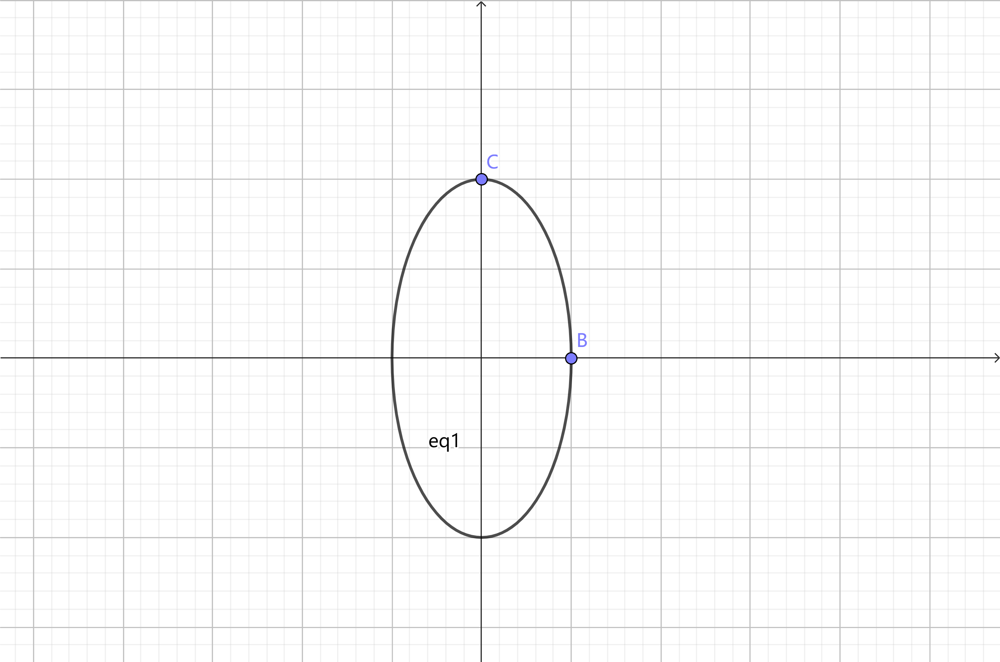
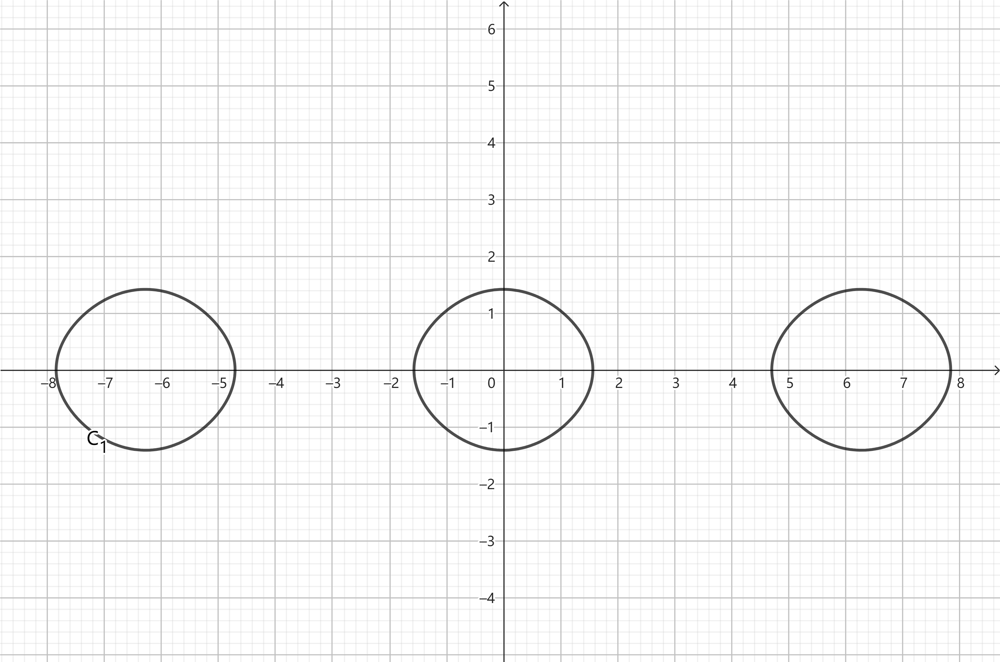
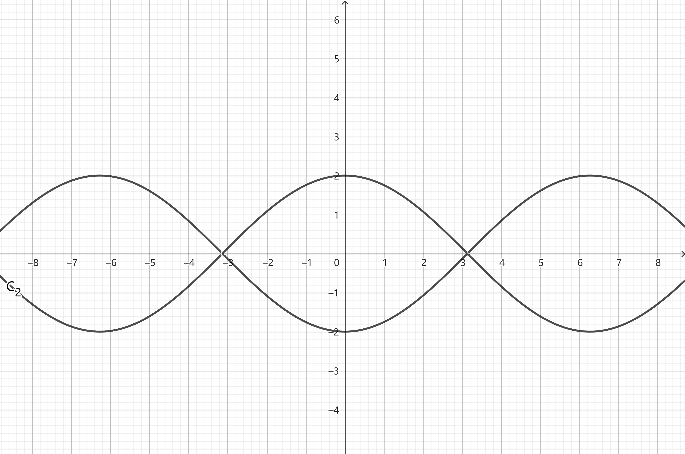
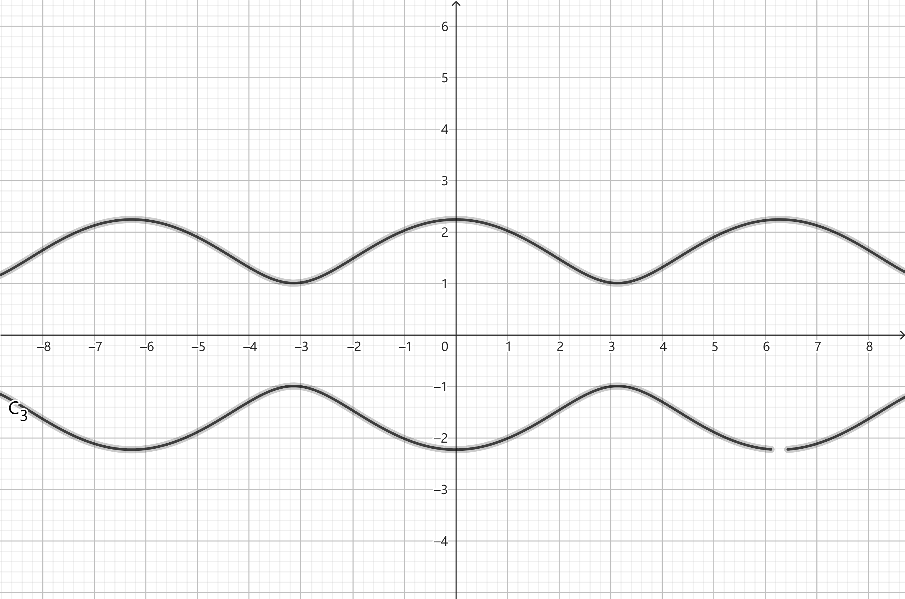

## 1

(a)

正则方程为：

$$
\begin{aligned}
\dot{x}
&=\frac{\partial H}{\partial p} \\
&=\frac{p}{m}
\end{aligned}
$$

$$
\begin{aligned}
\dot{p}
&=-\frac{\partial H}{\partial x} \\
&=-m\omega^2 x
\end{aligned}
$$

得到：

$$
\ddot{x}+\omega^2x
=0 
$$

解得：

$$
x
=A\sin(\omega t+\varphi)
$$

$$
p
=m\dot{x}
=mA\omega\cos(\omega t+\varphi)
$$

消去 $t$ 得：

$$
\frac{x^2}{A^2}+\frac{p^2}{m^2A^2\omega^2}
=1
$$

这是一个 $(x,p)$ 相空间中的椭圆

其中，$B(A,0),C(0,mA\omega)$
 
(b)

$$
\begin{aligned}
\ddot{x}
&=\frac{\mathrm{d}\dot{x}}{\mathrm{d}t} \\
&=\frac{\mathrm{d}\dot{x}}{\mathrm{d}x}\frac{\mathrm{d}x} {\mathrm{d}t} \\
&=\dot{x}\frac{\mathrm{d}\dot{x}}{\mathrm{d}x}
\end{aligned}
$$

代入 $\ddot{x}=-\sin x$ 中，得到：

$$
\dot{x}\mathrm{d}\dot{x}
=-\sin x\mathrm{d}x
$$

积分得：

$$
\frac{\dot{x}^2}{2}
=\cos x+C'
$$

即：

$$
\dot{x}
=\pm\sqrt{2\cos x+C}
$$

当 $C<-2$，无解，没有不动点

当 $C=-2$，则 $x=2k\pi$，$\dot{x}=0$，不动点是分布在 $x$ 轴上的点集 $\{(x,0)|x=2k \pi ,k\in Z\}$

当 $-2<C<2$，

第一类不动点为每个封闭曲线与 $x$ 轴的右交点，以封闭曲线上半支上任何一点为初始状态的质点会向 $x$ 轴正方向运动，最后停在第一类不动点

第二类不动点为每个封闭曲线与 $x$ 轴的左交点，以封闭曲线下半支上任何一点为初始状态的质点会向 $x$ 轴负方向运动，最后停在第二类不动点

当 $C=2$，

所有不动点都一样。以曲线上半支上任何一点为初始状态的质点会向 $x$ 轴正方向运动，最后停在最近的不动点；以曲线下半支上任何一点为初始状态的质点会向 $x$ 轴负方向运动，最后停在最近的不动点

当 $C>2$，

没有不动点。以曲线上半支上任何一点为初始状态的质点会向 $x$ 轴正方向运动，永远不停；以曲线下半支上任何一点为初始状态的质点会向 $x$ 轴负方向运动，永远不停

## 2

(a)

以 $x,y,z$ 为广义坐标，拉式量为：

$$
L
=\frac{1}{2}m(v_x^2+v_y^2+v_z^2)-e\phi+\frac{e}{c}(A_xv_x+A_yv_y+A_zv_z)
$$

计算广义动量：

$$
\left\{
\begin{aligned}
p_x
=\frac{\partial L}{\partial v_x}
=mv_x+\frac{e}{c}A_x \\
p_y
=\frac{\partial L}{\partial v_y}
=mv_y+\frac{e}{c}A_y \\
p_z
=\frac{\partial L}{\partial v_z}
=mv_z+\frac{e}{c}A_z \\
\end{aligned}
\right.
$$

矢量形式为：

$$
\vec{p}
=m\vec{v}+\frac{e}{c}\vec{A}
$$

用广义动量和广义坐标表示广义速度：

$$
\vec{v}
=\frac{\vec{p}}{m}-\frac{e}{cm}\vec{A}
$$

于是得到哈密顿量：

$$
\begin{aligned}
H
&=-L+\sum_{\alpha} p_\alpha\dot{q}_\alpha \\
&=-\frac{1}{2}mv^2+e\phi-\frac{e}{c}\vec{A}\cdot\vec{v}+(m\vec{v}+\frac{e}{c}\vec{A})\cdot\vec{v} \\
&=e\phi+\frac{1}{2m}(\vec{p}-\frac{e}{c}\vec{A})^2
\end{aligned}
$$

(b)

正则方程的矢量形式为

$$
\begin{aligned}
\dot{\vec{r}}
&=\frac{\partial H}{\partial \vec{p}} \\
&=\frac{1}{m}(\vec{p}-\frac{e}{c}\vec{A})
\end{aligned}
$$

$$
\begin{aligned}
\dot{\vec{p}}
&=-\frac{\partial H}{\partial \vec{r}} \\
&=-e\nabla\phi+\frac{e}{mc}(\vec{p}-\frac{e}{c}\vec{A})\nabla\cdot\vec{A}
\end{aligned}
$$

两者联立，消去 $\vec{p},\dot{\vec{p}}$ 得： 

$$
m\ddot{\vec{r}}+e\nabla\phi
=\vec{0} \tag{1}
$$

原来的欧拉-拉格朗日方程为：

$$
\frac{\mathrm{d}}{\mathrm{d}t}\frac{\partial L}{\partial \dot{q}_\alpha}-\frac{\partial L}{\partial q_\alpha}
=0
$$

矢量形式为：

$$
\frac{\mathrm{d}}{\mathrm{d}t}\frac{\partial L}{\partial \dot{\vec{r}}}-\frac{\partial L}{\partial \vec{r}}
=\vec{0}
$$

代入 $L=\frac{1}{2}mv^2-e\phi+\frac{e}{c}\vec{A}\cdot\vec{v} $ 得：

$$
m\ddot{\vec{r}}+e\nabla\phi
=\vec{0} \tag{2}
$$

方程 $(1)(2)$ 完全一样

## 3

选取直角坐标 $x_1,x_2,x_3$ 为广义坐标

计算广义动量：

$$
p_\alpha
=\frac{\partial L}{\partial \dot{x}_\alpha}
=m_0\frac{\dot{x}_\alpha}{\sqrt{1-\frac{v^2}{c^2}}},~~ \alpha=1,2,3
$$

用广义动量和广义坐标表示广义速度：

$$
v^2
=\frac{c^2p^2}{m_0^2c^2+p^2}
$$

于是得到哈密顿量：

$$
\begin{aligned}
H
&=-L+\sum_{\alpha=1}^{3} p_\alpha\dot{q}_\alpha \\
&=m_0c^2\sqrt{1-\frac{v^2}{c^2}}+\frac{m_0v^2}{\sqrt{1-\frac{v^2}{c^2}}} \\
&=c\sqrt{m_0^2c^2+p^2} \\
&=\sqrt{m_0^2c^4+c^2p^2}
\end{aligned}
$$

## 4

(a)

泊松括号的定义为：

$$
\{f,g\}
\equiv\sum_{\alpha}(\frac{\partial f}{\partial q_\alpha}\frac{\partial g}{\partial p_\alpha}-\frac{\partial f}{\partial p_\alpha}\frac{\partial g}{\partial q_\alpha})
$$

用泊松括号表示的正则方程为：

$$
\dot{q}_\alpha
=\{q_\alpha,H\}
$$

$$
\dot{p}_\alpha
=\{p_\alpha,H \}
$$

(b)

采用爱因斯坦求和约定：

$$
\vec{r}
=x_i\vec{e}_i
$$

$$
\vec{p}
=p_j\vec{e}_j
$$

$$
\vec{J}
=\vec{r}\times\vec{p}
=\varepsilon_{ijk}x_i p_j\vec{e}_k
$$

$$
J_k
=\varepsilon_{ijk}x_ip_j
$$

于是：

$$
\begin{aligned}
\{J_a,p_b\}
&=\sum_{\alpha}(\frac{\partial J_a}{\partial q_\alpha}\frac{\partial p_b}{\partial p_\alpha}-\frac{\partial J_a}{\partial p_\alpha}\frac{\partial p_b}{\partial q_\alpha}) \\
&=\frac{\partial J_a}{\partial x_b} \\
&=\frac{\partial (\varepsilon_{ija}x_ip_j)}{\partial x_b} \\
&=\varepsilon_{bja}p_j \\
&=\varepsilon_{abj}p_j \\
&=\varepsilon_{abc}p_c
\end{aligned}
$$

$$
\begin{aligned}
\{J_a,x_b\}
&=\sum_{\alpha}(\frac{\partial J_a}{\partial q_\alpha}\frac{\partial x_b}{\partial p_\alpha}-\frac{\partial J_a}{\partial p_\alpha}\frac{\partial x_b}{\partial q_\alpha}) \\
&=-\frac{\partial J_a}{\partial p_b} \\
&=-\frac{\partial(\varepsilon_{ija}x_ip_j)}{\partial p_b} \\
&=-\varepsilon_{iba} x_i \\
&=\varepsilon_{abi} x_i \\
&=\varepsilon_{abc}x_c
\end{aligned}
$$

$$
\begin{aligned}
\{J_a,J_b \}
&=\sum_{\alpha}(\frac{\partial J_a}{\partial q_\alpha}\frac{\partial J_b}{\partial p_\alpha}-\frac{\partial J_a}{\partial p_\alpha}\frac{\partial J_b}{\partial q_\alpha}) \\
&=\frac{\partial (\varepsilon_{ija}x_ip_j)}{\partial x_\alpha}\frac{\partial (\varepsilon_{lmb}x_lp_m)}{\partial p_\alpha}-\frac{\partial (\varepsilon_{ija}x_ip_j)}{\partial p_\alpha}\frac{\partial (\varepsilon_{lmb}x_lp_m)}{\partial x_\alpha} \\
&=\varepsilon_{\alpha ja}p_j\cdot \varepsilon_{l\alpha b}x_l-\varepsilon_{i\alpha a}x_i\cdot\varepsilon_{\alpha m b}p_m \\
&=\varepsilon_{\alpha ja}\varepsilon_{\alpha bl}x_lp_j+\varepsilon_{\alpha ia}\varepsilon_{\alpha mb}x_ip_m \\
&=(\delta_{jb}\delta_{al}-\delta_{jl}\delta_{ab})x_l p_j+(\delta_{im}\delta_{ab}-\delta_{ib}\delta_{am})x_ip_m \\
&=x_ap_b-\delta_{ab} x_jp_j+\delta_{ab}x_mp_m-x_bp_a \\
&=x_ap_b-x_bp_a \\
\end{aligned}
$$

而：

$$
\begin{aligned}
\varepsilon_{abc}J_c
&=\varepsilon_{abc}\varepsilon_{ijc}x_i p_j \\
&=\varepsilon_{cba}\varepsilon_{cji}x_ip_j \\
&=(\delta_{bj}\delta_{ai}-\delta_{bi}\delta_{aj})x_ip_j \\
&=x_ap_b-x_bp_a
\end{aligned}
$$

于是：

$$
\{J_a,J_b \}
=\varepsilon_{abc}J_c
$$

(c)

注意到：

$$
\begin{aligned}
\{J_a,J^2 \}
&=\{J_a,J\cdot J \} \\
&=J\{J_a,J\}+\{J_a,J\}J \\
&=2J\{J_a,J\}
\end{aligned}
$$

要证明 $\{J_a,J\}=0$，只需要证明 $\{J_a,J^2 \}=0$

注意到：

$$
\begin{aligned}
\{J_a,J^2 \}
&=\{J_a,J_1^2+J_2^2+J_3^2 \} \\
&=\{J_a,J_1^2 \}+\{J_a,J_2^2 \}+\{J_a,J_3^2 \} \\
&=2J_1\{J_a,J_1 \}+2J_2\{J_a,J_2 \}+2J_3\{J_a,J_3 \} \\
&=2J_1\varepsilon_{a1c}J_c+2J_2\varepsilon_{a2c}J_c+2J_3\varepsilon_{a3c}J_c \\
&=2J_c(J_1\varepsilon_{a1c}+J_2\varepsilon_{a2c}+J_3\varepsilon_{a3c}) \\
&=2\varepsilon_{abc} J_bJ_c
\end{aligned}
$$

当 $a=1$，

$$
\begin{aligned}
\{J_1,J^2 \}
&=2\varepsilon_{1bc}J_bJ_c \\
&=2J_2J_3-2J_2J_3 \\
&=0
\end{aligned}
$$

当 $a=2$，

$$
\begin{aligned}
\{J_2,J^2 \}
&=2\varepsilon_{2bc}J_bJ_c \\
&=-2J_1J_3+2J_1J_3 \\
&=0
\end{aligned}
$$

当 $a=3$，

$$
\begin{aligned}
\{J_3,J^2 \}
&=2\varepsilon_{3bc}J_bJ_c \\
&=2J_1J_2-2J_1J_2 \\
&=0
\end{aligned}
$$

综上，$\{J_a,J^2\}=0$，于是 $\{J_a,J\}=0$

(d)

设角动量的第一个分量 $J_a$ 和第二个分量 $J_b$ 是守恒量，其中 $a\ne b$，(b)中的结论给出：

$$
\{J_a,J_b\}
=\varepsilon_{abc}J_c
$$

泊松定理说，若 $f,g$ 都是守恒量，则 $\{f,g\}$ 也是守恒量，在这里得到 $\varepsilon_{abc}J_c$ 也是守恒量

当 $a\ne b\ne c$ 时，$\varepsilon_{abc}=1或-1$ 是个常数，于是角动量的第三个分量 $J_c$ 也是个守恒量

(e)

注意到：

$$
\begin{aligned}
\{J_a,p^2 \}
&=\{J_a,p_b p_b \} \\
&=2p_b\{J_a,p_b \} \\
&=2p_b\varepsilon_{abc} p_c \\
&=-2\varepsilon_{cba} p_c p_b \\
&=-2(\vec{p}\times\vec{p})_a \\
&=0
\end{aligned}
$$

$$
\begin{aligned}
\{J_a, r^2\}
&=\{J_a,x_b x_b \} \\
&=2x_b\{J_a,x_b\} \\
&=2x_b\varepsilon_{abc} x_c \\
&=-2\varepsilon_{cba}x_c x_b \\
&=-2(\vec{r}\times\vec{r})_a \\
&=0
\end{aligned} 
$$

而 $H=\frac{p^2}{2m}+V(r)=\frac{p^2}{2m}+V(\sqrt{r^2}) $

于是：

$$
\{J_a, H\}
=0
$$

于是：

$$
\begin{aligned}
\frac{\mathrm{d}J_a}{\mathrm{d}t}
&=\frac{\partial J_a}{\partial t}+\{J_a,H\} \\
&=\{J_a,H\} \\
&=0
\end{aligned}
$$

这就是说，$J_a$ 是个守恒量

而：

$$
\begin{aligned}
\frac{\mathrm{d}J_a^2}{\mathrm{d}t}
&=2J_a\frac{\mathrm{d}J_a}{\mathrm{d}t} \\
&=0 
\end{aligned}
$$

于是：

$$
\frac{\mathrm{d}J^2}{\mathrm{d}t}
=\frac{\mathrm{d}}{\mathrm{d}t}(J_1^2+J_2^2+J_3^2)
=0
$$

这就是说，$J^2$ 也是个守恒量

## 5

$y=ax^2\Longrightarrow \dot{y}=2ax\dot{x}$ 

动能：

$$
\begin{aligned}
T
&=\frac{1}{2}m(\dot{x}^2+\dot{y}^2+\omega^2 x^2) \\
&=\frac{1}{2}m(\dot{x}^2+4a^2x^2\dot{x}^2+\omega^2 x^2)
\end{aligned}
$$

选取原点所在平面为零势能面，则势能为：

$$
\begin{aligned}
V
&=mg y \\
&=mgax^2
\end{aligned}
$$

拉格朗日量为：

$$
\begin{aligned}
L
&=T-V \\
&=\frac{1}{2}m(\dot{x}^2+4a^2x^2\dot{x}^2+\omega^2 x^2)-mgax^2
\end{aligned}
$$

计算广义坐标 $x$ 对应的广义动量 $p_x$：

$$
\begin{aligned}
p_x
&\equiv \frac{\partial L}{\partial \dot{x}} \\
&=m\dot{x}+4ma^2x^2\dot{x}
\end{aligned}
$$

用广义坐标 $x$ 和广义动量 $p_x$ 表示广义速度 $\dot{x}$：

$$
\dot{x}
=\frac{p_x}{m+4ma^2x^2}
$$

哈密顿量为：

$$
\begin{aligned}
H
&=-L+p_x\dot{x} \\
&=mgax^2-\frac{1}{2}m\omega^2 x^2+\frac{1}{2m}\cdot\frac{p_x^2}{1+4a^2x^2} \\
\end{aligned}
$$

正则方程为：

$$
\begin{aligned}
\dot{x}
&=\frac{\partial H}{\partial p_x} \\
&=\frac{p_x}{m(1+4a^2x^2)}
\end{aligned}
$$

$$
\begin{aligned}
\dot{p}_x
&=-\frac{\partial H}{\partial x} \\
&=-2mgax+m\omega^2 x+\frac{4a^2x p_x^2}{m(1+4a^2x^2)^2}
\end{aligned}
$$

消去 $p_x$ 得：

$$
(1+4a^2x^2)\ddot{x}+4a^2 x\dot{x}^2+(2ga-\omega^2)x
=0
$$

## 6

(a)

广义坐标的选取为：圆锥内质点的三个球坐标 $r,\theta,\varphi$ 和圆锥表面上的质点的方位角 $\phi$ 为广义坐标

$$
\vec{r}_1
=r\sin\theta\cos\varphi\vec{e}_x+r\sin\theta\sin\varphi\vec{e}_y+r\cos\theta\vec{e}_z
$$

$$
\begin{aligned}
\vec{r}_2
&=(L-r)\sin(\pi-\alpha)\cos\phi\vec{e}_x+(L-r)\sin(\pi-\alpha)\sin\phi\vec{e}_y+(L-r)\cos(\pi-\alpha)\vec{e}_z \\
&=(L-r)\sin\alpha\cos\phi\vec{e}_x+(L-r)\sin\alpha\sin\phi\vec{e}_y-(L-r)\cos\alpha\vec{e}_z
\end{aligned}
$$

动能：

$$
\begin{aligned}
T
&=\frac{1}{2}m\dot{\vec{r}}_1^2+\frac{1}{2}m\dot{\vec{r}}_2^2 \\
&=\frac{1}{2}m(\dot{r}^2+r^2\dot{\theta}^2+r^2\dot{\varphi}^2\sin^2\theta)+\frac{1}{2}m(\dot{r}^2+(L-r)^2\dot{\phi}^2\sin^2(\pi-\alpha)) \\
&=\frac{1}{2}m(\dot{r}^2+r^2\dot{\theta}^2+r^2\dot{\varphi}^2\sin^2\theta)+\frac{1}{2}m(\dot{r}^2+(L-r)^2\dot{\phi}^2\sin^2\alpha) \\
\end{aligned} 
$$

选取 $xOy$ 平面为零势能面，势能为：

$$
\begin{aligned}
V
&=mgr\cos\theta+mg(L-r)\cos(\pi-\alpha) \\
&=mgr\cos\theta-mg(L-r)\cos\alpha
\end{aligned}
$$

拉格朗日函数为：

$$
\begin{aligned}
\mathscr{L}
&=T-V \\
&=\frac{1}{2}m(\dot{r}^2+r^2\dot{\theta}^2+r^2\dot{\varphi}^2\sin^2\theta)+\frac{1}{2}m(\dot{r}^2+(L-r)^2\dot{\phi}^2\sin^2\alpha)-mgr\cos\theta+mg(L-r)\cos\alpha
\end{aligned}
$$

(b)

计算广义动量：

$$
\begin{aligned} 
p_r
&=\frac{\partial \mathscr{L}}{\partial \dot{r}} \\
&=2m\dot{r}
\end{aligned}
$$

$$
\begin{aligned}
p_\theta
&=\frac{\partial \mathscr{L}}{\partial \dot{\theta}} \\
&=mr^2\dot{\theta}
\end{aligned}
$$

$$
\begin{aligned}
p_\varphi
&=\frac{\partial \mathscr{L}}{\partial \dot{\varphi}} \\
&=mr^2\dot{\varphi}\sin^2\theta
\end{aligned}
$$

$$
\begin{aligned}
p_\phi
&=\frac{\partial \mathscr{L}}{\partial \dot{\phi}} \\
&=m(L-r)^2\dot{\phi}\sin^2\alpha
\end{aligned}
$$

用广义坐标和广义动量表示广义速度：

$$
\dot{r}
=\frac{p_r}{2m}
$$

$$
\dot{\theta}
=\frac{p_\theta}{mr^2}
$$

$$
\dot{\varphi}
=\frac{p_\varphi}{mr^2\sin^2\theta}
$$

$$
\dot{\phi}
=\frac{p_\phi}{m(L-r)^2\sin^2\alpha}
$$

哈密顿量为：

$$
\begin{aligned}  
H
&=T+V \\
&=\frac{p_r^2}{4m}+\frac{p_\theta^2}{2mr^2}+\frac{p_\varphi^2}{2mr^2\sin^2\theta}+\frac{p_\phi^2}{2m(L-r)^2\sin^2\alpha}+mgr\cos\theta-mg(L-r)\cos\alpha
\end{aligned}
$$

(c)

正则方程为：

$$
\dot{q}_\alpha
=\frac{\partial H}{\partial p_\alpha}
$$

$$
\dot{p}_\alpha
=-\frac{\partial H}{\partial q_\alpha}
$$

$r$ 满足的方程：

$$
2\ddot{r}
-(\dot{\theta}^2+\dot{\varphi}^2\sin^2\theta+\dot{\phi}^2\sin^2\alpha)r+L\dot{\phi}^2\sin^2\alpha+g\cos\theta+g\cos\alpha
=0 \tag{1}
$$

$\theta$ 满足的方程：

$$
r\ddot{\theta}+2\dot{r}\dot{\theta}-r\dot{\varphi}^2\sin\theta\cos\theta-g\sin\theta
=0 \tag{2}
$$

$\varphi$ 满足的方程：

$$
mr^2\sin^2\theta\cdot\dot{\varphi}
=C_1
$$

或：

$$
r\sin\theta\cdot\ddot{\varphi}+(2\dot{r}\sin\theta+2r\dot{\theta}\cos\theta)\dot{\varphi}
=0
$$

$\phi$ 满足的方程：

$$
m(L-r)^2\sin^2\alpha\cdot\dot{\phi}
=C_2
$$

或：

$$
(L-r)\ddot{\phi}-2\dot{\phi}
=0
$$

(d)

$H$ 不显含时间 $t$，体系具有时间平移不变性，能量守恒 

$H$ 不显含 $\varphi$，于是 $\varphi$ 对应的广义动量 $p_\varphi$ 是守恒量

$H$ 不显含 $\phi$，于是 $\phi$ 对应的广义动量 $p_\phi$ 是守恒量

(e)

当 $r,\theta,\dot{\varphi}$ 均为常数时，由方程 $(2)$ 得：

$$
\dot{\varphi}^2
=\frac{-g}{r\cos\theta}
$$

代 入方程 $(1)$ 得：

$$
\dot{\phi}
=\sqrt{\frac{g(1-\cos\alpha)}{(L-r)\sin^2\alpha}}
$$
 

