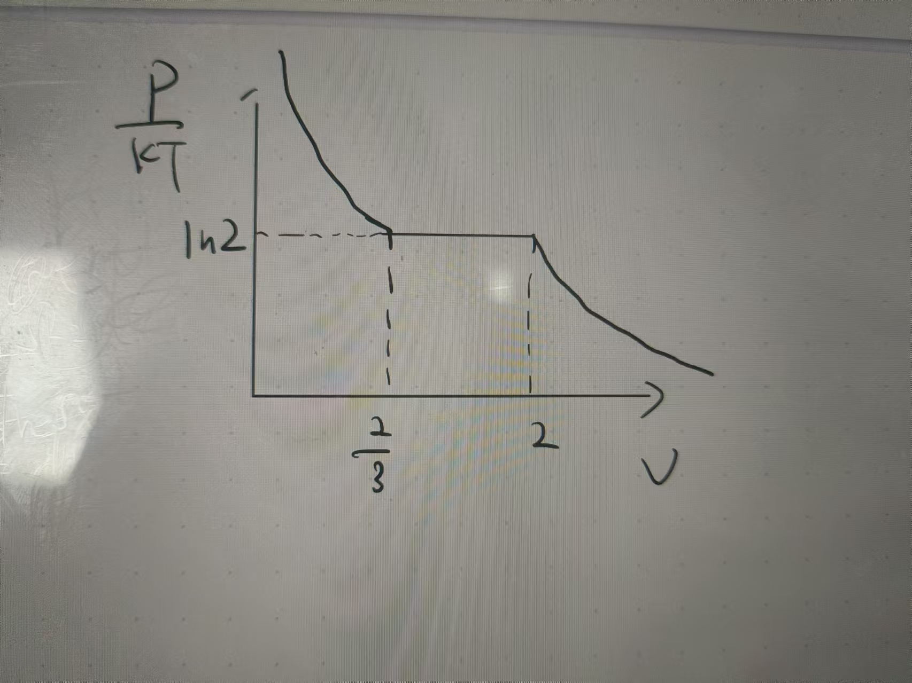

# 1

在半经典近似下，一个热力学系统的巨配分函数可以写成：

$$
\Xi
=\sum_{N=0}^{\infty} \frac{y^N }{N! } Q_N
$$

其中，$y=\mathrm{e}^{\mu/kT}/\lambda^3$，$\mu $ 为化学势，$k $ 为玻尔兹曼常数，热波长 $\lambda=\sqrt{\frac{2\pi }{mkT } }\hbar $

$$
Q_N
=\int\limits_{V}\cdots \int\limits_V \mathrm{d}\tau_1\cdots\mathrm{d}\tau_N \exp\left(-U/kT \right)
$$

$U $ 为粒子间的相互作用势。

## (a)

> 试从半经典近似出发，简要推导出上述 $\Xi $ 的表达式。

$$
\begin{aligned}
\Xi
&=\sum_{N=0}^{\infty} \sum_{s} \exp\left(-\alpha N-\beta E_s \right) \\
&=\sum_{N=0}^{\infty} \exp\left(\frac{\mu N }{kT }  \right)\sum_{s} \exp\left(-\frac{E_s }{kT }  \right) \\
&=\sum_{N=0}^{\infty} \exp\left(\frac{\mu N }{kT }  \right) \frac{1 }{N! \left(2\pi \hbar \right)^{3N} } \int\mathrm{d} q_1\cdots\mathrm{d}q_{3N} \mathrm{d}p_1\cdots\mathrm{d}p_{3N} \exp\left[-\frac{1 }{kT }\left(U+ \sum_{i=1}^{3N} \frac{p_i^2 }{2m } \right) \right] \\
&=\sum_{N=0}^{\infty} \exp\left(\frac{\mu N }{kT }  \right) \frac{1 }{N! \left(2\pi \hbar \right)^{3N} } \int\mathrm{d} q_1\cdots\mathrm{d}q_{3N} \exp\left(-\frac{U }{kT }  \right) \int \exp\left(-\frac{p_1^2 }{2mkT }  \right)\mathrm{d}p_1\int\cdots \int\exp\left(-\frac{p_{3N}^2 }{2mkT }  \right)\mathrm{d}p_{3N} \\
&=\sum_{N=0}^{\infty} \exp\left(\frac{\mu N }{kT }  \right) \frac{1 }{N! \left(2\pi \hbar \right)^{3N} } \left(\sqrt{2\pi mkT} \right)^{3N} \int\limits_{V}\cdots \int\limits_V \mathrm{d}\tau_1\cdots\mathrm{d}\tau_N \exp\left(-U/kT \right) \\
&=\sum_{N=0}^{\infty} \exp\left(\frac{\mu N }{kT }  \right) \frac{1 }{N! } \left(\frac{\sqrt{mkT} }{\hbar\sqrt{2\pi} }  \right)^{3N} \int\limits_{V}\cdots \int\limits_V \mathrm{d}\tau_1\cdots\mathrm{d}\tau_N \exp\left(-U/kT \right) \\
&=\sum_{N=0}^{\infty} \exp\left(\frac{\mu N }{kT }  \right) \frac{1 }{N! } \left(\frac{1 }{\lambda }   \right)^{3N} \int\limits_{V}\cdots \int\limits_V \mathrm{d}\tau_1\cdots\mathrm{d}\tau_N \exp\left(-U/kT \right) \\
&=\sum_{N=0}^{\infty} \frac{1 }{N! } \left(\frac{\exp\left(\mu/kT \right) }{\lambda^3  } \right)^N  \int\limits_{V}\cdots \int\limits_V \mathrm{d}\tau_1\cdots\mathrm{d}\tau_N \exp\left(-U/kT \right) \\
&=\sum_{N=0}^{\infty} \frac{y^N }{N! } Q_N
\end{aligned}
$$

## (b)

>从基本的热力学关系出发，证明系统的压强和密度满足：
>
>$$
\frac{p }{kT } = \frac{1 }{V } \ln \Xi,\quad
\rho = \frac{\partial }{\partial\ln y } \frac{1 }{V } \ln \Xi
>$$

### 方法1

巨势 $\Omega $：

$$
\Omega\equiv U-TS-\mu N
$$

$$
\mathrm{d}\Omega
=-S\mathrm{d}T-N\mathrm{d}\mu-p\mathrm{d}V
$$

均相系的巨势：

$$
\Omega = -pV
$$

理想气体的巨势：

$$
\Omega=-kT\ln\Xi
$$

联立可得：

$$
\frac{p }{kT } = \frac{1 }{V } \ln \Xi
$$

---

$$
\mathrm{d}\Omega
=-S\mathrm{d}T-p\mathrm{d}V-\mu\mathrm{d}N
$$

$$
\begin{aligned}
N
&=-\left(\frac{\partial \Omega }{\partial \mu }  \right)_{T,V} \\
&=\left(\frac{\partial \left(p V \right) }{\partial \mu }  \right)_{T,V} \\
&=V\left(\frac{\partial p }{\partial \mu }  \right)_{T,V}
\end{aligned}
$$

$$
y=\mathrm{e}^{\mu/kT}/\lambda^3,\quad
\left(\frac{\partial y }{\partial \mu }  \right)_T = \frac{1 }{kT }  y
$$

密度：

$$
\begin{aligned}
\rho
&=\frac{N }{V } \\
&=\left(\frac{\partial p }{\partial \mu }  \right)_{T,V} \\
&=\left(\frac{\partial y }{\partial \mu }  \right)_{T,V}\left(\frac{\partial p }{\partial y }  \right)_{T,V} \\
&=\frac{1 }{kT } y \left(\frac{\partial p }{\partial y }  \right)_{T,V} \\
&=y\left(\frac{\partial \left(p/kT \right) }{\partial y }  \right)_{T,V} \\
&=y\left(\frac{\partial }{\partial y } \frac{1 }{V } \ln \Xi \right)_{T,V} \\
&=\frac{\partial }{\partial\ln y } \frac{1 }{V } \ln \Xi
\end{aligned}
$$

### 方法2

---

当相互作用势 $U\to 0 $，有：

$$
\begin{aligned}
Q_N
&=\int\cdots \int\limits_V \mathrm{d}\tau_1\cdots\mathrm{d}\tau_N \exp\left(-U/kT \right) \\
&=V^N
\end{aligned}
$$

$$
\Xi
=\sum_{N=0}^{\infty} \frac{y^N }{N! } Q_N
=\sum_{N=0}^{\infty} \frac{y^N V^N }{N! } 
=\mathrm{e}^{yV}
$$

由 $\displaystyle{p=\frac{1 }{\beta } \frac{\partial }{\partial V } \ln \Xi }$ 可得：

$$
\begin{aligned}
\frac{p }{kT } 
&=\frac{\partial  }{\partial V } \ln \Xi \\
&=\frac{\partial  }{\partial V } \ln \left(\mathrm{e}^{yV} \right) \\
&=\frac{\partial }{\partial V } \left(yV \right) \\
&=y \\
&=\frac{\ln \left(\mathrm{e}^{yV} \right) }{V } \\
&=\frac{1 }{V } \ln \Xi
\end{aligned}
$$
 
---

注意到 $y=\mathrm{e}^{\mu/kT}/\lambda^3=\mathrm{e}^{-\alpha}/\lambda^3 $，于是：

$$
\begin{aligned}
\frac{\partial }{\partial \alpha } 
&=\frac{\mathrm{d} y }{\mathrm{d} \alpha } \frac{\partial  }{\partial y } \\
&=\frac{-\mathrm{e}^{-\alpha} }{\lambda^3 } \frac{\partial }{\partial y } \\
&=-y\frac{\partial }{\partial y } \\
&=-\frac{\partial }{\partial \ln y } 
\end{aligned}
$$

巨正则系综平均粒子数：

$$
\begin{aligned}
\bar{N}
&=-\frac{\partial }{\partial \alpha } \ln \Xi \\
&=\frac{\partial }{\partial \ln y } \ln \Xi \\
\end{aligned}
$$

巨正则系综密度：

$$
\begin{aligned}
\rho
&=\frac{\bar{N} }{V } \\
&=\frac{\partial }{\partial\ln y } \frac{1 }{V } \ln \Xi
\end{aligned}
$$

## (c)

> 证明无相互作用时，系统满足理想气体状态方程：
>
>$$
\frac{p }{kT } = \rho
>$$

无相互作用时 $U= 0 $，则：

$$
\begin{aligned}
Q_N
&=\int\limits_{V}\cdots \int\limits_V \mathrm{d}\tau_1\cdots\mathrm{d}\tau_N \exp\left(-U/kT \right) \\
&=V^N
\end{aligned}
$$

$$
\Xi
=\sum_{N=0}^{\infty} \frac{y^N }{N! } Q_N
=\sum_{N=0}^{\infty} \frac{y^N V^N }{N! } 
=\mathrm{e}^{yV}
$$

因此：

$$
\begin{aligned}
\frac{p }{kT } 
&=\frac{1 }{V } \ln \Xi \\
&=\frac{1 }{V } \left(y V \right) \\
&=y
\end{aligned}
$$

$$
\begin{aligned}
\rho
&=\frac{\partial }{\partial\ln y } \frac{1 }{V } \ln \Xi \\
&=\frac{\mathrm{d} y }{\mathrm{d} \ln y} \frac{\partial }{\partial y } \frac{1 }{V } \ln \Xi \\
&=y\frac{\partial  }{\partial y } \frac{1 }{V } \left(y V \right) \\
&=y
\end{aligned}
$$

对比可得：

$$
\frac{p }{kT } = \rho
$$

# 2

考虑一个系统，其巨配分函数满足：

$$
\Xi(z)
=\frac{\left(1+z \right)^V\left(1-z^V \right) }{1-z } 
$$

其中，体积 $V $ 是正整数。

## (a)

> 试对该巨配分函数的零点分布进行讨论，证明其零点均分布在单位圆上。

考虑 $(1+z)^V $，其根为 $z=-1 $，是 $V $ 重根，在单位圆上；

考虑 $\displaystyle{\frac{1-z^V }{1-z }  }$，由于 $1-z^V $ 的零点为：

$$
\mathrm{e}^{\mathrm{i}0\cdot2\pi /V}=1,
\mathrm{e}^{\mathrm{i}1\cdot 2\pi/V},
\mathrm{e}^{\mathrm{i}2\cdot 2\pi/V},\cdots
\mathrm{e}^{\mathrm{i}(V-1)\cdot2\pi/V}
$$

共 $V $ 个不同零点。

因此，$1-z^V $ 可拆分为：

$$
1-z^V
=-(z-1)\left(z-\mathrm{e}^{\mathrm{i}2\pi/V}\right)\left(z-\mathrm{e}^{\mathrm{i}4\pi/V} \right)\cdots\left(z-\mathrm{e}^{\mathrm{i}(V-1)2\pi/V} \right)
$$

因此：

$$
\frac{1-z^V }{1-z } 
=\left(z-\mathrm{e}^{\mathrm{i}2\pi/V}\right)\left(z-\mathrm{e}^{\mathrm{i}4\pi/V} \right)\cdots\left(z-\mathrm{e}^{\mathrm{i}(V-1)2\pi/V} \right)
$$

综上，

$$
\begin{aligned}
\Xi(z)
&=\frac{\left(1+z \right)^V\left(1-z^V \right) }{1-z } \\
&=-(1+z)^V \left(z-\mathrm{e}^{\mathrm{i}2\pi/V}\right)\left(z-\mathrm{e}^{\mathrm{i}4\pi/V} \right)\cdots\left(z-\mathrm{e}^{\mathrm{i}(V-1)2\pi/V} \right)
\end{aligned}
$$

其零点为：

$$
-1,
\mathrm{e}^{\mathrm{i}1\cdot 2\pi/V},
\mathrm{e}^{\mathrm{i}2\cdot 2\pi/V},\cdots
\mathrm{e}^{\mathrm{i}(V-1)\cdot2\pi/V}
$$

显然，这些零点都在单位圆上。

## (b)

> 试确定其零点密度函数 $g(\theta) $，$Vg(\theta)\mathrm{d}\theta $ 等于落在区间 $\left(\mathrm{e}^{\mathrm{i}\theta},\mathrm{e}^{\mathrm{i}(\theta+\mathrm{d}\theta)} \right) $ 内的根的数目。

由于根在单位圆上分立分布，因此 $g(\theta) $ 应为多个 $\delta $ 函数的叠加（重根只计算一次）

当 $V $ 为奇数，有：

$$
g(\theta)
=C_1\left[\delta(\theta-\pi) + \sum_{j=1}^{V-1} \delta\left(\theta-2\pi j/V \right) \right]
$$

其中，$C_1 $ 是归一化系数。

零点密度函数应满足：

$$
\int_{\theta=0}^{\theta=2\pi} V g(\theta)\mathrm{d}\theta
=V
$$

即：

$$
\int_{\theta=0}^{\theta=2\pi} V\cdot C_1\left[\delta(\theta-\pi) + \sum_{j=1}^{V-1} \delta\left(\theta-2\pi j/V \right) \right] \mathrm{d}\theta
=V
$$

解得：

$$
C_1 = \frac{1 }{V } 
$$

于是当 $V $ 为奇数，零点密度函数为：

$$
g(\theta)
=\frac{1 }{V } \left[\delta(\theta-\pi) + \sum_{j=1}^{V-1} \delta\left(\theta-2\pi j/V \right) \right]
$$

当 $V $ 为偶数，有：

$$
g(\theta)
=C_2 \sum_{j=1}^{V-1} \delta\left(\theta-2\pi j/V \right)
$$

其中，$C_2 $ 是归一化系数。

零点密度函数应满足：

$$
\int_{\theta=0}^{\theta=2\pi} V g(\theta)\mathrm{d}\theta
=V-1
$$

即：

$$
\int_{\theta=0}^{\theta=2\pi} V\cdot C_2 \sum_{j=1}^{V-1} \delta\left(\theta-2\pi j/V \right) \mathrm{d}\theta
=V-1
$$

解得：

$$
C_2 = \frac{1 }{V } 
$$

综上，若 $V $ 为奇数，则零点密度函数为：

$$
g(\theta)
=\frac{1 }{V } \left[\delta(\theta-\pi) + \sum_{j=1}^{V-1} \delta\left(\theta-2\pi j/V \right) \right]
$$

若 $V $ 为偶数，则零点密度函数为：

$$
g(\theta)
=\frac{1 }{V } \sum_{j=1}^{V-1} \delta\left(\theta-2\pi j/V \right)
$$

## (c)

> 从该巨配分函数出发，计算在热力学极限 $V\to +\infty $ 下，$p/kT $ 及 $\rho $ 的表达式，并对其函数行为进行讨论。

$$
\Xi(z)
=\frac{\left(1+z \right)^V\left(1-z^V \right) }{1-z } 
$$

$$
\begin{aligned}
\frac{1 }{V } \ln \Xi
&=\frac{1 }{V } \left[V\ln(1+z) + \ln\left(\frac{1-z^V }{1-z }  \right) \right] \\
&=\ln(1+z) + \frac{1 }{V } \ln\left(\frac{1-z^V }{1-z }  \right)
\end{aligned}
$$

当 $z<1$ 时，

$$
\lim_{V\to +\infty} \frac{1 }{V } \ln\left(\frac{1-z^V }{1-z }  \right) = 0 
$$

因此：

$$
\begin{aligned}
\lim_{V\to +\infty} \frac{1 }{V } \ln \Xi
&=\lim_{V\to+\infty} \left[\ln(1+z) + \frac{1 }{V } \ln\left(\frac{1-z^V }{1-z }  \right) \right] \\
&=\ln(1+z)
\end{aligned}
$$

当 $z>1 $ 时，

$$
\begin{aligned}
\lim_{V\to +\infty} \frac{1 }{V } \ln\left(\frac{1-z^V }{1-z }  \right)
&=\lim_{V\to +\infty} \frac{1 }{V } \ln\left(\frac{z^V(z^{-V}-1) }{1-z }  \right) \\
&=\lim_{V\to +\infty} \left[\ln z + \frac{1 }{V } \ln\left(\frac{z^{-V} - 1 }{1-z }  \right) \right] \\
&=\ln z
\end{aligned}
$$

因此：

$$
\begin{aligned}
\lim_{V\to +\infty} \frac{1 }{V } \ln \Xi
&=\lim_{V\to +\infty} \left[\ln(1+z) + \frac{1 }{V } \ln\left(\frac{1-z^V }{1-z }  \right) \right] \\
&=\ln(1+z) + \ln z
\end{aligned}
$$

于是，热力学极限下：

$$
\frac{p }{kT }\bigg|_{V\to+\infty}
=\lim_{V\to+\infty} \frac{1 }{V } \ln \Xi
=\left\{
\begin{aligned}
&\ln (1+z) &,z<1 \\
&\ln (1+z) + \ln z &,z>1
\end{aligned}
\right.
$$

$$
\begin{aligned}
\rho\bigg|_{V\to+\infty}
&=\lim_{V\to+\infty} \frac{\partial }{\partial \ln z } \frac{p }{kT } \\
&=\left\{
\begin{aligned}
&\frac{z }{1+z } &,z<1 \\
&\frac{z }{1+z } + 1 &,z>1
\end{aligned}
\right.
\end{aligned}
$$

热力学极限下，$p/kT $ 关于 $z $ 连续单调递增，但在 $z=1 $ 不可导。

热力学极限下，$\rho $ 关于 $z $ 在 $z=1 $ 处不连续，在 $z\in\left(0,1 \right),z\in \left(1,+\infty \right) $ 区域分别单调递增，$\displaystyle{\lim_{z\to +\infty} \rho } = 2 $ 

## (d)

> 画出 $p\sim v $ 的示意图，其中比体积 $v=1/\rho $，确定相变点的位置。

热力学极限下，

$$
\frac{p }{kT } 
=\left\{
\begin{aligned}
&\ln (1+z) &,z<1 \\
&\ln (1+z) + \ln z &,z>1
\end{aligned}
\right.
$$

$$
v
=\frac{1 }{\rho } 
=\left\{
\begin{aligned}
&\frac{1+z }{z } &,z<1 \\
&\frac{1+z }{2z+1 } &,z>1
\end{aligned}
\right.
$$

$$
\frac{p }{kT } \bigg|_{z\to 0}
=0,\quad
v|_{z\to 0}
=\infty
$$

$$
z\in\left(0,1 \right),当 v\uparrow 时, \frac{p }{kT } \uparrow,v\downarrow,
$$

$$
z=1,\frac{p }{kT } 连续,
\frac{p }{kT } \bigg|_{z=1} = \ln 2;
v不连续,
\lim_{z\to 1^-} v = 2,\quad
\lim_{z\to 1^+} v =\frac{2 }{3 } 
$$

$$
z\in\left(1,+\infty \right),当 v\uparrow 时, \frac{p }{kT } \uparrow,v\downarrow
$$

通过以上分析，可画出 $p/kT\sim v $ 示意图：

    

在图中 $v\in \left(2/3,2 \right),p/kT=\ln 2 $ 区域出现相变。

# 3

假设一个热力学系统配分函数的零点分布在单位圆上，形如 $\mathrm{e}^{\pm\mathrm{i}\theta_1},\mathrm{e}^{\pm\mathrm{i}\theta_2},\cdots. $ 其中 $\theta_{j\pm} $ 满足：

$$
\cos\theta_{j\pm}
=-x^2+\left(1-x^2 \right)\cos\alpha_j
$$

其中 $\alpha_j=\left(2j-1 \right)\pi/N,j=1,2,\cdots,[(N+1)/2] $，常数 $x\in\left(0,1 \right) $

$$
\theta_{j+} = -\theta_{j-},\quad \theta_{j\pm}\in \left(-\pi,\pi \right)
$$

## (a)

> 试对该零点分布进行描述。

由于 $\cos\alpha_{j}\in \left[-1 , 1 \right] $，因此 $\cos\theta_{j\pm} \in \left[-1 , 1-2x^2 \right] $，设临界角 $\theta_c>0 $ 满足：

$$
\cos\theta_c = 1-2x^2
$$

则零点 $\theta_{j\pm} $ 只能分布在单位圆 $\left[\theta_c , 2\pi-\theta_c \right] $ 的范围内。

## (b)

> 在 $N\to \infty $ 时，零点能否落在正实轴上？是否有相变发生？

由于零点 $\theta_{j\pm} $ 只能分布在单位圆 $\left[\theta_c , 2\pi-\theta_c \right] $ 的范围内，而当 $x\in\left(0,1 \right) $ ：

$$
\cos\theta_c = 1-2x^2\in \left(-1,1 \right)
$$

因此：

$$
\theta_c \in \left(0,2\pi \right)
$$

所以  $\forall j,\theta_{j\pm}\ne 0 $，所以在 $N\to \infty $ 时零点不能落在正实轴上，也就没有相变发生。

## (c)

> 证明零点密度函数 $g(\theta) $ 满足：
>
>$$
g(\theta)
=\left\{
\begin{aligned}
&\frac{1 }{2\pi } \frac{\sin\left(\theta/2 \right) }{\sqrt{\sin^2\frac{\theta }{2 } -x^2} } &&, \cos\theta<1-2x^2 \\
&0 &&, \cos\theta>1-2x^2
\end{aligned}
\right.
> $$

### $\cos\theta>1-2x^2 $ 范围

由 (b) 可知，零点 $\theta_{j\pm} $ 只能分布在单位圆 $\left[\theta_c , 2\pi-\theta_c \right] $ 的范围内，而

$$
\cos\theta_c = 1-2x^2
$$

因此，当 $\cos\theta>1-2x^2 $ 时没有零点分布，即：

$$
g(\theta) = 0,\quad \cos\theta>1-2x^2
$$

### $\cos\theta<1-2x^2 $ 范围

令：

$$
\cos\theta = -x^2+\left(1-x^2 \right)\cos\alpha,\quad\alpha\in\left(0,\pi \right),\quad \theta\in \left(-\pi,\pi \right)
$$

其中，$\alpha,\theta $ 是连续变量。

$$
\sin\alpha = \sqrt{1-\cos^2\alpha} = \sqrt{1-\left(\frac{x^2+\cos\theta }{1-x^2 }  \right)^2}
$$

由于：

$$
\alpha_j = \left(2j-1 \right)\pi/N,\quad j=1,2,\cdots,[(N+1)/2]
$$

因此在 $\alpha\in\left(0,\pi \right) $ 的区域内，$[(N+1)/2] $ 个 $\left\{\alpha_j \right\} $ 均匀分布。

平均每 $2\pi/N $ 角度内就有一个 $\alpha_j $，因此在 $\alpha\sim\alpha+\mathrm{d}\alpha $ 的范围内 $\alpha_j $ 的个数为：

$$
\mathrm{d}\alpha/\left(2\pi/N \right)
=\frac{N\mathrm{d}\alpha }{2\pi } 
$$

对 $\cos\theta = -x^2+\left(1-x^2 \right)\cos\alpha $ 两边微分，得：

$$
\sin\theta\mathrm{d}\theta = \left(1-x^2 \right)\sin\alpha\mathrm{d}\alpha
$$

于是:

$$
\begin{aligned}
\frac{\mathrm{d}\alpha }{\mathrm{d}\theta } 
&=\frac{\sin\theta }{\left(1-x^2 \right)\sin\alpha } \\
&=\frac{\sin\theta }{\left(1-x^2 \right)\sqrt{1-\left(\frac{x^2+\cos\theta }{1-x^2 }  \right)^2} } \\
&=\frac{2\sin\frac{\theta }{2 } \cos\frac{\theta }{2 }  }{\sqrt{\left(1-x^2 \right)^2- \left(x^2+\cos\theta \right)^2} } \\
&=\frac{2\sin\frac{\theta }{2 } \cos\frac{\theta }{2 }  }{\sqrt{-2x^2\left(1+\cos\theta \right) + \left(1-\cos\theta \right)\left(1+\cos\theta \right)} } \\
&=\frac{2\sin\frac{\theta }{2 } \cos\frac{\theta }{2 }  }{\sqrt{1+\cos\theta}\sqrt{-2x^2+1-\cos\theta} } \\
&=\frac{2\sin\frac{\theta }{2 } \cos\frac{\theta }{2 }  }{\sqrt{2\cos^2\frac{\theta }{2 } }\sqrt{-2x^2 + 2\sin^2\frac{\theta }{2 }} } \\
&=\frac{\sin\frac{\theta }{2 }  }{\sqrt{\sin^2\frac{\theta }{2 } -x^2} } 
\end{aligned}
$$

由于：

$$
\cos\theta_{j\pm}
=-x^2+\left(1-x^2 \right)\cos\alpha_j
$$

因此一个 $\alpha_j $ 对应两个 $\theta_{j\pm} $ ，共有 $2\cdot[(N+1)/2] $ 个 $\theta_{j\pm} $

设 $\alpha,\theta $ 满足 $\cos\theta = -x^2+\left(1-x^2 \right)\cos\alpha $，设 $\alpha $ 有小增量 $\mathrm{d}\alpha $，对应 $\theta $ 有小增量 $\mathrm{d}\theta $，$\alpha\sim \alpha+\mathrm{d}\alpha $ 区域对应 $\theta\sim \theta+\mathrm{d}\theta $ 区域和 $-\theta-\mathrm{d}\theta\sim -\theta $ 区域，此时 $\theta\sim\theta+\mathrm{d}\theta $ 内的 $\theta_{j\pm} $ 数量等于 $\alpha+\mathrm{d}\alpha $ 区域内 $\alpha_j $ 的数量，即：

$$
\frac{N\mathrm{d}\alpha }{2\pi } 
=2\cdot [(N+1)/2]g(\theta)\mathrm{d}\theta
$$

考虑到 $N $ 很大，$N/2\approx \left[(N+1)/2 \right] $，于是：

$$
\begin{aligned}
g(\theta)
&=\frac{1 }{2\pi }\frac{\mathrm{d}\alpha }{\mathrm{d}\theta } \\
&=\frac{1 }{2\pi } \frac{\sin\left(\theta/2 \right) }{\sqrt{\sin^2\frac{\theta }{2 } -x^2} }
\end{aligned}
$$

综上，零点密度函数 $g(\theta) $ 满足：

$$
g(\theta)
=\left\{
\begin{aligned}
&\frac{1 }{2\pi } \frac{\sin\left(\theta/2 \right) }{\sqrt{\sin^2\frac{\theta }{2 } -x^2} } &&, \cos\theta<1-2x^2 \\
&0 &&, \cos\theta>1-2x^2
\end{aligned}
\right.
$$

