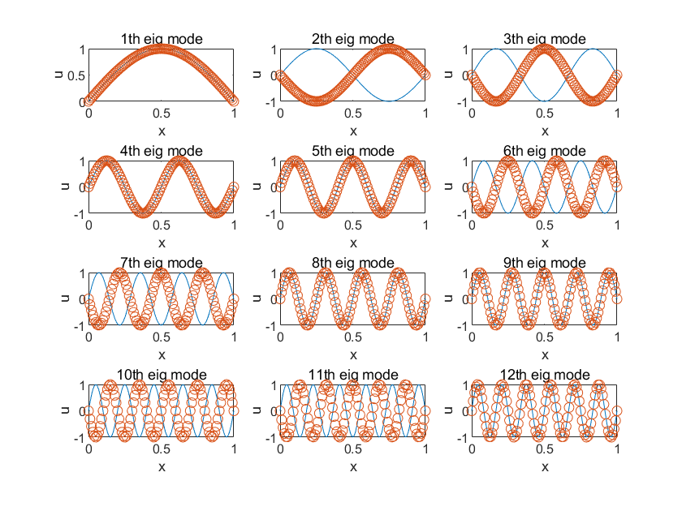

一维弦振动解析解为：

$$
k_n
=\frac{n\pi}{L},~~
u_n(x)
=\sin\frac{n\pi}{L}x
$$

离散数值解（取 $L=1 $）：

$N=10 $，绘图如下：


matlab 代码如下：

```
N = 10;
l = 1;
x = linspace(0,l,N);
h = l/N;

M = zeros(N-1, N-1);

for i = 1:N-1
    M(i, i) = -2;
end

for i=1:N-2
    M(i, i+1) = 1;
    M(i+1, i) = 1;
end

M = -M./h^2;

[V, D] = eig(M);

x_1 = 1:N-1;
y_1 = zeros(size(x_1));

for i = 1:N-1
    y_1(i) = sqrt(D(i, i));
end

figure(1)
scatter(x_1, y_1,'red', DisplayName='数值计算本征值');
hold on;
xlabel('n');
ylabel('k_n');
y_4 = x_1*pi/l;
scatter(x_1, y_4, 'blue', DisplayName='解析本征值');
legend;

x_2 = 0:h:l;

figure(2);

for n = 1:9
    subplot(3,3,n);
    x_3 = 0:0.01:l;
    y_3 = sin(n*pi/l*x_3);
    plot(x_3, y_3);
    hold on;
    y_2 = V(:,n);
    u = zeros(size(x_2));
    u(1) = 0;
    u(N+1) = 0;
    for i = 1:N-1
        u(i+1) = y_2(i);
    end
    % 整体缩放本征向量
    u = u.*(1/max(u));
    scatter(x_2, u);
    title([num2str(n), 'th eig mode']);
    xlabel('x');
    ylabel('u');
end

```

$N=100 $，绘图如下：




$N=1000 $，绘图如下：


