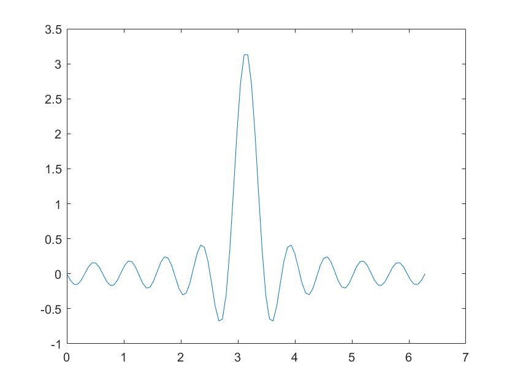
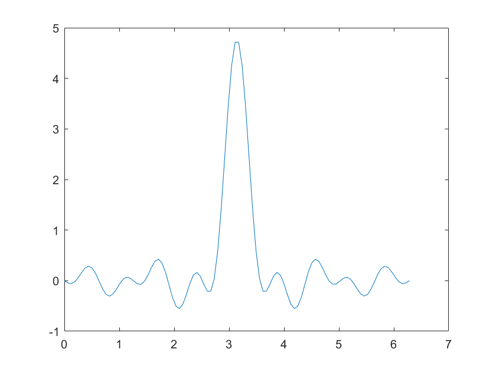

$\delta $ 函数可广义傅里叶展开为：

$$
\delta(x-x')
=\frac{2}{l}\sum_{k=1}^{\infty}\sin(\frac{k\pi}{l}x')\sin(\frac{k\pi}{l}x)
$$

取 $l=2\pi,x'=\pi $

取前 $2000 $ 项，绘图如下：



matlab 代码如下：

```
x = linspace(0, 2*pi, 100);
y = zeros(size(x));

x_prime = pi;
l = 2*pi;

for k = 1:2000
    y = y + sin(k*pi/l*x_prime)*sin(k*pi/l*x);
end

y = y*2/l;

plot(x,y);
```

取 $1000\sim 2000 $ 项，绘图如下：



matlab 代码如下：

```
x = linspace(0, 2*pi, 100);
y = zeros(size(x));

x_prime = pi;
l = 2*pi;

for k = 1000:2000
    y = y + sin(k*pi/l*x_prime)*sin(k*pi/l*x);
end

y = y*2/l;

plot(x,y);
```


