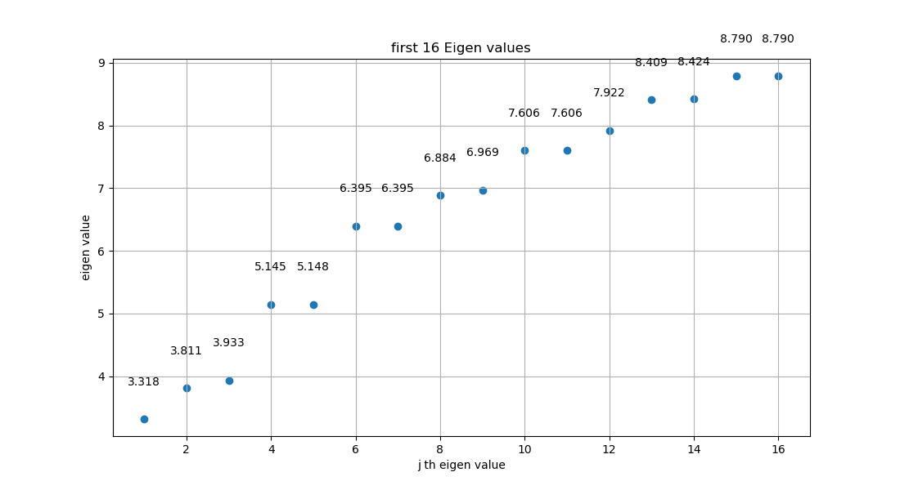
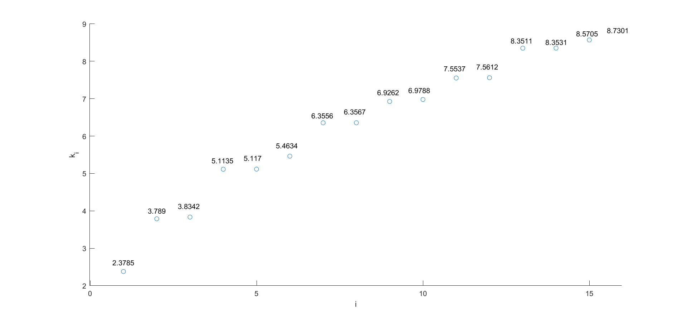

[TOC]

# 小课题2

## 问题描述

二维单位圆鼓膜偏离平衡位置的位移 $u(r,\theta) $ 满足方程：

$$
\frac{T}{\rho}\nabla^2 u+\mu^2 u
=0
$$

当 $T=T_0=1,\rho=\rho_0+\rho_1,\rho_0=1,\rho_1=0 $，且在第一类齐次边界条件 $u\big|_{\partial D}=0 $ 下，方程化为：

$$
\nabla^2 u+\mu^2 u
=0
$$

方程的本征解为：

$$
\bigg\{\varphi_j(r,\theta)=\mathrm{J}_m(x^{(m)}_n r)\cos (m\theta),~~\mu_j=x^{(m)}_n,~~j=1,2,\cdots,~~m=0,1,2,\cdots,~~n=1,2,\cdots \bigg\}
$$

其中，$j $ 用于从小到大排序，$\mu_1<\mu_2<\cdots<\mu_j<\cdots $

---

当 $T=T_0=1,\rho=\rho_0+\rho_1,\rho_0=1,\rho_1=0.2\varphi_2(r,\theta)$，且在第一类齐次边界条件 $u\big|_{\partial D}=0 $ 下，方程化为：

$$
\frac{1}{1+0.2\varphi_2(r,\theta)}\nabla^2 u+\mu^2 u
=0
$$

其中，$\varphi_2(r,\theta) $ 是归一化的。

要求分别用谱方法和有限差分法分别求出本征值 $\mu_j,~~(j=1\sim 20) $ 以及本征函数 $u_j(r,\theta),~~(j=1\sim 10,100\sim 110,1000\sim 1010) $

## 问题重述

将前 $6 $ 个整数阶贝塞尔函数的前 $6 $ 个零点排序，绘图如下：

<div align="center">

</div>

图中选取了 $0\sim 5 $ 阶贝塞尔的前 $6 $ 个零点进行排序。图中，所有的点用一条折线相连。当 $m=0,n=1 $ 时，最小本征值 $\mu_1=x^{(0)}_1 $。从 $m=0,n=1 $ 起点出发，折线的下一个端点对应第二小的本征值，即 $\mu_2 =x^{(1)}_1 $，依此类推。

按本征值升序排序顺序，依次画出对应的无微扰时方程的前 $16 $ 个本征函数：

<div align="center">

</div>

Python 代码如下：

```
from scipy.special import jn_zeros
from scipy.special import jn
import numpy as np
import matplotlib.pyplot as plt
from mpl_toolkits.mplot3d import Axes3D

n_zeros = 6
orders = 6

zeros = np.zeros((orders, n_zeros))
for i in range(0, orders):
        zeros[i, :] = jn_zeros(i, n_zeros)

for i in range(0, orders):
    for j in range(0, n_zeros):
        plt.scatter(i, j+1)
        plt.text(i, j+1, f'{zeros[i, j]:.4f}', fontsize=8, ha='left', va='bottom')

tmp_m = 0
tmp_n = 1

index = np.argsort(zeros.flatten())

plt.figure(1)

for k in range(1, (orders)*n_zeros):
    i = index[k] // n_zeros
    j = index[k] % n_zeros
    m = i
    n = j + 1
    plt.plot([tmp_m, m], [tmp_n, n])
    tmp_m = m
    tmp_n = n

plt.title('First 36 sorted Eigen values')
plt.xlabel('m')
plt.ylabel('n')
plt.xticks(np.arange(0, orders))

x = np.linspace(-1, 1, 100)
y = np.linspace(-1, 1, 100)
X, Y = np.meshgrid(x, y)

fig2 = plt.figure(figsize=(16, 16))

r = np.linspace(0, 1, 100)
theta = np.linspace(0, 2*np.pi, 100)
R, Theta = np.meshgrid(r, theta)

for k in range(0, 16):
    i = index[k] // n_zeros
    j = index[k] % n_zeros
    m = i
    n = j + 1
    x_m_n = zeros[m, n]
    Z = jn(m, zeros[i, j] * R) * np.cos(m * Theta)
    X = R*np.cos(Theta)
    Y = R*np.sin(Theta)
    ax = fig2.add_subplot(4, 4, k+1, projection='3d')
    ax.plot_surface(X, Y, Z, cmap='viridis')
    tmp_m = m
    tmp_n = n

plt.show()
```

可以看出，$\varphi_2(r,\theta) $ 对应的是 $m=1,n=1 $ 的情况，即归一化的 $\varphi_2(r,\theta) $ 满足：

$$
\begin{aligned}
\varphi_2(r,\theta)
&=\frac{\mathrm{J}_1(x^{(1)}_1 r)\cos (\theta)}{\sqrt{\int_{\theta=0}^{\theta=2\pi} \int_{r=0}^{r=1} \mathrm{J}_1^2(x^{(1)}_1 r)\cos^2\theta\cdot r\mathrm{d}r\mathrm{d}\theta }} \\
&=\frac{\mathrm{J}_1(x^{(1)}_1 r)\cos (\theta)}{\sqrt{\int_{\theta=0}^{\theta=2\pi} \cos^2\theta\mathrm{d}\theta \int_{r=0}^{r=1} r\mathrm{J}_1^2(x^{(1)}_1 r)\mathrm{d}r }} \\
&=\frac{1}{\sqrt{\pi}}\cdot \frac{\mathrm{J}_1(x^{(1)}_1 r)\cos (\theta)}{\sqrt{\int_{r=0}^{r=1} r\mathrm{J}_1^2(x^{(1)}_1 r)\mathrm{d}r }} \\
\end{aligned}
$$

最终要求方程

$$
\frac{1}{1+0.2\varphi_2(r,\theta)}\nabla^2 u+\mu^2 u
=0
$$

的本征值和本征函数。

## 谱方法求解

### 谱方法原理

方程

$$
\nabla^2 u+\mu^2 u
=0,~~u\in D=\{(r,\theta)|r\leqslant 1 \},~~u\big|_{\partial D}=0
$$

的本征解为：

$$
\bigg\{\varphi^{(m)}_n=\mathrm{J}_m(x^{(m)}_n r)[c_m\cos (m\theta)+d_m\sin (m\theta)],~~\mu^{(m)}_n=x^{(m)}_n,~~m=0,1,2,\cdots,~~n=1,2,\cdots\bigg\}
$$

其中，$x^{(m)}_n $ 是 $m $ 阶贝塞尔函数的第 $n $ 个正零点。

则 $\{\mathrm{J}_m(x_n^{(m)}r)\cos(m\theta),~~\mathrm{J}_m(x_n^{(m)}r)\sin(m\theta),~~m=0,1,2,\cdots,~~n=1,2,\cdots \} $ 可作为正交完备函数基。

令 $\displaystyle{f(r,\theta)=\frac{1}{1+0.2\varphi_2} }$，

方程

$$
\frac{1}{1+0.2\varphi_2}\nabla^2 u+\mu^2 u
=0
$$

可化为：

$$
f(r,\theta)\nabla^2 u+\mu^2 u
=0
$$

上述方程的解可在完备函数基 $\{\mathrm{J}_m(x_n^{(m)}r)\sin(m\theta+\frac{\pi}{2}l),~~m=0,1,2,\cdots,~~n=1,2,\cdots,~~l=0,1 \}$ 上展开为：

$$
\begin{aligned}
u
&=\sum_{m=0}^{\infty} \sum_{n=1}^{\infty}\sum_{l=0,1} C_{mnl}\mathrm{J}_m(x_n^{(m)}r)\sin(m\theta+\frac{\pi}{2}l)
\end{aligned}
$$

> 实际上，对于 $m=0,l=0 $ 的情况，即本征函数系中 $m=0 $ 的正弦支，本征函数恒为零，无法作为希尔伯特空间中的有效基矢，应当舍弃。但这里为了叙述方便，保留这种平庸的情况，但数值求解时会去除。

其中，基函数满足：

$$
\nabla^2 \bigg[\mathrm{J}_m(x_n^{(m)}r)\sin(m\theta+\frac{\pi}{2}l)\bigg]
=-\big[x_n^{(m)}\big]^2 \mathrm{J}_m(x_n^{(m)}r)\sin(m\theta+\frac{\pi}{2}l)
$$

于是可以简化计算 $\nabla^2 u $：

$$
\begin{aligned}
\nabla^2 u
&=\nabla^2\bigg[ \sum_{m=0}^{\infty} \sum_{n=1}^{\infty}\sum_{l=0,1} C_{mnl}\mathrm{J}_m(x_n^{(m)}r)\sin(m\theta+\frac{\pi}{2}l) \bigg] \\
&=-\sum_{m=0}^{\infty} \sum_{n=1}^{\infty}\sum_{l=0,1} C_{mnl}\big[x_n^{(m)}\big]^2\mathrm{J}_m(x_n^{(m)}r)\sin(m\theta+\frac{\pi}{2}l)
\end{aligned}
$$

$$
f(r,\theta)\nabla^2 u+\mu^2 u
=0
\Longrightarrow
-f(r,\theta)\nabla^2 u
=\mu^2 u
$$

将 $u,\nabla^2 u $ 的展开式代入上式得：

$$
f(r,\theta)\sum_{m=0}^{\infty} \sum_{n=1}^{\infty}\sum_{l=0,1} C_{mnl}\big[x_n^{(m)}\big]^2\mathrm{J}_m(x_n^{(m)}r)\sin(m\theta+\frac{\pi}{2}l)
=\mu^2 \sum_{m=0}^{\infty} \sum_{n=1}^{\infty}\sum_{l=0,1} C_{mnl}\mathrm{J}_m(x_n^{(m)}r)\sin(m\theta+\frac{\pi}{2}l)
$$

上式左右分别乘 $\mathrm{J}_{m'}(x^{(m')}_{n'}r)\sin(m'\theta+\frac{\pi}{2}l')r $，对 $r,\theta $ 积分：

$$
\begin{aligned}
右边
&=\iint \bigg[ \mu^2 \sum_{m=0}^{\infty} \sum_{n=1}^{\infty}\sum_{l=0,1} C_{mnl}\mathrm{J}_m(x_n^{(m)}r)\sin(m\theta+\frac{\pi}{2}l) \bigg] \cdot\bigg[ \mathrm{J}_{m'}(x^{(m')}_{n'}r)\sin(m'\theta+\frac{\pi}{2}l')r \bigg] \mathrm{d}r\mathrm{d}\theta \\
&=\mu^2 \sum_{m=0}^{\infty} \sum_{n=1}^{\infty}\sum_{l=0,1} C_{mnl} A_{m} \delta_{m,m'}\delta_{l,l'}\int_{0}^{1} \mathrm{J}_{m}(x^{(m)}_{n}r)\mathrm{J}_{m'}(x^{(m')}_{n'}r) r\mathrm{d}r \\
&=\mu^2\sum_{n=1}^{\infty}C_{m'nl'} A_{m'}\int_{0}^{1} \mathrm{J}_{m'}(x^{(m')}_{n}r)\mathrm{J}_{m'}(x^{(m')}_{n'}r)r\mathrm{d}r \\
&=\mu^2\sum_{n=1}^{\infty}C_{m'nl'} A_{m'}B_{m'n}\delta_{n,n'} \\
&=\mu^2C_{m'n'l'} A_{m'}B_{m'n'}
\end{aligned}
$$

其中，$A_{m'}=\int_{0}^{2\pi} \cos^2(m'\theta)\mathrm{d}\theta=\int_{0}^{2\pi} \sin^2(m'\theta)\mathrm{d}\theta,~~B_{m'n'}=\int_{0}^{1}\mathrm{J}^2_{m'}(x^{(m')}_{n'}r) r\mathrm{d}r  $

$$
\begin{aligned}
左边
&=\iint \bigg[ f(r,\theta)\sum_{m=0}^{\infty} \sum_{n=1}^{\infty}\sum_{l=0,1} C_{mnl}\big[x_n^{(m)}\big]^2\mathrm{J}_m(x_n^{(m)}r)\sin(m\theta+\frac{\pi}{2}l) \bigg]\cdot\bigg[ \mathrm{J}_{m'}(x^{(m')}_{n'}r)\sin(m'\theta+\frac{\pi}{2}l')r \bigg] \mathrm{d}r\mathrm{d}\theta \\
&=\sum_{m=0}^{\infty} \sum_{n=1}^{\infty}\sum_{l=0,1} C_{mnl}\big[x_n^{(m)}\big]^2\iint f(r,\theta)\cdot \mathrm{J}_m(x_n^{(m)}r)\sin(m\theta+\frac{\pi}{2}l)\cdot\mathrm{J}_{m'}(x^{(m')}_{n'}r)\sin(m'\theta+\frac{\pi}{2}l')r \mathrm{d}r\mathrm{d}\theta \\
&\equiv \sum_{m=0}^{\infty} \sum_{n=1}^{\infty}\sum_{l=0,1} C_{mnl}\big[x_n^{(m)}\big]^2 D_{m'n'l'mnl}
\end{aligned}
$$

方程化为：

$$
\sum_{m=0}^{\infty} \sum_{n=1}^{\infty}\sum_{l=0,1} C_{mnl}\big[x_n^{(m)}\big]^2 D_{m'n'l'mnl}
=\mu^2C_{m'n'l'} A_{m'}B_{m'n'}
$$

即：

$$
\sum_{m=0}^{\infty} \sum_{n=1}^{\infty}\sum_{l=0,1}\frac{\big[x_n^{(m)}\big]^2 D_{m'n'l'mnl}}{A_{m'}B_{m'n'}} C_{mnl}=\mu^2C_{m'n'l'}
$$

令：

$$
E_{m'n'l'mnl}
=\frac{\big[x_n^{(m)}\big]^2 D_{m'n'l'mnl}}{A_{m'}B_{m'n'}}
$$

则方程化为：

$$
\sum_{m=0}^{\infty} \sum_{n=1}^{\infty}\sum_{l=0,1} E_{m'n'l'mnl}C_{mnl}
=\mu^2C_{m'n'l'} 
$$

设有某种对应关系，使得：

$$
(m,n,l)\longleftrightarrow j \\
(m',n',l')\longleftrightarrow j' \\
$$

> 这种对应关系不一定是“本征值升序排序”

则方程化为：

$$
\sum_{j=1}^{\infty} E_{j' j}C_j
=\mu^2 C_{j'}
$$

其中，

$$
\begin{aligned}
E_{j' j}
&=E_{m'n'l'mnl} \\
&=\frac{\big[x_n^{(m)}\big]^2 D_{m'n'l'mnl}}{A_{m'}B_{m'n'}} \\
&=\frac{\big[x_n^{(m)}\big]^2\times \iint f(r,\theta)\cdot \mathrm{J}_m(x_n^{(m)}r)\sin(m\theta+\frac{\pi}{2}l)\cdot\mathrm{J}_{m'}(x^{(m')}_{n'}r)\sin(m'\theta+\frac{\pi}{2}l')r \mathrm{d}r\mathrm{d}\theta}{\int_{0}^{2\pi} \cos^2(m'\theta)\mathrm{d}\theta\times \int_{0}^{1}\mathrm{J}^2_{m'}(x^{(m')}_{n'}r) r\mathrm{d}r} \\
&=\frac{\big[x_n^{(m)}\big]^2\times \iint f(r,\theta)\cdot \mathrm{J}_m(x_n^{(m)}r)\sin(m\theta+\frac{\pi}{2}l)\cdot\mathrm{J}_{m'}(x^{(m')}_{n'}r)\sin(m'\theta+\frac{\pi}{2}l')r \mathrm{d}r\mathrm{d}\theta}{\pi\times \int_{0}^{1}\mathrm{J}^2_{m'}(x^{(m')}_{n'}r) r\mathrm{d}r} \\
\end{aligned}
$$

这等价于矩阵方程：

$$
\bold{E}\bold{C}
=\mu^2\bold{C}
$$

其中，$E_{j'j} $ 是 $\bold{E} $ 的 $j' $ 行 $j $ 列矩阵元，$C_{j'} $ 是向量 $\bold{C} $ 的第 $j' $ 个元素。

这是一个关于矩阵 $\bold{E} $ 的特征方程，解这个方程就可以得到特征值与特征向量。

### 数值求解

绘图如下：

$1\sim 16 $ 个本征值：

<div align="center">

</div>

$1\sim 16 $ 个本征函数：

<div align="center">

</div>

$100\sim 116 $ 个本征值：

<div align="center">

</div>

$100\sim 115 $ 个本征函数：

<div align="center">

</div>

Python 代码如下：

```
from scipy.special import jn_zeros
from scipy.special import jn
import numpy as np
from scipy.integrate import quad
from scipy.integrate import dblquad
import matplotlib.pyplot as plt

m_num = 8
n_num = 8

zeros = np.zeros((m_num, n_num+1))

# zeros[i, j] 给出 i 阶 Bessel 函数的第 j 个正零点；可以给出 0 - m_num-1 阶贝塞尔函数，1 - n_num 个正零点
for i in range(m_num):
    zeros[i, 1:] = jn_zeros(i, n_num)

[integral_1, err] = quad(lambda r: r*jn(1, zeros[1, 1]*r)**2, 0, 1)

def f(r, theta):
    varphi_2 = jn(1, zeros[1, 1]*r) * np.cos(theta) / np.sqrt(np.pi*integral_1)
    result = 1 / (1+0.2*varphi_2)
    return result

j_to_mnl = []
j_num = (2*m_num-1)*n_num
cnt = -1

for n in range(1, n_num+1):
    for m in range(0, m_num):
        cnt += 1
        j_to_mnl.append([m, n])

for n in range(1, n_num+1):
    for m in range(1, m_num):
        cnt += 1
        j_to_mnl.append([m, n])

integral_2 = np.zeros(j_num)

for j in range(j_num):
    m = j_to_mnl[j][0]
    n = j_to_mnl[j][1]
    [result, err] = quad(lambda r: r * jn(m, zeros[m, n] * r)** 2 , 0, 1)
    integral_2[j] = result

E = np.zeros((j_num, j_num))

for i in range(0, j_num):
    for j in range(0, j_num):
        i_m = j_to_mnl[i][0]
        i_n = j_to_mnl[i][1]
        j_m = j_to_mnl[j][0]
        j_n = j_to_mnl[j][1]
        if i < n_num*m_num:
            i_l = 1
        else:
            i_l = 0
        if j < n_num*m_num:
            j_l = 1
        else:
            j_l = 0

        [up, err] = dblquad( lambda r, theta: f(r, theta) * jn(i_m, zeros[i_m, i_n]*r) * jn(j_m, zeros[j_m, j_n]*r)* r * np.sin(i_m*theta+np.pi/2*i_l) * np.sin(j_m*theta+np.pi/2*j_l), 0, 2*np.pi, 0, 1 )
        up = up * zeros[j_m, j_n]**2
        down = np.pi * integral_2[i]
        E[i, j] = up/down
        print(i, j)

[values, vectors] = (np.linalg.eig(E))

sorted_indices = np.argsort(values)
values = np.sqrt(values[sorted_indices])
vectors = (vectors[:, sorted_indices])

print(values)
print(vectors)

plt.figure()
x = range(1, j_num+1)
plt.scatter(x, values)
plt.show()

plt.figure(figsize=(11, 6))
x = range(1, 17)
plt.scatter(x, values[:16])
plt.xlabel('j th eigen value')
plt.ylabel('eigen value')
plt.title('first 16 Eigen values')
plt.grid(True)
for i, txt in enumerate(values[:16]):
    plt.text(x[i], values[i]+0.5, f'{txt:.3f}', ha='center', va='bottom')
plt.show()

plt.figure(figsize=(11, 6))
x = range(100, 117)
plt.scatter(x, values[99:116])
plt.xlabel('j th eigen value')
plt.ylabel('eigen value')
plt.title('100 - 116 th Eigen values')
plt.grid(True)
for i, txt in enumerate(values[99:116]):
    plt.text(x[i], values[i]+1, f'{txt:.3f}', ha='center', va='bottom')
plt.show()

r = np.linspace(0, 1, 100)
theta = np.linspace(0, 2 * np.pi, 100)
R, Theta = np.meshgrid(r, theta)
X = R*np.cos(Theta)
Y = R*np.sin(Theta)

def varphi(m, n, l, r, theta):
    return jn(m, zeros[m, n]*r) * np.sin(m*theta+np.pi/2*l)

for b in [0, 100]:
    fig2 = plt.figure()
    for k in range(0, 16):
        Z = np.zeros_like(R)
        for i in range(0, j_num):
            m = j_to_mnl[i][0]
            n = j_to_mnl[i][1]
            if i <j_num:
                l = 1
            else:
                l = 0

            Z += vectors[i, k+b] * varphi(m, n, l, R, Theta)

        ax = fig2.add_subplot(4, 4, k+1, projection='3d')
        ax.plot_surface(X, Y, Z, cmap='viridis')

plt.show()
```

## 有限差分法求解

### 差分原理

对于方程：

$$
\frac{1}{1+0.2\varphi_2(r,\theta)}\nabla^2 u+\mu^2 u
=0,~~
$$

作坐标变换：

$$
\left\{
\begin{aligned}
&r=\sqrt{x^2+y^2} \\
&\theta=\arctan\frac{y}{x}
\end{aligned}
\right.
$$

令：

$$
f(x,y)
=\frac{1}{1+0.2\varphi_2(\sqrt{x^2+y^2},\arctan\frac{y}{x})}
$$

则原方程化为：

$$
f(x,y)\nabla^2 u(x,y)
=-\mu^2 u(x,y)
$$

将区域 $\{(x,y)|x\in[-1,1],y\in[-1,1] \} $ 均匀离散为正方形网格，每个小正方形的边长 $\Delta x=\Delta y=h=2/(N-1) $，其中 $N $ 是沿 $x $ 方向或 $y $ 方向的离散格点数。

任一格点的坐标 $(x_i,y_j) $ 可由 $i,j $ 描述：

$$
x_i
=-1+(i-1)h,~~
y_j
=-1+(j-1)h,~~i,j\in[1,N],~~i,j\in \Z
$$

则：

$$
\begin{aligned}
\nabla^2 u\big|_{i,j}
&=\frac{\partial^2 u}{\partial x^2}\bigg|_{i,j}+\frac{\partial^2 u}{\partial y^2}\bigg|_{i,j} \\
&\approx \cfrac{\cfrac{u|_{i+1,j}-u|_{i,j}}{h}-\cfrac{u|_{i,j}-u|_{i-1,j}}{h}}{h} + \cfrac{\cfrac{u|_{i,j+1}-u|_{i,j}}{h}-\cfrac{u|_{i,j}-u|_{i,j-1}}{h}}{h} \\
&=\frac{1}{h^2}(-4u|_{i,j}+u|_{i+1,j}+u|_{i-1,j}+u|_{i,j+1}+u|_{i,j-1})
\end{aligned}
$$

于是，方程 $f(x,y)\nabla^2 u(x,y)=-\mu^2 u(x,y) $ 可离散化为：

$$
\frac{1}{h^2} f|_{i,j} (-4u|_{i,j}+u|_{i+1,j}+u|_{i-1,j}+u|_{i,j+1}+u|_{i,j-1})
= \mu^2 u|_{i,j}
$$

对于单位圆外的格点 $i,j $ ，在第一类齐次边界条件下，认为其上的 $u|_{i,j}=0 $

对于单位圆内的格点，按从左到右，从下到上的顺序可依次从 $1 $ 开始编号，其上的格点偏离平衡位置的位移记为 $u_1,u_2,\cdots,u_k,\cdots $，其上函数 $f $ 的值记为 $f_1,f_2,\cdots,f_k,\cdots $

于是，对于单位圆内的格点，方程 $f(x,y)\nabla^2 u(x,y)=-\mu^2 u(x,y) $ 可离散化为矩阵形式：

$$
-\frac{1}{h^2}
\begin{bmatrix}
f_1 \\
&f_2 \\
&&\ddots \\
&&&f_k \\
&&&& \ddots
\end{bmatrix}
\bold{M}
\begin{bmatrix}
u_1 \\
u_2 \\
\vdots \\
u_k \\
\vdots
\end{bmatrix}
=\mu^2
\begin{bmatrix}
u_1 \\
u_2 \\
\vdots \\
u_k \\
\vdots
\end{bmatrix}
$$

其中，方阵 $\bold{M} $ 的对角元全为 $-4 $，且方阵 $\bold{M} $ 的第 $k $ 行剩下的各矩阵元的取值取决于单位圆内第 $k $ 个格点其周围（上下左右）四个格点是否在单位圆内。

解出这个矩阵的特征方程就能得到本征值和本征向量。

### 数值求解

第 $1\sim 16,100\sim 115,1000\sim 1015 $ 个本征值和本征函数绘图如下：

<div align="center">

</div>

<div align="center">

</div>

<div align="center">

</div>

<div align="center">

</div>

<div align="center">

</div>

<div align="center">

</div>

Matlab 代码如下：

```
N = 101; 
h = 2 ./ (N-1); 
cnt = 0;
cnt_to_n = zeros(1, N*N);
n_to_cnt = zeros(1, N*N);

X = [0];
Y = [0]; 

for n = 1:N*N
    i = mod(n-1, N)+1;
    j = floor((n-1)/N)+1;
    if ( (i-1)*h - 1 )^2 + ( (j-1)*h - 1 )^2 < 1
        cnt = cnt + 1;
        cnt_to_n(cnt) = n;
        n_to_cnt(n) = cnt;
        X(cnt) = -1+(i-1)*h;
        Y(cnt) = -1+(j-1)*h;
    end
end

bessel_zero_1_1 = 3.8317;
M = zeros(cnt, cnt);
integral_1 = sqrt(integral(@(r) r.*besselj(1, bessel_zero_1_1.* r).^2, 0, 1 ));
f = @(x, y) 1./(1 + 0.2.*(cos(atan2(y, x)).*besselj(1, bessel_zero_1_1.*sqrt(x.^2+y.^2))./sqrt(pi)./integral_1));

for k = 1:cnt
    n = cnt_to_n(k);
    i = mod(n-1, N) + 1;
    j = floor((n-1)./N) + 1;
    x = -1 + (i-1).*h;
    y = -1 + (j-1).*h;
    F = f(x, y);
    M(k, k) = F.*(-4);
    if i > 1 && n_to_cnt(n-1) > 0
        M(k, n_to_cnt(n-1) ) = 1.*F;
    end

    if  i<N && n_to_cnt(n+1) > 0
        M(k, n_to_cnt(n+1) ) = 1.*F;
    end

    if j>1 && n_to_cnt(n-N) > 0
        M(k, n_to_cnt(n-N) ) = 1.*F;
    end    

    if j < N && n_to_cnt(n+N) > 0
        M(k, n_to_cnt(n+N) ) = 1.*F;
    end    

end

M = -M./(h.^2);

[V, D] = eig(M);
[mu, index] = sort(sqrt(diag(D)));
V = V(:, index);

x = 1:16;
y = zeros(1, 16);

for i = 1:16
    y(i) = mu(i);
end

figure(1);
scatter(x, y);
xlabel("i");
ylabel("k_i");

for i =1:16
    text(i,y(i), num2str(y(i)));
end

[xq, yq] = meshgrid(-1:0.02:1, -1:0.02:1);

figure(2);

for k = 1:16
    subplot(4,4,k);
    Z = V(:, k);
    zq = griddata(X,Y,Z,xq,yq);
    mesh(xq,yq,zq);
    title(['本征值\mu_{', num2str(k), '}=', num2str(mu(k)), '的本征函数']);
    xlabel('x');
    ylabel('y');
    zlabel('u');
end
```
## 对比与总结

### 谱方法和有限差分法的对比

<div style="display: flex; justify-content: center;">
    
    
</div>

（左图为谱方法给出的前 $16 $ 个本征值，右图为有限差分法给出的前 $16 $ 个本征值）

可以看到，谱方法和有限差分法给出的前 $16 $ 个本征值中，除基态的本征值略有不同，其他的 $15 $ 个本征值几乎一致，且二者都准确描述了本征值的二重简并现象。

<div style="display: flex; justify-content: center;">
    
    
</div>

（左图为谱方法给出的前 $16 $ 个本征函数，右图为有限差分法给出的前 $16 $ 个本征函数）

可以看到，两种方法给出的前 $16 $ 个本征函数几乎完全一致，并且都很好地描述了本征能量的二重简并现象。

<div style="display: flex; justify-content: center;">
    
    
</div>

（左图为谱方法给出的第 $100\sim 115 $ 个本征函数，右图为有限差分法给出的第 $100\sim 115 $ 个本征函数）

可以看到，两种方法给出的第 $100\sim 115 $ 个本征函数也相差不大，并且都很好地描述了本征能量的二重简并现象。

### 总结

在本征值较小时，谱方法和有限差分法求得的本征值差距较小，本征函数的差距也较小。在本征值较大时，两种方法得到的本征值差距较大，本征函数的差距不太大。

方程中的扰动较小，此微扰使得微扰存在时的本征函数是无微扰时本征函数的微小倾斜。

谱方法将解 $\psi $ 表示为正交完备基函数 $\displaystyle{\{\varphi_j\} }$ 的线性组合 $\displaystyle{\psi=\sum_{n=1}^{\infty} C_j \varphi_j }$ ，通过求出系数 $C_j $ 来求出本征函数。

对于较小的本征值及对应的本征函数，谱方法的计算结果与较为准确。然而，实际求解过程中，只能选取有限个基函数，这种截断会导致计算较大本征值和本征函数时有较大的误差。

有限差分法将连续的问题离散化，将连续的函数或导数转化为离散的点和有限差分近似。我们先将连续的二维区域划分为离散的二维网格，然后在网格上建立差分方程，将微分方程转化为代数方程组。最后，通过数值方法求解这个代数方程组，得到问题的数值解。

有限差分法的误差主要来自于离散步长 $h $ 并非无穷小。因此，若扰动的空间变化并不剧烈，则其给出的结果较为准确。若扰动的空间变化相当剧烈，则用差分代替导数是一种很不准确的近似，因此会带来相当大的误差。在本文中，扰动 $\displaystyle{\frac{1}{1+0.2\varphi_2(r,\theta)} }$ 的空间变化较为平缓，因此有限差分法给出的结果与真实情况的偏离较小。

从计算量来看，谱方法的计算量远大于有限差分法；从误差来看，若算力充足，则谱方法的误差远小于有限差分法的误差。在解决实际问题时要综合考虑可用算力和求解问题精度要求来选择求解方法。

