[TOC]

# 小课题3

## 问题描述

在半径 $R=1 $ 的二维圆形无穷深势阱内，哈密顿算符为：

$$
\hat{H}
=-\frac{\hat{p}^2}{2m}
=-\frac{\hbar^2}{2m}\nabla^2
$$

取 $\hbar=2m=1 $，则在此单位制下，哈密顿算符可化简为：

$$
\hat{H}
=-\nabla^2
$$

圆外，势场无穷大，这导致势阱外波函数恒为零，这等价于边界条件：

$$
\psi\big|_{\partial D}
=0,~~
D=\{(r,\theta)|0\leqslant r\leqslant 1 \}
$$

圆内，定态薛定谔方程 $\hat{H}\psi=E\psi $ 可写为：

$$
-\nabla^2\psi
=E\psi
$$

即：

$$
\boxed{
\nabla^2\psi+E\psi
=0
}
$$

小课题 3 需要解决下面三个问题：

1）求解这一本征问题 $\hat{H}\psi=E\psi $，写出本征值、本征态的表达式

2）按本征值从小到达排序，找基矢 $\{E_n,~~\varphi_n(r,\theta),~~n=1,2,\cdots \} $

3）增加势场 $V=a\varphi_1(r,\theta),~~a=1,10,100 $，哈密顿算符变为：

$$
\hat{H}
=-\nabla^2+V
$$

此时定态薛定谔方程及边界条件为：

$$
\boxed{
\big[-\nabla^2+a\varphi_1(r,\theta)\big]\psi
=E\psi,~~\psi\big|_{\partial D}=0
}
$$

分别用谱方法和有限差分法求解本征值和本征函数，并进行对比。

## 问题1

>1）求解这一本征问题 $\hat{H}\psi=E\psi $，写出本征值、本征态的表达式

为求解方程

$$
\nabla^2\psi+E\psi
=0
$$

设 $\psi(r,\theta)=R(r)\Theta(\theta) $，结合二维极坐标拉普拉斯算符表达式 $\displaystyle{\nabla^2=\frac{\partial^2}{\partial r^2}+\frac{1}{r}\frac{\partial }{\partial r}+\frac{1}{r^2}\frac{\partial^2}{\partial \theta^2} }$，分离变量得：

$$
\left\{
\begin{aligned}
&\frac{\mathrm{d}^2 R(r)}{\mathrm{d}r^2}+\frac{1}{r}\frac{\mathrm{d}R(r)}{\mathrm{d}r}+(E-\frac{m^2}{r^2})R(r)
=0,~~R(1)=0,~~R(0)<\infty \\
&\frac{\mathrm{d}^2\Theta(\theta)}{\mathrm{d}\theta^2}+m^2\Theta(\theta)
=0,~~\Theta(\theta+2\pi)=\Theta(\theta)
\end{aligned}
\right.
$$

第二个方程的解为：

$$
\Theta(\theta)
\sim\mathrm{e}^{\pm \mathrm{i}m\varphi}
$$

第一个方程是整数阶贝塞尔方程，其形式解为：

$$
R^{(m)}(r)
=C_m\mathrm{J}_m(\sqrt{E}r)+C_m\mathrm{N}_m(\sqrt{E}r)
$$

结合边界条件 $R(1)=0,~~R(0)<\infty $ 可得本征值 $E_n^{(m)} $ 和本征态 $\varphi_n^{(m)}(r,\theta) $：

$$
E_n^{(m)}
=\big[x_n^{(m)}\big]^2
$$

$$
\varphi_n^{(m)}(r,\theta)
=\mathrm{J}_m(x_n^{(m)}r)[c_m\cos(m\theta)+d_m\sin(m\theta)]
$$

其中，$x_n^{(m)} $ 是 $m $ 阶贝塞尔函数的第 $n $ 个正零点


## 问题2

>2）按本征值从小到达排序，找基矢 $\{E_n,~~\varphi_n(r,\theta),~~n=1,2,\cdots \} $

问题1给出

$$
E_n^{(m)}
=\big[x_n^{(m)}\big]^2
$$

$$
\varphi_n^{(m)}(r,\theta)
=\mathrm{J}_m(x_n^{(m)}r)[c_m\cos(m\theta)+d_m\sin(m\theta)]
$$

注意到，一个确定的本征值 $E_n^{(m)}=\big[x_n^{(m)}\big]^2 $，对应着两个线性独立的本征函数：

$$
\mathrm{J}_m(x_n^{(m)}r)\cos(m\theta),~~
\mathrm{J}_m(x_n^{(m)}r)\sin(m\theta)
$$

当 $m=0 $，正弦支：

$$
\mathrm{J}_m(x_n^{(m)}r)\sin(m\theta)
=0
$$

当 $m\ne 0 $，

$$
\mathrm{J}_m(x_n^{(m)}r)\sin(m\theta)
=-\mathrm{J}_m(x_n^{(m)}r)\cos(m\theta+\frac{\pi}{2})
$$

这就是说，此时正弦支可由余弦支绕 $z $ 轴旋转 $\displaystyle{\frac{\pi}{2} }$ ，再关于 $xy $ 平面对作称而得到。

为了画图方便，只考虑本征函数中的余弦支，即认为本征值和本征函数为：

$$
\left\{
\begin{aligned}
&E_n^{(m)}
=\big[x_n^{(m)}\big]^2 \\
&\varphi_n^{(m)}(r,\theta)
=\mathrm{J}_m(x_n^{(m)}r)\cos(m\theta)
\end{aligned}
\right.
$$

此时本征值和本征函数一一对应。将本征值从小到大排序，用指标 $j $ 标记：

$$
E_1<E_2<\cdots<E_j<\cdots
$$

本征函数也按此顺序排序，用指标 $j $ 标记：

$$
\varphi_1<\varphi_2<\cdots<\varphi_j<
$$

本征值排序绘图如下：


<div align="center">

</div>

图中选取了 $0\sim 5 $ 阶贝塞尔的前 $6 $ 个零点进行排序。图中，所有的点用一条折线相连。当 $m=0,n=1 $ 时，最小本征值 $E_1=\big[ x^{(0)}_1 \big]^2 $。从 $m=0,n=1 $ 起点出发，折线的下一个端点对应第二小的本征值，即 $E_2 = \big[ x^{(1)}_1 \big]^2 $，依此类推。

按本征值升序顺序，画出前 $16 $ 个本征值对应的本征函数，绘图如下：

<div align="center">

</div>

需要注意的是，我们只选取了正交完备函数系中的余弦支 $\mathrm{J}_m(x_n^{(m)}r)\cos(m\theta) $ 作为示范。实际上，当 $m\ne 0 $ 时，正弦支 $\mathrm{J}_m(x_n^{(m)}r)\sin(m\theta) $ 也是本征函数。

Python 代码如下：

```
from scipy.special import jn_zeros
from scipy.special import jn
import numpy as np
import matplotlib.pyplot as plt
from mpl_toolkits.mplot3d import Axes3D

n_zeros = 6
orders = 6

zeros = np.zeros((orders, n_zeros))
for i in range(0, orders):
        zeros[i, :] = jn_zeros(i, n_zeros)

for i in range(0, orders):
    for j in range(0, n_zeros):
        plt.scatter(i, j+1)
        plt.text(i, j+1, f'{zeros[i, j]**2:.4f}', fontsize=8, ha='left', va='bottom')

tmp_m = 0
tmp_n = 1

index = np.argsort(zeros.flatten())

plt.figure(1)

for k in range(1, (orders)*n_zeros):
    i = index[k] // n_zeros
    j = index[k] % n_zeros
    m = i
    n = j + 1
    plt.plot([tmp_m, m], [tmp_n, n])
    tmp_m = m
    tmp_n = n

plt.title('First 36 Eigen energy of 2D infinitely deep potential well')
plt.xlabel('m')
plt.ylabel('n')
plt.xticks(np.arange(0, orders))

x = np.linspace(-1, 1, 100)
y = np.linspace(-1, 1, 100)
X, Y = np.meshgrid(x, y)

fig2 = plt.figure(figsize=(16, 16))

r = np.linspace(0, 1, 100)
theta = np.linspace(0, 2*np.pi, 100)
R, Theta = np.meshgrid(r, theta)

for k in range(0, 16):
    i = index[k] // n_zeros
    j = index[k] % n_zeros
    m = i
    n = j + 1
    x_m_n = zeros[m, n]
    Z = jn(m, zeros[i, j] * R) * np.cos(m * Theta)
    X = R*np.cos(Theta)
    Y = R*np.sin(Theta)
    ax = fig2.add_subplot(4, 4, k+1, projection='3d')
    ax.plot_surface(X, Y, Z, cmap='viridis')
    tmp_m = m
    tmp_n = n

plt.show()
```

## 问题3

>3）增加势场 $V=a\varphi_1(r,\theta),~~a=1,10,100 $，哈密顿算符变为：
>
>$$
\hat{H}
=-\nabla^2+V
>$$
>
>此时定态薛定谔方程及边界条件为：
>
>$$
\big[-\nabla^2+a\varphi_1(r,\theta)\big]\psi
=E\psi,~~\psi\big|_{\partial D}=0
>$$
>
>分别用谱方法和有限差分法求解本征值和本征函数，并进行对比。

### 二维谱方法求解

#### 谱方法原理

注意到，$\varphi_1 $ 与角度无关，可写为：

$$
\varphi_1
=\varphi_1(r)
=\frac{1}{\sqrt{\int_{0}^{1} \mathrm{J}_0^2(x^{(0)}_1 r)r\mathrm{d}r}}\cdot \mathrm{J}_0(x^{(0)}_1 r)
$$

由问题 1、2 的回答可知，函数基：

$$
\bigg\{\varphi_{mnl}(r,\theta)=\mathrm{J}_m(x^{(m)}_n r)\sin(m\theta+\frac{\pi}{2}l),~~m=0,1,2,\cdots,~~n=1,2,\cdots,~~l=0,1 \bigg\}
$$

是正交完备的（并不归一）。

> 实际上，对于 $m=0,l=0 $ 的情况，即本征函数系中 $m=0 $ 的正弦支，本征函数恒为零，无法作为希尔伯特空间中的有效基矢，应当舍弃。但这里为了叙述方便，保留这种平庸的情况，但数值求解时会去除。

设有某种对应关系，使得：

$$
(m, n,l)
\longleftrightarrow j
$$

$$
E_{mnl}
\longleftrightarrow E_j
$$

$$
\varphi_{mnl}
\longleftrightarrow \varphi_j
$$

> 这种对应关系不一定是“本征值升序排序”

其中，$\varphi_j $ 满足：

$$
\nabla^2\varphi_j
=-E_j \varphi_j
$$

由于 $\{\varphi_j,~~j=1,2,\cdots,\infty\} $ 是正交完备基，且与 $\psi $ 都满足单位圆的第一齐次边界条件，于是 $\psi $ 可以展开为：

$$
\psi
=\sum_{j=1}^{\infty} c_j\varphi_j
$$

结合上面两式，方程 $\big[-\nabla^2+a\varphi_1(r)\big]\psi=E\psi $ 可以写为：

$$
\big[-\nabla^2+a\varphi_1(r)\big]\sum_{j=1}^{\infty} c_j\varphi_j
=E\sum_{j=1}^{\infty} c_j\varphi_j
$$

即：

$$
\sum_{j=1}^{\infty} c_j\bigg[ E_j\varphi_j+a\varphi_1(r)\varphi_j \bigg] 
=E\sum_{j=1}^{\infty} c_j\varphi_j
$$

等式两边同乘 $r\varphi_{j'}  $，并对 $r,\theta $ 积分： 

$$
\begin{aligned}
左边
&=\int_{r=0}^{r=1}\int_{\theta=0}^{\theta=2\pi}r\varphi_{j'} \bigg\{ \sum_{j=1}^{\infty} c_j\bigg[ E_j\varphi_j+a\varphi_1(r)\varphi_j \bigg] \bigg\}  \mathrm{d}r\mathrm{d}\theta \\
&=\sum_{j=1}^{\infty} c_{j} E_{j} N_{j}\delta_{j'j}+a\sum_{j=1}^{\infty} c_j \int_{r=0}^{r=1}\int_{\theta=0}^{\theta=2\pi} \varphi_1(r)\varphi_{j'}(r,\theta)\varphi_{j}(r,\theta)\cdot r\mathrm{d}r\mathrm{d}\theta  \\
&=c_{j'}E_{j'} N_{j'} +a\sum_{j=1}^{\infty} c_j M_{j'j},~~其中,~~N_j=\int_{r=0}^{r=1}\int_{\theta=0}^{\theta=2\pi} \varphi_j^2 r \mathrm{d}r\mathrm{d}\theta,~~ M_{j' j} = \int_{r=0}^{r=1}\int_{\theta=0}^{\theta=2\pi} \varphi_1(r)\varphi_{j'}(r,\theta)\varphi_{j}(r,\theta)\cdot r\mathrm{d}r\mathrm{d}\theta
\end{aligned}
$$

$$
\begin{aligned}
右边
&=\int_{r=0}^{r=1}\int_{\theta=0}^{\theta=2\pi}r\varphi_{j'}\bigg[ E\sum_{j=1}^{\infty} c_j\varphi_j \bigg]  \mathrm{d}r\mathrm{d}\theta \\
&=E\sum_{j=1}^{\infty} c_j\bigg[ \int_{r=0}^{r=1}\int_{\theta=0}^{\theta=2\pi} \varphi_{j'}\varphi_j r \mathrm{d}r\mathrm{d}\theta \bigg] \\
&=E\sum_{j=1}^{\infty} c_j N_{j} \delta_{j'j},~~其中,~~N_j=\int_{r=0}^{r=1}\int_{\theta=0}^{\theta=2\pi} \varphi_j^2 r \mathrm{d}r\mathrm{d}\theta \\
&=Ec_{j'} N_{j'}
\end{aligned}
$$

于是，方程化为：

$$
c_{j'} E_{j'} N_{j'} + a\sum_{j=1}^{\infty} c_{j} M_{j' j}
=E c_{j'} N_{j'}
$$

即：

$$
E_{j'}c_{j'} + a\sum_{j=1}^{\infty} c_{j}\frac{ M_{j' j} }{N_{j'}}
=E c_{j'} 
$$

令 $\displaystyle{\tilde{M}_{j'j}=\frac{ M_{j' j} }{N_{j'}} }$，则方程化为：

$$
E_{j'}c_{j'} + a\sum_{j=1}^{\infty} c_{j}\tilde{M}_{j' j}
=E c_{j'} 
$$

这等价于矩阵方程：

$$
\boxed{
(\bold{\tilde{E}}+a\bold{\tilde{M}})\bold{C}
=E\bold{C}
}
$$

其中，

$$
\bold{\tilde{E}}
=\begin{bmatrix}
E_1 \\
& E_2 \\
& &\ddots \\
& & &E_{j'} \\
& & & &\ddots
\end{bmatrix},~~
\bold{C}
=\begin{bmatrix}
c_1 \\
c_2 \\
\vdots \\
c_{j'} \\
\vdots
\end{bmatrix}
$$

$\tilde{M}_{j'j} $ 是 $\bold{\tilde{M}} $ 的 $j' $ 行 $j $ 列矩阵元，

$$
\begin{aligned}
\tilde{M}_{j'j}
&=\frac{ M_{j' j} }{N_{j'}} \\
&=\frac{\int_{r=0}^{r=1}\int_{\theta=0}^{\theta=2\pi} \varphi_1(r)\varphi_{j'}(r,\theta)\varphi_{j}(r,\theta)\cdot r\mathrm{d}r\mathrm{d}\theta}{\int_{r=0}^{r=1}\int_{\theta=0}^{\theta=2\pi} \varphi_{j'}^2 r \mathrm{d}r\mathrm{d}\theta} \\
&=\frac{\int_{\theta=0}^{\theta=2\pi}\sin(m'\theta+\frac{\pi}{2}l')\sin(m\theta+\frac{\pi}{2}l)\mathrm{d}\theta\int_{r=1}^{r=1}\varphi_1(r) \mathrm{J}_{m'}(x^{(m')}_{n'}r)\mathrm{J}_m(x^{(m)}_n r)r\mathrm{d}r }{\int_{\theta=0}^{\theta=2\pi} \sin^2(m'\theta+\frac{\pi}{2}l')\mathrm{d}\theta \int_{r=0}^{r=1} \mathrm{J}^2_{m'}(x^{m'}_{n'} r)r\mathrm{d}r} \\
&=\frac{\pi\delta_{m' m}\delta_{l'l}\int_{r=1}^{r=1}\varphi_1(r) \mathrm{J}_{m'}(x^{(m')}_{n'}r)\mathrm{J}_m(x^{(m)}_n r)r\mathrm{d}r}{\pi\int_{r=0}^{r=1} \mathrm{J}^2_{m'}(x^{m'}_{n'} r)r\mathrm{d}r} \\
&=\frac{\delta_{m' m}\delta_{l'l}\int_{r=0}^{r=1}\varphi_1(r) \mathrm{J}_{m'}(x^{(m')}_{n'}r)\mathrm{J}_m(x^{(m)}_n r)r\mathrm{d}r}{\int_{r=0}^{r=1} \mathrm{J}^2_{m'}(x^{(m')}_{n'} r)r\mathrm{d}r} \\
\end{aligned}
$$

方程

$$
\boxed{
(\bold{\tilde{E}}+a\bold{\tilde{M}})\bold{C}
=E\bold{C}
}
$$

是个特征方程，解出这个特征方程就可以得到有微扰情况下能量本征值 $E_\alpha $ 和本征函数 $\psi_\alpha $ 。

设第 $\alpha $ 个特征向量为：

$$
\bold{C}_{\alpha}
=\begin{bmatrix}
C_{\alpha 1} \\
C_{\alpha 2} \\
\vdots \\
C_{\alpha i} \\
\vdots 
\end{bmatrix}
$$

则对应的本征函数为：

$$
\psi_\alpha
=\sum_{i=1}^{\infty} C_{\alpha i} \varphi_i
$$

#### 数值求解

$a=1 $ 情况本征值和本征态绘图如下：

$1\sim 16 $ 个本征值：

<div align="center">

</div>

前 $1035 $ 个本征值：

<div align="center">

</div>

$1\sim 16 $ 个本征函数：

<div align="center">

</div>

$101\sim 116 $ 个本征函数：

<div align="center">

</div>

$a=10 $ 情况本征值和本征态绘图如下：

$1\sim 16 $ 个本征值：

<div align="center">

</div>

前 $1035 $ 个本征值：

<div align="center">

</div>

$1\sim 16 $ 个本征函数：

<div align="center">

</div>

$101\sim 116 $ 个本征函数：

<div align="center">

</div>

$a=100 $ 情况本征值和本征态绘图如下：

$1\sim 16 $ 个本征值：

<div align="center">

</div>

前 $1035 $ 个本征值：

<div align="center">

</div>

$1\sim 16 $ 个本征函数：

<div align="center">

</div>

$101\sim 116 $ 个本征函数：

<div align="center">

</div>

Python 代码如下：

```
from scipy.special import jn_zeros
from scipy.special import jn
import numpy as np
from scipy.integrate import quad
from scipy.integrate import dblquad
import matplotlib.pyplot as plt
from joblib import Parallel, delayed
from mpl_toolkits.mplot3d import Axes3D

a = 1

m_num = 23
n_num = 23

zeros = np.zeros((m_num, n_num+1))

# zeros[i, j] 给出 i 阶 Bessel 函数的第 j 个正零点；可以给出 0 - m_num-1 阶贝塞尔函数，1 - n_num 个正零点
for i in range(m_num):
    zeros[i, 1:] = jn_zeros(i, n_num)

# print(zeros)

[integral_1, err ] = 1 / np.sqrt( quad( lambda r: r * jn(0, zeros[0, 1] * r )**2, 0, 1 ) )

# print(integral_1)

def phi_1(r):
    result = 1 / integral_1 * jn(0, zeros[0, 1] * r)
    return result

j_to_mnl = []

j_num = (2*m_num-1)*n_num
tilde_E = np.zeros((j_num,j_num))
cnt = -1
# 余弦函数支
for n in range(1, n_num+1):
    for m in range(0, m_num):
        cnt += 1
        j_to_mnl.append([m, n])
        tilde_E[cnt, cnt] = zeros[m, n]**2


# 正弦函数支
for n in range(1, n_num+1):
    for m in range(1, m_num):
        cnt += 1
        j_to_mnl.append([m, n])
        tilde_E[cnt, cnt] = zeros[m, n] ** 2

#print(j_to_mnl)

#print(tilde_E)
integral_2 = np.zeros(j_num)
for j in range(j_num):
    m = j_to_mnl[j][0]
    n = j_to_mnl[j][1]
    [result, err] = quad(lambda r: r * jn(m, zeros[m, n] * r)** 2 , 0, 1)
    integral_2[j] = result

tilde_M = np.zeros((j_num, j_num))

for i in range(0, j_num):
    for j in range(0, j_num):
        i_m = j_to_mnl[i][0]
        i_n = j_to_mnl[i][1]
        j_m = j_to_mnl[j][0]
        j_n = j_to_mnl[j][1]
        if i < n_num*m_num:
            i_l = 1
        else:
            i_l = 0
        if j < n_num*m_num:
            j_l = 1
        else:
            j_l = 0

        if i_m == j_m and i_l == j_l:
            [up, err] = quad( lambda r: phi_1(r) * jn(i_m, zeros[i_m, i_n]*r) * jn(j_m, zeros[j_m, j_n]*r)* r, 0, 1)
            down = integral_2[i]
            tilde_M[i, j] = up/down
            print(i, j)

print(tilde_E)
print(tilde_M)
print(tilde_E+a*tilde_M)
[values, vectors] = (np.linalg.eig(tilde_E + a*tilde_M))

sorted_indices = np.argsort(values)
values = values[sorted_indices]
vectors = vectors[:, sorted_indices]

#print(values)
#print(vectors)

r = np.linspace(0, 1, 100)
theta = np.linspace(0, 2 * np.pi, 100)
R, Theta = np.meshgrid(r, theta)

plt.figure(figsize=(11, 6))
x = range(1, 17)
plt.scatter(x, values[:16])
plt.xlabel('j th eigen energy')
plt.ylabel('eigen energy')
plt.title('first 16 Eigen Energies')
plt.grid(True)
for i, txt in enumerate(values[:16]):
    plt.text(x[i], values[i]+1, f'{txt:.3f}', ha='center', va='bottom')
plt.show()

plt.figure()
x = range(1, j_num+1)
plt.scatter(x, values)
plt.xlabel('j th eigen energy')
plt.ylabel('eigen energy')
plt.title('first 1035 Eigen Energies')
plt.show()

r = np.linspace(0, 1, 100)
theta = np.linspace(0, 2 * np.pi, 100)
R, Theta = np.meshgrid(r, theta)
X = R*np.cos(Theta)
Y = R*np.sin(Theta)

def varphi(m, n, l, r, theta):
    return jn(m, zeros[m, n]*r) * np.sin(m*theta+np.pi/2*l)

for b in [0, 100]:
    fig2 = plt.figure(figsize=(20, 20))
    for k in range(1, 17):
        Z = np.zeros_like(R)
        for i in range(0, j_num):
            m = j_to_mnl[i][0]
            n = j_to_mnl[i][1]
            if i <j_num:
                l = 1
            else:
                l = 0

            Z += vectors[i, k+b-1] * varphi(m, n, l, R, Theta)

        ax = fig2.add_subplot(4, 4, k, projection='3d')
        ax.plot_surface(X, Y, Z, cmap='viridis')
        ax.set_title(f'$E{k+b}={values[k+b-1]}$ ')
    plt.show()
```

### 有限差分法求解

#### 差分原理

注意到，$\varphi_1 $ 与角度无关，可写为：

$$
\varphi_1
=\varphi_1(r)
=\frac{1}{\sqrt{\int_{0}^{1} \mathrm{J}_0^2(x^{(0)}_1 r)r\mathrm{d}r}}\cdot \mathrm{J}_0(x^{(0)}_1 r)
$$

对于方程：

$$
\big[-\nabla^2+a\varphi_1(r)\big]\psi
=E\psi,~~\psi\big|_{\partial D}=0
$$

作坐标变换：

$$
\left\{
\begin{aligned}
&r=\sqrt{x^2+y^2} \\
&\theta=\arctan\frac{y}{x}
\end{aligned}
\right.
$$

令：

$$
f(x,y)
=\varphi_1(\sqrt{x^2+y^2})
$$

方程化为：

$$
\big[-\nabla^2+af(x,y)\big]\psi
=E\psi,~~\psi\big|_{\partial D}=0
$$

将区域 $\{(x,y)|x\in[-1,1],y\in[-1,1] \} $ 均匀离散为正方形网格，每个小正方形的边长 $\Delta x=\Delta y=h=2/(N-1) $，其中 $N $ 是沿 $x $ 方向或 $y $ 方向的离散格点数。

任一格点的坐标 $(x_i,y_j) $ 可由 $i,j $ 描述：

$$
x_i
=-1+(i-1)h,~~
y_j
=-1+(j-1)h,~~i,j\in[1,N],~~i,j\in \Z
$$

则：

$$
\begin{aligned}
\nabla^2 \psi\big|_{i,j}
&=\frac{\partial^2 \psi}{\partial x^2}\bigg|_{i,j}+\frac{\partial^2 \psi}{\partial y^2}\bigg|_{i,j} \\
&\approx \cfrac{\cfrac{\psi|_{i+1,j}-\psi|_{i,j}}{h}-\cfrac{\psi|_{i,j}-\psi|_{i-1,j}}{h}}{h} + \cfrac{\cfrac{\psi|_{i,j+1}-\psi|_{i,j}}{h}-\cfrac{\psi|_{i,j}-\psi|_{i,j-1}}{h}}{h} \\
&=\frac{1}{h^2}(-4\psi|_{i,j}+\psi|_{i+1,j}+\psi|_{i-1,j}+\psi|_{i,j+1}+\psi|_{i,j-1})
\end{aligned}
$$

于是，方程 $\big[-\nabla^2+af(x,y)\big]\psi=E\psi,~~\psi\big|_{\partial D}=0 $ 可离散化为：

$$
-\frac{1}{h^2} \bigg[(-4-ah^2f|_{i,j})\psi|_{i,j}+\psi|_{i+1,j}+\psi|_{i-1,j}+\psi|_{i,j+1}+\psi|_{i,j-1}\bigg]
=E \psi|_{i,j}
$$

对于单位圆外的格点 $i,j $ ，在第一类齐次边界条件下，认为其上的 $\psi|_{i,j}=0 $

对于单位圆内的格点，按从左到右，从下到上的顺序可依次从 $1 $ 开始编号，其上的格点的波函数记为 $\psi_1,\psi_2,\cdots,\psi_k,\cdots $，其上函数 $f $ 的值记为 $f_1,f_2,\cdots,f_k,\cdots $

于是，对于单位圆内的格点，方程 $\big[-\nabla^2+af(x,y)\big]\psi=E\psi,~~\psi\big|_{\partial D}=0 $ 可离散化为矩阵形式：

$$
-\frac{1}{h^2}
\bold{M}
\begin{bmatrix}
\psi_1 \\
\psi_2 \\
\vdots \\
\psi_k \\
\vdots
\end{bmatrix}
=E
\begin{bmatrix}
\psi_1 \\
\psi_2 \\
\vdots \\
\psi_k \\
\vdots
\end{bmatrix}
$$

$$
\bold{M}
=\begin{bmatrix}
-4-ah^2 f_1 &\cdots &\cdots &\cdots &\cdots \\
\vdots &-4-ah^2 f_2 &\vdots &\vdots &\vdots \\
\vdots &\cdots &\ddots &\vdots &\vdots \\
\vdots &\cdots &\cdots &-4-ah^2 f_k &\vdots \\
\vdots &\cdots &\cdots &\cdots &\ddots
\end{bmatrix}
$$

其中，方阵 $\bold{M} $ 的第 $k $ 个对角元全为 $-4-ah^2 f_k $，且方阵 $\bold{M} $ 的第 $k $ 行剩下的各矩阵元的取值取决于单位圆内第 $k $ 个格点其周围（上下左右）四个格点是否在单位圆内。若在单位圆内，则对应位置的矩阵元为 $1 $，否则为 $0 $

解出这个特征方程就能得到本征值和本征向量。

#### 数值求解

绘图如下：

$a=1 $ 情况：

$1\sim 16 $ 个本征值：

<div align="center">

</div>

$1\sim 16 $ 个本征函数：

<div align="center">

</div>

---

$a=10 $ 情况：

$1\sim 16 $ 个本征值：

<div align="center">

</div>

$1\sim 16 $ 个本征函数：

<div align="center">

</div>

---

$a=100 $ 情况：

$1\sim 16 $ 个本征值：

<div align="center">

</div>

$1\sim 16 $ 个本征函数：

<div align="center">

</div>

Matlab 代码如下：

```
N = 101; 
h = 2 ./ (N-1); 
a = 1;

X = [0];
Y = [0]; 

cnt = 0;
cnt_to_n = zeros(1, N*N);
n_to_cnt = zeros(1, N*N);

for n = 1:N*N
    i = mod(n-1, N)+1;
    j = floor((n-1)/N)+1;
    if ( (i-1)*h - 1 )^2 + ( (j-1)*h - 1 )^2 < 1
        cnt = cnt + 1;
        cnt_to_n(cnt) = n;
        n_to_cnt(n) = cnt;
        X(cnt) = -1+(i-1)*h;
        Y(cnt) = -1+(j-1)*h;
    end
end

bessel_zero_0_1 = 2.40483;
integral_1 = sqrt(integral(@(r) r.*besselj(0, bessel_zero_0_1.* r).^2, 0, 1 ));
f = @(x, y) 1./integral_1 .* besselj(0, bessel_zero_0_1.* sqrt(x.^2+y.^2));

M = zeros(cnt, cnt);

for k = 1:cnt
    n = cnt_to_n(k);
    i = mod(n-1, N) + 1;
    j = floor((n-1)./N) + 1;
    x = -1 + (i-1).*h;
    y = -1 + (j-1).*h;
    F = a.*h.^2.*f(x, y);
    M(k, k) = -4-F;
    if i > 1 && n_to_cnt(n-1) > 0
        M(k, n_to_cnt(n-1) ) = 1;
    end

    if  i<N && n_to_cnt(n+1) > 0
        M(k, n_to_cnt(n+1) ) = 1;
    end

    if j>1 && n_to_cnt(n-N) > 0
        M(k, n_to_cnt(n-N) ) = 1;
    end    

    if j < N && n_to_cnt(n+N) > 0
        M(k, n_to_cnt(n+N) ) = 1;
    end    

end

[V, D] = eig(M);
D = D.*(-1./h.^2);
[E, index] = sort((diag(D)));

V = V(:, index);

x = 1:16;
y = zeros(1, 16);

for i = 1:16
    y(i) = E(i);
end

figure(1);
scatter(x, y);
xlabel("i");
ylabel("E_i");

for i =1:16
    text(i,y(i), num2str(y(i)));
end

[xq, yq] = meshgrid(-1:0.02:1, -1:0.02:1);

figure(2);

for k = 1:16
    subplot(4,4,k);
    Z = V(:, k);
    zq = griddata(X,Y,Z,xq,yq);
    mesh(xq,yq,zq);
    title(['本征值E_{', num2str(k), '}=', num2str(E(k)), '的本征函数']);
    xlabel('x');
    ylabel('y');
    zlabel('u');
end
```

## 对比与总结

### 谱方法和有限差分法的对比

#### $a=1 $ 情况的对比

$a=1 $ 意味着扰动的空间变化并不剧烈，在这种情况下对比两种方法得到的前 $16 $ 个本征值：

<div style="display: flex; justify-content: center;">
    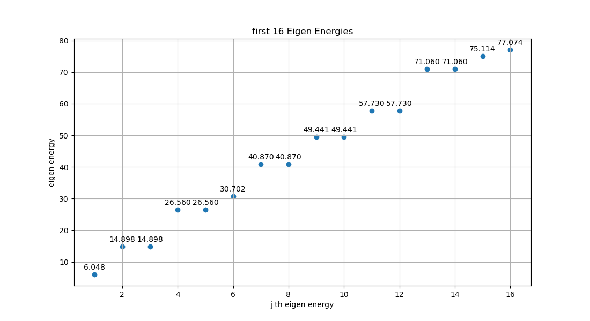
    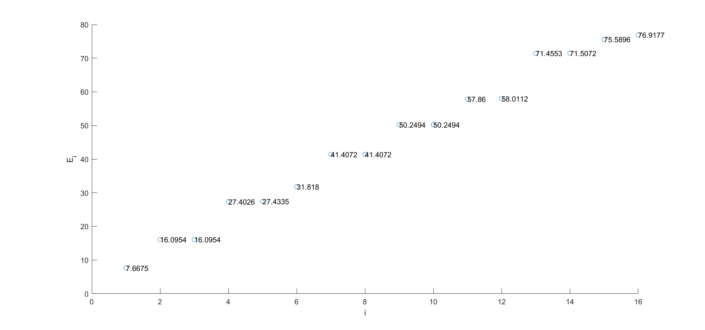
</div>

（左图为谱方法，右图为有限差分法）

可以看到，两种方法给出的本征值十分接近，且都很好地描述了本征能量的二重简并现象。

在这种情况下对比两种方法得到的前 $16 $ 个本征函数：

<div style="display: flex; justify-content: center;">
    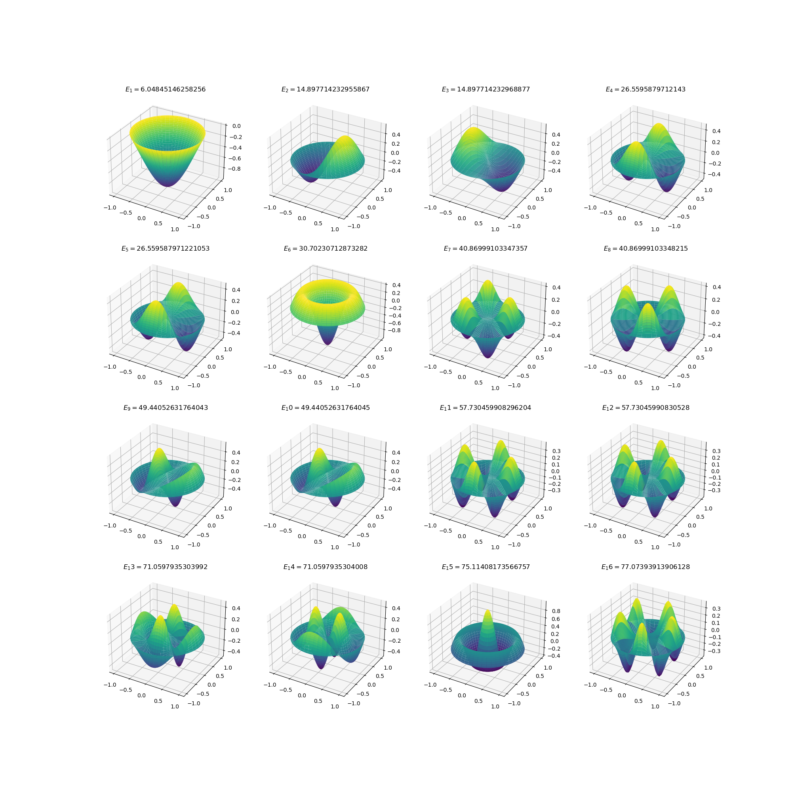
    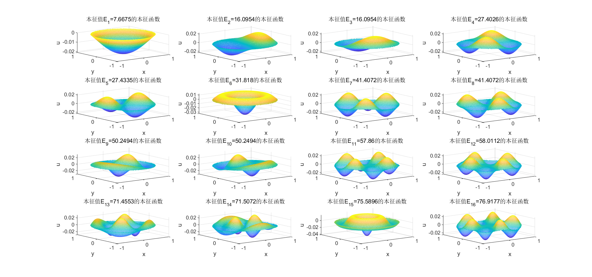
</div>

（左图为谱方法，右图为有限差分法）

可以看到，两种方法给出的前 $16 $ 个本征函数几乎完全一致，并且都很好地描述了本征能量的二重简并现象。

#### $a=10 $ 情况的对比

$a=10 $ 意味着扰动的空间变化较为剧烈，在这种情况下对比两种方法得到的前 $16 $ 个本征值：

<div style="display: flex; justify-content: center;">
    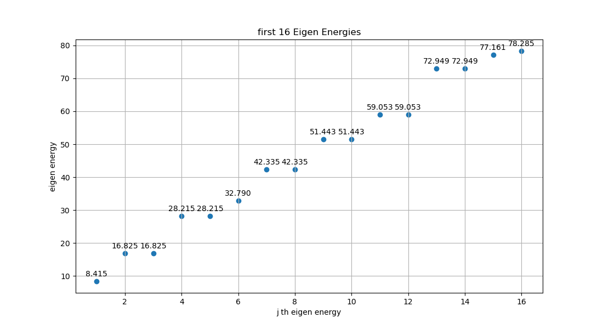
    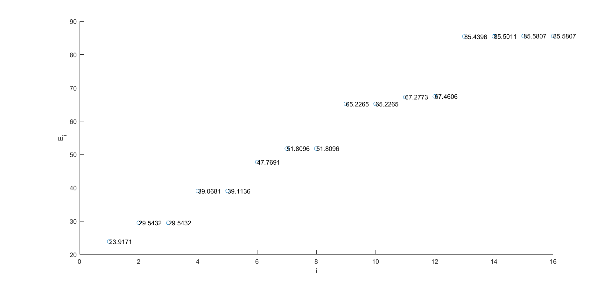
</div>

（左图为谱方法，右图为有限差分法）

可以看到，两种方法给出的本征值有了明显差异，有限差分法给出的前 $16 $ 个本征能量明显大于谱方法，有限差分法给出的能量本征值有较大误差。

在这种情况下对比两种方法得到的前 $16 $ 个本征函数：

<div style="display: flex; justify-content: center;">
    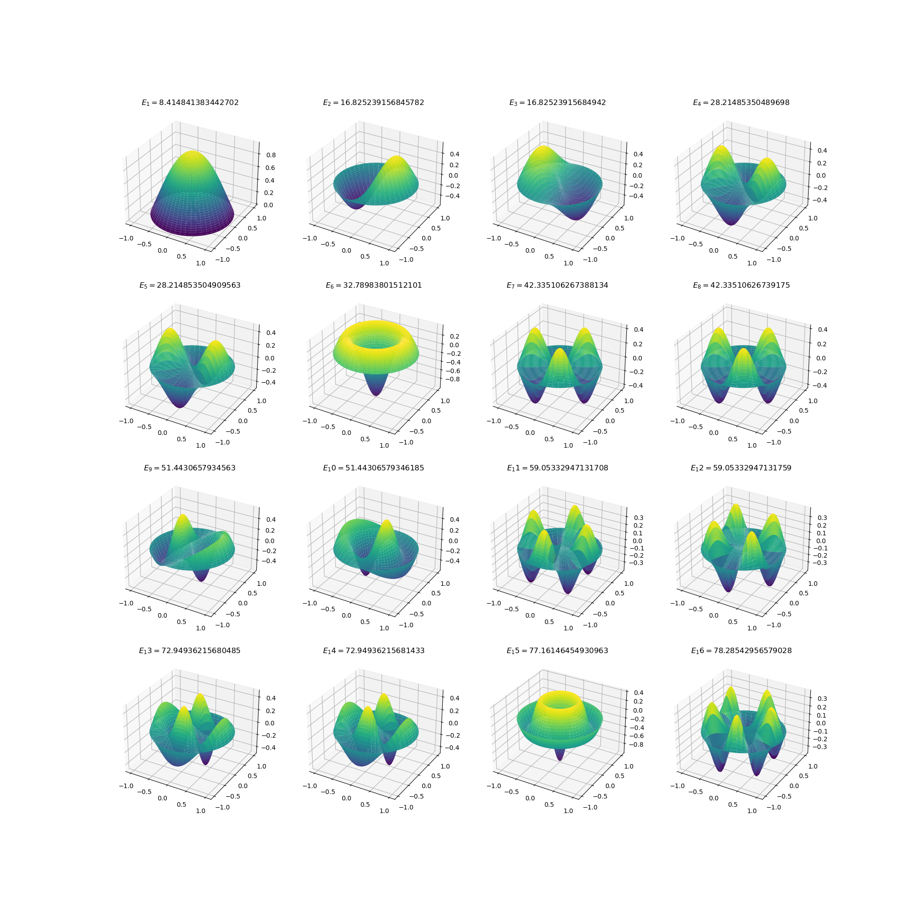
    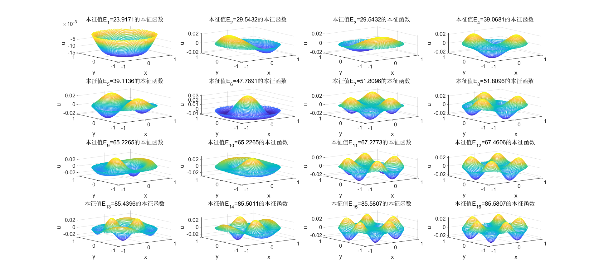
</div>

（左图为谱方法，右图为有限差分法）

可以看到，两种方法给出的前 $16 $ 个本征函数有了较大差异。谱方法在 $a=10 $ 情况给出的本征函数与 $a=1 $ 情况给出的本征函数相差不大，而有限差分法在 $a=10 $ 情况下给出的本征函数有了明显形变。

#### $a=100 $ 情况的对比

$a=100 $ 意味着扰动的空间变化相当剧烈，在这种情况下对比两种方法得到的前 $16 $ 个本征值：

<div style="display: flex; justify-content: center;">
    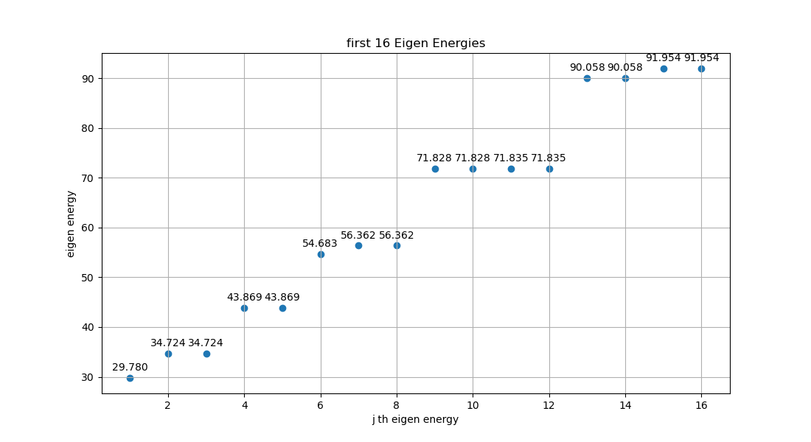
    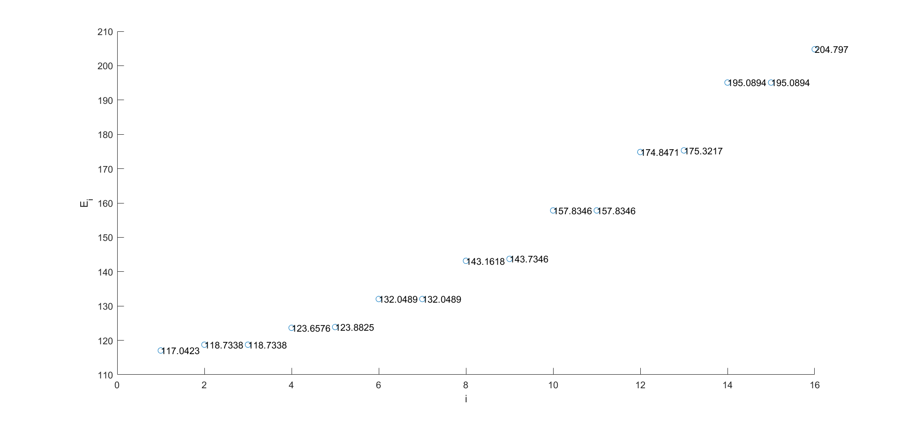
</div>

（左图为谱方法，右图为有限差分法）

可以看到，两种方法给出的本征值有相当大的差异，有限差分法给出的前 $16 $ 个本征能量远大于谱方法，有限差分法给出的能量本征值有相当大的误差。

在这种情况下对比两种方法得到的前 $16 $ 个本征函数：

<div style="display: flex; justify-content: center;">
    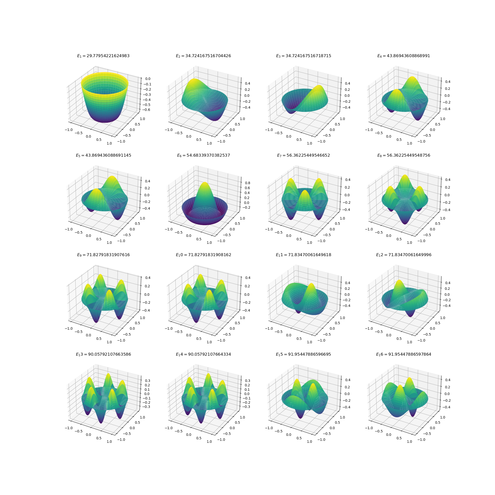
    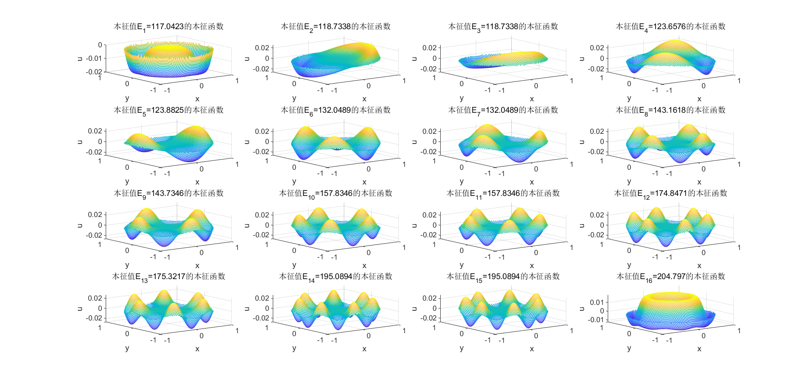
</div>

（左图为谱方法，右图为有限差分法）

可以看到，两种方法给出的前 $16 $ 个本征函数仍有较大差异。谱方法在 $a=100 $ 情况给出的本征函数与 $a=1 $ 情况给出的本征函数相差较大，而有限差分法在 $a=100 $ 情况下给出的本征函数有了明显形变，且遗漏了一种非简并的本征函数。

### 总结

谱方法将解 $\psi $ 表示为正交完备基函数 $\displaystyle{\{\varphi_j\} }$ 的线性组合 $\displaystyle{\psi=\sum_{n=1}^{\infty} C_j \varphi_j }$ ，通过求出系数 $C_j $ 来求出本征函数。

对于较小的本征值及对应的本征函数，谱方法的计算结果与较为准确。然而，实际求解过程中，只能选取有限个基函数，这种截断会导致计算较大本征值和本征函数时的误差。

有限差分法将连续的问题离散化，将连续的函数或导数转化为离散的点和有限差分近似。我们先将连续的二维区域划分为离散的二维网格，然后在网格上建立差分方程，将微分方程转化为代数方程组。最后，通过数值方法求解这个代数方程组，得到问题的数值解。

有限差分法的误差主要来自于离散步长 $h $ 并非无穷小。因此，若扰动的空间变化并不剧烈，则其给出的结果较为准确。若扰动的空间变化相当剧烈，则用差分代替导数是一种很不准确的近似，因此会带来相当大的误差。

正如文中 $a=100 $ 就是扰动的空间变化相当剧烈的情形，此时用有限差分法求出的基态能级 $E_1 $ 远大于用谱方法求出的基态能级，有限差分法求出的本征能量有相当大误差。

从计算量来看，谱方法的计算量远大于有限差分法；从误差来看，若算力充足，则谱方法的误差远小于有限差分法的误差。在解决实际问题时要综合考虑可用算力和求解问题精度要求来选择求解方法。


