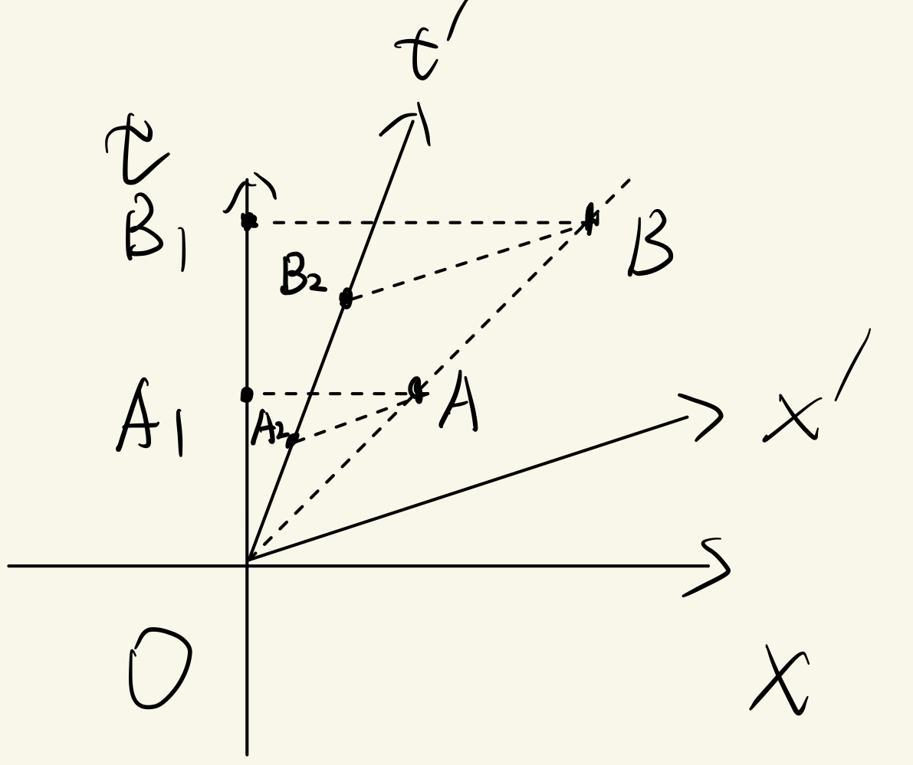
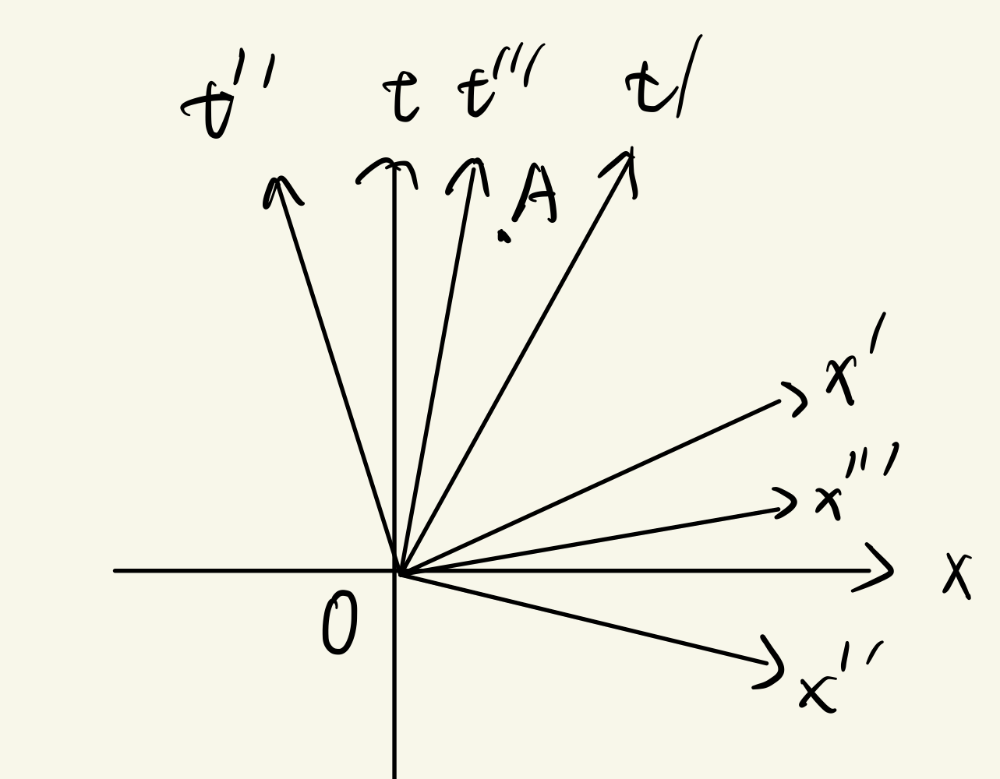
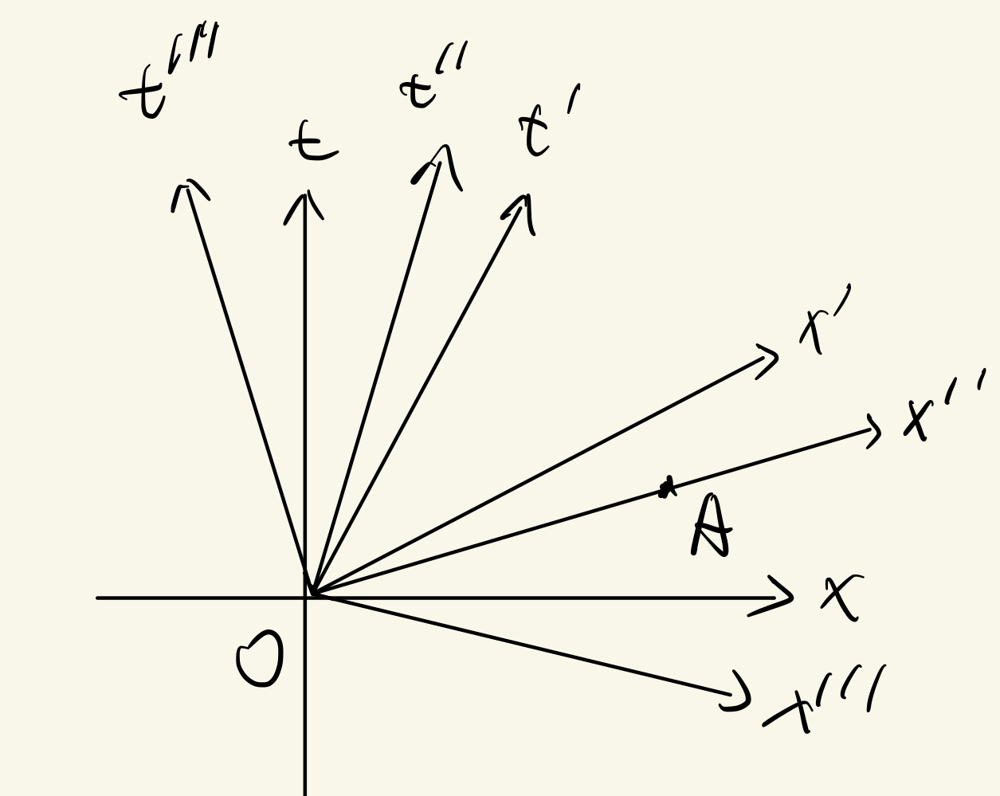
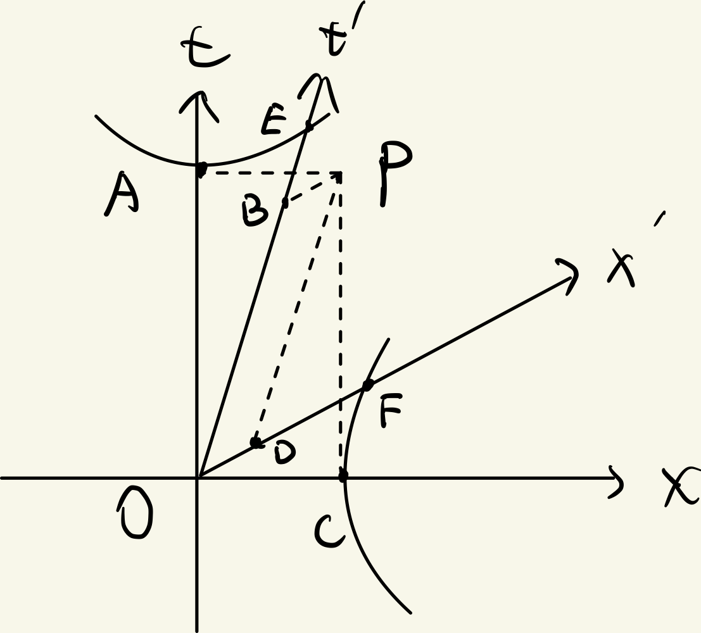
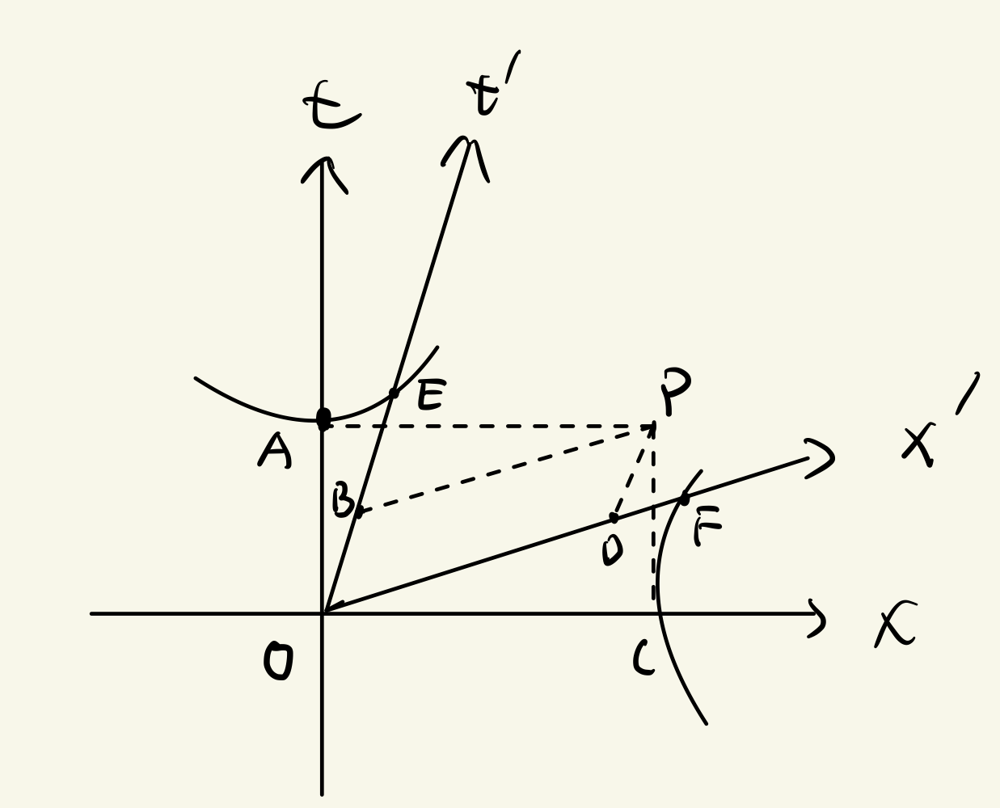
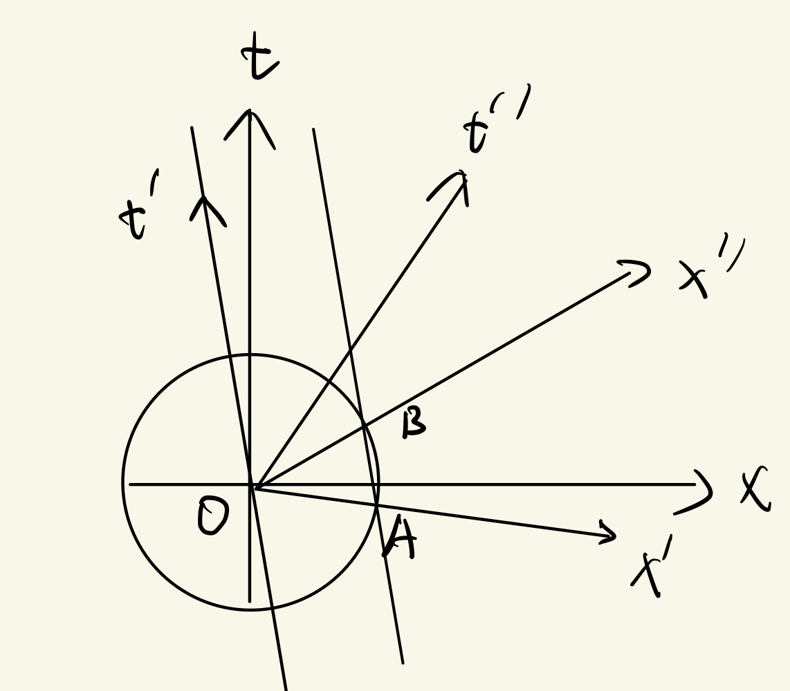
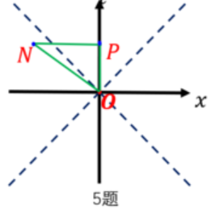
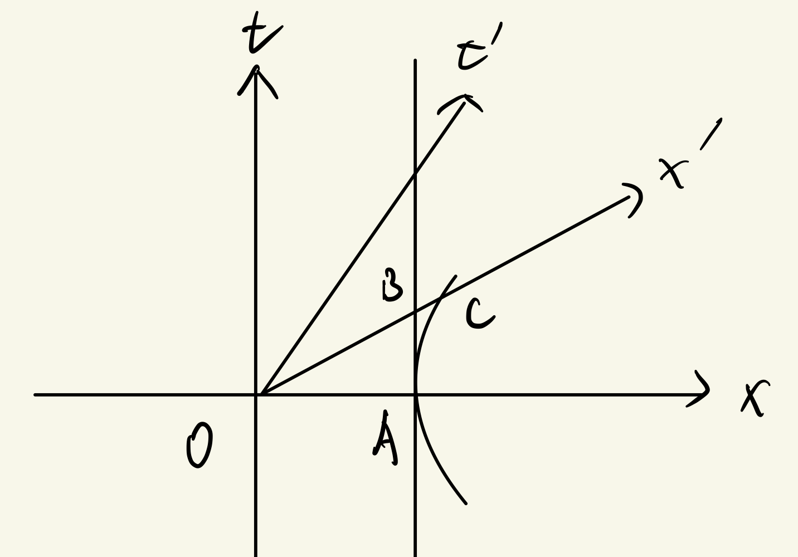
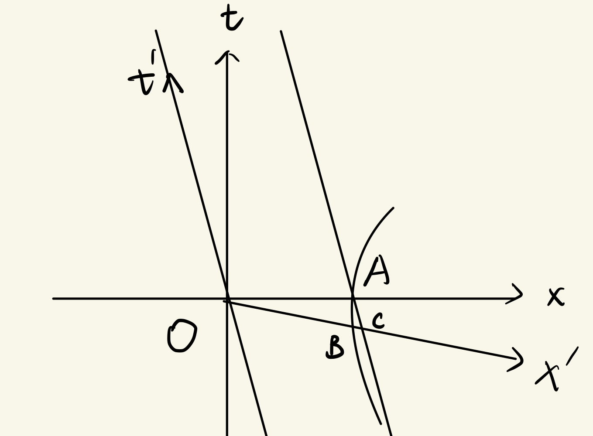
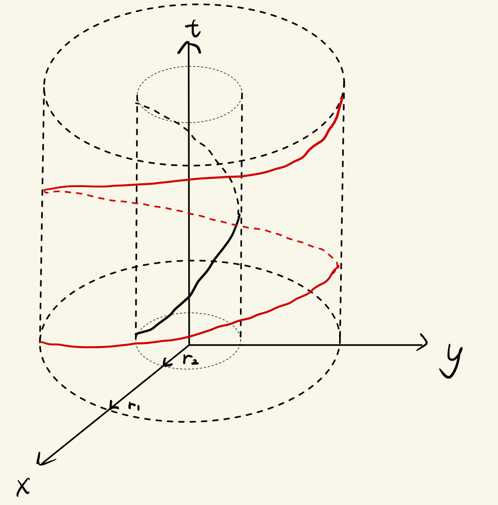

## 第一章 2,3 节练习题

### 1

> 为什么类时间隔小于零而不是大于零？

间隔定义为

$$
\mathrm{d}s^2
=-\mathrm{d}t^2+\mathrm{d}x^2+\mathrm{d}y^2+\mathrm{d}z^2
$$

由类时间隔描述的两事件存在因果关系，可以通过小于等于光速的信号联系。

因此有

$$
\mathrm{d}x^2+\mathrm{d}y^2+\mathrm{d}z^2
<\mathrm{d}t^2
$$

因此类时间隔

$$
\mathrm{d}s^2
=-\mathrm{d}t^2+\mathrm{d}x^2+\mathrm{d}y^2+\mathrm{d}z^2
<0
$$

### 2

> 两事件类光，则有因果关系，同时是绝对的，先后是绝对的；两事件类时，则有因果关系，无同时，先后是绝对的；两事件类空，则无因果关系，同时是相对的，先后是相对的，两事件绝对异地。用时空图说明上面的结论。

#### 两事件类光，则有因果关系，同时是绝对的，先后是绝对的

  

事件 $A $ 与事件 $O $ 类光。$A $ 在 $O $ 的光锥上，二者可通过光信号联系，因此有因果关系；

若两类光事件同时，则这两个事件实际上是同一个事件，因此在任何惯性系中都有相同的时间坐标，因此同时是绝对的；

考虑位于 $O $ 光锥上不同的两点 $A,B $，二者类光。过 $A,B $ 点分别作 $x $ 轴平行线交 $t $ 轴于 $A_1,B_1 $ 点；过 $A,B $ 点分别作 $x' $ 轴平行线交 $t' $ 轴于 $A_2,B_2 $ 点。

由于 $\left|A_1 O \right|<\left|B_1 O \right| $，因此在 $x $ 系中有 $t_A<t_B $

由于 $\left|A_2 O \right|<\left|B_2 O \right| $，因此在 $x' $ 系中有 $t'_A<t'_B $

因此先后是绝对的。

#### 两事件类时，则有因果关系，无同时，先后是绝对的

  

事件 $A $ 与事件 $O $ 类时。二者可通过速度小于光速的信号联系，因此有因果关系。

在 $x,x',x'',x''' $ 系中，都有 $t_O=0,t_A>0=t_O $，因此无同时，先后是绝对的。

#### 两事件类空，则无因果关系，同时是相对的，先后是相对的，两事件绝对异地

  

事件 $A $ 与事件 $O $ 类空。二者无法通过传播速度小于等于光速的信号联系，因此无因果关系。

在 $x'' $ 系中二者同时，而在 $x $ 系中二者不同时，因此同时是相对的。

在 $x' $ 系中 $t'_A<0=t_O $，而在 $x $ 系中 $t_A>0=t_O $，因此先后是相对的。

在 $x,x',x''，x''' $ 系中二者都是异地事件，因此二者绝对异地。

### 3

> 由于间隔不变，导致两不同事件（类时、类空、类光）在不同惯性系中的空间距离不同，时间间隔也不同。画图说明上述结论。

#### 类时事件

  

如图，事件 $P $ 与事件 $O $ 类时。过 $P $ 作 $x $ 轴的平行线交 $t $ 轴于 $A $，过 $P $ 作 $x' $ 轴的平行线交 $t' $ 轴于 $B $，过 $P $ 作 $t $ 轴的平行线交 $x $ 轴于 $C $，过 $P $ 作 $t' $ 轴的平行线交 $x' $ 轴于 $D $；过 $A $ 作校准曲线交 $t' $ 轴于 $E $，过 $C $ 作校准曲线交 $x' $ 轴于 $F .$

$OP $ 在 $x $ 系的时间间隔取决于 $\left|OA \right| $，在 $x' $ 系的时间间隔取决于 $\left|OB \right| $，而由校准曲线，有

$$
\left|OA \right| = \left|OE \right| > \left|OB \right|
$$

同理，$OP $ 在 $x $ 系的空间距离取决于 $\left|OC \right| $，在 $x' $ 系的空间距离取决于 $\left|OD \right| $，而由校准曲线，有

$$
\left|OC \right| = \left|OF \right| > \left|OD \right|
$$

综上，两类时事件在不同惯性系中的空间距离不同，时间间隔也不同。

#### 类空事件

  

如图，事件 $P $ 与事件 $O $ 类空。

$OP $ 在 $x $ 系的时间间隔取决于 $\left|OA \right| $，在 $x' $ 系的时间间隔取决于 $\left|OB \right| $，而由校准曲线，有

$$
\left|OA \right| = \left|OE \right| > \left|OB \right|
$$

同理，$OP $ 在 $x $ 系的空间距离取决于 $\left|OC \right| $，在 $x' $ 系的空间距离取决于 $\left|OD \right| $，而由校准曲线，有

$$
\left|OC \right| = \left|OF \right| > \left|OD \right|
$$

综上，两类空事件在不同惯性系中的空间距离不同，时间间隔也不同。

#### 类光事件

  

如图，事件 $P $ 与事件 $O $ 类光。

$OP $ 在 $x $ 系的时间间隔取决于 $\left|OA \right| $，在 $x' $ 系的时间间隔取决于 $\left|OB \right| $，而由校准曲线，有

$$
\left|OA \right| = \left|OE \right| > \left|OB \right|
$$

同理，$OP $ 在 $x $ 系的空间距离取决于 $\left|OC \right| $，在 $x' $ 系的空间距离取决于 $\left|OD \right| $，而由校准曲线，有

$$
\left|OC \right| = \left|OF \right| > \left|OD \right|
$$

综上，两类光事件在不同惯性系中的空间距离不同，时间间隔也不同。

### 4

> 是否存在这样的两个参考系（其中一个为尺子的静系），通过调整这两个参考系的坐标轴，使得在两系中尺子“看起来一样长”？

  

如图，对尺子测长度要在同一时刻进行测量。因此，$x' $ 系中尺子长度取决于 $\left|OA \right| $，$x'' $ 系中尺子长度取决于 $\left|OB \right| $，二者“看起来一样长”（在同一个圆上，欧氏长度相等）。

### 5

> 如图，$NP $ 平行于 $x $ 轴，$N $ 在光锥之外，求 $\left|ON \right|,\left|OP \right|,\left|NP \right| $ 的线长关系。

  

设 $N $ 的坐标为 $(t,x),\left|t \right|<\left|x \right| $，$P $ 的坐标为 $(t,0) $

$$
\left|ON \right|
=\sqrt{\left|-t^2+x^2 \right|}
=\sqrt{-\left|t \right|^2 + \left|x \right|^2 }
$$

$$
\left|OP \right|
=\sqrt{\left|-t^2+0^2 \right|}
=\sqrt{\left|t \right|^2}
$$

$$
\left|NP \right|
=\sqrt{\left|-0^2 + \left|x \right|^2 \right|}
=\sqrt{\left|x \right|^2}
$$

因此：

$$
\left|NP \right|>\left|OP \right|>\left|ON \right|
$$

## 作业

### 1

用时空图在动系和静系中分析尺缩效应。（分别在动系和静系中画校准曲线来分析）

#### 静系中画校准曲线

  

如图，静系中尺子的长度

$$
l_0
=\left|OA \right|
$$

动系中尺子长度

$$
l
=\left|OB \right|
$$

而由校准曲线知

$$
\left|OA \right| = \left|OC \right| > \left|OB \right|
$$

因此有

$$
l_0 > l
$$

#### 动系中画校准曲线

  

首先证明示意图是合适的，即 $B $ 点在 $C $ 点左侧。

设 $t' $ 轴方程为

$$
t':t = -\frac{1 }{v } x
$$

设 $A $ 点图中坐标为

$$
A(l,0)
$$

则尺子右端世界线方程为：

$$
t = -\frac{1 }{v } \left(x-l \right)
$$

$x' $ 轴方程为：

$$
x':t = - v x
$$

校准曲线方程为：

$$
\frac{x^2 }{l^2 } - \frac{t^2 }{l^2 } = 1
$$

联立

$$
\left\{
\begin{aligned}
&t = -\frac{1 }{v } \left(x-l \right) \\
&t = - v x
\end{aligned}
\right.
$$

解得：

$$
x_C
=\frac{l }{1-v^2 } 
$$

联立

$$
\left\{
\begin{aligned}
&t = - v x \\
&\frac{x^2 }{l^2 } - \frac{t^2 }{l^2 } = 1
\end{aligned}
\right.
$$

解得：

$$
x_B
=\frac{l }{\sqrt{1-v^2} } 
$$

因此

$$
x_B = \frac{l }{\sqrt{1-v^2} } < x_C = \frac{l }{1-v^2 } 
$$

即 $B $ 在 $C $ 左侧。

尺子在动系长度

$$
l = \left|OA \right|
$$

尺子在静系长度

$$
l_0 = \left|OC \right|
$$

而由校准曲线知

$$
\left|OA \right| = \left|OB \right| < \left|OC \right|
$$

因此：

$$
l < l_0
$$

### 2

假设赤道上空两万公里处有一颗卫星，其上携带一个标准钟 $A $；赤道处也有一个标准钟 $B $。已知卫星公转线速度为每小时 $14000 $ 公里，赤道的线速度为每小时 $1667 $ 公里。

#### 2-1

> 画出两钟世界线的示意图。

  

如图，黑线是赤道处钟 $B $ 的世界线，红线是卫星上标准钟 $A $ 的世界线。

#### 2-2

> 求一天内两钟的时间差。

考虑国际单位制，卫星绕地半径记为 $r_1 $，赤道半径记为 $r_2 $，卫星上钟 $A $ 的角速度记为 $\omega_1 $，赤道处钟 $B $ 的角速度记为 $\omega_2 $，卫星线速度记为 $v_1 $，赤道线速度记为 $v_2 $

采用极坐标，用 $\theta $ 描述时钟位置。设 $T=24~\mathrm{h} .$

卫星钟 $A $ 世界线方程：

$$
l_1:t = \frac{\theta }{\omega_1 } 
$$

赤道钟 $B $ 世界线方程：

$$
l_2:t = \frac{\theta }{\omega_2 } 
$$

卫星钟 $A $ 读数

$$
\begin{aligned}
\tau_1
&=\int\limits_{l_1} \sqrt{-\mathrm{d}s^2/c^2} \\
&=\frac{1 }{c } \int\limits_{l_1} \sqrt{-\left(-c^2 \mathrm{d}t^2+\mathrm{d}x^2+\mathrm{d}y^2 \right)} \\
&=\frac{1 }{c } \int\limits_{l_1} \sqrt{c^2 \mathrm{d}t^2 - r_1^2\mathrm{d}\theta^2} \\
&=\frac{1 }{c } \int\limits_{l_1} \sqrt{c^2 \mathrm{d}t^2 - r_1^2\omega_1^2\mathrm{d}t^2} \\
&=\frac{1 }{c } \int\limits_{l_1} \sqrt{c^2-v_1^2}\mathrm{d}t \\
&=\frac{\sqrt{c^2-v_1^2} }{c } T \\
&=T\sqrt{1-v_1^2/c^2}
\end{aligned}
$$

同理，赤道钟 $B $ 读数

$$
\tau_2
=T\sqrt{1-v_2^2/c^2}
$$

读数差为：

$$
\begin{aligned}
\Delta \tau
&=\tau_2 - \tau_1 \\
&=T\left(\sqrt{1-v_2^2/c^2} - \sqrt{1-v_1^2/c^2} \right) \\
&\approx 7.16\times 10^{-6}~\mathrm{s}
\end{aligned}
$$

