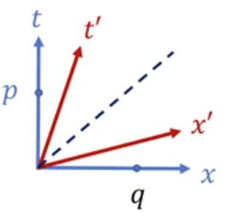
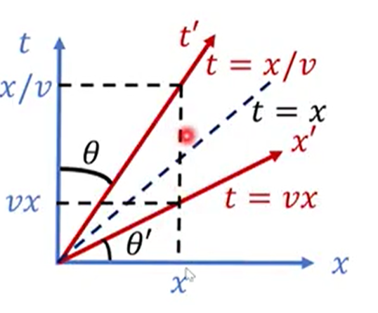
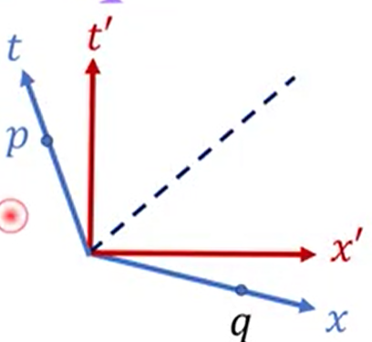
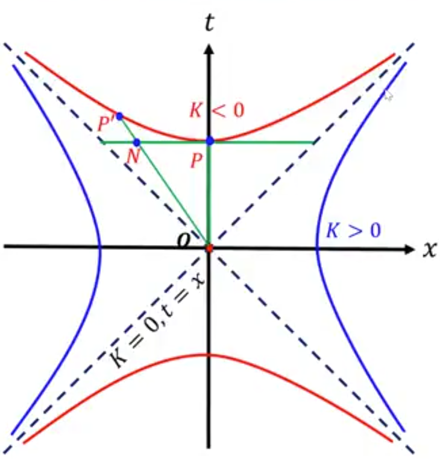
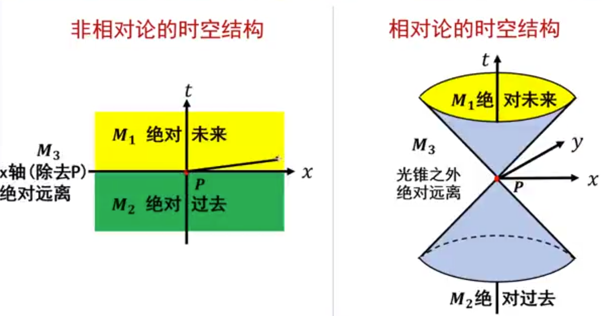

# 1 四维表述基础

## 1.1 预备知识

事件：空间一点与时间一瞬的结合，$p=(t,\vec{x}) $

粒子：质点（有静质量，$m_0>0 $）和无静止质量粒子（光子、引力子等）。

世界线：粒子的全部历史。

观者：进行物理观测的人。

时空：全部事件的集合。

参考系：无数观者的集合 $R $ 称为一个参考系，若它满足以下条件：时空（或其中一个开集）中的任一点有且仅有 $R $ 内的一个观者的世界线经过。

## 1.2 SR的背景时空

SR的背景时空为闵氏时空。

### (1)线元（取 $c=1 $）

$$
\mathrm{d}s^2
=-c^2\mathrm{d}t^2+\mathrm{d}x^2+\mathrm{d}y^2+\mathrm{d}z^2
=-\mathrm{d}t^2+\mathrm{d}\vec{x}^2
=\eta_{\mu\nu}\mathrm{d}x^{\mu}\mathrm{d}x^{\nu}
$$

闵氏度规：

$$
\eta_{\mu\nu}
=\mathrm{diag}\left(-1,1,1,1 \right)
$$

线元是洛伦兹不变量：

$$
\mathrm{d}s^2=\mathrm{d}s'^2
$$

### (2)速度（惯性坐标系中）

$$
u
=\frac{\sqrt{\mathrm{d}x^2+\mathrm{d}y^2+\mathrm{d}z^2} }{\mathrm{d}t } 
=\frac{\mathrm{d}\left|\vec{x} \right| }{\mathrm{d}t } 
$$

$$
\mathrm{d}s^2
=-\mathrm{d}t^2+\mathrm{d}\vec{x}^2
=-\mathrm{d}t^2+u^2\mathrm{d}t^2
=-\left(1-u^2 \right)\mathrm{d}t^2
$$

$u=1 $，光速，$\mathrm{d}s^2=0 $，类光；

$u<1 $，亚光速，$\mathrm{d}s^2<0 $， 类时；

### （3）特殊洛伦兹变换

$$
\left\{
\begin{aligned}
&t'=\gamma\left(t-vx/c^2 \right) \\
&x'=\gamma\left(x-vt \right) \\
&y'=y \\
&z'=z
\end{aligned}
\right.,\quad
\gamma = \frac{1 }{\sqrt{1-v^2/c^2} } 
$$

$$
\gamma
\approx 1+\frac{1 }{2 } \left(\frac{v }{c }  \right)^2 + \frac{3 }{8 } \left(\frac{v }{c }  \right)^4 + \mathcal{O}\left(\left(\frac{v }{c }  \right)^6 \right)
$$

$$
x'^{\mu}
=a^\mu_{~~\nu} x^\nu
$$

$$
a^\mu_{~~\nu}
=\begin{bmatrix}
\gamma &-\gamma v &0 &0 \\
-\gamma v &\gamma &0 &0 \\
0 &0 &1 &0 \\
0 &0 &0 &1
\end{bmatrix}
$$

速度洛伦兹变换：

$$
\left\{
\begin{aligned}
&u_x' = \frac{u_x-v }{1-u_x v } \\
&u_y' = \frac{u_y }{\gamma^2\left(1-u_x v \right) } \\
&u_z' = \frac{u_z }{\gamma^2\left(1-u_x v \right) } 
\end{aligned}
\right.
$$

### (4)对应

惯性坐标--Lorentz坐标

间隔--闵氏线元

背景时空--闵氏时空

观者--类时曲线

惯性观者--类时测地线

### (5)SR的基本假设

光速不变原理、狭义相对性原理。

狭义相对性原理：惯性观者和非惯性观者有绝对区别；各惯性观者平权。 

## 1.3 惯性观者和惯性系

惯性坐标系：构成参考系的每个观者均为惯性观者；每个观者携带一个标准钟；有一个空间坐标值。

## 1.4 固有时和坐标时

观者的固有时就是ta的标准钟的读数。

标准钟：固有时=线长

$$
\Delta \tau
=\tau_2-\tau_1
=\frac{1 }{c } \int_{P_1}^{P_2}\sqrt{-\mathrm{d}s^2}
$$

事件 $P $ 在坐标系中的 $t $ 值称为坐标时。

二者的联系：

$$
\mathrm{d}\tau^2
=-\mathrm{d}s^2
=\left(1-u^2 \right)\mathrm{d}t^2
=\mathrm{d}t^2/\gamma_u^2
$$

$$
\mathrm{d}t = \gamma_u \mathrm{d}\tau
$$

固有时为粒子所在的静系 $\left(x',t' \right) $ 中的时间（$\mathrm{d}x'=0 $）。

$$
\mathrm{d}s^2=-c^2\mathrm{d}t'^2
=-c^2\mathrm{d}\tau^2
$$

## 1.5 时空图

### (1)惯性系之间的关系

洛伦兹变换：

$$
\left\{
\begin{aligned}
t'=\gamma(t-vx) \\
x'=\gamma(x-vt)
\end{aligned}
\right.
$$

$t' $ 轴的确定：$t' $ 轴的表达式为 $x'=0 $，即 $t=x/v $

$x' $ 轴的确定：$x' $ 轴的表达式为 $t'=0 $，即 $t=vx $

### 坐标轴正交性

  

在 $\Sigma $ 系中，$p=(t,0),q=(0,x) $，内积：

$$
p\cdot q
=p^\mu q^\nu \eta_{\mu\nu}
=-p^0 q^0 + p^1 q^1
=-t\times 0 + 0\times x
=0
$$

在 $\Sigma' $ 系中，$p=(\gamma t,-\gamma v t),q=(-\gamma v x,\gamma x),q=(-\gamma vx,\gamma x) $，内积：

$$
p\cdot q
=-p^0 q^0 + p^1 q^1
=-\gamma t\times (-\gamma v x) + (-\gamma v t)\times\gamma x
=0
$$

夹角相同 $\theta=\theta' $（一条直线斜率为 $v $，另一条直线斜率为 $1/v $）。

$\Sigma $ 系的两个坐标轴也关于 $\Sigma' $ 系的光锥对称。

  

$\Sigma' $ 系的两个坐标轴关于 $\Sigma $ 系的光锥对称。

  

$\Sigma $ 系的两个坐标轴也关于 $\Sigma' $ 系的光锥对称。

  

两系的光锥重合，都是角平分线。

$t' $ 坐标线为 $\Sigma $ 系中的一条类时曲线（测地线），代表一匀速直线运动的粒子的世界线。

$x' $ 坐标线为 $\Sigma $ 系中的一条类空曲线。

### (2)等线长曲线（校准曲线）

考虑1+1维时空线元：

$$
\mathrm{d}s^2=-\mathrm{d}t^2+\mathrm{d}x^2
$$

到原点 $O(0,0) $ 的线长（间隔）为常数 $K $ 的所有点 $(t,x) $ 的集合称为**等线长曲线**，满足方程：

$$
-t^2+x^2=K^2
$$

  

当 $K=0 $ 时，$-t^2+x^2=0,t=\pm x $，曲线上任一点 $M $ 到原点 $O $ 的线长均为零，该曲线为光锥。

当 $K<0 $ 时，$\displaystyle{\frac{t^2 }{\sqrt{-K}^2 }  }-\frac{x^2 }{\sqrt{-K}^2 }=1 , t=\pm\sqrt{x^2-K} $，曲线上任一点到原点 $O $ 的线长相等。该曲线又称为校准曲线。$\left|OP \right|=\left|OP' \right|>\left|ON \right| $，斜边小于直角边。

当 $K>0 $ 时，$\displaystyle{\frac{x^2 }{\sqrt{K}^2 } - \frac{t^2 }{\sqrt{K}^2 } = 1 , x=\pm\sqrt{t^2+K} }$，该曲线也是校准曲线。

## 1.6 SR与非SR的时空结构对比

|理论|第一手概念|派生||
|:---:|:---:|:---:|:---:|
|非SR|时间+空间|时空是绝对的（坐标系不依赖的）|一副扑克|
|SR|四维时空|3+1分解，时间、空间是相对的|无穷多副扑克|

  

$M_1 $ 为时间 $P $ 的绝对未来，与 $P $ 有因果联系；

$M_2 $ 为时间 $P $ 的绝对过去，与 $P $ 有因果联系；

$M_3 $ 为时间 $P $ 的绝对远离，与 $P $ 无因果联系；