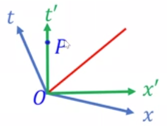
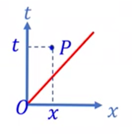
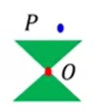
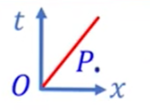
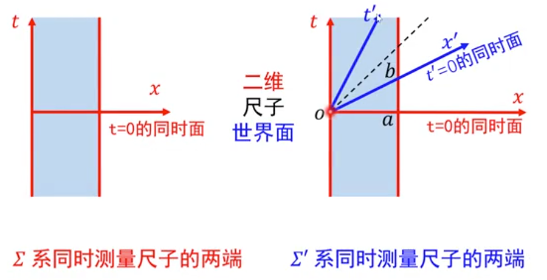
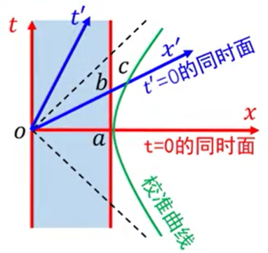
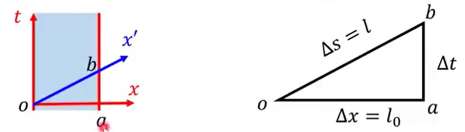
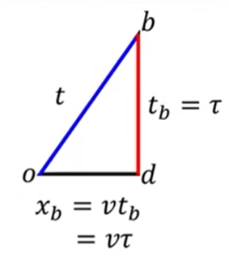
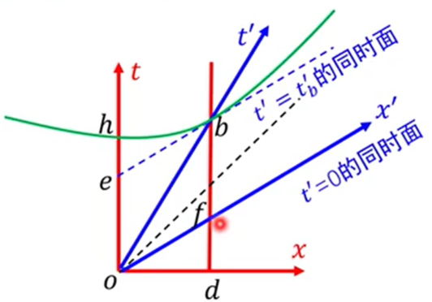

# 2 相对论的时空理论

## 2.1 相对论的时空结构

事件 $1,2 $ 的时空坐标分为设为 $(t_1,x_1,y_1,z_1),(t_2,x_2,y_2,z_2) $，间隔：

$$
S^2
=-(t_2-t_1)^2+(x_2-x_1)^2+(y_2-y_1)^2+(z_2-z_1)^2
=\eta_{\mu\nu}\Delta x^\mu\Delta x^\nu
$$

类时间隔 $S^2<0 $，$P_2 $ 在 $P_1 $ 的光锥之内；

类光间隔 $S^2=0 $，$P_2 $ 在 $P_1 $ 的光锥之上；

类空间隔 $S^2>0 $，$P_2 $ 在 $P_1 $ 的光锥之外。

由间隔不变性，$P_2 $ 和 $P_1 $ 的光锥的几何关系是绝对的，不依赖于惯性参考系。

### 类光间隔

  

仅考虑 1+1 维时空，在 $\Sigma $ 系

$$
S^2 = -t^2 + x^2 = 0 \Longrightarrow t = x
$$

在 $\Sigma' $ 系

$$
S^2 = -t'^2 + x'^2 = 0 \Longrightarrow t' = x'
$$

对任意惯性系，$P $ 点都在 $O $ 点的光锥上。

### 类时间隔

  

$$
S^2< 0
$$

可以通过 Lorentz 变换使得 $O,P $ 两点在某个惯性系中同地不同时。

  

具体做法是以 $OP $ 为 $t' $ 轴构造坐标系 $\Sigma' $。由于 $t' $ 轴是 $x'=0 $ 线，即 $t' $ 轴上任意一点在 $\Sigma' $ 系的空间坐标 $x'=0 $。因此，在 $\Sigma $ 系 $O,P $ 是不同时不同地事件，但它们的时空坐标通过 Lorentz 变换变换到 $\Sigma' $ 系的时空坐标后，在 $\Sigma' $ 系它们成了同地不同时事件。

同理，一个惯性坐标系中的两个同地不同时事件，在其他惯性坐标系中不同地。

  

#### Lorentz 变换保持时间正向不变

  

上半光锥 $t>0 $，类时间隔 $t>x,1>v $，因此：

$$
t' = \gamma(t-vx) > 0
$$

类时区域包括 $t>0 $ 和 $t<0 $ 两部分，由于 Lorentz 变换保持时间正向不变，因此这两部分不能互换。

绝对未来：$P $ 点在 $O $ 点的上半光锥之内。

  

绝对过去：$P $ 点在 $O $ 点的下半光锥之内。

  

#### 时间和空间的相对性

两类时事件在任何惯性系中都绝对不同时。从时空图上看，某一惯性系 $\Sigma' $ 的等时线是一系列平行于 $x' $ 轴的直线。而在时空图中，$x' $ 轴的斜率允许的取值范围为 $\left[-1,1 \right] $，因此 $\Sigma' $ 的等时线斜率在 $[-1,1] $ 范围内。而由于 $O,P $ 是类时事件，$P $ 在 $O $ 的光锥之内，直线 $OP $ 的斜率不可能落在 $[-1,1] $ 的范围内。因此两类时事件绝对不同时。

### 类空间隔

  

$$
S^2>0
$$

  

可以通过 Lorentz 变换使得 $O,P $ 两点在某个惯性系中同时不同地。具体做法是以 $OP $ 为 $x' $ 轴构造坐标系 $\Sigma' $。由于 $x' $ 轴是 $t'=0 $ 线，即 $x' $ 轴上任意一点在 $\Sigma' $ 系的时间坐标 $t'=0 $。因此，在 $\Sigma $ 系 $O,P $ 是不同时不同地事件，但它们的时空坐标通过 Lorentz 变换变换到 $\Sigma' $ 系的时空坐标后，在 $\Sigma' $ 系它们成了同时不同地事件。

两类空事件，先后是相对的，但绝对异地。

## 2.2 时空关系的绝对分类

取 $P_1=O=(0,0,0,0),P_2=P=(t,x,y,z) $

$$
S^2
=-t^2+x^2+y^2+z^2
$$

类光间隔 $S^2=0 $，$P $ 点在光锥上；

类时间隔 $S^2<0 $，$P $ 点在光锥内；可通过洛伦兹变换使得 $O,P $ 两事件同地不同时。

类时区域包括 $t>0,t<0 $ 两部分，洛伦兹变换保持时间正向不变。

$$
t'=\gamma(t-vx)
$$

由于 $t>x,v<1 $，因此 $t'>0 $。

绝对未来：$P $ 点在 $O $ 点的上半光锥之内。

绝对过去：$P $ 点在 $O $ 点的下半光锥之内。

$OP $ 在地面参考系为时空间隔，在飞船系为时间间隔。而间隔不变，因此两时间在不同参考系中的时间差不同。

类空间隔 $S^2>0 $，$P $ 点在光锥内；可通过洛伦兹变换使得 $O,P $ 两事件同时不同地。

两类空事件，先后相对，异地绝对。

## 2.3 因果律

两关联事件可用光信号或速度低于光速的信号联系。

实验表明，物质运动的速度不超过光速。

SR保证因果律：两类时和类光事件的先后是绝对的。两类空事件无因果联系。

两类空事件无因果关系。

## 2.4 同时的相对性和绝对性

两同时同地事件（$S^2=0 $，类光）在任何惯性系中仍为同时同地事件。同时绝对，同地也绝对。

$$
\Delta t = 0,\quad \Delta x = 0 \Longrightarrow
\left\{
\begin{aligned}
&\Delta t' = \gamma(\Delta t- v\Delta x) = 0 \\
&\Delta x' = \gamma(\Delta x - v\Delta t) = 0
\end{aligned}
\right.
$$

两同时不同地时间 $S^2=\Delta x^2>0 $，类空。同时是相对的。

两类空事件的同时和先后都是相对的。

两事件类光，有因果关系，同时是绝对的，先后是绝对的。

两事件类时，有因果关系，无同时，先后是绝对的。

两事件类空，因果关系，同时是相对的，先后是相对的，两事件绝对异地。

## 3 典型效应分析

### 3.1 尺缩效应

尺子在时空图中表现为一个二维世界面。

  

在某个惯性系中同时测量尺子两端的空间坐标，则这两个空间坐标的欧氏长度就是该惯性系中尺子的长度。

  

  

$l_0=\left|oa \right| $ 是 $\Sigma $ 系 $t=0 $ 时测的尺长。

$l=\left|ob \right| $ 是 $\Sigma' $ 系 $t'=0 $ 时测的尺长。

利用校准曲线：

$$
\left|oa \right| = \left|oc \right| > \left|ob \right|
$$

即：

$$
l_0>l
$$

静长（固有长度）最长，动尺收缩。

尺子只有一把（其世界面只有一个），但不同惯性系有不同的同时面，导致不同的惯性系测得不同的一维尺子长度。

$$
\mathrm{d}s^2 = -\mathrm{d}t^2+\mathrm{d}x^2
$$

$$
\Delta s^2 = -\Delta t^2 + \Delta x^2
$$

$$
l^2 = -\Delta t^2 + l_0^2
$$

$x' $ 轴方程 $t=vx $，$t_b=\Delta t=v\Delta x=v l_0 $

分别在 $\Sigma $ 系和 $\Sigma' $ 计算 $b $ 到 $o $ 点的线长，二者应相等：

$$
l^2
=-v^2 l_0^2 + l_0^2
=\left(1-v^2 \right)l_0^2
$$

得到：

$$
l
=\sqrt{1-v^2}l_0
=\frac{l_0 }{\gamma } 
$$

### 3.2 钟慢效应

  

$$
\left|db \right|=\left|oa \right|=\left|oc \right|>\left|ob \right|
$$

$$
\tau>t
$$

  

$t' $ 轴方程 $x=vt $，

$$
x_b = v t_b = \tau
$$

对类时间隔

$$
\mathrm{d}s^2 = -\mathrm{d}t^2 + \mathrm{d}x^2 < 0
$$

$$
-\mathrm{d}s^2 = \mathrm{d}t^2 - \mathrm{d}x^2 > 0
$$

即：

$$
\left|ob \right|^2 = \left|db \right|^2 - \left|od \right|^2
$$

$$
t^2 = \tau^2 - (v\tau)^2 \Longrightarrow
t^2 = \left(1-v^2 \right)\tau^2
$$

$$
\boxed{
t = \sqrt{1-v^2}\tau = \frac{\tau }{\gamma } < \tau
}
$$

运动时钟变慢，即 $\Sigma $ 系认为动钟 $C' $ 变慢。

  

从 $\Sigma' $ 系来看，$\Sigma' $ 系的观者根据同时面 $t'=0 $ 和 $t'=t_b' $，认为动钟 $C_2 $ 较慢：

$$
\left|ob \right| = \left|oh \right| > \left|oe \right| = \left|fb \right|
$$

$\Sigma' $ 系，拿 $\left|ob \right| $ 比 $\left|fb \right| $；

$\Sigma $ 系，拿 $\left|ob \right| $ 比 $\left|db \right| $。

也就是说，在 $\Sigma $ 系比钟，找 $\Sigma $ 系的同时面；在 $\Sigma' $ 系比钟，找 $\Sigma' $ 系的同时面。

站的角度不同，导致结果不一样。

钟慢效应钟，无任何钟的走时率真正变小。

### 3.3 孪生子效应

时间的比较，就是类时曲线线长的比较。

  

校准曲线给出：

$$
\left|pa \right| = \left|pc \right| > \left|pb \right|
$$

$$
\left|qa \right| > \left|qb \right|
$$

$$
\left|\overline{paq} \right| > \left|\overline{pbq } \right|
$$

因此，重逢时乙比甲年轻。

推论：闵氏时空中两点（类时事件）间的类时测地线是该两点间类时曲线的最长者。

一人惯性运动，一人非惯性运动，二人地位不平等。

惯性运动世界线为测地线，4加速为零；

非惯性运动世界线为非测地线，有4加速。

### 3.4 车库佯谬

有一辆静长与车库相等的车，以一定速度 $u $ 入库。在司机看来，车库变短，装不下整俩车；在车库看来，车变短，可以装下。那么车库能否装下整辆车？

### 3.5 悬崖佯谬

汽车以接近光速的速度由公路驶向悬崖。在悬崖看来，汽车缩短，受重力作用进行平抛运动，会坠入悬崖；在汽车司机看来，悬崖高速向自己飞来，悬崖长度缩短至非常短的距离，因此可以飞越悬崖。那么汽车能否飞越悬崖？

### 3.6 剑鞘装仙剑

一柄仙剑高速飞入剑鞘，最终停在剑鞘里。仙剑和剑鞘内部空间静长相等。在剑鞘看来，仙剑缩短了，装入剑鞘时剑柄上的护手先接触剑鞘；在仙剑看来，剑鞘缩短了，剑尖先接触剑鞘底部。那么哪个部位受力使仙剑停止运动？

