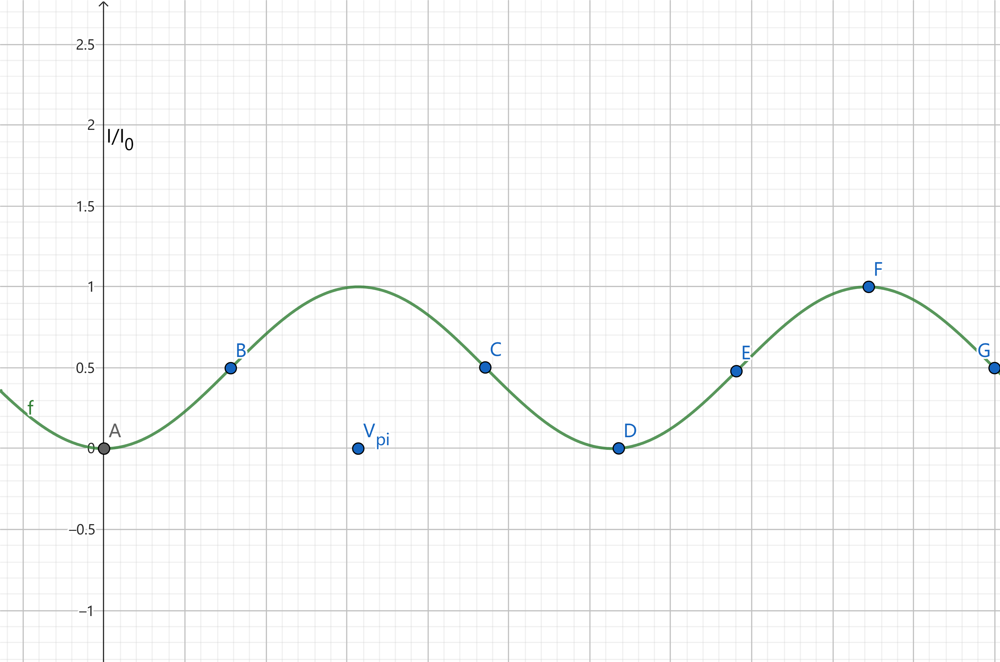
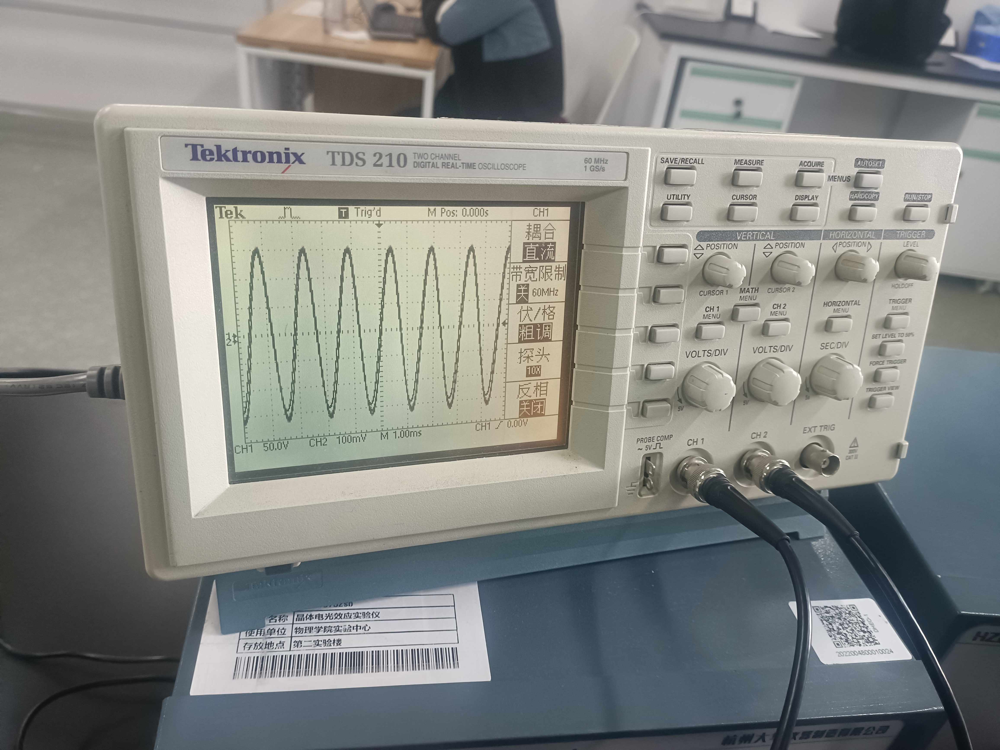
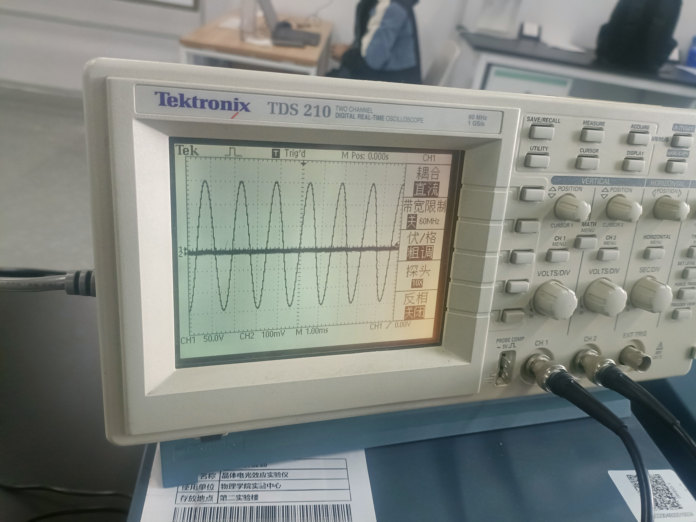
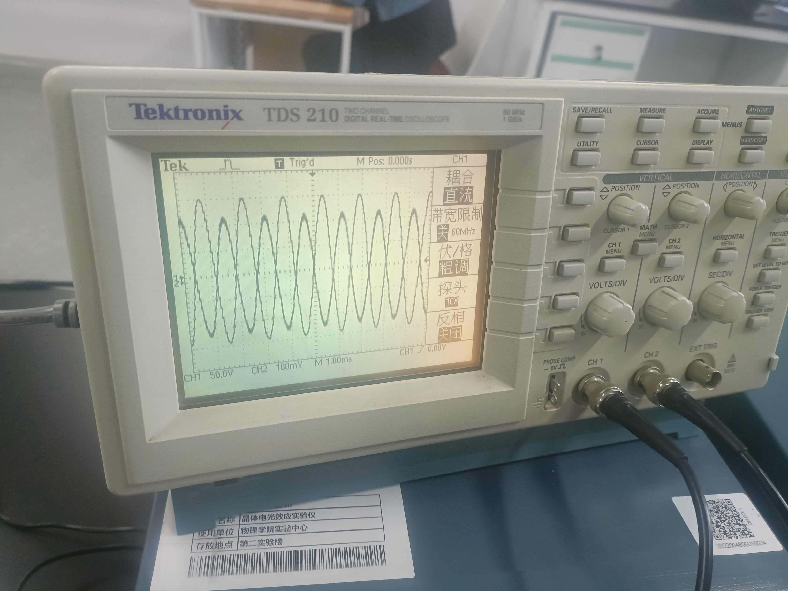
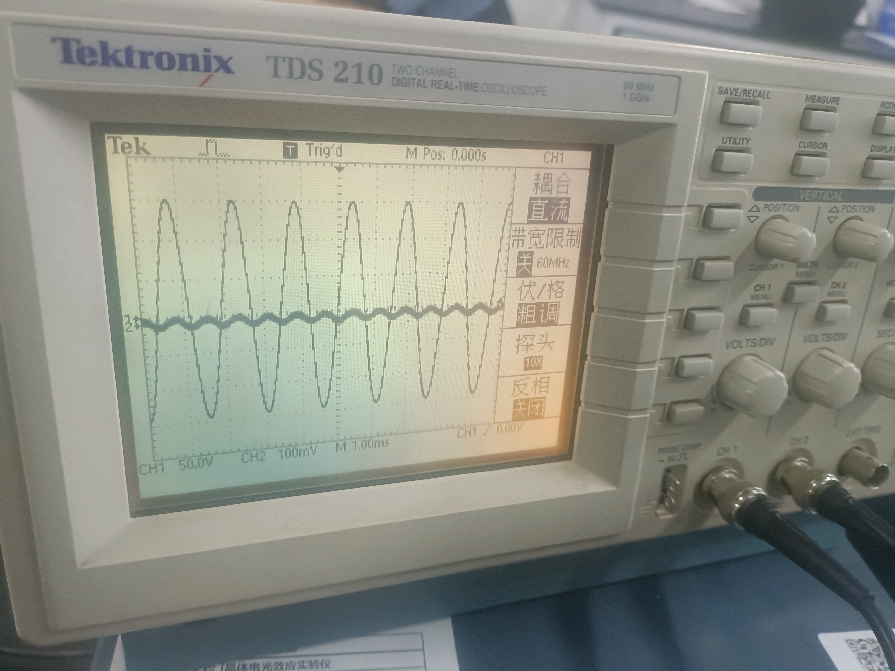
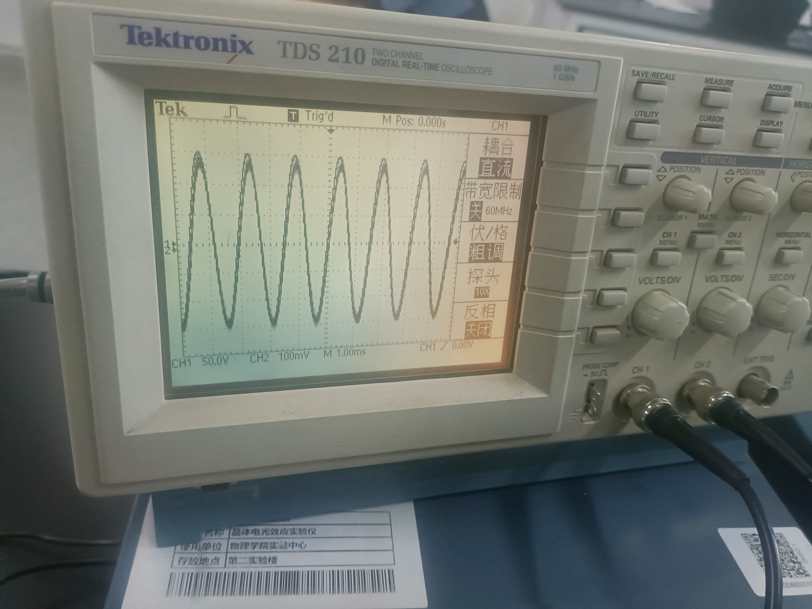

## 光学偏压

  
  

  
    
  
          
        
输出光强与光学偏压的关系
 
          
        
A,197度20分
 
    
  
    
  
          
        
B,169度20分

         
        
C,100度0分
 
    
  
    
  
        
        
D,70度0分

        
        
E,44度20分
 
    
  
    
  
        
        
F,18度12分

        
        
G,355度20分

    
  

