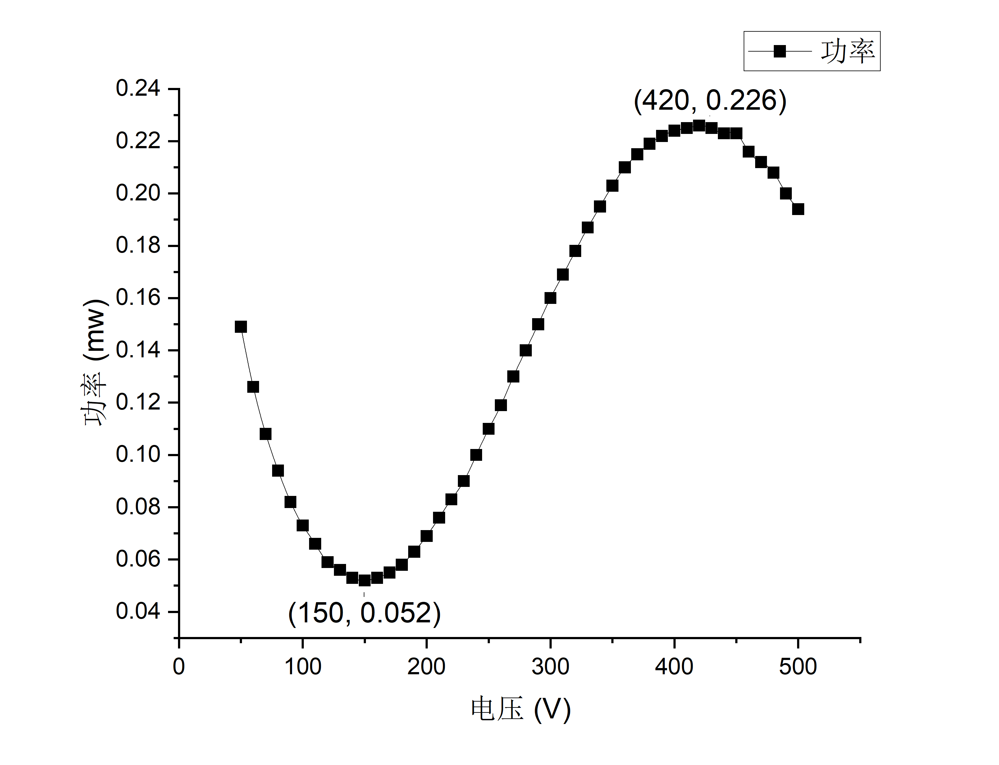
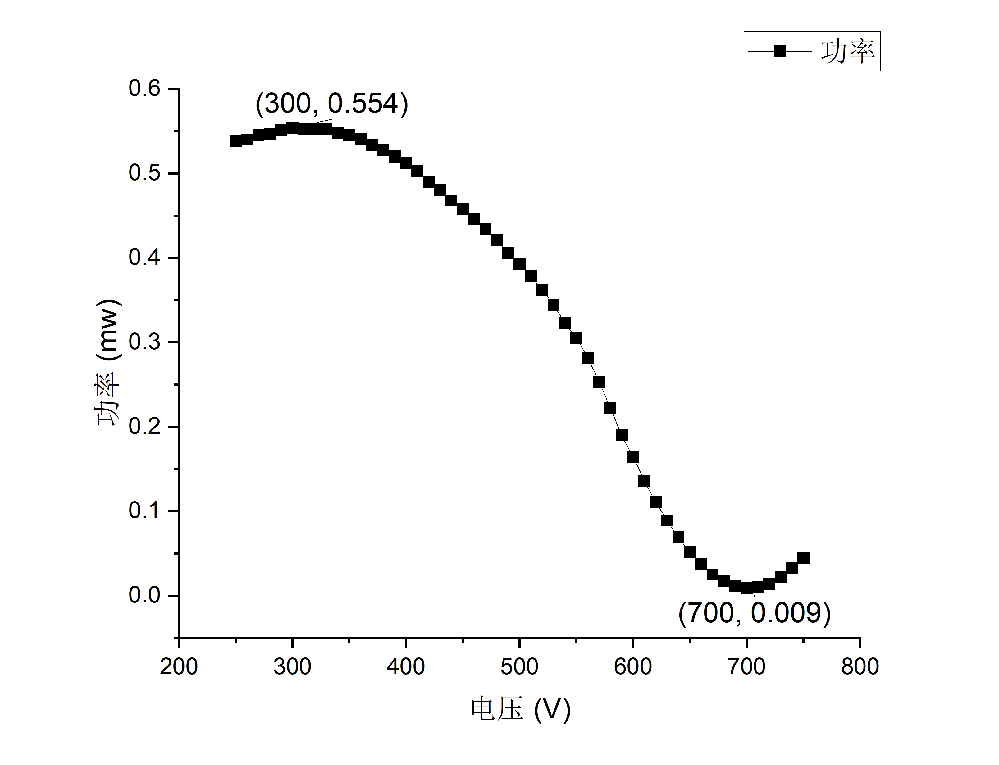

## 直流偏压

  
      
      

从左边图1可得：

半波电压：$V_{\pi1}=(420-150)~\mathrm{V}=270~\mathrm{V} $

消光比：$M_{1} = 0.226/0.052=4.35 $

从右边图2可得：

半波电压：$V_{\pi2}=(700-300)~\mathrm{V}=400~\mathrm{V} $

消光比：$M_{2} = 0.554/0.009=61.6$

半波电压平均值：$\bar{V}_{\pi}=(V_{\pi1}+V_{\pi2})/2=335~\mathrm{V} $
