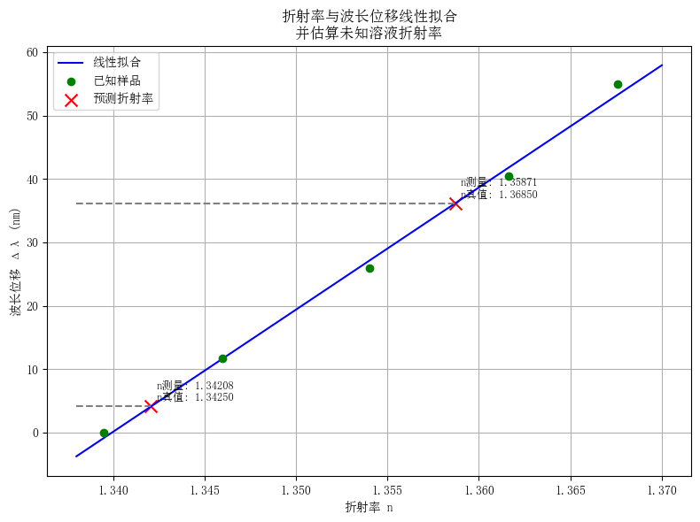

### 四、数据处理与误差分析

#### 光谱仪和阿贝折射仪测量数据

|甘油溶液浓度||三次测量波长（$\mathrm{nm} $）||三次波长测量平均值（$\mathrm{nm} $）|波长位移（$\mathrm{nm} $）|折射率|
|:---:|:---:|:---:|:---:|:---:|:---:|:---:|
|$5\% $|$632.72 $|$634.10 $|$634.10 $|$633.64 $|$0 $|$1.3395 $|
|$10\% $|$645.65 $|$645.65 $|$644.67 $|$645.32 $|$11.68 $|$1.3460 $|
|$15\% $|$661.22 $|$658.89 $|$658.50 $|$659.54 $|$25.90 $|$1.3540 $|
|$20\% $|$673.60 $|$673.99 $|$674.57 $|$674.05 $|$40.41 $|$1.3616 $|
|$25\% $|$688.79 $|$687.84 $|$689.18 $|$688.60 $|$54.96 $|$1.3676 $|
|未知1|$638.02 $|$638.02 $|$637.24 $|$637.76 $|$4.12 $|$1.3425 $|
|未知2|$670.13 $|$668.77 $|$670.51 $|$669.80 $|$36.16 $|$1.3685 $|

#### 线性拟合

  

拟合直线为

$$
\Delta \lambda(\mathrm{nm})
=1927.29 \times n - 2582.46~.
$$

根据拟合直线和未知溶液的波长位移，得到未知溶液折射率的测量值

$$
n^{(1)}_{\mathrm{measured}}
=1.3421,\quad
n^{(2)}_{\mathrm{measured}}
=1.3587,
$$

与真值（阿贝折射仪测量数据）

$$
n^{(1)}_{\mathrm{true}}
=1.3425,\quad
n^{(2)}_{\mathrm{true}}
=1.3685,
$$

的相对误差为：

$$
\mathrm{Error}^{(1)}
=\left|n^{(1)}_{\mathrm{measured}}-n^{(1)}_{\mathrm{true}} \right| \bigg/ n^{(1)}_{\mathrm{true}}
=0.03\%,
$$

$$
\mathrm{Error}^{(2)}
=\left|n^{(2)}_{\mathrm{measured}}-n^{(2)}_{\mathrm{true}} \right| \bigg/ n^{(2)}_{\mathrm{true}}
=0.72\%.
$$

#### 实验误差

- 共振波长通过手动标定，实验者对极小值点的判断会引入较大误差。可通过计算机识别吸收峰来减小误差；

- 测量不同浓度甘油溶液光谱数据时前后溶液混合，导致波长位移不稳定。每次更换溶液时，通过扇风等方式使前溶液完全挥发后再进行下一浓度溶液的测量；

- 甘油水溶液折射率对温度极为敏感。应当在恒温室中进行实验。

### 五、思考题

#### 阿贝折射仪检测溶液折射率的原理

当光从高折射率介质（棱镜）射向低折射率液体时，若入射角大于某一临界角，将发生全反射。临界角 $i_c $ 满足

$$
N
=n \sin i_c,
$$

其中 $n $ 为棱镜折射率；$N $ 为待测液体折射率。

阿贝折射仪通过观察视场中明暗交界线的位置，来确定临界角 $i_c $，而棱镜折射率 $n $ 已知，则可求得待测液体折射率 $N .$

#### 光纤SPR传感器的传感原理

入射光在光纤纤芯中传输并以一定角度入射至纤芯与金属层界面时，光在此界面发生全反射，其中一部分能量以倏逝波的形式进入金属层。当倏逝波与金属表面等离子体波满足相位匹配条件时，二者发生共振。入射光波中满足共振条件的那部分光能量转化为等离子体波共振能量，使反射光减少，出现共振吸收峰。

#### 光纤SPR传感器吸收峰值随折射率变化情况

折射率越大，波长吸收峰值越大。