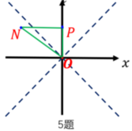

# 第1次作业

## 1-1

> 谈谈你对 SR 中两个基本原理的理解；

光速不变原理：在任意惯性参考系中，真空中的光速具有相同的大小。

这一原理与经典力学中的速度叠加原理相矛盾，是狭义相对论的核心。由此导出的洛伦兹变换取代了经典力学中的伽利略变换。彻底改变了人们对时间、空间和运动的理解，为现代物理学奠定了基础。

相对性原理：惯性观者和非惯性观者有绝对区别；在任意惯性参考系中，物理定律具有相同的形式。

相对性原理指出，没有任何惯性参考系是特殊的，物理规律不依赖于参考系的选择。这一原理否定了绝对空间和绝对时间的概念，强调了物理规律的普适性。

## 1-2

> 详细推导洛伦兹变换；

假设有两个惯性参考系 $S $ 和 $S' $，其中 $ S' $ 以速度 $ v $ 沿 $ x $ 轴相对于 $ S $ 运动。两个参考系的坐标轴平行，且在 $ t = t' = 0 $ 时原点重合。

设同一事件在 $ S $ 系的坐标为 $ (t, x, y, z) $；在 $ S' $ 系的坐标为 $ (t', x', y', z') $；

由于时空是均匀的，假设坐标变换是线性的，从 $S$ 系到 $S'$ 系的坐标变换形式上可写为：

$$
\begin{cases}
t' = A t + B x \\
x' = C t + D x \\
y' = y \\
z' = z
\end{cases}
$$

其中 $ A, B, C, D $ 是待定系数。

写成矩阵形式为：

$$
\begin{bmatrix}
t' \\
x'
\end{bmatrix}
=\begin{bmatrix}
A &B \\
C &D
\end{bmatrix}
\begin{bmatrix}
t \\
x
\end{bmatrix}
$$

考虑 $S' $ 的运动方程。在 $S $ 系中 $x=vt $，在 $S' $ 系中 $x'=0 $，于是：

$$
\begin{bmatrix}
t' \\
0
\end{bmatrix}
=\begin{bmatrix}
A &B \\
C &D
\end{bmatrix}
\begin{bmatrix}
t \\
vt
\end{bmatrix}
$$

由此可得：

$$
\boxed{C+Dv=0}
$$

考虑 $S $ 的运动方程。在 $S $ 系中 $x=0 $，在 $S' $ 系中 $x'=-vt' $，于是：

$$
\begin{bmatrix}
t' \\
-vt'
\end{bmatrix}
=\begin{bmatrix}
A &B \\
C &D
\end{bmatrix}
\begin{bmatrix}
t \\
0
\end{bmatrix}
$$

由此可得：

$$
\boxed{C+Av=0}
$$

因此 $A=D $，引入 $\gamma $ 使得 $A=D=\gamma $，则 $C=-\gamma v $

洛伦兹变换矩阵目前可写为：

$$
\begin{bmatrix}
A &B \\
C &D
\end{bmatrix}
=\begin{bmatrix}
\gamma &B \\
-\gamma v &\gamma 
\end{bmatrix}
$$

假设在 $ t = t' = 0 $ 时，从原点发出一束沿 $x $ 轴正向传播的光。根据光速不变原理，光在 $ S $ 和 $ S' $ 中的传播速度均为 $ c $。

在 $ S $ 系中，光子的运动方程为：

$$
x = c t
$$

在 $ S' $ 系中，光子的运动方程为：

$$
x' = c t'
$$

代入洛伦兹变换：

$$
\begin{bmatrix}
t' \\
ct'
\end{bmatrix}
=\begin{bmatrix}
\gamma  &B \\
-\gamma v &\gamma 
\end{bmatrix}
\begin{bmatrix}
t \\
ct
\end{bmatrix}
$$

由此可得：

$$
B = -\frac{\gamma v}{c^2}
$$

至此，洛伦兹变换矩阵为：

$$
\begin{bmatrix}
\gamma  &-\frac{\gamma v }{c^2 }  \\
-\gamma v &\gamma 
\end{bmatrix}
=\gamma(v)\begin{bmatrix}
1 &\frac{-v }{c^2 } \\
-v &1
\end{bmatrix}
$$

$S' $ 相对 $S $ 沿 $x $ 轴正方向以速度 $v $ 匀速运动。相对的，$S $ 相对 $S' $ 沿 $x' $ 正方向以速度 $-v $ 运动，因此有：

$$
\begin{bmatrix}
t \\
x
\end{bmatrix}
=\gamma(-v)\begin{bmatrix}
1 &\frac{v }{c^2 } \\
v &1
\end{bmatrix}
\begin{bmatrix}
t' \\
x'
\end{bmatrix}
=\gamma(-v)\gamma(v)
\begin{bmatrix}
1-v^2/c^2 &0 \\
0 &1-v^2/c^2
\end{bmatrix}
\begin{bmatrix}
t \\
x
\end{bmatrix}
$$

前后对比可得：

$$
\gamma(-v)\gamma(v)
\begin{bmatrix}
1-v^2/c^2 &0 \\
0 &1-v^2/c^2
\end{bmatrix}
=I
$$

由时空的均匀性，$\gamma(-v)=\gamma(v) $，因此：

$$
\gamma^2\begin{bmatrix}
1-v^2/c^2 &0 \\
0 &1-v^2/c^2
\end{bmatrix}
=I
$$

从中解得：

$$
\gamma
=\frac{1 }{\sqrt{1-v^2/c^2} } 
$$

综上，洛伦兹变换矩阵为：

$$
\begin{bmatrix}
\gamma  &-\frac{\gamma v }{c^2 }  \\
-\gamma v &\gamma 
\end{bmatrix}
=\gamma\begin{bmatrix}
1 &-v/c^2 \\
-v &1
\end{bmatrix}
$$

从 $S$ 系到 $S'$ 系的洛伦兹变换为：

$$
\left\{
\begin{aligned}
&t' = \gamma \left( t - \frac{v x}{c^2} \right) \\
&x' = \gamma (x - v t) \\
&y' = y \\
&z' = z
\end{aligned}
\right.
$$

## 1-3

> 列出尽可能多的洛伦兹标量；

光速 $c $；

时空间隔 $\mathrm{d}s^2=c^2\mathrm{d}t^2-\mathrm{d}x^2-\mathrm{d}y^2-\mathrm{d}z^2$；

固有时 $\mathrm{d}\tau=\mathrm{d}s/c$；

静止质量 $m_0$；

电荷 $Q$；

电磁场的两个洛伦兹不变量：

$$
F^{\mu\nu}F_{\mu\nu}
=2\left(\vec{B}^2-\frac{\vec{E}^2 }{c^2 }  \right)
$$

$$
\frac{1 }{2 } \varepsilon_{\mu\nu\rho\sigma}F^{\mu\nu}F^{\rho\sigma}
=\frac{\vec{E}\cdot\vec{B} }{c } 
$$

作用量 $\displaystyle{S=\int \mathcal{L}\mathrm{d}^4 x }$；

四维动量模方：

$$
P^\mu P_\mu
=\frac{E^2 }{c^2 } -\vec{p}^2
=m_0^2 c^2
$$

四维电流密度模方：

$$
J^\mu J_\mu
=c^2\rho^2-\vec{J}^2
$$

四维电磁势模方：

$$
A^\mu A_\mu
=\frac{\phi^2 }{c^2 } - \vec{A}^2
$$

能-动张量的迹 $T^\mu_\mu$；

## 1-4

> 推导速度的变换公式；

洛伦兹变换：

$$
\left\{
\begin{aligned}
&t' = \gamma \left( t - \frac{v x}{c^2} \right) \\
&x' = \gamma (x - v t) \\
&y' = y \\
&z' = z
\end{aligned}
\right.
$$

其中，$\gamma=1/\sqrt{1-v^2/c^2} $

取微分得：

$$
\left\{
\begin{aligned}
&\mathrm{d} t' = \gamma \left( \mathrm{d} t - \frac{v \mathrm{d} x}{c^2} \right) \\
&\mathrm{d} x' = \gamma (\mathrm{d} x - v \mathrm{d} t) \\
&\mathrm{d} y' = \mathrm{d} y \\
&\mathrm{d} z' = \mathrm{d} z
\end{aligned}
\right.
$$

速度：

$$
\begin{aligned}
u_x'
&=\frac{\mathrm{d}x' }{\mathrm{d}t' } 
=\frac{\gamma (\mathrm{d} x - v \mathrm{d} t)}{\gamma \left( \mathrm{d} t - \frac{v \mathrm{d} x}{c^2} \right) }  
=\frac{\mathrm{d} x - v \mathrm{d} t}{  \mathrm{d} t - \frac{v \mathrm{d} x}{c^2} }  
=\frac{\mathrm{d}x/\mathrm{d}t - v }{1-\frac{v }{c^2 } \mathrm{d}x/\mathrm{d}t } \\
&=\frac{u_x-v }{1-vu_x/c^2 } 
\end{aligned}
$$

$$
\begin{aligned}
u_y'
&=\frac{\mathrm{d}y' }{\mathrm{d}t' } 
=\frac{\mathrm{d}y }{\gamma \left( \mathrm{d} t - \frac{v \mathrm{d} x}{c^2} \right) } 
=\frac{\mathrm{d}y/\mathrm{d}t }{\gamma\left(1-\frac{v\mathrm{d}x/\mathrm{d}t }{c^2 }  \right) } \\
&=\frac{u_y }{\gamma\left(1-v u_x/c^2 \right) } 
\end{aligned}
$$

同理有：

$$
u_z'
=\frac{u_z }{\gamma\left(1-v u_x/c^2 \right) }
$$

## 1-5

> 谈谈你对参考系和坐标系的理解；

参考系：参考系是描述物体运动时所选择的观察视角或背景框架。参考系是物理实体，通常与某个物体或系统相关联。参考系的选择是相对的，不同参考系中观察到的运动可能不同。

坐标系：坐标系是用于量化物体位置的数学工具。它通过一组坐标，比如 $(x,y,z) $，来描述物体在空间中的位置。

参考系需要通过坐标系来量化物体的位置和运动；坐标系是参考系的数学工具，用于将参考系中的物理量（如位置、速度）转化为可计算的数值。

## 1-6

> 谈谈坐标时和固有时的区别和联系；

坐标时：在某个特定的参考系中，由该参考系的坐标系定义的时间。

固有时：是指在一个物体自身的参考系中，由该物体携带的时钟所测量的时间。

固有时和坐标时之间的关系为：

$$
\mathrm{d}\tau
=\frac{\mathrm{d}t }{c } 
$$

坐标时是相对的，依赖于所选取的参考系。它不能直接被测量，仅在计算中具有意义。

固有时是绝对的，与参考系的选择无关。它反映了事件之间最本质的时间间隔，是可以被实际测量的。

## 1-7

> 详细谈谈对尺缩和钟慢这两个典型效应的理解；

### 尺缩效应

尺缩效应指的是，当一个物体以接近光速的速度运动时，在运动方向上，其长度会缩短。这种缩短只在运动方向上发生，垂直于运动方向的长度不受影响。

$$
L = L_0\sqrt{1-v^2/c^2}
$$

其中，$L $ 是观察者测量到的运动物体的长度；$L_0 $ 是运动物体的固有长度；$v $ 是运动物体相对观察者的速度。

尺缩效应强调了空间测量的相对性，不同参考系中的观察者对同一物体的长度测量结果不同。

### 钟慢效应

钟慢效应指的是，当一个时钟以接近光速的速度运动时，观察者会看到这个时钟的时间流逝变慢。

钟慢效应的公式为：

$$
\Delta t = \frac{\Delta t_0}{\sqrt{1-v^2/c^2} } 
$$

其中，$\Delta t $ 是观察者测量到的运动时钟的时间间隔；$\Delta t_0 $ 是时钟在静止参考系中的固有时间间隔（即静止时间）；$v $ 是运动时钟相对于观察者的速度。

钟慢效应强调了时间测量的相对性，不同参考系中的观察者对同一事件的时间间隔测量结果不同。

## 1-8

> 解释双生子效应（佯谬）；

假设有一对双胞胎，$A $ 留在地球，$B $ 乘坐高速飞船进行太空旅行后返回。

为了比较 $A$ 的固有时 $\tau_1$ 和 $B$ 的固有时 $\tau_2 $，不妨比较微元 $\mathrm{d}\tau_1 $ 和 $\mathrm{d}\tau_2$，由于地球视为惯性参考系，于是 

$$
\mathrm{d}\tau
=\sqrt{-\mathrm{d}s^2}
=\sqrt{\mathrm{d}t^2-\mathrm{d}x^2}
$$

而对 $A$ 来说，$\mathrm{d}x=0$，因此相同的 $\mathrm{d}t$ 下 $\mathrm{d}\tau_1>\mathrm{d}\tau_2$，因此 $\tau_1>\tau_2$，即 $A$ 比 $B$ 更老。

但 $B$ 运动过程还包含了加速和减速过程，其不是惯性参考系，因此上述分析不能反着来得到 $B$ 比 $A$ 老的结论。

## 1-9

> 列举尽可能多的例子来理解 SR 中的“相对的”和“绝对的”。

### 相对的

时间间隔：不同参考系中的观察者会测量到不同的时间间隔。

长度：物体在运动方向上的长度会因参考系不同而发生变化（尺缩效应）。

同时性：两个事件是否同时发生取决于观察者的参考系。

速度：物体的速度在不同参考系中测量结果不同。

动能：物体的动能依赖于观察者的参考系。

动量：动量的大小和方向因参考系不同而变化。

电磁场：电场和磁场的测量结果取决于观察者的参考系。

多普勒效应：光的频率和波长在不同参考系中测量结果不同。

角动量：角动量的测量结果依赖于观察者的参考系。

### 绝对的

光速：真空中的光速在所有惯性参考系中保持不变。

时空间隔：两个事件之间的时空间隔在所有惯性参考系中相同。

因果关系：如果两个事件有因果关系，它们的顺序在所有参考系中一致。

物理定律：所有惯性参考系中的物理定律形式相同。

能量-动量关系：能量和动量的关系在所有参考系中一致。

电荷：物体的电荷量在所有参考系中相同。

静质量：物体的静质量在所有参考系中不变。

熵：系统的熵在所有参考系中相同。

# 第1节作业

## 1-1

> 写出三维欧氏空间的线元（直角、球坐标系）。

直角坐标系：

$$
\mathrm{d}s^2 = \mathrm{d}x^2+\mathrm{d}y^2+\mathrm{d}z^2
$$

$$
\eta_{ij}
=\mathrm{diag}\left(1,1,1 \right)
$$

球坐标系：

$$
\mathrm{d}s^2 = \mathrm{d}r^2+r^2\mathrm{d}\theta^2 + r^2\sin^2\theta\mathrm{d}\phi^2
$$

$$
\eta_{ij}
=\mathrm{diag}\left(1,r^2,r^2\sin^2\theta \right)
$$

## 1-2

> 写出二维球面的线元；写出二维环面的线元。

设球面半径为常数 $R $，二维球面线元：

$$
\mathrm{d}s^2 = R^2\mathrm{d}\theta^2 + R^2\sin^2\theta\mathrm{d}\phi^2
$$

设环心到管中心的距离为常数 $R $，环面的管半径为常数 $r $，环面管的极角为 $\phi $，环面的方位角为 $\theta $，则二维环面上一点有两个自由度，其直角坐标 $(x,y,z) $ 与 $(\phi,\theta) $ 坐标的关系为：

$$
\left\{
\begin{aligned}
&x=\left(R+r\cos\theta \right)\cos\phi \\
&y=\left(R+r\cos\theta \right)\sin\phi \\
&z=r\sin\theta
\end{aligned}
\right.
$$

微分：

$$
\left\{
\begin{aligned}
&\mathrm{d}x = -\left(R+r\cos\theta \right)\sin\phi\mathrm{d}\phi -r\sin\theta\cos\phi\mathrm{d}\theta \\
&\mathrm{d}y = \left(R+r\cos\theta \right)\cos\theta\mathrm{d}\phi - r\sin\theta\sin\phi\mathrm{d}\theta \\
&\mathrm{d}z = r\cos\theta\mathrm{d}\theta
\end{aligned}
\right.
$$

二维环面线元：

$$
\begin{aligned}
\mathrm{d}s^2
&=\mathrm{d}x^2+\mathrm{d}y^2+\mathrm{d}z^2 \\
&=\left[-\left(R+r\cos\theta \right)\sin\phi\mathrm{d}\phi -r\sin\theta\cos\phi\mathrm{d}\theta \right]^2 \\
&+\left[\left(R+r\cos\theta \right)\cos\theta\mathrm{d}\phi - r\sin\theta\sin\phi\mathrm{d}\theta \right]^2 \\
&+\left(r\cos\theta\mathrm{d}\theta \right)^2 \\
&=\left(R+r\cos\theta \right)^2\mathrm{d}\phi^2 + r^2\mathrm{d}\theta^2
\end{aligned}
$$

## 1-3

> 推导一般洛伦兹变换。

设有两个惯性系 $S,S' $，同一事件 $P $ 在其中的坐标分别用 $(x_0,x_1,x_2,x_3),(x_0',x_1',x_2',x_3') $ 表示，其中 $x_0=ct,x_0'=ct' $。

约定希腊字母代表 $0,1,2,3 $，英文字母代表 $1,2,3 $。

考虑在 $S $ 中以速度 $u_i $ 做匀速直线运动的**光子**，由于一切惯性系都平权，因此在 $S' $ 系中观测，此粒子仍做匀速直线运动，速度记为 $u_i' $，因此有运动方程：

$$
\left\{
\begin{aligned}
&x_i = x_{i0} + u_i(t-t_0) \\
&x_i' = x_{i0}' + u_i'(t'-t_0')
\end{aligned}
\right.
$$

其中，$x_{i0},x_{i0}',t_0,t_0' $ 均为常数。

又光子以光速运动，而真空中光速在不同惯性系中恒为 $c $，因此有：

$$
\left\{
\begin{aligned}
u_i u_i = c^2 \\
u_i' u_i' = c^2
\end{aligned}
\right.
$$

引入中间变量

$$
\left\{
\begin{aligned}
&\beta_\mu = \beta_0 \frac{u_\mu }{c } ,\quad(u_0\equiv c) \\
&S = \frac{c }{\beta_0 } (t-t_0) \\
&\xi_\mu = (ct_0,x_{i0}),\quad \xi'_{\mu} = (ct_0',x_{i0}')
\end{aligned}
\right.
$$

光子运动方程可写为：

$$
\left\{
\begin{aligned}
&x_\mu = \xi_\mu + \beta_\mu S \\
&x_\mu' = \xi_\mu' + \beta_\mu'S'
\end{aligned}
\right.
$$

光速不变原理可写为：

$$
\left\{
\begin{aligned}
&\eta_{\mu\nu} \beta_\mu \beta_\nu = 0 \\
&\eta_{\mu\nu}' \beta_\mu' \beta_\nu' = 0
\end{aligned}
\right.
$$

设所求时空坐标变换为：

$$
x_\mu' = f_\mu(x_0,x_1,x_2,x_3)
$$

下面分四步求解。

（1）考虑惯性系条件对变换的限制

由各惯性系的等价性知，洛伦兹变换的逆变换是唯一确定的，其充要条件是变换的雅可比行列式非零：

$$
\mathrm{det}\left(\frac{\partial f_\nu }{\partial x_\mu }  \right) \ne 0
$$

于是：

$$
\frac{\mathrm{d}f_\mu }{\mathrm{d}S } 
=\frac{\mathrm{d}x_\nu }{\mathrm{d}S } \frac{\partial f_\mu }{\partial x_\nu } 
=\beta_\nu \frac{\partial f_\mu }{\partial x_\nu } 
$$

$$
\mathrm{d}f_\mu
=\mathrm{d}x_\mu'
=\beta_\mu'\mathrm{d}S'
=\frac{\beta_\mu' }{\beta_0' } \mathrm{d}f_0
$$

$$
\frac{\mathrm{d}f_\mu }{\mathrm{d}f_0 } 
=\frac{\beta_\mu' }{\beta_0' } 
=\frac{u_\mu' }{c } 
=\mathrm{const}
$$

$$
\frac{\beta_\mu' }{\beta_0' } 
=\frac{\mathrm{d}f_\mu }{\mathrm{d}f_0 } 
=\frac{\mathrm{d}f_\mu/\mathrm{d}S }{\mathrm{d}f_0/\mathrm{d}S } 
=\frac{\beta_\nu \partial f_\mu/\partial x_\nu }{\beta_\sigma \partial f_0/\partial x_\sigma } 
=\mathrm{const}
$$

上式取对数后对 $S $ 求导：

$$
\frac{\mathrm{d} }{\mathrm{d}S }\left[\ln\left(\beta_\nu\frac{\partial f_\mu }{\partial x_\nu } \right) - \ln\left(\beta_\sigma\frac{\partial f_0 }{\partial x_\sigma }  \right) \right] 
=0
$$

即：

$$
\dfrac{\beta_\nu\beta_\sigma \dfrac{\partial^2 f_\mu }{\partial x_\nu \partial x_\sigma}  }{\beta_\nu \dfrac{\partial f_\mu }{\partial x_\nu }  } 
=\dfrac{\beta_\nu\beta_\sigma \dfrac{\partial^2 f_0 }{\partial x_\nu \partial x_\sigma}  }{\beta_\nu \dfrac{\partial f_0 }{\partial x_\nu }  } 
$$

令上式左右恒等于 $2\beta_\sigma\psi_\sigma,\psi_\sigma=\psi_\sigma(x_0,x_1,x_2,x_3) $，则：

$$
\beta_\nu\beta_\sigma\frac{\partial^2 f_\mu }{\partial x_\nu\partial x_\sigma }
=2\beta_\nu\frac{\partial f_\mu }{\partial x_\nu } \beta_\sigma\psi_\sigma
$$

注意到：

$$
\begin{aligned}
2\beta_\nu\frac{\partial f_\mu }{\partial x_\nu } \beta_\sigma\psi_\sigma
&=\beta_\nu\frac{\partial f_\mu }{\partial x_\nu } \beta_\sigma\psi_\sigma + \beta_\nu\frac{\partial f_\mu }{\partial x_\nu } \beta_\sigma\psi_\sigma \\
&=\beta_\nu\frac{\partial f_\mu }{\partial x_\nu } \beta_\sigma\psi_\sigma + \beta_\sigma\frac{\partial f_\mu }{\partial x_\sigma } \beta_\nu\psi_\nu \\
&=\beta_\nu\beta_\sigma\left(\frac{\partial f_\mu }{\partial x_\nu } \psi_\sigma + \frac{\partial f_\mu }{\partial x_\sigma } \psi_\nu \right)
\end{aligned}
$$

因此：

$$
\beta_\nu\beta_\sigma\frac{\partial^2 f_\mu }{\partial x_\nu\partial x_\sigma }
=2\beta_\nu\frac{\partial f_\mu }{\partial x_\nu } \beta_\sigma\psi_\sigma
=\beta_\nu\beta_\sigma\left(\frac{\partial f_\mu }{\partial x_\nu } \psi_\sigma + \frac{\partial f_\mu }{\partial x_\sigma } \psi_\nu \right)
$$

对某一对 $(\nu,\sigma) $ 有：

$$
\frac{\partial^2 f_\mu }{\partial x_\nu \partial x_\sigma} 
=\frac{\partial f_\mu }{\partial x_\nu } \psi_\sigma + \frac{\partial f_\mu }{\partial x_\sigma } \psi_\nu
$$

（2）考虑光速不变原理对变换的限制
_
$$
\eta_{\mu\nu}\beta_\mu'\beta_\nu'
=\eta_{\mu\nu}\beta_\sigma
\beta_\lambda\frac{\partial f_\mu }{\partial x_\sigma } \frac{\partial f_\nu }{\partial x_\lambda } 
=0
$$

$$
\eta_{\sigma\lambda}\beta_\sigma\beta_\lambda = 0
$$

对比知，两式中 $\beta_\sigma \beta_\lambda $ 的二次式系数成正比，比例系数令为 $\lambda(x_0,x_1,x_2,x_3) $

$$
\eta_{\mu\nu}\frac{\partial f_\mu }{\partial x_\alpha } \frac{\partial f_\nu }{\partial x_\beta } 
=\lambda \eta_{\alpha\beta}
$$

上式对 $x_\rho $ 求导，并令 $\partial\lambda/\partial x_\rho=2\lambda \varphi_\rho $ 得：

$$
\eta_{\mu\nu}\left(\frac{\partial^2 f_\mu }{\partial x_\rho\partial x_\alpha } \frac{\partial f_\nu }{\partial x_\beta }  + \frac{\partial^2 f_\mu }{\partial x_\rho\partial x_\beta } \frac{\partial f_\nu }{\partial x_\alpha }  \right)
=2\lambda\eta_{\alpha\beta} \varphi_\rho
$$

即：

$$
2\eta_{\alpha\beta} \psi_\rho + \eta_{\rho\alpha}\psi_\beta + \eta_{\rho\beta}\psi_\alpha = 2\eta_{\alpha\beta} \varphi_\rho  
$$

令 $\rho\ne\alpha,\rho\ne\beta $，则 $\eta_{\rho\alpha}=\eta_{\rho\beta}=0 $，则：

$$
\psi_\rho=\varphi_\rho,\quad \rho=0,1,2,3
$$

令 $\rho=\alpha=\beta $，则：

$$
2\psi_\rho=\varphi_\rho,\quad \rho=0,1,2,3
$$

综合可得：

$$
\psi_\rho=\varphi_\rho=0,\quad \rho=0,1,2,3
$$

$$
\frac{\partial\lambda }{\partial x_\rho } = 2\lambda \varphi_\rho = 0,\quad \lambda=\mathrm{const}
$$

$$
\frac{\partial^2 f_\mu }{\partial x_\alpha \partial x_\beta } = 0
$$

这就是变换函数所要满足的线性条件。

（3）确定线性变换的形式

令线性变换为：

$$
x_\mu'=f_\mu=\sqrt{\lambda}\left(a_\mu+\eta_{\rho\rho}a_{\mu\nu}x_\nu \right)
$$

度规：

$$
\eta_{00}=1,\eta_{11}=\eta_{22}=\eta_{33}=-1
$$

$a_{\mu\nu} $ 满足正交条件：

$$
\left\{
\begin{aligned}
&\eta_{\mu\nu}a_{\mu\alpha}a_{\nu\beta} = \eta_{\alpha\beta} \\
&\eta_{\mu\nu}a_{\alpha\mu}a_{\beta\nu} = \eta_{\alpha\beta}
\end{aligned}
\right.
$$

可以解出：

$$
x_\mu = \eta_{\rho\rho}a_{\nu\mu}\left(\frac{x_\nu' }{\sqrt{\lambda} } - a_\nu \right)
$$

从 $S $ 系看 $S' $ 系固定点 $\mathrm{d}x_i' $ 以速度 $v_i $ 运动，则：

$$
\mathrm{d}x_i = \frac{1 }{\sqrt{\lambda} } a_{0i}\mathrm{d}x_0',\quad
\mathrm{d}x_0 = \frac{1 }{\sqrt{\lambda} } a_{00}\mathrm{d}x_0'
$$

$$
\frac{v_i }{c } = \frac{\mathrm{d}x_i }{\mathrm{d}x_0 } = \frac{a_{0i} }{a_{00} } 
$$

$$
\eta_{\mu\nu}\mathrm{d}x_\mu'\mathrm{d}x_\nu'
=\lambda\eta_{\alpha\beta}\mathrm{d}x_\alpha\mathrm{d}x_\beta
$$

令 $\mathrm{d}x_i'=0 $ 则有：

$$
\mathrm{d}x_0'^2
=\lambda\mathrm{d}x_0^2\left(1-v^2/c^2 \right)
$$

当 $v=0 $ 时有 $\mathrm{d}x_0'=\mathrm{d}x_0 $，因此 $\lambda=1 $，于是：

$$
\mathrm{d}s^2=\eta_{\mu\nu}\mathrm{d}x_\mu\mathrm{d}x_\nu
=-\eta_{\alpha\beta}\mathrm{d}x_\alpha'\mathrm{d}x_\beta'
$$

$$
x_\mu'=a_\mu+\eta_{\rho\rho} a_{\mu\nu}x_\nu
$$

（4）根据正交归一条件确定变换系数

为简便，取 $t=0 $ 时 $t'=0 $，且原点 $O,O' $ 重合。则 $a_\mu=0 $，洛伦兹变换简化为：

$$
x_\mu'=\eta_{\rho\rho} a_{\mu\nu}x_\nu
$$

设 $S' $ 系相对 $S $ 系以速度 $v_i $ 做匀速直线运动，则从 $S $ 系观测 $S' $ 系固定点 $\mathrm{d}x_i'=0 $ 的速度为 $v_i $；又在 $S' $ 系观察 $S $ 系固定的 $\mathrm{d}x_i=0 $ 以速度 $v_i' $ 运动，则：

$$
\left\{
\begin{aligned}
&a_{00} v_i=a_{0i} c \\
&a_{00} v_i'=a_{i0} c
\end{aligned}
\right.
$$

引入单向顺时性条件，即要求洛伦兹变换不改变时间进程的方向：

$$
a_{00}=\frac{\partial t' }{\partial t } > 0
$$

在正交条件中令 $\alpha=\beta=0 $ 有：

$$
\left\{
\begin{aligned}
a_{00}^2-\left(a_{10}^2+a_{20}^2+a_{30}^2 \right) = 1 \\
a_{00}^2-\left(a_{01}^2+a_{02}^2+a_{03}^2 \right) = 1 
\end{aligned}
\right.
$$

可以解出变换系数：

$$
\left\{
\begin{aligned}
&a_{00}=\frac{1 }{\sqrt{1-v^2/c^2} } \equiv \gamma \\
&a_{0i}=\gamma\frac{v_i }{c } \\
&a_{i0}=\gamma\frac{v_i' }{c } 
\end{aligned}
\right.
$$

正交条件中取 $\alpha,\beta $ 中一个为 $0 $ 有：

$$
\left\{
\begin{aligned}
&a_{00}v_i'=a_{ik}v_k \\
&a_{00}v_i=a_{ki}v_k'
\end{aligned}
\right.
$$

正交条件中取 $\alpha,\beta $ 均不为 $0 $ 有：

$$
a_{ki}a_{kj}
=-\eta_{ij}+a_{0i}a_{0j}
=\delta_{ij}+\gamma^2\frac{v_iv_j }{c^2 } 
$$

定义：

$$
d_{ik}
=-a_{ik}+\frac{a_{i0}a_{0k} }{a_{00}+1 } 
=-a_{ik}+(\gamma-1)\frac{v_i' v_k }{v^2 } 
$$

则一般固有洛伦兹变换系数为：

$$
\left\{
\begin{aligned}
&a_{00}=\gamma \\
&a_{0i}=\gamma \frac{v_i }{c } \\
&a_{i0}=-\gamma\frac{d_{ij} v_j }{c } \\
&a_{ik}=-d_{ik}-(\gamma-1)\frac{d_{ij}v_jv_k }{v^2 } 
\end{aligned}
\right.
$$

## 1-4

> 在 $v\ll c $ 的条件下验证伽利略变换。

$$
\left\{
\begin{aligned}
&x'=\gamma(x-vt) \\
&t'=\gamma\left(t-vx/c^2\right)
\end{aligned}
\right.
$$

其中，

$$
\gamma=\frac{1 }{\sqrt{1-v^2/c^2} } 
$$

当 $v\ll c $ 时，$\gamma\approx 1,vx/c^2\approx 0 $，洛伦兹变换退化为伽利略变换：

$$
\left\{
\begin{aligned}
&x'=x-vt \\
&t'=t
\end{aligned}
\right.
$$

## 1-5

> 证明在 Lorentz 坐标变换下线元不变。

取 $c=1 $，洛伦兹变换：

$$
\left\{
\begin{aligned}
&x'=\gamma(x-vt) \\
&y'=y \\
&z'=z \\
&t'=\gamma\left(t-vx\right)
\end{aligned}
\right.,\quad
\gamma = \frac{1 }{\sqrt{1-v^2} } 
$$

线元定义为：

$$
\mathrm{d}s^2
\equiv -\mathrm{d}t^2+\mathrm{d}x^2+\mathrm{d}y^2+\mathrm{d}z^2
$$

要证明在 Lorentz 坐标变换下线元不变，只需要证明：

$$
-\mathrm{d}t'^2+\mathrm{d}x'^2 = -\mathrm{d}t^2+\mathrm{d}x^2
$$

注意到：

$$
\mathrm{d}x'
=\gamma \left(\mathrm{d}x-v\mathrm{d}t \right)
$$

$$
\mathrm{d}t'
=\gamma\left(\mathrm{d}t-v\mathrm{d}x \right)
$$

于是：

$$
\begin{aligned}
-\mathrm{d}t'^2+\mathrm{d}x'^2
&=\gamma^2\left[-\left(\mathrm{d}t-v\mathrm{d}x \right)^2 + \left(\mathrm{d}x-v\mathrm{d}t \right)^2 \right] \\
&=\gamma^2\cdot \left[\left(v^2-1 \right)\mathrm{d}t^2+\left(1-v^2 \right)\mathrm{d}x^2 \right] \\
&=\frac{1 }{1-v^2 } \cdot \left(1-v^2 \right)\left(-\mathrm{d}t^2+\mathrm{d}x^2 \right) \\
&=-\mathrm{d}t^2+\mathrm{d}x^2
\end{aligned}
$$

因此在 Lorentz 坐标变换下线元不变。

## 1-6

> 在 $v\ll c $ 的条件下验证速度的伽利略变换。

$$
\left\{
\begin{aligned}
&u_x'=\frac{u_x-v }{1-vu_x/c^2 } \\
&u_y'=\frac{u_y }{\gamma\left(1-v u_x/c^2 \right) } \\
&u_z'=\frac{u_z }{\gamma\left(1-v u_x/c^2 \right) } \\
\end{aligned}
\right.
$$

当 $v\ll c $ 时，$v u_x/c^2\approx 0,\gamma\approx 1 $，于是速度的洛伦兹变换退化为速度的伽利略变换：

$$
\left\{
\begin{aligned}
&u_x'=u_x-v \\
&u_y'=u_y \\
&u_z'=u_z \\
\end{aligned}
\right.
$$

## 1-7

> 谈谈你对广义相对性原理的理解，给出广义相对论中的光速不变原理的表述。

广义相对性原理：物理定律在所有参考系（包括非惯性系）中形式相同。这意味着自然规律不依赖于观察者的运动状态，惯性力和引力效应在局部不可区分。引力被视为时空弯曲的表现，物质和能量决定时空几何，时空几何又影响物质运动。

广义相对论中的光速不变原理的表述：在局部惯性参考系中，光速在真空中恒为 $c $，且与光源和观察者的运动无关。

## 1-8

> 假设我们的宇宙是二维的，且物质分布是均匀各项同性的，写出我们宇宙的度规形式。

物质分布是均匀各项同性的，则度规与空间坐标无关。采用极坐标，线元为：

$$
\mathrm{d}s^2
=-\mathrm{d}t^2+a^2(t) \left(\mathrm{d}r^2+r^2\mathrm{d}\theta^2 \right)
$$

度规为：

$$
\eta_{\mu\nu}
=\mathrm{diag}\left(-1,a^2(t),a^2(t) r^2 \right)
$$

## 1-9

  

> 在惯性坐标系 $\Sigma' $ 系中画惯性系 $\Sigma $ 的坐标轴。

$$
\left\{
\begin{aligned}
&x=\gamma(x'+vt') \\
&t=\gamma\left(t'+vx'\right)
\end{aligned}
\right.
$$

$t $ 轴：令 $x=\gamma(x'+vt')=0 \Longrightarrow t'=-x'/v $

$x $ 轴：令 $t=\gamma\left(t'+vx'\right)=0 \Longrightarrow t'=-vx' $

  

## 1-10

  

> 在 $\Sigma $ 系中证明 $\Sigma' $ 系中的坐标轴正交。

$$
\left\{
\begin{aligned}
&x'=\gamma(x-vt) \\
&t'=\gamma\left(t-vx\right)
\end{aligned}
\right.
$$

$t' $ 轴：$x'=\gamma(x-vt)=0 \Longrightarrow t=x/v $

$x' $ 轴：$t'=\gamma\left(t-vx\right)=0 \Longrightarrow t=vx $

事件 $p=\left(t_p,v t_p \right) $，事件 $q=\left(t_q,t_q/v \right) $，内积：

$$
p\cdot q
=\eta_{\mu\nu} p^\mu q^\nu
=-p^0 q^0 + p^1 q^1
=-t_p t_q + \left(v t_p \right)\left(t_q/v \right)
=0
$$

因此 $\Sigma $ 系中证明 $\Sigma' $ 系中的坐标轴正交。

## 1-11

  

> $P,Q $ 两事件是否有因果关系？

$P $ 在 $Q $ 的光锥之外，两事件没有因果关系。

## 1-12

> 根据下面史瓦西时空的度规画出该时空中 $(t,r) $ 这两维时空的光锥结构，讨论该时空中的固有时和坐标时的关系，以及固有距离和坐标距离的关系。
>
>$$
\mathrm{d}s^2
=-f(r)\mathrm{d}t^2+\frac{\mathrm{d}r^2 }{f(r) } + r^2\left(\mathrm{d}\theta^2+\sin^2\theta\mathrm{d}\varphi^2 \right)
,\quad f(r)=1-\frac{r_h }{r } ,\quad r_h=2GM
>$$

### 光锥结构

只考虑径向，$\mathrm{d}\theta=\mathrm{d}\varphi=0 $，则线元为：

$$
\mathrm{d}s^2
=-f(r)\mathrm{d}t^2+\frac{\mathrm{d}r^2 }{f(r) } ,\quad f(r) = 1-\frac{r_h }{r },\quad r_h=2GM
$$

$$
\mathrm{d}s^2=0 \Longrightarrow \left(\frac{\mathrm{d}t }{\mathrm{d}r }  \right)^2   
=\frac{1 }{f^2(r) } 
\Longrightarrow 
\mathrm{d}t
=\pm \frac{1 }{f(r) } \mathrm{d}r
=\pm \frac{1 }{1-r_h/r } \mathrm{d}r
$$

积分：

$$
\begin{aligned}
t-t_0=\int \mathrm{d}t
&=\pm \int \frac{1 }{1-r_h/r } \mathrm{d}r \\
&=\pm\int \frac{1-r_h/r+r_h/r }{1-r_h/r } \mathrm{d}r \\
&=\pm\int\left(1+\frac{r_h }{r-r_h }  \right)\mathrm{d}r \\
&=\pm\left[r+r_h\int\frac{1 }{r-r_h } \mathrm{d}\left(r-r_h \right) \right] \\
&=\pm\left(r+r_h\ln\left|r-r_h \right| \right)
\end{aligned}
$$

即：

$$
t=t_0\pm \left(r+r_h\ln\left|r-r_h \right| \right)
$$

  

当 $r>r_h $ 时，光锥是正常的，光可以向外或向内传播。

当 $r=r_h $ 时，光锥坍缩为一条线，光无法逃逸。

当 $r<r_h $ 时，光锥反转，所有光都朝向奇点 $r=0 $ 传播。

### 固有时和坐标时的关系

对于静止观察者 $\mathrm{d}r^2=0 $，其固有时

$$
\mathrm{d}\tau^2
=-\mathrm{d}s^2
=f(r)\mathrm{d}t^2
=\left(1-\frac{r_h }{r }  \right)\mathrm{d}t^2
$$

当 $r\to \infty $ 时，$f(r)\to 1 $，固有时和坐标时一致；

当 $r\to r_h $ 时，$f(r)\to 0 $，固有时趋于无穷小。

### 固有距离和坐标距离的关系

对于径向距离 $\mathrm{d}t^2=0 $，固有距离为：

$$
\mathrm{d}l
=\frac{\mathrm{d}r }{\sqrt{f(r)} } 
=\frac{\mathrm{d}r }{\sqrt{1-r_h/r} } 
$$

当 $r\to \infty $ 时，$f(r)\to 1 $，固有距离与坐标距离一致；

当 $r\to r_h $ 时，$f(r)\to 0 $，固有距离趋于无穷大。

## 第一章 2,3 节练习题

### 1

> 为什么类时间隔小于零而不是大于零？

间隔定义为

$$
\mathrm{d}s^2
=-\mathrm{d}t^2+\mathrm{d}x^2+\mathrm{d}y^2+\mathrm{d}z^2
$$

由类时间隔描述的两事件存在因果关系，可以通过小于等于光速的信号联系。

因此有

$$
\mathrm{d}x^2+\mathrm{d}y^2+\mathrm{d}z^2
<\mathrm{d}t^2
$$

因此类时间隔

$$
\mathrm{d}s^2
=-\mathrm{d}t^2+\mathrm{d}x^2+\mathrm{d}y^2+\mathrm{d}z^2
<0
$$

### 2

> 两事件类光，则有因果关系，同时是绝对的，先后是绝对的；两事件类时，则有因果关系，无同时，先后是绝对的；两事件类空，则无因果关系，同时是相对的，先后是相对的，两事件绝对异地。用时空图说明上面的结论。

#### 两事件类光，则有因果关系，同时是绝对的，先后是绝对的

  

事件 $A $ 与事件 $O $ 类光。$A $ 在 $O $ 的光锥上，二者可通过光信号联系，因此有因果关系；

若两类光事件同时，即在 $x $ 系中有 $t_B=t_A $，则在 $x' $ 系中也有 $t_B'=t_A' $，因此同时是绝对的。

考虑位于 $O $ 光锥上不同的两点 $A,B $，二者类光。过 $A,B $ 点分别作 $x $ 轴平行线交 $t $ 轴于 $A_1,B_1 $ 点；过 $A,B $ 点分别作 $x' $ 轴平行线交 $t' $ 轴于 $A_2,B_2 $ 点。

由于 $\left|A_1 O \right|<\left|B_1 O \right| $，因此在 $x $ 系中有 $t_A<t_B $

由于 $\left|A_2 O \right|<\left|B_2 O \right| $，因此在 $x' $ 系中有 $t'_A<t'_B $

因此先后是绝对的。

#### 两事件类时，则有因果关系，无同时，先后是绝对的

  

事件 $A $ 与事件 $O $ 类时。二者可通过速度小于光速的信号联系，因此有因果关系。

在 $x,x',x'',x''' $ 系中，都有 $t_O=0,t_A>0=t_O $，因此无同时，先后是绝对的。

#### 两事件类空，则无因果关系，同时是相对的，先后是相对的，两事件绝对异地

  

事件 $A $ 与事件 $O $ 类空。二者无法通过传播速度小于等于光速的信号联系，因此无因果关系。

在 $x'' $ 系中二者同时，而在 $x $ 系中二者不同时，因此同时是相对的。

在 $x' $ 系中 $t'_A<0=t_O $，而在 $x $ 系中 $t_A>0=t_O $，因此先后是相对的。

在 $x,x',x''，x''' $ 系中二者都是异地事件，因此二者绝对异地。

### 3

> 由于间隔不变，导致两不同事件（类时、类空、类光）在不同惯性系中的空间距离不同，时间间隔也不同。画图说明上述结论。

#### 类时事件

  

如图，事件 $P $ 与事件 $O $ 类时。过 $P $ 作 $x $ 轴的平行线交 $t $ 轴于 $A $，过 $P $ 作 $x' $ 轴的平行线交 $t' $ 轴于 $B $，过 $P $ 作 $t $ 轴的平行线交 $x $ 轴于 $C $，过 $P $ 作 $t' $ 轴的平行线交 $x' $ 轴于 $D $；过 $A $ 作校准曲线交 $t' $ 轴于 $E $，过 $C $ 作校准曲线交 $x' $ 轴于 $F .$

$OP $ 在 $x $ 系的时间间隔取决于 $\left|OA \right| $，在 $x' $ 系的时间间隔取决于 $\left|OB \right| $，而由校准曲线，有

$$
\left|OA \right| = \left|OE \right| > \left|OB \right|
$$

同理，$OP $ 在 $x $ 系的空间距离取决于 $\left|OC \right| $，在 $x' $ 系的空间距离取决于 $\left|OD \right| $，而由校准曲线，有

$$
\left|OC \right| = \left|OF \right| > \left|OD \right|
$$

综上，两类时事件在不同惯性系中的空间距离不同，时间间隔也不同。

#### 类空事件

  

如图，事件 $P $ 与事件 $O $ 类空。

$OP $ 在 $x $ 系的时间间隔取决于 $\left|OA \right| $，在 $x' $ 系的时间间隔取决于 $\left|OB \right| $，而由校准曲线，有

$$
\left|OA \right| = \left|OE \right| > \left|OB \right|
$$

同理，$OP $ 在 $x $ 系的空间距离取决于 $\left|OC \right| $，在 $x' $ 系的空间距离取决于 $\left|OD \right| $，而由校准曲线，有

$$
\left|OC \right| = \left|OF \right| > \left|OD \right|
$$

综上，两类空事件在不同惯性系中的空间距离不同，时间间隔也不同。

#### 类光事件

  

如图，事件 $P $ 与事件 $O $ 类光。

$OP $ 在 $x $ 系的时间间隔取决于 $\left|OA \right| $，在 $x' $ 系的时间间隔取决于 $\left|OB \right| $，而由校准曲线，有

$$
\left|OA \right| = \left|OE \right| > \left|OB \right|
$$

同理，$OP $ 在 $x $ 系的空间距离取决于 $\left|OC \right| $，在 $x' $ 系的空间距离取决于 $\left|OD \right| $，而由校准曲线，有

$$
\left|OC \right| = \left|OF \right| > \left|OD \right|
$$

综上，两类光事件在不同惯性系中的空间距离不同，时间间隔也不同。

### 4

> 是否存在这样的两个参考系（其中一个为尺子的静系），通过调整这两个参考系的坐标轴，使得在两系中尺子“看起来一样长”？

  

如图，对尺子测长度要在同一时刻进行测量。因此，$x' $ 系中尺子长度取决于 $\left|OA \right| $，$x'' $ 系中尺子长度取决于 $\left|OB \right| $，二者“看起来一样长”（在同一个圆上，欧氏长度相等）。

### 5

> 如图，$NP $ 平行于 $x $ 轴，$N $ 在光锥之外，求 $\left|ON \right|,\left|OP \right|,\left|NP \right| $ 的线长关系。

  

设 $N $ 的坐标为 $(t,x),\left|t \right|<\left|x \right| $，$P $ 的坐标为 $(t,0) $

$$
\left|ON \right|
=\sqrt{\left|-t^2+x^2 \right|}
=\sqrt{-\left|t \right|^2 + \left|x \right|^2 }
$$

$$
\left|OP \right|
=\sqrt{\left|-t^2+0^2 \right|}
=\sqrt{\left|t \right|^2}
$$

$$
\left|NP \right|
=\sqrt{\left|-0^2 + \left|x \right|^2 \right|}
=\sqrt{\left|x \right|^2}
$$

因此：

$$
\left|NP \right|>\left|OP \right|>\left|ON \right|
$$

## 作业

### 1

用时空图在动系和静系中分析尺缩效应。（分别在动系和静系中画校准曲线来分析）

#### 静系中画校准曲线

  

如图，静系中尺子的长度

$$
l_0
=\left|OA \right|
$$

动系中尺子长度

$$
l
=\left|OB \right|
$$

而由校准曲线知

$$
\left|OA \right| = \left|OC \right| > \left|OB \right|
$$

因此有

$$
l_0 > l
$$

#### 动系中画校准曲线

  

首先证明示意图是合适的，即 $B $ 点在 $C $ 点左侧。

设 $t' $ 轴方程为

$$
t':t = -\frac{1 }{v } x
$$

设 $A $ 点图中坐标为

$$
A(l,0)
$$

则尺子右端世界线方程为：

$$
t = -\frac{1 }{v } \left(x-l \right)
$$

$x' $ 轴方程为：

$$
x':t = - v x
$$

校准曲线方程为：

$$
\frac{x^2 }{l^2 } - \frac{t^2 }{l^2 } = 1
$$

联立

$$
\left\{
\begin{aligned}
&t = -\frac{1 }{v } \left(x-l \right) \\
&t = - v x
\end{aligned}
\right.
$$

解得：

$$
x_C
=\frac{l }{1-v^2 } 
$$

联立

$$
\left\{
\begin{aligned}
&t = - v x \\
&\frac{x^2 }{l^2 } - \frac{t^2 }{l^2 } = 1
\end{aligned}
\right.
$$

解得：

$$
x_B
=\frac{l }{\sqrt{1-v^2} } 
$$

因此

$$
x_B = \frac{l }{\sqrt{1-v^2} } < x_C = \frac{l }{1-v^2 } 
$$

即 $B $ 在 $C $ 左侧。

尺子在动系长度

$$
l = \left|OA \right|
$$

尺子在静系长度

$$
l_0 = \left|OC \right|
$$

而由校准曲线知

$$
\left|OA \right| = \left|OB \right| < \left|OC \right|
$$

因此：

$$
l < l_0
$$

### 2

假设赤道**上空**两万公里处有一颗卫星，其上携带一个标准钟 $A $；赤道处也有一个标准钟 $B $。已知卫星公转线速度为每小时 $14000 $ 公里，赤道的线速度为每小时 $1667 $ 公里。（赤道半径为 $6378~\mathrm{km} $ ）

#### 2-1

> 画出两钟世界线的示意图。

  

如图，黑线是赤道处钟 $B $ 的世界线，红线是卫星上标准钟 $A $ 的世界线。

#### 2-2

> 求一天内两钟的时间差。

考虑国际单位制，卫星绕地半径记为 $r_1=(6378+20000)~\mathrm{km}=26378~\mathrm{km} $，赤道半径记为 $r_2=6378~\mathrm{km} $，卫星上钟 $A $ 的角速度记为 $\omega_1 $，赤道处钟 $B $ 的角速度记为 $\omega_2 $，卫星线速度记为 $v_1 $，赤道线速度记为 $v_2 $

$$
\omega_1
=\frac{v_1 }{r_1 } 
=\frac{14000~\mathrm{km/h} }{26378~\mathrm{km} } >
\omega_2
=\frac{v_2 }{r_2 } 
=\frac{1667~\mathrm{km/h} }{6378~\mathrm{km} } 
$$

即卫星的角速度更大。

采用极坐标，用 $\theta $ 描述时钟位置。设 $T=24~\mathrm{h} .$

卫星钟 $A $ 世界线方程：

$$
l_1:t = \frac{\theta }{\omega_1 } 
$$

赤道钟 $B $ 世界线方程：

$$
l_2:t = \frac{\theta }{\omega_2 } 
$$

卫星钟 $A $ 读数

$$
\begin{aligned}
\tau_1
&=\int\limits_{l_1} \sqrt{-\mathrm{d}s^2/c^2} \\
&=\frac{1 }{c } \int\limits_{l_1} \sqrt{-\left(-c^2 \mathrm{d}t^2+\mathrm{d}x^2+\mathrm{d}y^2 \right)} \\
&=\frac{1 }{c } \int\limits_{l_1} \sqrt{c^2 \mathrm{d}t^2 - r_1^2\mathrm{d}\theta^2} \\
&=\frac{1 }{c } \int\limits_{l_1} \sqrt{c^2 \mathrm{d}t^2 - r_1^2\omega_1^2\mathrm{d}t^2} \\
&=\frac{1 }{c } \int\limits_{l_1} \sqrt{c^2-v_1^2}\mathrm{d}t \\
&=\frac{\sqrt{c^2-v_1^2} }{c } T \\
&=T\sqrt{1-v_1^2/c^2}
\end{aligned}
$$

同理，赤道钟 $B $ 读数

$$
\tau_2
=T\sqrt{1-v_2^2/c^2}
$$

读数差为：

$$
\begin{aligned}
\Delta \tau
&=\tau_2 - \tau_1 \\
&=T\left(\sqrt{1-v_2^2/c^2} - \sqrt{1-v_1^2/c^2} \right) \\
&\approx 7.16\times 10^{-6}~\mathrm{s}
\end{aligned}
$$

