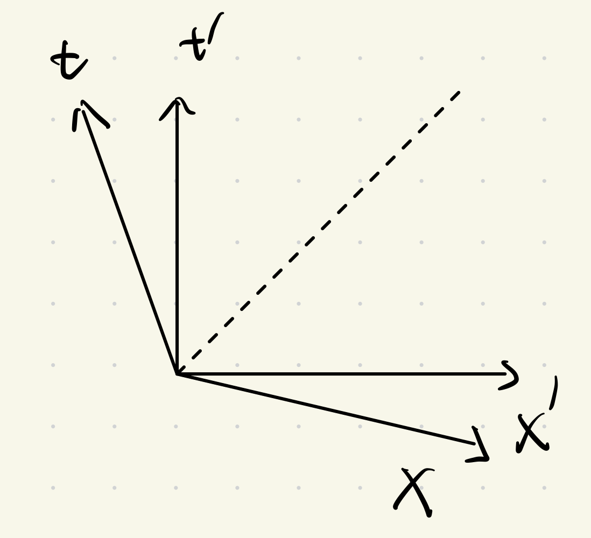
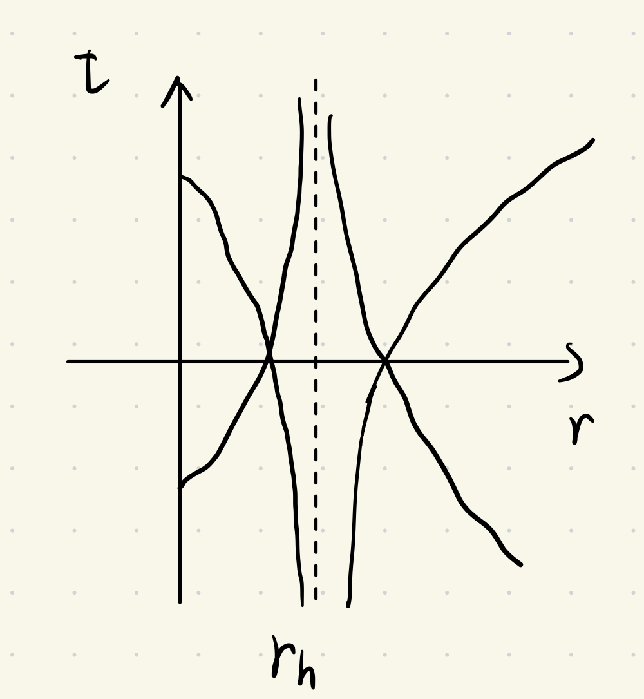

# 第1节作业

## 1-1

> 写出三维欧氏空间的线元（直角、球坐标系）。

直角坐标系：

$$
\mathrm{d}s^2 = \mathrm{d}x^2+\mathrm{d}y^2+\mathrm{d}z^2
$$

$$
\eta_{ij}
=\mathrm{diag}\left(1,1,1 \right)
$$

球坐标系：

$$
\mathrm{d}s^2 = \mathrm{d}r^2+r^2\mathrm{d}\theta^2 + r^2\sin^2\theta\mathrm{d}\phi^2
$$

$$
\eta_{ij}
=\mathrm{diag}\left(1,r^2,r^2\sin^2\theta \right)
$$

## 1-2

> 写出二维球面的线元；写出二维环面的线元。

设球面半径为常数 $R $，二维球面线元：

$$
\mathrm{d}s^2 = R^2\mathrm{d}\theta^2 + R^2\sin^2\theta\mathrm{d}\phi^2
$$

设环心到管中心的距离为常数 $R $，环面的管半径为常数 $r $，环面管的极角为 $\phi $，环面的方位角为 $\theta $，则二维环面上一点有两个自由度，其直角坐标 $(x,y,z) $ 与 $(\phi,\theta) $ 坐标的关系为：

$$
\left\{
\begin{aligned}
&x=\left(R+r\cos\theta \right)\cos\phi \\
&y=\left(R+r\cos\theta \right)\sin\phi \\
&z=r\sin\theta
\end{aligned}
\right.
$$

微分：

$$
\left\{
\begin{aligned}
&\mathrm{d}x = -\left(R+r\cos\theta \right)\sin\phi\mathrm{d}\phi -r\sin\theta\cos\phi\mathrm{d}\theta \\
&\mathrm{d}y = \left(R+r\cos\theta \right)\cos\theta\mathrm{d}\phi - r\sin\theta\sin\phi\mathrm{d}\theta \\
&\mathrm{d}z = r\cos\theta\mathrm{d}\theta
\end{aligned}
\right.
$$

二维环面线元：

$$
\begin{aligned}
\mathrm{d}s^2
&=\mathrm{d}x^2+\mathrm{d}y^2+\mathrm{d}z^2 \\
&=\left[-\left(R+r\cos\theta \right)\sin\phi\mathrm{d}\phi -r\sin\theta\cos\phi\mathrm{d}\theta \right]^2 \\
&+\left[\left(R+r\cos\theta \right)\cos\theta\mathrm{d}\phi - r\sin\theta\sin\phi\mathrm{d}\theta \right]^2 \\
&+\left(r\cos\theta\mathrm{d}\theta \right)^2 \\
&=\left(R+r\cos\theta \right)^2\mathrm{d}\phi^2 + r^2\mathrm{d}\theta^2
\end{aligned}
$$

## 1-3

> 推导一般洛伦兹变换。

设有两个惯性系 $S,S' $，同一事件 $P $ 在其中的坐标分别用 $(x_0,x_1,x_2,x_3),(x_0',x_1',x_2',x_3') $ 表示，其中 $x_0=ct,x_0'=ct' $。

约定希腊字母代表 $0,1,2,3 $，英文字母代表 $1,2,3 $。

考虑在 $S $ 中以速度 $u_i $ 做匀速直线运动的**光子**，由于一切惯性系都平权，因此在 $S' $ 系中观测，此粒子仍做匀速直线运动，速度记为 $u_i' $，因此有运动方程：

$$
\left\{
\begin{aligned}
&x_i = x_{i0} + u_i(t-t_0) \\
&x_i' = x_{i0}' + u_i'(t'-t_0')
\end{aligned}
\right.
$$

其中，$x_{i0},x_{i0}',t_0,t_0' $ 均为常数。

又光子以光速运动，而真空中光速在不同惯性系中恒为 $c $，因此有：

$$
\left\{
\begin{aligned}
u_i u_i = c^2 \\
u_i' u_i' = c^2
\end{aligned}
\right.
$$

引入中间变量

$$
\left\{
\begin{aligned}
&\beta_\mu = \beta_0 \frac{u_\mu }{c } ,\quad(u_0\equiv c) \\
&S = \frac{c }{\beta_0 } (t-t_0) \\
&\xi_\mu = (ct_0,x_{i0}),\quad \xi'_{\mu} = (ct_0',x_{i0}')
\end{aligned}
\right.
$$

光子运动方程可写为：

$$
\left\{
\begin{aligned}
&x_\mu = \xi_\mu + \beta_\mu S \\
&x_\mu' = \xi_\mu' + \beta_\mu'S'
\end{aligned}
\right.
$$

光速不变原理可写为：

$$
\left\{
\begin{aligned}
&\eta_{\mu\nu} \beta_\mu \beta_\nu = 0 \\
&\eta_{\mu\nu}' \beta_\mu' \beta_\nu' = 0
\end{aligned}
\right.
$$

设所求时空坐标变换为：

$$
x_\mu' = f_\mu(x_0,x_1,x_2,x_3)
$$

下面分四步求解。

（1）考虑惯性系条件对变换的限制

由各惯性系的等价性知，洛伦兹变换的逆变换是唯一确定的，其充要条件是变换的雅可比行列式非零：

$$
\mathrm{det}\left(\frac{\partial f_\nu }{\partial x_\mu }  \right) \ne 0
$$

于是：

$$
\frac{\mathrm{d}f_\mu }{\mathrm{d}S } 
=\frac{\mathrm{d}x_\nu }{\mathrm{d}S } \frac{\partial f_\mu }{\partial x_\nu } 
=\beta_\nu \frac{\partial f_\mu }{\partial x_\nu } 
$$

$$
\mathrm{d}f_\mu
=\mathrm{d}x_\mu'
=\beta_\mu'\mathrm{d}S'
=\frac{\beta_\mu' }{\beta_0' } \mathrm{d}f_0
$$

$$
\frac{\mathrm{d}f_\mu }{\mathrm{d}f_0 } 
=\frac{\beta_\mu' }{\beta_0' } 
=\frac{u_\mu' }{c } 
=\mathrm{const}
$$

$$
\frac{\beta_\mu' }{\beta_0' } 
=\frac{\mathrm{d}f_\mu }{\mathrm{d}f_0 } 
=\frac{\mathrm{d}f_\mu/\mathrm{d}S }{\mathrm{d}f_0/\mathrm{d}S } 
=\frac{\beta_\nu \partial f_\mu/\partial x_\nu }{\beta_\sigma \partial f_0/\partial x_\sigma } 
=\mathrm{const}
$$

上式取对数后对 $S $ 求导：

$$
\frac{\mathrm{d} }{\mathrm{d}S }\left[\ln\left(\beta_\nu\frac{\partial f_\mu }{\partial x_\nu } \right) - \ln\left(\beta_\sigma\frac{\partial f_0 }{\partial x_\sigma }  \right) \right] 
=0
$$

即：

$$
\dfrac{\beta_\nu\beta_\sigma \dfrac{\partial^2 f_\mu }{\partial x_\nu \partial x_\sigma}  }{\beta_\nu \dfrac{\partial f_\mu }{\partial x_\nu }  } 
=\dfrac{\beta_\nu\beta_\sigma \dfrac{\partial^2 f_0 }{\partial x_\nu \partial x_\sigma}  }{\beta_\nu \dfrac{\partial f_0 }{\partial x_\nu }  } 
$$

令上式左右恒等于 $2\beta_\sigma\psi_\sigma,\psi_\sigma=\psi_\sigma(x_0,x_1,x_2,x_3) $，则：

$$
\beta_\nu\beta_\sigma\frac{\partial^2 f_\mu }{\partial x_\nu\partial x_\sigma }
=2\beta_\nu\frac{\partial f_\mu }{\partial x_\nu } \beta_\sigma\psi_\sigma
$$

注意到：

$$
\begin{aligned}
2\beta_\nu\frac{\partial f_\mu }{\partial x_\nu } \beta_\sigma\psi_\sigma
&=\beta_\nu\frac{\partial f_\mu }{\partial x_\nu } \beta_\sigma\psi_\sigma + \beta_\nu\frac{\partial f_\mu }{\partial x_\nu } \beta_\sigma\psi_\sigma \\
&=\beta_\nu\frac{\partial f_\mu }{\partial x_\nu } \beta_\sigma\psi_\sigma + \beta_\sigma\frac{\partial f_\mu }{\partial x_\sigma } \beta_\nu\psi_\nu \\
&=\beta_\nu\beta_\sigma\left(\frac{\partial f_\mu }{\partial x_\nu } \psi_\sigma + \frac{\partial f_\mu }{\partial x_\sigma } \psi_\nu \right)
\end{aligned}
$$

因此：

$$
\beta_\nu\beta_\sigma\frac{\partial^2 f_\mu }{\partial x_\nu\partial x_\sigma }
=2\beta_\nu\frac{\partial f_\mu }{\partial x_\nu } \beta_\sigma\psi_\sigma
=\beta_\nu\beta_\sigma\left(\frac{\partial f_\mu }{\partial x_\nu } \psi_\sigma + \frac{\partial f_\mu }{\partial x_\sigma } \psi_\nu \right)
$$

对某一对 $(\nu,\sigma) $ 有：

$$
\frac{\partial^2 f_\mu }{\partial x_\nu \partial x_\sigma} 
=\frac{\partial f_\mu }{\partial x_\nu } \psi_\sigma + \frac{\partial f_\mu }{\partial x_\sigma } \psi_\nu
$$

（2）考虑光速不变原理对变换的限制
_
$$
\eta_{\mu\nu}\beta_\mu'\beta_\nu'
=\eta_{\mu\nu}\beta_\sigma
\beta_\lambda\frac{\partial f_\mu }{\partial x_\sigma } \frac{\partial f_\nu }{\partial x_\lambda } 
=0
$$

$$
\eta_{\sigma\lambda}\beta_\sigma\beta_\lambda = 0
$$

对比知，两式中 $\beta_\sigma \beta_\lambda $ 的二次式系数成正比，比例系数令为 $\lambda(x_0,x_1,x_2,x_3) $

$$
\eta_{\mu\nu}\frac{\partial f_\mu }{\partial x_\alpha } \frac{\partial f_\nu }{\partial x_\beta } 
=\lambda \eta_{\alpha\beta}
$$

上式对 $x_\rho $ 求导，并令 $\partial\lambda/\partial x_\rho=2\lambda \varphi_\rho $ 得：

$$
\eta_{\mu\nu}\left(\frac{\partial^2 f_\mu }{\partial x_\rho\partial x_\alpha } \frac{\partial f_\nu }{\partial x_\beta }  + \frac{\partial^2 f_\mu }{\partial x_\rho\partial x_\beta } \frac{\partial f_\nu }{\partial x_\alpha }  \right)
=2\lambda\eta_{\alpha\beta} \varphi_\rho
$$

即：

$$
2\eta_{\alpha\beta} \psi_\rho + \eta_{\rho\alpha}\psi_\beta + \eta_{\rho\beta}\psi_\alpha = 2\eta_{\alpha\beta} \varphi_\rho  
$$

令 $\rho\ne\alpha,\rho\ne\beta $，则 $\eta_{\rho\alpha}=\eta_{\rho\beta}=0 $，则：

$$
\psi_\rho=\varphi_\rho,\quad \rho=0,1,2,3
$$

令 $\rho=\alpha=\beta $，则：

$$
2\psi_\rho=\varphi_\rho,\quad \rho=0,1,2,3
$$

综合可得：

$$
\psi_\rho=\varphi_\rho=0,\quad \rho=0,1,2,3
$$

$$
\frac{\partial\lambda }{\partial x_\rho } = 2\lambda \varphi_\rho = 0,\quad \lambda=\mathrm{const}
$$

$$
\frac{\partial^2 f_\mu }{\partial x_\alpha \partial x_\beta } = 0
$$

这就是变换函数所要满足的线性条件。

（3）确定线性变换的形式

令线性变换为：

$$
x_\mu'=f_\mu=\sqrt{\lambda}\left(a_\mu+\eta_{\rho\rho}a_{\mu\nu}x_\nu \right)
$$

度规：

$$
\eta_{00}=1,\eta_{11}=\eta_{22}=\eta_{33}=-1
$$

$a_{\mu\nu} $ 满足正交条件：

$$
\left\{
\begin{aligned}
&\eta_{\mu\nu}a_{\mu\alpha}a_{\nu\beta} = \eta_{\alpha\beta} \\
&\eta_{\mu\nu}a_{\alpha\mu}a_{\beta\nu} = \eta_{\alpha\beta}
\end{aligned}
\right.
$$

可以解出：

$$
x_\mu = \eta_{\rho\rho}a_{\nu\mu}\left(\frac{x_\nu' }{\sqrt{\lambda} } - a_\nu \right)
$$

从 $S $ 系看 $S' $ 系固定点 $\mathrm{d}x_i' $ 以速度 $v_i $ 运动，则：

$$
\mathrm{d}x_i = \frac{1 }{\sqrt{\lambda} } a_{0i}\mathrm{d}x_0',\quad
\mathrm{d}x_0 = \frac{1 }{\sqrt{\lambda} } a_{00}\mathrm{d}x_0'
$$

$$
\frac{v_i }{c } = \frac{\mathrm{d}x_i }{\mathrm{d}x_0 } = \frac{a_{0i} }{a_{00} } 
$$

$$
\eta_{\mu\nu}\mathrm{d}x_\mu'\mathrm{d}x_\nu'
=\lambda\eta_{\alpha\beta}\mathrm{d}x_\alpha\mathrm{d}x_\beta
$$

令 $\mathrm{d}x_i'=0 $ 则有：

$$
\mathrm{d}x_0'^2
=\lambda\mathrm{d}x_0^2\left(1-v^2/c^2 \right)
$$

当 $v=0 $ 时有 $\mathrm{d}x_0'=\mathrm{d}x_0 $，因此 $\lambda=1 $，于是：

$$
\mathrm{d}s^2=\eta_{\mu\nu}\mathrm{d}x_\mu\mathrm{d}x_\nu
=-\eta_{\alpha\beta}\mathrm{d}x_\alpha'\mathrm{d}x_\beta'
$$

$$
x_\mu'=a_\mu+\eta_{\rho\rho} a_{\mu\nu}x_\nu
$$

（4）根据正交归一条件确定变换系数

为简便，取 $t=0 $ 时 $t'=0 $，且原点 $O,O' $ 重合。则 $a_\mu=0 $，洛伦兹变换简化为：

$$
x_\mu'=\eta_{\rho\rho} a_{\mu\nu}x_\nu
$$

设 $S' $ 系相对 $S $ 系以速度 $v_i $ 做匀速直线运动，则从 $S $ 系观测 $S' $ 系固定点 $\mathrm{d}x_i'=0 $ 的速度为 $v_i $；又在 $S' $ 系观察 $S $ 系固定的 $\mathrm{d}x_i=0 $ 以速度 $v_i' $ 运动，则：

$$
\left\{
\begin{aligned}
&a_{00} v_i=a_{0i} c \\
&a_{00} v_i'=a_{i0} c
\end{aligned}
\right.
$$

引入单向顺时性条件，即要求洛伦兹变换不改变时间进程的方向：

$$
a_{00}=\frac{\partial t' }{\partial t } > 0
$$

在正交条件中令 $\alpha=\beta=0 $ 有：

$$
\left\{
\begin{aligned}
a_{00}^2-\left(a_{10}^2+a_{20}^2+a_{30}^2 \right) = 1 \\
a_{00}^2-\left(a_{01}^2+a_{02}^2+a_{03}^2 \right) = 1 
\end{aligned}
\right.
$$

可以解出变换系数：

$$
\left\{
\begin{aligned}
&a_{00}=\frac{1 }{\sqrt{1-v^2/c^2} } \equiv \gamma \\
&a_{0i}=\gamma\frac{v_i }{c } \\
&a_{i0}=\gamma\frac{v_i' }{c } 
\end{aligned}
\right.
$$

正交条件中取 $\alpha,\beta $ 中一个为 $0 $ 有：

$$
\left\{
\begin{aligned}
&a_{00}v_i'=a_{ik}v_k \\
&a_{00}v_i=a_{ki}v_k'
\end{aligned}
\right.
$$

正交条件中取 $\alpha,\beta $ 均不为 $0 $ 有：

$$
a_{ki}a_{kj}
=-\eta_{ij}+a_{0i}a_{0j}
=\delta_{ij}+\gamma^2\frac{v_iv_j }{c^2 } 
$$

定义：

$$
d_{ik}
=-a_{ik}+\frac{a_{i0}a_{0k} }{a_{00}+1 } 
=-a_{ik}+(\gamma-1)\frac{v_i' v_k }{v^2 } 
$$

则一般固有洛伦兹变换系数为：

$$
\left\{
\begin{aligned}
&a_{00}=\gamma \\
&a_{0i}=\gamma \frac{v_i }{c } \\
&a_{i0}=-\gamma\frac{d_{ij} v_j }{c } \\
&a_{ik}=-d_{ik}-(\gamma-1)\frac{d_{ij}v_jv_k }{v^2 } 
\end{aligned}
\right.
$$

## 1-4

> 在 $v\ll c $ 的条件下验证伽利略变换。

$$
\left\{
\begin{aligned}
&x'=\gamma(x-vt) \\
&t'=\gamma\left(t-vx/c^2\right)
\end{aligned}
\right.
$$

其中，

$$
\gamma=\frac{1 }{\sqrt{1-v^2/c^2} } 
$$

当 $v\ll c $ 时，$\gamma\approx 1,vx/c^2\approx 0 $，洛伦兹变换退化为伽利略变换：

$$
\left\{
\begin{aligned}
&x'=x-vt \\
&t'=t
\end{aligned}
\right.
$$

## 1-5

> 证明在 Lorentz 坐标变换下线元不变。

取 $c=1 $，洛伦兹变换：

$$
\left\{
\begin{aligned}
&x'=\gamma(x-vt) \\
&y'=y \\
&z'=z \\
&t'=\gamma\left(t-vx\right)
\end{aligned}
\right.,\quad
\gamma = \frac{1 }{\sqrt{1-v^2} } 
$$

线元定义为：

$$
\mathrm{d}s^2
\equiv -\mathrm{d}t^2+\mathrm{d}x^2+\mathrm{d}y^2+\mathrm{d}z^2
$$

要证明在 Lorentz 坐标变换下线元不变，只需要证明：

$$
-\mathrm{d}t'^2+\mathrm{d}x'^2 = -\mathrm{d}t^2+\mathrm{d}x^2
$$

注意到：

$$
\mathrm{d}x'
=\gamma \left(\mathrm{d}x-v\mathrm{d}t \right)
$$

$$
\mathrm{d}t'
=\gamma\left(\mathrm{d}t-v\mathrm{d}x \right)
$$

于是：

$$
\begin{aligned}
-\mathrm{d}t'^2+\mathrm{d}x'^2
&=\gamma^2\left[-\left(\mathrm{d}t-v\mathrm{d}x \right)^2 + \left(\mathrm{d}x-v\mathrm{d}t \right)^2 \right] \\
&=\gamma^2\cdot \left[\left(v^2-1 \right)\mathrm{d}t^2+\left(1-v^2 \right)\mathrm{d}x^2 \right] \\
&=\frac{1 }{1-v^2 } \cdot \left(1-v^2 \right)\left(-\mathrm{d}t^2+\mathrm{d}x^2 \right) \\
&=-\mathrm{d}t^2+\mathrm{d}x^2
\end{aligned}
$$

因此在 Lorentz 坐标变换下线元不变。

## 1-6

> 在 $v\ll c $ 的条件下验证速度的伽利略变换。

$$
\left\{
\begin{aligned}
&u_x'=\frac{u_x-v }{1-vu_x/c^2 } \\
&u_y'=\frac{u_y }{\gamma\left(1-v u_x/c^2 \right) } \\
&u_z'=\frac{u_z }{\gamma\left(1-v u_x/c^2 \right) } \\
\end{aligned}
\right.
$$

当 $v\ll c $ 时，$v u_x/c^2\approx 0,\gamma\approx 1 $，于是速度的洛伦兹变换退化为速度的伽利略变换：

$$
\left\{
\begin{aligned}
&u_x'=u_x-v \\
&u_y'=u_y \\
&u_z'=u_z \\
\end{aligned}
\right.
$$

## 1-7

> 谈谈你对广义相对性原理的理解，给出广义相对论中的光速不变原理的表述。

广义相对性原理：物理定律在所有参考系（包括非惯性系）中形式相同。这意味着自然规律不依赖于观察者的运动状态，惯性力和引力效应在局部不可区分。引力被视为时空弯曲的表现，物质和能量决定时空几何，时空几何又影响物质运动。

广义相对论中的光速不变原理的表述：在局部惯性参考系中，光速在真空中恒为 $c $，且与光源和观察者的运动无关。

## 1-8

> 假设我们的宇宙是二维的，且物质分布是均匀各项同性的，写出我们宇宙的度规形式。

物质分布是均匀各项同性的，则度规与空间坐标无关。采用极坐标，线元为：

$$
\mathrm{d}s^2
=-\mathrm{d}t^2+a^2(t) \left(\mathrm{d}r^2+r^2\mathrm{d}\theta^2 \right)
$$

度规为：

$$
\eta_{\mu\nu}
=\mathrm{diag}\left(-1,a^2(t),a^2(t) r^2 \right)
$$

## 1-9

  

> 在惯性坐标系 $\Sigma' $ 系中画惯性系 $\Sigma $ 的坐标轴。

$$
\left\{
\begin{aligned}
&x=\gamma(x'+vt') \\
&t=\gamma\left(t'+vx'\right)
\end{aligned}
\right.
$$

$t $ 轴：令 $x=\gamma(x'+vt')=0 \Longrightarrow t'=-x'/v $

$x $ 轴：令 $t=\gamma\left(t'+vx'\right)=0 \Longrightarrow t'=-vx' $

  

## 1-10

  

> 在 $\Sigma $ 系中证明 $\Sigma' $ 系中的坐标轴正交。

$$
\left\{
\begin{aligned}
&x'=\gamma(x-vt) \\
&t'=\gamma\left(t-vx\right)
\end{aligned}
\right.
$$

$t' $ 轴：$x'=\gamma(x-vt)=0 \Longrightarrow t=x/v $

$x' $ 轴：$t'=\gamma\left(t-vx\right)=0 \Longrightarrow t=vx $

事件 $p=\left(t_p,v t_p \right) $，事件 $q=\left(t_q,t_q/v \right) $，内积：

$$
p\cdot q
=\eta_{\mu\nu} p^\mu q^\nu
=-p^0 q^0 + p^1 q^1
=-t_p t_q + \left(v t_p \right)\left(t_q/v \right)
=0
$$

因此 $\Sigma $ 系中证明 $\Sigma' $ 系中的坐标轴正交。

## 1-11

  

> $P,Q $ 两事件是否有因果关系？

$P $ 在 $Q $ 的光锥之外，两事件没有因果关系。

## 1-12

> 根据下面史瓦西时空的度规画出该时空中 $(t,r) $ 这两维时空的光锥结构，讨论该时空中的固有时和坐标时的关系，以及固有距离和坐标距离的关系。
>
>$$
\mathrm{d}s^2
=-f(r)\mathrm{d}t^2+\frac{\mathrm{d}r^2 }{f(r) } + r^2\left(\mathrm{d}\theta^2+\sin^2\theta\mathrm{d}\varphi^2 \right)
,\quad f(r)=1-\frac{r_h }{r } ,\quad r_h=2GM
>$$

### 光锥结构

只考虑径向，$\mathrm{d}\theta=\mathrm{d}\varphi=0 $，则线元为：

$$
\mathrm{d}s^2
=-f(r)\mathrm{d}t^2+\frac{\mathrm{d}r^2 }{f(r) } ,\quad f(r) = 1-\frac{r_h }{r },\quad r_h=2GM
$$

$$
\mathrm{d}s^2=0 \Longrightarrow \left(\frac{\mathrm{d}t }{\mathrm{d}r }  \right)^2   
=\frac{1 }{f^2(r) } 
\Longrightarrow 
\mathrm{d}t
=\pm \frac{1 }{f(r) } \mathrm{d}r
=\pm \frac{1 }{1-r_h/r } \mathrm{d}r
$$

积分：

$$
\begin{aligned}
t-t_0=\int \mathrm{d}t
&=\pm \int \frac{1 }{1-r_h/r } \mathrm{d}r \\
&=\pm\int \frac{1-r_h/r+r_h/r }{1-r_h/r } \mathrm{d}r \\
&=\pm\int\left(1+\frac{r_h }{r-r_h }  \right)\mathrm{d}r \\
&=\pm\left[r+r_h\int\frac{1 }{r-r_h } \mathrm{d}\left(r-r_h \right) \right] \\
&=\pm\left(r+r_h\ln\left|r-r_h \right| \right)
\end{aligned}
$$

即：

$$
t=t_0\pm \left(r+r_h\ln\left|r-r_h \right| \right)
$$

  

当 $r>r_h $ 时，光锥是正常的，光可以向外或向内传播。

当 $r=r_h $ 时，光锥坍缩为一条线，光无法逃逸。

当 $r<r_h $ 时，光锥反转，所有光都朝向奇点 $r=0 $ 传播。

### 固有时和坐标时的关系

对于静止观察者 $\mathrm{d}r^2=0 $，其固有时

$$
\mathrm{d}\tau^2
=-\mathrm{d}s^2
=f(r)\mathrm{d}t^2
=\left(1-\frac{r_h }{r }  \right)\mathrm{d}t^2
$$

当 $r\to \infty $ 时，$f(r)\to 1 $，固有时和坐标时一致；

当 $r\to r_h $ 时，$f(r)\to 0 $，固有时趋于无穷小。

### 固有距离和坐标距离的关系

对于径向距离 $\mathrm{d}t^2=0 $，固有距离为：

$$
\mathrm{d}l
=\frac{\mathrm{d}r }{\sqrt{f(r)} } 
=\frac{\mathrm{d}r }{\sqrt{1-r_h/r} } 
$$

当 $r\to \infty $ 时，$f(r)\to 1 $，固有距离与坐标距离一致；

当 $r\to r_h $ 时，$f(r)\to 0 $，固有距离趋于无穷大。

