# 1 四维表述基础

## 1.1 预备知识

事件：空间一点与时间一瞬的结合，$p=(t,\vec{x}) $

粒子：质点（有静质量，$m_0>0 $）和无静止质量粒子（光子、引力子等）。

世界线：粒子的全部历史。

观者：进行物理观测的人。

时空：全部事件的集合。

参考系：无数观者的集合 $R $ 称为一个参考系，若它满足以下条件：时空（或其中一个开集）中的任一点有且仅有 $R $ 内的一个观者的世界线经过。

## 1.2 SR的背景时空

SR的背景时空为闵氏时空。

### (1)线元（取 $c=1 $）

$$
\mathrm{d}s^2
=-c^2\mathrm{d}t^2+\mathrm{d}x^2+\mathrm{d}y^2+\mathrm{d}z^2
=-\mathrm{d}t^2+\mathrm{d}\vec{x}^2
=\eta_{\mu\nu}\mathrm{d}x^{\mu}\mathrm{d}x^{\nu}
$$

闵氏度规：

$$
\eta_{\mu\nu}
=\mathrm{diag}\left(-1,1,1,1 \right)
$$

线元是洛伦兹不变量：

$$
\mathrm{d}s^2=\mathrm{d}s'^2
$$

### (2)速度（惯性坐标系中）

$$
u
=\frac{\sqrt{\mathrm{d}x^2+\mathrm{d}y^2+\mathrm{d}z^2} }{\mathrm{d}t } 
=\frac{\mathrm{d}\left|\vec{x} \right| }{\mathrm{d}t } 
$$

$$
\mathrm{d}s^2
=-\mathrm{d}t^2+\mathrm{d}\vec{x}^2
=-\mathrm{d}t^2+u^2\mathrm{d}t^2
=-\left(1-u^2 \right)\mathrm{d}t^2
$$

$u=1 $，光速，$\mathrm{d}s^2=0 $，类光；

$u<1 $，亚光速，$\mathrm{d}s^2<0 $， 类时；

### （3）特殊洛伦兹变换

$$
\left\{
\begin{aligned}
&t'=\gamma\left(t-vx/c^2 \right) \\
&x'=\gamma\left(x-vt \right) \\
&y'=y \\
&z'=z
\end{aligned}
\right.,\quad
\gamma = \frac{1 }{\sqrt{1-v^2/c^2} } 
$$

$$
\gamma
\approx 1+\frac{1 }{2 } \left(\frac{v }{c }  \right)^2 + \frac{3 }{8 } \left(\frac{v }{c }  \right)^4 + \mathcal{O}\left(\left(\frac{v }{c }  \right)^6 \right)
$$

$$
x'^{\mu}
=a^\mu_{~~\nu} x^\nu
$$

$$
a^\mu_{~~\nu}
=\begin{bmatrix}
\gamma &-\gamma v &0 &0 \\
-\gamma v &\gamma &0 &0 \\
0 &0 &1 &0 \\
0 &0 &0 &1
\end{bmatrix}
$$

速度洛伦兹变换：

$$
\left\{
\begin{aligned}
&u_x' = \frac{u_x-v }{1-u_x v } \\
&u_y' = \frac{u_y }{\gamma^2\left(1-u_x v \right) } \\
&u_z' = \frac{u_z }{\gamma^2\left(1-u_x v \right) } 
\end{aligned}
\right.
$$

### (4)对应

惯性坐标--Lorentz坐标

间隔--闵氏线元

背景时空--闵氏时空

观者--类时曲线

惯性观者--类时测地线

### (5)SR的基本假设

光速不变原理、狭义相对性原理。

狭义相对性原理：惯性观者和非惯性观者有绝对区别；各惯性观者平权。 

## 1.3 惯性观者和惯性系

惯性坐标系：构成参考系的每个观者均为惯性观者；每个观者携带一个标准钟；有一个空间坐标值。

## 1.4 固有时和坐标时

观者的固有时就是ta的标准钟的读数。

标准钟：固有时=线长

$$
\Delta \tau
=\tau_2-\tau_1
=\frac{1 }{c } \int_{P_1}^{P_2}\sqrt{-\mathrm{d}s^2}
$$

事件 $P $ 在坐标系中的 $t $ 值称为坐标时。

二者的联系：

$$
\mathrm{d}\tau^2
=-\mathrm{d}s^2
=\left(1-u^2 \right)\mathrm{d}t^2
=\mathrm{d}t^2/\gamma_u^2
$$

$$
\mathrm{d}t = \gamma_u \mathrm{d}\tau
$$

固有时为粒子所在的静系 $\left(x',t' \right) $ 中的时间（$\mathrm{d}x'=0 $）。

$$
\mathrm{d}s^2=-c^2\mathrm{d}t'^2
=-c^2\mathrm{d}\tau^2
$$

## 1.5 时空图

### (1)惯性系之间的关系

洛伦兹变换：

$$
\left\{
\begin{aligned}
&t'=\gamma(t-vx) \\
&x'=\gamma(x-vt)
\end{aligned}
\right.
$$

$t' $ 轴的确定：$t' $ 轴的表达式为 $x'=0 $，即 $t=x/v $

$x' $ 轴的确定：$x' $ 轴的表达式为 $t'=0 $，即 $t=vx $

### 坐标轴的含义与时空坐标的读取

若在 $\Sigma $ 系画时空图，则横轴为 $x $ 轴，纵轴为 $t $ 轴，二者垂直。

为了读出时空图上一点 $P $ 在 $\Sigma $ 系的时空坐标，只要：

过 $P $ 作平行于 $t $ 轴的直线交 $x $ 轴于一点，这点到坐标原点的欧氏距离就是事件 $P $ 在 $\Sigma $ 系的空间坐标 $x $；

过 $P $ 作平行于 $x $ 轴的直线交 $t $ 轴于一点，这点到坐标原点的欧氏距离就是事件 $P $ 在 $\Sigma $ 系的时间坐标 $t $。

设 $\sigma' $ 系相对 $\Sigma $ 系以速度 $v $ 运动，则在 $\Sigma $ 系的时空图中可画出 $\Sigma' $ 系得两个坐标轴。$t' $ 轴即过原点且斜率为 $1/v $ 的直线，$t' $ 轴即过原点且斜率为 $v $ 的直线。

为了读出时空图上一点 $P $ 在 $\Sigma' $ 系的时空坐标，只要：

过 $P $ 作平行于 $t' $ 轴的直线交 $x' $ 轴于一点，读出这点在 $\Sigma $ 系的时空坐标 $(t_1,x_1) $，则事件 $P $ 在 $\Sigma' $ 系的空间坐标 $x'=\sqrt{-t_1^2+x_1^2} $；

过 $P $ 作平行于 $x' $ 轴的直线交 $t' $ 轴于一点，读出这点在 $\Sigma $ 系的时空坐标 $(t_2,x_2) $，则事件 $P $ 在 $\Sigma' $ 系的时间坐标 $t'=\sqrt{t_2^2-x_2^2} $；

### 坐标轴正交性

  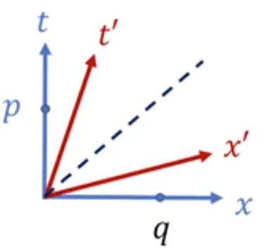

在 $\Sigma $ 系中，$p=(t,0),q=(0,x) $，内积：

$$
p\cdot q
=p^\mu q^\nu \eta_{\mu\nu}
=-p^0 q^0 + p^1 q^1
=-t\times 0 + 0\times x
=0
$$

在 $\Sigma' $ 系中，$p=(\gamma t,-\gamma v t),q=(-\gamma v x,\gamma x),q=(-\gamma vx,\gamma x) $，内积：

$$
p\cdot q
=-p^0 q^0 + p^1 q^1
=-\gamma t\times (-\gamma v x) + (-\gamma v t)\times\gamma x
=0
$$

夹角相同 $\theta=\theta' $（一条直线斜率为 $v $，另一条直线斜率为 $1/v $）。

$\Sigma $ 系的两个坐标轴也关于 $\Sigma' $ 系的光锥对称。

  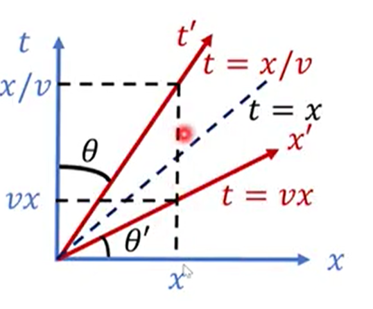

$\Sigma' $ 系的两个坐标轴关于 $\Sigma $ 系的光锥对称。

  

$\Sigma $ 系的两个坐标轴也关于 $\Sigma' $ 系的光锥对称。

  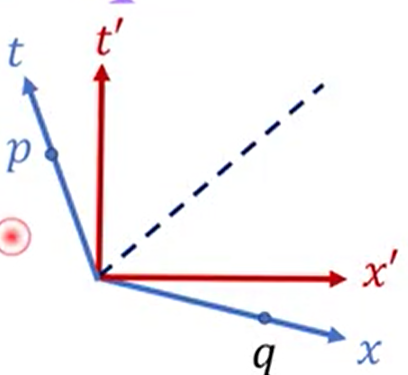

两系的光锥重合，都是角平分线。

$t' $ 坐标线为 $\Sigma $ 系中的一条类时曲线（测地线），代表一匀速直线运动的粒子的世界线。

$x' $ 坐标线为 $\Sigma $ 系中的一条类空曲线。

### (2)等线长曲线（校准曲线）

考虑1+1维时空线元：

$$
\mathrm{d}s^2=-\mathrm{d}t^2+\mathrm{d}x^2
$$

到原点 $O(0,0) $ 的线长（间隔）为常数 $K $ 的所有点 $(t,x) $ 的集合称为**等线长曲线**，满足方程：

$$
-t^2+x^2=K
$$

  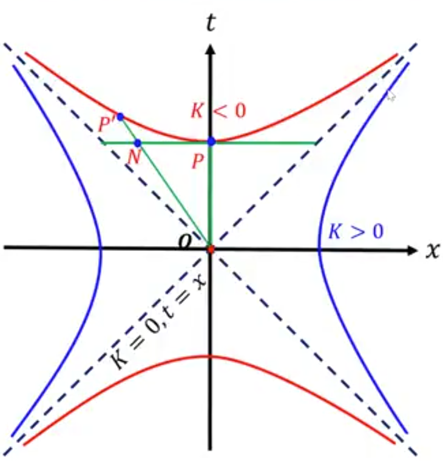

当 $K=0 $ 时，$-t^2+x^2=0,t=\pm x $，曲线上任一点 $M $ 到原点 $O $ 的线长均为零，该曲线为光锥。

当 $K<0 $ 时，$\displaystyle{\frac{t^2 }{\sqrt{-K}^2 }  }-\frac{x^2 }{\sqrt{-K}^2 }=1 , t=\pm\sqrt{x^2-K} $，曲线上任一点到原点 $O $ 的线长相等。该曲线又称为校准曲线。$\left|OP \right|=\left|OP' \right|>\left|ON \right| $，斜边小于直角边。

当 $K>0 $ 时，$\displaystyle{\frac{x^2 }{\sqrt{K}^2 } - \frac{t^2 }{\sqrt{K}^2 } = 1 , x=\pm\sqrt{t^2+K} }$，该曲线也是校准曲线。

## 1.6 SR与非SR的时空结构对比

|理论|第一手概念|派生||
|:---:|:---:|:---:|:---:|
|非SR|时间+空间|时空是绝对的（坐标系不依赖的）|一副扑克|
|SR|四维时空|3+1分解，时间、空间是相对的|无穷多副扑克|

  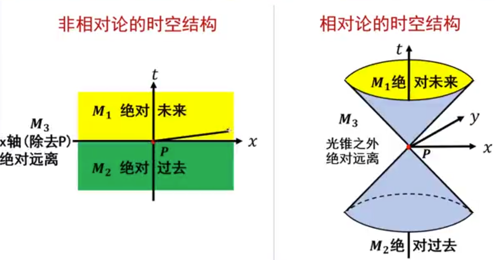

$M_1 $ 为时间 $P $ 的绝对未来，与 $P $ 有因果联系；

$M_2 $ 为时间 $P $ 的绝对过去，与 $P $ 有因果联系；

$M_3 $ 为时间 $P $ 的绝对远离，与 $P $ 无因果联系；

# 2 相对论的时空理论

## 2.1 相对论的时空结构

事件 $1,2 $ 的时空坐标分为设为 $(t_1,x_1,y_1,z_1),(t_2,x_2,y_2,z_2) $，间隔：

$$
S^2
=-(t_2-t_1)^2+(x_2-x_1)^2+(y_2-y_1)^2+(z_2-z_1)^2
=\eta_{\mu\nu}\Delta x^\mu\Delta x^\nu
$$

类时间隔 $S^2<0 $，$P_2 $ 在 $P_1 $ 的光锥之内；

类光间隔 $S^2=0 $，$P_2 $ 在 $P_1 $ 的光锥之上；

类空间隔 $S^2>0 $，$P_2 $ 在 $P_1 $ 的光锥之外。

由间隔不变性，$P_2 $ 和 $P_1 $ 的光锥的几何关系是绝对的，不依赖于惯性参考系。

### 类光间隔

  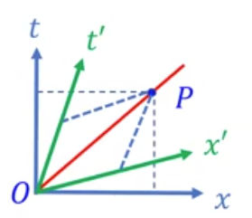

仅考虑 1+1 维时空，在 $\Sigma $ 系

$$
S^2 = -t^2 + x^2 = 0 \Longrightarrow t = x
$$

在 $\Sigma' $ 系

$$
S^2 = -t'^2 + x'^2 = 0 \Longrightarrow t' = x'
$$

对任意惯性系，$P $ 点都在 $O $ 点的光锥上。

### 类时间隔

  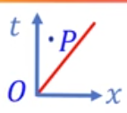

$$
S^2< 0
$$

可以通过 Lorentz 变换使得 $O,P $ 两点在某个惯性系中同地不同时。

  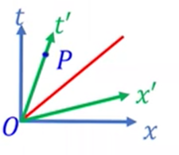

具体做法是以 $OP $ 为 $t' $ 轴构造坐标系 $\Sigma' $。由于 $t' $ 轴是 $x'=0 $ 线，即 $t' $ 轴上任意一点在 $\Sigma' $ 系的空间坐标 $x'=0 $。因此，在 $\Sigma $ 系 $O,P $ 是不同时不同地事件，但它们的时空坐标通过 Lorentz 变换变换到 $\Sigma' $ 系的时空坐标后，在 $\Sigma' $ 系它们成了同地不同时事件。

同理，一个惯性坐标系中的两个同地不同时事件，在其他惯性坐标系中不同地。

  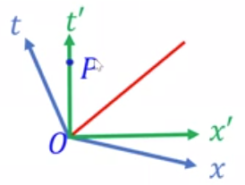

#### Lorentz 变换保持时间正向不变

  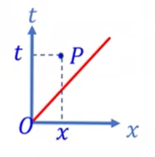

上半光锥 $t>0 $，类时间隔 $t>x,1>v $，因此：

$$
t' = \gamma(t-vx) > 0
$$

类时区域包括 $t>0 $ 和 $t<0 $ 两部分，由于 Lorentz 变换保持时间正向不变，因此这两部分不能互换。

绝对未来：$P $ 点在 $O $ 点的上半光锥之内。

  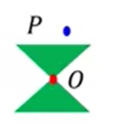

绝对过去：$P $ 点在 $O $ 点的下半光锥之内。

  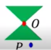

#### 时间和空间的相对性

两类时事件在任何惯性系中都绝对不同时。从时空图上看，某一惯性系 $\Sigma' $ 的等时线是一系列平行于 $x' $ 轴的直线。而在时空图中，$x' $ 轴的斜率允许的取值范围为 $\left[-1,1 \right] $，因此 $\Sigma' $ 的等时线斜率在 $[-1,1] $ 范围内。而由于 $O,P $ 是类时事件，$P $ 在 $O $ 的光锥之内，直线 $OP $ 的斜率不可能落在 $[-1,1] $ 的范围内。因此两类时事件绝对不同时。

### 类空间隔

  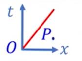

$$
S^2>0
$$

  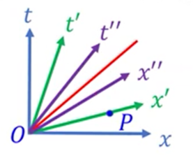

可以通过 Lorentz 变换使得 $O,P $ 两点在某个惯性系中同时不同地。具体做法是以 $OP $ 为 $x' $ 轴构造坐标系 $\Sigma' $。由于 $x' $ 轴是 $t'=0 $ 线，即 $x' $ 轴上任意一点在 $\Sigma' $ 系的时间坐标 $t'=0 $。因此，在 $\Sigma $ 系 $O,P $ 是不同时不同地事件，但它们的时空坐标通过 Lorentz 变换变换到 $\Sigma' $ 系的时空坐标后，在 $\Sigma' $ 系它们成了同时不同地事件。

两类空事件，先后是相对的，但绝对异地。

## 2.2 时空关系的绝对分类

取 $P_1=O=(0,0,0,0),P_2=P=(t,x,y,z) $

$$
S^2
=-t^2+x^2+y^2+z^2
$$

类光间隔 $S^2=0 $，$P $ 点在光锥上；

类时间隔 $S^2<0 $，$P $ 点在光锥内；可通过洛伦兹变换使得 $O,P $ 两事件同地不同时。

类时区域包括 $t>0,t<0 $ 两部分，洛伦兹变换保持时间正向不变。

$$
t'=\gamma(t-vx)
$$

由于 $t>x,v<1 $，因此 $t'>0 $。

绝对未来：$P $ 点在 $O $ 点的上半光锥之内。

绝对过去：$P $ 点在 $O $ 点的下半光锥之内。

$OP $ 在地面参考系为时空间隔，在飞船系为时间间隔。而间隔不变，因此两时间在不同参考系中的时间差不同。

类空间隔 $S^2>0 $，$P $ 点在光锥内；可通过洛伦兹变换使得 $O,P $ 两事件同时不同地。

两类空事件，先后相对，异地绝对。

## 2.3 因果律

两关联事件可用光信号或速度低于光速的信号联系。

实验表明，物质运动的速度不超过光速。

SR保证因果律：两类时和类光事件的先后是绝对的。两类空事件无因果联系。

两类空事件无因果关系。

## 2.4 同时的相对性和绝对性

两同时同地事件（$S^2=0 $，类光）在任何惯性系中仍为同时同地事件。同时绝对，同地也绝对。

$$
\Delta t = 0,\quad \Delta x = 0 \Longrightarrow
\left\{
\begin{aligned}
&\Delta t' = \gamma(\Delta t- v\Delta x) = 0 \\
&\Delta x' = \gamma(\Delta x - v\Delta t) = 0
\end{aligned}
\right.
$$

两同时不同地时间 $S^2=\Delta x^2>0 $，类空。同时是相对的。

两类空事件的同时和先后都是相对的。

两事件类光，有因果关系，同时是绝对的，先后是绝对的。

两事件类时，有因果关系，无同时，先后是绝对的。

两事件类空，因果关系，同时是相对的，先后是相对的，两事件绝对异地。

## 3 典型效应分析

### 3.1 尺缩效应

尺子在时空图中表现为一个二维世界面。

  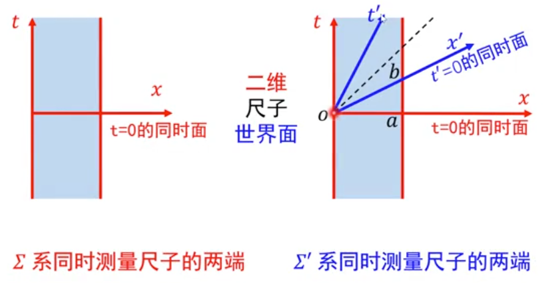

在某个惯性系中同时测量尺子两端的空间坐标，则这两个空间坐标的欧氏长度就是该惯性系中尺子的长度。

  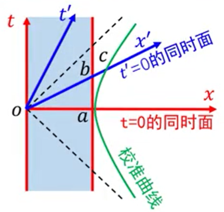

  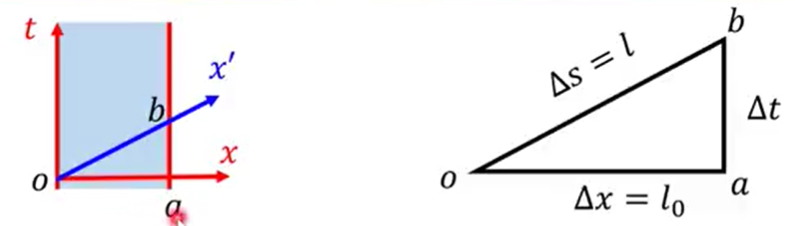

$l_0=\left|oa \right| $ 是 $\Sigma $ 系 $t=0 $ 时测的尺长。

$l=\left|ob \right| $ 是 $\Sigma' $ 系 $t'=0 $ 时测的尺长。

利用校准曲线：

$$
\left|oa \right| = \left|oc \right| > \left|ob \right|
$$

即：

$$
l_0>l
$$

静长（固有长度）最长，动尺收缩。

尺子只有一把（其世界面只有一个），但不同惯性系有不同的同时面，导致不同的惯性系测得不同的一维尺子长度。

$$
\mathrm{d}s^2 = -\mathrm{d}t^2+\mathrm{d}x^2
$$

$$
\Delta s^2 = -\Delta t^2 + \Delta x^2
$$

$$
l^2 = -\Delta t^2 + l_0^2
$$

$x' $ 轴方程 $t=vx $，$t_b=\Delta t=v\Delta x=v l_0 $

分别在 $\Sigma $ 系和 $\Sigma' $ 计算 $b $ 到 $o $ 点的线长，二者应相等：

$$
l^2
=-v^2 l_0^2 + l_0^2
=\left(1-v^2 \right)l_0^2
$$

得到：

$$
l
=\sqrt{1-v^2}l_0
=\frac{l_0 }{\gamma } 
$$

### 3.2 钟慢效应

  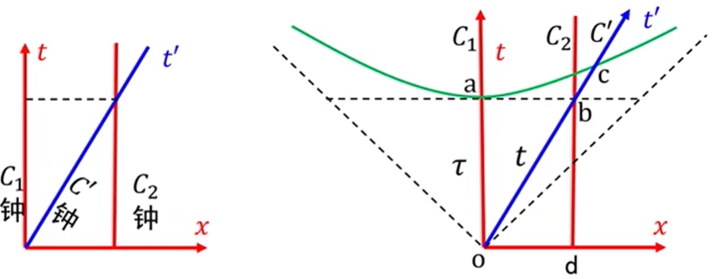

$$
\left|db \right|=\left|oa \right|=\left|oc \right|>\left|ob \right|
$$

$$
\tau>t
$$

  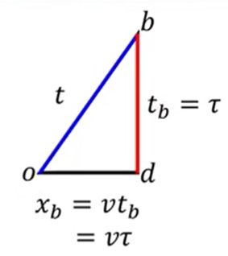

$t' $ 轴方程 $x=vt $，

$$
x_b = v t_b = \tau
$$

对类时间隔

$$
\mathrm{d}s^2 = -\mathrm{d}t^2 + \mathrm{d}x^2 < 0
$$

$$
-\mathrm{d}s^2 = \mathrm{d}t^2 - \mathrm{d}x^2 > 0
$$

即：

$$
\left|ob \right|^2 = \left|db \right|^2 - \left|od \right|^2
$$

$$
t^2 = \tau^2 - (v\tau)^2 \Longrightarrow
t^2 = \left(1-v^2 \right)\tau^2
$$

$$
\boxed{
t = \sqrt{1-v^2}\tau = \frac{\tau }{\gamma } < \tau
}
$$

运动时钟变慢，即 $\Sigma $ 系认为动钟 $C' $ 变慢。

  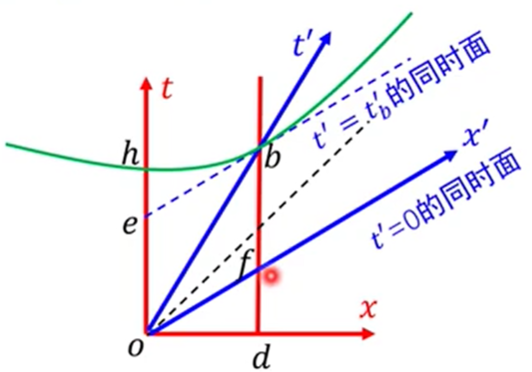

从 $\Sigma' $ 系来看，$\Sigma' $ 系的观者根据同时面 $t'=0 $ 和 $t'=t_b' $，认为动钟 $C_2 $ 较慢：

$$
\left|ob \right| = \left|oh \right| > \left|oe \right| = \left|fb \right|
$$

$\Sigma' $ 系，拿 $\left|ob \right| $ 比 $\left|fb \right| $；

$\Sigma $ 系，拿 $\left|ob \right| $ 比 $\left|db \right| $。

也就是说，在 $\Sigma $ 系比钟，找 $\Sigma $ 系的同时面；在 $\Sigma' $ 系比钟，找 $\Sigma' $ 系的同时面。

站的角度不同，导致结果不一样。

钟慢效应钟，无任何钟的走时率真正变小。

### 3.3 孪生子效应

时间的比较，就是类时曲线线长的比较。

  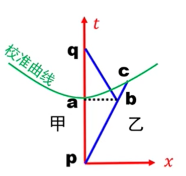

校准曲线给出：

$$
\left|pa \right| = \left|pc \right| > \left|pb \right|
$$

$$
\left|qa \right| > \left|qb \right|
$$

$$
\left|\overline{paq} \right| > \left|\overline{pbq } \right|
$$

因此，重逢时乙比甲年轻。

推论：闵氏时空中两点（类时事件）间的类时测地线是该两点间类时曲线的最长者。

一人惯性运动，一人非惯性运动，二人地位不平等。

惯性运动世界线为测地线，4加速为零；

非惯性运动世界线为非测地线，有4加速。

### 3.4 车库佯谬

有一辆静长与车库相等的车，以一定速度 $u $ 入库。在司机看来，车库变短，装不下整俩车；在车库看来，车变短，可以装下。那么车库能否装下整辆车？

### 3.5 悬崖佯谬

汽车以接近光速的速度由公路驶向悬崖。在悬崖看来，汽车缩短，受重力作用进行平抛运动，会坠入悬崖；在汽车司机看来，悬崖高速向自己飞来，悬崖长度缩短至非常短的距离，因此可以飞越悬崖。那么汽车能否飞越悬崖？

### 3.6 剑鞘装仙剑

一柄仙剑高速飞入剑鞘，最终停在剑鞘里。仙剑和剑鞘内部空间静长相等。在剑鞘看来，仙剑缩短了，装入剑鞘时剑柄上的护手先接触剑鞘；在仙剑看来，剑鞘缩短了，剑尖先接触剑鞘底部。那么哪个部位受力使仙剑停止运动？

# 宇宙学

## Red shift

### Comoving coordinates

共动坐标是一种随宇宙一起膨胀的坐标系。

宇宙中任意两个天体之间的实际物理距离 $D(t) $ 通常表示为：

$$
D(t)
=a(t) \cdot \chi
$$

其中，$a(t) $ 是尺度因子，用于描述宇宙的膨胀；$\chi $ 就是共动距离，它在宇宙膨胀过程中保持不变。

### 红移

红移是光的波长被拉长的现象，通常用符号 $z $ 表示：

$$
z
\equiv \frac{\lambda_{\mathrm{obs}} - \lambda_{\mathrm{emit}} }{\lambda_{\mathrm{emit}} } 
=\frac{\lambda_{\mathrm{obs}} }{\lambda_{\mathrm{emit}} } - 1
$$

其中，$\lambda_{\mathrm{emit}} $ 是光发出时的波长，$\lambda_{\mathrm{obs}} $ 是光被我们观测到时的波长。

#### 三种红移来源

|类型 | 原因 | 示例|
|:---:|:---|:---|
|多普勒红移 | 天体在远离我们 | 星系运动、光谱偏红|
|引力红移 | 强引力场使光能量下降 | 黑洞附近|
|宇宙学红移 | 宇宙膨胀“拉伸”了光的波长 | 远处星系、宇宙微波背景辐射|

#### 宇宙学红移 $z $ 和尺度因子 $a(t) $ 的关系

$$
1 + z
=\frac{a(t_{\mathrm{obs}}) }{a(t_{\mathrm{emit}}) } 
$$

推导：

设光的周期为 $\Delta t $，若不考虑宇宙膨胀，光的波长（共动距离）为：

$$
\lambda_0 = c\Delta t
$$

先考虑宇宙膨胀，在光发出的时刻 $t_{\mathrm{emit}} $，宇宙尺度因子为 $a(t_{\mathrm{emit}}) $，根据实际距离 $D(t) $，尺度因子 $a(t) $ 和共动距离 $\chi $ 的关系

$$
D(t) = a(t) \cdot \chi
$$

有：

$$
\lambda_{\mathrm{emit}}
=a(t_{\mathrm{emit}}) \lambda_0
$$

类似地，在光被接收的时刻 $t_{\mathrm{obs}} $，宇宙尺度因子为 $a(t_{\mathrm{obs}}) $，有：

$$
\lambda_{\mathrm{obs}}
=a(t_{\mathrm{obs}}) \lambda_0
$$

因此：

$$
z
\equiv \frac{\lambda_{\mathrm{obs}} - \lambda_{\mathrm{emit}} }{\lambda_{\mathrm{emit}} } 
=\frac{\lambda_{\mathrm{obs}} }{\lambda_{\mathrm{emit}} } - 1
=\frac{a(t_{\mathrm{obs}}) }{a(t_{\mathrm{emit}}) } - 1
$$

即：

$$
1+z
=\frac{a(t_{\mathrm{obs}}) }{a(t_{\mathrm{emit}}) } 
$$

### 哈勃常数

哈勃常数 $H_0 $ 是描述宇宙当前膨胀速度的参数，定义为：

$$
H_0(t_0)
\equiv \frac{\dot{a}(t) }{a(t) }\bigg|_{t=t_0} 
$$

#### 低红移时红移和哈勃常数的关系

红移 $z $ 和尺度因子 $a(t) $ 的关系

$$
1 + z
=\frac{a(t_{\mathrm{obs}}) }{a(t_{\mathrm{emit}}) } 
$$

若 $\Delta t\equiv t_{\mathrm{obs}} - t_{\mathrm{emit}} $ 很小，则 $a(t_{\mathrm{obs}}) $ 在 $t=t_{\mathrm{emit}} $ 处展开，保留至一阶小量：

$$
\begin{aligned}
1+z
&=\frac{a(t_{\mathrm{obs}}) }{a(t_{\mathrm{emit}}) }
\approx \frac{a(t_{\mathrm{emit}}) + \dot{a}(t_{\mathrm{emit}}) \Delta t }{a(t_{\mathrm{emit}}) } \\
&=1 + \frac{\dot{a}(t_{\mathrm{emit}}) }{a(t_{\mathrm{emit}}) } \Delta t \\
&=1 + H(t_{\mathrm{emit}}) \Delta t \\
&\approx 1 + H(t_{\mathrm{obs}}) \Delta t \\
&=1 + H(t_{\mathrm{obs}}) \frac{D }{c } \\
\end{aligned}
$$

即：

$$
z
\approx H(t_{\mathrm{obs}}) \frac{D }{c }
$$

### 现代宇宙学的假设

（isotropic）宇宙是各向同性的；

（homogeneous）宇宙是均匀的；

The expansion receding speed is greater the farther apart. 距离我们越远的星系，它们因为宇宙膨胀而“退行”的速度越快。

The universe has grown from the tiny primitive universe to how it looks today. 宇宙从最初那个微小、原始的宇宙，演化成了今天这个样子。

The universe began about 14 billion years ago(Big Bang). 宇宙大约始于 140 亿年前（大爆炸）。

At the beginning, the universe was very dense, at extremely high temperature.

10-44 seconds after its birth, the universe expands rapidly, in 10-34 seconds by a factor of 10100, in a phase called "Inflation".

After inflation, the universe expands and cools until today.

### 哈勃定律

$$
v = H d
$$

$v $-recession speed, $d $-distance, $H $-Hubble constant

### 宇宙微波背景辐射

### 暗物质

暗物质是一种只通过引力相互作用、极弱的可能的弱相互作用参与宇宙动力学的物质成分。

暗物质不参与电磁相互作用（即不吸光、不发光、不反射光）

### 暗能量

在广义相对论框架中，暗能量可以看作是一种具有负压的流体或场，其压强 $p $ 和能量密度 $\rho $ 满足状态方程：

$$
p = w \rho
$$

当 $w<-1/3 $ 会导致宇宙加速膨胀。

$$
-4\pi G \rho
=3\left(H^2+\dot{H} \right)
$$

$$
P_\Lambda
=-\rho_\Lambda
=-\frac{\Lambda c^2 }{8 \pi G } 
$$

加速方程

$$
\boxed{
\frac{\ddot{a} }{a } 
=\frac{4\pi G }{3 } \left(\rho + 3 p \right) + \frac{\Lambda c^2 }{3 } 
}
$$

Frieman 方程

$$
\boxed{
H^2
=\frac{8\pi G }{3 } \rho - \frac{k c^2 }{a^2 } + \frac{\Lambda c^2 }{3 } 
}
$$