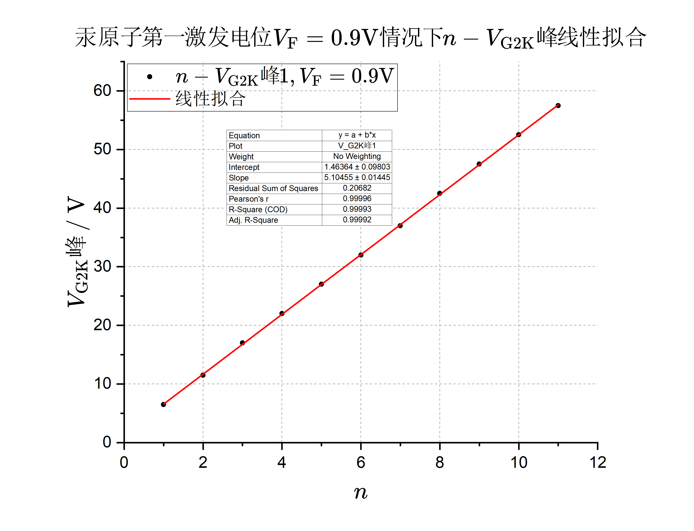

## 三、数据处理与误差分析

#### 拟合法原理

设物理量 $y $ 与 $x $ 线性相关，$y=ax+b $，则最小二乘法给出：

斜率估计值：

$$
\hat{a}
=\sum_{i=1}^{N}(x_i-\bar{x})(y_i-\bar{y})  \bigg/ \sum_{i=1}^{N}(x_i-\bar{x})^2
$$

截距估计值：

$$
\hat{b}
=\bar{y} - \hat{a}\bar{x}
$$

斜率不确定度（A类）：

$$
U(a)
=t(N-2)\cdot \sqrt{\frac{\sum\limits_{i=1}^{N} \left[y_i-\left(\hat{a} x_i + \hat{b}\right)\right]^2 }{(n-2)\sum\limits_{i=1}^{N} (x_i-\bar{x})^2 } }
$$

截距不确定度（A类）：

$$
U(b)
=t(N-2)\cdot\sqrt{\frac{\sum\limits_{i=1}^{N} \left[y_i-\left(\hat{a} x_i + \hat{b}\right)\right]^2 }{(n-2) } }\cdot \sqrt{\frac{\bar{x}^2 }{\sum\limits_{i=1}^{N} (x_i-\bar{x})^2 } + \frac{1 }{n }  }
$$

根据公式 $n V_0 + V_\mathrm{C} = V_\mathrm{G2K} $，若以 $n $ 为横坐标，$V_\mathrm{G2K} $ 为纵坐标对数据点进行线性拟合，则拟合直线的斜率等于第一激发电位 $V_0 $，截距等于接触电位差 $V_\mathrm{C} $。

#### 逐差法原理

设物理量 $y $ 与 $x $ 线性相关，$y=ax+b $，$(x_i,y_i) $ 是一系列等间隔数据点，$x_{i+1}-x_i=\Delta x $，则斜率估计值：

$$
\hat{a}
=\frac{1 }{N-1 } \sum_{i=1}^{N-1} \frac{y_{i+1}-y_{i} }{\Delta x } 
=\frac{1 }{N-1 } \frac{y_N-y_1 }{\Delta x } 
$$

截距估计值：

$$
\hat{b}
=\bar{y} - \hat{a}\bar{x}
$$

### 汞原子第一激发电位$V_\mathrm{F}=0.9\mathrm{V} $

实验参数：$V_\mathrm{F}=0.9\mathrm{V},V_\mathrm{G1K}=1.4\mathrm{V},V_\mathrm{G2P}=1.6\mathrm{V},T=210\degree\mathrm{C} $ 

#### 拟合法

  

  

为简便，把 $V_\mathrm{G2K} $ 记为 $y $，把 $n $ 记为 $x $。

第一激发电位（斜率）：$\displaystyle{\hat{V}_0=\sum_{i=1}^{N}(x_i-\bar{x})(y_i-\bar{y})  \bigg/ \sum_{i=1}^{N}(x_i-\bar{x})^2 = 5.105~\mathrm{V} }$ 

接触电位差（截距）：$\displaystyle{\hat{V}_\mathrm{C}=\bar{y} - \hat{V}_0 \bar{x} = 1.464~\mathrm{V} }$ 

第一激发电位 $V_0 $ 不确定度：

$$
\begin{aligned}
U(V_0)
&=t(N-2)\cdot \sqrt{\frac{\sum\limits_{i=1}^{N} \left[y_i-\left(\hat{a} x_i + \hat{b}\right)\right]^2 }{(n-2)\sum\limits_{i=1}^{N} (x_i-\bar{x})^2 } } \\
&=2.31\times 0.144~\mathrm{V} \\
&=0.033~\mathrm{V}
\end{aligned}
$$

接触电位差 $V_\mathrm{C} $ 不确定度：

$$
\begin{aligned}
U(V_\mathrm{C})
&=t(N-2)\cdot\sqrt{\frac{\sum\limits_{i=1}^{N} \left[y_i-\left(\hat{a} x_i + \hat{b}\right)\right]^2 }{(n-2) } }\cdot \sqrt{\frac{\bar{x}^2 }{\sum\limits_{i=1}^{N} (x_i-\bar{x})^2 } + \frac{1 }{n }  } \\
&=2.31\times 0.098~\mathrm{V} \\
&=0.226~\mathrm{V}
\end{aligned}
$$

第一激发电位：$V_0=\hat{V}_0\pm U(V_0) = (5.105\pm 0.033)~\mathrm{V}  $

接触电位差：$V_\mathrm{C}=\hat{V}_\mathrm{C}\pm U(V_\mathrm{C}) = (1.464\pm 0.226)~\mathrm{V} $

置信度为 $0.95 $。

#### 逐差法

第一激发电位估计值：

$$
\hat{V}_0
=\frac{1 }{N-1 } \sum_{i=1}^{N-1} \frac{y_{i+1}-y_{i} }{\Delta x } 
=\frac{1 }{N-1 }(y_N-y_1)
=5.100~\mathrm{V}
$$

接触电位差估计值：

$$
\hat{V}_\mathrm{C}
=\bar{y} - \hat{V}_0\bar{x}
=1.491~\mathrm{V}
$$

### 汞原子第一激发电位$V_\mathrm{F}=1.8\mathrm{V} $

实验参数：$V_\mathrm{F}=1.8\mathrm{V},V_\mathrm{G1K}=1.4\mathrm{V},V_\mathrm{G2P}=1.6\mathrm{V},T=210\degree\mathrm{C} $ 

#### 拟合法

  

  

为简便，把 $V_\mathrm{G2K} $ 记为 $y $，把 $n $ 记为 $x $。

第一激发电位（斜率）：$\displaystyle{\hat{V}_0=\sum_{i=1}^{N}(x_i-\bar{x})(y_i-\bar{y})  \bigg/ \sum_{i=1}^{N}(x_i-\bar{x})^2 = 5.306~\mathrm{V} }$ 

接触电位差（截距）：$\displaystyle{\hat{V}_\mathrm{C}=\bar{y} - \hat{V}_0 \bar{x} = 1.567~\mathrm{V} }$ 

第一激发电位 $V_0 $ 不确定度：

$$
\begin{aligned}
U(V_0)
&=t(N-2)\cdot \sqrt{\frac{\sum\limits_{i=1}^{N} \left[y_i-\left(\hat{a} x_i + \hat{b}\right)\right]^2 }{(n-2)\sum\limits_{i=1}^{N} (x_i-\bar{x})^2 } } \\
&=2.36\times 0.037~\mathrm{V} \\
&=0.087~\mathrm{V}
\end{aligned}
$$

接触电位差 $V_\mathrm{C} $ 不确定度：

$$
\begin{aligned}
U(V_\mathrm{C})
&=t(N-2)\cdot\sqrt{\frac{\sum\limits_{i=1}^{N} \left[y_i-\left(\hat{a} x_i + \hat{b}\right)\right]^2 }{(n-2) } }\cdot \sqrt{\frac{\bar{x}^2 }{\sum\limits_{i=1}^{N} (x_i-\bar{x})^2 } + \frac{1 }{n }  } \\
&=2.36\times 0.229~\mathrm{V} \\
&=0.540~\mathrm{V}
\end{aligned}
$$

第一激发电位：$V_0=\hat{V}_0\pm U(V_0) = (5.306\pm 0.087)~\mathrm{V}  $

接触电位差：$V_\mathrm{C}=\hat{V}_\mathrm{C}\pm U(V_\mathrm{C}) = (1.567\pm 0.540)~\mathrm{V} $

置信度为 $0.95 $。

**结论：当 $V_\mathrm{F} $ 增大时（$V_\mathrm{F}:0.9~\mathrm{V}\to 1.8~\mathrm{V} $），第一激发电位 $V_0 $ 增大（$V_0:5.105~\mathrm{V}\to 5.306~\mathrm{V} $），接触电位差 $V_\mathrm{C} $ 也增大($V_\mathrm{C}:1.464~\mathrm{V}\to 1.567~\mathrm{V} $)。**

#### 逐差法

第一激发电位估计值：

$$
\hat{V}_0
=\frac{1 }{N-1 } \sum_{i=1}^{N-1} \frac{y_{i+1}-y_{i} }{\Delta x } 
=\frac{1 }{N-1 }(y_N-y_1)
=5.278~\mathrm{V}
$$

接触电位差估计值：

$$
\hat{V}_\mathrm{C}
=\bar{y} - \hat{V}_0\bar{x}
=1.722~\mathrm{V}
$$

### 汞原子高激发态$V_\mathrm{F}=1.2\mathrm{V} $

实验参数：$V_\mathrm{F}=1.2\mathrm{V},V_\mathrm{G1K}=1.5\mathrm{V},V_\mathrm{G2P}=1.3\mathrm{V},T=110\degree\mathrm{C} $ 

  

