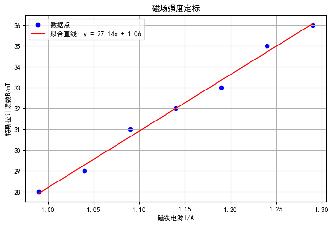
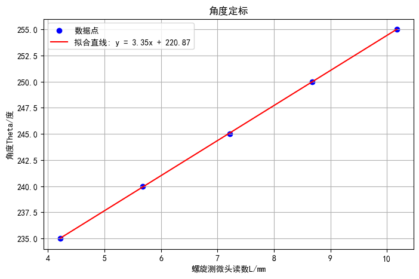
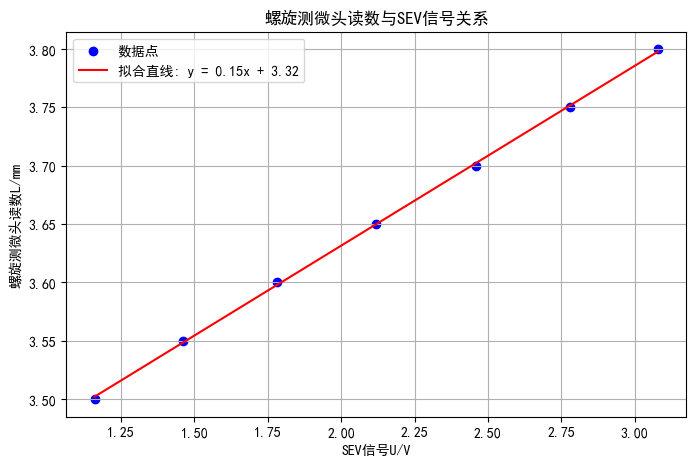
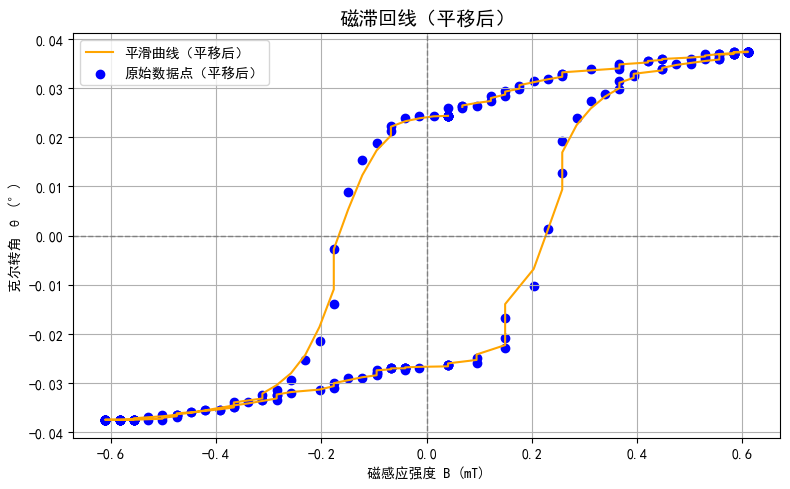

### 磁场强度定标

#### 实验数据

|磁铁电源$I/\mathrm{A} $|$0.99 $|$1.04 $|$1.09 $|$1.14 $|$1.19 $|$1.24 $|$1.29 $|
|:---:|:---:|:---:|:---:|:---:|:---:|:---:|:---:|
|特斯拉计读数 $B/\mathrm{mT} $|$28 $|$29 $|$31 $|$32 $|$33 $|$35 $|$36 $|

#### 拟合曲线

  

根据拟合曲线，磁感应强度 $B(\mathrm{mT}) $ 与磁铁电源 $I(\mathrm{A}) $ 的关系为：

$$
B(\mathrm{mT}) = 27.14\times I(\mathrm{A}) + 1.06
$$

### 角度定标

#### 实验数据

|螺旋测微头读数 $L/\mathrm{mm} $|$4.220 $|$5.680 $|$7.215 $|$8.675 $|$10.175 $|
|:---:|:---:|:---:|:---:|:---:|:---:|
|角度 $\theta/ ^\circ $|$235 $|$240 $|$245 $|$250 $|$255 $|

#### 拟合曲线

  

根据拟合曲线，角度 $\theta(^\circ) $ 与螺旋测微头读数 $L(\mathrm{mm}) $ 的关系为：

$$
\theta(^\circ) = 3.35\times L(\mathrm{mm}) + 220.87
$$

### 螺旋测微器读数与 $\mathrm{SEV} $ 信号关系

#### 实验数据

|$\mathrm{SEV} $ 信号 $U/\mathrm{V} $|$1.16 $|$1.46 $|$1.78 $|$2.12 $|$2.46 $|$2.78 $|$3.08 $|
|:---:|:---:|:---:|:---:|:---:|:---:|:---:|:---:|
|螺旋测微头读数 $L/\mathrm{mm} $|$3.500 $|$3.550 $|$3.600 $|$3.650 $|$3.700 $|$3.750 $|$3.800 $|

#### 拟合曲线

  

根据拟合曲线，螺旋测微读数 $L(\mathrm{mm}) $ 与 $\mathrm{SEV} $ 信号 $U(\mathrm{V}) $ 的关系为：

$$
L(\mathrm{mm}) = 0.15\times U(\mathrm{V}) + 3.32
$$

### 角度 $\theta $ 与 $\mathrm{SEV} $ 信号 $U $ 的关系

$$
\left\{
\begin{aligned}
&\theta(^\circ) = 3.35\times L(\mathrm{mm}) + 220.87 \\
&L(\mathrm{mm}) = 0.15\times U(\mathrm{V}) + 3.32
\end{aligned}
\right.
\Longrightarrow \theta(^\circ) = 0.5025\times U(\mathrm{V}) + 231.992
$$

### 磁滞回线

计算机自动采集了 $\mathrm{SEV} $ 信号 $U $ 与磁铁电源 $I $ 的关系。

根据定标得到的关系 $\theta(^\circ) = 0.5025\times U(\mathrm{V}) + 231.992 $ 和 $B(\mathrm{mT}) = 27.14\times I(\mathrm{A}) + 1.06 $ 可以得到 $\theta $ 与 $B $ 的关系。

用平滑曲线连结数据点，得到磁滞回线。

最后平移图像，使得磁滞回线的中心与坐标原点重合，得到克尔转角与磁感应强度的关系。

#### 平移后的磁滞回线

  

#### 克尔转角最大差值

$$
\Delta \theta_{k,\max}
=0.075^\circ
$$

