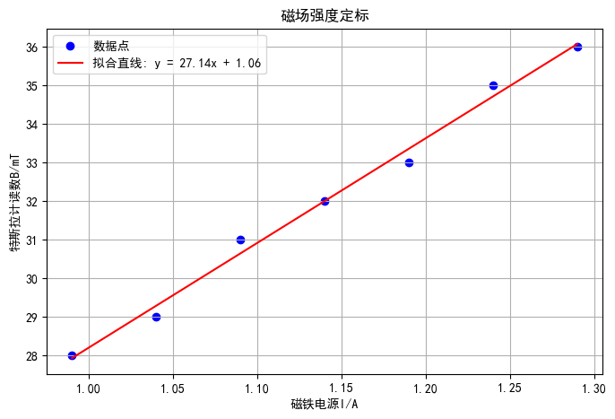
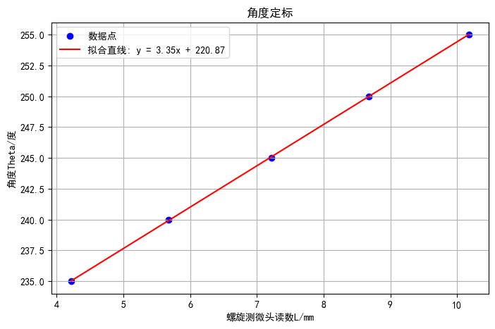
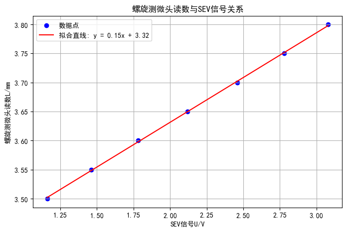
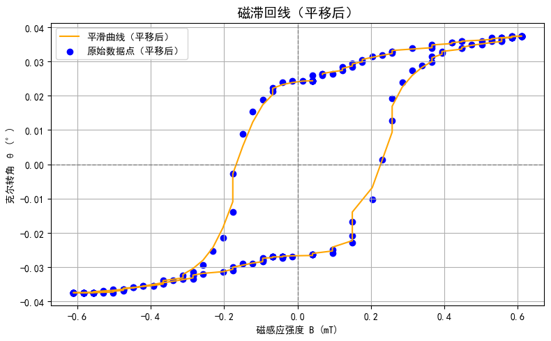

## 数据处理与误差分析

### 磁场强度定标

#### 实验数据

|磁铁电源$I/\mathrm{A} $|$0.99 $|$1.04 $|$1.09 $|$1.14 $|$1.19 $|$1.24 $|$1.29 $|
|:---:|:---:|:---:|:---:|:---:|:---:|:---:|:---:|
|特斯拉计读数 $B/\mathrm{mT} $|$28 $|$29 $|$31 $|$32 $|$33 $|$35 $|$36 $|

#### 拟合曲线

  

根据拟合曲线，磁感应强度 $B(\mathrm{mT}) $ 与磁铁电源 $I(\mathrm{A}) $ 的关系为：

$$
B(\mathrm{mT}) = 27.143\times I(\mathrm{A}) + 1.057 
$$

#### 不确定度

斜率不确定度（A类）：

$$
U(a)
=t(N-2)\cdot \sqrt{\frac{\sum\limits_{i=1}^{N} \left[y_i-\left(\hat{a} x_i + \hat{b}\right)\right]^2 }{(n-2)\sum\limits_{i=1}^{N} (x_i-\bar{x})^2 } }
=3.076
$$

截距不确定度（A类）：

$$
U(b)
=t(N-2)\cdot\sqrt{\frac{\sum\limits_{i=1}^{N} \left[y_i-\left(\hat{a} x_i + \hat{b}\right)\right]^2 }{(n-2) } }\cdot \sqrt{\frac{\bar{x}^2 }{\sum\limits_{i=1}^{N} (x_i-\bar{x})^2 } + \frac{1 }{n }  }
=3.520
$$

置信度为 $0.95. $

### 角度定标

#### 实验数据

|螺旋测微头读数 $L/\mathrm{mm} $|$4.220 $|$5.680 $|$7.215 $|$8.675 $|$10.175 $|
|:---:|:---:|:---:|:---:|:---:|:---:|
|角度 $\theta/ ^\circ $|$235 $|$240 $|$245 $|$250 $|$255 $|

#### 拟合曲线

  

根据拟合曲线，角度 $\theta(^\circ) $ 与螺旋测微头读数 $L(\mathrm{mm}) $ 的关系为：

$$
\theta(^\circ) = 3.354\times L(\mathrm{mm}) + 220.872
$$

#### 不确定度

斜率不确定度（A类）：

$$
U(a)
=t(N-2)\cdot \sqrt{\frac{\sum\limits_{i=1}^{N} \left[y_i-\left(\hat{a} x_i + \hat{b}\right)\right]^2 }{(n-2)\sum\limits_{i=1}^{N} (x_i-\bar{x})^2 } }
=0.060
$$

截距不确定度（A类）：

$$
U(b)
=t(N-2)\cdot\sqrt{\frac{\sum\limits_{i=1}^{N} \left[y_i-\left(\hat{a} x_i + \hat{b}\right)\right]^2 }{(n-2) } }\cdot \sqrt{\frac{\bar{x}^2 }{\sum\limits_{i=1}^{N} (x_i-\bar{x})^2 } + \frac{1 }{n }  }
=0.445
$$

置信度为 $0.95. $

### 螺旋测微器读数与 $\mathrm{SEV} $ 信号关系

#### 实验数据

|$\mathrm{SEV} $ 信号 $U/\mathrm{V} $|$1.16 $|$1.46 $|$1.78 $|$2.12 $|$2.46 $|$2.78 $|$3.08 $|
|:---:|:---:|:---:|:---:|:---:|:---:|:---:|:---:|
|螺旋测微头读数 $L/\mathrm{mm} $|$3.500 $|$3.550 $|$3.600 $|$3.650 $|$3.700 $|$3.750 $|$3.800 $|

#### 拟合曲线

  

根据拟合曲线，螺旋测微读数 $L(\mathrm{mm}) $ 与 $\mathrm{SEV} $ 信号 $U(\mathrm{V}) $ 的关系为：

$$
L(\mathrm{mm}) = 0.154\times U(\mathrm{V}) + 3.323
$$

#### 不确定度

斜率不确定度（A类）：

$$
U(a)
=t(N-2)\cdot \sqrt{\frac{\sum\limits_{i=1}^{N} \left[y_i-\left(\hat{a} x_i + \hat{b}\right)\right]^2 }{(n-2)\sum\limits_{i=1}^{N} (x_i-\bar{x})^2 } }
=0.004
$$

截距不确定度（A类）：

$$
U(b)
=t(N-2)\cdot\sqrt{\frac{\sum\limits_{i=1}^{N} \left[y_i-\left(\hat{a} x_i + \hat{b}\right)\right]^2 }{(n-2) } }\cdot \sqrt{\frac{\bar{x}^2 }{\sum\limits_{i=1}^{N} (x_i-\bar{x})^2 } + \frac{1 }{n }  }
=0.008
$$

置信度为 $0.95. $

### 角度 $\theta $ 与 $\mathrm{SEV} $ 信号 $U $ 的关系

$$
\left\{
\begin{aligned}
&\theta(^\circ) = 3.35\times L(\mathrm{mm}) + 220.87 \\
&L(\mathrm{mm}) = 0.15\times U(\mathrm{V}) + 3.32
\end{aligned}
\right.
\Longrightarrow \theta(^\circ) = 0.5025\times U(\mathrm{V}) + 231.992
$$

### 磁滞回线

计算机自动采集了 $\mathrm{SEV} $ 信号 $U $ 与磁铁电源 $I $ 的关系。

根据定标得到的关系 $\theta(^\circ) = 0.5025\times U(\mathrm{V}) + 231.992 $ 和 $B(\mathrm{mT}) = 27.14\times I(\mathrm{A}) + 1.06 $ 可以得到 $\theta $ 与 $B $ 的关系。

用平滑曲线连结数据点，得到磁滞回线。

最后平移图像，使得磁滞回线的中心与坐标原点重合，得到克尔转角与磁感应强度的关系。

#### 平移后的磁滞回线

  

#### 克尔转角最大差值

$$
\Delta \theta_{k,\max}
=0.075^\circ
$$

### 误差分析

激光光强的波动会导致测量信号的波动，环境光的干扰可能会影响反射光强。可以采用稳定激光源，并在暗室中实验以避免环境光干扰。

光学元件不共轴会降低信噪比，降低磁滞回线的光滑性。在测量前尽量把光路调共轴以提高信噪比。

光学实验平台的微小形变会导致元件高度发生改变，从而降低信噪比。在实验过程中应避免身体倚靠光学实验平台。

## 思考题

### 自己测得克尔转角与讲义图的区别

1）实验测得磁滞回线光滑性不如讲义上的磁滞回线。这是因为实验信噪比低。

### 矫顽力是多少

2）矫顽力是指在磁性材料已经磁化到磁饱和后，要使其磁化强度减到零所需要的磁场强度。从磁滞回线中可以读出，$B_c=0.2~\mathrm{mT} $，矫顽力为

$$
H_c
=\frac{B_c }{\mu_0 } 
=\frac{0.2\times 10^{-3} }{4\pi \times 10^{-7} }~\mathrm{A/m}
=159.15~\mathrm{A/m}
$$

### 如何确定样品包含磁化强度

3）饱和磁化强度 $M_s $ 正比于克尔转角最大值 $\theta_{k,\max} $，因此可以通过饱和磁化强度已知的材料来确定比例系数，而磁滞回线中可读出样品克尔转角的最大值，于是可以确定样品的饱和磁化强度。

