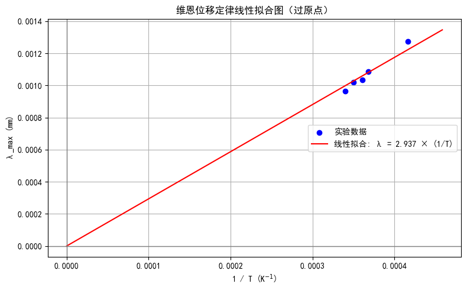
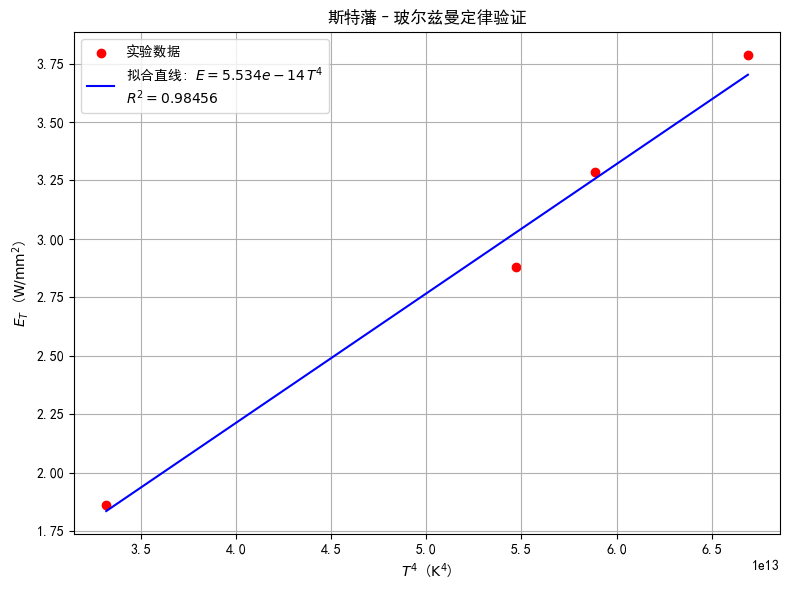
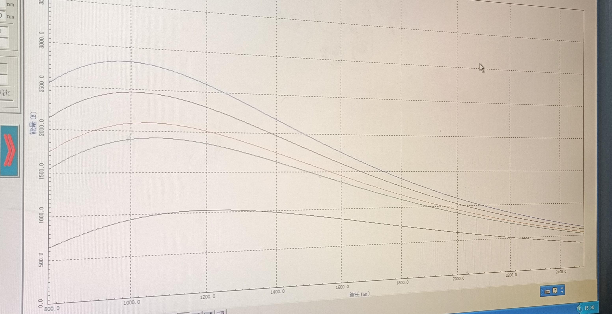

## 四、测量结果与结果分析

### 维恩位移定律

#### 维恩位移定律理论公式

$$
\lambda_{\max} \cdot T = A
$$

可以改写为：

$$
\lambda_{\max}
=A\cdot \frac{1 }{T } 
$$

即 $\lambda_{\max} $ 与 $1/T $ 成正比。

#### 实验数据

||寄存器1|寄存器2|寄存器3|寄存器4|寄存器5|
|:---:|:---:|:---:|:---:|:---:|:---:|
|$\lambda_{\max}(\mathrm{nm}) $|$966 $|$1020 $|$1034 $|$1086 $|$1274 $|
|$T(\mathrm{K}) $|$2940 $|$2860 $|$2770 $|$2720 $|$2400 $|
|$A(\mathrm{mm\cdot K}) $|$2.840 $|$2.917 $|$2.864 $|$2.954 $|$3.058 $|
|$\bar{A}(\mathrm{mm\cdot K}) $|||$2.927 $|||

#### 线性拟合

  

线性拟合所得斜率为：

$$
\bar{A}
=2.937~ \mathrm{mm\cdot K}
$$

与所给 $A=2.896~ \mathrm{mm\cdot K} $ 的相对误差为：$1.4\%$

可见实验数据与理论公式符合得很好。

### 普朗克辐射定律

#### 普朗克辐射定律理论公式

$$
E_\lambda(T)
=\frac{C_1  }{\lambda^5 \left[\exp\left(\frac{C_2 }{\lambda T } \right) - 1 \right] } 
$$

#### 实验数据

$T=2940~\mathrm{K} $：

|波长$\lambda(\mathrm{nm})$|$$838$$|$$1000$$|$$1150$$|$$1394$$|$$1696$$|$$2142$$|
|:---:|:---:|:---:|:---:|:---:|:---:|:---:|
|理论 $E_\lambda(T) (\mathrm{W/mm^3})$|$$2248.9$$|$$2466.6$$|$$2377.4$$|$$1981.8$$|$$1449.5$$|$$877.0$$|
|实测 $E_\lambda(T) (\mathrm{W/mm^3})$|$$2241.2$$|$$2452.5$$|$$2370.9$$|$$1967.7$$|$$1438.5$$|$$871.7$$|
|相对误差 $(\%)$|$$0.34$$|$$0.57$$|$$0.27$$|$$0.71$$|$$0.76$$|$$0.60$$|

$T=2860~\mathrm{K} $：

|波长$\lambda(\mathrm{nm})$|$$866$$|$$1026$$|$$1198$$|$$1394$$|$$1576$$|$$2206$$|
|:---:|:---:|:---:|:---:|:---:|:---:|:---:|
|理论 $E_\lambda(T) (\mathrm{W/mm^3})$|$$1918.4$$|$$2101.2$$|$$2015.5$$|$$1757.2$$|$$1482.3$$|$$752.0$$|
|实测 $E_\lambda(T) (\mathrm{W/mm^3})$|$$1883.3$$|$$2072.8$$|$$1977.0$$|$$1708.1$$|$$1444.6$$|$$728.9$$|
|相对误差 $(\%)$$$1.83$$|$$1.35$$|$$1.91$$|$$2.79$$|$$2.54$$|$$3.07$$|

$T=2770~\mathrm{K} $：

|波长$\lambda(\mathrm{nm})$|$$858~$$|$$974~$$|$$1142~$$|$$1460~$$|$$1698~$$|$$2000~$$|
|:---:|:---:|:---:|:---:|:---:|:---:|:---:|
|理论 $E_\lambda(T) (\mathrm{W/mm^3})$|$$1699.6~$$|$$1882.3~$$|$$1897.9~$$|$$1549~$$|$$1232.4~$$|$$894.9~$$|
|实测 $E_\lambda(T) (\mathrm{W/mm^3})$|$$1498.4~$$|$$1685.3~$$|$$1710~$$|$$1392.3~$$|$$1109.9~$$|$$791.3~$$|
|相对误差 $(\%)$|$$11.83$$|$$10.46$$|$$9.90$$|$$10.12$$|$$9.94$$|$$11.58$$|

$T=2720~\mathrm{K} $：

|波长$\lambda(\mathrm{nm})$|$$856~$$|$$1050~$$|$$1250~$$|$$1542~$$|$$1820~$$|$$2204~$$|
|:---:|:---:|:---:|:---:|:---:|:---:|:---:|
|理论 $E_\lambda(T) (\mathrm{W/mm^3})$|$$743.0~$$|$$977.5~$$|$$1023.8~$$|$$899.4~$$|$$723.1~$$|$$507.9~$$|
|实测 $E_\lambda(T) (\mathrm{W/mm^3})$|$$611.5~$$|$$914.2~$$|$$1020.3~$$|$$933.2~$$|$$721.3~$$|$$503.2~$$|
|相对误差 $(\%)$|$$17.70$$|$$6.47$$|$$0.34$$|$$3.76$$|$$0.25$$|$$0.93$$|

$T=2400~\mathrm{K} $：

|波长$\lambda(\mathrm{nm})$|$$830~$$|$$1078~$$|$$1274~$$|$$1500~$$|$$1802~$$|$$2134~$$|
|:---:|:---:|:---:|:---:|:---:|:---:|:---:|
|理论 $E_\lambda(T) (\mathrm{W/mm^3})$|$$696.1~$$|$$994.5~$$|$$1019.7~$$|$$924.1~$$|$$734.5~$$|$$542.7~$$|
|实测 $E_\lambda(T) (\mathrm{W/mm^3})$|$$334.3~$$|$$564.2~$$|$$612.3~$$|$$564.2~$$|$$450.8~$$|$$317.9~$$|
|相对误差 $(\%)$|$$51.97$$|$$43.27$$|$$39.95$$|$$38.94$$|$$38.62$$|$$41.42$$|

#### 结果分析

黑体辐射的理论描述基于普朗克定律，预测：光谱分布随温度升高而向短波方向移动；同一波长下，辐射强度随温度升高显著增加。

从五组数据（分别对应 $T=2400~\mathrm{K}$ 至 $2940~\mathrm{K}$）来看：理论值随温度递增趋势明显；实测值基本随理论变化同步，即在相同波长下，温度越高，实测辐射强度也越大；

实验验证了黑体辐射与温度相关的物理规律，符合理论预期。

从温度来看，温度越高，相对误差越小，低温段（$T=2400~\mathrm{K} $） 的相对误差较大。这说明高温段实验更接近理想黑体模型。

### 斯特藩-玻尔兹曼定律

#### 斯特藩-玻尔兹曼定律理论公式

$$
E_T
=\delta T^4,\quad
\delta
=5.670\times 10^{-14}~\mathrm{W/\left(mm^2 K^4 \right)}
$$

#### 实验数据

||寄存器2|寄存器3|寄存器4|寄存器5|
|:---:|:---:|:---:|:---:|:---:|
|$T(\mathrm{K}) $|$2860 $|$2770 $|$2720 $|$2400 $|
|$E_T(\mathrm{W/mm^2}) $|$3.7862 $|$3.2876 $|$2.8792 $|$1.8609 $|
|$T^4(\mathrm{K^4}) $|$6.6906\times 10^{13} $|$5.8873\times 10^{13} $|$5.4736\times 10^{13} $|$3.3178\times 10^{13} $|
|$\delta\left(\mathrm{W/\left(mm^2 K^4 \right)} \right) $|$5.6591\times 10^{-14} $|$5.5842\times 10^{-14} $|$5.2601\times 10^{-14} $|$5.6090\times 10^{-14} $|
|$\bar{\delta}\left(\mathrm{W/\left(mm^2 K^4 \right)} \right) $||$5.5281\times 10^{-14} $|||

#### 线性拟合

  

### 绝对黑体的理论谱线

  

#### 结果分析

实验数据基本符合 $E_T \propto T^4$ 的关系；

拟合平均值 $\bar{\delta} \approx 5.53 \times 10^{-14}$，非常接近理论值，验证了斯特藩–玻尔兹曼定律在该温度范围内的适用性。

实验误差可能来源于温度测量不准、辐射不完全吸收、仪器校准误差等。

## 五、归一化原因

实验中验证斯特藩-玻尔兹曼定律时为什么要对曲线进行归一化？

实际测量的辐射功率 $E_T$ 不仅与温度有关，还可能受到其他因素影响，使得测量值和实际值相差一个比例系数。归一化可以有效去除比例系数的影响。

## 六、实验收获

实验过程中测量的是辐射功率与温度的关系，从数据出发、推导出黑体辐射规律，有助于真正理解辐射能量如何随温度快速增长；

结合普朗克公式、维恩位移定律等知识，可以将热辐射的微观机制（量子辐射）与宏观规律联系起来；

熟悉如何通过线性拟合方法分析 $E_T$ 与 $T^4$ 的关系、$\lambda_{\max} $ 与 $1/T $ 的关系；

掌握数据归一化处理与结果可视化。